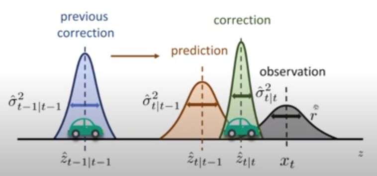

# Kalman Filter

**Summary**: assumed a system having Gaussian noise covariances $\mathbf{Q}_k$ and $\mathbf{R}_k$ on state transformation $\mathbf{F}_k$ on $\mathbf{x}_k$ and state observation $\mathbf{z}_k$, respectively, 
given a sufficient number of iterations $k \rightarrow \infty$, by optimizing Kalman gain $\mathbf{K}$, 
the expected mean-squared error between the ground truth state $\mathbf{x}_k$ and estimation state $\mathbf{\hat{x}}\_{k}$ should be minimized 
$$
arg \space \underset{\mathbf{K}}{min} \space 
E \big(
    ||\mathbf{x}_k-\mathbf{\hat{x}}\_{k|k}||^2
    \big)
$$ 
with fluctuations compliant with its covariances $cov(\mathbf{x}_k-\mathbf{\hat{x}}\_{k|k})$.

### Model assumptions

* Dynamic transformation

Given a state transformation $\mathbf{F}_k$ on the previous state $\mathbf{x}\_{k-1}$, and added dynamic $\mathbf{B}_k \mathbf{u}_k$ ($\mathbf{B}_k$ is the action transformation and $\mathbf{u}_k$ is the action input), plus Gaussian noises $\mathbf{w}_k \sim N(0, \mathbf{Q}_k)$ 

$$
\mathbf{x}\_{k}=
\mathbf{F}_k\mathbf{x}\_{k-1} + \mathbf{B}_k \mathbf{u}_k + \mathbf{w}_k
$$

* Observation 

Given theoretical state observation/measurement transform $\mathbf{H}_k$ and the observed state $\mathbf{z}_k$, plus Gaussian noises $\mathbf{v}_k \sim N(0, \mathbf{R}_k)$

$$
\mathbf{z}_k=
\mathbf{H}_k \mathbf{x}_k + \mathbf{v}_k
$$

### Predict phase

Predicted (a priori) state estimate
$$
\mathbf{\hat{x}}\_{k|k-1}=
\mathbf{F}_k\mathbf{x}\_{k-1|k-1} + \mathbf{B}_k \mathbf{u}_k
$$

Predicted (a priori) estimate covariance
$$
\mathbf{\hat{P}}\_{k|k-1}=
\mathbf{F}_k\mathbf{P}\_{k-1|k-1} \mathbf{F}^\text{T}_k + \mathbf{Q}_k
$$

### Update phase

Innovation or measurement pre-fit residual
$$
\mathbf{\hat{y}}_k=
\mathbf{z}_k-\mathbf{H}_k \mathbf{\hat{x}}\_{k|k-1}
$$

Innovation (or pre-fit residual) covariance
$$
\mathbf{{S}}\_{k}=
\mathbf{H}_k \mathbf{\hat{P}}\_{k|k-1} \mathbf{H}^\text{T}_k + \mathbf{R}_k
$$

Optimal Kalman gain
$$
\mathbf{K}_k=
\mathbf{\hat{P}}\_{k|k-1} \mathbf{H}^\text{T}_k \mathbf{{S}}\_{k}^{-1}
$$

Updated (a posteriori) state estimate
$$
\mathbf{x}\_{k|k}=
\mathbf{\hat{x}}\_{k|k-1} + \mathbf{K}_k \mathbf{\hat{y}}_k
$$

Updated (a posteriori) estimate covariance
$$
\mathbf{P}\_{k|k}=
(\mathbf{I}-\mathbf{K}_k \mathbf{H}) \mathbf{\hat{P}}\_{k|k-1}
$$

Measurement post-fit residual
$$
\mathbf{\hat{y}}\_{k|k}=
\mathbf{z}_k - \mathbf{H}_k \mathbf{x}\_{k|k}
$$

## Derivations

### Deriving the *posteriori* estimate covariance matrix

Starting with invariant on the error covariance:
$$
\begin{align*}
\mathbf{P}\_{k|k}&=
cov(\mathbf{x}_k - \mathbf{\hat{x}}\_{k|k})
\\\\ &=
cov \big(
        \mathbf{x}_k - (\mathbf{\hat{x}}\_{k|k-1} + \mathbf{K}\_{k} \mathbf{\hat{y}}_k)
    \big)
\\\\ &=
cov \big(
        \mathbf{x}_k - 
        (\mathbf{\hat{x}}\_{k|k-1} + \mathbf{K}\_{k} 
            (\mathbf{z}_k - \mathbf{H}_k \mathbf{\hat{x}}\_{k|k-1})
        )
    \big)
\\\\ &=
cov \big(
        \mathbf{x}_k - 
        (\mathbf{\hat{x}}\_{k|k-1} + \mathbf{K}\_{k} 
            (\mathbf{H}_k\mathbf{x}_k + \mathbf{v}_k - \mathbf{H}_k \mathbf{\hat{x}}\_{k|k-1}
            )
        )
    \big)
\\\\ &=
cov \big(
        (\mathbf{I}-\mathbf{K}_k\mathbf{H}_k)
        (\mathbf{x}_k - \mathbf{\hat{x}\_{k|k-1}})
        - \mathbf{K}_k \mathbf{v}_k
    \big) \\\\
\mathbf{v}_k & \text{ is uncorrelated with the other terms} 
\\\\ &=
cov \big(
        (\mathbf{I}-\mathbf{K}_k\mathbf{H}_k)
        (\mathbf{x}_k - \mathbf{\hat{x}\_{k|k-1}})
    \big)
-
cov(\mathbf{K}_k \mathbf{v}_k) \\\\
\text{by} & \text{ the properties of vector covariance}
\\\\ &=
(\mathbf{I}-\mathbf{K}_k\mathbf{H}_k)
cov(\mathbf{x}_k - \mathbf{\hat{x}\_{k|k-1}})
(\mathbf{I}-\mathbf{K}_k\mathbf{H}_k)^\text{T}
+
\mathbf{K}_k
cov(\mathbf{v}_k)
\mathbf{K}_k^\text{T}
\\\\ &=
(\mathbf{I}-\mathbf{K}_k\mathbf{H}_k)
\mathbf{P}\_{k|k-1}
(\mathbf{I}-\mathbf{K}_k\mathbf{H}_k)^\text{T}
+
\mathbf{K}_k
\mathbf{R}_k
\mathbf{K}_k^\text{T}
\end{align*}
$$

### Deriving Kalman gain

Starting from the minimization problem
$$
arg \space \underset{\mathbf{K}}{min} \space 
E \big(
    ||\mathbf{x}_k-\mathbf{\hat{x}}\_{k|k}||^2
    \big)
$$ 

For $k=0,1,2,...,n$, 
given $\mathbf{x}_k \in \mathbb{R}^m$, 
by vector dot product as the squared operation, 
there is 
$$
\begin{align*}
\sum^n\_{k=0}
||\mathbf{x}_k-\mathbf{\hat{x}}\_{k|k}||^2&=
\sum^n\_{k=0}
(\mathbf{x}_k-\mathbf{\hat{x}}\_{k|k})^\text{T}
(\mathbf{x}_k-\mathbf{\hat{x}}\_{k|k})
\\\\ &=
\sum^n\_{k=0}
\bigg(
\begin{bmatrix}
x_{k,1} \\\\
x_{k,2} \\\\
\vdots \\\\
x_{k,m}
\end{bmatrix}
-
\begin{bmatrix}
\hat{x}\_{k,1} \\\\
\hat{x}\_{k,2} \\\\
\vdots \\\\
\hat{x}\_{k,m}
\end{bmatrix}
\bigg)^\text{T}
\bigg(
\begin{bmatrix}
x_{k,1} \\\\
x_{k,2} \\\\
\vdots \\\\
x_{k,m}
\end{bmatrix}
-
\begin{bmatrix}
\hat{x}\_{k,1} \\\\
\hat{x}\_{k,2} \\\\
\vdots \\\\
\hat{x}\_{k,m}
\end{bmatrix}
\bigg)
\end{align*}
$$ 

So that, the expected error is 
$$
E \big(
    ||\mathbf{x}_k-\mathbf{\hat{x}}\_{k|k}||^2
    \big)=
\frac{\sum^n\_{k=0}
||\mathbf{x}_k-\mathbf{\hat{x}}\_{k|k}||^2}
{n}
$$

$cov(\mathbf{x}_k - \mathbf{\hat{x}}\_{k|k})$ (the formal writing should be $cov(\mathbf{x}_k - \mathbf{\hat{x}}\_{k|k}, \mathbf{x}_k - \mathbf{\hat{x}}\_{k|k})$, here is a shorthand note) describes a covariance of a vector $\mathbf{x}_k - \mathbf{\hat{x}}\_{k|k}$ with the vector itself, so that 
$$
cov(\mathbf{x}_k - \mathbf{\hat{x}}\_{k|k},)=
\begin{bmatrix}
\sigma^2_{1} & 0 &  & 0 \\\\
0 & \sigma^2_{2} &  & 0 \\\\
 &  & \ddots & 0 \\\\
0 & 0 &  &  \sigma^2_{m} \\\\
\end{bmatrix}
$$

Each covariance's entry $\sigma_i^2$ is the mean of each error vector element's squared sum $\frac{1}{n} \sum_{k=0}^n(x_{k,i}-\hat{x}\_{k,i})^2$. Therefore, 
$$
E \big(
    ||\mathbf{x}_k-\mathbf{\hat{x}}\_{k|k}||^2
    \big)=
tr \big(
    cov(\mathbf{x}_k - \mathbf{\hat{x}}\_{k|k})
    \big)
$$ 
where $tr$ denotes the trace of the covariance matrix.

Consequently, the minimization problem becomes:
$$
arg \space \underset{\mathbf{K}}{min} \space
tr \big(
    cov(\mathbf{x}_k - \mathbf{\hat{x}}\_{k|k})
    \big)
$$

Remember, we have obtained the covariance expression for this error, the *posteriori* estimate covariance matrix $\mathbf{P}\_{k|k}=cov(\mathbf{x}_k - \mathbf{\hat{x}}\_{k|k})$, with the engagement of Kalman gain $\mathbf{K}$, so that, by setting its first order derivative to zero, there is

$$
\begin{align*}
\frac{\partial tr(\mathbf{P}\_{k|k})}{\partial \mathbf{K}}&=
\frac{\partial }{\partial \mathbf{K}}
tr
\big(
    cov(\mathbf{x}_k - \mathbf{\hat{x}}\_{k|k})
\big)
\\\\ &=
\frac{\partial }{\partial \mathbf{K}}
tr
\big(
    (\mathbf{I}-\mathbf{K}_k\mathbf{H}_k)
    \mathbf{P}\_{k|k-1}
    (\mathbf{I}-\mathbf{K}_k\mathbf{H}_k)^\text{T}
    +
    \mathbf{K}_k
    \mathbf{R}_k
    \mathbf{K}_k^\text{T}
\big)
\\\\ &=
\frac{\partial }{\partial \mathbf{K}}
tr
\big(
    \mathbf{P}\_{k|k-1}-\mathbf{K}_k\mathbf{H}_k\mathbf{P}\_{k|k-1}
    - \mathbf{P}\_{k|k-1}\mathbf{H}_k^\text{T}\mathbf{K}_k^\text{T}
    + \mathbf{K}_k \mathbf{S}_k \mathbf{K}_k^\text{T}
\big)
\\\\ &=
2(\mathbf{H}_k\mathbf{P}\_{k|k-1})^\text{T}
+
2 \mathbf{K}_k \mathbf{S}_k
\\\\ &= 0
\end{align*}
$$

The Kalman gain $\mathbf{K}_k$ can be computed:
$$
\mathbf{K}_k = 
-(\mathbf{H}_k\mathbf{P}\_{k|k-1})^\text{T} \mathbf{S}_k^{-1}
$$

## Convergence

In the long term, the mean squared error should be nearly zero given a sufficient number of iterations.  
$$
E \big(
    ||\mathbf{x}_k-\mathbf{\hat{x}}\_{k|k}||^2
    \big)
\approx 0
$$

The $cov(\mathbf{x}_k - \mathbf{\hat{x}}\_{k|k})$ 's expression taking into consideration $\mathbf{P}$ (accounts for dynamic transformation covariance $\mathbf{Q}$) and $\mathbf{H}$ (accounts for observation transformation covariance $\mathbf{R}$) is viewed as the ground truth.

This means, the ratio Kalman filter $\mathbf{K}_k$ is a compromise between the dynamic model's and measurement's Gaussian distribution samplings. The correction by $\mathbf{K}_k$ can only be optimal when $\mathbf{Q}$ and $\mathbf{R}$ are accurate (the fluctuations of $\mathbf{\hat{x}}\_{k|k-1}$ and $\mathbf{z_k}$ are contained in $\mathbf{Q}$ and $\mathbf{R}$).

In other words, $\mathbf{K}_k \mathbf{\hat{y}}_k$ can be a good compensation to $\mathbf{\hat{x}}\_{k|k-1}$ when $\mathbf{\hat{y}}_k$ is contained in $\mathbf{R}$, and $\mathbf{K}_k$ in $\mathbf{R}$ and $\mathbf{Q}$, respectively.

$$
\mathbf{x}\_{k|k}=
\mathbf{\hat{x}}\_{k|k-1} + \mathbf{K}_k \mathbf{\hat{y}}_k
$$

## Example

Distance $x$ and velocity $\dot{x}$ of a vehicle is given below
$$
\mathbf{x} = 
\begin{bmatrix}
x \\\\
\dot{x}
\end{bmatrix}
$$

Vehicle drives with a constant acceleration $a_k$ between two timesteps $k-1$ and $k$, following normal distribution with mean $0$ and standard deviation $\sigma_a$. Given Newton's laws of motion:
$$
\mathbf{x}_k = \mathbf{F} \mathbf{x}\_{k-1} + \mathbf{B} a_k
$$

where
$$
\mathbf{F} = 
\begin{bmatrix}
1 & \Delta t \\\\
0 & 1
\end{bmatrix}
, \space
\mathbf{B} = 
\begin{bmatrix}
\frac{1}{2} \Delta t^2 \\\\
\Delta t
\end{bmatrix}
$$

Given $a_k$ following normal distribution, there is (remember $E(a_k)=0$, so that in the dynamic model, $\mathbf{B}\mathbf{u}$ is removed)

$$
\mathbf{x}_k = \mathbf{F} \mathbf{x}\_{k-1} + \mathbf{w}_k
$$

where $\mathbf{w}_k \sim N(0, \mathbf{Q})$ (remember the noise $\mathbf{w}_k$ is associated with the acceleration, so only $\sigma_{a_k}\mathbf{B}$ is considered as the standard deviation, not included $\mathbf{F}_k$), in which 
$$
\mathbf{Q} = \sigma_{a_k}\mathbf{B} \mathbf{B}^\text{T} \sigma_{a_k} =
\begin{bmatrix}
\frac{1}{4}\Delta t^4 & \frac{1}{2}\Delta t^3 \\\\
\frac{1}{2}\Delta t^3 & \Delta t^2
\end{bmatrix}
\sigma_{a_k}^2
$$

Since $\mathbf{B}\mathbf{B}^\text{T}$ is not full ranked ($R_1 = [\frac{1}{4}\Delta t^4, \frac{1}{2}\Delta t^3] = \frac{1}{2}\Delta t^3 R_2$) hence 
$\mathbf{w}_k \sim \mathbf{B} \cdot N(0, \mathbf{Q}) \sigma_{a_k}^2 \sim \mathbf{B} \cdot N (0, \sigma_{a_k}^2)$

Here defines observation 
$$
\mathbf{z}_k = \mathbf{H} \mathbf{x}_k + \mathbf{v}_k
$$

where $\mathbf{H}=[1 \quad 0]$, that only the traveled distance is measured.

Here $\mathbf{R} = E[\mathbf{v}_k \mathbf{v}_k^T] = [\sigma_{z}^2]$, since $\mathbf{z}_k$ is one-dimensional only measuring traveled distance noises.

$\mathbf{P}\_{0|0}$ is the initial covariance matrix when $k=0$. In this case, assume we have high confidence of the initial vehicle state, so that $\sigma_x=0$ and $\sigma_{\dot{x}}=0$
$$
\mathbf{P}\_{0|0} = 
\begin{bmatrix}
\sigma_x^2 & 0 \\\\
0 & \sigma_{\dot{x}}^2
\end{bmatrix}=
\begin{bmatrix}
0 & 0 \\\\
0 & 0
\end{bmatrix}
$$

Here assumes a vehicle starts from $0$ distance with a velocity $v_0$
$$
\mathbf{\hat{x}}\_{0|0} = 
\begin{bmatrix}
x \\\\
\dot{x}
\end{bmatrix}=
\begin{bmatrix}
0 \\\\
v_0
\end{bmatrix}
$$

### One iteration

The below computation expressions removed the subscript $k$ if a matrix is constant for all $k=0,1,2,...,\infty$.

* Prediction

$$
\begin{align*}

\mathbf{\hat{x}}\_{1|0}&=
\mathbf{F} \mathbf{x}\_{0|0} + \mathbf{B}_k \mathbf{u}_k
\\\\ &=
\begin{bmatrix}
1 & \Delta t \\\\
0 & 1
\end{bmatrix}
\begin{bmatrix}
0 \\\\
v_0
\end{bmatrix}
\\\\ &=
\begin{bmatrix}
\Delta t v_0 \\\\
v_0
\end{bmatrix}
\end{align*}
$$

$$
\begin{align*}
\mathbf{\hat{P}}\_{1|0}&=
\mathbf{F} \mathbf{P}\_{0|0} \mathbf{F}^\text{T} + \mathbf{Q}
\\\\ &=
\begin{bmatrix}
1 & \Delta t \\\\
0 & 1
\end{bmatrix}
\begin{bmatrix}
\sigma_x^2 & 0 \\\\
0 & \sigma_{\dot{x}}^2
\end{bmatrix}
\begin{bmatrix}
1 & 0 \\\\
\Delta t & 1
\end{bmatrix}+\mathbf{Q}
\\\\ &=
\begin{bmatrix}
\sigma_x^2 & \Delta t \sigma_{\dot{x}}^2 \\\\
0 & \sigma_{\dot{x}}^2 
\end{bmatrix}
\begin{bmatrix}
1 & 0 \\\\
\Delta t & 1
\end{bmatrix}+\mathbf{Q}
\\\\ &=
\begin{bmatrix}
\sigma_x^2+\Delta t^2 \sigma_{\dot{x}}^2  & \Delta t \sigma_{\dot{x}}^2 \\\\
\Delta t \sigma_{\dot{x}}^2 & \sigma_{\dot{x}}^2 
\end{bmatrix}+\mathbf{Q}
\\\\ &=
\begin{bmatrix}
\sigma_x^2+\Delta t^2 & \Delta t \sigma_{\dot{x}}^2 \\\\
\Delta t^2 \sigma_{\dot{x}}^2 & \sigma_{\dot{x}}^2 
\end{bmatrix}
+
\begin{bmatrix}
\frac{1}{4}\Delta t^4 & \frac{1}{2}\Delta t^3 \\\\
\frac{1}{2}\Delta t^3 & \Delta t^2
\end{bmatrix}
\sigma_{a_k}^2 \\\\
\text{If} & \text{ both } \sigma_x=0 \text{ and } \sigma_{\dot{x}}=0
\\\\ &=
\begin{bmatrix}
\frac{1}{4}\Delta t^4 & \frac{1}{2}\Delta t^3 \\\\
\frac{1}{2}\Delta t^3 & \Delta t^2
\end{bmatrix}
\sigma_{a_k}^2
\\\\ &=
\mathbf{Q}
\end{align*}
$$

* Update

Assume that observation is 
$$
\mathbf{z}_1=
\begin{bmatrix}
\Delta t v_0 \pm \sigma_z\\\\
0
\end{bmatrix}
$$

So that

$$
\begin{align*}

\mathbf{\hat{y}}_1&=
\mathbf{z}_1-\mathbf{H} \mathbf{\hat{x}}\_{1|0}
\\\\ &=
\begin{bmatrix}
\Delta t v_0 \pm \sigma_z\\\\
0
\end{bmatrix}
-
\begin{bmatrix}
\Delta t v_0 \\\\
0
\end{bmatrix}
\\\\ &=
\begin{bmatrix}
\pm \sigma_z \\\\
0
\end{bmatrix}
\end{align*}
$$

$$
\begin{align*}
\mathbf{{S}}\_{1}&=
\mathbf{H} \mathbf{\hat{P}}\_{1|0} \mathbf{H}^\text{T} + \mathbf{R}
\\\\ &=
\begin{bmatrix}
1 & 0 
\end{bmatrix}
\begin{bmatrix}
\frac{1}{4}\Delta t^4 & \frac{1}{2}\Delta t^3 \\\\
\frac{1}{2}\Delta t^3 & \Delta t^2
\end{bmatrix}
\sigma_{a_k}^2
\begin{bmatrix}
1 \\\\
0 
\end{bmatrix}
+
\sigma_{z}^2
\\\\ &=
\begin{bmatrix}
\frac{1}{4}\Delta t^4 & \frac{1}{2}\Delta t^3 
\end{bmatrix}
\sigma_{a_k}^2
\begin{bmatrix}
1 \\\\
0 
\end{bmatrix}
+
\sigma_{z}^2
\\\\ &=
\frac{1}{4}\Delta t^4 \sigma_{a_k}^2
+
\sigma_{z}^2
\end{align*}
$$

$$
\begin{align*}
\mathbf{K}_1&=
\mathbf{\hat{P}}\_{1|0} \mathbf{H}^\text{T} \mathbf{{S}}\_{1}^{-1}
\\\\ &=
\frac{1}{
    \frac{1}{4}\Delta t^4 \sigma_{a_k}^2
    +
    \sigma_{z}^2
    }
\begin{bmatrix}
\frac{1}{4}\Delta t^4 & \frac{1}{2}\Delta t^3 \\\\
\frac{1}{2}\Delta t^3 & \Delta t^2
\end{bmatrix}
\sigma_{a_k}^2
\begin{bmatrix}
1 \\\\
0 
\end{bmatrix}
\\\\ &=
\frac{1}{
    \frac{1}{4}\Delta t^4 \sigma_{a_k}^2
    +
    \sigma_{z}^2
    }
\begin{bmatrix}
\frac{1}{4}\Delta t^4 & \frac{1}{2}\Delta t^3 
\end{bmatrix}
\sigma_{a_k}^2
\end{align*}
$$

$$
\begin{align*}

\mathbf{x}\_{1|1}&=
\mathbf{\hat{x}}\_{1|0} + \mathbf{K}_1 \mathbf{\hat{y}}_1
\\\\ &=
\begin{bmatrix}
\Delta t v_0 \\\\
v_0
\end{bmatrix}
+
\frac{1}{
    \frac{1}{4}\Delta t^4 \sigma_{a_k}^2
    +
    \sigma_{z}^2
    }
\begin{bmatrix}
\frac{1}{4}\Delta t^4 & \frac{1}{2}\Delta t^3 
\end{bmatrix}
\sigma_{a_k}^2
\begin{bmatrix}
\pm \sigma_z \\\\
0
\end{bmatrix}
\\\\ &=
\begin{bmatrix}
\Delta t v_0 \\\\
v_0
\end{bmatrix}
+
\frac
{
    1
}
{
    \frac{1}{4}\Delta t^4 \sigma_{a_k}^2
    +
    \sigma_{z}^2
}
\begin{bmatrix}
        \pm \sigma_z
        \frac{1}{4}\Delta t^4
        \sigma_{a_k}^2
    \\\\
        0
    \end{bmatrix}
\end{align*}
$$
