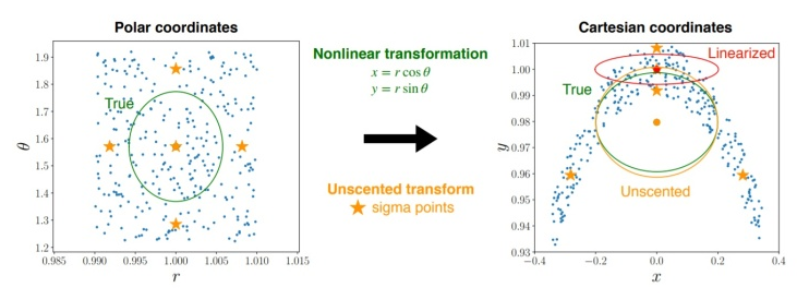

# Kalman filters for non-linear problems

## Extended Kalman filter (EKF)

For non-linear dynamic and observation transformation:
$$
\begin{align*}
\bold{x}_{k}
&=
f(
    \bold{x}_{k-1|k-1}, \bold{u}_k
)
+ \bold{w}_k
\\
\bold{z}_{k}
&=
h(\bold{x}_k)+\bold{v}_k
\end{align*}
$$
where $f$ and $h$ denote the non-linear transformation.

Redefine $\bold{F}_k$ and $\bold{H}_k$ to be the Jacobian matrices of $f$ and $h$, respectively. 
$$
\begin{align*}
\bold{F}_k
&=
\frac{\partial f}{\partial \bold{x}}
\bigg|_{\bold{x}_{k-1|k-1}, \bold{u}_k}
\\
\bold{H}_k
&=
\frac{\partial h}{\partial \bold{x}}
\bigg|_{\bold{x}_{k|k-1}}
\end{align*}
$$

The computation for $\bold{K}_k$ is identical to its linear Kalman counterpart.

Predicted (a priori) estimate covariance
$$
\bold{\hat{P}}_{k|k-1}
=
\bold{F}_k\bold{P}_{k-1|k-1} \bold{F}^\text{T}_k + \bold{Q}_k
$$

Innovation (or pre-fit residual) covariance
$$
\bold{{S}}_{k}
=
\bold{H}_k \bold{\hat{P}}_{k|k-1} \bold{H}^\text{T}_k + \bold{R}_k
$$

Optimal Kalman gain
$$
\bold{K}_k
=
\bold{\hat{P}}_{k|k-1} \bold{H}^\text{T}_k \bold{{S}}_{k}^{-1}
$$

### Convergence discussions

For non-linear transformation, EKF uses first- or second-order derivatives as approximations. The Gaussian noises $\bold{Q}$ and $\bold{R}$ are applied to the whole non-linear transformations $f$ and $h$, whereas EKF Kalman gain $\bold{K}_k$ only covers the first- or second-order derivative. 

This leads to precision loss when $k \rightarrow \infty$, since higher order derivatives are not considered, and the lost precision errors accumulate over the time.

Besides, sampling intervals should be small, otherwise, the first- or second-order Taylor expansion does not provide good approximations.

## Unscented Kalman filter (UKF)

To resolve the time-consuming Jacobian computation as well as first-order derivative induced loss of precision, UKF instead directly samples from history data (the selected points are called *sigma points*), by which the covariances are formed.

### Sampling

Define a random variable $\bold{x} \in \mathbb{R}^d$ assumed exhibited normal distribution (of a mean $\bold{\overline{x}}$ and covariance $\bold{P_\bold{x}}$ ) sampling behavior.

Sampling follows *Gauss-Hermite quadrature*, that describes the general rule of sampling on a linear/non-linear transformation result of a normal distribution input $\bold{y}=g(\bold{x})$.

Define a matrix $\bold{X}$ consisted of $2d+1$ *sigma* vectors $X_i$ with corresponding weight $W_i$.

$$
\begin{align*}
X_0 &= \bold{\overline{x}}
\\
X_i &= 
\bold{\overline{x}} + (\sqrt{(d+\lambda)\bold{P_\bold{x}}})_i 
\quad
\quad i=1,2,...,d
\\
X_i &= 
\bold{\overline{x}} + (\sqrt{(d+\lambda)\bold{P_\bold{x}}})_{i-d} 
\quad i=d+1,d+2,...,2d

\\
W_0^{(m)} &=\frac{\lambda}{d+\lambda}
\\
W_0^{(c)} &=\frac{\lambda}{d+\lambda}
+ (1+\alpha^2+\beta)
\\
W_i^{(m)}=W_i^{(m)} &=
\frac{1}{2(d+\lambda)}
\quad\quad\quad\quad\quad\quad i=1,2,...,2d
\end{align*}
$$
where 
* $\lambda=\alpha^2(d+\kappa)-d$ is a scaling parameter
* $\alpha \in (0,1]$ determines the spread of the sigma points
* $\kappa \ge 0$ is a secondary scaling parameter 
* $\beta$ is used to incorporate prior knowledge of Gaussian distribution ($\beta=2$ is optimal by experience).
* $\sqrt{(d+\lambda)\bold{P_\bold{x}}}$ is the $i$-th row of the matrix square root