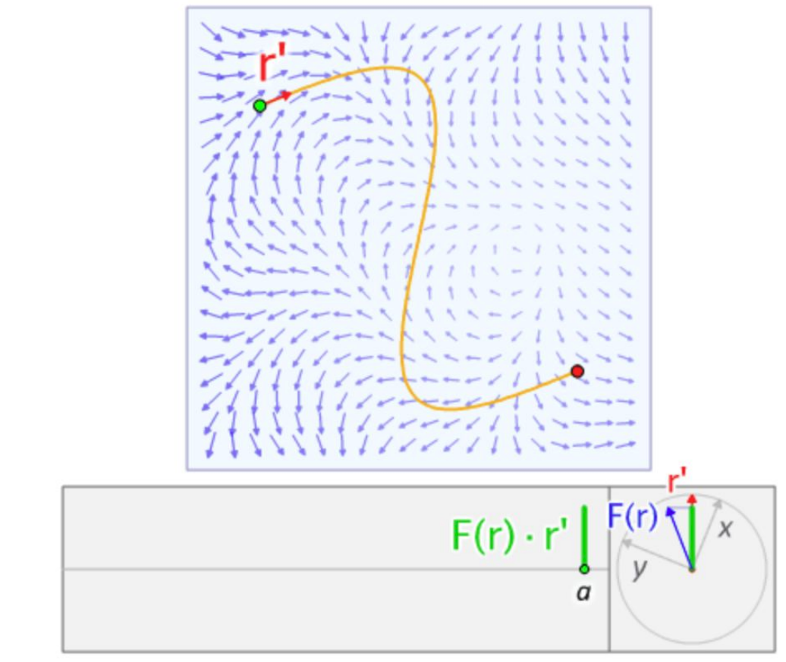
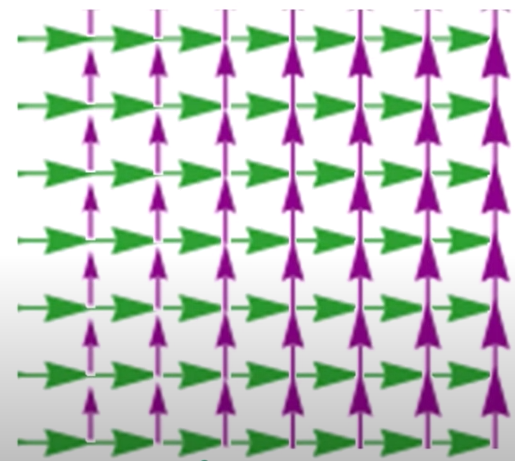
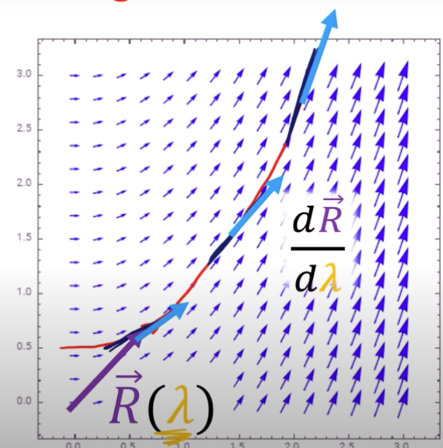
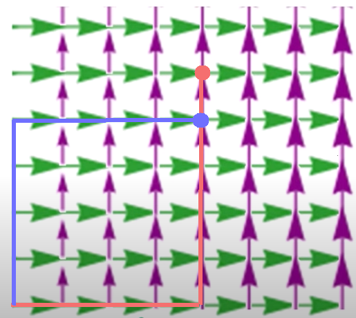

# Lie Bracket

Generally speaking, Lie bracket describes local differences between Lie algebra. 

For example, Lie bracket of two points $X,Y$ on a Lie Group $SO(3)$ describes their tangen $so(3)$ (Lie algebra) differences.

## Intuition: Vector Fields as Derivative and Lie Bracket

### Vector Function $\mathbf{f}(x)$

Vector function $\mathbf{f}(x):R^n \rightarrow R^n$ defines a mapping relationship from $\mathbf{x} \in R^n$ to $\mathbf{f}(x) \in R^n$ which is called *Vector Field*.

Furthermore, if $\mathbf{f}$ is of having an indefinite degree of derivative $C^{\infty}$ and is continuous, $\mathbf{f}$ is a *Smooth Vector Field*.

### Smooth Scalar Function $h(x)$

Smooth scalar function $h(\mathbf{x}):\mathbb{R}^n \rightarrow \mathbb{R}$ defines a mapping relationship from $\mathbf{x} \in \mathbb{R}^n$ to $h(\mathbf{x}) \in \mathbb{R}$, whose *gradient* is a $1 \times n$ vector $\nabla h = \frac{\partial h}{\partial \mathbf{x}}$.

### Smooth Vector Field $\mathbf{f}(x)$

A smooth vector field $\mathbf{f}$'s *Jacobian* is an $n \times n$ matrix $\nabla  \mathbf{f} =  \frac{\partial \mathbf{\mathbf{f}}}{\partial \mathbf{x}}$

### Lie Derivative in A Vector Field

A smooth scalar function $h(\mathbf{x})$ to a smooth vector field $\mathbf{f}(\mathbf{x})$'s *Lie Derivative* is a $1 \times n$ vector $L_\mathbf{f} h = \nabla h \mathbf{f} = \frac{\partial h}{\partial \mathbf{x}} \mathbf{f}$

For example as in the below, $\mathbf{f}$ is represented by blue arrows as a vector field that excerts pressure on the moving object the green dot.

$\nabla h$ is the velocity $r'$, hence, $L_\mathbf{f} h = \nabla h \mathbf{f}$ is the power by $\mathbf{f}$ on the object, and the work is to take line integral along its trajectory (the yellow curve).

Remember, $r'$ is a scalar having no direction.

      

 

### Lie Bracket in Vector Fields

Define two vector field functions: 
$\mathbf{f}(x):R^n \rightarrow R^n$ and $\mathbf{g}(x):R^n \rightarrow R^n$. The Lie bracket $[\mathbf{f}, \mathbf{g}]$ is an operator that assigns to any two vector fields $\mathbf{f}$ and $\mathbf{g}$ on a smooth manifold $M$ a third vector field denoted $[X, Y]$.

Formally, Lie Bracket in vector fields can be generalized with the below form

$$
[\mathbf{f},\mathbf{g}] = \nabla \mathbf{g} \mathbf{f} - \nabla \mathbf{f} \mathbf{g}=
\frac{\partial \mathbf{g}}{\partial \mathbf{x}}\mathbf{f} - \frac{\partial \mathbf{f}}{\partial \mathbf{x}}\mathbf{g}
$$

### Example - Lie Bracket in Vector Fields

Set $\mathbf{e}_x=[1 \quad 0]^\text{T}$ and $\mathbf{e}_y=[0 \quad 1]^\text{T}$ as the bases. Define $\mathbf{u}$ and $\mathbf{v}$ as the vector fields on the two bases $\mathbf{e}_x$ and $\mathbf{e}_y$, respectively.

Vector field $\mathbf{u}$ (marked by green arrows below) has constant flow along the $\mathbf{u}=\begin{bmatrix}      1 & 0 \end{bmatrix}\begin{bmatrix}      \mathbf{e}_x & \mathbf{e}_y \end{bmatrix}$, and $\mathbf{v}$ (marked by purple arrows below) is growing defined as $\mathbf{v}=\begin{bmatrix}      0 & x \end{bmatrix}\begin{bmatrix}      \mathbf{e}_x & \mathbf{e}_y \end{bmatrix}$. The size of arrows represents the length of a vector.

      

 

The combined vector field can be shown as below. 
The orange curve is the integral result of a vector $\overrightarrow{R}$ of a parameter $\lambda$ (figuratively speaking, consider $\lambda$ as a time parameter that moves $\overrightarrow{R}$ forward).
The tangent $\frac{d \overrightarrow{R}}{d \lambda}$ on the orange curve (marked by light sky blue arrows) indicates the curve change rate, defined as the derivatives with respect to the $x$- and $y$- axis.

      

 

The expression of $\frac{d \overrightarrow{R}}{d \lambda}$ is

$$
\begin{align*}
\frac{d \overrightarrow{R}}{d \lambda} &=
\underbrace{\frac{\partial \overrightarrow{R}}{\partial x}}_{\mathbf{e_x}} \frac{dx}{d \lambda} + 
\underbrace{\frac{\partial \overrightarrow{R}}{\partial y}}_{\mathbf{e_y}} \frac{dy}{d \lambda}
\\\\ &=
\frac{dx}{d \lambda} \mathbf{e}_x +
\frac{dy}{d \lambda} \mathbf{e}_y
\\\\ &=
1 \cdot \mathbf{e}_x +
x \cdot \mathbf{e}_y
\end{align*}
$$

Take the integral on the $x$-axis, there is

$$
x(\lambda) = \int \frac{dx}{d\lambda} d\lambda = \int 1 d\lambda = \lambda + c_x
$$

where $c_x \in \mathbb{R}$ is a random constant after integral.

Take the integral on the $y$-axis, there is

$$
y(\lambda) = \int \frac{dy}{d\lambda} d\lambda = \int x(\lambda) d\lambda = \int (\lambda+c_x) d\lambda = \frac{1}{2}\lambda^2 + c_x \lambda+ c_y
$$

Obviously, the integral orange curve is a parabola on the $x$-$y$ plane.

Compute $\nabla \mathbf{v} \mathbf{u}$ and $\nabla \mathbf{u} \mathbf{v}$:

Find the change of $\mathbf{v}$ along $\mathbf{u}$

$$
\begin{align*}
      \frac{d (\mathbf{v})}{d \lambda}  \mathbf{u} &= 
      \frac{d \bigg( \begin{bmatrix}
            0 & x 
      \end{bmatrix}
      \begin{bmatrix}
            \mathbf{e}_x & \mathbf{e}_y
      \end{bmatrix}
      \bigg) } {
            d \lambda
      } \mathbf{u}
      \\\\ &=
      \bigg( \frac{d  \begin{bmatrix}
            0 & x 
      \end{bmatrix} } {
            d \lambda
      }\begin{bmatrix}
            \mathbf{e}_x & \mathbf{e}_y
      \end{bmatrix}
      +
      \begin{bmatrix}
            0 & x
      \end{bmatrix}
      \underbrace{\frac{d  \begin{bmatrix}
            \mathbf{e}_x & \mathbf{e}_y
      \end{bmatrix} } {
            d \lambda
      }}_{=\mathbf{0}}
      \bigg) \mathbf{u}
      \\\\ &=
      \bigg( \begin{bmatrix}
            0 & 1
      \end{bmatrix}
      \begin{bmatrix}
            \mathbf{e}_x & \mathbf{e}_y
      \end{bmatrix} \bigg) \mathbf{u}
      \\\\ &=
      \mathbf{e}_y
\end{align*}
$$

Find the change of $\mathbf{u}$ along $\mathbf{v}$

$$
\begin{align*}
      \frac{d (\mathbf{u})}{d \lambda}  \mathbf{v} &= 
      \frac{d \bigg( \begin{bmatrix}
            1 & 0
      \end{bmatrix}
      \begin{bmatrix}
            \mathbf{e}_x & \mathbf{e}_y
      \end{bmatrix}
      \bigg) } {
            d \lambda
      } \mathbf{v}
      \\\\ &=
      \bigg( \frac{d  \begin{bmatrix}
            1 & 0
      \end{bmatrix} } {
            d \lambda
      }\begin{bmatrix}
            \mathbf{e}_x & \mathbf{e}_y
      \end{bmatrix}
      +
      \begin{bmatrix}
            1 & 0
      \end{bmatrix}
      \frac{d  \begin{bmatrix}
            \mathbf{e}_x & \mathbf{e}_y
      \end{bmatrix} } {
            d \lambda
      } \bigg) \mathbf{v}
      \\\\ &=
      \mathbf{0}
\end{align*}
$$

Since $\nabla \mathbf{v} \mathbf{u}=\mathbf{e}_y$, $\nabla \mathbf{u} \mathbf{v}=\mathbf{0}$, there is Lie bracket

$$
\begin{align*}
[\mathbf{u}, \mathbf{v}] &= \nabla \mathbf{v} \mathbf{u} - \nabla \mathbf{u} \mathbf{v}
\\\\ &=
\mathbf{e}_y
\end{align*}
$$

The result $[\mathbf{u}, \mathbf{v}]=\mathbf{e}_y$ refers to the non-closed vector field traversal's gap between first on $\mathbf{u}$ then on $\mathbf{v}$ (marked by red lines) v.s. first on $\mathbf{v}$ then on $\mathbf{u}$ (marked by blue lines). Since flow through purple arrows at larger $x\mathbf{e}_y$, red lines go further than blue lines.

      

 

## Lie Bracket Derivation

Define a Lie group $\mathcal{M}$, it derivative is $\frac{d M}{d \mathcal{E}}|_{\mathcal{E}=0} = \mathcal{TM_E}$, which is the Lie algebra of $\mathcal{M}$. 
Here $\mathcal{E}=0$ indicates that the Lie algebra is precisely defined at the point $\mathcal{E}$. The point $\mathcal{E}$ can be any point on the Lie group $\mathcal{M}$.

Any point on $\mathcal{M}$ has a an exponential definition such as $e^{\tau_2}$ that should have a corresponding Lie algebra mapping: $e^{\tau_2} \mapsto \tau_2$.

      

 

Generalize the notations of the mapping at a point $\mathcal{E}$, from Lie algebra to exponential Lie group mapping, there is $\tau \mapsto e^{\mathcal{E}\tau}$.

Define a transformation $T$ which is also a point on $\mathcal{M}$. By the definition of isomorphism, there is $Te^{\mathcal{E}\tau}T^{-1}$ (by taking transformation and its inverse, the mapping should return itself).

Taking derivative on $\mathcal{E}=0$ means obtaining derivative precisely on the point $\mathcal{E}$ (recall that $\mathcal{E}$ can be any point on Lie group $\mathcal{M}$).

$$
\begin{align*}
\frac{d }{d \mathcal{E}}\bigg|_{\mathcal{E}=0}
(T e^{\mathcal{E}\tau} T^{-1}) &= 
T \tau e^{0 \cdot \tau}T^{-1}
\\\\ &=
T \tau  T^{-1}
\end{align*}
$$

Replace $\tau$ with $\tau_1$ for notation purpose. This result $T \tau_1 T^{-1}$ states the derivative result on a Lie group point $\mathcal{E}$'s exponential mapping $e^{\mathcal{E}\tau_1}$ when carrying isomorphism transformation.

Then, in this derivative expression $T \tau_1  T^{-1}$, replace $T$ with $e^{\mathcal{E}\tau_2}$ (the transformation itself is a Lie group $\mathcal{M}$'s exponential mapping on the point $\mathcal{E}$) and take derivative on the point $\mathcal{E}$'s transformation.

$$
\begin{align*}
\frac{d }{d \mathcal{E}}\bigg|_{\mathcal{E}=0}
(e^{\mathcal{E}\tau_2} \tau_1 e^{-\mathcal{E}\tau_2}) &= 
e^{0 \cdot \tau_2} \tau_1 e^{-0 \cdot \tau_2} 
\\\\ &=
\tau_2 \tau_1 - \tau_1 \tau_2
\end{align*}
$$

Lie bracket is $[\tau_2, \tau_1]=\tau_2 \tau_1 - \tau_1 \tau_2$.

Introduce $e^{\mathcal{E}\tau_3}$. Again by isomorphism, and with the aforementioned derived Lie bracket $[\tau_1, \tau_2]$, there is

By taking the derivatives of the two terms,

$$
\begin{align*}
\frac{d }{d \mathcal{E}}\bigg|_{\mathcal{E}=0}
e^{\mathcal{E}\tau_3}[\tau_2, \tau_1]e^{-\mathcal{E}\tau_3}&=
\frac{d }{d \mathcal{E}}\bigg|_{\mathcal{E}=0}
e^{\mathcal{E}\tau_3} (\tau_2 \tau_1 - \tau_1 \tau_2
) e^{-\mathcal{E}\tau_3}
\\\\ &=
\frac{d }{d \mathcal{E}}\bigg|_{\mathcal{E}=0}
e^{\mathcal{E}\tau_3} (\tau_2 \tau_1) e^{-\mathcal{E}\tau_3}
-
\frac{d }{d \mathcal{E}}\bigg|_{\mathcal{E}=0}
e^{\mathcal{E}\tau_3} (\tau_1 \tau_2) e^{-\mathcal{E}\tau_3}
\\\\ &=
\tau_3 (\tau_2 \tau_1) - (\tau_2 \tau_1) \tau_3
\\\\ & \quad -
\tau_3 (\tau_1 \tau_2) + (\tau_1 \tau_2) \tau_3
\\\\ &=
\tau_3 ((\tau_2 \tau_1) - (\tau_1 \tau_2))+((\tau_1 \tau_2)-(\tau_2 \tau_1))\tau_3
\\\\ &=
\tau_3 [\tau_2, \tau_1] - [\tau_2, \tau_1] \tau_3
\\\\ &=
[\tau_3, [\tau_2, \tau_1]]
\end{align*}
$$

To show Jacobi identity, recall the property of anti-symmetry such as $[X,Y]=-[Y,X]$,
 compute all the below three terms:

$$
\begin{align*}
      [\tau_1, [\tau_2, \tau_3]] &= 
      \tau_1[\tau_2, \tau_3] - [\tau_2, \tau_3]\tau_1
      \\\\ &=
      \tau_1 (\tau_2 \tau_3) - \tau_1(\tau_3 \tau_2) 
      \\\\ & \quad -
      (\tau_2 \tau_3)\tau_1 + (\tau_3 \tau_2)\tau_1

      \\\\
      [\tau_2, [\tau_3, \tau_1]] &= 
      \tau_2[\tau_3, \tau_1] - [\tau_3, \tau_1]\tau_2
      \\\\ &=
      \tau_2 (\tau_3 \tau_1) - \tau_2(\tau_1 \tau_3) 
      \\\\ & \quad -
      (\tau_3 \tau_1)\tau_2 + (\tau_1 \tau_3)\tau_2

      \\\\
      [\tau_3, [\tau_1, \tau_2]] &= 
      \tau_3[\tau_1, \tau_2] - [\tau_1, \tau_2]\tau_3
      \\\\ &=
      \tau_3 (\tau_1 \tau_2) - \tau_3(\tau_2 \tau_1) 
      \\\\ & \quad -
      (\tau_1 \tau_2)\tau_3 + (\tau_2 \tau_1)\tau_3
\end{align*}
$$

Here derive Jacobi identity.

$$
\begin{align*}
    & &&
    [\tau_1, [\tau_2, \tau_3]] +
    [\tau_2, [\tau_3, \tau_1]] +
    [\tau_3, [\tau_1, \tau_2]] 
    = 0
\end{align*}
$$

## Baker-Campbell-Hausdorff Formula

BCH is used to transform Lie Algebra exponential mapping summation $e^A e^B = e^C$ into a pure Lie Bracket computation, such that 
$$
\begin{align*}
C = ln(e^A e^B)= A + B + \frac{1}{2}[A, B] + \frac{1}{12}[A,[A, B]] + \frac{1}{12}[B,[B, A]] + ...
\end{align*}
$$

Ignore higher degree elements, $C$ can be approximated by a linear term $A+B$ plus a Lie bracket.

$$
C \approx A + B + \frac{1}{2}[A, B]
$$

### BCH Derivation

Express $e^A e^B$ with Lie brackets.

$$
\begin{align*}
      e^A e^B &=
      (I+A+\frac{1}{2}A^2+...+\frac{1}{n!}A^n)(I+B+\frac{1}{2}B^2+...+\frac{1}{n!}B^n)
      \\\\ &=
      I+A+\frac{1}{2}A^2+\frac{1}{6}A^3+\frac{1}{24}A^4+...
      \\\\ & \quad +
      B+AB+\frac{1}{2}A^2B+\frac{1}{6}A^3B+\frac{1}{24}A^4B+...
      \\\\ & \quad +
      \frac{1}{2}B^2+\frac{1}{2}AB^2+\frac{1}{4}A^2B^2+\frac{1}{12}A^3B^2+\frac{1}{48}A^4B^2+...
      \\\\ & \quad +
      \frac{1}{6}B^3+\frac{1}{12}AB^3+\frac{1}{24}A^2B^3+\frac{1}{72}A^3B^3+\frac{1}{288}A^4B^3+...
      \\\\ &=
      I+A+B+\frac{1}{2}(A^2+AB+BA+B^2)+\frac{1}{2}(AB-BA)
      \\\\ & \quad +
      \frac{1}{6} (A^3+3A^2B+3AB^2+B^3)+\frac{1}{12} (A^2B+AB^2-2ABA+B^2A+BA^2-2BAB)+...
      \\\\ &=
      I+A+B+\frac{1}{2}(A+B)^2+\frac{1}{2}[A,B]
      \\\\ & \quad +
      \frac{1}{6}(A+B)^3+\frac{1}{12}([A,[A, B]]+[B,[B, A]])+...
\end{align*}
$$

Expand $e^C$ by $C=ln(e^A e^B)$, and solve for $C$ removed higher degree terms

$$
\begin{align*}
&& e^C &= 
e^A e^B
\\\\ && &=
I+(A+B)+\frac{1}{2}(A+B)^2+\frac{1}{6}(A+B)^3+...
\\\\ && & \quad +
\frac{1}{2}[A,B] + \frac{1}{12}([A,[A, B]]+[B,[B, A]])+...
\\\\ && &=
e^{A+B}+
\frac{1}{2}[A,B] + \frac{1}{12}([A,[A, B]]+[B,[B, A]])+...
\\\\ \Rightarrow && 
C
&\approx
A+B+\frac{1}{2}[A,B] 
\end{align*}
$$

### BCH Formula in $so(3)$

For a 3-d matrix $\mathbf{\Phi}$, here uses $\wedge$ to represent a vecto of an antisymmetric matrix., there is

$$
\mathbf{\Phi} = \phi^{\wedge}=
\begin{bmatrix}
      0 & -\phi_3 & \phi_2 \\\\
      \phi_3 & 0 & -\phi_1 \\\\
      -\phi_2 & \phi_1 & 0
\end{bmatrix}
$$

Recall Lie Bracket, now here derives
$$
[\phi_1, \phi_2] = (\mathbf{\Phi}_1 \mathbf{\Phi}_2 - \mathbf{\Phi}_2 \mathbf{\Phi}_1)^{\vee}
$$

where $\vee$ denotes vector representation of a skew-symmetric matrix.

The below approximation is useful in perturbation model where a trivial perturbation rotation $\Delta R$ is multiplied to an existing rotation $R$. The trivial perturbation is approximated by $J_l(\phi_2)^{-1}\phi_1$ or $J_r(\phi_1)^{-1}\phi_2$, and the existing rotation is $\phi_1$ or $\phi_2$.

$$
ln(exp(\phi^{\wedge}_1)exp(\phi^{\wedge}_2))
\approx
\left\{
\begin{align*}
      &\quad \phi^{\wedge}_1 + \phi^{\wedge}_2 + \frac{1}{2}[\phi^{\wedge}_1, \phi^{\wedge}_2] &
      \\\\ &= 
      \phi^{\wedge}_1 + \phi^{\wedge}_2 + \phi^{\wedge}_1\phi^{\wedge}_2 - \phi^{\wedge}_2 \phi^{\wedge}_1 &
      \\\\ &\approx
      J_l(\phi_2)^{-1}\phi_1 + \phi_2 &\quad \text{if } \phi_1 \text{is sufficiently small} 

      
      \\\\
      &\quad \phi^{\wedge}_1 + \phi^{\wedge}_2 + \frac{1}{2}[\phi^{\wedge}_1, \phi^{\wedge}_2] &
      \\\\ &= 
      \phi^{\wedge}_1 + \phi^{\wedge}_2 + \phi^{\wedge}_1\phi^{\wedge}_2 - \phi^{\wedge}_2 \phi^{\wedge}_1 &
      \\\\ &\approx
      J_r(\phi_1)^{-1}\phi_2 + \phi_1 &\quad \text{if } \phi_2 \text{is sufficiently small} 
\end{align*}
\right.
$$

where $J_l$ and $J_r$ are 

$$
J_l = \frac{sin\theta}{\theta} I + (1 - \frac{sin\theta}{\theta})\mathbf{v}\mathbf{v}^\text{T} + \frac{1-cos\theta}{\theta}\mathbf{v}^{\wedge}
$$

whose derivative is

$$
J^{-1}_l = \frac{\theta}{2}cot\frac{\theta}{2}I + (1-\frac{\theta}{2}cot\frac{\theta}{2})\mathbf{v}\mathbf{v}^\text{T} - \frac{\theta}{2}\mathbf{v}^{\wedge}
$$

and for the right multiple
$$
J_r(\phi) = J_l(-\phi)
$$