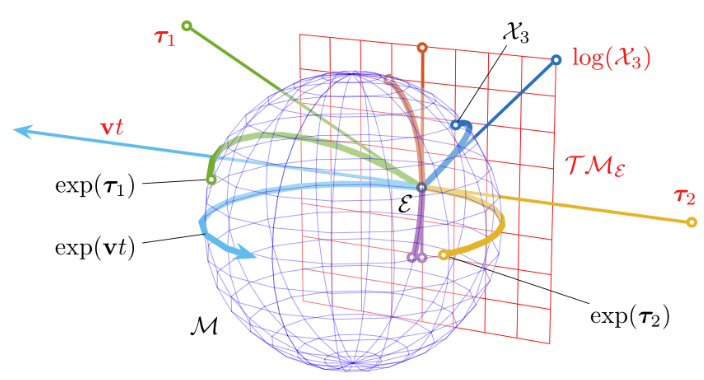

# Lie Algebra and Group

*Lie Group* is a *smooth manifold* (derivative at every point on this manifold).

*Lie Algebra* is described as the tangent space on a point of a Lie Group.

## Smoothness

Differentiability class is a classification of functions according to the properties of their derivatives. It is a measure of the highest order of derivative that exists and is continuous for a function. 

It is denoted as $C^k$, where $k$ is the highest order of derivative that exists and is continuous for a function.

Function $f$ is said to be infinitely differentiable, smooth, or of $C^{\infty}$, if it has derivatives of all orders on it domain. 

## Example

* the blue sphere $M$ is a Lie Group

* the red plane $T M_{\epsilon}$ is the tangent space on the point $\epsilon$. $T M_{\epsilon}$ describes the local information around $\epsilon$.

* the green straight line $\tau_{1}$ is mapped to the sphere with $exp(\tau_{1})$

* the navy blue curve $X_3$ on the sphere is mapped to the tangent space via $log(X_3)$

### Intuition

Since Lie Group is a manifold, it is difficult to perform arithmetics, such as plus and minus, on two Lie Group points.

We can use the tangent space of a point of a Lie Group to represent the point's local properties (with fault tolerance within first degree Taylor Series), such as derivatives with respects to different dimensionalities.

For example, by mapping to tangent space 

## Lie Group Properties

For $X , Y, Z \in G$

* Closure: 

$$
X \circ Y \in G
$$

You can compose elements of the group

* Associativity: 

Parentheses don’t matter

$$
(X \circ Y) \circ Z = X \circ (Y \circ Z)
$$

* Identity: 

$$
EI=XI=I
$$

There’s a null operator that does nothing

* Inverse: 

$$X
^{-1}X = XX^{-1} = I
$$

The action of any element can be reversed

Rotation can be regarded as a Special Orthogonal Group $SO(n)$, which is a Lie Group.

## Lie Algebra

Each Lie group has a Lie algebra
corresponding to it. Lie algebra describes the local structure of the Lie group around
its origin point, or in other words, is the tangent space.

* Closure

$$
\forall X, Y \in \mathbb{V};
[X,Y] \in \mathbb{V}
$$

* Bilinear composition

$$
\forall X,Y,Z \in \mathbb{V};
a,b \in \mathbb{F}
$$

there is

$$
\begin{align*}
[aX + bY, Z] &=
a[X, Z] + y[Y, Z], \\\\
[Z, aX + bY] &= a[Z,X] + b[Z,Y]
\end{align*}
$$

* Reflective

$$
\forall X \in \mathbb{V};
[X,X] = 0
$$

* Jacobi identity

$$
\begin{align*}
\forall X,Y,Z &\in \mathbb{V}; \\\\
[X, [Y,Z]] + [Y, [X,Z]] &+ [Z, [X,Y]] = 0
\end{align*}
$$

## Lie Algebra and Perturbation

Lie algebra derivative computation at a point $\mathbf{x}$ produces the the tangent's changes that have the information about the iteration step $\Delta \mathbf{x}$ (length and direction). 

A trivial perturbation (such as consisted of rotation and translation in rigid motion) $\Delta \mathbf{\xi}$ can be added to this point $\mathbf{x}$. If the trivial perturbation $\Delta \mathbf{\xi}$ is small enough, the partial derivative of $\mathbf{x}$ can be approximated by taking the partial derivative on $\Delta \mathbf{\xi}$.

Intuitively speaking, when $\Delta \mathbf{\xi}$ is small enough, the first-order gradient is almost the same as the perturbation's gradient at the point $\mathbf{x}$

$$
\begin{align*}
\frac{\partial f(\mathbf{x})}{\partial \mathbf{x}}
&\approx
\frac{\partial f(\mathbf{x})}{\partial \Delta \mathbf{\xi}}
\\\\ &=
\underset{\Delta \mathbf{\xi} \rightarrow 0}{lim}
\frac{f(\mathbf{x}+\Delta \mathbf{\xi})-f(\mathbf{x})}{\Delta \mathbf{\xi}}
\end{align*}
$$