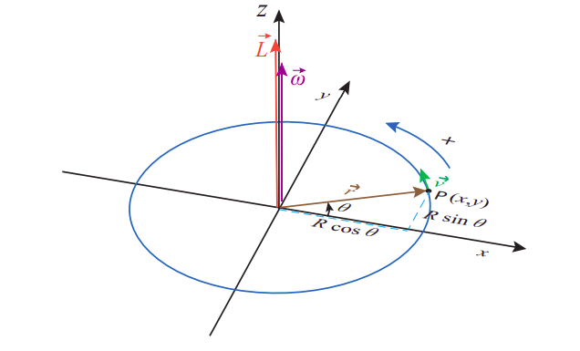

# Physics

## Momentum 动量

* Linear Momentum

An object's (linear) momentum is defined as "push" $\bold{p}$ derived from how much this object with mass $m$ is to maintain its movement at velocity $\bold{v}$.

$$
\bold{p} = m \bold{v}
$$

The total momentum of a closed system remains constant.

* Moment of Inertia

*Moment of inertia* of a rigid body describes how much torque needed for a desired angular acceleration about a rotational axis.

by the most primitive definition, an object's moment of inertia $I$ is

$$
\begin{align*}
I &= \int r^2 d m \\
&= m r^2 && \text{If mass evenly distributed/point mass}
\end{align*}
$$

where $r$ is the distance between rotation point and point of mass.

* Torque

*Torque* is the rotational analogue of (linear) force.

$$
\bold{\tau} = \bold{r} \times \bold{F}
$$

      

 

The magnitude of $\bold{\tau}$ describes a scalar value of how strong force $\bold{F}$ is applied to rotation

$$
|\bold{\tau}| = |\bold{r}||\bold{F}_{\perp}| = |\bold{r}||\bold{F}| \sin\theta
$$

* Angular Momentum 角动量

*Angular momentum* $L$ is the rotational analog of linear momentum.
$L$ is defined in a similar way with replacements to  $m \rightarrow I$ and $\bold{v} \rightarrow \bold{\omega}$

$$
\begin{align*}
\bold{p} &= m \bold{v} && \text{Linear} \\
{L} &= I \bold{\omega} && \text{Angular}
\end{align*}
$$

where $I=r^2 m$ and $\bold{\omega}=\frac{\bold{r} \times \bold{v}}{r^2}$.

$L$ has a direction not on the same plane as where rotation occurs.
Instead, its direction is derived by cross product $\bold{r} \times \bold{v}$.

      

 