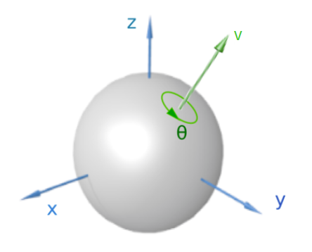

# Quaternion

## Euler Angle and Singularity

Euler angle provides an intuitive perspective into rotation that 
it uses primal axes to decompose a rotation into three rotations around different axes.

* Rotate around the $Z$ axis of the object to get the yaw angle $\theta_{yaw}=y$;
* Rotate around the $Y$ axis of the object to get the pitch angle $\theta_{pitch}=p$;
* Rotate around the $X$ axis of the object to get the roll angle $\theta_{roll}=r$;

However, it suffers from *Gimbal lock* (singularity problem), that results in loss of one degree of freedom. 
Shown as below, when the pitch (green) and yaw (magenta) gimbals become aligned, changes to roll (blue) and yaw apply the same rotation to the airplane.

Euler angle's $\theta$ operates on a 2-d plane at a time. If all three axes's $\theta$ s are aligned to one 2-d plane, gimbal lock happens.

Quaternion uses four elements to represent rotation that avoids Gimbal lock issues. 

## Quaternion Definition

A rotation of angle $\theta$ in the three dimensional space given three bases $u_x\overrightarrow{i}, u_y\overrightarrow{j}, u_z\overrightarrow{k}$ are defined by the unit vector
$$
\overrightarrow{u}=(u_x, u_y, u_z)=u_x \overrightarrow{i} + u_y \overrightarrow{j} + u_z \overrightarrow{k}
$$

can be represented by a quaternion using an extension of Euler's formula:
$$
\begin{align*}
\mathbf{q}&=
e^{\frac{\theta}{2}(u_x \overrightarrow{i} + u_y \overrightarrow{j} + u_z \overrightarrow{k})}
\\&=
cos\frac{\theta}{2} + (u_x \overrightarrow{i} + u_y \overrightarrow{j} + u_z \overrightarrow{k})sin\frac{\theta}{2}
\end{align*}
$$

## Quaternion Operations

Quaternion given the above can be expressed in the below general form

$$
\mathbf{q} = 
[s, \mathbf{v}]^\text{T},
\quad s=q_0 \in \mathbb{R},
\quad \mathbf{v}=[x \overrightarrow{i}, y \overrightarrow{j}, z \overrightarrow{k}]^\text{T} \in \mathbb{R}^3
$$

where $\overrightarrow{i},\overrightarrow{j},\overrightarrow{k}$ represent imaginary parts in respect to the three dimensions.

* Addition/Subtraction

$$
\mathbf{q}_a + \mathbf{q}_b =
[s_a \pm s_b, \mathbf{v}_a \pm \mathbf{v}_b ]^\text{T}
$$

* Multiplication: 

Given the relationship of the respective imaginary parts (derived from cross product that sees $a \times b$ being perpendicular to the $<a , b>$ plane),
$$
\left\{\begin{array}{cc}
    \overrightarrow{i}^2 = \overrightarrow{j}^2 = \overrightarrow{k}^2 = -1 \\\\
    \overrightarrow{i}\overrightarrow{j} = \overrightarrow{k}, 
    \quad \overrightarrow{j}\overrightarrow{i} = -\overrightarrow{k} \\\\
    \overrightarrow{j}\overrightarrow{k} = \overrightarrow{i}, 
    \quad \overrightarrow{k}\overrightarrow{j} = -\overrightarrow{i} \\\\
    \overrightarrow{k}\overrightarrow{i} = \overrightarrow{j}, 
    \quad \overrightarrow{i}\overrightarrow{k} = -\overrightarrow{i} \\\\
\end{array}\right.
$$

define multiplication $\mathbb{R}^3 \rightarrow \mathbb{R}^3$:
$$
\begin{align*}
\mathbf{q}_a  \mathbf{q}_b &=
s_a s_b - x_a x_b - y_a y_b - z_a z_b
\\\\ & \quad +
(s_a x_b + x_a s_b + y_a z_b - z_a y_b)\overrightarrow{i}
\\\\ & \quad +
(s_b y_b - x_a z_b + y_a z_b - z_a x_b)\overrightarrow{j}
\\\\ & \quad +
(s_c z_b + x_a y_b + y_a z_b - z_a s_b)\overrightarrow{k}
\end{align*}
$$

## Quaternion Example

Consider a rotation $\overrightarrow{{u}}$ around $\overrightarrow{v}=\overrightarrow{i} + \overrightarrow{j} + \overrightarrow{k}$ with a rotation angle of $\theta=\frac{2\pi}{3}$. The length of $\overrightarrow{v}$ is $\sqrt{3}$.

      

 

Hence

$$
\begin{align*}
\overrightarrow{u}&=
cos \frac{\theta}{2} + sin \frac{\theta}{2} \cdot \frac{\overrightarrow{v}}{||\overrightarrow{v}||}
\\\\ &=
cos\frac{\pi}{3} + sin\frac{\pi}{3} \cdot \frac{\overrightarrow{v}}{||\sqrt{3}||}
\\\\ &=
cos\frac{\pi}{3} + sin\frac{\pi}{3} \cdot \frac{\overrightarrow{i} + \overrightarrow{j} + \overrightarrow{k}}{||\sqrt{3}||}
\\\\ &=
\frac{1+\overrightarrow{i} + \overrightarrow{j} + \overrightarrow{k}}{2}
\end{align*}
$$

This result's Euler angle is $(\frac{\pi}{2}, 0, \frac{\pi}{2})$.

## Quaternion Derivative

Rotation change about the instantaneous axis $\mathbf{u}=\frac{\mathbf{\omega}}{||\mathbf{\omega}||}$ through $\theta=||\mathbf{\omega}||\Delta t$ can be described by

$$
\begin{align*}
\Delta \mathbf{q} &= \cos\frac{\theta}{2} + \mathbf{u} \sin\frac{\theta}{2}
\\\\ &=
\cos\frac{||\mathbf{\omega}||\Delta t}{2} + \frac{\mathbf{\omega}}{||\mathbf{\omega}||} \sin\frac{||\mathbf{\omega}||\Delta t}{2}
\end{align*}
$$

By the nature of quaternion rotation, there is $\mathbf{q}(t+\Delta t)=\Delta\mathbf{q}\mathbf{q}(t)$.
Then, define the difference:

$$
\begin{align*}
\mathbf{q}(t+\Delta t)-\mathbf{q}(t) &= 
\Big( \cos\frac{||\mathbf{\omega}||\Delta t}{2} + \frac{\mathbf{\omega}}{||\mathbf{\omega}||} \sin\frac{||\mathbf{\omega}||\Delta t}{2}
 \Big) \mathbf{q} - \mathbf{q}
\\\\ &=
\Big( \cos\frac{||\mathbf{\omega}||\Delta t}{2} + \frac{\mathbf{\omega}}{||\mathbf{\omega}||} \sin\frac{||\mathbf{\omega}||\Delta t}{2} - 1 \Big) \mathbf{q}
\\\\ &=
\Big( -2\sin^2\frac{||\mathbf{\omega}||\Delta t}{4} + \frac{\mathbf{\omega}}{||\mathbf{\omega}||} \sin\frac{||\mathbf{\omega}||\Delta t}{2}
\Big) \mathbf{q}
\end{align*}
$$

where, for quaternion $\mathbf{q} \in \mathbb{H}^4$ multiplying with angular velocity $\mathbf{\omega} \in \mathbb{R}^3$, here redefines $\mathbf{\omega}=[0\quad \omega_x\quad \omega_y\quad \omega_z] \in \mathbb{H}^4$.

Finally, develop the time-derivative of the quaternions.

$$
\begin{align*}
\frac{d\mathbf{q}}{d\Delta t} &= \lim_{\Delta t \rightarrow 0} \frac{\mathbf{q}(t+\Delta t)-\mathbf{q}(t)}{\Delta t}
\\\\ &=
\lim_{\Delta t \rightarrow 0}\frac{1}{\Delta t}
\Big( -2\sin^2\frac{||\mathbf{\omega}||\Delta t}{4} + \frac{\mathbf{\omega}}{||\mathbf{\omega}||} \sin\frac{||\mathbf{\omega}||\Delta t}{2}
\Big) \mathbf{q}
\\\\ &=
\Big(0 + \frac{\mathbf{\omega}}{||\mathbf{\omega}||} \frac{||\mathbf{\omega}||}{2} \Big) \mathbf{q}
&\qquad \text{Apply L'Hopital's Rule, there are } \lim_{x \rightarrow 0}\frac{\sin^2(x)}{x}=0 \text{ and } \lim_{x \rightarrow 0}\frac{\sin(x)}{x}=1
\\\\ &=
\frac{1}{2} \mathbf{\omega} \mathbf{q}
\end{align*}
$$

Define the skew-symmetric of $\mathbf{\omega}$, such that
$$
\Omega(\mathbf{\omega}) = 
\begin{bmatrix}
    0 & -\mathbf{\omega}^{\top} \\\\
    \mathbf{\omega} & \mathbf{\omega}^{\wedge}
\end{bmatrix}=\begin{bmatrix}
    0 & -\omega_x & -\omega_y & -\omega_z \\\\
    \omega_x & 0 & \omega_z & -\omega_y \\\\
    \omega_y & -\omega_z & 0 & -\omega_x \\\\
    \omega_z & \omega_y & -\omega_x & 0\\\\
\end{bmatrix}
$$

The quaternion derivative can be expressed as $\frac{d\mathbf{q}}{d\Delta t}=\frac{1}{2} \Omega(\mathbf{\omega}) \mathbf{q}$

## Quaternion Integral

The $\mathbf{q}(t+\Delta t)=\mathbf{q}\_{t+1}$ can be derived from Taylor series 
$$
\begin{align*}
\mathbf{q}\_{t+1} &= \mathbf{q}_t + \frac{d\mathbf{q}\_{t}}{d\Delta t} \Delta t+\frac{1}{2!}\frac{d^2\mathbf{q}\_{t}}{d\Delta t^2} \Delta t^2+\frac{1}{3!}\frac{d^3\mathbf{q}\_{t}}{d\Delta t^3} \Delta t^3 + ...
\\\\ &=
\Big( I_{4 \times 4} + \frac{1}{2} \Omega(\mathbf{\omega})\Delta t+\frac{1}{2!} \big(\frac{1}{2} \Omega(\mathbf{\omega})\Delta t\big)^2 +\frac{1}{3!} \big(\frac{1}{2} \Omega(\mathbf{\omega}) \Delta t \big)^3 + ... \Big) \mathbf{q}_t
&& \qquad \text{Apply } \frac{d\mathbf{q}}{d\Delta t}=\frac{1}{2} \Omega(\mathbf{\omega}) \mathbf{q} \text{ to all derivatives recursively to all degrees}
\\\\ &\qquad +
\frac{1}{4} \frac{d\Omega(\omega)}{d\Delta t}\Delta t^2 \mathbf{q}_t+\Big( \frac{1}{12}\frac{d\Omega(\omega)}{d\Delta t}\Omega(\omega) +\frac{1}{24}\Omega(\omega)\frac{d\Omega(\omega)}{d\Delta t} +\frac{1}{12} \frac{d^2\Omega(\omega)}{d\Delta t^2} \Big) \Delta t^3 \mathbf{q}_t + ...
\\\\ &=
\Big( I_{4 \times 4} + \frac{1}{2} \Omega(\mathbf{\omega})\Delta t+\frac{1}{2!} \big(\frac{1}{2} \Omega(\mathbf{\omega})\Delta t\big)^2 +\frac{1}{3!} \big(\frac{1}{2} \Omega(\mathbf{\omega}) \Delta t \big)^3 + ... \Big) \mathbf{q}_t
&& \qquad \text{Angular velocity is assumed constant } \frac{d\Omega(\omega)}{d\Delta t}=0
\\\\ &=
\Big( I_{4 \times 4} + \frac{1}{2} \Omega(\mathbf{\omega})\Delta t \Big) \mathbf{q}_t
&& \qquad \text{Removed higher order terms}
\end{align*}
$$

## Quaternion Derivation

Define $\mathbf{q}^+$ and $\mathbf{q}^{\oplus}$ as the matrix representation of quaternion.

$$
\mathbf{q}^+ =
\begin{bmatrix}
    s & - \mathbf{v}^\text{T} \\\\
    \mathbf{v} & sI+\mathbf{v}^\wedge
\end{bmatrix}
, \quad
\mathbf{q}^{\oplus} =
\begin{bmatrix}
    s & - \mathbf{v}^\text{T} \\\\
    \mathbf{v} & sI-\mathbf{v}^\wedge
\end{bmatrix}
$$

where $\wedge$ denotes the skew-symmetric matrix representation of the vector and $I$ is the identity matrix.

Derivation shows as below.

$$
\mathbf{q}_a^+ \mathbf{q}_b=
\begin{bmatrix}
    s_a & - \mathbf{v}_a^\text{T} \\\\
    \mathbf{v}_a & s_a I+\mathbf{v}_a^\wedge
\end{bmatrix}
\begin{bmatrix}
    s_b \\\\
    \mathbf{v}_b
\end{bmatrix}=
\begin{bmatrix}
    -\mathbf{v}_a^\text{T} \mathbf{v}_b + s_a s_b \\\\
    s_b \mathbf{a} + s_b \mathbf{v}_b + \mathbf{v}^{\wedge}_a \mathbf{v}_b
\end{bmatrix}=
\mathbf{q}_a \mathbf{q}_b
$$

Similarly, there is
$$
\mathbf{q}_a \mathbf{q}_b=
\mathbf{q}_a^+ \mathbf{q}_b=
\mathbf{q}_a \mathbf{q}_b^{\oplus}
$$

Define a spacial point represented in quaternion $\mathbf{p}=[0,\mathbf{v}_p] \in \mathbb{R}^3$ whose rotation is $\mathbf{p}'=\mathbf{q}\mathbf{p}\mathbf{q}^{-1}$, where $\mathbf{q}^{-1}$ is the matrix normalization term, there is

$$
\begin{align*}
    \mathbf{p}'&=\mathbf{q}\mathbf{p}\mathbf{q}^{-1}
    \\\\ &=
    \mathbf{q}^+\mathbf{p}^+\mathbf{q}^{-1}
    \\\\ &=
    \mathbf{q}^+\mathbf{q}^{-1^\oplus}\mathbf{p}
\end{align*}
$$

Here computes $\mathbf{q}^+\mathbf{q}^{-1^\oplus}$:

$$
\begin{align*}
\mathbf{q}^+\mathbf{q}^{-1^\oplus}&=
\begin{bmatrix}
    s_a & - \mathbf{v}_a^\text{T} \\\\
    \mathbf{v}_a & s_a I+\mathbf{v}_a^\wedge
\end{bmatrix}
\begin{bmatrix}
    s & - \mathbf{v}^\text{T} \\\\
    \mathbf{v} & sI-\mathbf{v}^\wedge
\end{bmatrix}\\\\ &=
\begin{bmatrix}
    1 & 0 \\\\
    \mathbf{0} & \mathbf{v}\mathbf{v}^\text{T}+s^2I+ 2s\mathbf{v}^{\wedge}+(\mathbf{v}^{\wedge})^2
\end{bmatrix}
\end{align*}
$$

Since $\mathbf{q}$ is defined as purely imaginary, so that the *quaternion-to-rotation matrix* can be defined as
$$
R =
\mathbf{v}\mathbf{v}^\text{T}+s^2I+ 2s\mathbf{v}^{\wedge}+(\mathbf{v}^{\wedge})^2
$$

In order to compute $\theta$, trace operation is performed as below

$$
\begin{align*}
    tr(R) &=
    tr \big(
        \mathbf{v}\mathbf{v}^\text{T}+s^2I+ 2s\mathbf{v}^{\wedge}+(\mathbf{v}^{\wedge})^2 \big) \\\\ &=
    v_x^2 + v_y^2 + v_z^2 + 3s^2 + 0
    -2(v_x^2 + v_y^2 + v_z^2) \\\\ &=
    (1-s^2) + 3s^2 -2(1-s^2) \\\\ &=
    4s^2-1
\end{align*}
$$

According to *Rodrigues' rotation formula*, $\theta$ can be computed as

$$
\begin{align*}
\theta &= \arccos \bigg(
      \frac{tr(R)-1}{2}
\bigg)
\\\\ &=
\arccos(2s^2-1)
\\\\ &=
2 \space \arccos \space s
\end{align*}
$$

