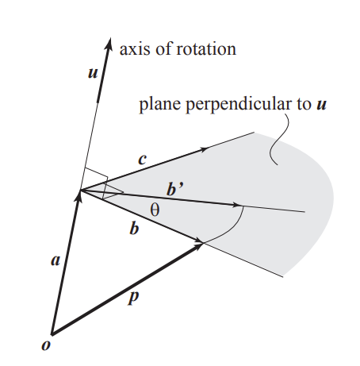
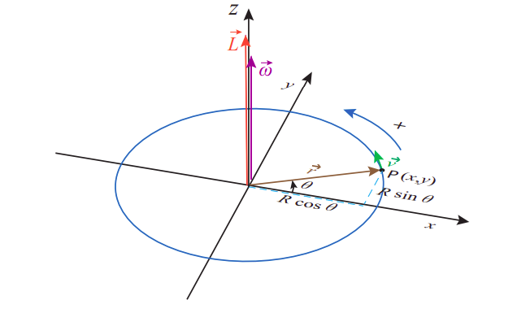

# Rotation

## Vector Representation of Rotations

Different from Euler's formula that describes rotation according to the three axis $x$-th, $y$-th and $z$-th as $\theta_{roll}$, $\theta_{pitch}$ and $\theta_{yaw}$, 
the vector representation first defines a unit rotation vector $\bold{u}$ and an angle $\theta$. 
A spatial point $\bold{p}$ rotates about $\bold{u}$ by $\theta$, and the result $\bold{p}^*$ can be found as below.

For rotation about non-unit vector $\bold{r}$, should first normalize it: $\bold{u}=\frac{\bold{r}}{||\bold{r}||}$.

Then, decompose $\bold{p}$ to two orthogonal vectors $\bold{a}$ (along the direction of $\bold{u}$) and $\bold{b}$ (perpendicular to $\bold{u}$):
$$
\begin{align*}
\bold{a} &= \bold{u}\bold{u}^{\top}\bold{p}
\\
\bold{b} &= \bold{p} - \bold{a} = (1-\bold{u}\bold{u}^{\top})\bold{p}    
\end{align*}
$$

For rotation has no effect on $\bold{a}$, but rotates $\bold{b}$ by $\theta$ to $\bold{b}'$, here define the $\bold{c}$ perpendicular to $\bold{b}$ on the same rotation plane.
$$
\bold{c} = \bold{u} \times \bold{p}
$$

So that the after rotation spatial point $\bold{p}'$ can be computed by *Rodrigues' formula*
$$
\begin{align*}
\bold{p}' &= \bold{a} + \bold{b}'
\\ &=
\bold{a} + \bold{b}\cos\theta + \bold{c}\sin\theta
\\ &=
\bold{u}\bold{u}^{\top}\bold{p} + (1-\bold{u}\bold{u}^{\top})\bold{p}\cos\theta + \bold{u} \times \bold{p}\sin\theta
\\ &=
\big( I\cos\theta + (1-\cos\theta)\bold{u}\bold{u}^{\top} + \bold{u}^{\wedge}\sin\theta \big) \bold{p}
\end{align*}
$$
where $\space^{\wedge}$ is denoted as the skew-symmetric representation of a vector.

      

 

The rotation $I\cos\theta + (1-\cos\theta)\bold{u}\bold{u}^{\top} + \bold{u}^{\wedge}\sin\theta$ has two terms:
$I\cos\theta + (1-\cos\theta)\bold{u}\bold{u}^{\top}$ is symmetric, and $\bold{u}^{\wedge}\sin\theta$ is anti-symmetric.

So that in $R-R^{\top}$, the symmetric term  is canceled out for $\Big(I\cos\theta + (1-\cos\theta)\bold{u}\bold{u}^{\top}\Big) - \Big(I\cos\theta + (1-\cos\theta)\bold{u}\bold{u}^{\top}\Big)^{\top} = 0$, leaving only $\bold{u}^{\wedge}\sin\theta$ untouched.
$$
\begin{align*}
R - R^{-1} &= R - R^{\top}
\\ &= 
2\bold{u}^{\wedge}\sin\theta
\\ &= 2 \begin{bmatrix}
    0 & -u3 & u_2 \\
    u_3 & 0 & -u_1 \\
    -u_2 & u_1 & 0
\end{bmatrix}
\sin\theta
\\ &= 2 \begin{bmatrix}
    0 & -p_3 & p_2 \\
    p_3 & 0 & -p_1 \\
    -p_2 & p_1 & 0
\end{bmatrix}
\end{align*}
$$

The vector $[p_1\quad p_2\quad p_3]$ has the norm of $\sin\theta$ aligned to the $\bold{u}$'s direction.

Given a typical rotation matrix $R=\begin{bmatrix} r_{11} & r_{12} & r_{13} \\ r_{21} & r_{22} & r_{23} \\ r_{31} & r_{32} & r_{33} \end{bmatrix}$, there is $\text{tr}(R) = r_{11} + r_{22} + r_{33} = 2 \cos\theta + 1$, where $\theta$ represents the angle of the rotation in axis/angle form (for derivation see below *Angle Computation* for Rodrigues' formula).

## Rodrigues' Rotation Formula

This formula provides a shortcut to compute exponential map from $so(3)$ (*Special Orthogonal Group*), the Lie algebra of $SO(3)$, to $SO(3)$ without actually computing the full matrix exponential.

In other words, it helps transform a vector to its matrix representation.

Representing a spacial point as $\bold{v}$, and $\bold{k} \times \bold{v}$ as column matrices ($\bold{k}$ is a unit vector), the cross product can be expressed as a matrix product

$$
\begin{bmatrix}
      (\bold{k} \times \bold{v})_x \\
      (\bold{k} \times \bold{v})_y \\
      (\bold{k} \times \bold{v})_z
\end{bmatrix}
=
\begin{bmatrix}
      k_y v_z - k_z v_y \\
      k_z v_x - k_x v_z \\
      k_x v_y - k_y v_x
\end{bmatrix}
=
\begin{bmatrix}
      0 & -k_z & k_y \\
      k_z & 0 & -k_x \\
      -k_y & k_x & 0
\end{bmatrix}
\begin{bmatrix}
      v_x \\
      v_y \\
      v_z
\end{bmatrix}
$$
where, 
$$
\bold{K}=
\begin{bmatrix}
      0 & -k_z & k_y \\
      k_z & 0 & -k_x \\
      -k_y & k_x & 0
\end{bmatrix}
$$

Now, the rotation matrix can be written in terms of $\bold{K}$ as
$$
\bold{Q}=e^{\bold{K}\theta}
=
\bold{I}+\bold{K}sin(\theta)+\bold{K}^2\big(1-cos(\theta)\big)
$$
where $\bold{K}$ is rotation direction unit matrix while $\theta$ is the angle magnitude.

* Vector Form

Define $\bold{v}$ is a vector $\bold{v} \in \mathbb{R}^3$, $\bold{k}$ is a unit vector describing an axis of rotation about which $\bold{v}$ rotates by an angle $\theta$

$$
\bold{v}_{rot}
=
\bold{v} cos\theta + (\bold{k} \times \bold{v})sin\theta + \bold{k}(\bold{k} \cdot \bold{v})(1-cos\theta)
$$

The rotation of $\bold{v}$ about $\bold{k}$ by an angle $\theta$ follows the right hand rule

* Matrix Form

Define $\wedge$ as the skew-symmetric matrix representation of a vector (same as $\bold{K}=\bold{k}^{\wedge}$)

$$
\bold{Q} =
cos \theta \bold{I} + (1-cos \theta) \bold{k}\bold{k}^\text{T} + sin\theta \bold{k}^{\wedge}
$$

* Angle Computation

Define $tr$ as the trace operation; take the trace of the equation (Rodrigues' rotation in matrix form), so that the angle can be computed as
$$
\begin{align*}
tr(\bold{Q}) &= tr \big(
      cos \theta \bold{I} + (1-cos \theta) \bold{k}\bold{k}^\text{T} + sin\theta \bold{k}^{\wedge}
\big)

\\ &=
cos\theta \space tr(\bold{I})
+ (1-cos \theta) tr(\bold{k}\bold{k}^\text{T})
+ sin \theta \space tr(\bold{k}^{\wedge})

\\ &=
3 cos\theta + (1-cos \theta)

\\ &=
1+2cos\theta
\end{align*}
$$

Therefore,
$$
\theta = arccos \bigg(
      \frac{tr(\bold{Q})-1}{2}
\bigg)
$$

### Taylor Expansion Explanation

$$
e^{\bold{K}\theta}=
\bold{I}+\bold{K}\theta
+\frac{(\bold{K}\theta)^2}{2!}
+\frac{(\bold{K}\theta)^3}{3!}
+\frac{(\bold{K}\theta)^4}{4!}
+ ...
$$

Given the properties of $\bold{K}$ being an antisymmentric matrix, there is $\bold{K}^3=-\bold{K}$, so that
$$
\begin{align*}
e^{\bold{K}\theta}
 &=
\bold{I}
+\big(
    \bold{K}\theta
    -\frac{\bold{K}\theta^3}{3!}
    +\frac{\bold{K}\theta^5}{5!}
    -\frac{\bold{K}\theta^7}{7!}
    +\frac{\bold{K}\theta^9}{9!}
    +...
\big)
\\ &
\space \space \space \space 
+\big(
    \frac{\bold{K}^2\theta^2}{2!}
    -\frac{\bold{K}^4\theta^4}{4!}
    +\frac{\bold{K}^6\theta^6}{6!}
    -\frac{\bold{K}^8\theta^8}{8!}
    +...
\big)
\\ &=
\bold{I} +
\bold{K}\big(
    \theta
    -\frac{\theta^3}{3!}
    +\frac{\theta^5}{5!}
    -\frac{\theta^7}{7!}
    +\frac{\theta^9}{9!}
    +...
\big) 
\\ &
\space \space \space \space 
+ \bold{K}^2\big(
    -\frac{\theta^2}{2!}
    +\frac{\theta^4}{4!}
    -\frac{\theta^6}{6!}
    +\frac{\theta^8}{8!}
    +...
\big)
\\ &=
\bold{I}+\bold{K}sin(\theta)+\bold{K}^2\big(1-cos(\theta)\big)
\end{align*}
$$

## Derivative of Rotation Over Time: Angular Velocity $\overrightarrow{\bold{\omega}}$ and Linear Velocity $\overrightarrow{\bold{v}}$

Vector rotation rotating $\overrightarrow{\bold{r}}$ about the $Z$-th axis over some degree $\theta$ can be described as below.

      

 

Compute the trigonometry of rotation for $\Delta \theta$ to approximate the angular velocity as $\Delta t \rightarrow 0$
$$
\begin{align*}
    {\bold{\omega}} =
    \lim_{\Delta t \rightarrow 0}\Delta \theta
    &= 
    \Big|\Big|\overrightarrow{\bold{r}} \Big|\Big| \tan(\frac{d \theta}{dt} \Delta t)
    \\ &=
    \Big|\Big| \overrightarrow{\bold{r}} \Big|\Big| \frac{\sin(\frac{d \theta}{dt} \Delta t)}{\cos(\frac{d \theta}{dt} \Delta t)}
    \\ &\approx
    \Big|\Big| \overrightarrow{\bold{r}} \Big|\Big| \frac{\frac{d \theta}{dt}}{1}
    && \qquad \text{for } \lim_{t \rightarrow 0} \sin(\theta t) = \theta \text{ and } \lim_{t \rightarrow 0} \cos(\theta t) = 1
    \\ &=
    \Big|\Big| \overrightarrow{\bold{r}} \Big|\Big| \frac{d \theta}{dt}
\end{align*}
$$

The linear velocity is defined $\overrightarrow{\bold{v}}={\bold{\omega}} \overrightarrow{\bold{d}}$, 
where $\overrightarrow{\bold{d}}$ is the rotation direction computed by the normalized cross product $\overrightarrow{\bold{d}}= \frac{1}{||\overrightarrow{\bold{r}}||} \big( Z \times \overrightarrow{\bold{r}} \big)$.

$$
\begin{align*}
    \overrightarrow{\bold{v}} &= {\bold{\omega}} \overrightarrow{\bold{d}}
    \\ &=
    \Big|\Big| \overrightarrow{\bold{r}} \Big|\Big| \frac{d \theta}{dt} 
    \cdot \frac{1}{||\overrightarrow{\bold{r}}||} \big( Z \times \overrightarrow{\bold{r}} \big)
    \\ &= 
    \underbrace{\frac{d \theta}{dt} Z}_{=\overrightarrow{\bold{\omega}}=\frac{d \theta}{dt} \begin{bmatrix} 0 & 0 & 1 \end{bmatrix}} 
    \times \overrightarrow{\bold{r}}  
\end{align*}
$$

This indicates that the angular velocity has a direction pointing upward as $Z$ such that $\overrightarrow{\bold{\omega}}=\frac{d \theta}{dt} \begin{bmatrix} 0 & 0 & 1 \end{bmatrix}$.
Linear velocity $\overrightarrow{\bold{v}}$ is perpendicular to $\overrightarrow{\bold{r}}$.

### Matrix Representation

Rotating $\overrightarrow{\bold{r}}$ from its origin position $\overrightarrow{\bold{r}}_0$ at the angular speed $\overrightarrow{\bold{\omega}}$ is basically to compute $\overrightarrow{\bold{r}}(t)=R(t) \overrightarrow{\bold{r}}_0$,
where $R(t) = \exp(\overrightarrow{\bold{\omega}}^{\wedge}t)$.

Recall Rodrigues' rotation formula, here decomposes $\overrightarrow{\bold{\omega}}t = \frac{\overrightarrow{\bold{\omega}}}{||\overrightarrow{\bold{\omega}}||} \cdot ||\overrightarrow{\bold{\omega}}||t$, where $Z=\frac{\overrightarrow{\bold{\omega}}}{||\overrightarrow{\bold{\omega}}||}$ is the $Z$-th rotation axis, and $\theta=||\overrightarrow{\bold{\omega}}||t$ is the scalar rotation angle.

$$
\begin{align*}
&&
\bold{Q} =
e^{\bold{K}\theta}
&=
\bold{I}+\bold{K}sin(\theta)+\bold{K}^2\big(1-cos(\theta)\big)
\\ \text{Substitutions } \Rightarrow &&
R(t) =
\exp(\overrightarrow{\bold{\omega}}^{\wedge}t)
&=
\bold{I} + Z^{\wedge} \sin(||\overrightarrow{\bold{\omega}}||t) + \big(1-\cos(||\overrightarrow{\bold{\omega}}||t)\big) Z^{\wedge} Z^{\wedge} 
\end{align*}
$$
where $Z^{\wedge}=\begin{bmatrix} 0 & 0 & 0 \\ 0 & 0 & 1 \\ 0 & -1 & 0 \end{bmatrix}$ is the skew matrix representation of $Z = \begin{bmatrix} 0 & 0 & 1 \end{bmatrix}$.

To get the first order derivative of $\dot{R}(t)$, when $t \rightarrow 0$, there are $\sin(||\overrightarrow{\bold{\omega}}||t) \rightarrow ||\overrightarrow{\bold{\omega}}||$ and $\cos(||\overrightarrow{\bold{\omega}}||t) \rightarrow 1$, so that
$$
\dot{R}(t) = \frac{d \space R(t)}{dt} 
= \bold{I} + Z^{\wedge} ||\overrightarrow{\bold{\omega}}||
$$

## Derivative of Rotation Over $\theta$

Consider a rotation matrix $R_x(\theta)$ on the $x$-axis.
$$
R_x(\theta) = 
\exp \Bigg( \theta \begin{bmatrix}
    0 & 0 & 0 \\
    0 & 0 & -1 \\
    0 & 1 & 0
\end{bmatrix} \Bigg)
=
\begin{bmatrix}
    1 & 0 & 0 \\
    0 & \cos\theta & -\sin\theta \\
    0 & \sin\theta & \cos\theta
\end{bmatrix}
$$

By rotation property, $R_x^\top(\theta)=R_x^{-1}(\theta)$, there is
$$
R_x(\theta) R_x^\top(\theta) = I
$$

Take derivative, and replace the multiplication term with $S_x$ there is
$$
\begin{align*}
&&
    \Big(\frac{d}{d\theta} R_x(\theta) \Big) R_x^\top(\theta)
    + R_x(\theta) \Big(\frac{d}{d\theta} R^\top_x(\theta) \Big) &= \bold{0}
\\ \Rightarrow &&
    \underbrace{\Big(\frac{d}{d\theta} R_x(\theta) \Big) R_x^\top(\theta)}_{S_x}
    + 
    \underbrace{\Bigg(\Big(\frac{d}{d\theta} R_x(\theta) \Big) R^\top_x(\theta)\Bigg)^\top}_{S_x^\top} 
    &= \bold{0}
\\ \Rightarrow &&
    S_x + S_x^\top &= \bold{0}
\end{align*}
$$

For $S$ is anti-symmetric, generalize $S_x \rightarrow S([1\quad 0\quad 0])$ such as below
$$
\begin{align*}
&& S(\bold{v}) &=
\begin{bmatrix}
    0 & -v_z & v_y \\
    v_z & 0 & -v_x \\
    -v_y & v_x & 0
\end{bmatrix} 
\\
\text{For } S_x \rightarrow S([1\quad 0\quad 0]) :
\\ && 
S([1\quad 0\quad 0]) &= \begin{bmatrix}
    1 & 0 & 0 \\
    0 & -\sin\theta & -\cos\theta \\
    0 & \cos\theta & -\sin\theta
\end{bmatrix} 
\begin{bmatrix}
    1 & 0 & 0 \\
    0 & \cos\theta & \sin\theta \\
    0 & -\sin\theta & \cos\theta
\end{bmatrix}
\\ && &=
\begin{bmatrix}
    0 & 0 & 0 \\
    0 & 0 & -1 \\
    0 & 1 & 0
\end{bmatrix}
\\
\text{Re-express the derivative by } S_x :
\\
&& \frac{d}{d\theta} R_x(\theta) &= S([1\quad 0\quad 0]) R_x(\theta)
\\
\text{Similarly for } S_y \text{ and } S_z:
\\
&& \frac{d}{d\theta} R_y(\theta) &= S([0\quad 1\quad 0]) R_y(\theta)
\\
&& \frac{d}{d\theta} R_z(\theta) &= S([0\quad 0\quad 1]) R_z(\theta)
\end{align*}
$$

In conclusion, the derivative of a rotation matrix with respects to the $x$-th, $y$-th and $z$-th axis is some signs' changes to their respective cells, 
such as 
$$
\begin{align*}
    \frac{d}{d\theta} R_x(\theta) &= S([1\quad 0\quad 0]) R_x(\theta) 
    \\ &= 
    \begin{bmatrix} 0 & 0 & 0 \\ 
    0 & 0 & -1 \\ 
    0 & 1 & 0 
    \end{bmatrix} 
    \begin{bmatrix} 1 & 0 & 0 \\ 
    0 & \cos\theta & -\sin\theta \\ 
    0 & \sin\theta & \cos\theta 
    \end{bmatrix}
\end{align*}
$$