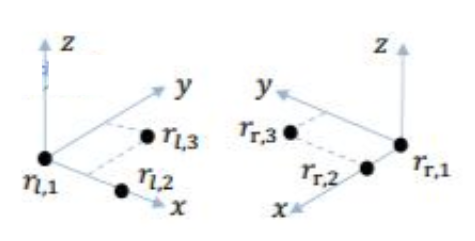

# Similar Transform Group $Sim(3)$ and $sim(3)$

$Sim(3)$ adds scale information for monocular vision.

Define a $3$-d point $\mathbf{p}$ and its transformation result $\mathbf{p}'$
$$
\begin{align*}
    \mathbf{p}' &= \begin{bmatrix}
    s\mathbf{R} & \mathbf{t} \\
    \mathbf{0} & 1
    \end{bmatrix}
    \mathbf{p}
    \\ &=
    \begin{bmatrix}
    s\mathbf{R} & \mathbf{t} \\
    \mathbf{0} & 1
    \end{bmatrix}
    \begin{bmatrix}
        \mathbf{p} \\
        {1}
    \end{bmatrix}
    \\ &=
    \begin{bmatrix}
        s\mathbf{R}\mathbf{p} + \mathbf{t} \\
        {1}
    \end{bmatrix}
    \\ & :=
    s\mathbf{R}\mathbf{p} + \mathbf{t}
\end{align*}
$$

Here give the definition to $Sim(3)$ and $sim(3)$. $\mathbf{\zeta}$ is a 7-dimensional
vector that has the same elements as $se(3)$ plus one scaling factor $\sigma$.
$$
\begin{align*}
Sim(3) &= \bigg\{
    \mathbf{S} = \begin{bmatrix}
        s\mathbf{R} & \mathbf{t} \\
        \mathbf{0} & 1
    \end{bmatrix}
    \in \mathbb{R}^{4 \times 4}
\bigg\}
\\
sim(3) &= \bigg\{
    \mathbf{\zeta} = \begin{bmatrix}
        \mathbf{\rho} \\
        \mathbf{\phi} \\
        \sigma
    \end{bmatrix}
    \in \mathbb{R}^{7}
    , \quad
    \mathbf{\zeta}^\wedge =
    \begin{bmatrix}
        \sigma \mathbf{I}+\mathbf{\phi}^\wedge & \mathbf{\rho} \\
        \mathbf{0} & \mathbf{0}
    \end{bmatrix}
    \in \mathbb{R}^{4 \times 4}
\bigg\}
\end{align*}
$$

## Inverse of $Sim(3)$

$$
Sim^{-1}(3) = \bigg\{
    \mathbf{S}^{-1} = \begin{bmatrix}
        \frac{1}{s}\mathbf{R}^{\top} & - \Big(\frac{1}{s}\mathbf{R}^{\top}\Big) \mathbf{t} \\
        \mathbf{0} & 1
    \end{bmatrix}
    \in \mathbb{R}^{4 \times 4}
\bigg\}
$$

Should be easy to see that
$$
\begin{align*}
\mathbf{S}^{-1}
\begin{bmatrix}
    \mathbf{p}' \\
    {1}
\end{bmatrix}&=
\begin{bmatrix}
    \frac{1}{s}\mathbf{R}^{\top} & - \Big(\frac{1}{s}\mathbf{R}^{\top}\Big) \mathbf{t} \\
    \mathbf{0} & 1
\end{bmatrix}
\begin{bmatrix}
    \mathbf{p}' \\
    {1}
\end{bmatrix}
\\ &=
\begin{bmatrix}
    \frac{1}{s}\mathbf{R}^{\top} & - \Big(\frac{1}{s}\mathbf{R}^{\top}\Big)\mathbf{t} \\
    \mathbf{0} & 1
\end{bmatrix}
\begin{bmatrix}
    s\mathbf{R}\mathbf{p} + \mathbf{t} \\
    {1}
\end{bmatrix}
\\ &=
\begin{bmatrix}
    \mathbf{p} + \frac{1}{s}\mathbf{R}^{\top}\mathbf{t} - \Big(\frac{1}{s}\mathbf{R}^{\top}\Big) \mathbf{t} \\
    {1}
\end{bmatrix}
\\ &=
\begin{bmatrix}
    \mathbf{p} \\
    {1}
\end{bmatrix}
\end{align*}
$$

## Solve $Sim(3)$ by Closed-form Solution of Absolute Orientation Using Unit Quaternions

Take three map points from the left hand side camera $\{\mathbf{r}\_{l,1}, \mathbf{r}\_{l,2}, \mathbf{r}\_{l,3}\}$; 
three map points from the right hand side camera $\{\mathbf{r}\_{r,1}, \mathbf{r}\_{r,2}, \mathbf{r}\_{r,3}\}$; 

Take $\mathbf{r}\_{l,1}$ as the origin for the left hand side coordinate, then define the estimates for three dimensions:
* $\hat{\mathbf{x}}_l = {\mathbf{x}_l}/{||\mathbf{x}_l||},\qquad \mathbf{x}_l = \mathbf{r}\_{l,2}-\mathbf{r}\_{l,1}$
* $\hat{\mathbf{y}}_l = {\mathbf{y}_l}/{||\mathbf{y}_l||},\qquad \mathbf{y}_l = (\mathbf{r}\_{l,3}-\mathbf{r}\_{l,1}) - \big( (\mathbf{r}\_{l,3}-\mathbf{r}\_{l,1}) \cdot \hat{\mathbf{x}}_l \big)\hat{\mathbf{x}}_l$
* $\hat{\mathbf{z}}_l = {\mathbf{z}_l}/{||\mathbf{z}_l||},\qquad \mathbf{z}_l = \hat{\mathbf{x}}_l \times \hat{\mathbf{y}}_l$
where $\big( (\mathbf{r}\_{l,3}-\mathbf{r}\_{l,1}) \cdot \hat{\mathbf{x}}_l \big)\hat{\mathbf{x}}_l$ is the projection on the $\hat{\mathbf{x}}_l$ axis.

Set $M_l = [\hat{\mathbf{x}}_l, \hat{\mathbf{y}}_l, \hat{\mathbf{z}}_l]$ and $M_r = [\hat{\mathbf{x}}_r, \hat{\mathbf{y}}_r, \hat{\mathbf{z}}_r]$

      

 

For any vector on the left hand side coordinate $\mathbf{r}_l$, assume a transform such that $\mathbf{r}_r = sR(\mathbf{r}_l) + \mathbf{t}$.
The algorithm below attempts to find the optimal $s^*$, $R^*$ and $\mathbf{t}^*$ given the corresponding points $\mathbf{r}_l$ and $\mathbf{r}_r$

* **Find the optimal translation $\mathbf{t}^*$**

For any vector $\mathbf{r}\_{l,i}$, attempt to find $\hat{\mathbf{r}}\_{r,i} = s R( \mathbf{r}\_{l,i}) + \mathbf{t}$, where $\mathbf{t}$ is the translation offset from the left to right coordinate system.
Here $s$ is a scale factor to rotation matrix $R( \mathbf{r}\_{l,i})$ that has $\big|\big| R(\mathbf{r}\_{l,i}) \big|\big|^2 = \big|\big| \mathbf{r}\_{l,i} \big|\big|^2$ preserving the length during rotation operation ($\big|\big| \mathbf{r}\_{l,i} \big|\big|^2=\mathbf{r}\_{l,i} \cdot \mathbf{r}\_{l,i}$).

The residual of the least squared problem to find the optimal $\mathbf{t}^*$ is defined as below.
$$
\begin{align*}
\mathbf{t}^* = \argmin_{\mathbf{t}} \mathbf{e}\_i &= 
\mathbf{r}\_{r,i} - \hat{\mathbf{r}}\_{r,i} 
\\ &= 
\mathbf{r}\_{r,i} - s R( \mathbf{r}\_{l,i}) - \mathbf{t}    
\end{align*}
$$

Now, compute centroids served as offsets.
$$
\overline{\mathbf{r}}_l = \frac{1}{n} \sum_{i=1}^n \mathbf{r}\_{l,i}
\qquad
\overline{\mathbf{r}}_r = \frac{1}{n} \sum_{i=1}^n \mathbf{r}\_{r,i}
$$

For any vector $\mathbf{r}\_{l,i}$ or $\mathbf{r}\_{r,i}$, move/offset their coordinates from the origin reference $\mathbf{r}\_{l,1}$ and $\mathbf{r}\_{r,1}$ to the above computed centroid, denote the new origin's vectors as $\mathbf{r}'_{l,i}$ and $\mathbf{r}'_{r,i}$.
$$
\mathbf{r}'_{l,i} = \mathbf{r}\_{l,i} - \overline{\mathbf{r}}_l
\qquad
\mathbf{r}'_{r,i} = \mathbf{r}\_{r,i} - \overline{\mathbf{r}}_r
$$

Apparently, the new centroid reference's vectors' sums should be zeros.
$$
\mathbf{r}'_{l,o} = \sum_{i=1}^n \mathbf{r}'_{l,i} = [0 \quad 0 \quad 0]^{\top}
\qquad
\mathbf{r}'_{r,o} = \sum_{i=1}^n \mathbf{r}'_{r,i} = [0 \quad 0 \quad 0]^{\top}
$$

Rewrite the residual,
$$
\mathbf{e}\_i = \mathbf{r}\_{r,i}' - s R( \mathbf{r}\_{l,i}') - \mathbf{t}'
$$
where
$$
\mathbf{t}' =  \mathbf{t} - \overline{\mathbf{r}}_r + sR(\overline{\mathbf{r}}_l)
$$

So that the least squared problem becomes finding the optimal $\mathbf{t}'$
$$
\begin{align*}
\min_{\mathbf{t}'} \sum_{i=1}^n \big|\big| \mathbf{e}\_i \big|\big|^2 &= 
\sum_{i=1}^n \big|\big| \mathbf{r}\_{r,i}' - s R( \mathbf{r}\_{l,i}') - \mathbf{t}' \big|\big|^2
\\ &=
\sum_{i=1}^n \big|\big| \mathbf{r}\_{r,i}' - s R( \mathbf{r}\_{l,i}') \big|\big|^2- \underbrace{2 \mathbf{t}' \cdot \sum_{i=1}^n \Big( \mathbf{r}\_{r,i}' - s R( \mathbf{r}\_{l,i}') \Big)}\_{=\mathbf{0}}+n \big|\big| \mathbf{t}' \big|\big|^2
\end{align*}
$$

The sum in the middle of this expression is zero since the measurements are referred to the centroid. 

The first term does not depend on $\mathbf{t}'$, and the last term cannot be negative. 
So that $\sum_{i=1}^n \big|\big| \mathbf{e}\_i \big|\big|^2$ reaches its minimum when $\mathbf{t}'=\mathbf{0}$.

Rewrite $\mathbf{t}' = \mathbf{0} = \mathbf{t} - \overline{\mathbf{r}}_r + sR(\overline{\mathbf{r}}_l)$, so that the optimal translation $\mathbf{t}^*$ in $Sim(3)$ is just the difference between $\overline{\mathbf{r}}_r$ and scaled rotation $sR(\overline{\mathbf{r}}_l)$.
In other words, if $sR(\overline{\mathbf{r}}_l)$ is known, the $\mathbf{t}^*$ can easily computed.
$$
\mathbf{t}^* =  \overline{\mathbf{r}}_r - sR(\overline{\mathbf{r}}_l)
$$

Having said $\mathbf{t}' = \mathbf{0}$, the error can be expressed as
$$
\sum_{i=1}^n \big|\big| \mathbf{e}\_i \big|\big|^2 =
\sum_{i=1}^n \big|\big| \mathbf{r}\_{r,i}' - s R( \mathbf{r}\_{l,i}') \big|\big|^2
$$

* **Find the optimal scale $s^*$**

Expand the error term

$$
\begin{align*}
&&
\sum_{i=1}^n \big|\big| \mathbf{e}\_i \big|\big|^2 &=
\sum_{i=1}^n \big|\big| \mathbf{r}\_{r,i}' - s R( \mathbf{r}\_{l,i}') \big|\big|^2
\\ && &=
\sum_{i=1}^n \big|\big| \mathbf{r}\_{r,i}' \big|\big|^2 
-2s \sum_{i=1}^n \Big( \mathbf{r}\_{r,i}' \cdot R( \mathbf{r}\_{l,i}')  \Big)+\sum_{i=1}^n \underbrace{ \big|\big| R( \mathbf{r}\_{l,i}') \big|\big|^2}\_{
    \begin{matrix}
        =\big|\big| \mathbf{r}\_{l,i}' \big|\big|^2  \\
        \text{ for they have} \\
        \text{the same length}
    \end{matrix}
}
\\ \text{Just rewrite the notations}
&& &=
S_r - 2sD + s^2 S_l
\\ && &=
\underbrace{\Big( s\sqrt{S_l} - \frac{S}{\sqrt{S_l}} \Big)^2}\_{\ge 0}+\frac{S_r S_l - D^2}{S_l}
\end{align*}
$$

The above quadratic term can have the optimal $s^*=\frac{D}{S_l}$ (derived by $\Big( s\sqrt{S_l} - \frac{S}{\sqrt{S_l}} \Big)^2=0$ ):
$$
s^*=\frac{D}{S_l}=\frac{\sum_{i=1}^n \Big( \mathbf{r}\_{r,i}' \cdot R( \mathbf{r}\_{l,i}')  \Big)}
{\sum_{i=1}^n \big|\big| R( \mathbf{r}\_{l,i}') \big|\big|^2}
$$ 

Now, consider the inverse transform from the right coordinate system to the left one:
$$
s^{-1}=\frac{D^{-1}}{S_l}=\frac{\sum_{i=1}^n \Big( \mathbf{r}\_{l,i}' \cdot R( \mathbf{r}\_{r,i}')  \Big)}
{\sum_{i=1}^n \big|\big| R( \mathbf{r}\_{r,i}') \big|\big|^2}
\ne \frac{1}{s} \text{ likely for the most of the time}
$$
where $\big|\big| R( \mathbf{r}\_{r,i}') \big|\big|^2=\big|\big| \mathbf{r}\_{l,i}' \big|\big|^2$ is constant.

This expression $s^{*\space -1} \ne \frac{1}{s}$ means that, the error computed with respect to scale $s$ according to transform from the left's to the right's $\mathbf{e}\_{i, l \rightarrow r}=\mathbf{r}\_{r,i}' - s R( \mathbf{r}\_{l,i}')$ does not have the inverse scale $\frac{1}{s}$ when transformed from the right's to the left's.
In other words, the inverse transform error $\mathbf{e}\_{i, r \rightarrow l}$ would see asymmetrical $s^{-1}$.

Unless the left-to-right transform has much more precision than the right-to-left's that $\mathbf{e}\_{i, l \rightarrow r}=\mathbf{r}\_{r,i}' - s R( \mathbf{r}\_{l,i}')$ becomes accurate, otherwise, to formulate the error with respect to the scale $s$, it is better use the below symmetrical error that balances between the left-to-right and right-to-left transforms:
$$
\mathbf{e}\_i = 
\frac{1}{\sqrt{s}}\mathbf{r}'_{r,i} - \sqrt{s} R (\mathbf{r}\_{l,i})
$$

The least squared problem becomes
$$
\begin{align*}
\sum_{i=1}^n \big|\big| \mathbf{e}\_i \big|\big|^2 &=
\frac{1}{s}S_r - 2D + s S_l
\\ &= 
\underbrace{\Big( \sqrt{s} {S_l} - \frac{1}{\sqrt{s}} S_r \Big)^2}\_{\ge 0}+2(S_l S_r -D)
\end{align*}
$$

The optimal $s^*=\frac{S_r}{S_l}$ can be found when $\Big( \sqrt{s} {S_l} - \frac{1}{\sqrt{s}} S_r \Big)^2=0$:
$$
s^* = \sqrt{
    \frac{ \sum_{i=1}^n \big|\big| {\mathbf{r}'_{r,i}} \big|\big|^2 }
    { \sum_{i=1}^n \big|\big| {\mathbf{r}'_{l,i}} \big|\big|^2 }
}
$$
which has a great form where rotation $R$ is removed, that the optimal scale computation only concerns the vectors/map points ${\mathbf{r}'_{l}}$ and ${\mathbf{r}'_{r}}$ in the left and right coordinate systems.

The error $\sum_{i=1}^n \big|\big| \mathbf{e}\_i \big|\big|^2 = \underbrace{\Big( \sqrt{s} {S_l} - \frac{1}{\sqrt{s}} S_r \Big)^2}\_{\ge 0} + 2(S_l S_r -D)$ reaches its minimum when $D=\sum_{i=1}^n \Big( \mathbf{r}\_{r,i}' \cdot R( \mathbf{r}\_{l,i}')  \Big)$ grows to maximum.

* **Find the optimal rotation $R^*$**

Denote $\mathring{\mathbf{r}}$ as the quaternion form of $\mathbf{r}$:
$$
\mathring{\mathbf{r}} = 
r_0 + \overrightarrow{i}r_x + \overrightarrow{j}r_y + \overrightarrow{k}r_z
$$

Express $R$ in quaternion form: $\mathbf{r}$ rotation by quaternion $\mathring{\mathbf{q}}$ can be expressed as
$$
\mathring{\mathbf{r}}' = \mathring{\mathbf{q}} \mathring{\mathbf{r}} \mathring{\mathbf{q}}^{\dagger}
$$
where the rotation is defined as rotating an angle of $\theta$ about the axis defined by the unit vector $\mathbf{u}$ such that $\mathring{\mathbf{q}} = \cos \frac{\theta}{2} + \sin\frac{\theta}{2} \big( \overrightarrow{i}u_x + \overrightarrow{j}u_y + \overrightarrow{k}u_z \big)$.
Here $\mathring{\mathbf{q}}^{\dagger}$ is the normalization term.

Then, 
$$
M= \sum_{i=1}^{n} \mathbf{r}'_{l,i} \mathbf{r'}\_{l,i}^{\top}= \begin{bmatrix}
    S_{xx} & S_{xy} & S_{xz} \\
    S_{yx} & S_{yy} & S_{yz} \\
    S_{zx} & S_{zy} & S_{zz} \\
\end{bmatrix}
$$
where, for example, $S_{xx}=\sum_{i=1}^{n} x'_{l,i} x'_{r,i}, S_{xy}=\sum_{i=1}^{n} x'_{l,i} y'_{r,i}$.

Recall that $D=\sum_{i=1}^n \Big( \mathbf{r}\_{r,i}' \cdot R( \mathbf{r}\_{l,i}')  \Big)$  needs to grow to maximum for 
$\sum_{i=1}^n \big|\big| \mathbf{e}\_i \big|\big|^2 = \underbrace{\Big( \sqrt{s} {S_l} - \frac{1}{\sqrt{s}} S_r \Big)^2}\_{\ge 0} + 2(S_l S_r -D)$ reaching its minimum.
Rewrite $D$'s elements to that $\Big( \mathring{\mathbf{q}} \mathring{\mathbf{r}}\_{l,i}' \mathring{\mathbf{q}}^{\dagger} \Big) \cdot \mathring{\mathbf{r}}\_{r,i}' =\Big( \mathring{\mathbf{q}}\mathbf{r}\_{l,i}' \Big) \cdot \Big(  \mathring{\mathbf{r}}\_{r,i}' \mathring{\mathbf{q}} \Big)$.

Take $\mathbf{r}\_{l,i}' \rightarrow \mathring{\mathbf{r'}}\_{l,i}$, then by quaternion multiplication, there is
$$
\mathring{\mathbf{q}} \mathring{\mathbf{r}}\_{l,i}' = 
\begin{bmatrix}
    0 & -x'_{l,i} & -y'_{l,i} & -z'_{l,i} \\
    x'_{l,i} & 0 & z'_{l,i} & -y'_{l,i} \\
    y'_{l,i} & -z'_{l,i} & 0 & x'_{l,i} \\
    z'_{l,i} & y'_{l,i} & -x'_{l,i} & 0 \\
\end{bmatrix}
\mathring{\mathbf{q}}=\overline{\mathcal{R}}\_{l,i} \mathring{\mathbf{q}}
$$

Similarly, there is $\mathring{\mathbf{r}}\_{r,i}' \mathring{\mathbf{q}} = \mathcal{R}\_{r,i} \mathring{\mathbf{q}}$.

So that, $D$ can be expressed as
$$
\begin{align*}
D &=
\sum_{i=1}^{n} \Big( \mathring{\mathbf{q}}\mathbf{r}\_{r,i}' \Big) \cdot \Big( \mathring{\mathbf{q}} \mathring{\mathbf{r}}\_{l,i}' \Big)
\\ &=
\sum_{i=1}^{n} \Big( \overline{\mathcal{R}}\_{l,i} \mathring{\mathbf{q}} \Big) \cdot \Big( {\mathcal{R}}\_{r,i} \mathring{\mathbf{q}}  \Big)
\\ &=
\sum_{i=1}^{n} \mathring{\mathbf{q}}^{\top} 
\underbrace{\overline{\mathcal{R}}\_{l,i}^{\top} {\mathcal{R}}\_{r,i} }\_{=N_i}
\mathring{\mathbf{q}}
\\ &=
\mathring{\mathbf{q}}^{\top} \Big( \sum_{i=1}^{n} N_i \Big) \mathring{\mathbf{q}}
\\ &=
\mathring{\mathbf{q}}^{\top} N \mathring{\mathbf{q}}
\end{align*}
$$

The $N$ can be expressed as
$$
N = \begin{bmatrix}
    S_{xx}+S_{yy}+S_{zz} & S_{yz}-S{zy} & S_{zx}-S{xz} & S_{xy}-S{yx} \\
    S_{yz}-S{zy} & S_{xx}-S_{yy}-S_{zz} & S_{xy}+S{yx} & S_{zx}+S{xz} \\
    S_{zx}-S{xz} & S_{xy}+S{yx} & -S_{xx}+S_{yy}-S_{zz} & S_{yz}+S{zy} \\
    S_{xy}-S{yx} & S_{zx}+S{xz} & S_{yz}+S{zy} & -S_{xx}-S_{yy}+S_{zz} \\
\end{bmatrix}
$$

Here $N$ is a real symmetric having $10$ independent elements serving the sums of the $9$ elements of $M$.
The sum of the diagonal of $N$ is zero.
In other words, the trace $tr(N)=0$ takes care of the $10$-th degree of freedom.

To maximize $\mathring{\mathbf{q}}^{\top} N \mathring{\mathbf{q}}$ by adjusting rotation $\mathring{\mathbf{q}}$, here computes $\text{det}(N-\lambda I)=0$, where the largest eigenvalue $\lambda_{max}$ corresponding eigenvector $\mathbf{v}$ is the optimal quaternion $\mathring{\mathbf{q}}^*$.

Given $\text{det}(N-\lambda I)=0$, compute all four eigenvalues and eigenvectors $N \mathbf{v}\_i = \lambda_i \mathbf{v}\_i$ for $i \in \{ 1,2,3,4 \}$.
Then, an arbitrary quaternion $\mathring{\mathbf{q}}$ can be written as a linear combination in the form
$$
\mathring{\mathbf{q}} = 
\alpha_1 \mathbf{v}_1 + \alpha_2 \mathbf{v}_2 + \alpha_3 \mathbf{v}_3 + \alpha_4 \mathbf{v}_4
$$

Since the eigenvectors are orthogonal, and for unit quaternion the norm should be $1$, there is
$$
\mathring{\mathbf{q}} \cdot \mathring{\mathbf{q}} =
\alpha_1^2 + \alpha_2^2 + \alpha_3^2 + \alpha_4^2 = 1
$$

Then,
$$
N \mathring{\mathbf{q}} =
\alpha_1 \lambda_1 \mathbf{v}_1 + \alpha_2 \lambda_2 \mathbf{v}_2 + \alpha_3 \lambda_3 \mathbf{v}_3 + \alpha_4 \lambda_4 \mathbf{v}_4
$$

and
$$
\mathring{\mathbf{q}}^{\top} N \mathring{\mathbf{q}} =
\mathring{\mathbf{q}}^{\top} \cdot \big( N \mathring{\mathbf{q}} \big) =
\alpha_1^2 \lambda_1 + \alpha_2^2 \lambda_2 + \alpha_3^2 \lambda_3 + \alpha_4^2 \lambda_4
$$

Sort the eigenvalues so that $\lambda_1 \ge \lambda_2 \ge \lambda_3 \ge \lambda_4$.

$\mathring{\mathbf{q}}^{\top} N \mathring{\mathbf{q}}$ reaches its maximum when $\alpha_1=1$ and $\alpha_2=\alpha_3=\alpha_4=0$.
$$
\mathring{\mathbf{q}}^{\top} N \mathring{\mathbf{q}} \le
\alpha_1^2 \lambda_1 + \alpha_2^2 \lambda_1 + \alpha_3^2 \lambda_1 + \alpha_4^2 \lambda_1= \lambda_1
$$

This proves that when $\mathring{\mathbf{q}}=\mathbf{v}_1$ the error term $\mathring{\mathbf{q}}^{\top} N \mathring{\mathbf{q}}$ can reach its maximum.