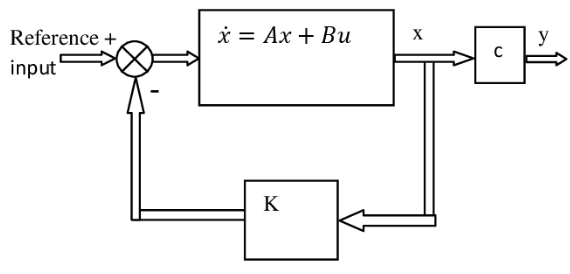

# LQR (Linear Quadratic Regulator)

Consider this linear system:
$$
\begin{align*}
\dot{\bold{x}}(t) &= A\bold{x}(t) + B \bold{u}(t)
\\
\bold{y}(t) &= C{\bold{x}}(t)
\end{align*}
$$
for $\bold{x}(0)=\bold{x}_0 \ne \bold{0}$.

      

 

By this applied correction $\bold{u}(t) = K \bold{x}(t)$, LQR attempts to minimize this cost function:

$$
\min \frac{1}{2} \bold{x}^\top(t_f) S \bold{x}(t_f)
+ \frac{1}{2} \int^{t_f}_{t_0} \Big( 
\bold{x}(t)^\top Q \bold{x}(t) + \bold{u}^\top (t)R \bold{u}(t)
\Big) dt
$$

subject to
$$
\dot{\bold{x}} = A\bold{x} + B \bold{u}
,\qquad
\bold{x}(0)=\bold{x}_0 \ne \bold{0}
$$

where $\frac{1}{2} \bold{x}_{t_f}^\top S \bold{x}_{t_f}$ represents the error of when the system reaches a stable state at the time $t_f$; 
$\frac{1}{2} \int^{t_f}_{t_0} \Big( 
\bold{x}^\top Q \bold{x} + \bold{x}^\top R \bold{x} \Big) dt$ is the cost to be reduced to zero.
In other words, over the integrated period $[t_0, t_f]$, the total $R$-transformed action $\bold{u}$ should cancel out the total $Q$-transformed state error $\bold{x}$

$R$ is positive definite; $Q$ and $S$ are semi-positive definite.

Solution to this system can be found by *Riccati* equations:
$$
\dot{P}(t) = 
-P(t)A -A^\top +P(t)BR^{-1}B^\top P(t) -Q
$$

then set
$$
\bold{u}(t) = R^{-1}B^\top P(t) \bold{x}(t)
=K\bold{x}(t)
$$

from here update the system's close loop coefficient $A_{cl}=A-BK$.

## Example in Vehicle Horizontal Adjustment

Assumed a vehicle moving forward at a speed $v$, has a horizontal reference error (to the road central positioning) $e_h$, and a small heading angle error $e_{\theta}$.

Approximate the trivial heading angle error $\sin(e_{\theta})\approx e_{\theta}$.

Horizontal position translation is $S$ and its velocity is $\dot{S}=S \cdot \sin(e_{\theta})$, 
and vehicle angular velocity is $\dot{\theta}=\omega$.

Now, want to adjust $\omega$ to get the vehicle back to the road reference line $e_h=0$.

The system is defined as
$$
\begin{align*}
\begin{bmatrix}
    \dot{S} \\
    \dot{\theta}
\end{bmatrix}
&=
\underbrace{\begin{bmatrix}
    0 & v \\
    0 & 0
\end{bmatrix}}_{A}
\begin{bmatrix}
    S \\
    \theta
\end{bmatrix}
+
\underbrace{\begin{bmatrix}
    0 \\
    1
\end{bmatrix}}_{B}
\omega
\end{align*}
$$

The output $\bold{y}=S$ is simply the horizontal positioning translation such that $\bold{y}=C\bold{x}$, where $C=\begin{bmatrix}  1 & 0 \\ 0 & 0 \end{bmatrix}$.

The cost coefficient matrices can be defined as
$$
Q=\begin{bmatrix}
    1 & 0 \\
    0 & 1
\end{bmatrix}
,\qquad
R=\begin{bmatrix}
    1 & 0 \\
    0 & 0
\end{bmatrix}
$$

By Riccati Equation, $K$ can be computed to update the new close loop system coefficient matrix $A_{cl}=A-BK$.

Finally, by this new $A_{cl}$, the output $\bold{y}(t)$ should gradually converge to the horizon reference line as $t \rightarrow t_f$.
$$
\begin{align*}
\dot{\bold{x}}(t) &= A_{cl}\bold{x}(t) + B \bold{u}(t)
\\
\bold{y}(t) &= C{\bold{x}}(t)
\end{align*}
$$

In other words, when $t=t_f$, there is $\bold{y}(t_f)=S_{t_f}=0$