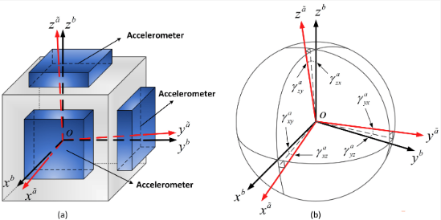
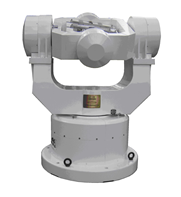

# IMU

An inertial measurement unit (IMU) is an electronic device that measures and reports a body's specific force, angular rate, and sometimes the orientation of the body, using a combination of **accelerometers**, **gyroscopes**, and sometimes magnetometers. 

Typically, it measures rotation $\bold{R}$, translation $\bold{p}$, angular velocity $\bold{\omega}$, linear velocity $\bold{v}$ and acceleration $\bold{a}$ in a 3D space.

## IMU Noise Formulation

* Zero Drift

Zero drift is zero offset stability (the standard deviation of direct measurement), which represents the degree of dispersion of accelerometers/gyroscope output around its zero mean value.

It can be measured by Wiener process.

* Measurement Noises

Readings from IMU has some deviations from its true values.

This can be measured by Gaussian noise.

### Formulations

Between two keyframes $K_i$ and $K_j$, define IMU measurement noises (Gaussian noise) $\bold{\eta}_{ij}$ and zero offset/drift biases (Wiener process) to angular and linear movements $\bold{b}_{ij} = \{ \bold{b}_{a, ij}, \bold{b}_{\omega, ij} \}$.

$$
\begin{align*}
\bold{\eta}_{ij} &= \frac{1}{\Delta t_{ij}} \int^{t_i+\Delta t_{ij}}_{t_i} \bold{n}(\tau) dt
\\
\bold{b}_{ij} &= \bold{b}_{i} + \int^{t_i+\Delta t_{ij}}_{t_i} \bold{n}(t) dt
\end{align*}
$$
where $\bold{n}(\tau)$ is Gaussian noise.
In the time interval $\Delta t_{ij}$, the Gaussian noise $\bold{n}(\tau)$ does not grow proportional to the length of time interval $\Delta t_{ij}$.
The argument $\tau$ means the noise does not relate to $\Delta t$, so that $\int^{t_i+\Delta t_{ij}}_{t_i} \bold{n}(\tau) dt = 0$ as $\Delta t_{ij} \rightarrow +\infty$.
This is different from Wiener process where noises accumulate as time extends $\int^{t_i+\Delta t_{ij}}_{t_i} \bold{n}(t) dt \propto \Delta t_{ij}$.

The covariances of the two types of errors are: 
$E(\bold{\eta}^2_{ij})$ is just the mean of the $\sigma_{\bold{\eta}}^2$ over the time interval $\Delta t_{ij}$;
$E(\bold{b}^2_{ij})$ is the Wiener process covariance scaled by $\sigma_{\bold{b}}^2$.

$$
\begin{align*}
E(\bold{\eta}^2_{ij}) &= \frac{\sigma_{\bold{\eta}}^2}{\Delta t_{ij}}
\\
E(\bold{b}^2_{ij}) &= {\sigma_{\bold{b}}^2}{\Delta t_{ij}}
\end{align*}
$$

## IMU Calibration

IMU calibrated output (for gyroscope as an example) $[W_x \quad W_y \quad W_z]^\top$ can be formulated as
$$
\begin{bmatrix}
    W_x \\
    W_y \\
    W_z
\end{bmatrix}
=
\begin{bmatrix}
    W_{x0} \\
    W_{y0} \\
    W_{z0}
\end{bmatrix}
+
\begin{bmatrix}
    K_{xx} & K_{xy} & K_{xz} \\
    K_{yx} & K_{yy} & K_{yz} \\
    K_{zx} & K_{zy} & K_{zz} \\
\end{bmatrix}
\begin{bmatrix}
    w_x \\
    w_y \\
    w_z
\end{bmatrix}
$$
where $\begin{bmatrix} W_{x0} \\ W_{y0} \\ W_{z0} \end{bmatrix}$ is zero offset, 
$\begin{bmatrix} K_{xx} & K_{xy} & K_{xz} \\ K_{yx} & K_{yy} & K_{yz} \\ K_{zx} & K_{zy} & K_{zz} \\ \end{bmatrix}$ is IMU coefficient matrix,
and $\begin{bmatrix} w_x \\ w_y \\ w_z \end{bmatrix}$ is the initial IMU sensor's reading.

Usually, before starting using an IMU, should calibrate this IMU by recording a number of sensor's readings and formulate a least squares problem, 
by which the zero offset and coefficient matrix can be computed.

Other calibration considerations include adjusting the aforementioned parameters by temperature and atmospheric pressure if ambient conditions change significantly.

### Orthogonal Calibration

There are six orthogonal axes, three for accelerator $a$ and three for gyroscope $g$, respectively.

For orthogonality, when IMU rotates along one axis, only this axis should have outputs, and the other two axes should not have output.
Model the orthogonality rotation error, there are $S_g$ and $S_a$ representing the accelerator and gyroscope errors
$$
S_g = \begin{bmatrix}
    0 & S_{gxy} & S_{gxz} \\
    S_{gyx} & 0 & S_{gyz} \\
    S_{gzx} & S_{gzy} & 0
\end{bmatrix}
\qquad
S_a = \begin{bmatrix}
    0 & S_{axy} & S_{axz} \\
    S_{ayx} & 0 & S_{ayz} \\
    S_{azx} & S_{azy} & 0
\end{bmatrix}
$$
where, for example, $S_{gxy}$ means for gyroscope, given input on $y$-th axis, the error output on the $x$-axis (if ideal, $y$-th output should see no output on the $x$-axis).

The errors on the axis itself such as $S_{gxx}$ are not accounted in orthogonal calibration.
They are labelled as zero offsets/drifts $W_{x0}$.

      

 

To summarize, the acceleration $\begin{bmatrix} A_x & A_y & A_z \end{bmatrix}^{\top}$ and gyroscope $\begin{bmatrix} W_x & W_y & W_z \end{bmatrix}^{\top}$ noise models can be expressed as below.

$$
\begin{align*}
\begin{bmatrix}
    W_x \\
    W_y \\
    W_z
\end{bmatrix}
&=
\begin{bmatrix}
    W_{x0} \\
    W_{y0} \\
    W_{z0}
\end{bmatrix}
+
\begin{bmatrix}
    K_{gxx} & S_{gxy} & S_{gxz} \\
    S_{gyx} & K_{gyy} & S_{gyz} \\
    S_{gzx} & S_{gzy} & K_{gzz}
\end{bmatrix}
\begin{bmatrix}
    w_x \\
    w_y \\
    w_z
\end{bmatrix}
\\
\begin{bmatrix}
    A_x \\
    A_y \\
    A_z
\end{bmatrix}
&=
\begin{bmatrix}
    A_{x0} \\
    A_{y0} \\
    A_{z0}
\end{bmatrix}
+
\begin{bmatrix}
    K_{axx} & S_{axy} & S_{axz} \\
    S_{ayx} & K_{ayy} & S_{ayz} \\
    S_{azx} & S_{azy} & K_{azz}
\end{bmatrix}
\begin{bmatrix}
    a_x \\
    a_y \\
    a_z
\end{bmatrix}
\end{align*}
$$

### Least Squares Solution for the Orthogonal Calibration Problem

Take the gyroscope for example, need to compute $\begin{bmatrix} W_{x0} \\ W_{y0} \\ W_{z0} \end{bmatrix}$
and $\begin{bmatrix} K_{gxx} & S_{gxy} & S_{gxz} \\ S_{gyx} & K_{gyy} & S_{gyz} \\ S_{gzx} & S_{gzy} & K_{gzz} \end{bmatrix}$, a total of $12$ configurable parameters.

First, flat the equations to a vector format:
$$
\underbrace{\begin{bmatrix}
    W_x \\
    W_y \\
    W_z
\end{bmatrix}}_{{W}}
=
\bold{x}_{\omega}
\underbrace{\begin{bmatrix}
    K_{gxx} \\ S_{gxy} \\ S_{gxz} \\
    S_{gyx} \\ K_{gyy} \\ S_{gyz} \\
    S_{gzx} \\ S_{gzy} \\ K_{gzz} \\
    W_{x0} \\
    W_{y0} \\
    W_{z0}
\end{bmatrix}}_{\bold{K}_g}
$$

$\bold{x}_{\omega}$ is 
$$
\bold{x}_{\omega} = \begin{bmatrix}
    {\omega}_x & {\omega}_x & {\omega}_x & 0 & 0 & 0 & 0 & 0 & 0 & 1 & 0 & 0 \\
    0 & 0 & 0 & {\omega}_y & {\omega}_y & {\omega}_y & 0 & 0 & 0 & 0 & 1 & 0 \\
    0 & 0 & 0 & 0 & 0 & 0 & {\omega}_z & {\omega}_z & {\omega}_z & 0 & 0 & 1 \\
\end{bmatrix}
$$

Place the IMU device on a high-precision rotation device such as below.
A typical high-precision calibration machine would give $\pm 0.3\%$ precision to acceleration and gyroscope.

      

 

Record many IMU positions $\bold{x}_{\omega, i}$.
Form the least squares problem:
$$
\begin{align*}
    \bold{W} &= \begin{bmatrix}
        W_1^{\top} & W_2^{\top} & ... & W_n^{\top}
    \end{bmatrix}^{\top}
\\
    \bold{X}_{\omega} &= \begin{bmatrix}
        \bold{x}_{\omega,1}^{\top} & \bold{x}_{\omega,2}^{\top} & ... & \bold{x}_{\omega,n}^{\top}
    \end{bmatrix}^{\top}
\end{align*}
$$

The $\bold{K}_g$ can be solved by
$$
\bold{K}_g = (\bold{X}_{\omega}^{\top} \bold{X}_{\omega})^{-1} \bold{X}_{\omega}^{\top} \bold{W}^{\top}
$$

Similarly, the configuration for acceleration $\bold{K}_a$ can be computed by 
$$
\bold{K}_a = (\bold{X}_{a}^{\top} \bold{X}_{a})^{-1} \bold{X}_{a}^{\top} \bold{A}^{\top}
$$

### Other Considerations

* Earth self rotation: should subtract $15^{\circ}/\text{hour}$
* The Rotation assistance device must placed horizontally to the ground, otherwise, there is earth gravity noise

## Pre-integration in IMU

IMU's data comes in with much higher frequencies than SLAM recording/computing keyframe. 
Pre-integration can integrate/process/fuse recent history IMU data within the time range covered by a keyframe, or between two keyframes $K_i$ and $K_j$.

There are noises in IMU: measurement noises between two keyframes $\bold{\eta}_{ij}$ and zero offset/biases to angular and linear movements $\bold{b}_{\omega}$ and $\bold{b}_{a}$. During integration, such noises (assumed Gaussian noises) can be approximated by linear increments, hence avoided repeated noise computation.

Covariances $\bold{\Sigma}$ for the aforementioned noises are used to dynamically scale the percentage of the noise components in estimating the IMU's state.

In other words, IMU reading $\hat{W}_{ij}$ contains a true reading $\overline{W}_{ij}$ and a reading noise $\delta W$. 
Observation (such as pose estimate from point cloud) $W_{ij}$ is to be adjusted to make residual $\bold{r}_W$ minimized.

$\delta W$ can be approximated by linear increment. 
The covariance $\bold{\Sigma}_W$ of $\delta W$ scales the percentage of noise that, a large $\bold{\Sigma}_W$ means a large noise $\delta W$; accordingly, $W_{ij}$ should be updated to a larger value- to compensate this noise.

$$
\begin{align*}
    \bold{r}_W &= W_{ij} - \hat{W}_{ij} \\
      &= W_{ij} - (\overline{W}_{ij} + \delta W) \\
\end{align*}
$$

### Summary and Approximation Error Discussions

Start from kinematics for rotation ${\bold{R}}$, velocity ${\bold{v}}$ and position ${\bold{p}}$, assumed the true values can be decomposed of subtracting zero drifts and Gaussian noises from reading.

$$
\begin{align*}
    {\bold{R}}(t_0+\Delta t) 
    &= \bold{R}(t_0) e^{\bold{\omega}^\wedge(t_0)\Delta t} \\
    &= \bold{R}(t_0)
    e^{ \big(\hat{\bold{\omega}}(t_0)- \bold{b}_\bold{\omega} - \bold{\eta}_\bold{\omega} \big)^\wedge \Delta t} 
    \\
    {\bold{v}}(t_0+\Delta t) &= \bold{v}(t_0) + \bold{g}_\text{earth} \Delta t
    + \bold{a}\Delta t \\
    &= \bold{v}(t_0) + \bold{g}_\text{earth} \Delta t
    + \bold{R}(t_0) \cdot \big( \hat{\bold{a}}(t_0) - \bold{b}_\bold{a}(t_0) - \bold{\eta}_\bold{a}(t_0) \big) \Delta t
    \\
    {\bold{p}}(t_0+\Delta t) 
    &= \bold{p}(t_0) + \bold{v}(t_0)\Delta t + \frac{1}{2} \bold{a}(t_0) \Delta t^2 \\
    &= \bold{p}(t_0) + \bold{v}(t_0)\Delta t +
    \frac{1}{2} \bold{g}_{\text{earth}} \Delta t^2
    + \bold{R}(t_0) \cdot \big( \hat{\bold{a}}(t_0) - \frac{1}{2} \bold{b}_\bold{a}(t_0) - \bold{\eta}_\bold{a}(t_0) \big) \Delta t^2
\end{align*}
$$

Approximate the true value by first order (BCH in Lie algebra), so that the true value for rotation change ${\Delta{\bold{R}}_{ij}}$ can be expressed as the reading ${\Delta\hat{\bold{R}}_{ij}}$ removing the noise $\text{Exp} \big( -\delta\bold{\phi}_{ij} \big)$.

$$
    {\Delta{\bold{R}}_{ij}}
=
    {\Delta\hat{\bold{R}}_{ij}}
    \prod^{j-1}_{k=i} 
    \text{Exp} \big(
    -{\Delta\hat{\bold{R}}_{k+1,k+2}}  \bold{J}_{rk} \bold{\eta}_{\bold{\omega},k} \Delta t \big)
=
    {\Delta\hat{\bold{R}}_{ij}}
    \text{Exp} \big( -\delta\bold{\phi}_{ij} \big)
, \qquad
  \text{where } \Delta\hat{\bold{R}}_{ij} =
  \prod^{j-1}_{k=i}
  e^{ \big( (\hat{\bold{\omega}}_k- \bold{b}_{\bold{\omega},k})\Delta t 
  \big)^\wedge }
$$

Similarly, velocity and position changes can be expressed as $\Delta{\bold{v}}_{ij} = \Delta\hat{\bold{v}}_{ij} - \delta \bold{v}_{ij}$ and $\Delta{\bold{p}}_{ij} = \Delta\hat{\bold{p}}_{ij} + \delta \bold{p}_{ij}$.

The approximation error is shown as below:

* The rotation is approximated by the first order BCH $e^{(\bold{\phi}+\Delta\bold{\phi})^\wedge} \approx e^{(\bold{J}_l\Delta\bold{\phi})^\wedge} e^{\bold{\phi}^\wedge}$.
The higher order errors are discarded.

* When $\delta\bold{\phi}$ is small, there is approximation $\exp(\delta\bold{\phi}^\wedge) \approx \bold{I}+\delta\bold{\phi}^\wedge$.
This approximation derives from $\sin(||\overrightarrow{\bold{\omega}}||t) \rightarrow ||\overrightarrow{\bold{\omega}}||$ and $\cos(||\overrightarrow{\bold{\omega}}||t) \rightarrow 1$, hence the error grows as $\delta\bold{\phi}$ grows, which means that if IMU reading interval is large, the approximation result is not accurate.

### Preliminaries and Some Notations

Lie algebra to Lie group mapping is an exponential mapping $so(3) \rightarrow SO(3)$:
$$
e^{\bold{\phi}^\wedge} = \exp(\bold{\phi}^\wedge) = \text{Exp}(\bold{\phi}) = \bold{R}
$$

and its inverse is
$$
\bold{\phi} = \ln(\bold{R}^\vee) = \text{Log}(\bold{R})
$$

Baker-Campbell-Hausdorff (BCH) formula describes the relationship between Lie algebra plus/minus operations and Lie group multiplication.
$$
e^{(\bold{\phi}+\Delta\bold{\phi})^\wedge}
\approx
e^{(\bold{J}_l\Delta\bold{\phi})^\wedge}
e^{\bold{\phi}^\wedge}
=
e^{\bold{\phi}^\wedge}
e^{(\bold{J}_r\Delta\bold{\phi})^\wedge}
$$
where $\bold{J}_l(\bold{\phi})=\bold{J}_l(\theta \bold{n})=\frac{\sin\theta}{\theta} I + (1 - \frac{sin\theta}{\theta})\bold{n}\bold{n}^\text{T} + \frac{1-cos\theta}{\theta}\bold{n}^{\wedge}$,
inside $\bold{\phi}=\theta \bold{n}$ describes the length and direction. Its inverse is $\bold{J}_l^{-1}(\theta \bold{n}) = \frac{\theta}{2}cot\frac{\theta}{2}I + (1-\frac{\theta}{2}cot\frac{\theta}{2})\bold{n}\bold{n}^\text{T} - \frac{\theta}{2}\bold{n}^{\wedge}$.

When $\delta\bold{\phi}$ is small, there is approximation $\exp(\delta\bold{\phi}^\wedge) \approx \bold{I}+\delta\bold{\phi}^\wedge$

The left Jacobian and right Jacobian relationship is $\bold{J}_l(\bold{\phi})=\bold{J}_r(-\bold{\phi})$.

The adjoint relationship in Lie group is $\bold{R}^\top \text{Exp}(\bold{\phi})\bold{R}=\text{Exp}(\bold{R}^\top\bold{\phi})$.

### Definition

Typically, there are five variables to consider in an IMU system: rotation $\bold{R}$, translation $\bold{p}$, angular velocity $\bold{\omega}$, linear velocity $\bold{v}$ and acceleration $\bold{a}$:
$$
\begin{align*}
    \dot{\bold{R}} &= \bold{R} \bold{\omega}^\wedge \\
    \dot{\bold{p}} &= \bold{v} \\
    \dot{\bold{v}} &= \bold{a}
\end{align*}
$$

Take integral starting from $t_0$ to $t_0+\Delta t$:
$$
\begin{align*}
    {\bold{R}}(t_0+\Delta t) &= \bold{R}(t_0) e^{\bold{\omega}^\wedge(t_0) \Delta t} \\
    {\bold{v}}(t_0+\Delta t) &= \bold{v}(t_0) + \bold{a}\Delta t \\
    {\bold{p}}(t_0+\Delta t) &= \bold{p}(t_0) + \bold{v}(t_0)\Delta t + \frac{1}{2} \bold{a}(t_0) \Delta t^2
\end{align*}
$$

The estimate of angular velocity $\hat{\bold{\omega}}$ and acceleration $\hat{\bold{a}}$ can be affected by earth's gravity $\bold{g}_{\text{earth}}$ 
and Gaussian noises $\bold{\eta}_\bold{a}, \bold{\eta}_\bold{\omega}$. Consider IMU calibration zero offset $\bold{b}_\bold{\omega}, \bold{b}_\bold{a}$, there are
$$
\begin{align*}
\hat{\bold{\omega}}(t) &= 
\bold{\omega}(t) + \bold{b}_\bold{\omega}(t) + \bold{\eta}_\bold{\omega}(t) \\
\hat{\bold{a}}(t) &= 
\bold{R}(t) \cdot \big( \bold{a}(t) - \bold{g}_{\text{earth}} \big) + \bold{b}_\bold{a}(t) + \bold{\eta}_\bold{a}(t) \\
\end{align*}
$$

* The continuous integral model is
$$
\begin{align*}
    {\bold{R}}(t_0+\Delta t) 
    &= \bold{R}(t_0) e^{\bold{\omega}^\wedge(t_0)\Delta t} \\
    &= \bold{R}(t_0)
    e^{ \big(\hat{\bold{\omega}}(t_0)- \bold{b}_\bold{\omega} - \bold{\eta}_\bold{\omega} \big)^\wedge \Delta t} 
    \\
    {\bold{v}}(t_0+\Delta t) &= \bold{v}(t_0) + \bold{g}_\text{earth} \Delta t
    + \bold{a}\Delta t \\
    &= \bold{v}(t_0) + \bold{g}_\text{earth} \Delta t
    + \bold{R}(t_0) \cdot \big( \hat{\bold{a}}(t_0) - \bold{b}_\bold{a}(t_0) - \bold{\eta}_\bold{a}(t_0) \big) \Delta t
    \\
    {\bold{p}}(t_0+\Delta t) 
    &= \bold{p}(t_0) + \bold{v}(t_0)\Delta t + \frac{1}{2} \bold{a}(t_0) \Delta t^2 \\
    &= \bold{p}(t_0) + \bold{v}(t_0)\Delta t +
    \frac{1}{2} \bold{g}_{\text{earth}} \Delta t^2
    + \bold{R}(t_0) \cdot \big( \hat{\bold{a}}(t_0) - \frac{1}{2} \bold{b}_\bold{a}(t_0) - \bold{\eta}_\bold{a}(t_0) \big) \Delta t^2
\end{align*}
$$
where $\bold{g}_{\text{earth}}$ is a constant only having non-zero value at the vertical direction dimension, hence, irrelevant of rotation by $\bold{R}(t)$.

* The discrete model (replace the continuous interval $[t_0, t_0+\Delta t]$ with $k=i,i+1,i+2,...,j$, where $k$ is the IMU sensor reading index between the $i$-th and $j$-th keyframes; in other words, $\Delta t_{ij}=\sum_{k=i}^{j-1}\Delta t$, where $\Delta t$ is the IMU sensor reading interval)

$$
\begin{align*}
\bold{R}_j &= 
\bold{R}_i \prod^{j-1}_{k=i}
e^{ \big(\hat{\bold{\omega}}_k- \bold{b}_{\bold{\omega},k} - \bold{\eta}_{\bold{\omega},k} \big)^\wedge \Delta t}
\\
\bold{v}_j &= \bold{v}_i + \bold{g}_\text{earth} \Delta t_{ij} + 
\sum_{k=i}^{j-1} \bold{R}_{k} \cdot \big( \hat{\bold{a}}_k - \bold{b}_{\bold{a},k} - \bold{\eta}_{\bold{a},k} \big) \Delta t
\\
\bold{p}_j &= \bold{p}_i + \sum_{k=i}^{j-1} \bold{v}_k \Delta t + 
\frac{1}{2} \bold{g}_\text{earth} \Delta t_{ij}^2 + 
\frac{1}{2} \sum_{k=i}^{j-1} \bold{R}_{k} \cdot \big( \hat{\bold{a}}_k - \bold{b}_{\bold{a},k} - \bold{\eta}_{\bold{a},k} \big) \Delta t^2
\end{align*}
$$

* The differential model is
$$
\begin{align*}
\Delta\bold{R}_{ij} & \overset{\Delta}{=} \bold{R}_i^\top \bold{R}_j =
\prod^{j-1}_{k=i}
e^{ \big(\hat{\bold{\omega}}_k- \bold{b}_{\bold{\omega},k} - \bold{\eta}_{\bold{\omega},k} \big)^\wedge \Delta t}
\\
\Delta \bold{v}_{ij} &\overset{\Delta}{=}
\bold{R}_i^\top( \bold{v}_{j} - \bold{v}_{i} + \bold{g}_\text{earth} \Delta t_{ij}) 
\\ &=
\sum_{k=i}^{j-1} \Delta\bold{R}_{ik} \cdot \big( \hat{\bold{a}}_k - \bold{b}_{\bold{a},k} - \bold{\eta}_{\bold{a},k} \big) \Delta t
\\
\Delta\bold{p}_{ij} & \overset{\Delta}{=}
\bold{R}_i^\top \big( \bold{p}_j - \bold{p}_i - \bold{v}_{i} \Delta t_{ij} - 
\frac{1}{2} \bold{g}_\text{earth} \Delta t_{ij}^2 \big)
\\ &=
\bold{p}_i + \sum_{k=i}^{j-1} 
\bigg(
\bold{v}_k \Delta t + 
\frac{1}{2} \Delta\bold{R}_{ik} \cdot \big( \hat{\bold{a}} - \bold{b}_{\bold{a},k} - \bold{\eta}_{\bold{a},k} \big) \Delta t^2
\bigg)
\end{align*}
$$

The differential model removes computation for the $i$-th 

### Pre-integration Measurement Modelling

Should consider zero offset in IMU, here propose three assumptions:
* Zero offset at the $i$-th keyframe timestamp is fixed, and is a constant throughout the whole computation
* Approximate measurement in linear form only (first order Taylor expansion)
* If zero offset estimate changes, use this linear model for correction

By these assumptions, only need to care about the Gaussian noises $\bold{\eta}_{\bold{\omega}}$ and $\bold{\eta}_{\bold{a}}$.

$$
\begin{align*}
    &&
    \Delta\bold{R}_{ij} &= 
    \prod^{j-1}_{k=i}
    e^{ \big(\hat{\bold{\omega}}_k- \bold{b}_{\bold{\omega},k} - \bold{\eta}_{\bold{\omega},k} \big)^\wedge \Delta t}
\\ && &=
    \prod^{j-1}_{k=i}
    e^{ \big( (\hat{\bold{\omega}}_k- \bold{b}_{\bold{\omega},k})\Delta t - \bold{\eta}_{\bold{\omega},k} \Delta t
    \big)^\wedge }
\\  \text{By BCH approximation}
    && &\approx
    \prod^{j-1}_{k=i}
    e^{ \big( (\hat{\bold{\omega}}_k- \bold{b}_{\bold{\omega},k})\Delta t 
    \big)^\wedge }
    \underbrace{e^{ \big(-\bold{J}_{rk} \bold{\eta}_{\bold{\omega},k} \Delta t \big)^\wedge}}_{\text{noise term}}
\\ \text{Simply expand the multiplications}
&& &=
    \underbrace{e^{ \big( (\hat{\bold{\omega}}_k- \bold{b}_{\bold{\omega},k})\Delta t 
    \big)^\wedge }}_{\Delta\hat{\bold{R}}_{k,k+1}}
    e^{ \big(-\bold{J}_{rk} \bold{\eta}_{\bold{\omega},k} \Delta t \big)^\wedge}
    \underbrace{e^{ \big( (\hat{\bold{\omega}}_{k+1}- \bold{b}_{\bold{\omega},k+1})\Delta t 
    \big)^\wedge }}_{\Delta\hat{\bold{R}}_{k+1,k+2}}
    e^{ \big(-\bold{J}_{r,k+1} \bold{\eta}_{\bold{\omega},k+1} \Delta t \big)^\wedge}
    \underbrace{e^{ \big( (\hat{\bold{\omega}}_{k+2}- \bold{b}_{\bold{\omega},k+2})\Delta t 
    \big)^\wedge }}_{\Delta\hat{\bold{R}}_{k+2,k+3}}
    e^{ \big(-\bold{J}_{r,k+2} \bold{\eta}_{\bold{\omega},k+2} \Delta t \big)^\wedge}
    \dots
\\ \text{Insert identity matrices } 
&& &=
    {e^{ \big( (\hat{\bold{\omega}}_k- \bold{b}_{\bold{\omega},k})\Delta t 
    \big)^\wedge }}
    \underbrace{
    {e^{ \big( (\hat{\bold{\omega}}_{k+1}- \bold{b}_{\bold{\omega},k+1})\Delta t 
    \big)^\wedge }}
    \bigg( {e^{ \big( (\hat{\bold{\omega}}_{k+1}- \bold{b}_{\bold{\omega},k+1})\Delta t 
    \big)^\wedge }} \bigg)^\top}_{=I}
    e^{ \big(-\bold{J}_{rk} \bold{\eta}_{\bold{\omega},k} \Delta t \big)^\wedge}
    {e^{ \big( (\hat{\bold{\omega}}_{k+1}- \bold{b}_{\bold{\omega},k+1})\Delta t 
    \big)^\wedge }}
    \dots
\\  \text{By adjoint relationship in Lie group} 
\\   \text{such that } \bold{R}^\top \text{Exp}(\bold{\phi})\bold{R}=\text{Exp}(\bold{R}^\top\bold{\phi})
&& &=
    {e^{ \big( (\hat{\bold{\omega}}_k- \bold{b}_{\bold{\omega},k})\Delta t 
    \big)^\wedge }}
    e^{ \big( (\hat{\bold{\omega}}_{k+1}- \bold{b}_{\bold{\omega},k+1})\Delta t 
    \big)^\wedge }
    \underbrace{
    \bigg( \underbrace{
    {e^{ \big( (\hat{\bold{\omega}}_{k+1}- \bold{b}_{\bold{\omega},k+1})\Delta t 
    \big)^\wedge }}}_{\Delta\hat{\bold{R}}_{k+1,k+2}} 
    \bigg)^\top
    \underbrace{e^{ \big(-\bold{J}_{rk} \bold{\eta}_{\bold{\omega},k} \Delta t \big)^\wedge}}_{
    \text{Exp}(-\bold{J}_{rk} \bold{\eta}_{\bold{\omega},k} \Delta t )}
    e^{ \big( (\hat{\bold{\omega}}_{k+1}- \bold{b}_{\bold{\omega},k+1})\Delta t 
    \big)^\wedge }}_{
    \text{Exp}(-{\Delta\hat{\bold{R}}_{k+1,k+2}}  \bold{J}_{rk} \bold{\eta}_{\bold{\omega},k} \Delta t )}
    \dots
\\ && &=
    \prod^{j-1}_{k=i}
    \bigg(
    e^{ \big( (\hat{\bold{\omega}}_k- \bold{b}_{\bold{\omega},k})\Delta t 
    \big)^\wedge }
    \text{Exp}(-{\Delta\hat{\bold{R}}_{k+1,k+2}}  \bold{J}_{rk} \bold{\eta}_{\bold{\omega},k} \Delta t )
    \bigg)
\\ \text{Define }
\Delta\hat{\bold{R}}_{ij} =
\prod^{j-1}_{k=i}
e^{ \big( (\hat{\bold{\omega}}_k- \bold{b}_{\bold{\omega},k})\Delta t 
\big)^\wedge }
\text{, so that }
&& &=
    {\Delta\hat{\bold{R}}_{ij}}
    \prod^{j-1}_{k=i} 
    \text{Exp} \big(
    -{\Delta\hat{\bold{R}}_{k+1,k+2}}  \bold{J}_{rk} \bold{\eta}_{\bold{\omega},k} \Delta t \big)
\\ \text{Collectively define the noise term}
&& &=
    {\Delta\hat{\bold{R}}_{ij}}
    \text{Exp} \big( -\delta\bold{\phi}_{ij} \big)
\end{align*}
$$

Similarly, $\Delta\bold{v}_{ij}$ can be computed with the derived $\Delta\hat{\bold{R}}_{ij}$

$$
\begin{align*}
&&
    \Delta\bold{v}_{ij} &=
    \sum_{k=i}^{j-1} 
    \underbrace{\Delta\bold{R}_{ik}}_{{\Delta\hat{\bold{R}}_{ij}}
    \text{Exp} \big( -\delta\bold{\phi}_{ij} \big)}
    \cdot \big( \hat{\bold{a}}_k - \bold{b}_{\bold{a},k} - \bold{\eta}_{\bold{a},k} \big) \Delta t
\\
&& &=
    \sum_{k=i}^{j-1} 
    {\Delta\hat{\bold{R}}_{ik}}
    \underbrace{\text{Exp} \big( -\delta\bold{\phi}_{ik} \big)}_{ \begin{matrix}
        \footnotesize{\text{First order exponential approximation}} \\
        \approx I-\delta\bold{\phi}^{\wedge}_{ik}
    \end{matrix}
    }
    \cdot \big( \hat{\bold{a}}_k - \bold{b}_{\bold{a},k} - \bold{\eta}_{\bold{a},k} \big) \Delta t
\\ && &\approx
    \sum_{k=i}^{j-1} 
    {\Delta\hat{\bold{R}}_{ik}}
    {\big( I-\delta\bold{\phi}^{\wedge}_{ik} \big)}
    \cdot \big( \hat{\bold{a}}_k - \bold{b}_{\bold{a},k} - \bold{\eta}_{\bold{a},k} \big) \Delta t
\\ && &=
    \underbrace{\sum_{k=i}^{j-1} 
    {\Delta\hat{\bold{R}}_{ik}}
    \cdot \big( \hat{\bold{a}}_k - \bold{b}_{\bold{a},k}  \big) \Delta t}_{
    \overset{\Delta}{=}  \Delta\hat{\bold{v}}_{ij}   }
    + \sum_{k=i}^{j-1} {\Delta\hat{\bold{R}}_{ik}} \cdot \bold{\eta}_{\bold{a},k} \cdot \Delta t
    - \underbrace{\sum_{k=i}^{j-1} {\Delta\hat{\bold{R}}_{ik}} \cdot \delta\bold{\phi}^{\wedge}_{ik} \cdot \big( \hat{\bold{a}}_k - \bold{b}_{\bold{a},k} - \bold{\eta}_{\bold{a},k} \big) \Delta t}_{ \footnotesize{\text{Second order noise be zero }}
    \delta\bold{\phi}^{\wedge}_{ik} \cdot \bold{\eta}_{\bold{a},k} \approx 0}
\\ && &=
    \Delta\hat{\bold{v}}_{ij} 
    + \underbrace{
        \sum_{k=i}^{j-1} {\Delta\hat{\bold{R}}_{ik}} \cdot \bold{\eta}_{\bold{a},k} \cdot \Delta t
        - \sum_{k=i}^{j-1} {\Delta\hat{\bold{R}}_{ik}} \cdot \delta\bold{\phi}^{\wedge}_{ik} \cdot \big( \hat{\bold{a}}_k - \bold{b}_{\bold{a},k} \big) \Delta t}_{
    \overset{\Delta}{=} -\delta \bold{v}_{ij}}
\\ && &=
    \Delta\hat{\bold{v}}_{ij} - \delta \bold{v}_{ij}
\end{align*}
$$

Similarly, translation differential $\Delta{\bold{p}}_{ij}$ can be computed as
$$
\begin{align*}
\Delta{\bold{p}}_{ij} 
&=
\underbrace{\sum^{j-1}_{k=i} \Big(
\bold{v}_{ik} \Delta t + \frac{1}{2} {\Delta\hat{\bold{R}}_{ik}} \big( \hat{\bold{a}} - \bold{b}_{\bold{a},k}) \Delta t^2 \Big)  }_{
\Delta \hat{\bold{p}}_{ij}}
\\ & \quad +
\underbrace{\sum^{j-1}_{k=i} \Big( 
\delta \bold{v}_{ij} \Delta t 
+ \frac{1}{2} \Delta \hat{\bold{R}}_{ik} \cdot \big( \hat{\bold{a}}_k - \bold{b}_{\bold{a},k} \big) \cdot \delta\bold{\phi}_{ij} \Delta t^2 
- \frac{1}{2} \Delta\hat{\bold{R}}_{ik} \cdot \bold{\eta}_{\bold{a},k} \cdot \Delta t^2 \Big)}_{
\delta {\bold{p}}_{ij} }
\\ &=
\Delta \hat{\bold{p}}_{ij} + \delta {\bold{p}}_{ij}
\end{align*}
$$

Rearrange the expressions of the original definitions with the obtained noises: 
$$
\begin{align*}
    \Delta\hat{\bold{R}}_{ij} &= 
    \bold{R}_i^\top \bold{R}_j \text{Exp} \big( -\delta\bold{\phi}_{ij} \big)
\\
    \Delta\hat{\bold{v}}_{ij} &= 
    \bold{R}_i^\top( \bold{v}_{j} - \bold{v}_{i} + \bold{g}_\text{earth} \Delta t_{ij}) + \delta \bold{v}_{ij}
\\
    \Delta\hat{\bold{p}}_{ij} &= 
    \bold{R}_i^\top \big( \bold{p}_j - \bold{p}_i - \bold{v}_{i} \Delta t_{ij} - 
    \frac{1}{2} \bold{g}_\text{earth} \Delta t_{ij}^2 \big) + \delta {\bold{p}}_{ij}
\end{align*}
$$

$\Delta\hat{\bold{R}}_{ij}, \Delta\hat{\bold{v}}_{ij}, \Delta\hat{\bold{p}}_{ij}$ can be computed from taking the sum of all IMU's sensor readings indexed at $k=i,i+1,i+2,...,j$.
The right hand side expressions are direct computation on the "gap" between two timestamp $k=i$ and $k=j$ plus some noises.

### Pre-integration Zero Drift Noise Modelling

Recall the noise definition for rotation:
$$
\text{Exp} \big( \delta\bold{\phi}_{ij} \big)
=
\prod^{j-1}_{k=i} 
\text{Exp} \big(
-{\Delta\hat{\bold{R}}_{k+1}^\top}  \bold{J}_{rk} \bold{\eta}_{\bold{\omega},k} \Delta t \big)
$$

Notice here $\bold{\eta}_{\bold{\omega},k}$ is white noise so that the mean of $\delta\bold{\phi}_{ij}$ across $k=i,i+1,i+2,...,j$ is $\mu_{\delta\bold{\phi}_{ij}}=0$.

Then to analyze its covariance: to remove the exponential term, do $\log$ operation, then by BCH linear approximation, since the noise is Gaussian, and the right Jacobian of Gaussian noise should be very small, hence $\bold{J}_{r,k}\approx \bold{I}$.

The below expression shows how the noise is computed from the ($j-1$)-th timestamp to the $j$-th timestamp given already computed accumulated noise to the ($j-1$)-th timestamp ${ \delta \bold{\phi}_{i,j-1} }$.

Apparently, this expression is linear.

$$
\begin{align*}
&&
    \delta\bold{\phi}_{ij} 
&= 
    -\text{Log} \Big( \underbrace{
    \prod^{j-1}_{k=i}
    \text{Exp} \big(
    -{\Delta\hat{\bold{R}}_{k+1}^\top}  \bold{J}_{rk} \bold{\eta}_{\bold{\omega},k} \Delta t \big)}_{
    \footnotesize{\text{approximation by }}
    \exp(\delta\bold{\phi}^\wedge) \approx \bold{I}+\delta\bold{\phi}^\wedge
    } 
    \Big)
\\ && &\approx
    -\text{Log} \Big(
    - \text{Exp} \big(\sum_{k=i}^{j-1}
    {\Delta\hat{\bold{R}}_{k+1}^\top}  \bold{J}_{rk} \bold{\eta}_{\bold{\omega},k} \Delta t
    \big) \Big)
\\ && &=
    \sum_{k=i}^{j-1}
    {\Delta\hat{\bold{R}}_{k+1}^\top}  \bold{J}_{rk} \bold{\eta}_{\bold{\omega},k} \Delta t
\\ \text{Introduce the subscript } j \text{ to } {\Delta\hat{\bold{R}}_{k+1,j}^\top}
\\ \text{to control the computation between } i \text{ and } j
&& &=
    \sum_{k=i}^{j-1}
    {\Delta\hat{\bold{R}}_{k+1,j}^\top}  \bold{J}_{rk} \bold{\eta}_{\bold{\omega},k} \Delta t
\\ && &=
    \sum_{k=i}^{j-2} \Big(
    \underbrace{\Delta\hat{\bold{R}}_{k+1,j-1}^\top}_{
    \big( \Delta\hat{\bold{R}}_{k+1,j-1} \Delta\hat{\bold{R}}_{j-1,j} \big)^\top
    }  \bold{J}_{rk} \bold{\eta}_{\bold{\omega},k} \Delta t \Big)
    + \underbrace{\Delta\hat{\bold{R}}_{j,j}^\top}_{=\bold{I}}  \bold{J}_{r,j-1} \bold{\eta}_{\bold{\omega},j-1} \Delta t
\\ \text{Define a noise term}
&& &=
    \Delta\hat{\bold{R}}_{j-1,j}
    \underbrace{\sum_{k=i}^{j-2} \Big(
    {\Delta\hat{\bold{R}}_{k+1,j-1}^\top}  \bold{J}_{rk} \bold{\eta}_{\bold{\omega},k} \Delta t \Big)}_{
    \delta \bold{\phi}_{i,j-1}}
    + \bold{J}_{r,j-1} \bold{\eta}_{\bold{\omega},j-1} \Delta t   
\\ && &=
    \Delta\hat{\bold{R}}_{j-1,j}
    { \delta \bold{\phi}_{i,j-1} }
    + \bold{J}_{r,j-1} \bold{\eta}_{\bold{\omega},j-1} \Delta t       
\end{align*}
$$

Given $\bold{\eta}_{\bold{\omega},k}$ being a Gaussian type of noise, the sum of many $\bold{\eta}_{\bold{\omega},k}$ should be a Gaussian type of noise as well.
Then, compute the covariances:

Set the covariance of ${ \delta \bold{\phi}_{i,j-1} }$ to $\bold{\Sigma}_{j-1}$, and $\bold{\eta}_{\bold{\omega},j-1}$ to $\bold{\Sigma}_{\bold{\eta}_{\bold{\omega},j-1}}$, there is
$$
\bold{\Sigma}_j = 
\Delta\hat{\bold{R}}_{j-1,j}^\top \bold{\Sigma}_{j-1} \Delta\hat{\bold{R}}_{j-1,j}
+ 
\bold{J}_{r,j-1}^\top \bold{\Sigma}_{\bold{\eta}_{\bold{\omega},j-1}} \bold{J}_{r,j-1} 
$$
that $\bold{\Sigma}_j$ continuously grows as it adds $\bold{J}_{r,j-1}^\top \bold{\Sigma}_{\bold{\eta}_{\bold{\omega},j-1}} \bold{J}_{r,j-1}$ at every $k$-th step.

Similarly, velocity noise $\delta \bold{v}_{i,j}$ and translation noise $\delta \bold{p}_{i,j}$ can be computed by
$$
\begin{align*}
    \delta \bold{v}_{i,j} &=
        \sum_{k=i}^{j-1} {\Delta\hat{\bold{R}}_{ik}} \cdot \bold{\eta}_{\bold{a},k} \cdot \Delta t
        - \sum_{k=i}^{j-1} {\Delta\hat{\bold{R}}_{ik}} \cdot \delta\bold{\phi}^{\wedge}_{ik} \cdot \big( \hat{\bold{a}}_k - \bold{b}_{\bold{a},k} \big) \Delta t
\\ &= 
    \underbrace{
    \sum_{k=i}^{j-2} \Big(
    {\Delta\hat{\bold{R}}_{ik}} \cdot \bold{\eta}_{\bold{a},k} \cdot \Delta t
    - {\Delta\hat{\bold{R}}_{ik}} \cdot \delta\bold{\phi}^{\wedge}_{ik} \cdot \big( \hat{\bold{a}}_k - \bold{b}_{\bold{a},k} \big) \Delta t
    \Big)}_{\delta \bold{v}_{i,j-1}}
\\ & \quad +
    {\Delta\hat{\bold{R}}_{i,j-1}} \cdot \bold{\eta}_{\bold{a},j-1} \cdot \Delta t
    - {\Delta\hat{\bold{R}}_{i,j-1}} \cdot \big( \hat{\bold{a}}_{j-1} - \bold{b}_{\bold{a},i} \big) \Delta t
\\ &=
    \delta \bold{v}_{i,j-1} +
    \Big(
    {\Delta\hat{\bold{R}}_{i,j-1}} \cdot \bold{\eta}_{\bold{a},j-1} \cdot \Delta t
    - {\Delta\hat{\bold{R}}_{i,j-1}} \cdot \big( \hat{\bold{a}}_{j-1} - \bold{b}_{\bold{a},i} \big) \Delta t
    \Big)

\\ \space

\\ \delta \bold{p}_{i,j} &=
    \sum^{j-1}_{k=i} \Big( 
    \delta \bold{v}_{ik} \Delta t 
    + \frac{1}{2} \Delta \hat{\bold{R}}_{ik} \cdot \big( \hat{\bold{a}}_k - \bold{b}_{\bold{a},k} \big) \cdot \delta\bold{\phi}_{ij} \Delta t^2 
    - \frac{1}{2} \Delta\hat{\bold{R}}_{ik} \cdot \bold{\eta}_{\bold{a},k} \Delta t^2 \Big)
\\ &=
    \underbrace{
    \sum_{k=i}^{j-2} \Big( 
    \delta \bold{v}_{ik} \Delta t 
    + \frac{1}{2} \Delta \hat{\bold{R}}_{ik} \cdot \big( \hat{\bold{a}}_k - \bold{b}_{\bold{a},k} \big) \cdot \delta\bold{\phi}_{ij} \Delta t^2 
    - \frac{1}{2} \Delta\hat{\bold{R}}_{ik} \cdot \bold{\eta}_{\bold{a},k}\Delta t^2
    \Big) }_{\delta \bold{p}_{i,j-1}}
\\ & \quad+
    \delta \bold{v}_{i,j-1} \Delta t 
    + \frac{1}{2} \Delta \hat{\bold{R}}_{i,j-1} \cdot \big( \hat{\bold{a}}_{j-1} - \bold{b}_{\bold{a},i} \big) \cdot \delta\bold{\phi}_{i,j-1} \Delta t^2 
    - \frac{1}{2} \Delta\hat{\bold{R}}_{i,j-1} \cdot \bold{\eta}_{\bold{a},j-1}  \Delta t^2
\\ &= 
    \delta \bold{p}_{i,j-1} + \Big(
    \frac{1}{2} \Delta \hat{\bold{R}}_{i,j-1} \cdot \big( \hat{\bold{a}}_{j-1} - \bold{b}_{\bold{a},i} \big) \cdot \delta\bold{\phi}_{i,j-1} \Delta t^2 
    - \frac{1}{2} \Delta\hat{\bold{R}}_{i,j-1} \cdot \bold{\eta}_{\bold{a},j-1}  \Delta t^2 \Big)
\end{align*}
$$ 

To summarize, define an accumulated noise vector $\bold{\eta}_{ik}$ and the $j$-th step noise vector $\bold{\eta}_{j}$:
$$
\bold{\eta}_{ik} = 
\begin{bmatrix}
    \delta\bold{\phi}_{ij} \\
    \delta \bold{v}_{i,j} \\
    \delta \bold{p}_{i,j}
\end{bmatrix}
, \quad
\bold{\eta}_{j} = 
\begin{bmatrix}
    \bold{\eta}_{\bold{\omega},j} \\
    \bold{\eta}_{\bold{a},j}
\end{bmatrix}
$$

The noise propagation model that linearly adds on the next timestamp noise $\bold{\eta}_{j}$ to form the total noise between the $i$-th timestamp and $j$-th timestamp is
$$
\bold{\eta}_{ij} = 
A_j\space \bold{\eta}_{ik} + B_j\space \bold{\eta}_{j}
$$
where
$$
\begin{align*}
    A_j &= \begin{bmatrix}
        \Delta\hat{\bold{R}}_{j-1,j}^\top 
        & \bold{0} & \bold{0} \\
        {\Delta\hat{\bold{R}}_{i,j-1}} \cdot \big( \hat{\bold{a}}_{j-1} - \bold{b}_{\bold{a},i} \big) \Delta t 
        & \bold{I} & \bold{0} \\
        \frac{1}{2} {\Delta\hat{\bold{R}}_{i,j-1}} \cdot \big( \hat{\bold{a}}_{j-1} - \bold{b}_{\bold{a},i} \big) \Delta t^2 
        & \Delta t & \bold{I}
    \end{bmatrix}
    \\
    B_j &= \begin{bmatrix}
        \bold{J}_{r,j-1}\Delta t & \bold{0} \\
        \bold{0} & {\Delta\hat{\bold{R}}_{i,j-1}} \cdot \Delta t \\
        \bold{0} & \frac{1}{2} {\Delta\hat{\bold{R}}_{i,j-1}} \cdot \Delta t^2 \\
    \end{bmatrix}
\end{align*}
$$

### Zero Offset Update

Previously, zero offset is assumed to be constant, however, it is a naive assumption that often zero offset shows Gaussian noises.

In this discussion, zero offset noises are **approximated by linear increment**, so that $\bold{b}_{\bold{\omega},k} \rightarrow \bold{b}_{\bold{\omega},k} + \delta\bold{b}_{\bold{\omega},k}$ and $\bold{b}_{\bold{a},k} \rightarrow \bold{b}_{\bold{a},k} + \delta\bold{b}_{\bold{a},k}$, where $\delta\bold{b}_{\bold{\omega},k}$ and $\delta\bold{b}_{\bold{a},k}$ are the white noises.

Then formulate $\Delta\hat{\bold{R}}_{ij}$, $\Delta\hat{\bold{v}}_{ij}$ and $\Delta\hat{\bold{p}}_{ij}$ as functions of the arguments $(\bold{b}_{\bold{\omega},k} + \delta\bold{b}_{\bold{\omega},k})$ and $(\bold{b}_{\bold{a},k} + \delta\bold{b}_{\bold{a},k})$
$$
\begin{align*}
    \Delta\hat{\bold{R}}_{ij} (\bold{b}_{\bold{\omega},i} + \delta\bold{b}_{\bold{\omega},i}) &= 
    \Delta\hat{\bold{R}}_{ij} \text{Exp} \big( \frac{\partial\space \Delta\hat{\bold{R}}_{ij}}{\partial\space \bold{b}_{\bold{\omega},i}} \delta\bold{b}_{\bold{\omega},i} \big)
\\
    \Delta\hat{\bold{v}}_{ij} (\bold{b}_{\bold{\omega},i} + \delta\bold{b}_{\bold{\omega},i}, \bold{b}_{\bold{a},k} + \delta\bold{b}_{\bold{a},k}) &= 
    \Delta\hat{\bold{v}}_{ij} (\bold{b}_{\bold{\omega},i}, \bold{b}_{\bold{a},k})
    + \frac{\partial\space \Delta\hat{\bold{v}}_{ij}}{\partial\space \bold{b}_{\bold{\omega},i}} \delta\bold{b}_{\bold{\omega},i}
    + \frac{\partial\space \Delta\hat{\bold{v}}_{ij}}{\partial\space \bold{b}_{\bold{a},i}} \delta\bold{b}_{\bold{a},i}
\\
    \Delta\hat{\bold{p}}_{ij} (\bold{b}_{\bold{\omega},i} + \delta\bold{b}_{\bold{\omega},i}, \bold{b}_{\bold{a},k} + \delta\bold{b}_{\bold{a},k}) &= 
    \Delta\hat{\bold{p}}_{ij} (\bold{b}_{\bold{\omega},i}, \bold{b}_{\bold{a},k})
    + \frac{\partial\space \Delta\hat{\bold{p}}_{ij}}{\partial\space \bold{b}_{\bold{\omega},i}} \delta\bold{b}_{\bold{\omega},i}
    + \frac{\partial\space \Delta\hat{\bold{p}}_{ij}}{\partial\space \bold{b}_{\bold{a},i}} \delta\bold{b}_{\bold{a},i}
\end{align*}
$$

Then, compute the Jacobians of the noises simply by replacing $\bold{b}_{\bold{\omega},i}$ with $\bold{b}_{\bold{\omega},i} + \delta\bold{b}_{\bold{\omega},i}$. Take $\text{Exp} \frac{\partial\space \Delta\hat{\bold{R}}_{ij}}{\partial\space \bold{b}_{\bold{\omega},i}} \delta\bold{b}_{\bold{\omega},i}$ for example:
$$
\begin{align*}
    \Delta\hat{\bold{R}}_{ij} ( \bold{b}_{\bold{\omega},i} + \delta\bold{b}_{\bold{\omega},i} ) &= 
    \prod^{j-1}_{k=i}
    \text{Exp}{ \Big( \big( \hat{\bold{\omega}}_k - 
    \underbrace{(\bold{b}_{\bold{\omega},k} + \delta\bold{b}_{\bold{\omega},k}) }_{\bold{b}_{\bold{\omega},k} \footnotesize{\text{ with noise}}} \big)
    \Delta t 
    \Big) }
\\ &=
    \prod^{j-1}_{k=i}
    \text{Exp}{ \Big( \big( \hat{\bold{\omega}}_k - 
    { \bold{b}_{\bold{\omega},k} } \big)
    \Delta t \Big) }
    \text{Exp} \Big(
    - \bold{J}_{r,k} \delta\bold{b}_{\bold{\omega},k} \Delta t \Big)
\\ &=
    \underbrace{ \text{Exp}{ \Big( \big( \hat{\bold{\omega}}_i - 
    { \bold{b}_{\bold{\omega},i} } \big)
    \Delta t \Big) }}_{\Delta \hat{\bold{R}}_{i,i+1}}
    \text{Exp} \Big(
    - \bold{J}_{r,i} \delta\bold{b}_{\bold{\omega},i} \Delta t \Big)
    \underbrace{ \text{Exp}{ \Big( \big( \hat{\bold{\omega}}_{i+1} - 
    { \bold{b}_{\bold{\omega},{i+1}} } \big)
    \Delta t \Big) }}_{\Delta \hat{\bold{R}}_{i+1,i+2}}
    \text{Exp} \Big(
    - \bold{J}_{r,i+1} \delta\bold{b}_{\bold{\omega},i+1} \Delta t \Big)
    \dots
\\ &=
    {\Delta \hat{\bold{R}}_{i,i+1}} 
    \underbrace{ {\Delta \hat{\bold{R}}_{i,i+1}}
    {\Delta \hat{\bold{R}}^\top_{i,i+1}}}_{=\bold{I}}
    \text{Exp} \Big(
    - \bold{J}_{r,i} \delta\bold{b}_{\bold{\omega},i} \Delta t \Big)
    \underbrace{ {\Delta \hat{\bold{R}}_{i+1,i+2}}
    {\Delta \hat{\bold{R}}^\top_{i+1,i+2}}}_{=\bold{I}}
    \text{Exp} \Big(
    - \bold{J}_{r,i+1} \delta\bold{b}_{\bold{\omega},i+1} \Delta t \Big)
    \dots
\\ &=
    {\Delta \hat{\bold{R}}_{i,i+1}} 

    \underbrace{{\Delta \hat{\bold{R}}^\top_{i,i+1}}
    \text{Exp} \Big(
    - \bold{J}_{r,i} \delta\bold{b}_{\bold{\omega},i} \Delta t \Big)
    {\Delta \hat{\bold{R}}_{i,i+1}}}_{
        \footnotesize{\text{By adjoint rule }} 
        \bold{R}^\top \text{Exp}(\bold{\phi})\bold{R}=\text{Exp}(\bold{R}^\top\bold{\phi})
    }
    \cdot
    \underbrace{ {\Delta \hat{\bold{R}}^\top_{i+1,i+2}}
    \text{Exp} \Big(
    - \bold{J}_{r,i+1} \delta\bold{b}_{\bold{\omega},i+1} \Delta t \Big)
    {\Delta \hat{\bold{R}}_{i+1,i+2}}}_{
        \footnotesize{\text{By adjoint rule }} 
        \bold{R}^\top \text{Exp}(\bold{\phi})\bold{R}=\text{Exp}(\bold{R}^\top\bold{\phi})
    }
    \dots
\\ &=
    \prod^{j-1}_{k=i}
    \Delta \hat{\bold{R}}_{k,k+1}
    \underbrace{\prod^{j-1}_{k=i}
    \text{Exp} \Big(
    - \Delta \hat{\bold{R}}_{k,k+1}^\top \bold{J}_{r,k} \delta\bold{b}_{\bold{\omega},k} \Delta t \Big)}_{
    \footnotesize{\text{approximation by }}
    \exp(\delta\bold{\phi}^\wedge) \approx \bold{I}+\delta\bold{\phi}^\wedge
    } 
\\ &\approx
    \Delta \hat{\bold{R}}_{ij} \cdot
    \text{Exp} \Big(
        -\sum^{j-1}_{k=i}
        \Delta \hat{\bold{R}}_{k,k+1}^\top
        \bold{J}_{r,k} \delta\bold{b}_{\bold{\omega},k} \Delta t
    \Big)
\end{align*}
$$

So that 
$$
\text{Exp} \frac{\partial\space \Delta\hat{\bold{R}}_{ij}}{\partial\space \bold{b}_{\bold{\omega},i}} \delta\bold{b}_{\bold{\omega},i} =
\text{Exp} \Big(
    -\sum^{j-1}_{k=i}
    \Delta \hat{\bold{R}}_{k,k+1}^\top
    \bold{J}_{r,k} \delta\bold{b}_{\bold{\omega},k} \Delta t
\Big)
$$
where the Jacobian is $\frac{\partial\space \Delta\hat{\bold{R}}_{ij}}{\partial\space \bold{b}_{\bold{\omega},i}}=-\sum^{j-1}_{k=i} \Delta \hat{\bold{R}}_{k,k+1}^\top \bold{J}_{r,k} \Delta t$.

Similarly, the Jacobians for $\Delta\hat{\bold{v}}_{ij} (\bold{b}_{\bold{\omega},i} + \delta\bold{b}_{\bold{\omega},i}, \bold{b}_{\bold{a},k} + \delta\bold{b}_{\bold{a},k})$ and $\Delta\hat{\bold{p}}_{ij} (\bold{b}_{\bold{\omega},i} + \delta\bold{b}_{\bold{\omega},i}, \bold{b}_{\bold{a},k} + \delta\bold{b}_{\bold{a},k})$ can be computed.
Below are the finished results.
$$
\begin{align*}
    &&
    \frac{\partial\space \Delta\hat{\bold{v}}_{ij}}{\partial\space \bold{b}_{\bold{a},i}}
    &= 
    -\sum^{j-1}_{k=i} \Delta \hat{\bold{R}}_{k,k+1} \Delta t
    &\quad&&
    \frac{\partial\space \Delta\hat{\bold{v}}_{ij}}{\partial\space \bold{b}_{\bold{\omega},i}}
    &=
    -\sum^{j-1}_{k=i} \Delta \hat{\bold{R}}_{k,k+1} (\hat{\bold{a}}_{k}-{\bold{b}}_{\bold{a},k}) 
    \frac{\partial\space \Delta\hat{\bold{R}}_{ij}}{\partial\space \bold{b}_{\bold{\omega},i}} \Delta t
\\
    &&
    \frac{\partial\space \Delta\hat{\bold{p}}_{ij}}{\partial\space \bold{b}_{\bold{a},i}}
    &= 
    \sum^{j-1}_{k=i} \Big(
    \frac{\partial\space \Delta\hat{\bold{v}}_{ij}}{\partial\space \bold{b}_{\bold{a},i}} \Delta t
    - \frac{1}{2} \Delta \hat{\bold{R}}_{k,k+1} \Delta t^2
    \Big)
    &\quad&&
    \frac{\partial\space \Delta\hat{\bold{p}}_{ij}}{\partial\space \bold{b}_{\bold{\omega},i}}
    &=
    \sum^{j-1}_{k=i} \Big(
    \frac{\partial\space \Delta\hat{\bold{v}}_{ij}}{\partial\space \bold{b}_{\bold{\omega},i}} \Delta t
    - \frac{1}{2} \sum^{j-1}_{k=i} \Delta \hat{\bold{R}}_{k,k+1} (\hat{\bold{a}}_{k}-{\bold{b}}_{\bold{a},k}) 
    \frac{\partial\space \Delta\hat{\bold{R}}_{ij}}{\partial\space \bold{b}_{\bold{\omega},i}} \Delta t^2
    \Big)
\end{align*}
$$

### Pre-integration in Graph Optimization

Define the IMU pre-integration graph optimization problem:
a one-time IMU reading should contain such information $\bold{x}_k=[\bold{R} \quad \bold{p} \quad \bold{v} \quad \bold{b}_\bold{a} \quad \bold{b}_{\bold{\omega}}]_k$.
Such information can help compute, or by direct IMU reading $\Delta\hat{\bold{R}}_{ij},  \Delta\hat{\bold{v}}_{ij}, \Delta\hat{\bold{p}}_{ij}$, whose expressions are inclusive of zero offset noises $\delta\bold{b}_{\bold{a},k}$ and $\delta\bold{b}_{\bold{\omega},k}$.

In other words, IMU reading $\Delta\hat{\bold{R}}_{ij},  \Delta\hat{\bold{v}}_{ij}, \Delta\hat{\bold{p}}_{ij}$ have true reading plus noises.

Here formulate the residuals for graph optimization
$$
\begin{align*}
\bold{r}_{\Delta \bold{R}_{ij}} 
&=
    \text{Log}\Big(
    \Delta\hat{\bold{R}}^\top_{ij}
    (\bold{R}_i^\top \bold{R}_j)
    \Big)
\\ \bold{r}_{\Delta \bold{v}_{ij}} 
&=
    \bold{R}_i^\top( \bold{v}_{j} - \bold{v}_{i} + \bold{g}_\text{earth} \Delta t_{ij}) - 
    \Delta \hat{\bold{v}}_{ij}
\\ \bold{r}_{\Delta \bold{p}_{ij}} 
&=
    \bold{R}_i^\top \big( \bold{p}_j - \bold{p}_i - \bold{v}_{i} \Delta t_{ij} - 
    \frac{1}{2} \bold{g}_\text{earth} \Delta t_{ij}^2 \big) -
    \Delta \hat{\bold{p}}_{ij}
\end{align*}
$$
where $\bold{R}_i, \bold{v}_i, \bold{p}_i$ are observations (inclusive of measurement errors $\bold{\eta}_{ij}$) that should be adjusted to reduce residuals.

In conclusion, the residual $[\bold{r}_{\Delta \bold{R}_{ij}}  \quad \bold{r}_{\Delta \bold{v}_{ij}} \quad \bold{r}_{\Delta \bold{p}_{ij}}]^\top$ contain measurement errors $\bold{\eta}_{ij}$ and zero offset noises $\delta\bold{b}_{\bold{a},k}$ and $\delta\bold{b}_{\bold{\omega},k}$,
and these errors are collectively optimized by graph optimization by updating $\bold{R}_i, \bold{v}_i, \bold{p}_i$.

To make the graph optimization better converge, need to compute the Jacobians of the residual $[\bold{r}_{\Delta \bold{R}_{ij}}  \quad \bold{r}_{\Delta \bold{v}_{ij}} \quad \bold{r}_{\Delta \bold{p}_{ij}}]^\top$. The Jacobian can be computed by Lie algebra perturbation model.
