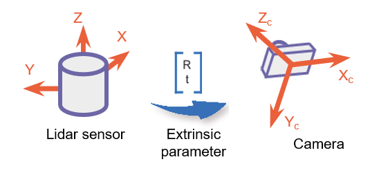
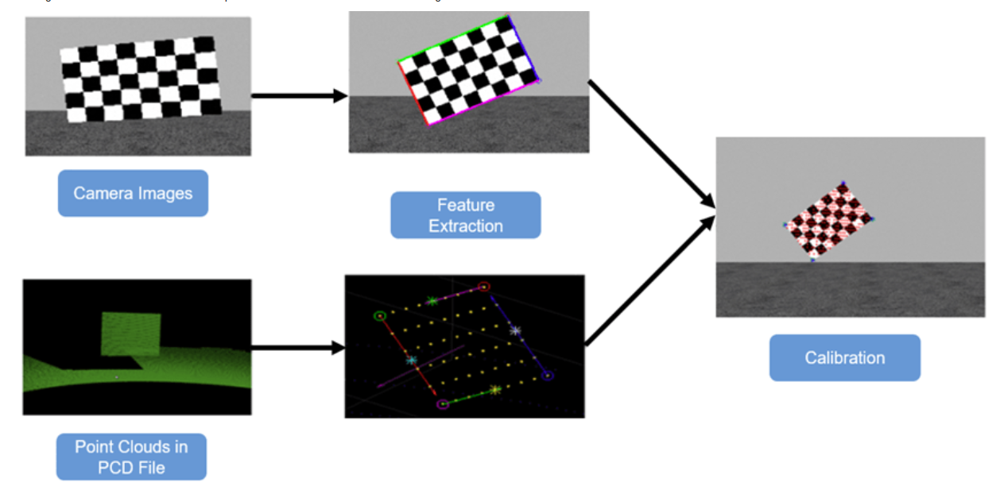
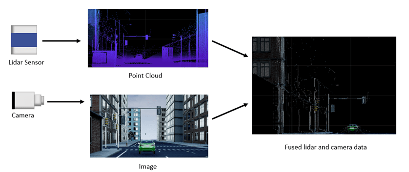

# Lidar Camera Calibration

Lidar-camera calibration is about finding the right transform between camera and lidar.
The calibration process is usually done through matching against chessboards.

      

 

    

 

Ideally, the lidar and camera outputs would fuse into one by the calibrated extrinsic transform.

    

 

