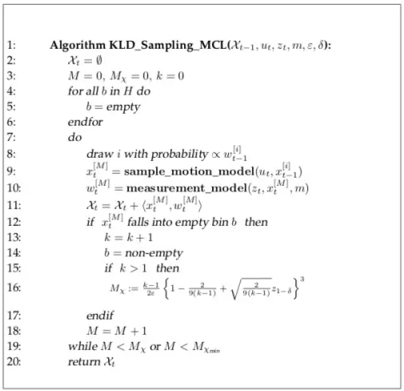
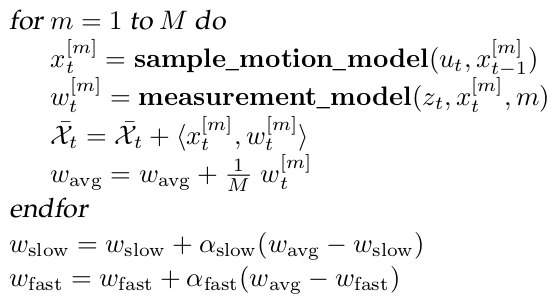

# AMCL Implementation

* Init histogram (basically a kd-tree) setting all bins to empty (bin has no particle), that each bin represents a small cell/tile in a map
* For $M<M_{m}$ and $M<M_{max}$, where $M$ means the particle index, generate/select particle $i$ by $\text{probability}\propto \bold{w}_{t-1}^{[i]}$, indicating the previous step $t-1$ particles with the highest weights are most likely selected (weight represents the confidence of a correct particle's pose)
  * motion model update by this time motion $\bold{u}_t$ to the last time state $\bold{x}_{t-1}^{[i]}$ to produce this time motion result $\bold{x}_{t}^{[M]}$
  * measurement model update (such as by scan matching) by this time motion result $\bold{x}_{t}^{[M]}$ with this time observation $\bold{z}_t$ to produce this time measurement $\bold{w}_{t}^{[M]}$, also served as the weights.
  * If $\bold{x}_{t}^{[M]}$ falls into an empty bin $b$, mark the bin non-empty and increase the total number of particle $M_{m}$ by the KLD formula
  * Keep running the loop until that $M<M_{m}$ and $M<M_{max}$ do not satisfy

<div style="display: flex; justify-content: center;">
      
</div>
</br>

## Particle Filter Process

`laserReceived(...)` is the callback when a new laser scan arrives.

```cpp
tf2_ros::MessageFilter<sensor_msgs::LaserScan>* laser_scan_filter_;
laser_scan_filter_->registerCallback(boost::bind(&AmclNode::laserReceived,
                                                   this, _1));
```

`getOdomPose(...)` loads `latest_odom_pose_` to `pose`.
Then given by the odom prior kinematic prediction, move all particles `pf_` by the `odata.pose = pose;` and `odata.delta = delta;` with applied Gaussian noises.
In detail, `UpdateAction(...)` defines four types of kinematic odom models: `ODOM_MODEL_OMNI`, `ODOM_MODEL_DIFF`, `ODOM_MODEL_OMNI_CORRECTED` and `ODOM_MODEL_DIFF_CORRECTED`.

Take the source data `laser_scan` applied with some 

```cpp
AmclNode::laserReceived(const sensor_msgs::LaserScanConstPtr& laser_scan)
{
    // get and update odom
    pf_vector_t pose;
    getOdomPose(latest_odom_pose_, pose.v[0], pose.v[1], pose.v[2],
                  laser_scan->header.stamp, base_frame_id_);

    delta.v[0] = pose.v[0] - pf_odom_pose_.v[0];
    delta.v[1] = pose.v[1] - pf_odom_pose_.v[1];
    delta.v[2] = angle_diff(pose.v[2], pf_odom_pose_.v[2]);

    AMCLOdomData odata;
    odata.pose = pose;
    odata.delta = delta;
    odom_->UpdateAction(pf_, (AMCLSensorData*)&odata);

    // The AMCLLaserData destructor will free this memory
    ldata.ranges = new double[ldata.range_count][2];
    ROS_ASSERT(ldata.ranges);
    for(int i=0;i<ldata.range_count;i++)
    {
      // amcl doesn't (yet) have a concept of min range.  So we'll map short
      // readings to max range.
      if(laser_scan->ranges[i] <= range_min)
        ldata.ranges[i][0] = ldata.range_max;
      else if(laser_scan->ranges[i] > ldata.range_max)
        ldata.ranges[i][0] = std::numeric_limits<decltype(ldata.range_max)>::max();
      else
        ldata.ranges[i][0] = laser_scan->ranges[i];
      // Compute bearing
      ldata.ranges[i][1] = angle_min +
              (i * angle_increment);
    }

    lasers_[laser_index]->UpdateSensor(pf_, (AMCLSensorData*)&ldata);

    pf_update_resample(pf_);

    pf_odom_pose_ = pose;
}
```

### `UpdateAction(...)`

Apply Gaussian noises to kinematic movement (`OMNI`/`DIFF`) to update every particle's position.

```cpp
////////////////////////////////////////////////////////////////////////////////
// Apply the action model
bool AMCLOdom::UpdateAction(pf_t *pf, AMCLSensorData *data)
{
  AMCLOdomData *ndata;
  ndata = (AMCLOdomData*) data;

  // Compute the new sample poses
  pf_sample_set_t *set;

  set = pf->sets + pf->current_set;
  pf_vector_t old_pose = pf_vector_sub(ndata->pose, ndata->delta); // just a vector element-wise subtraction

  switch( this->model_type )
  {
  case ODOM_MODEL_OMNI:
  {
    double delta_trans, delta_rot, delta_bearing;
    double delta_trans_hat, delta_rot_hat, delta_strafe_hat;

    delta_trans = sqrt(ndata->delta.v[0]*ndata->delta.v[0] +
                       ndata->delta.v[1]*ndata->delta.v[1]);
    delta_rot = ndata->delta.v[2];

    // Precompute a couple of things
    double trans_hat_stddev = (alpha3 * (delta_trans*delta_trans) +
                               alpha1 * (delta_rot*delta_rot));
    double rot_hat_stddev = (alpha4 * (delta_rot*delta_rot) +
                             alpha2 * (delta_trans*delta_trans));
    double strafe_hat_stddev = (alpha1 * (delta_rot*delta_rot) +
                                alpha5 * (delta_trans*delta_trans));

    for (int i = 0; i < set->sample_count; i++)
    {
      pf_sample_t* sample = set->samples + i;

      delta_bearing = angle_diff(atan2(ndata->delta.v[1], ndata->delta.v[0]),
                                 old_pose.v[2]) + sample->pose.v[2];
      double cs_bearing = cos(delta_bearing);
      double sn_bearing = sin(delta_bearing);

      // Sample pose differences
      delta_trans_hat = delta_trans + pf_ran_gaussian(trans_hat_stddev);
      delta_rot_hat = delta_rot + pf_ran_gaussian(rot_hat_stddev);
      delta_strafe_hat = 0 + pf_ran_gaussian(strafe_hat_stddev);
      // Apply sampled update to particle pose
      sample->pose.v[0] += (delta_trans_hat * cs_bearing + 
                            delta_strafe_hat * sn_bearing);
      sample->pose.v[1] += (delta_trans_hat * sn_bearing - 
                            delta_strafe_hat * cs_bearing);
      sample->pose.v[2] += delta_rot_hat ;
    }
  }  break;
  case ODOM_MODEL_DIFF: { ... } break;
  case ODOM_MODEL_OMNI_CORRECTED: { ... } break;
  case ODOM_MODEL_DIFF_CORRECTED: { ... } break;
  }
  return true;
}
```

### `UpdateSensor(...)`

`UpdateSensor(...)` provides four types of laser update models: `LASER_MODEL_BEAM`, `LASER_MODEL_LIKELIHOOD_FIELD` and `LASER_MODEL_LIKELIHOOD_FIELD_PROB`.

```cpp
// Apply the laser sensor model
bool AMCLLaser::UpdateSensor(pf_t *pf, AMCLSensorData *data)
{
  if (this->max_beams < 2)
    return false;

  // Apply the laser sensor model
  if(this->model_type == LASER_MODEL_BEAM)
    pf_update_sensor(pf, (pf_sensor_model_fn_t) BeamModel, data);
  else if(this->model_type == LASER_MODEL_LIKELIHOOD_FIELD)
    pf_update_sensor(pf, (pf_sensor_model_fn_t) LikelihoodFieldModel, data);  
  else if(this->model_type == LASER_MODEL_LIKELIHOOD_FIELD_PROB)
    pf_update_sensor(pf, (pf_sensor_model_fn_t) LikelihoodFieldModelProb, data);  
  else
    pf_update_sensor(pf, (pf_sensor_model_fn_t) BeamModel, data);

  return true;
}  
```

Take `LASER_MODEL_LIKELIHOOD_FIELD` for example.
Compute laser beam $x$ and $y$ coord by `hit.v[0] = pose.v[0] + obs_range * cos(pose.v[2] + obs_bearing);` and `hit.v[1] = pose.v[1] + obs_range * sin(pose.v[2] + obs_bearing);` (of course there are some assertions such as filtering out out-of-max-limit laser beams).
The map coords are mapped by index `z = self->map->cells[MAP_INDEX(self->map,mi,mj)].occ_dist;`.

`pz` is the individual sample's each laser beam probability by Gaussian model.
`p += pz*pz*pz;` is the total of one sample's weight `sample->weight *= p;`.

```cpp
double AMCLLaser::LikelihoodFieldModel(AMCLLaserData *data, pf_sample_set_t* set)
{
  AMCLLaser *self;
  int i, j, step;
  double z, pz;
  double p;
  double obs_range, obs_bearing;
  double total_weight;
  pf_sample_t *sample;
  pf_vector_t pose;
  pf_vector_t hit;

  self = (AMCLLaser*) data->sensor;

  total_weight = 0.0;

  // Compute the sample weights
  for (j = 0; j < set->sample_count; j++)
  {
    sample = set->samples + j;
    pose = sample->pose;

    // Take account of the laser pose relative to the robot
    pose = pf_vector_coord_add(self->laser_pose, pose);

    p = 1.0;

    // Pre-compute a couple of things
    double z_hit_denom = 2 * self->sigma_hit * self->sigma_hit;
    double z_rand_mult = 1.0/data->range_max;

    step = (data->range_count - 1) / (self->max_beams - 1);

    // Step size must be at least 1
    if(step < 1)
      step = 1;

    for (i = 0; i < data->range_count; i += step)
    {
      obs_range = data->ranges[i][0];
      obs_bearing = data->ranges[i][1];

      // This model ignores max range readings
      if(obs_range >= data->range_max)
        continue;

      // Check for NaN
      if(obs_range != obs_range)
        continue;

      pz = 0.0;

      // Compute the endpoint of the beam
      hit.v[0] = pose.v[0] + obs_range * cos(pose.v[2] + obs_bearing);
      hit.v[1] = pose.v[1] + obs_range * sin(pose.v[2] + obs_bearing);

      // Convert to map grid coords.
      int mi, mj;
      mi = MAP_GXWX(self->map, hit.v[0]);
      mj = MAP_GYWY(self->map, hit.v[1]);
      
      // Part 1: Get distance from the hit to closest obstacle.
      // Off-map penalized as max distance
      if(!MAP_VALID(self->map, mi, mj))
        z = self->map->max_occ_dist;
      else
        z = self->map->cells[MAP_INDEX(self->map,mi,mj)].occ_dist;
      // Gaussian model
      // NOTE: this should have a normalization of 1/(sqrt(2pi)*sigma)
      pz += self->z_hit * exp(-(z * z) / z_hit_denom);
      // Part 2: random measurements
      pz += self->z_rand * z_rand_mult;

      // TODO: outlier rejection for short readings

      assert(pz <= 1.0);
      assert(pz >= 0.0);
      //      p *= pz;
      // here we have an ad-hoc weighting scheme for combining beam probs
      // works well, though...
      p += pz*pz*pz;
    }

    sample->weight *= p;
    total_weight += sample->weight;
  }

  return(total_weight);
}

```

Finally, having computed the sample weights `total = (*sensor_fn) (sensor_data, set);` by the above `LikelihoodFieldModel(...)`,
normalize the sample weights `sample->weight /= total;`.

Given the observation from start to the last time step $\bold{z}_{1:t-1}$ and kinematic motion of all history steps $\bold{u}_{1:t}$, the $m$-th particle's sensor observation probability is $p(\bold{z}_t | \bold{z}_{1:t-1}, \bold{u}_{1:t}, m)$. 

Take the particles' mean position as final estimate, there is $\frac{1}{M} \sum^{M}_{m=1} w^{[m]}_t \approx p(\bold{z}_t | \bold{z}_{1:t-1}, \bold{u}_{1:t}, m)$, indicating that for every particle $m$, its position should stay close to each other.

However, this long-term average strategy considering over the $1:t-1$ time periods can be bad (particles can be sparse when performing global relocalization, and history errors accumulate over the time).
A short-term average strategy on the other hand have only recent limited steps.
A good solution should reach a trade off between long-term and short-term average strategies.

Here introduces $0 < \alpha_{\text{slow}} \ll \alpha_{\text{fast}} < 1$ that `double alpha_slow, alpha_fast;` are decay rates for running averages.


<div style="display: flex; justify-content: center;">
      
</div>
</br>

$w_{\text{fast}}$ and $w_{\text{slow}}$ are ratio between short/long-term particles.
Later will see $1 - \frac{w_{\text{fast}}}{w_{\text{slow}}}$ that `w_diff = 1.0 - pf->w_fast / pf->w_slow;` determines if particles are resampled by randomly generation or directly copied from the existing ones.

```cpp
// Update the filter with some new sensor observation
void pf_update_sensor(pf_t *pf, pf_sensor_model_fn_t sensor_fn, void *sensor_data)
{
  int i;
  pf_sample_set_t *set;
  pf_sample_t *sample;
  double total;

  set = pf->sets + pf->current_set;

  // Compute the sample weights
  total = (*sensor_fn) (sensor_data, set);

  set->n_effective = 0;
  
  if (total > 0.0)
  {
    // Normalize weights
    double w_avg=0.0;
    for (i = 0; i < set->sample_count; i++)
    {
      sample = set->samples + i;
      w_avg += sample->weight;
      sample->weight /= total;
      set->n_effective += sample->weight*sample->weight;
    }
    // Update running averages of likelihood of samples (Prob Rob p258)
    w_avg /= set->sample_count;
    if(pf->w_slow == 0.0)
      pf->w_slow = w_avg;
    else
      pf->w_slow += pf->alpha_slow * (w_avg - pf->w_slow);
    if(pf->w_fast == 0.0)
      pf->w_fast = w_avg;
    else
      pf->w_fast += pf->alpha_fast * (w_avg - pf->w_fast);
    //printf("w_avg: %e slow: %e fast: %e\n", 
           //w_avg, pf->w_slow, pf->w_fast);
  }
  else
  {
    // Handle zero total
    for (i = 0; i < set->sample_count; i++)
    {
      sample = set->samples + i;
      sample->weight = 1.0 / set->sample_count;
    }
  }

  set->n_effective = 1.0/set->n_effective;
  return;
}
```


### `pf_update_resample(...)`

Resample particles based on weights of a KD tree.

`pf_cluster_stats(...)` computes the mean and covariance of a set of weighted particles.
`sample->pose.v[0]` is particle's $x$ coordinate;
`sample->pose.v[1]` is particle's $y$ coordinate;
`cos(sample->pose.v[2])` particle's orientation $\theta$'s in the $x$-direction;
`sin(sample->pose.v[2])` particle's orientation $\theta$'s in the $y$-direction.

```cpp
void pf_cluster_stats(pf_t *pf, pf_sample_set_t *set)
{
  ...

  m[0] += sample->weight * sample->pose.v[0];
  m[1] += sample->weight * sample->pose.v[1];
  m[2] += sample->weight * cos(sample->pose.v[2]);
  m[3] += sample->weight * sin(sample->pose.v[2]);

  // Compute covariance in linear components
  for (j = 0; j < 2; j++)
    for (k = 0; k < 2; k++)
    {
      c[j][k] += sample->weight * sample->pose.v[j] * sample->pose.v[k];
    }

  // Covariance in linear components
  for (j = 0; j < 2; j++)
    for (k = 0; k < 2; k++)
      set->cov.m[j][k] = c[j][k] / weight - set->mean.v[j] * set->mean.v[k];

  ...
}
```

`pf_update_resample(...)` computes means and covariances of the samples, 
then computes the histogram of the number of particles contained in a cell by `pf_kdtree_insert(...)`;
finally, it judges if the particles are converged to a small distance threshold centered at a cell by `pf_update_converged(...)`.

The sampling goes as below
* `pf_sample_set_t *set_a, *set_b;` are used to indicate current/backup sample set (`(pf->current_set + 1) % 2;` means alternating activating using the current set)
* `while(set_b->sample_count < pf->max_samples)` says continuing generating new samples until hitting max sample limit
* `w_diff = 1.0 - pf->w_fast / pf->w_slow;` determines the ratio of samples being randomly generated vs set to the current pose
* `if(drand48() < w_diff)` is a random number test that if true, the new sample particle pose `sample_b->pose = (pf->random_pose_fn)(pf->random_pose_data);` is randomly generated; if not `sample_b->pose = sample_a->pose;` is set to copying the `sample_a`'s pose, which is the current pose as in the init `set_a = pf->sets + pf->current_set;`
* `pf_resample_limit(...)` is used to compute KLD sample number limit

```cpp
// Resample the distribution
void pf_update_resample(pf_t *pf)
{
  int i;
  double total;
  pf_sample_set_t *set_a, *set_b;
  pf_sample_t *sample_a, *sample_b;

  //double r,c,U;
  //int m;
  //double count_inv;
  double* c;

  double w_diff;

  set_a = pf->sets + pf->current_set;
  set_b = pf->sets + (pf->current_set + 1) % 2;

  if (pf->selective_resampling != 0)
  {
    if (set_a->n_effective > 0.5*(set_a->sample_count))
    {
      // copy set a to b
      copy_set(set_a,set_b);

      // Re-compute cluster statistics
      pf_cluster_stats(pf, set_b);

      // Use the newly created sample set
      pf->current_set = (pf->current_set + 1) % 2;
      return;
    }
  }

  // Build up cumulative probability table for resampling.
  // TODO: Replace this with a more efficient procedure
  // (e.g., http://www.network-theory.co.uk/docs/gslref/GeneralDiscreteDistributions.html)
  c = (double*)malloc(sizeof(double)*(set_a->sample_count+1));
  c[0] = 0.0;
  for(i=0;i<set_a->sample_count;i++)
    c[i+1] = c[i]+set_a->samples[i].weight;

  // Create the kd tree for adaptive sampling
  pf_kdtree_clear(set_b->kdtree);
  
  // Draw samples from set a to create set b.
  total = 0;
  set_b->sample_count = 0;

  w_diff = 1.0 - pf->w_fast / pf->w_slow;
  if(w_diff < 0.0)
    w_diff = 0.0;

  while(set_b->sample_count < pf->max_samples)
  {
    sample_b = set_b->samples + set_b->sample_count++;

    if(drand48() < w_diff)
      sample_b->pose = (pf->random_pose_fn)(pf->random_pose_data);
    else
    {
      // Naive discrete event sampler
      double r;
      r = drand48();
      for(i=0;i<set_a->sample_count;i++)
      {
        if((c[i] <= r) && (r < c[i+1]))
          break;
      }
      assert(i<set_a->sample_count);

      sample_a = set_a->samples + i;

      assert(sample_a->weight > 0);

      // Add sample to list
      sample_b->pose = sample_a->pose;
    }

    sample_b->weight = 1.0;
    total += sample_b->weight;

    // Add sample to histogram
    pf_kdtree_insert(set_b->kdtree, sample_b->pose, sample_b->weight);

    // See if we have enough samples yet
    if (set_b->sample_count > pf_resample_limit(pf, set_b->kdtree->leaf_count))
      break;
  }
  
  // Reset averages, to avoid spiraling off into complete randomness.
  if(w_diff > 0.0)
    pf->w_slow = pf->w_fast = 0.0;

  // Normalize weights
  for (i = 0; i < set_b->sample_count; i++)
  {
    sample_b = set_b->samples + i;
    sample_b->weight /= total;
  }
  
  // Re-compute cluster statistics
  pf_cluster_stats(pf, set_b);

  // Use the newly created sample set
  pf->current_set = (pf->current_set + 1) % 2; 

  pf_update_converged(pf);

  free(c);
  return;
}
```

`pf_kdtree_insert(...)` takes a pose's position's cell as the key.
The key's value is the weight.

The kd tree builds in a recursive manner that if two particle stay in the same cell, the cell's weight takes the sum of the two particles' weights `pf_kdtree_equal(self, key, node->key) node->value += value;`.

```cpp
////////////////////////////////////////////////////////////////////////////////
// Insert a pose into the tree.
void pf_kdtree_insert(pf_kdtree_t *self, pf_vector_t pose, double value)
{
  int key[3];

  key[0] = floor(pose.v[0] / self->size[0]);
  key[1] = floor(pose.v[1] / self->size[1]);
  key[2] = floor(pose.v[2] / self->size[2]);

  self->root = pf_kdtree_insert_node(self, NULL, self->root, key, value);

  return;
}

////////////////////////////////////////////////////////////////////////////////
// Insert a node into the tree
pf_kdtree_node_t *pf_kdtree_insert_node(pf_kdtree_t *self, pf_kdtree_node_t *parent,
                                        pf_kdtree_node_t *node, int key[], double value)
{
  int i;
  int split, max_split;

  // If the node doesnt exist yet...
  if (node == NULL)
  {
    assert(self->node_count < self->node_max_count);
    node = self->nodes + self->node_count++;
    memset(node, 0, sizeof(pf_kdtree_node_t));

    node->leaf = 1;

    if (parent == NULL)
      node->depth = 0;
    else
      node->depth = parent->depth + 1;

    for (i = 0; i < 3; i++)
      node->key[i] = key[i];

    node->value = value;
    self->leaf_count += 1;
  }

  // If the node exists, and it is a leaf node...
  else if (node->leaf)
  {
    // If the keys are equal, increment the value
    if (pf_kdtree_equal(self, key, node->key))
    {
      node->value += value;
    }

    // The keys are not equal, so split this node
    else
    {
      // Find the dimension with the largest variance and do a mean
      // split
      max_split = 0;
      node->pivot_dim = -1;
      for (i = 0; i < 3; i++)
      {
        split = abs(key[i] - node->key[i]);
        if (split > max_split)
        {
          max_split = split;
          node->pivot_dim = i;
        }
      }
      assert(node->pivot_dim >= 0);

      node->pivot_value = (key[node->pivot_dim] + node->key[node->pivot_dim]) / 2.0;

      if (key[node->pivot_dim] < node->pivot_value)
      {
        node->children[0] = pf_kdtree_insert_node(self, node, NULL, key, value);
        node->children[1] = pf_kdtree_insert_node(self, node, NULL, node->key, node->value);
      }
      else
      {
        node->children[0] = pf_kdtree_insert_node(self, node, NULL, node->key, node->value);
        node->children[1] = pf_kdtree_insert_node(self, node, NULL, key, value);
      }

      node->leaf = 0;
      self->leaf_count -= 1;
    }
  }

  // If the node exists, and it has children...
  else
  {
    assert(node->children[0] != NULL);
    assert(node->children[1] != NULL);

    if (key[node->pivot_dim] < node->pivot_value)
      pf_kdtree_insert_node(self, node, node->children[0], key, value);
    else
      pf_kdtree_insert_node(self, node, node->children[1], key, value);
  }

  return node;
}
```

The convergence condition judges all particles' positions (no orientation) be within a distance threshold, that is `if(fabs(sample->pose.v[0] - mean_x) > pf->dist_threshold || fabs(sample->pose.v[1] - mean_y) > pf->dist_threshold)` to be false

```cpp
int pf_update_converged(pf_t *pf)
{
  int i;
  pf_sample_set_t *set;
  pf_sample_t *sample;
  double total;

  set = pf->sets + pf->current_set;
  double mean_x = 0, mean_y = 0;

  for (i = 0; i < set->sample_count; i++){
    sample = set->samples + i;

    mean_x += sample->pose.v[0];
    mean_y += sample->pose.v[1];
  }
  mean_x /= set->sample_count;
  mean_y /= set->sample_count;
  
  for (i = 0; i < set->sample_count; i++){
    sample = set->samples + i;
    if(fabs(sample->pose.v[0] - mean_x) > pf->dist_threshold || 
       fabs(sample->pose.v[1] - mean_y) > pf->dist_threshold){
      set->converged = 0; 
      pf->converged = 0; 
      return 0;
    }
  }
  set->converged = 1; 
  pf->converged = 1; 
  return 1; 
}
```

### KLD Limit 

`pf_resample_limit(...)` implements the KLD limit.
$$
n=\frac{k-1}{2\epsilon}
\bigg( 
    1-\frac{2}{9(k-1)} + \sqrt{\frac{2}{9(k-1)}}z_{1-\delta} 
\bigg)^3
$$
where $z_{1-\delta}$ is the upper $1-\delta$ quantile of the standard normal distribution.

```cpp
// Compute the required number of samples, given that there are k bins
// with samples in them.  This is taken directly from Fox et al.
int pf_resample_limit(pf_t *pf, int k)
{
  double a, b, c, x;
  int n;

  // Return max_samples in case k is outside expected range, this shouldn't
  // happen, but is added to prevent any runtime errors
  if (k < 1 || k > pf->max_samples)
      return pf->max_samples;

  // Return value if cache is valid, which means value is non-zero positive
  if (pf->limit_cache[k-1] > 0)
    return pf->limit_cache[k-1];

  if (k == 1)
  {
    pf->limit_cache[k-1] = pf->max_samples;
    return pf->max_samples;
  }

  a = 1;
  b = 2 / (9 * ((double) k - 1));
  c = sqrt(2 / (9 * ((double) k - 1))) * pf->pop_z;
  x = a - b + c;

  n = (int) ceil((k - 1) / (2 * pf->pop_err) * x * x * x);

  if (n < pf->min_samples)
  {
    pf->limit_cache[k-1] = pf->min_samples;
    return pf->min_samples;
  }
  if (n > pf->max_samples)
  {
    pf->limit_cache[k-1] = pf->max_samples;
    return pf->max_samples;
  }
  
  pf->limit_cache[k-1] = n;
  return n;
}
```