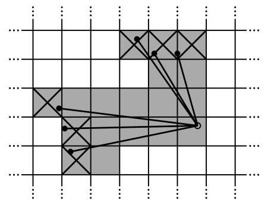

# Lidar Mapping Google Cartographer

## Local Mapping

### Scans

Laser scans are recorded and are transformed by a static homogeneous transformation matrix to a robot's origin.

Scan point set: $H=\{h_k\}\_{k=1,2,3,...,K}, h_k \in R^2$

The pose $\xi$ of the scan frame in the
submap frame transformation: $T_{\xi}$

### Submaps

A few consecutive scans are used to build a submap. 
These submaps take the form of probability grids $M : rZ × rZ \rightarrow [p_{min} , p_{max} ]$ which map from discrete grid points at a given resolution $r$, for example $5$ cm, to values. $Z$ is the height/width of the submap image.

$p_{hit}$ and $p_{miss}$ are computed by the number of hits and misses over total laser scannings on a particular grid point.

If $M(x)$ has not yet been observed, it is assigned $p_{hit}$ or $p_{miss}$; if $M(x)$ is observed, it can be updated.

<div style="display: flex; justify-content: center;">
      
</div>
</br>

$$
\text{odds}(p)=\frac{p}{1-p}
$$

Define the formula to compute the new grid point:

$$
M_{new}(x) = \text{clamp}\Big(
    \frac{1}{
    \text{odds} \big( \text{odds}\big(M_{old}(x)\big) \cdot \text{odds}(p_{hit}) \big)}
\Big)
$$
where $\text{odds}\big(M_{old}(x)\big) \cdot \text{odds}(p_{hit})$ is the update to the old grid point,
and $\text{clamp}$ is a function that contains a value $x$ within an interval $[a,b]$
$$
\text{clamp}(x) = \text{max}
\big( a, \text{min}(x, b) \big) \in [a, b]
$$

### Scan Matching

The scan matcher is responsible for
finding a scan pose $\xi$ that maximizes the probabilities at the scan points in the submap.

$$
arg \space \underset{\xi}{min} \sum_{k=1}^K \big(1-M_{smooth}(T_\xi h_k)\big)^2
$$
where $T_\xi$ transforms $h_k$ from the scan frame to the submap
frame according to the scan pose.

$M_{smooth}: R^2 \rightarrow R$ by nature is Bicubic Interpolation whose output is in the range $(0, 1)$ (when near to one, the matching result is considered good). It is used to "smooth" the generated grid map.

## Closing Loops

### Closing Loop Optimization

Local closing loop problem refers to optimizing submap poses $\Xi^m = \{\xi^m_0, \xi^m_1, \xi^m_2, ..., \xi^m_k\}$ and scan poses $\Xi^s = \{\xi^s_0, \xi^s_1, \xi^s_2, ..., \xi^s_k\}$ over a route.

Closing loop optimization:

$$
arg\space \underset{\Xi^m， \Xi^s}{min} \frac{1}{2} \underset{i,j}{\sum} \rho \big( E^2(\xi^m_i, \xi^s_j; \Sigma_{i,j}, \xi_{i,j}) \big)
$$
where constraints take the form of relative poses $\xi_{i,j}$ (describes where in the submap coordinate frame the scan was matched), 
and associated covariance matrices $\Sigma_{i,j}$, for input pair $\xi^m_i, \xi^s_j$. The employed loss $\rho$ is *Huber Loss*.

In detail,
$$
E^2(\xi^m_i, \xi^s_j; \Sigma_{i,j}, \xi_{i,j}) 
\\ =
\mathbf{e}(\xi^m_i, \xi^s_j; \xi_{i,j})^T \Sigma_{i,j} \mathbf{e}(\xi^m_i, \xi^s_j; \xi_{i,j})
$$
in which, $\mathbf{e}(\xi^m_i, \xi^s_j; \xi_{i,j})$ describes the error of robot one step pose against its scans and generated submap, such that

$$
\mathbf{e}(\xi^m_i, \xi^s_j; \xi_{i,j}) =
 \xi_{i,j} - 
\begin{bmatrix}
    R^{-1}\_{\xi^m_i} (\mathbf{t}\_{\xi^m_i} - \mathbf{t}\_{\xi^s_j}) \\
    \xi^m_{i;\theta} - \xi^s_{j;\theta}
\end{bmatrix}
$$
where $R^{-1}\_{\xi^m_i} (\mathbf{t}\_{\xi^m_i} - \mathbf{t}\_{\xi^s_j})$ describes the translation differences between $\xi^m_i$ and $\xi^s_j$ aligned to the submap coordinates by $R^{-1}\_{\xi^m_i}$, 
and $\xi^m_{i;\theta} - \xi^s_{j;\theta}$ describes the gap of the two poses' orientations.

Recall that relative poses $\xi_{i,j}$ (describes where in the submap coordinate frame the scan was matched)

### Search Window $W$ For Fine-Tuning

Define a pose search window $W$,
and $M_{nearest}(T_{\xi}h_k)$ is the $T_{\xi \in W}$ transformed grid.
$\scriptsize{nearest}$ has its name for the search window $W$ does not deviate a lot from where it begins, and the change increment is small as well. 

$$
\xi^* = \argmax_{\xi \in W} \sum_{k=1}^K M_{nearest}(T_{\xi}h_k)
$$
where $\xi \in W$ means employment of a discrete search window. Define resolution $r$ and $\delta_\theta$ for the pose search window boundary $W_x=7 m, W_y=7m, W_\theta=30^\circ$, the discrete search step is

$$
w_x = \frac{W_x}{r}
, \qquad
w_y = \frac{W_y}{r}
, \qquad
w_\theta = \frac{W_\theta}{\delta_\theta}
$$

Accordingly, a naive approach for optimal $\xi^*$ can be computed by iterating all possible discrete steps such as

$$
\begin{align*}
\\& 
\rule{10cm}{1pt}
\\&
\text{Naive Search}
\\& 
\rule{10cm}{0.5pt}
\\& 
    bestScore \leftarrow -\infty
\\& 
    \mathbf{\text{for }} i_x = -w_x \mathbf{\text{ to }} w_x \mathbf{\text{ do }}
\\& \quad
    \mathbf{\text{for }} i_y = -w_y \mathbf{\text{ to }} w_y \mathbf{\text{ do }}
\\& \quad\quad
    \mathbf{\text{for }} i_\theta = -w_\theta \mathbf{\text{ to }} w_\theta \mathbf{\text{ do }}
\\& \quad\quad\quad
    score \leftarrow \sum_{k=1}^K M_{nearest}(T_{\xi_0+[ri_x,ri_y,\delta_\theta]}h_k)
\\& \quad\quad\quad
    \mathbf{\text{if }} score > bestScore \mathbf{\text{ then }}
\\& \quad\quad\quad\quad
    match \leftarrow \xi_0+[ri_x,ri_y,\delta_\theta]
\\& \quad\quad\quad\quad
    bestScore \leftarrow score
\\& \quad\quad\quad
    \mathbf{\text{end if }}
\\& \quad\quad
    \mathbf{\text{end for}}
\\& \quad
    \mathbf{\text{end for}}
\\&
    \mathbf{\text{end for}}
\\ &
\mathbf{\text{return }} match     \mathbf{\text{ and }} bestScore
\\& 
\rule{10cm}{0.5pt}
\end{align*}
$$

### Branch-And-Bound Scan Matching

Full search window traversal is time-consuming, hence employing-Branch and-Bound.
It uses a tree structure to represent the search space:
* root - all possibilities
* children nodes - form a
partition of their parent (a subset of parent possibilities)
* leaf nodes - singletons; each
represents a single feasible solution.

The search problem then becomes traversing the nodes of the tree.
To facilitate the traversal, should trim this tree and split branches by the condition $score$:

All nodes of a parent should NOT see their $score$ greater than their parent's $score$ (called *bound*).
So that if a inner node's $score$ is small, all its subset branches/nodes can be trimmed/removed (called *branch*).

## Config

* `double max_constraint_distance = 2.`

Threshold for poses to be considered near a submap.

`initial_relative_pose` is computed to the difference between the pose at a trajectory's particular `node_id` and the pose at a `submap_id`,
so that it can be known that if the trajectory node belongs to a submap, or deviates too far away.

```cpp
const transform::Rigid2d initial_relative_pose =
      optimization_problem_->submap_data()
          .at(submap_id)
          .global_pose.inverse() *
      optimization_problem_->node_data().at(node_id).global_pose_2d;

if (initial_relative_pose.translation().norm() >
  options_.max_constraint_distance()) {
  return;
}
```

* `min_score = 0.55`

Threshold for the scan match score below which a match is not considered. Low scores indicate that the scan and map do not look similar.

It is used in Branch and Bound where whether a `best_candidate` should update or not.

```cpp
const Candidate2D best_candidate = BranchAndBound(
    discrete_scans, search_parameters, lowest_resolution_candidates,
    precomputation_grid_stack_->max_depth(), min_score);
if (best_candidate.score > min_score) {
  *score = best_candidate.score;
  *pose_estimate = transform::Rigid2d(
      {initial_pose_estimate.translation().x() + best_candidate.x,
       initial_pose_estimate.translation().y() + best_candidate.y},
      initial_rotation * Eigen::Rotation2Dd(best_candidate.orientation));
  return true;
}
```

* `int32 optimize_every_n_nodes = 90`

Online loop closure: If positive, will run the loop closure while the map is built.

* `double global_sampling_ratio = 0.003`

Rate at which we sample a single trajectory’s nodes for global localization.

* `int32 branch_and_bound_depth = 7`

Number of precomputed grids to use.
