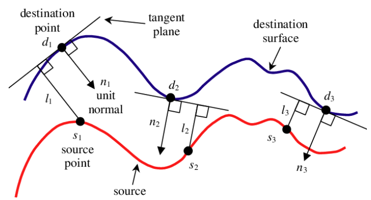

# Iterative Closest Point (ICP)

Given some source points, with applied transformation (rotation and translation $[\mathbf{R}|\mathbf{t}]$), algorithm iteratively revises the transformation $[\mathbf{R}|\mathbf{t}]$ to minimize an error metric $\mathbf{e}$ (typically the sum of squared differences) between output (result of the transformation) point cloud and reference (observed) cloud.

Suppose there are two sets of to-be-matched 3D points; the correspondences are shown as below

$$
\mathbf{P}=[\mathbf{p}_1, \mathbf{p}_2, ..., \mathbf{p}_n]
,\quad
\mathbf{P}'=[\mathbf{p}'_1, \mathbf{p}'_2, ..., \mathbf{p}'_n]
$$

There should be extrinsics (rotation and translation) that corresponds the two sets of points.

$$
\begin{align*}
\forall i, \mathbf{p}_i &= \mathbf{R}\mathbf{p}'_i+\mathbf{t}
\\\\ &=
[\mathbf{R}|\mathbf{t}] \mathbf{p}'_i
\end{align*}
$$

The error $\mathbf{e}_i$ can be defined the difference between the base point $\mathbf{p}_i$ and the correspondence point $\mathbf{p}'_i$

$$
\mathbf{e}_i = 
\mathbf{p}_i - (\mathbf{R}\mathbf{p}'_i + \mathbf{t})
$$

Accordingly, the least-square problem to find the optimal $[\mathbf{R}|\mathbf{t}]^*$ with minimized error $\mathbf{e}$ can be defined as

$$
\begin{align*}
\big[\mathbf{R}|\mathbf{t} \big]^* &= 
arg \space \underset{\big[\mathbf{R}|\mathbf{t} \big]}{min}
\frac{1}{2} \sum^n_{i=1}
\big|\big|
    \mathbf{e}_i
\big|\big|^2_2
\\\\ &=
arg \space \underset{\big[\mathbf{R}|\mathbf{t} \big]}{min}
\frac{1}{2} \sum^n_{i=1}
\bigg|\bigg|
  \mathbf{p}_i -  \big[\mathbf{R}|\mathbf{t} \big] \mathbf{p}'_i
\bigg|\bigg|^2_2
\\\\ &=
arg \space \underset{\big[\mathbf{R}|\mathbf{t} \big]}{min}
\frac{1}{2} \sum^n_{i=1}
\bigg|\bigg|
  \mathbf{p}_i -  (\mathbf{R} \mathbf{p}'_i + \mathbf{t})
\bigg|\bigg|^2_2
\end{align*}
$$

Define the centroids $\mathbf{p}_c, \mathbf{p}'_c$ of the point clouds $\mathbf{P}$ and $\mathbf{P}'$, respectively, there are

$$
\mathbf{p}_c = \frac{1}{n} \sum_{i=1}^n \mathbf{p}_i
, \quad
\mathbf{p}'_c = \frac{1}{n} \sum_{i=1}^n \mathbf{p}'_i
$$

Compute the least square function with the centroids such as

$$
\begin{align*}
    \frac{1}{2} \sum^n_{i=1}
    \bigg|\bigg|
        \mathbf{p}_i -  \big[\mathbf{R}|\mathbf{t} \big] \mathbf{p}'_i
    \bigg|\bigg|^2_2
    &=
    \frac{1}{2} \sum^n_{i=1}
    \bigg|\bigg|
        \mathbf{p}_i - (\mathbf{R} \mathbf{p}'_i + \mathbf{t})
    \bigg|\bigg|^2_2
    \\\\ &=
    \frac{1}{2} \sum^n_{i=1}
    \bigg|\bigg|
        \mathbf{p}_i - \mathbf{R} \mathbf{p}'_i - \mathbf{t} 
        - \mathbf{p}_c + \mathbf{p}_c
        - \mathbf{R}\mathbf{p}'_c + \mathbf{R}\mathbf{p}'_c
    \bigg|\bigg|^2_2
    \\\\ &=
    \frac{1}{2} \sum^n_{i=1}
    \bigg|\bigg|
        \big(\mathbf{p}_i - \mathbf{p}_c -\mathbf{R}(\mathbf{p}'_i - \mathbf{p}'_c)\big)
        +
        (\mathbf{p}_c-\mathbf{R}\mathbf{p}'_c-\mathbf{t})
    \bigg|\bigg|^2_2
    \\\\ &=
    \frac{1}{2} \sum^n_{i=1}
    \bigg(
        \big|\big| 
            \mathbf{p}_i - \mathbf{p}_c -\mathbf{R}(\mathbf{p}'_i - \mathbf{p}'_c)
        \big|\big|^2_2
        \\\\ &\quad\quad\quad +
        \big|\big| 
            \mathbf{p}_c-\mathbf{R}\mathbf{p}'_c-\mathbf{t}
        \big|\big|_2^2
        \\\\ &\quad\quad\quad +
        \underbrace{        
            2\big(\mathbf{p}_i - \mathbf{p}_c -\mathbf{R}(\mathbf{p}'_i - \mathbf{p}'_c)\big)^\text{T} (\mathbf{p}_c-\mathbf{R}\mathbf{p}'_c-\mathbf{t})
        }_{\begin{matrix}
            =0 \\\\
            \text{because} \sum^n_{i=1}\mathbf{p}_c-\sum^n_{i=1}\mathbf{p}_i=0
            \\\\ \text{ and }
            \sum^n_{i=1}\mathbf{p}'_c-\sum^n_{i=1}\mathbf{p}'_i=0
        \end{matrix}
        }
    \bigg)
    \\\\ &=
    \frac{1}{2} \sum^n_{i=1}
    \bigg(
        \big|\big| 
            \mathbf{p}_i - \mathbf{p}_c -\mathbf{R}(\mathbf{p}'_i - \mathbf{p}'_c)
        \big|\big|^2_2
        \\\\ &\quad\quad\quad +
        \big|\big| 
            \mathbf{p}_c-\mathbf{R}\mathbf{p}'_c-\mathbf{t}
        \big|\big|_2^2
    \bigg)
\end{align*}
$$

The first term $\big|\big| \mathbf{p}_i - \mathbf{p}_c -\mathbf{R}(\mathbf{p}'_i - \mathbf{p}'_c)\big|\big|^2_2$ only contains a rotation matrix $\mathbf{R}$, and the second term $\big|\big| \mathbf{p}_c-\mathbf{R}\mathbf{p}'_c-\mathbf{t} \big|\big|_2^2$ only has the centroids $\mathbf{p}_c$ and $\mathbf{p}'_c$. The $\mathbf{t}$ in the second term can be solved if $\mathbf{R}$ is known. The $\mathbf{R}$ can be solved in the first term by setting $\mathbf{q}_i = \mathbf{p}_i - \mathbf{p}_c$ and $\mathbf{q}'_i = \mathbf{p}'_i - \mathbf{p}'_c$, so that the optimal rotation matrix $\mathbf{R}^*$ can be computed as

$$
\mathbf{R}^*=
arg \space \underset{\mathbf{R}}{min}
\frac{1}{2} \sum^n_{i=1}
\bigg|\bigg|
  \mathbf{q}_i - \mathbf{R} \mathbf{q}'_i
\bigg|\bigg|^2_2
$$

The least square problem for $\mathbf{R}^*$ can be rewritten as

$$
\frac{1}{2} \sum^n_{i=1}
\bigg|\bigg|
  \mathbf{q}_i - \mathbf{R} \mathbf{q}'_i
\bigg|\bigg|^2_2=
\frac{1}{2} \sum^n_{i=1}
\bigg(
    \underbrace{\mathbf{q}^\text{T}_i \mathbf{q}_i}_{\frac{\partial \mathbf{q}^\text{T}_i \mathbf{q}_i}{\partial \mathbf{R}}=0}
    +
    \mathbf{q}^\text{T}_i \underbrace{\mathbf{R}^\text{T}\mathbf{R}}_{=\mathbf{I}} \mathbf{q}'_i
    -
    \underbrace{2\mathbf{q}^\text{T}_i \mathbf{R} \mathbf{q}'_i}_{\text{To be maximized}}
\bigg)
$$

So that, finding $\mathbf{R}^*$ only needs to take care of this to-be-maximized term (here defines $\mathbf{q}^\text{T}_i \mathbf{R} \mathbf{q}'_i$ as the diagonal entries of $\mathbf{Q}^\text{T} \mathbf{R} \mathbf{Q}'$). By introducing trace operation, here derives:

$$
\begin{align*}
    \frac{1}{2} \sum^n_{i=1}
    2\mathbf{q}^\text{T}_i \mathbf{R} \mathbf{q}'_i
    &=
    tr \big(
        \mathbf{Q}^\text{T} \mathbf{R} \mathbf{Q}'
    \big)
    \\\\ &=
    tr \big(
        \mathbf{R} \mathbf{Q}' \mathbf{Q}^\text{T}
    \big)
\end{align*}
$$

Take SVD decomposition of $\mathbf{Q}' \mathbf{Q}^\text{T}$, there is

$$
\mathbf{Q}' \mathbf{Q}^\text{T}=
\mathbf{U} \mathbf{\Sigma} \mathbf{V}^\text{T}
$$

Then consider the trace operator.

$$
tr \big(
        \mathbf{R} \mathbf{Q}' \mathbf{Q}^\text{T}
\big)=
tr \big(
        \mathbf{R} \mathbf{U} \mathbf{\Sigma} \mathbf{V}^\text{T}
\big)=
tr \big(
        \mathbf{\Sigma} 
        \underbrace{\mathbf{V}^\text{T} \mathbf{R} \mathbf{U}}_{=\mathbf{M}}
\big)
$$

Set $\mathbf{M}=\mathbf{V}^\text{T} \mathbf{R} \mathbf{U}$. Note that $\mathbf{V}^\text{T}, \mathbf{R}, \mathbf{U}$ are orthogonal. Therefore, $\mathbf{M}$ is orthogonal as well (each column vector $\mathbf{m}_j \in \mathbf{M}$ is an orthonormal vector).

Due to orthogonality, there is $\mathbf{M}^\text{T}\mathbf{M}=\mathbf{I}$. So that for each column vector, the vector product should be $1$.
Set $d=3$ for the rigid motion $SE(3)$, and derived $|m_{ij}| \le 1$.

$$
\begin{align*}
&
\mathbf{m}_j^\text{T} \mathbf{m}_j =
\sum^d_{i=1} m_{ij}^2 = 
1
\\\\ \Rightarrow \quad & \quad\quad
0 \le m^2_{ij} \le 1
\\\\ \Rightarrow \quad & \quad\quad
0 \le |m_{ij}| \le 1
\end{align*}
$$

Generalize each vector's result to the whole matrix, there is

$$
\begin{align*}
tr\big(\mathbf{\Sigma M}\big)&=
\begin{bmatrix}
    \sigma_1 & 0 & & 0 \\\\
    0 & \sigma_2 & & 0 \\\\
    & & \ddots & \\\\
    0 & 0 & & \sigma_d
\end{bmatrix}   
\begin{bmatrix}
    m_{11} & m_{12} & & m_{1d} \\\\
    m_{21} & m_{22} & & m_{2d} \\\\
    & & \ddots & \\\\
    m_{d1} & m_{d2} & & m_{dd} \\\\
\end{bmatrix} 
\\\\ &=
\sum^d_{i=1} \sigma_i m_{ii}
\\\\ & \le
\sum^d_{i=1} \sigma_i
\end{align*}
$$

Given this inequality, in order to maximize $\frac{1}{2} \sum^n_{i=1} 2\mathbf{q}^\text{T}_i \mathbf{R} \mathbf{q}'_i$ (this is same as maximizing the trace result), there should be $m_{ii}=1$. Note that $\mathbf{M}$ itself is orthogonal rendering $\sum^d_{i=1} m_{ij}^2 = 1$, so that other terms must be zero such as $m^2_{ij}=0,\forall i \ne j$, hence, $\mathbf{M}$ is exactly the identity matrix $\mathbf{M}=\mathbf{I}$.

The optimal $\mathbf{R}^*$ can be derived by

$$
\begin{align*}
&
\mathbf{I} = 
\mathbf{M}=\mathbf{V}^\text{T} \mathbf{R}^* \mathbf{U}
\\\\ \Rightarrow \quad &
\mathbf{V} = 
\mathbf{R}^* \mathbf{U}
\\\\ \Rightarrow \quad &
\mathbf{R}^* = 
\mathbf{V}\mathbf{U}^\text{T}
\end{align*}
$$

With derived optimal rotation matrix $\mathbf{R}^*$, the optimal translation $\mathbf{t}^*$ can be computed as

$$
\mathbf{t}^* = \mathbf{p} - \mathbf{R}^*\mathbf{p}'
$$

## Using Non-Linear Optimization

Alternatively, the least square problem can be solved by Lie algebra. Define a six-dimensional vector $\mathbf{\xi}$ representing rotation and translation, and $\mathbf{\xi}^\wedge$ is the skew-symmetric matrix representation of $\mathbf{\xi}$ .

$$
\mathbf{\xi}=[\mathbf{R} | \mathbf{t}]
, \quad 
\mathbf{\xi}^\wedge =
\begin{bmatrix}
    \mathbf{\phi}^\wedge & \mathbf{\rho} \\\\
    \mathbf{0} & \mathbf{0}
\end{bmatrix} 
$$

where $\mathbf{\phi}^\wedge$ is the skew-symmetric matrix representation of rotation vector $\mathbf{\phi}$.

$$
arg \space \underset{\mathbf{\xi}}{min} \space
\frac{1}{2} \sum^n_{i=1} 
\big|\big|
    \mathbf{p}_i - e^{\mathbf{\xi}^\wedge} \mathbf{p}'_i
\big|\big|^2_2
$$

By introducing a trivial perturbation $\Delta \mathbf{\xi}$, 
$$
\begin{align*}
\frac{\partial \mathbf{e}_i}{\partial \mathbf{\Delta \mathbf{\xi}}}&=
\underset{\Delta \mathbf{\xi} \rightarrow 0}{lim}
    \frac
    {e^{\Delta \mathbf{\xi}^{\wedge}}e^{ \mathbf{\xi}^{\wedge}}\mathbf{p}'_i-e^{ \mathbf{\xi}^{\wedge}}\mathbf{p}'_i}
    {\Delta \mathbf{\xi}}
\\\\ &\approx
(e^{ \mathbf{\xi}^{\wedge}}\mathbf{p}'_i)^\odot
\\\\ &=
\begin{bmatrix}
    \mathbf{I} & \mathbf{R}\mathbf{p}'_i+\mathbf{t} \\\\
    \mathbf{0} & \mathbf{0} 
\end{bmatrix}
\end{align*}
$$

## Point-to-Plane ICP

Point-to-Plane ICP is useful if the to-be-detected objects have plane surface that helps a lot in converging ICP.

Point-to-Plane ICP instead of measuring two clouds' centroids, it measures normals.

For a correspondence point pair $(\mathbf{d}_i, \mathbf{s}_i)$, the normal of $\mathbf{d}_i$ can be computed by, for example, collectively compute $\mathbf{d}_i$'s 5 neighbor points as a plane, then finding the normal $\mathbf{n}_i$.

$$
\min_{\mathbf{s_i}} \sum_i \big( (\mathbf{d}_i - {\mathbf{s}}_i) \cdot \mathbf{n}_d \big)^2
$$

If $(\mathbf{d}_i - {\mathbf{s}}_i)$ and $\mathbf{n}_d$ are perpendicular, the $\mathbf{d}_i$ are ${\mathbf{s}}_i$ parallel to each other (there is $(\mathbf{d}_i - {\mathbf{s}}_i) \rightarrow \infty$).
The distance $|\mathbf{d}_i - {\mathbf{s}}_i|$ is minimized when $\big( (\mathbf{d}_i - {\mathbf{s}}_i) \cdot \mathbf{n}_d \big)^2$ is minimized.

      

 

## Normal ICP

