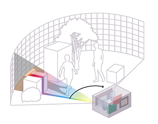

# LOAM (Lidar Odometry and Mapping) Implementation

In implementation, there are four launched nodes.

```cpp
loam::LaserMapping laserMapping(0.1);
loam::LaserOdometry laserOdom(0.1);
loam::MultiScanRegistration multiScan;
loam::TransformMaintenance transMaintenance;
```

## Scan

During scan setup, scan points are subscribed according to lidar device type.
```cpp
bool MultiScanRegistration::setupROS(ros::NodeHandle& node, ros::NodeHandle& privateNode, RegistrationParams& config_out)
{
    if (lidarName == "VLP-16") {
        _scanMapper = MultiScanMapper::Velodyne_VLP_16();
    } else if (lidarName == "HDL-32") {
        _scanMapper = MultiScanMapper::Velodyne_HDL_32();
    } else if (lidarName == "HDL-64E") {
        _scanMapper = MultiScanMapper::Velodyne_HDL_64E();
    }

    ... // some other configs

    // subscribe to input cloud topic
    _subLaserCloud = node.subscribe<sensor_msgs::PointCloud2>
        ("/multi_scan_points", 2, &MultiScanRegistration::handleCloudMessage, this);
}
```

For example, for `"VLP-16"`, it is set as below.
```cpp
MultiScanMapper(-15, 15, 16);

MultiScanMapper::MultiScanMapper(const float& lowerBound,
                                 const float& upperBound,
                                 const uint16_t& nScanRings)
    : _lowerBound(lowerBound),
      _upperBound(upperBound),
      _nScanRings(nScanRings),
      _factor((nScanRings - 1) / (upperBound - lowerBound)) { } ;

class MultiScanMapper {
    ...
private:
  float _lowerBound;      ///< the vertical angle of the first scan ring
  float _upperBound;      ///< the vertical angle of the last scan ring
  uint16_t _nScanRings;   ///< number of scan rings
  float _factor;          ///< linear interpolation factor
};
```

A typical lidar device should return a point cloud `laserCloudMsg` recorded the timestamp `laserCloudMsg->header.stamp` for the first point.
a typical point cloud should have $360^{\circ}$ horizontal scan coverage but limited vertical scan coverage (vertical angles from $-15^{\circ}$ to $15^{\circ}$ in `"VLP-16"`).
One full $360^{\circ}$ horizontal scan is called a ring/sweep, and its vertical angle is estimated by linear interpolation such as below.
```cpp
int MultiScanMapper::getRingForAngle(const float& angle) {
  return int(((angle * 180 / M_PI) - _lowerBound) * _factor + 0.5);
}
```

<div style="display: flex; justify-content: center;">
      
</div>
</br>

A lidar device would just return points' coordinates at the time of having received a laser beam, so that a full scan (all $16$ rings across the vertical angles from $-15^{\circ}$ to $15^{\circ}$) should consider linear interpolation by the time between the last and this full scans.

In the point cloud reception callback, `process(...)` takes a point cloud start timestamp and the whole point cloud trying to interpolate each points' timestamp, then assign `scanID`s (represents sweeps) to the points.
In `processScanlines(...)`, features are extracted and IMU transforms are updated.

```cpp
void MultiScanRegistration::handleCloudMessage(const sensor_msgs::PointCloud2ConstPtr &laserCloudMsg)
{
  ... 
  // fetch new input cloud
  pcl::PointCloud<pcl::PointXYZ> laserCloudIn;
  pcl::fromROSMsg(*laserCloudMsg, laserCloudIn);

  process(laserCloudIn, fromROSTime(laserCloudMsg->header.stamp));
}
```

```cpp
void MultiScanRegistration::process(const pcl::PointCloud<pcl::PointXYZ>& laserCloudIn, const Time& scanTime)
{
    size_t cloudSize = laserCloudIn.size();

    // determine scan start and end orientations
    float startOri = -std::atan2(laserCloudIn[0].y, laserCloudIn[0].x);
    float endOri = -std::atan2(laserCloudIn[cloudSize - 1].y,
                                laserCloudIn[cloudSize - 1].x) + 2 * float(M_PI);

    for (int i = 0; i < cloudSize; i++) {
        point.x = laserCloudIn[i].y;
        point.y = laserCloudIn[i].z;
        point.z = laserCloudIn[i].x;

        ...

        float angle = std::atan(point.y / std::sqrt(point.x * point.x + point.z * point.z));
        int scanID = _scanMapper.getRingForAngle(angle);   

        // calculate relative scan time based on point orientation
        float ori = -std::atan2(point.x, point.z);
        float relTime = config().scanPeriod * (ori - startOri) / (endOri - startOri);
        point.intensity = scanID + relTime;

        projectPointToStartOfSweep(point, relTime);

        _laserCloudScans[scanID].push_back(point);
    }

    processScanlines(scanTime, _laserCloudScans);
    publishResult();
}

void BasicScanRegistration::processScanlines(const Time& scanTime, std::vector<pcl::PointCloud<pcl::PointXYZI>> const& laserCloudScans)
{
  // reset internal buffers and set IMU start state based on current scan time
  reset(scanTime);  

  // construct sorted full resolution cloud
  size_t cloudSize = 0;
  for (int i = 0; i < laserCloudScans.size(); i++) {
    _laserCloud += laserCloudScans[i];

    IndexRange range(cloudSize, 0);
    cloudSize += laserCloudScans[i].size();
    range.second = cloudSize > 0 ? cloudSize - 1 : 0;
    _scanIndices.push_back(range);
  }

  extractFeatures();
  updateIMUTransform();
}
```

##  Mapping

In mapping, the following publications and subscriptions are set up.

```cpp
// advertise laser mapping topics
_pubLaserCloudSurround = node.advertise<sensor_msgs::PointCloud2>("/laser_cloud_surround", 1);
_pubLaserCloudFullRes  = node.advertise<sensor_msgs::PointCloud2>("/velodyne_cloud_registered", 2);
_pubOdomAftMapped      = node.advertise<nav_msgs::Odometry>("/aft_mapped_to_init", 5);

// subscribe to laser odometry topics
_subLaserCloudCornerLast = node.subscribe<sensor_msgs::PointCloud2>
    ("/laser_cloud_corner_last", 2, &LaserMapping::laserCloudCornerLastHandler, this);

_subLaserCloudSurfLast = node.subscribe<sensor_msgs::PointCloud2>
    ("/laser_cloud_surf_last", 2, &LaserMapping::laserCloudSurfLastHandler, this);

_subLaserOdometry = node.subscribe<nav_msgs::Odometry>
    ("/laser_odom_to_init", 5, &LaserMapping::laserOdometryHandler, this);

_subLaserCloudFullRes = node.subscribe<sensor_msgs::PointCloud2>
    ("/velodyne_cloud_3", 2, &LaserMapping::laserCloudFullResHandler, this);

// subscribe to IMU topic
_subImu = node.subscribe<sensor_msgs::Imu>("/imu/data", 50, &LaserMapping::imuHandler, this);
```