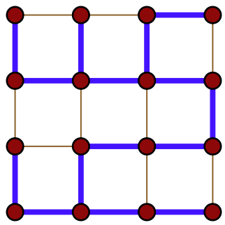
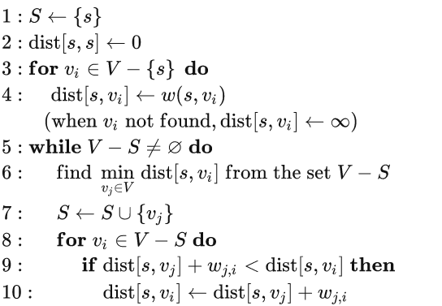

# A* and D* Global Path Planning

### Spanning Tree

A spanning tree $T$ of an undirected graph $G$ is a subgraph that is a tree which includes **all** of the vertices of $G$.
An undirected graph $G$ can have many spanning trees.

Given the example below, all vertices are traversed/connected. Of course, there are many ways to traverse every vertex in this graph.

      

 

## Dijkstra’s Shortest Path

Given a directed graph $G$, Dijkstra can find the shortest path from a source vertex $s$ to any other vertices $v_i \in V$.
The traveling cost is defined in edge $E$.
$S$ is used to denote the visited vertices.

      

 

1. $S$ is init to having only one source vertex $\{s\}$

2. The source vertex to itself should have zero distance

3. and 4. Init distance $\text{dist}[s,v_i]$. $w(s,v_i)$ is the distance computation function.

Iterate all vertices except for the source vertex $v_i \in V-\{s\}$, compute the init distance to $s$, denoted as $\text{dist}[s,v_i]$

Set travel cost to infinity if $v_i$ not found/reachable

5. If $V-S$ is not an empty set (there are vertices not yet visited), go inside the while loop

6. From all the not yet visited vertices $v_i \in V-S$, find one vertex that is closest to the source vertex:

$$
v_j^*=\argmin_{v_j\in (V-S)} \text{dist}[s,v_j]
$$

7. Merge the new closest vertex $v_j^*$ into the visited set $S \leftarrow S \cup \{v_j^*\}$

8. , 9. and 10.  If the distance of from $s$ to $v_j^*$ plus from $v_j^*$ to $v_i$ is smaller than the previously computed from $s$ to $v_i$, update this distance $\text{dist}(s,v_i)$

## A Star 

A* is a global path planning algorithm with a known goal.

Inherit from Dijkstra that just uses edge cost $w_{ij}$ between $v_i$ and $v_j$, A* adds *heuristic* $h_{i,goal}$ from $v_i$ to the goal $v_{goal}$ searching for optimal path.

In other words, $w_{ij}+h_{i,goal}$ is used in the 8., 9. and 10. -th step in the aforementioned Dijkstra's algorithm.

Common heuristics are
* the angle between $v_i$ and $v_{goal}$
* the Euclidean distance between $v_i$ and $v_{goal}$
* the Manhattan distance between $v_i$ and $v_{goal}$

## D Star

D* is also known as *Dynamic* A Search.
$h_{i,goal}$ in A star is static while in D* is adjustable online during searching.

1. First, similarly to A*, find an optimal path from start to goal
2. If encountered obstacles, locate the obstacle-met vertex, and set heuristic $h$ of this vertex to infinity
3. For in D*, every vertex records its previous vertex, start searching new paths originating from the neighbors of this vertex  
4. If neighbor vertices' paths still meet obstacles, set these neighbor vertices's heuristic $h$ to infinity as well
5. Continue the 3.-rd and 4.-th step, until no-obstacle paths are found