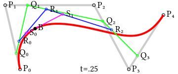

# Curves

## Spline

Just a polynomial trajectory. 

* Linear

$$
p(x)=ax + b
\quad a \ne 0
$$

* Quadratic

$$
p(x)=ax^2 + bx + c
\quad a \ne 0
$$

* Cubic
$$
p(x)=ax^3+bx^2+cx+d
\quad a \ne 0
$$

* Quartic

$$
p(x)=ax^4+bx^3+cx^2 + dx + e
\quad a \ne 0
$$

* Quintic

$$
p(x)=ax^5+bx^4+cx^3+dx^2 + ex + f
\quad a \ne 0
$$

* Sextic/Hexic

$$
p(x)=ax^6+bx^5+cx^4+dx^3 + ex^2 + fx + g
\quad a \ne 0
$$

## Bézier curve

A recursive definition for the Bézier curve of degree $n$ expresses it as a point-to-point linear combination (linear interpolation) of a pair of corresponding points in two Bézier curves of degree $n − 1$.

$$
\begin{align*}
\bold{B}_{\bold{P}_0}(t)
&= 
\bold{P}_0
\\
\bold{B}(t) &=
\bold{B}_{\bold{P}_0 \bold{P}_1 \bold{P}_2 ... \bold{P}_n}(t)

\\ &=
(1-t)\bold{B}_{\bold{P}_0 \bold{P}_1 \bold{P}_2 ... \bold{P}_{n-1}}(t)
+
t\bold{B}_{\bold{P}_1 \bold{P}_2 ... \bold{P}_{n}}(t)

\\ &=
(1-t)^n \bold{P}_0 
+
\bigg(\begin{array}{c}
n \\
1
\end{array} \bigg)
(1-t)^{n-1} t \bold{P}_1
+ ... +
\bigg(\begin{array}{c}
n \\
n-1
\end{array} \bigg)
(1-t) t^{n-1} \bold{P}_{n-1}
+
t^n \bold{P}_n

\\ &=
\sum^n_{k=0} 
\bigg(\begin{array}{c}
n \\
k
\end{array} \bigg)
(1-t)^k t^{n-k}
\bold{P}_k
\end{align*}
$$

For fourth-order curves one can construct intermediate points $\bold{Q}=[Q_0, Q_1, Q_2, Q_3]$ that describe linear/first-order Bézier curves, points $\bold{R}=[R_0, R_1, R_2]$ (computed from the moving $\bold{Q}$) that describe quadratic Bézier curves, and points $\bold{S}=[S_0, S_1]$ (computed from the moving $\bold{R}$) that describe cubic Bézier curves.

The linear combinations of the above points forms a fourth-order curve.

      

 

      

 

