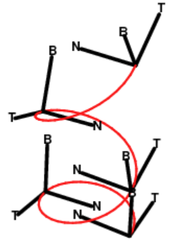
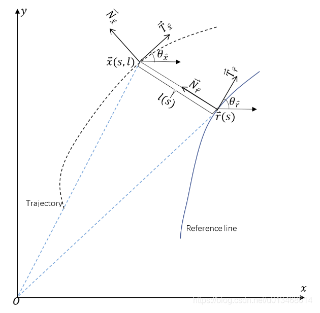

# Lattice Motion Planning

Paper reference:
*Optimal Vehicle Path Planning Using Quadratic Optimization for Baidu Apollo Open Platform*

## Frenet Coordinates

Basically, it is curve's tangent and normal, and their cross product formed 3-d coordinates. The coordinate changes as the point on the curve moves.

Let $\bold{r}(t)$ be a curve in Euclidean space, representing the position vector of a particle/point as a function of time. The Frenet–Serret formulas require $\bold{r}(t)$ can only have non-zero curvature. Besides, $\bold{r}'(t) \ne 0$

Let $s(t)$ represent the arc length which the particle has moved along the curve in time $t$:
$$
s(t) = 
\int^t_0 ||\bold{r}'(\sigma)|| d \sigma 
$$ 

Here defines the tangent unit vector $\bold{T}$:
$$
\bold{T}= \frac{d \bold{r}}{d s}
$$

Here defines the normal unit vector $\bold{N}$:
$$
\bold{N}= \frac
{\frac{d \bold{T}}{d s}}
{||\frac{d \bold{T}}{d s}||}
$$

Here defines the binormal unit vector $\bold{B}:$
$$
\bold{B}= \bold{T} \times \bold{N}
$$

Finally, the Frenet–Serret formulas is a skew-symmetric matrix given as below
$$
\begin{bmatrix}
    \bold{T}' \\
    \bold{N}' \\
    \bold{B}'
\end{bmatrix}=
\begin{bmatrix}
    0 & \kappa & 0 \\
    -\kappa & 0 & \tau \\
    0 & -\tau & 0
\end{bmatrix}
\begin{bmatrix}
    \bold{T} \\
    \bold{N} \\
    \bold{B}
\end{bmatrix}
$$
where $\kappa=||\frac{d \bold{T}}{d s}||$ is the curvature, that when $\kappa \rightarrow 0$, the trajectory is nearly a straight line. 

and $\tau=-\bold{N} \cdot \bold{B}$ is the torsion, $\tau$ measures the speed of rotation of the binormal vector at the given point such that $\bold{B}'=\tau \bold{N}$. When $\tau \rightarrow 0$, the trajectory tends to move on the same plane.

## Frenet To Cartesian Coordinates

Given Frenet Coordinates $[s, \dot{s}, \ddot{s}, l, \dot{l}, \ddot{l}, l', l'']$,
where
* $s$ vertical axis (trajectory/base frame) for the Frenet coordinates
* $\dot{s}=\frac{ds}{dt}, \ddot{s}=\frac{d^2s}{dt^2}$ are the velocity and acceleration along the trajectory $s$
* $l$ horizontal axis (relative to the vertical axis) for the Frenet coordinates
* $\dot{l}=\frac{dl}{dt}, \ddot{l}=\frac{d^2l}{dt^2}$ are the horizontal velocity and acceleration.
* $l'=\frac{dl}{ds}, l''=\frac{d^2l}{ds^2}$ are the horizontal derivatives over the vertical axis

and Cartesian Coordinates $[\overrightarrow{x}, v_{\overrightarrow{x}}, a_{\overrightarrow{a}}, \theta_{\overrightarrow{x}}, \kappa_{\overrightarrow{x}}]$, where
* $\overrightarrow{x}=[x_x, y_x]$ is the 2-d plane position
* $v_{\overrightarrow{x}}=||\dot{x}||_2$ is the absolute value for ${\overrightarrow{x}}$ velocity
* $\theta_{\overrightarrow{x}}$ is the orientation
* $\kappa_{\overrightarrow{x}}=\frac{d \theta_{\overrightarrow{x}}}{ds}$ is the curvature
* $a_{\overrightarrow{a}}=\frac{d v_{\overrightarrow{x}}}{dt}$ is the acceleration

Besides, define $\overrightarrow{r}=[x_{r}, y_{r}]$ on $s$ of the Frenet coordinates as the reference point of $\overrightarrow{x}$ on the Cartesian's. 

The figure below describes the lateral translation relationship between the two coordinates. For Frenet coordinates, there is no $\bold{B}$ since the movement is only on the same plane throughout the time.

### Derivations

Derived from definition, $s$ is the nearest point to $\overrightarrow{x}$, denoted as $\overrightarrow{r}=[x_r, y_r]$ .

Given the relationship $l=\big(\overrightarrow{x}-\overrightarrow{r}\big)\bold{\overrightarrow{N}}_{\overrightarrow{r}}$ that describes the current Cartesian position $\overrightarrow{x}$ is a translation from $\overrightarrow{r}$ following the direction of $\bold{\overrightarrow{N}}_{\overrightarrow{r}}$. The angle of $\bold{\overrightarrow{N}}_{\overrightarrow{r}}$ is $\theta_{\overrightarrow{r}}+\frac{\pi}{2}$ 

$l$ can be expressed as the dot product between $\overrightarrow{x}-\overrightarrow{r}$ and $\bold{\overrightarrow{N}}_{\overrightarrow{r}}$.
$$
\begin{align*}
l &=
\big(
    \overrightarrow{x}-\overrightarrow{r}
\big)
\cdot
\bold{\overrightarrow{N}}_{\overrightarrow{r}}
\\ &=
||\overrightarrow{x}-\overrightarrow{r}||_2
\space
cos(
    \theta_{\overrightarrow{x}-\overrightarrow{r}}
    -(\theta_{\overrightarrow{r}} + \frac{\pi}{2})
)
\\ &=
||\overrightarrow{x}-\overrightarrow{r}||_2
\space
\big(
    sin(\theta_{\overrightarrow{x}-\overrightarrow{r}})cos(\theta_{\overrightarrow{r}})
    -
    cos(\theta_{\overrightarrow{x}-\overrightarrow{r}})sin(\theta_{\overrightarrow{r}})
\big)
\\ &=
\sqrt{(x_x-x_r)^2+(y_x-y_r)^2}
\space
\big(
    sin(\theta_{\overrightarrow{x}-\overrightarrow{r}})cos(\theta_{\overrightarrow{r}})
    -
    cos(\theta_{\overrightarrow{x}-\overrightarrow{r}})sin(\theta_{\overrightarrow{r}})
\big)
\end{align*}
$$

