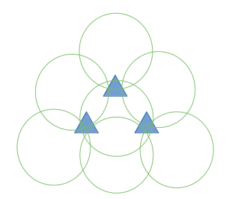
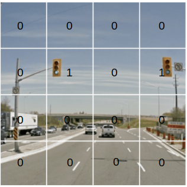

# Loop Closure

*Loop closure* is the act of correctly asserting that a vehicle has returned to a previously visited location. 

In SLAM, a vehicle records its surrounding visual/lidar features as keyframes along a route and the vehicle eventually returns to the route's origin. 
The recorded keyframes are used to determine the vehicle's states/locations, and finally if such states together can form a closed loop.
Loop closure says whether the recorded keyframes can accurately reflect the vehicle's states/locations along the route.

### A Naive Approach

The simplest way is to perform feature matching on any image pairs and determine which of them are related according to the number of correct matches.

For any two keyframes sharing a loop, it takes $C^2_N$ matching operations having operation complexity $O(N^2)$. $N$ is the number of possible routes. 

For $3$ keyframes (possibly related or unrelated), there are $N=7$ possible routes and $C^2_N=C^2_7=\frac{7!}{2!(7-2)!}=21$ matching operations that can determine any two keyframes sharing the same route (first take one route out of the $7$ possible routes, then pick another one route out of the $6$ remaining possible routes, there are $7 \times 6 = 42$ combinations; disregard permutation order, there are $42/2 = 21$ trials).

      

 

## Bag of Words for Loop Closure

The purpose of Bag-of-Words (BoWs) is to describe an image in terms of "what kinds of features are there on the image."

Define $n$ features/attributes that describe an image, such as the presence or absence of a traffic light at which cell out of a segmented image, etc. 

      

 

Assign weights $\bold{w}$ to these features/attributes, so that the image can be described by

$$
\bold{a} = 
1\cdot w_1 +
0\cdot w_2 +
1\cdot w_3 +
1\cdot w_4 +
...
0\cdot w_n
$$
where $0$ or $1$ indicate the presence/absence of an attribute.

Hence, image similarity between two images can be computed by
$$
s(\bold{a}_1, \bold{a}_2) = 
1 - \frac{1}{n}|| \bold{a}_1 - \bold{a}_2 ||_1
$$
where it takes the $\mathcal{L}_1$ norm, which is the sum of the absolute values of the elements.

### Training of BoWs

Image features/attributes can be defined as ORB features, and these features are stored in a dictionary.

Under the assumption that features/attributes of all images are known, K-means clustering can be applied to classify images so that image correspondence operations can finish quickly for the number of images to be matched are tremendously reduced.

K-d tree can be used for the same purposes. When searching for words based on known features, compare them layer by layer to find the corresponding words.

### TF-IDF (Term Frequency-Inverse Document Frequency)

Different features/attributes should have weights such that some features are unique to only a few images. 
These features/attributes should have higher importance in associating related images.

TF-IDF (Term Frequency-Inverse Document Frequency) is a BoWs weighting method for this purpose.

Define the number of all features as $n$, and the number of the $i$-th feature is $n_i$ corresponding to the weight $w_i$. The feature distinguishing degree can be defined as
$$
\log \frac{n}{n_i}
$$

### Similarity Score Processing

Vehicles should see similar scenes within a short time of movement $t-\Delta t$, or identified between two chronological sequential keyframes $\bold{v}_t, \bold{v}_{t+\Delta t}$.

BoWs in $\bold{v}_t, \bold{v}_{t+\Delta t}$ are more likely to be related/similar than non-chronological related keyframes, hence, they should likely form a loop.