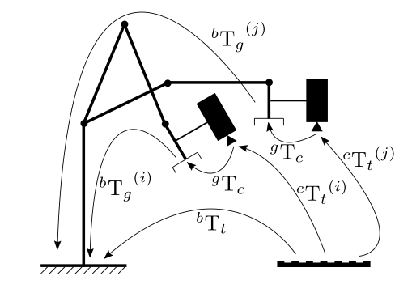
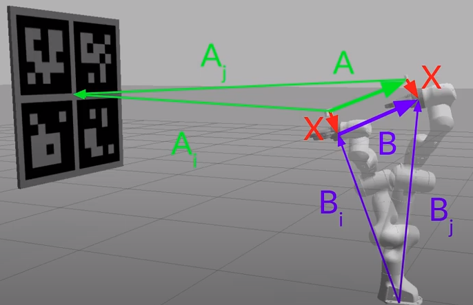
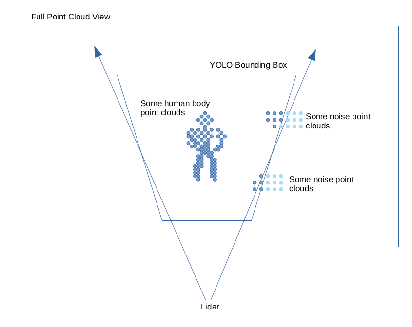

# Some Personal Projects

## IMU and Wheel Odometry Data Fusion by Kalman Filter

By the image frame retrieval timestamp (5 Hz), collect all IMU and wheel odometry data starting from the last image frame retrieval timestamp.
Then, use linear interpolation of rotation and translation as the model motion prediction results assigned to each IMU and wheel odometry reading.


## Hand Eye Calibration

The hand eye calibration problem estimates the transformation between a camera ("eye") mounted on a robot gripper ("hand").

It computes Hand-Eye calibration $\space^{g}T_{c}$ (`R_cam2gripper` and `t_cam2gripper`) given some $\space^{b}T_{g}$ (`R_gripper2base` and `t_gripper2base`) and $\space^{c}T_{t}$ (`R_target2cam` and `t_target2cam`).

There should be at least two transformations $i \ne j$ for both $i,j \ge 2$ to compute $\space^{g}T_{c}$.

<div style="display: flex; justify-content: center;">
      
</div>
</br>

```cpp
void cv::calibrateHandEye	(
                            InputArrayOfArrays 	R_gripper2base,
                            InputArrayOfArrays 	t_gripper2base,
                            InputArrayOfArrays 	R_target2cam,
                            InputArrayOfArrays 	t_target2cam,
                            OutputArray 	R_cam2gripper,
                            OutputArray 	t_cam2gripper,
                            HandEyeCalibrationMethod 	method = CALIB_HAND_EYE_TSAI 
                            )	
```

To estimate $\space^{g}T_{c}$, the robot gripper is moved to some distance in order to acquire several poses.
Gripper poses $\space^{b}T_{g}^{(i)}$ should be recorded (in AGV, they are fused robot state from sensors such as IMU and odometry),
and target to camera transform $\space^{c}T_{t}^{(i)}$ should be estimated as well (such as posting some chessboards around environment walls, and by `cv::calibrateCamera(...)` that returns the estimated $\space^{c}\hat{T}_{t}^{(i)}$, which is of course very corse ..., would be lucky if precision error is below 10 cm (measured by re-projection error)).

```cpp
std::vector<cv::Mat> R_gripper2base, t_gripper2base;
std::vector<cv::Mat> R_target2cam, t_target2cam;

cv::Rect rotation_rect(0,0,3,3);
cv::Rect translation_rect(3,0,1,3);

for (auto& pose : robotPoses) {
      rotation_rect = pose.r;
      translation_rect = pose.t;
      R_gripper2base.push_back(rotation);
      t_gripper2base.push_back(translation);
}
for (auto& camTransform : camTransforms) {
      rotation_rect = camTransform.r;
      translation_rect = camTransform.t;
      R_target2cam.push_back(rotation);
      t_target2cam.push_back(translation);
}

// Calibrate
cv::Mat R_cam2gripper, t_cam2gripper;
cv::calibrateHandEye(R_gripper2base, t_gripper2base, R_target2cam, t_target2cam, R_cam2gripper, t_cam2gripper);
```

### The $AX=XB$ System

As in the figure below, $X$ that represents $\space^{g}T_{c}$ is the extrinsic to be computed.
Given at least two transforms $i \ne j$, for known target to camera transforms $\space^{c}T_{t}^{(i)}$ there is $A= A_i A_j^{-1}$, and for known robot state transforms $\space^{b}T_{g}^{(i)}$ there is $B = B^{-1}\_i B_j$.
Constrained by the geometry, finally there is $AX=XB$.

<div style="display: flex; justify-content: center;">
      
</div>
</br> 

Further decompose the homogeneous transforms to translation and rotation, there is

$$
\begin{align*}
&&&
AX=XB
\\\\ \Rightarrow &&&
A_i A_j^{-1} X=X B^{-1}\_i B_j
\\\\ \Rightarrow &&&
\space^{c}T_{t}^{(i)} \Big(\space^{c}T_{t}^{(j)}\Big)^{-1} X=X \Big(\space^{b}T_{g}^{(i)}\Big)^{-1} \space^{b}T_{g}^{(j)}
\\\\ \Rightarrow &&&
\begin{bmatrix}
    \space^{c}R_{t}^{(ij)} & \space^{c}\mathbf{t}_{t}^{(ij)} \\\\
    \mathbf{0} & 1
\end{bmatrix}   
\begin{bmatrix}
    \space^{g}R_{c} & \space^{g}\mathbf{t}_{c} \\\\
    \mathbf{0} & 1
\end{bmatrix}=
\begin{bmatrix}
    \space^{g}R_{c} & \space^{g}\mathbf{t}_{c} \\\\
    \mathbf{0} & 1
\end{bmatrix}
\begin{bmatrix}
    \space^{b}R_{g}^{(ij)} & \space^{b}\mathbf{t}_{g}^{(ij)} \\\\
    \mathbf{0} & 1
\end{bmatrix}
\\\\ \Rightarrow &&&
\left\{
    \begin{align*}
      \space^{c}R_{t}^{(ij)} \space^{g}R_{c} &= \space^{g}R_{c} \space^{b}R_{g}^{(ij)}
      \\\\
      \space^{c}R_{t}^{(ij)} \space^{g}\mathbf{t}_{c} + \space^{c}\mathbf{t}_{t}^{(ij)} &=
        \space^{g}R_{c} \space^{b}\mathbf{t}_{g}^{(ij)} + \space^{g}\mathbf{t}_{c}
    \end{align*}
\right.
\\\\ \Rightarrow &&&
\left\{
    \begin{align*}
      \space^{c}R_{t}^{(ij)} \space^{g}R_{c} &= \space^{g}R_{c} \space^{b}R_{g}^{(ij)}
      \\\\
      (\space^{c}R_{t}^{(ij)} - I) \space^{g}\mathbf{t}_{c} &=
        \space^{g}R_{c} \space^{b}\mathbf{t}_{g}^{(ij)} - \space^{c}\mathbf{t}_{t}^{(ij)} 
    \end{align*}
\right.
\end{align*}
$$

### The Sai-Lenz Method

The Sai-Lenz method is used to compute the above $AX=XB$ equation for $\space^{g}R_{c}$ and $\space^{g}\mathbf{t}_{c}$.

1. By Rodrigues to convert matrix to rotation vector:

$$
\left\{
    \begin{align*}
       \space^{c}\mathbf{r}_{t}^{(ij)} = \text{rodrigues}(\space^{c}R_{t}^{(ij)}) \\\\
       \space^{b}\mathbf{r}_{g}^{(ij)} = \text{rodrigues}(\space^{b}R_{g}^{(ij)})    
    \end{align*}
\right.
$$

2. Rodrigues Corrections for $\space^{c}\mathbf{r}_{t}^{*(ij)}$ and $\space^{b}\mathbf{r}_{g}^{*(ij)}$ by normalized vector $\space^{c}\mathbf{n}_{t}^{(ij)}$ and $\space^{b}\mathbf{n}_{g}^{(ij)}$ converting from matrix to vector format

$$
\left\{
    \begin{align*}
        \space^{c}\mathbf{r}_{t}^{*(ij)} = 2 \sin \Big( \frac{\big|\big|\space^{c}\mathbf{r}_{t}^{(ij)}\big|\big|_2}{2} \Big) \space^{c}\mathbf{n}_{t}^{(ij)}
        , \qquad \text{where }
        \space^{c}\mathbf{n}_{t}^{(ij)} = \frac{\space^{c}\mathbf{r}_{t}^{(ij)}}{\big|\big|\space^{c}\mathbf{r}_{t}^{(ij)}\big|\big|_2}
        \\\\ 
        \space^{b}\mathbf{r}_{g}^{*(ij)} = 2 \sin \Big( \frac{\big|\big|\space^{b}\mathbf{r}_{g}^{(ij)}\big|\big|_2}{2} \Big) \space^{b}\mathbf{n}_{g}^{(ij)}
        , \qquad \text{where }
        \space^{b}\mathbf{n}_{g}^{(ij)} = \frac{\space^{b}\mathbf{r}_{g}^{(ij)}}{\big|\big|\space^{b}\mathbf{r}_{g}^{(ij)}\big|\big|_2}
    \end{align*}
\right.
$$

3. Construct the linear equation $A\mathbf{x}=\mathbf{b}$ to compute the initial estimate of rotation $\space^{g}\hat{\mathbf{r}}_{c}$

$$
\big( \space^{c}\mathbf{r}_{t}^{*(ij)} + \space^{b}\mathbf{r}_{g}^{*(ij)} \big)^{\wedge} \space^{g}\hat{\mathbf{r}}_{c} = \space^{b}\mathbf{r}_{g}^{*(ij)} - \space^{c}\mathbf{r}_{t}^{*(ij)}
$$

where $\space^{\wedge}$ represents the skew-symmetric representation of a vector.

4. Compute $\space^{g}R_{c}$

Set $\space^{g}\mathbf{u}_{c}$ as the normalized rotation vector $\space^{g}\mathbf{u}_{c}=\frac{2 \space^{g}\hat{\mathbf{r}}_{c}}{\sqrt{1+|\space^{g}\hat{\mathbf{r}}_{c}|^2}}$, by Rodrigues' formula $I\cos\theta + (1-\cos\theta)\mathbf{u}\mathbf{u}^{\top} + \mathbf{u}^{\wedge}\sin\theta$ , the rotation matrix rotating about $\mathbf{u}$ by $\theta$ can be expressed as
$$
\space^{g}R_{c} = \Big( 1 - \frac{|\space^{g}\mathbf{u}_{c}|^2}{2} \Big) I +\frac{1}{2}\big( \space^{g}\mathbf{u}_{c} \space^{g}\mathbf{u}_{c}^{\top} + \sqrt{4-|\space^{g}\mathbf{u}_{c}|^2}\space^{g}\mathbf{u}_{c}^{\wedge} \big)
$$

```cpp
for (int i = 0; i < nStatus; i++)
{ 
  cv::Rodrigues(Rgij, rgij);
  cv::Rodrigues(Rcij, rcij);

  theta_gij = cv::norm(rgij);
  theta_cij = cv::norm(rcij);

  rngij = rgij / theta_gij;
  rncij = rcij / theta_cij;

  Pgij = 2 * sin(theta_gij / 2)*rngij;
  Pcij = 2 * sin(theta_cij / 2)*rncij;

  tempA = cv::skew(Pgij + Pcij);
  tempb = Pcij - Pgij;

  A.push_back(tempA);
  b.push_back(tempb);
}

cv::invert(A, pinA, DECOMP_SVD);

Pcg_prime = pinA * b;
Pcg = 2 * Pcg_prime / sqrt(1 + cv::norm(Pcg_prime) * cv::norm(Pcg_prime));
PcgTrs = Pcg.t();   
Rcg = (1 - cv::norm(Pcg) * cv::norm(Pcg) / 2) * eyeM + \
    0.5 * (Pcg * PcgTrs + sqrt(4 - cv::norm(Pcg)*cv::norm(Pcg))*cv::skew(Pcg));
```

5. translation $\space^{g}\mathbf{t}_{c}$ should be easy to compute simply by solving the below over-determined linear system

$$
(\space^{c}R_{t}^{(ij)} - I) \space^{g}\mathbf{t}_{c} =
\space^{g}R_{c} \space^{b}\mathbf{t}_{g}^{(ij)} - \space^{c}\mathbf{t}_{t}^{(ij)} 
$$

```cpp
for (int i = 0; i < nStatus; i++)
{
  tempAA = Rgij - eyeM;
  tempbb = Rcg * tcij - tgij;

  AA.push_back(tempAA);
  bb.push_back(tempbb);
}

cv::invert(AA, pinAA, DECOMP_SVD);
cv::Mat Tcg = pinAA * bb;
```

## Lidar Extrinsic Calibration

### Lidar Point Sampling

### Time Offset as an Optimization Variable

### Point-To-Plane ICP

## Lidar and ORB Feature Data Fusion

### YOLOv3 Human Body Detection and ORB Extraction and Tracking

YOLOv3 tiny model outputs human body detection rectangles.

Within the rectangles, search for ORB features.

```cpp
static Ptr<ORB> cv::ORB::create	(	int 	nfeatures = 500,
                                    float 	scaleFactor = 1.2f,
                                    int 	nlevels = 8,
                                    int 	edgeThreshold = 31,
                                    int 	firstLevel = 0,
                                    int 	WTA_K = 2,
                                    int 	scoreType = ORB::HARRIS_SCORE,
                                    int 	patchSize = 31,
                                    int 	fastThreshold = 20 
                                    )

// Detect ORB features and compute descriptors.
Ptr<Feature2D> orb = ORB::create(MAX_FEATURES);
orb->detectAndCompute(im1Gray, Mat(), keypoints1, descriptors1);
```

Optical flow tracking 

```cpp
void cv::calcOpticalFlowPyrLK	(	InputArray 	prevImg,
                                InputArray 	nextImg,
                                InputArray 	prevPts,
                                InputOutputArray 	nextPts,
                                OutputArray 	status,
                                OutputArray 	err,
                                Size 	winSize = Size(21, 21),
                                int 	maxLevel = 3,
                                TermCriteria 	criteria = TermCriteria(TermCriteria::COUNT+TermCriteria::EPS, 30, 0.01),
                                int 	flags = 0,
                                double 	minEigThreshold = 1e-4 
                                )	

// calculate optical flow
Mat old_frame, old_gray;
vector<Point2f> p0, p1;
vector<uchar> status;
vector<float> err;
TermCriteria criteria = TermCriteria((TermCriteria::COUNT) + (TermCriteria::EPS), 10, 0.03);
calcOpticalFlowPyrLK(old_gray, frame_gray, p0, p1, status, err, Size(15,15), 2, criteria);
```

### Triangulation and K-Means Clustering to ORB Features

Given `cam0` and `cam1` that are $3 \times 4$ camera matrices (intrinsic and extrinsic parameters) for two camera poses, 
opencv provides the below method to triangulate two sets of feature points `cam0pnts` and `cam1pnts` with the results stored in `pnts3D`.
```cpp
cv::Mat pnts3D(1, N, CV_64FC4);
cv::Mat cam0pnts(1, N, CV_64FC2);
cv::Mat cam1pnts(1, N, CV_64FC2);

cv::triangulatePoints(cam0,cam1,cam0pnts,cam1pnts,pnts3D);
```

Having computed the 3d triangulated points, also compute the K-means clustering.
```cpp
double cv::kmeans	(	InputArray 	data,
                    int 	K,
                    InputOutputArray 	bestLabels,
                    TermCriteria 	criteria,
                    int 	attempts,
                    int 	flags,
                    OutputArray 	centers = noArray() 
                    )	

Mat points(clusterCount, 1, CV_32FC3), labels;
std::vector<Point3f> centers;
double compactness = kmeans(points, clusterCount, labels,
                        TermCriteria( TermCriteria::EPS+TermCriteria::COUNT, 10, 1.0),
                        3, KMEANS_PP_CENTERS, centers);
```

### ORB Feature Cluster Centroids as Initial Guesses to Lidar Point Cloud Segmentation

By the obtained bounding box from YOLOv3 as well as estimated cluster centroids, 
set up a projective filter whose opening angle is contained by the human body centroid and the YOLO predicted bounding box size.
Point clouds outside the projective filter are filtered out.

<div style="display: flex; justify-content: center;">
      
</div>
</br>

Then, perform segmentation on the filtered point clouds (random walk of 50 cm threshold), and by PCL point cloud bounding boxes to enclose the segmented point clouds (by picking the leftmost and rightmost points' x, and topmost and bottommost points' y).

### Data Fusion by Intersection of Union (IoU) Matching ORB Point Cloud and Lidar Point Cloud

By 2D laser points, the projected lidar bounding box would converge to a horizontal line against the YOLO bounding box that is also compressed to a horizontal line (by setting the $z$ to the height of the lidar device).

The two horizontal lines are matched by their closet centroids, and compared against their reprojection overlapping line percentage.

### Final Rectangle Enclosure Output

Output the fused point cloud enclosure rectangle/bounding box (most likely the bounding box of lidar point cloud since it is most stable).

If failed, only output visual ORB point cloud if they ORB features were successfully tracked (optical flow) in the last three/five frames, and the tracked OBR's triangulated 3d representations do not deviate a lot (compute covariance) in the last three/five frames.