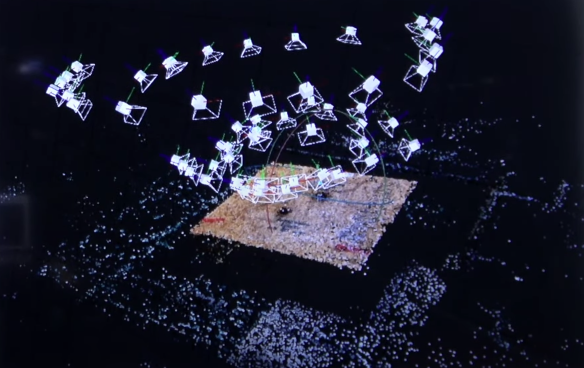
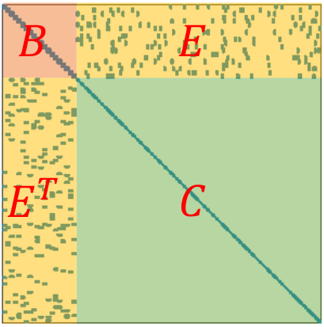

# Bundle Adjustment

The so-called *Bundle Adjustment* refers to optimizing both camera parameters (intrinsic and extrinsic) and 3D landmarks with images.

Consider the bundles of light rays emitted from 3D points (shown in the example figure below as a table in the image center). 

The purpose of optimization can be explained as to adjust the camera poses and the 3D points (visual feature points/landmarks), to ensure the projected 2D features (bundles) match the detected results.

Bundle Adjustment takes the following steps

1. Transform a point $\mathbf{p}$ from the world coordinates into the camera frame using extrinsics

$$
\begin{align*}
\mathbf{P}'&=
[\mathbf{R}|\mathbf{t}] \mathbf{p}
\\ &=
\mathbf{R} \mathbf{p} + \mathbf{t}
\\ &=
[X',Y',Z']^\text{T}
\end{align*}
$$

2. Project $\mathbf{P}'$ into the normalized plane and get the normalized coordinates $(u,v)$ (the camera frame)
$$
\begin{align*}
\mathbf{P}_c &= [u_c, v_c, 1]^\text{T}
\\ &=
[\frac{X'}{Z'}, \frac{Y'}{Z'}, 1]^\text{T}
\end{align*}
$$

3. Apply the distortion model.

$$
\begin{align*}
    u_c' &= u_c (1+k_1 r_c^2 +k_2 r_c^4)
    \\
    v_c' &= v_c (1+k_1 r_c^2 +k_2 r_c^4)
\end{align*}
$$

4. Compute the pixel by intrinsic

$$
\begin{align*}
    u_s &= f_x u_c' + c_x
    \\
    v_s &= f_y v_c' + c_y
\end{align*}
$$

5. Denote $\mathbf{x}=[\mathbf{x}_1, \mathbf{x}_2, ..., \mathbf{x}_k], \mathbf{y}=[\mathbf{y}_1, \mathbf{y}_2, ..., \mathbf{y}_m]$ as the camera states (usually $6$-d vector, $3$-d position and $3$-d orientation) and landmark states (usually $3$-d position), respectively. Both $\mathbf{x}$ and $\mathbf{y}$ are unknown awaiting optimization.

Observation $\mathbf{z}$ takes $\mathbf{x}$ and $\mathbf{y}$ as input arguments
$$
\mathbf{z} = 
h(\mathbf{x}, \mathbf{y})
$$

$\mathbf{z}\overset{\Delta}{=}(u_s, v_s)$ describes the pixel coordinate. 

6. Optimization

Take $(0,0,0)$ as the origin ($\mathbf{x}_0=(0,0,0)$), to find $\mathbf{x}_k$ for the $k$-th camera is same as finding a transformation such that $\mathbf{x}_k=[\mathbf{R}|\mathbf{t}]_k$. In addition, denote $\mathbf{p}_k=[\mathbf{p}\_{k1},\mathbf{p}\_{k2},...,\mathbf{p}\_{km}]$ as the observed landmarks $\mathbf{y}$ by the pose $\mathbf{x}_k=[\mathbf{R}|\mathbf{t}]_k$ for the camera $k$. $m$ is the total number of landmarks.

Rewrite indices that $i$ represents the $i$-th camera and $j$ represents the $j$-th landmark. Error $\mathbf{e}$ can be defined as discrepancy between the computed $h([\mathbf{R}|\mathbf{t}]_i, \mathbf{p}\_{j})$ and $\mathbf{z}\_{ij}$. 

Here, landmark $\mathbf{p}_j$ does not discriminate between landmark estimations at different camera $i$. In other words, $\mathbf{p} \in \mathbb{R}^{m \times 3}$.
$$
\frac{1}{2} \sum^m_{i=1} \sum^n\_{j=1} 
\big|\big| \mathbf{e}\_{ij} \big|\big|^2=
\frac{1}{2} \sum^m_{i=1} \sum^n\_{j=1} 
\big|\big| 
    \mathbf{z}\_{ij} -
    h([\mathbf{R}|\mathbf{t}]_i, \mathbf{p}\_{j})
\big|\big|^2
$$

Solving this least-squares is equivalent to adjusting the pose and road signs/landmarks at the same time, which is the so-called Bundle Adjustment.

## Solving Bundle Adjustment

Let $\mathbf{x}$ represent the whole optimization set such as 
$$
\mathbf{x}=\big[
    [\mathbf{R}|\mathbf{t}]_1, [\mathbf{R}|\mathbf{t}]_2, ..., [\mathbf{R}|\mathbf{t}]_n, 
    \mathbf{p}\_{1}, \mathbf{p}\_{2}, ..., \mathbf{p}\_{m}
\big]
$$

The error $\mathbf{e}$ to be minimized can be approximated by first-order derivative.
$$
\frac{1}{2} \big|\big|
    \mathbf{e}(\mathbf{x}+\Delta\mathbf{x})
\big|\big|^2
\approx
\frac{1}{2} \sum^n\_{i=1} \sum^m_{j=1} 
\big|\big|
    \mathbf{e}\_{ij} + \mathbf{F}\_{ij}\Delta\mathbf{\xi}\_i + \mathbf{E}\_{ij} \Delta \mathbf{p}_j
\big|\big|
$$
where $\Delta\mathbf{x}$ is the correction increment that iteratively sets $\mathbf{e}$ to minimum. 
$\mathbf{F}\_{ij}$ is the partial derivative of the entire cost function to the $i$-th pose, and $\mathbf{E}\_{ij}$ is the partial derivative of the function to the $j$-th landmark.
$\mathbf{\xi}\_i$ denotes $[\mathbf{R}|\mathbf{t}]_i$.

Collectively, represent poses and landmarks as $\mathbf{x}\_\mathbf{\xi}$ and $\mathbf{x}\_\mathbf{p}$
$$
\begin{align*}
    \mathbf{x}\_\mathbf{\xi} &= [
        \mathbf{\xi}_1, \mathbf{\xi}_2, ..., \mathbf{\xi}_n
    ]^\text{T}
    \\
    \mathbf{x}\_\mathbf{p} &= [
        \mathbf{p}_1, \mathbf{p}_2, ..., \mathbf{p}_m
    ]^\text{T}
\end{align*}
$$

Take away the sum operations, the error approximation can be rewritten as
$$
\frac{1}{2} \big|\big|
    \mathbf{e}(\mathbf{x}+\Delta\mathbf{x})
\big|\big|^2
\approx
\frac{1}{2} \big|\big|
    \mathbf{e} + \mathbf{F}\Delta\mathbf{x}\_{\mathbf{\xi}} + \mathbf{E}\Delta\mathbf{x}\_{\mathbf{p}}
\big|\big|^2
$$
where $\mathbf{F} \in \mathbb{R}^{2 \times 6 \times (n \times m) \times n}$ and $\mathbf{E} \in \mathbb{R}^{2 \times 3 \times (n \times m) \times m}$ are sparse Jacobian matrices with many non-zero elements crowded along the diagonal line. $2$ represents derivatives with respect to $x$- and $y$- axis.

To employ Gauss-Newton method, this term $(\mathbf{J}^\text{T} \mathbf{J})^{-1} \mathbf{J}^\text{T}$ needs to be computed. here define 
$$
\begin{align*}
 \mathbf{J} &=
\left[
\begin{array}{c|c}
    \mathbf{F} & \mathbf{E}
\end{array}
\right]
\\ &=
\left[
\begin{array}{ccccc|ccccc}
    \frac{\partial \mathbf{e}\_{11}}{\partial [\mathbf{R}|\mathbf{t}]_1} &
    \mathbf{0}\_{2 \times 6} &
    \mathbf{0}\_{2 \times 6} &
    & \mathbf{0}\_{2 \times 6} & 
    \frac{\partial \mathbf{e}\_{11}}{\partial \mathbf{p}_1} &
    \mathbf{0}\_{2 \times 3} &
    \mathbf{0}\_{2 \times 3} &
    & \mathbf{0}\_{2 \times 3} &
    \\
    \mathbf{0}\_{2 \times 6} &
    \frac{\partial \mathbf{e}\_{21}}{\partial [\mathbf{R}|\mathbf{t}]_2} &
    \mathbf{0}\_{2 \times 6} &
    & \mathbf{0}\_{2 \times 6} &
     \frac{\partial \mathbf{e}\_{21}}{\partial \mathbf{p}_1} &
    \mathbf{0}\_{2 \times 3} &
    \mathbf{0}\_{2 \times 3} &
    & \mathbf{0}\_{2 \times 3} &
    \\
    \mathbf{0}\_{2 \times 6} &
    \mathbf{0}\_{2 \times 6} &
    \frac{\partial \mathbf{e}\_{31}}{\partial [\mathbf{R}|\mathbf{t}]_3} &
    & \mathbf{0}\_{2 \times 6} &
    \frac{\partial \mathbf{e}\_{31}}{\partial \mathbf{p}_1} &
    \mathbf{0}\_{2 \times 3} &
    \mathbf{0}\_{2 \times 3} &
    & \mathbf{0}\_{2 \times 3} &
    \\
    & & & \ddots & &
    & & & \ddots & &
    \\
    \mathbf{0}\_{2 \times 6} & 
    \mathbf{0}\_{2 \times 6} & 
    \mathbf{0}\_{2 \times 6} & &
    \frac{\partial \mathbf{e}\_{n1}}{\partial [\mathbf{R}|\mathbf{t}]_n} &
    \frac{\partial \mathbf{e}\_{n1}}{\partial \mathbf{p}_1} &
    \mathbf{0}\_{2 \times 3} & 
    \mathbf{0}\_{2 \times 3} & 
    & \mathbf{0}\_{2 \times 3} & 

    \\
    \frac{\partial \mathbf{e}\_{12}}{\partial [\mathbf{R}|\mathbf{t}]_1} &
    \mathbf{0}\_{2 \times 6} &
    \mathbf{0}\_{2 \times 6} &
    & \mathbf{0}\_{2 \times 6} & 
    \mathbf{0}\_{2 \times 3} &
    \frac{\partial \mathbf{e}\_{12}}{\partial \mathbf{p}_2} &
    \mathbf{0}\_{2 \times 3} &
    & \mathbf{0}\_{2 \times 3} &
    \\
    \mathbf{0}\_{2 \times 6} &
    \frac{\partial \mathbf{e}\_{22}}{\partial [\mathbf{R}|\mathbf{t}]_2} &
    \mathbf{0}\_{2 \times 6} &
    & \mathbf{0}\_{2 \times 6} &
    \mathbf{0}\_{2 \times 3} &
    \frac{\partial \mathbf{e}\_{22}}{\partial \mathbf{p}_2} &
    \mathbf{0}\_{2 \times 3} &
    & \mathbf{0}\_{2 \times 3} &
    \\
    \mathbf{0}\_{2 \times 6} &
    \mathbf{0}\_{2 \times 6} &
    \frac{\partial \mathbf{e}\_{32}}{\partial [\mathbf{R}|\mathbf{t}]_3} &
    & \mathbf{0}\_{2 \times 6} &
    \mathbf{0}\_{2 \times 3} &
    \frac{\partial \mathbf{e}\_{32}}{\partial \mathbf{p}_2} &
    \mathbf{0}\_{2 \times 3} &
    & \mathbf{0}\_{2 \times 3} &
    \\
    & & & \ddots & &
    & & & \ddots & &
    \\
    \mathbf{0}\_{2 \times 6} & 
    \mathbf{0}\_{2 \times 6} & 
    \mathbf{0}\_{2 \times 6} & &
    \frac{\partial \mathbf{e}\_{n2}}{\partial [\mathbf{R}|\mathbf{t}]_n} &
    \mathbf{0}\_{2 \times 3} & 
    \frac{\partial \mathbf{e}\_{n2}}{\partial \mathbf{p}_2} &
    \mathbf{0}\_{2 \times 3} & 
    & \mathbf{0}\_{2 \times 3} & 

    \\
    \frac{\partial \mathbf{e}\_{13}}{\partial [\mathbf{R}|\mathbf{t}]_1} &
    \mathbf{0}\_{2 \times 6} &
    \mathbf{0}\_{2 \times 6} &
    & \mathbf{0}\_{2 \times 6} & 
    \mathbf{0}\_{2 \times 3} &
    \mathbf{0}\_{2 \times 3} &
    \frac{\partial \mathbf{e}\_{13}}{\partial \mathbf{p}_3} &
    & \mathbf{0}\_{2 \times 3} &
    \\
    \mathbf{0}\_{2 \times 6} &
    \frac{\partial \mathbf{e}\_{23}}{\partial [\mathbf{R}|\mathbf{t}]_2} &
    \mathbf{0}\_{2 \times 6} &
    & \mathbf{0}\_{2 \times 6} &
    \mathbf{0}\_{2 \times 3} &
    \mathbf{0}\_{2 \times 3} &
    \frac{\partial \mathbf{e}\_{23}}{\partial \mathbf{p}_3} &
    & \mathbf{0}\_{2 \times 3} &
    \\
    \mathbf{0}\_{2 \times 6} &
    \mathbf{0}\_{2 \times 6} &
    \frac{\partial \mathbf{e}\_{33}}{\partial [\mathbf{R}|\mathbf{t}]_3} &
    & \mathbf{0}\_{2 \times 6} &
    \mathbf{0}\_{2 \times 3} &
    \mathbf{0}\_{2 \times 3} &
    \frac{\partial \mathbf{e}\_{33}}{\partial \mathbf{p}_3} &
    & \mathbf{0}\_{2 \times 3} &
    \\
    & & & \ddots & &
    & & & \ddots & &
    \\
    \mathbf{0}\_{2 \times 6} & 
    \mathbf{0}\_{2 \times 6} & 
    \mathbf{0}\_{2 \times 6} & &
    \frac{\partial \mathbf{e}\_{n3}}{\partial [\mathbf{R}|\mathbf{t}]_n} &
    \mathbf{0}\_{2 \times 3} & 
    \mathbf{0}\_{2 \times 3} & 
    \frac{\partial \mathbf{e}\_{n3}}{\partial \mathbf{p}_3} &
    & \mathbf{0}\_{2 \times 3} & 

    \\
    & & \vdots & &
    & & \vdots & &

    \\
    \frac{\partial \mathbf{e}\_{1m}}{\partial [\mathbf{R}|\mathbf{t}]_1} &
    \mathbf{0}\_{2 \times 6} &
    \mathbf{0}\_{2 \times 6} &
    & \mathbf{0}\_{2 \times 6} & 
    \mathbf{0}\_{2 \times 3} &
    \mathbf{0}\_{2 \times 3} &
    \mathbf{0}\_{2 \times 3} &
    & \frac{\partial \mathbf{e}\_{1m}}{\partial \mathbf{p}_m} &
    \\
    \mathbf{0}\_{2 \times 6} &
    \frac{\partial \mathbf{e}\_{2m}}{\partial [\mathbf{R}|\mathbf{t}]_2} &
    \mathbf{0}\_{2 \times 6} &
    & \mathbf{0}\_{2 \times 6} &
    \mathbf{0}\_{2 \times 3} &
    \mathbf{0}\_{2 \times 3} &
    \mathbf{0}\_{2 \times 3} &
    & \frac{\partial \mathbf{e}\_{2m}}{\partial \mathbf{p}_m} &
    \\
    \mathbf{0}\_{2 \times 6} &
    \mathbf{0}\_{2 \times 6} &
    \frac{\partial \mathbf{e}\_{3m}}{\partial [\mathbf{R}|\mathbf{t}]_3} &
    & \mathbf{0}\_{2 \times 6} &
    \mathbf{0}\_{2 \times 3} &
    \mathbf{0}\_{2 \times 3} &
    \mathbf{0}\_{2 \times 3} &
    & \frac{\partial \mathbf{e}\_{3m}}{\partial \mathbf{p}_m} &
    \\
    & & & \ddots & &
    & & & \ddots & &
    \\
    \mathbf{0}\_{2 \times 6} & 
    \mathbf{0}\_{2 \times 6} & 
    \mathbf{0}\_{2 \times 6} & &
    \frac{\partial \mathbf{e}\_{nm}}{\partial [\mathbf{R}|\mathbf{t}]_n} &
    \mathbf{0}\_{2 \times 3} & 
    \mathbf{0}\_{2 \times 3} & 
    \mathbf{0}\_{2 \times 3} & 
    & \frac{\partial \mathbf{e}\_{nm}}{\partial \mathbf{p}_m} &
\end{array}
\right]
\end{align*}
$$
where each row $\mathbf{J}\_{ij}$ can be expressed as below. Inside, $\frac{\partial \mathbf{e}\_{ij}}{\partial [\mathbf{R}|\mathbf{t}]_i}$ is of a size $2 \times 6$ and $\frac{\partial \mathbf{e}\_{ij}}{\partial \mathbf{p}_j}$ is of a size $2 \times 3$.

$$
\mathbf{J}\_{ij} =
\begin{bmatrix}
    \mathbf{0}\_{2 \times 6} &
    \mathbf{0}\_{2 \times 6} &
    \frac{\partial \mathbf{e}\_{ij}}{\partial [\mathbf{R}|\mathbf{t}]_i}
    & \mathbf{0}\_{2 \times 6} &
    ... &
    \mathbf{0}\_{2 \times 3} &
    \mathbf{0}\_{2 \times 3} &
    \frac{\partial \mathbf{e}\_{ij}}{\partial \mathbf{p}_j}
    & \mathbf{0}\_{2 \times 3} &
    ... &
\end{bmatrix}
$$

However, computation of $(\mathbf{J}^\text{T} \mathbf{J})^{-1}$ remains impractical since it is of $O(n^3)$ computation complexity. The rescue is to take advantage of matrix $\mathbf{J}$'s sparsity.

### Sparsity Exploitation

The quadratic form for $\mathbf{J}$ can be computed by
$$
\begin{align*}
\mathbf{J}^\text{T} \mathbf{J} &= 
\begin{bmatrix}
    \mathbf{F}^\text{T} \mathbf{F} & \mathbf{F}^\text{T} \mathbf{E} \\
    \mathbf{E}^\text{T} \mathbf{F} & \mathbf{E}^\text{T} \mathbf{E} \\
\end{bmatrix}
\\ &=
\sum^n\_{i=1} \sum^m_{j=1} 
\mathbf{J}^\text{T}\_{ij} \mathbf{J}\_{ij}
\end{align*}
$$

$\mathbf{F}^\text{T} \mathbf{F}$ and $\mathbf{E}^\text{T} \mathbf{E}$ only relate to the derivatives with respect to camera poses and landmarks, respectively. They are block-diagonal matrices.

Depending on the specific observation data, $\mathbf{F}^\text{T} \mathbf{E}$ and $\mathbf{E}^\text{T} \mathbf{F}$ might be dense or sparse.

Rewrite the denotations of four sub matrices of $\mathbf{J}^\text{T} \mathbf{J}$, such as
$$
\begin{align*}
\mathbf{J}^\text{T} \mathbf{J}&=
\begin{bmatrix}
    \mathbf{F}^\text{T} \mathbf{F} & \mathbf{F}^\text{T} \mathbf{E} \\
    \mathbf{E}^\text{T} \mathbf{F} & \mathbf{E}^\text{T} \mathbf{E} \\
\end{bmatrix}
\\ &=
\begin{bmatrix}
    \mathbf{B} & \mathbf{E} \\
    \mathbf{E}^\text{T} & \mathbf{C}
\end{bmatrix}
\end{align*}
$$
where, as clearly observed in the figure below, $\mathbf{B}$ and $\mathbf{C}$ exhibit obvious diagonal formats. $\mathbf{E}$ and $\mathbf{E}^\text{T}$ are rectangular. 

In real world scenarios, for example, an autonomous vehicle carrying $6$ cameras touring a street, should see thousands of visual features/landmarks just in one camera shot. Therefore, there should be $n \ll m$ that renders the shape of $\mathbf{E}$ being a long rectangle, and $\mathbf{C}$'s size being much larger than $\mathbf{B}$'s.

### Schur Trick

Take into consideration the Gaussian noises $\mathbf{g}=[\mathbf{v} \quad \mathbf{w}]^\text{T}$ for the $x$-th and $y$-th dimensions.

Perform Gaussian elimination to triangulate the matrix for solution.

$$
\begin{align*}
   \mathbf{J}^\text{T} \mathbf{J} \mathbf{x} &= \mathbf{g}
   \\
    \begin{bmatrix}
        \mathbf{B} & \mathbf{E} \\
        \mathbf{E}^\text{T} & \mathbf{C}
    \end{bmatrix}
    \begin{bmatrix}
        \Delta \mathbf{x}\_{\mathbf{\xi}} \\
        \Delta \mathbf{x}\_{\mathbf{p}}
    \end{bmatrix}
    &=
    \begin{bmatrix}
        \mathbf{v} \\
        \mathbf{w}
    \end{bmatrix}
    \\
    \begin{bmatrix}
        \mathbf{I} & -\mathbf{E}\mathbf{C}^{-1} \\
        \mathbf{0} & \mathbf{I}
    \end{bmatrix}
    \begin{bmatrix}
        \mathbf{B} & \mathbf{E} \\
        \mathbf{E}^\text{T} & \mathbf{C}
    \end{bmatrix}
    \begin{bmatrix}
        \Delta \mathbf{x}\_{\mathbf{\xi}} \\
        \Delta \mathbf{x}\_{\mathbf{p}}
    \end{bmatrix}
    &=
    \begin{bmatrix}
        \mathbf{I} & -\mathbf{E}\mathbf{C}^{-1} \\
        \mathbf{0} & \mathbf{I}
    \end{bmatrix}
    \begin{bmatrix}
        \mathbf{v} \\
        \mathbf{w}
    \end{bmatrix}
    \\
    \begin{bmatrix}
        \mathbf{B}-\mathbf{E}\mathbf{C}^{-1}\mathbf{E}^\text{T} & \mathbf{0}
        \\
        \mathbf{E}^\text{T} & \mathbf{C}
    \end{bmatrix}
    \begin{bmatrix}
        \Delta \mathbf{x}\_{\mathbf{\xi}} \\
        \Delta \mathbf{x}\_{\mathbf{p}}
    \end{bmatrix}
    &=
    \begin{bmatrix}
        \mathbf{v} - \mathbf{E}\mathbf{C}^{-1} \mathbf{w} \\
        \mathbf{w}
    \end{bmatrix}
\end{align*}
$$

*Schur elimination* (Schur trick) is a particular method dedicated to solve the above equation.

First, it looks at this equation. 

$$
(\mathbf{B}-\mathbf{E}\mathbf{C}^{-1}\mathbf{E}^\text{T})
\Delta \mathbf{x}\_{\mathbf{\xi}}=
\mathbf{v} - \mathbf{E}\mathbf{C}^{-1} \mathbf{w}
$$

* The linear equation is of the size of $\mathbf{B}$
* $\mathbf{C}$ is a diagonal matrix, hence $\mathbf{C}^{-1}$ is easy to compute

Second, with the derived $\Delta\mathbf{x}\_{\mathbf{\xi}}$,
compute $\Delta \mathbf{x}\_{\mathbf{p}}=\mathbf{C}^{-1}(\mathbf{w}-\mathbf{E}^\text{T}\Delta\mathbf{x}\_{\mathbf{\xi}})$. This should be easy since $\mathbf{C}^{-1}$ and $\mathbf{E}^\text{T}\Delta\mathbf{x}\_{\mathbf{\xi}}$ are known.

### Robust Kernels

The assumed total $\mathcal{L}_2$ norm error $||\mathbf{e}||^2$ in the above equations can grow fast if any particular error term $||\mathbf{e}\_{ij}||^2 = \big|\big|    \mathbf{z}\_{ij} - h([\mathbf{R}|\mathbf{t}]_i, \mathbf{p}\_{j})\big|\big|^2$ is absurdly wrong. 
This is attributed to optimization attempting to reduce overall $||\mathbf{e}||^2$ and the large error term $||\mathbf{e}\_{ij}||^2$ has a significant weight that causes optimization focusing too much on this particular error, rather than taking care of all error terms $||\mathbf{e}\_{ij}||^2, \forall i \in [1,n], \forall j \in [1,m]$.

Solution to address this issue is by employing a robust kernel error, such as Huber loss, that constraints $\mathcal{L}_2$-norm error when error is small $|e|\le \delta$, and linear otherwise.
$$
L\_{\delta}(e)=
\left\{
    \begin{array}{c}
        \frac{1}{2}e^2 &\quad \text{for} |e|\le \delta
        \\
        \delta \cdot (|e|-\frac{1}{2}\delta) &\quad \text{otherwise}
    \end{array}
\right.
$$