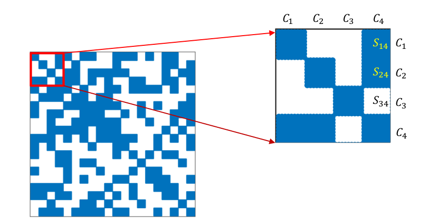
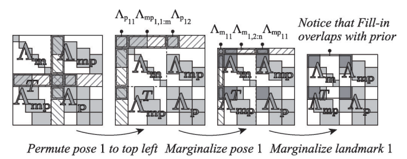

# Bundle Adjustment Optimization

To facilitate computation, only partial camera poses and landmark observations are selected for Bundle Adjustment (BA), rather than including the whole history poses and existing landmarks.

## Keyframe

Each recorded camera pose is called a *frame*. 
*Keyframe* refers to selected frames with rich and distinct information that best help BA to fast compute the poses almost the same as the results by all frames.

### Keyframe Selection Methods

Denote frame-indexed feature vectors (intuitively speaking, a full video film) $\bold{V}=\{v_i : i=1,2,...,N\}$; a segment of the video can be defined $\bold{Q}=\{v_i: i=l,...,r\}\subset\bold{V}$. The remaining segments (take away $\bold{Q}$ from $\bold{V}$) can be defined as $\overline{\bold{Q}}=\bold{V} \setminus \bold{Q}$, where $\setminus$ denotes *set minus* operator.

* Similarity Based 

The similarity between any two frames can be calculated using a distance measure $d(v_i, v_j)$ that gives a high value output if the two frames are similar. Here define two types of similarities $S$ and $C$.

Self-similarity (compare $v_k$ with frames' feature vector in a segment $\bold{Q}$):
$$
S(v_k, \bold{Q}) = 
\frac{1}{|\bold{Q}|} \sum_{v_k, v_i \in \bold{Q}} d(v_k, v_i)
$$

Cross-similarity (compare $v_k$ with frames' feature vector from other segments $\overline{\bold{Q}}$):
$$
C(v_k, \overline{\bold{Q}}) = 
\frac{1}{| \overline{\bold{Q}}|} \sum_{v_k \in \bold{Q}, v_i \in \overline{\bold{Q}}} d(v_k, v_i)
$$

A good keyframe should have a high $S$ score ($v_k$ being very similar to the other frames' feature vectors within the same segment) and low $C$ score ($v_k$ being distinctive among frames in other segments).

* Linear Discriminant Analysis (LDA)

Define a segmentation method to $\bold{V}$, such that $\bold{V}$ is partitioned into $K$ non-overlapping sets of contiguous frames. Each $\bold{Q}_j$ has $N_k$ frames.
$$
\bold{V} = 
\bigcup_{j=1,2,...,m} \bold{Q}_k
$$

First compute mean feature vector $\mu_j$ from each $\bold{Q}_j$ and the global mean $\mu$ from $\bold{V}$, then compute the within-class $S_w$ and between-class $S_b$ variances.
$$
\begin{align*}
    S_w &= \sum^m_{j=1} \sum_{v_i \in \bold{Q}_j}
    (v_i - \mu_j)(v_i - \mu_j)^\text{T}
    \\
    S_b &= \sum^m_{j=1} 
    N_j (\mu_j-\mu)(\mu_j-\mu)^\text{T}
\end{align*}
$$

The optimization becomes
$$
\bold{W}^* = arg \space \underset{\bold{W}}{max} 
\frac{\bold{W}^\text{T}S_b\bold{W}}{\bold{W}^\text{T}S_w\bold{W}}
$$

Now project the source feature space $\bold{V}$ by $\bold{W}^*$ to a lower dimensional space $\~\bold{V}$, there is $\~\bold{V}=\bold{W}^{*\text{T}}\bold{V}$. The projected space $\~\bold{V}$ should see each $\bold{Q}_j$'s centroid/mean $\mu_j$ widely separated and frames' features $v_i$ within each $\bold{Q}_j$ concentrated.

The best keyframe feature vector $v_k^*$ in each segment $\bold{Q}_j$ should be the one frame's feature vector closest to the $\bold{Q}_j$'s centroid/mean $\mu_j$ in the projected space $\~\bold{V}$.
$$
v^*_k = arg \space \underset{v_k \in \bold{Q}_k}{min} \space
\big|\big|
    \bold{W}^\text{T} (v_k - \mu_j)
\big|\big|
$$

## Co-Visibility

The so-called *co-visibility* refers to those features that are observed together with the current keyframe.

### Co-Visibility in Schur Elimination

Recall that in Schur elimination, the camera pose computation gives the below expression. 

$$
(\bold{B}-\bold{E}\bold{C}^{-1}\bold{E}^\text{T})
\Delta \bold{x}_{\bold{\xi}}=
\bold{v} - \bold{E}\bold{C}^{-1} \bold{w}
$$

Here denote $\bold{S}=\bold{B}-\bold{E}\bold{C}^{-1}\bold{E}^\text{T}$.

The non-zero matrix block on the off-diagonal line of the $\bold{S}$ matrix indicates that there is a co-observation between the two camera variables. It is called co-visibility.

If $\bold{S}=\bold{0}$, there is no shared features observed at these different camera poses.

If $\bold{S} \ne \bold{0}$ such as the figure given below, $\bold{S}$ illustrates the co-visibility of features. The zoomed-in sub-square matrix $C_1-C_4$ indicates that, the camera poses $C_1$ and $C_2$ see the same features as that from camera pose $C_4$, and vice versa. Camera pose $C_3$ sees no shared features.

## Sliding Window Method

### Motivations

In a real-world scenario, often a camera can only see a number of landmarks at a pose/keyframe, and the nearby poses/keyframes are likely able to see almost the same number of features/landmarks.

A sliding window aims to group these neighboring poses/keyframes and the associated landmarks. BA only performs computation on the selected poses and landmarks in this window.

### Definition

Now consider a sliding window. Assume there are $n$ keyframes in this window, and
their poses are denoted as $\bold{x}_1, \bold{x}_2, ..., \bold{x}_n$.

Given the same sliding window containing the aforementioned poses, suppose there are $m$ landmarks in this window $\bold{y}_1, \bold{y}_2, ..., \bold{y}_m$.

The conditional distribution of the poses $\bold{x}_k$ conditioned on $\bold{y}_k$ can be expressed as below under Gaussian noise assumption.
$$
[\bold{x}_1, \bold{x}_2, ..., \bold{x}_n | \bold{y}_1, \bold{y}_2, ..., \bold{y}_m]
\sim N([\bold{\mu}_1, \bold{\mu}_2, ..., \bold{\mu}_n]^\text{T}, \Sigma_{n})
$$
where $\bold{\mu}_k$ is mean of the $k$-th keyframe, $\Sigma$ is the covariance matrix of all keyframes.

BA collectively computes the windows's keyframes, and delivers the $\bold{S}$ that determines camera poses $\bold{x}_{\bold{\xi}_k}: k = 1,2,...,n$.

### Manage Keyframes in a Window

* Adding New Keyframes

The sliding window has established $n$ keyframes at the last moment, and a certain Gaussian distribution describes poses conditional on landmarks.

A new keyframe can be directly added to the window (denoted as $\bold{x}_{n+1}$) and BA can normally perform computation on $\bold{S}$, in contrast to pose removal that has concerns over correlated observed landmarks between various poses.

$$
[\bold{x}_1, \bold{x}_2, ..., \bold{x}_n, \bold{x}_{n+1} | \bold{y}_1, \bold{y}_2, ..., \bold{y}_m, \bold{y}_{m+1}, ..., \bold{y}_{m_{n+1}}]
\sim N([\bold{\mu}_1, \bold{\mu}_2, ..., \bold{\mu}_n, \bold{\mu}_{n+1}]^\text{T}, \Sigma_{n+1})
$$
where $[\bold{y}_{m+1}, ..., \bold{y}_{m_{n+1}}]$ are the new landmarks observed from the new pose $\bold{x}_{n+1}$. There is possibility that landmarks $\bold{y}_k \in [\bold{y}_1, \bold{y}_2, ..., \bold{y}_m]$ are observed from the new camera pose $\bold{x}_{n+1}$

* Removing Old Keyframes

Keyframe removal, intuitively speaking, asks for the result of marginalization of $\bold{x}_1$ such as $P(\bold{x}_2, \bold{x}_3, ..., \bold{x}_n, \bold{y}_{1}, \bold{y}_{2}, ..., \bold{y}_{m} | \bold{x}_1)$, where $[\bold{y}_{1}, \bold{y}_{2}, ..., \bold{y}_{m}]$ are shared landmark observations between camera poses $[\bold{x}_2, ..., \bold{x}_n]$.

Schur elimination (a.k.a marginalization) removing $\bold{x}_1$ can cause a sparse matrix dense. This phenomenon is termed *fill-in*.

Below is an example, where a matrix $\bold{\Lambda}$ is composed of $\bold{B}=\Lambda_m \in \mathbb{R}^{m \times m}, \bold{E}=\Lambda_{mp} \in \mathbb{R}^{m \times p}, \bold{C}=\Lambda_p \in \mathbb{R}^{p \times p}$. 

$$
\begin{bmatrix}
    \bold{B} & \bold{E} \\
    \bold{E}^\text{T} & \bold{C}
\end{bmatrix}
\begin{bmatrix}
    \Delta \bold{x}_{\bold{\xi}} \\
    \Delta \bold{x}_{\bold{p}}
\end{bmatrix}=
\begin{bmatrix}
    \bold{v} \\
    \bold{w}
\end{bmatrix}
$$

First, permutation takes place moving $\bold{x}_1$- related landmark elements to the margin from $\bold{E}, \bold{E}^\text{T}, \bold{C}$.

Then perform marginalization. Denote the permuted sub matrices (marked as slash-shaded areas) as $\bold{B}'=\bold{\Lambda}_{p_{11}}, \bold{E}'=[\bold{\Lambda_{mp_{1,1:m}}} \quad \bold{\Lambda_{pp_{m,1:m}}}]$, 
and $\bold{C}'$ describes the remaining of the original $\bold{\Lambda}$ (the non-slash-shaded area): $\bold{C}'=\{ \forall \lambda_{ij} \in \bold{\Lambda}, \forall \lambda_{ij} \notin \bold{B}', \forall \lambda_{ij} \notin \bold{E}', \forall \lambda_{ij} \notin \bold{E}'^\text{T} \}$.

Schur trick works on this linear system, where $\bold{v}'$ refers to permuted noises about $\bold{x}_1$. 
The marginalization aims to compute $\Delta \bold{x}_{{\bold{x}_1 } \notin \bold{x}}$.
$$
\begin{bmatrix}
    \bold{B}' & \bold{E}' \\
    \bold{E}'^\text{T} & \bold{C}'
\end{bmatrix}
\begin{bmatrix}
    \Delta \bold{x}_{{\bold{x}_1 }} \\
    \Delta \bold{x}_{{\bold{x}_1 } \notin \bold{x}}
\end{bmatrix}=
\begin{bmatrix}
    \bold{v}'_{{\bold{x}_1 }} \\
    \bold{v}'_{{\bold{x}_1 } \notin \bold{x}}
\end{bmatrix}
$$

The coefficients for $\Delta \bold{x}_{{\bold{x}_1 } \notin \bold{x}}$ should be
$$
(\bold{C}'-\bold{E}'^\text{T}\bold{B}'^{-1}\bold{E}')
\Delta \bold{x}_{{\bold{x}_1 } \notin \bold{x}}=
\bold{v}'_{{\bold{x}_1 } \notin \bold{x}} - \bold{E}'^\text{T}\bold{B}'^{-1} \bold{v}'_{\bold{x}_1 }
$$

The coefficient matrix $\bold{S}'=\bold{C}'-\bold{E}'^\text{T}\bold{B}'^{-1}\bold{E}'$ is not sparse as a result of marginalization that removes $\bold{x}_1$. Fill-in refers to the dense matrix $\bold{S}'$ that derives from $\begin{bmatrix}    \bold{B} & \bold{E} \\    \bold{E}^\text{T} & \bold{C}   \end{bmatrix}$ which is a sparse matrix.

Denote $\bold{S}' = \begin{bmatrix}    \bold{B}_{\bold{S}'} & \bold{E}_{\bold{S}'}  \\    \bold{E}_{\bold{S}'} ^\text{T} & \bold{C}_{\bold{S}'}    \end{bmatrix}$, now the linear system without $\bold{x}_1$ can be expressed as
$$
\begin{bmatrix}    
    \bold{B}_{\bold{S}'} & \bold{E}_{\bold{S}'}  
    \\    
    \bold{E}_{\bold{S}'} ^\text{T} & \bold{C}_{\bold{S}'}    
\end{bmatrix}
\begin{bmatrix}
    \Delta \bold{x}_{\bold{\xi}_{\bold{x}_1 \notin \bold{x}}} \\
    \Delta \bold{x}_{\bold{p}_{\bold{x}_1 \notin \bold{x}}}
\end{bmatrix}=
\begin{bmatrix}
    \bold{v}_{\bold{x}_1 \notin \bold{x}} \\
    \bold{w}_{\bold{x}_1 \notin \bold{x}}
\end{bmatrix}
$$

Repeat this marginalization process for many more $\bold{x}_k$, $\bold{S}'_k$ can be very dense.
A dense matrix can be time-consuming in finding the solution.

## Pose Graph Optimization

Computation for landmark positions can be costly as one photo shot can contain thousands of visual features, and as revealed in the sliding window method that repeated adding/removing camera pose $\bold{x}_k$ can make the linear system $\bold{S}_k$ very dense.
However, once landmark positions are determined (landmark optimization convergent to a small error), unlike a camera's pose, landmarks barely move.

Pose graph agrees on this assumption that mainly focuses on optimizing camera poses.

### Residuals and Jacobians

Define a camera pose $[\bold{R}|\bold{t}]_i$, for $j \ne i$, define another pose $[\bold{R}|\bold{t}]_j$ (NOT necessarily the next step $j=1,2, ..., i-2,i-1,i+1,i+2,...$). The movement in between is denoted as $\Delta [\bold{R}|\bold{t}]_{ij}$

$$
\Delta \bold{\xi}_{ij} = 
\bold{\xi}_{i}^{-1} \circ \bold{\xi}_{j}=
ln([\bold{R}|\bold{t}]_{i}^{-1} [\bold{R}|\bold{t}]_{j})^\vee
$$

Similarly in $SE(3)$, there is
$$
[\bold{R}|\bold{t}]_{ij} = 
[\bold{R}|\bold{t}]^{-1}_i [\bold{R}|\bold{t}]_j
$$

The error $\bold{e}_{ij}$ that concerns the differences between the ideal pose transformation $[\bold{R}|\bold{t}]_{ij}$ and the two-pose-based computed transformation $[\bold{R}|\bold{t}]^{-1}_i [\bold{R}|\bold{t}]_j$ is defined as
$$
\bold{e}_{ij} = 
ln([\bold{R}|\bold{t}]_{ij}^{-1}[\bold{R}|\bold{t}]^{-1}_i [\bold{R}|\bold{t}]_j)
$$

Apply Lie algebra perturbation $\Delta \bold{\xi}$ for finding the Jacobian of $\bold{e}$.
Since there are $\bold{\xi}_i$ and $\bold{\xi}_j$, the Jacobian should respect these two variables. Define two trivial disturbance terms $\Delta \bold{\xi}_i$ and $\Delta \bold{\xi}_j$ to the above error expression.
$$
\hat{\bold{e}}_{ij} = 
ln([\bold{R}|\bold{t}]_{ij}^{-1}[\bold{R}|\bold{t}]^{-1}_i e^{(-\Delta \bold{\xi}_i)^\wedge} e^{(\Delta \bold{\xi}_j)^\wedge} [\bold{R}|\bold{t}]_j)^\vee
$$