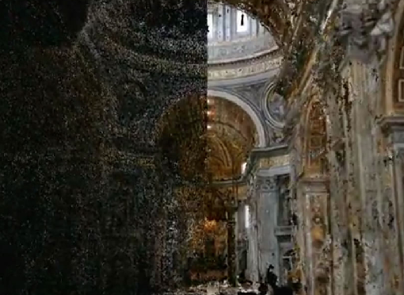
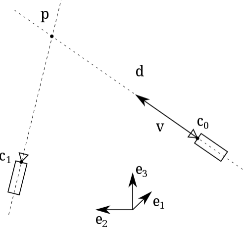

# Dense Reconstruction

Mapping is to use visual/lidar and other sensors to create a map about the environment. One key aspect is object depth estimation. Dense reconstruction is about depth estimation (reconstruct the environment with depth information).

Dense reconstruction tries to recover the environment as much as possible, in contrast to sparse reconstruction that only takes interest in corner features.

      

 

Dense reconstruction provides rich information available for many computer vision tasks such as recognition, segmentation, etc.

### Inverse Depth Parameterization

Define a point $\bold{p}=(x,y,z)$ in 3D space (the reference frame is $(e_1, e_2, e_3)$) observed by a monocular pinhole camera from multiple views.

The inverse depth parametrization of the point's position is a 6D vector $\bold{y}=(x_0, y_0, z_0, \theta, \phi, \rho)$ that encodes the optical centre of the camera $\bold{c}_0=(x_0, y_0, z_0)$ when in first observed the point, and the position of the point along the ray passing through $\bold{p}$ and $\bold{c}_0$.

In detail, $\phi$ is the azimuth, $\theta$ is the elevation/altitude angle, and $\rho=\frac{1}{||\bold{p}-\bold{c}_0||}$ is the inverse depth of $\bold{p}$ at the first observation.

      

 

## Gaussian Depth Filters

Computing every pixel's depth in an image is extremely time-consuming. Often in real world is that pixel and its surrounding should see similar depth. By this assumption, multi-modal Gaussian distribution can be used to bulk estimate pixels' depth.

Assume the depth $d$ of a certain pixel satisfy:
$$
P(d) = N(\mu, \sigma^2)
$$

Assume observation is also a Gaussian distribution.
$$
P(d_{obs}) = N(\mu_{obs}, \sigma_{obs}^2)
$$

The question is how to use the observed information to update the original distribution of $d$. Since the normalized product of two Gaussian distributions is still a Gaussian distribution, the distribution of $d$ after fusion $N(\mu_{fuse}, \sigma_{fuse})$ can be computed by
$$
\mu_{fuse} = \frac{\sigma_{obs}^2 \mu + \sigma^2 \mu_{obs}}{\sigma_{obs}^2 + \sigma^2}
, \quad
\sigma^2_{fuse} = \frac{\sigma_{obs}^2 \sigma^2 }{\sigma_{obs}^2 + \sigma^2}
$$

Shown as an example below, consider a ground truth real world point $P$ projected from $p_2$ on an epipolar line $l_2$. 
Given some measurement uncertainty, observation sees $p_2'$ as an alternative representation of $P$.

The depth estimation of $P$ has an error between the length $p$ and $p'$ from the perspective of $O_1$.

In other words, if $p_2 p_2'$ is one pixel,  how long is $p'$ and $p$.

      

 

Given the geometry, there are
$$
\begin{align*}
    a &= p - t \\
    \alpha &= \arccos \langle p,t \rangle \\
    \beta &= \arccos \langle a,-t \rangle
\end{align*}
$$

For the perturbed $p_2$, there are
$$
\begin{align*}
    \beta' &= \arccos \langle O_2 p_2', -t \rangle \\
    \gamma &= \pi - \alpha - \beta
\end{align*}
$$

With the above obtained $\beta'$ and $\gamma$, by the law of sine, $p'$ can be computed by
$$
||p'|| = 
||t|| \frac{\sin \beta'}{\sin \gamma}
$$

Accordingly, the uncertainty of observation can be measured by
$$
\sigma_{obs} = ||p|| - ||p'||
$$

## Direct Tracking and Mapping (DTAM)

### Dense Mapping Problem Formulation

Direct method starts with the idea of using all the pixels from camera frame to camera frame to resolve the world around sensors, relying on principles from photogrammetry, different from feature-based methods that take interest in image features.

Define the pose of a camera $c$ with respect to the world frame of reference $w$ as $T_{wc} \in SE(3)$:
$$
T_{wc} = 
\begin{bmatrix}
    R_{wc} & \bold{c}_{w} \\
    \bold{0}^\top & 1
\end{bmatrix}
$$

Define a world point such that $\bold{x}_w = T_{wc}\bold{x}_c$. Camera pre-calibrated intrinsic matrix is denoted as $K$. 
Perspective projection of a
3D point is denoted as $\bold{x}_c = (x, y, z)^\top$,
and its homogeneous projection is $\pi(\bold{x}_c) = (x/z, y/z)^\top$. Besides, define $\pi^{-1}(\bold{u}, d) = \frac{1}{d}K^{-1}\dot{\bold{u}}$ to represent the operation reversed the homogeneous projection to include the depth axis, where $\dot{\bold{u}}:=(u,v,1)^\top$.

Define a keyframe $r$ consisted of a reference image $I_r$ with pose $T_{rw}$. Inside this image, each pixel is denoted as $\bold{u}_r=(u_r,v_r)^\top \in \Omega$, where $\Omega$ is a 3D RGB space.

Define a camera movement $m \in \mathcal{I}(r)$ and the new camera pose is $T_{mw}$.
The camera movement set $\mathcal{I}(r)$ consists of frames nearby and overlapping
$r$.

Indicated in the figure below, each pixel of the reference frame $\bold{u}_r$ has an associated row of entries $C_r(\bold{u})$ (shown in red) that store the average photometric error $C_r(\bold{u}, d)$ computed for each inverse depth $d \in D$, where $D$ is constrained in $S \in [\xi_{min}, \xi_{max}]$.

The $C_r$ space is discretized into $M \times N \times S$ voxels that help optimization solution search.

      

 

The average photometric error $C_r(\bold{u}, d)$ is computed by projecting a 3D
point in the volume into each of the overlapping images and
summing the $\mathcal{L}_1$ norm of the individual photometric errors
obtained:

* Each photometric error to a keyframe $r$ given the movement $m$:
$$
\rho_r(I_m, \bold{u}, d) = 
I_{r}(\bold{u}) - 
I_m\big(
    \pi (K T_{wc} \pi^{-1}(\bold{u}, d))
\big)
$$

* Collectively, the normalized $\mathcal{L}_1$ norm error over a number for movements $m \in \mathcal{I}(r)$ is
$$
C_r(\bold{u}, d) = \frac{1}{|\mathcal{I}(r)|}
\sum_{m \in \mathcal{I}(r)}
\big|\big|
\rho_r(I_m, \bold{u}, d)
\big|\big|_1
$$

### Mapping Noise Problem

Directly solving $C_r(\bold{u}, d)$ can lead to noisy results.

Exemplified in the figure below, there exist three points $a,b,c$, where $a$ is a point on a plain black plane (totally featureless); $c$ is on an edge, and $a$ is a corner feature.

The three points' normalized costs $C_r(\bold{u}, d)$ are plotted shown as bold red curves, computed/normalized from their individual photometric errors $\rho_r(I_m, \bold{u}, d)$ which are marked in various color thinner lines.

Point $a$'s photometric errors are very chaotic while $b$ exhibits a clear error minima. 
This shows that feature points' depth are easy to estimate, while featureless points are noisy.

      

 

### Regularization

Regularization can be implemented to address the aforementioned issue, that in real world, often is the assumption that plain/featureless surface object should have smooth decaying/growing depth.
In other words, depth changes at the point $a$ should be smooth.

Huber loss can be used to contain large error terms by $\mathcal{L}_1$ norm and amplify small error terms by $\mathcal{L}_2$.
$$
L_{\delta}(e)=
\left\{
    \begin{array}{c}
        \frac{1}{2}e^2 &\quad \text{for} |e|\le \delta
        \\
        \delta \cdot (|e|-\frac{1}{2}\delta) &\quad \text{otherwise}
    \end{array}
\right.
$$

The regularizer comprises a weighted Huber norm over the gradient of the inverse depth map $g(\bold{u}) \cdot \big|\big|\nabla \bold{\xi}(\bold{u})\big|\big|_\delta$.

Replace Huber loss error term $L_{\delta}(e)$ with the gradient of the inverse depth map such as $L_{\delta}\big(\nabla \bold{\xi}(\bold{u})\big)=\big|\big|\nabla \bold{\xi}(\bold{u})\big|\big|_\delta$. 
Here $\nabla \bold{\xi}(\bold{u})$ describes depth changes.

As a result, if there is any sudden change in depth (for this pixel's projected depth lower than $\delta$ such as $\big|\bold{\xi}(\bold{u})\big|<\delta$), the depth changes are smoothed by $\mathcal{L}_2$; otherwise, smoothed by $\mathcal{L}_1$.

Per pixel weight $g(\bold{u})$ is defined as
$$
g(\bold{u}) = 
e^{-\alpha \big|\big| 
    \nabla I_r (\bold{u})
\big|\big|^\beta_2}
$$

This term $g(\bold{u})$ reduces the regularization strength where the edge magnitude is high, 
thereby limiting solution smoothing across region boundaries (making edge/corner transition obvious). 
$\nabla I_r (\bold{u})$ describes in-image pixel changes (increase weight for visual feature pixels). $\alpha$ is a scaling factor and $\beta$ is the exponential controlling factor.

Below is the energy function that takes into account the regularization and photometric errors.
$$
E_{\bold{\xi}} = 
\int_{\Omega} \big\{
    g(\bold{u}) \cdot \big|\big|\nabla \bold{\xi}(\bold{u})\big|\big|_\delta
    +
    \lambda C\big(\bold{u}, \bold{\xi}(\bold{u})\big)
\big\} d\bold{u}
$$
where regularizer $g(\bold{u}) \cdot \big|\big|\nabla \bold{\xi}(\bold{u})\big|\big|_\delta$ is a convex function while $C\big(\bold{u}, \bold{\xi}(\bold{u})\big)$ is non-convex.

In order to optimize the non-convex function, the below approximation is proposes.
$$
E_{\bold{\xi}, \bold{\alpha}} = 
\int_{\Omega} \big\{
    g(\bold{u}) \cdot \big|\big|\nabla \bold{\xi}(\bold{u})\big|\big|_\delta
    +
    \frac{1}{2\theta} \big( \bold{\xi}(\bold{u})-\bold{\alpha}(\bold{u}) \big)^2
    +
    \lambda C\big(\bold{u}, \bold{\alpha}(\bold{u})\big)
\big\} d\bold{u}
$$
where, the coupling term $Q(\bold{u})=\frac{1}{2\theta} \big( \bold{\xi}(\bold{u})-\bold{\alpha}(\bold{u}) \big)^2$ serves to drive the original and auxiliary variables together in optimization, enforcing $\bold{\xi}=\bold{\alpha}$ as $\theta \rightarrow 0$.

$g(\bold{u}) \cdot \big|\big|\nabla \bold{\xi}(\bold{u})\big|\big|_\delta + Q(\bold{u})$ can be solved via a primal-dual approach. $Q(\bold{u})+\lambda C\big(\bold{u}, \bold{\alpha}(\bold{u})\big)$ is trivially point-wise optimizable and can be solved using an exhaustive search over a finite range of discretely sampled inverse depth values.

### Dense Tracking and Pose Estimation

DTAM proposes the pose of a live camera estimation by finding the parameters of motion 
which generate a synthetic view which best matches the live video image.

The live camera pose estimation is essentially finding a camera pose transform ${T}_{wl}$ in the world frame. 
The subscript $l$ means "live" and $w$ means "world". 
Set ${T}_{wl}=T_{wv}T_{vl}$, where the subscript $v$ means "virtual", basically as if a virtual camera taking a shot at this pose $T_{wv}$ to represent any camera pose near to the true pose ${T}_{wl}$. 

$T_{lv}$ is a correction to $T_{wv}$ to form the true pose ${T}_{wl}$, and $T_{lv}$ is function of $\psi \in \mathbb{R}^6$  belonging to the Lie algebra $se3$.

Pose estimation is to minimize this cost function
$$
F(\psi)=
\frac{1}{2} \sum_{\bold{u}\in\Omega}
\big(
    f_{\bold{u}}(\psi)
\big)^2
$$
where $f_{\bold{u}}(\psi)$ is the overall difference between two images $I_l$ and $I_v$, in which $I_l$ takes into account $T_{lv}(\psi)$ that adjusts $I_l$ to reduce the difference to $I_v$.
$$
f_{\bold{u}}(\psi) = 
I_l \big( \pi\big( 
    KT_{lv}(\psi) \pi^{-1} (\bold{u}, \xi_v(\bold{u}))
\big)\big) - I_v(\bold{u})
$$

## LSD-SLAM: Large-Scale Direct Monocular SLAM

LSD-SLAM generates a consistent global map, using direct image alignment and probabilistic, semi-dense depth maps instead of keypoints.

### Lie Algebra for Direct Image Alignment

A 3D rigid body transform $\bold{G} \in SE(3)$ is defined as
$$
\bold{G} = 
\begin{bmatrix}
    \bold{R} & \bold{t} \\
    \bold{0} & 1
\end{bmatrix}
, \quad
\bold{R} \in SO(3)
, \space
\bold{t} \in \mathbb{R}^3
$$

Define the transform corresponding element $\bold{\xi} \in se(3)$. Elements are mapped to $\bold{G}$ by $\bold{G}=\exp_{se(3)}(\bold{\xi})$,
and its inverse is $\bold{\xi}=\log_{SE(3)}(\bold{G})$.