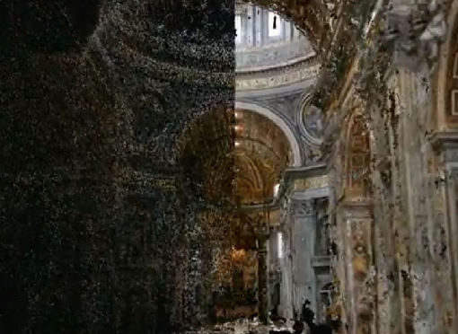
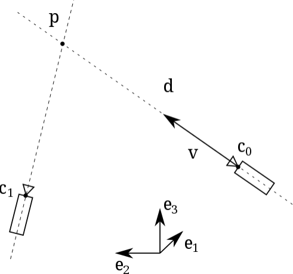
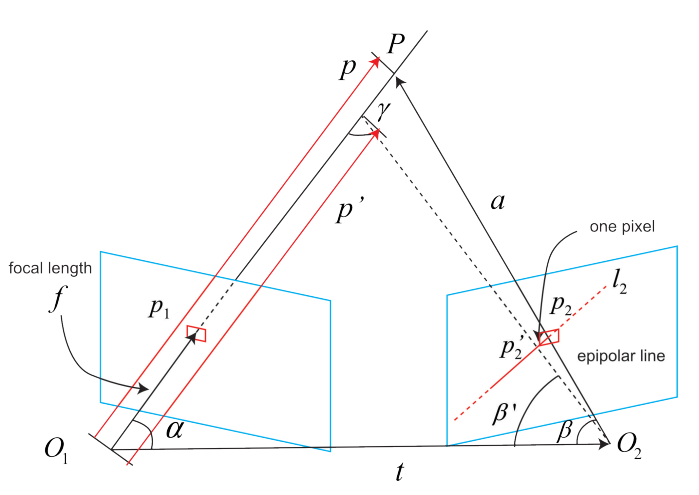

# Dense Reconstruction/Structure from Motion (SfM)

Structure from Motion (SfM) is the process of estimating the 3-D structure of a scene from a set of 2-D images.

Mapping is to use visual/lidar and other sensors to create a map about the environment. One key aspect is object depth estimation. Dense reconstruction is about depth estimation (reconstruct the environment with depth information).

Dense reconstruction tries to recover the environment as much as possible, in contrast to sparse reconstruction that only takes interest in corner features.

      

 

Dense reconstruction provides rich information available for many computer vision tasks such as recognition, segmentation, etc.

### Direct Method vs Feature-Based Method

Direct approaches minimize photometric error, while feature-based method minimizes geometric displacement (typically keypoints).

Direct methods require a good initial guess due to their small region of attraction, 
while feature-based approaches consume extra computational resources on extracting and matching features.

### Inverse Depth Parameterization

Define a point $\mathbf{p}=(x,y,z)$ in 3D space (the reference frame is $(e_1, e_2, e_3)$) observed by a monocular pinhole camera from multiple views.

The inverse depth parametrization of the point's position is a 6D vector $\mathbf{y}=(x_0, y_0, z_0, \theta, \phi, \rho)$ that encodes the optical centre of the camera $\mathbf{c}_0=(x_0, y_0, z_0)$ when in first observed the point, and the position of the point along the ray passing through $\mathbf{p}$ and $\mathbf{c}_0$.

In detail, $\phi$ is the azimuth, $\theta$ is the elevation/altitude angle, and $\rho=\frac{1}{||\mathbf{p}-\mathbf{c}_0||}$ is the inverse depth of $\mathbf{p}$ at the first observation.

      

 

### Gaussian Depth Filters

Computing every pixel's depth in an image is extremely time-consuming. Often in real world is that pixel and its surrounding should see similar depth. By this assumption, multi-modal Gaussian distribution can be used to bulk estimate pixels' depth.

Assume the depth $d$ of a certain pixel satisfy:

$$
P(d) = N(\mu, \sigma^2)
$$

Assume observation is also a Gaussian distribution.

$$
P(d_{obs}) = N(\mu_{obs}, \sigma_{obs}^2)
$$

The question is how to use the observed information to update the original distribution of $d$. Since the normalized product of two Gaussian distributions is still a Gaussian distribution, the distribution of $d$ after fusion $N(\mu_{fuse}, \sigma_{fuse})$ can be computed by

$$
\mu_{fuse} = \frac{\sigma_{obs}^2 \mu + \sigma^2 \mu_{obs}}{\sigma_{obs}^2 + \sigma^2}
, \quad
\sigma^2_{fuse} = \frac{\sigma_{obs}^2 \sigma^2 }{\sigma_{obs}^2 + \sigma^2}
$$

Shown as an example below, consider a ground truth real world point $P$ projected from $p_2$ on an epipolar line $l_2$. 
Given some measurement uncertainty, observation sees $p_2'$ as an alternative representation of $P$.

The depth estimation of $P$ has an error between the length $p$ and $p'$ from the perspective of $O_1$.

In other words, if $p_2 p_2'$ is one pixel,  how long is $p'$ and $p$.

      

 

Given the geometry, there are

$$
\begin{align*}
    a &= p - t \\\\
    \alpha &= \arccos \langle p,t \rangle \\\\
    \beta &= \arccos \langle a,-t \rangle
\end{align*}
$$

For the perturbed $p_2$, there are

$$
\begin{align*}
    \beta' &= \arccos \langle O_2 p_2', -t \rangle \\\\
    \gamma &= \pi - \alpha - \beta
\end{align*}
$$

With the above obtained $\beta'$ and $\gamma$, by the law of sine, $p'$ can be computed by

$$
||p'|| = 
||t|| \frac{\sin \beta'}{\sin \gamma}
$$

Accordingly, the uncertainty of observation can be measured by

$$
\sigma_{obs} = ||p|| - ||p'||
$$

## Structure from Motion (SfM) 

SfM is the process of estimating the 3-D structure of a scene from a set of 2-D images.

## Method Summary

* PTAM

Tracking and Mapping are separated, and run in two parallel threads.
Parallelization can facilitate computation for using separated threads for different tasks.

PTAM is the first real-time solution that uses nonlinear optimization instead of traditional filters in the backend.
It introduces the keyframe mechanism rather using all keyframes.

* DTAM

* LSD

* ORB

* VINS