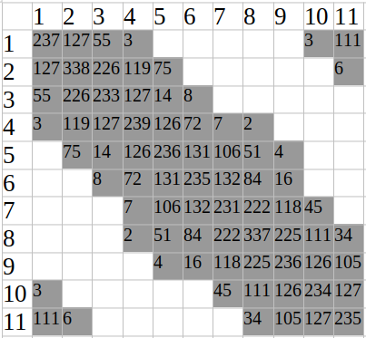
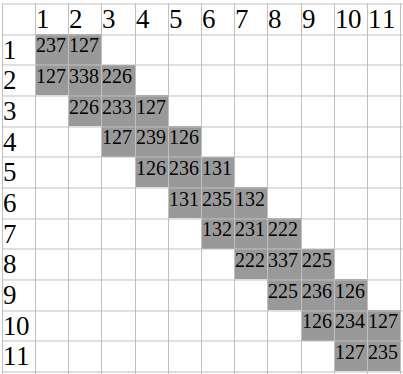
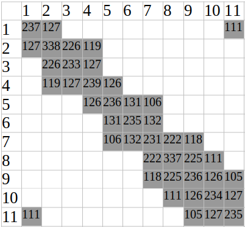

# ORB-SLAM: a Versatile and Accurate Monocular SLAM System

## Map Initialization

To compute the relative transform pose between two/a few frames to triangulate an initial set of map points, 
ORB-SLAM proposes to compute in parallel two geometrical models: 

* a homography assuming a planar scene 
* a fundamental matrix assuming a non-planar scene.

Extract ORB features (only at the finest scale) in the current keyframe $\bold{K}_c$ and search for matches $\bold{x}_c \leftrightarrow \bold{x}_r$ in the reference keyframe $K_r$. 
If not enough matches are found,
reset the reference frame.

Compute in parallel threads a homography ${H}_{cr}$ and a
fundamental matrix ${F}_{cr}$:
$$
\bold{x}_c = {H}_{cr} \bold{x}_r
\quad\quad
\bold{x}_c {F}_{cr} \bold{x}_r = 0
$$

Matches $\bold{x}_c$ and $\bold{x}_r$ are shown as below, and $\bold{E}$ denotes the essential matrix (fundamental matrix $\bold{F}$ is computed from $\bold{E}$ with camera pin-hole model parameters)
$$
\bold{x}_c
=
\begin{bmatrix}
    u \\
    v \\
    1
\end{bmatrix}
, \quad
\bold{x}_r
=
\begin{bmatrix}
    u' \\
    v' \\
    1
\end{bmatrix}
, \quad
E=
\begin{bmatrix}
    e_1 & e_2 & e_3 \\
    e_4 & e_5 & e_6 \\
    e_7 & e_8 & e_9 \\
\end{bmatrix}
, \quad
H=
\begin{bmatrix}
    h_1 & h_2 & h_3 \\
    h_4 & h_5 & h_6 \\
    h_7 & h_8 & h_9 \\
\end{bmatrix}
$$

### To Compute $E$

*Eight-Point Algorithm* can be used to compute $E$ such by
$$
\begin{bmatrix}
    u_1'u_1 & u_1'v_1 & u_1' & v_1'v_1 & v_1'u_1 & v_1' & u_1 & v_1 & 1 \\
    u_2'u_2 & u_2'v_2 & u_2' & v_2'v_2 & v_2'u_2 & v_2' & u_2 & v_2 & 1 \\
    \vdots & \vdots &\vdots &\vdots &\vdots &\vdots &\vdots &\vdots &\vdots \\
    u_8'u_8 & u_8'v_8 & u_8' & v_8'v_8 & v_8'u_8 & v_8' & u_8 & v_8 & 1 \\
\end{bmatrix}
\begin{bmatrix}
    e_1 \\
    e_2 \\
    e_3 \\
    e_4 \\
    e_5 \\
    e_6 \\
    e_7 \\
    e_8 \\
    e_9 \\
\end{bmatrix}
=0
$$

### To Compute $H$

Similarly, to compute $\bold{H}_{cr}$, there are
$$
\begin{align*}
\bold{h}
&=
(h_{1}, h_{2}, h_{3}, h_{4}, h_{5}, h_{6}, h_{7}, h_{8}, h_{9})^\text{T}
\\
\bold{a}_x &=
(-u_1, -v_1, -1, 0, 0, 0, x_2'x_1, x_2'y_1, x_2')^\text{T}
\\
\bold{a}_y &=
(0, 0, 0, -x_1, -y_1, -1, y_2'y_1, y_2'x_1, y_2')^\text{T}
\end{align*}
$$

Given $n$ points to compute 
$$
A \bold{h} = \bold{0}
$$
where
$$
A=
\begin{bmatrix}
    \bold{a}_{x_1}^\text{T} &
    \bold{a}_{y_1}^\text{T} &
    ... &
    \bold{a}_{x_n}^\text{T} &
    \bold{a}_{x_n}^\text{T}
\end{bmatrix}^\top
$$

### Score $S_M$ and Model Selection

compute a score $S_M$ for each model $M$ (either $M=F$ for non-planar model or $M=H$ for planar model)

$$
S_M = 
\sum_i \bigg(
\rho_M \big(
    d^2_{cr}(\bold{x}_{ri}, \bold{x}_{ci}) \big) +
\rho_M \big(
    d^2_{rc}(\bold{x}_{ri}, \bold{x}_{ci}) \big)
\bigg)
$$
where 
$$
\rho_M \big( d^2 \big) =
\left\{
    \begin{matrix}
        T_H - d^2 & \text{if } d^2 < T_M \\
        0 & \text{if } d^2 \ge T_M \\
    \end{matrix}
\right.
$$
where $d^2$ is the symmetric transfer error, $T_M$ is an outlier rejector based on $\mathcal{X}^2$ test. $T_H$ is the outlier rejector for the homography (planar) model.

If the scene is planar, nearly planar or there is low
parallax, it can be explained by a homography. Otherwise, it should be anon-planar scene.

In practice, if $\frac{S_H}{S_H+S_F}>0.45$, select homography model, otherwise, select non-planar model.

Full bundle adjustment is applied across multiple frames to further refine the initial reconstruction. 

## Tracking

The ORB descriptor is used in all feature matching, in contrast to the search by patch correlation in PTAM.

### Initial Pose Estimation

* Initial Pose Estimation from Previous Frame

Use a **constant** velocity motion model as a prior estimate if the last keyframe choice is good.

* Initial Pose Estimation via Global Relocalization

If the tracking is lost, convert the frame into bag of words and query the recognition database for keyframe candidates for global relocalization.

In detail, there should exist visual overlap between keyframes, so that keyframes can be chained in a chronological order (all connected
in a shared co-visibility graph), from which poses are re-computed accordingly.

### Track Local Map

Given the prior pose estimate and an initial set of feature matches, 
project the map into the frame and search more map point correspondences.

Some map point search choices are shown as below
* Denote a map point mean viewing direction $\overrightarrow{n}$ and the current viewing ray $\overrightarrow{v}$; discard if $\overrightarrow{v} \overrightarrow{n}>\cos(60^\circ)$.
* Compute the distance $d$ from map point to camera center. 
Discard if it is out of the scale invariance region of the map point $d \notin [d_{min}, d_{max}]$

The camera pose is finally optimized with all the map points
found in the frame.

### New Keyframe Decision

* Local mapping is idle (avoid too much burden on CPU), or more than 20 frames have passed from last keyframe insertion.
* Current frame tracks at least 50 points.
* Current frame tracks less than 90% points than the last reference keyframe (visual changes as a criterion rather than a distance criterion proposed by PTAM).

## Local Mapping

### Co-Visibility and Essential Graph

In co-visibility graph, each node/vertex represents a pose/keyframe, and each edge if built between nodes indicates that the two poses observe some same visual features. 
If an edge exists, when performing pose optimization, the pose transform $T_{ij}$ between the two poses $\bold{\xi}_i$ and $\bold{\xi}_j$ should be computed, otherwise, ignored.

Given the example of 11 poses below, the co-visibility graph can be represented by a matrix where each entry is an edge (numbers in the grey cells are the counts of shared observed features). 
The $10$-th and $11$-th poses see some same features as observed by the $1$-st and $2$-nd poses, indicating a loop closure.
Larger the number in a cell, more likely the edge's two poses are related.

       

 

A spanning tree maintains a minimal number of edges. Often, it keeps the edges with the most shared visual features.

       

 

Inspired by co-visibility information between keyframes with attempt to reduce computation cost, ORB SLAM proposes *Essential Graph* that retains all the nodes (keyframes),
but less edges (conditioned on the number of shared observed visual features being greater than $100$), still preserving a strong network that yields accurate results.

       

 

### KeyFrame Insertion

* Update the co-visibility graph by adding a new node $K_i$ and edges with other nodes with shared observations
* Update the spanning tree by adding this node and one edge with one node with most shared observations

### Recent Map Points Culling

Map points must go through recent three keyframe tests upon creation.

* All recent three keyframes should see this map point
* More than $25\%$ of frames in the time interval of the three keyframes should see this map point

### New Map Point Creation

New map points are created by triangulating ORB from
connected keyframes $\bold{K}_c$ in the co-visibility graph.

### Local Bundle Adjustment

The local BA optimizes the currently processed keyframe
$K_i$ , 
all the keyframes connected to it in the co-visibility graph $\bold{K}_c$ , 
and all the map points seen by those keyframes.

### Local Keyframe Culling

Local mapping tries to detect redundant keyframes and delete them.

Discard all the keyframes in $\bold{K}_c$ whose $90\%$ of the
map points have been seen in at least other three keyframes in the same or finer scale.

## Loop Closure

### Loop Candidates Detection

Repeat this process for all $K_i$, and each $K_i$ must pass three consecutive tests (having similarity score greater than $s_{\min}$).

1. Compute the similarity between the bag of words vector of $K_i$ and all its neighbors in the co-visibility graph (conditioned on the number of shared observations greater than $30$),
and retain the lowest similarity score $s_{\min}$.

2. Discard keyframes with similarity score lower than $s_{\min}$

### Compute the Similarity Transformation $sim(3)$

To close a loop need to compute a similarity transformation $sim(3)$ from the current keyframe $K_i$ to the loop keyframe $K_l$.

Propose some candidate loop keyframes and find the optimal loop keyframes $K^*_l \in \bold{K}_l$.

1. Perform BoW ORB correspondence match. If matched points is lower than 20, discard this candidate loop keyframe
2. Given the remaining candidate loop keyframe, perform $sim(3)$ on these candidate keyframes
3. Perform RANSAC on the computed $sim(3)$ to see if some of them are erroneous/outliers, and remove the associated candidate keyframes
4. Perform bundle adjustment on the remaining candidate keyframes
5. Candidate keyframes are valid if they pass a 20-inlier $sim(3)$ test

### Loop Fusion

**Goal**: match correspondence map points from multiple frames to only one map point in the 