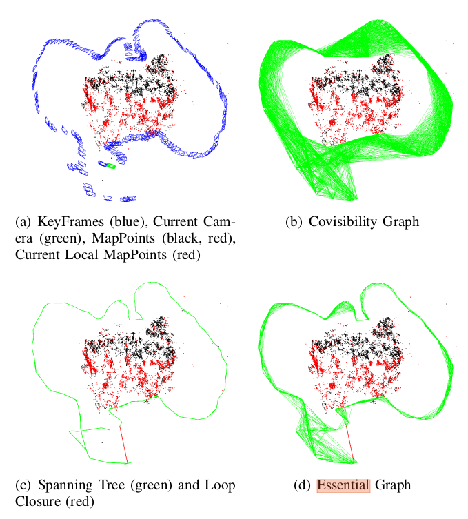

# ORB SLAM Source Code Review

## Start

Run by
```bash
rosrun ORB_SLAM2 RGBD <path_to_vocabulary> <path_to_settings>
```

### The `main()`

ORB-SLAM has config for mono, rgb-d and stereo (dual cameras).
Here only take `ORB_SLAM2::System::MONOCULAR` as an example.

First, launch ORB-SLM with the specified camera model `ORB_SLAM2::System SLAM(argv[1],argv[2],ORB_SLAM2::System::MONOCULAR,true);`.
The `ORB_SLAM2::System` launches the Local Mapping, Loop Closing and Viewer threads.

Then, construct `ImageGrabber igb(&SLAM);`.
The `ImageGrabber::GrabImage(...)` serves as the callback function for source raw camera images subscribed to the topic `"/camera/image_raw"`.

```cpp
int main(int argc, char **argv)
{
    ros::init(argc, argv, "Mono");
    ros::start();

    if(argc != 3)
    {
        cerr << endl << "Usage: rosrun ORB_SLAM2 Mono path_to_vocabulary path_to_settings" << endl;        
        ros::shutdown();
        return 1;
    }    

    // Create SLAM system. It initializes all system threads and gets ready to process frames.
    ORB_SLAM2::System SLAM(argv[1],argv[2],ORB_SLAM2::System::MONOCULAR,true);

    ImageGrabber igb(&SLAM);

    ros::NodeHandle nodeHandler;
    ros::Subscriber sub = nodeHandler.subscribe("/camera/image_raw", 1, &ImageGrabber::GrabImage,&igb);

    ros::spin();

    // Stop all threads
    SLAM.Shutdown();

    // Save camera trajectory
    SLAM.SaveKeyFrameTrajectoryTUM("KeyFrameTrajectory.txt");

    ros::shutdown();

    return 0;
}
```
where `ImageGrabber` is defined as below.

Inside `ImageGrabber::GrabImage(...)`, `mpSLAM->TrackMonocular(...)` reads the raw image data and performs feature tracking.

```cpp
class ImageGrabber
{
public:
    ImageGrabber(ORB_SLAM2::System* pSLAM):mpSLAM(pSLAM){}

    void GrabImage(const sensor_msgs::ImageConstPtr& msg);

    ORB_SLAM2::System* mpSLAM;
};

void ImageGrabber::GrabImage(const sensor_msgs::ImageConstPtr& msg)
{
    // Copy the ros image message to cv::Mat.
    cv_bridge::CvImageConstPtr cv_ptr;
    try
    {
        cv_ptr = cv_bridge::toCvShare(msg);
    }
    catch (cv_bridge::Exception& e)
    {
        ROS_ERROR("cv_bridge exception: %s", e.what());
        return;
    }

    mpSLAM->TrackMonocular(cv_ptr->image,cv_ptr->header.stamp.toSec());
}
```

### The System `ORB_SLAM2::System`

`ORB_SLAM2::System` first loads ORB database, then spawns three threads:
* `new Tracking(this, mpVocabulary, mpFrameDrawer, mpMapDrawer, mpMap, mpKeyFrameDatabase, strSettingsFile, mSensor);`
* `mpLocalMapper = new LocalMapping(mpMap, mSensor==MONOCULAR);`
* `mpLoopCloser = new LoopClosing(mpMap, mpKeyFrameDatabase, mpVocabulary, mSensor!=MONOCULAR);`

Optionally, visual output (e.g., markers) can be config.

```cpp
namespace ORB_SLAM2
{

System::System(const string &strVocFile, const string &strSettingsFile, const eSensor sensor,
               const bool bUseViewer):mSensor(sensor), mpViewer(static_cast<Viewer*>(NULL)), mbReset(false),mbActivateLocalizationMode(false),
        mbDeactivateLocalizationMode(false)
{
    ... // some welcome msg and setting config

    mpVocabulary = new ORBVocabulary();
    bool bVocLoad = mpVocabulary->loadFromTextFile(strVocFile);
    if(!bVocLoad)
    {
        cerr << "Wrong path to vocabulary. " << endl;
        cerr << "Falied to open at: " << strVocFile << endl;
        exit(-1);
    }
    cout << "Vocabulary loaded!" << endl << endl;

    //Create KeyFrame Database
    mpKeyFrameDatabase = new KeyFrameDatabase(*mpVocabulary);

    //Create the Map
    mpMap = new Map();

    //Create Drawers. These are used by the Viewer
    mpFrameDrawer = new FrameDrawer(mpMap);
    mpMapDrawer = new MapDrawer(mpMap, strSettingsFile);

    //Initialize the Tracking thread
    //(it will live in the main thread of execution, the one that called this constructor)
    mpTracker = new Tracking(this, mpVocabulary, mpFrameDrawer, mpMapDrawer,
                             mpMap, mpKeyFrameDatabase, strSettingsFile, mSensor);

    //Initialize the Local Mapping thread and launch
    mpLocalMapper = new LocalMapping(mpMap, mSensor==MONOCULAR);
    mptLocalMapping = new thread(&ORB_SLAM2::LocalMapping::Run,mpLocalMapper);

    //Initialize the Loop Closing thread and launch
    mpLoopCloser = new LoopClosing(mpMap, mpKeyFrameDatabase, mpVocabulary, mSensor!=MONOCULAR);
    mptLoopClosing = new thread(&ORB_SLAM2::LoopClosing::Run, mpLoopCloser);

    //Initialize the Viewer thread and launch
    if(bUseViewer)
    {
        mpViewer = new Viewer(this, mpFrameDrawer,mpMapDrawer,mpTracker,strSettingsFile);
        mptViewer = new thread(&Viewer::Run, mpViewer);
        mpTracker->SetViewer(mpViewer);
    }

    //Set pointers between threads
    mpTracker->SetLocalMapper(mpLocalMapper);
    mpTracker->SetLoopClosing(mpLoopCloser);

    mpLocalMapper->SetTracker(mpTracker);
    mpLocalMapper->SetLoopCloser(mpLoopCloser);

    mpLoopCloser->SetTracker(mpTracker);
    mpLoopCloser->SetLocalMapper(mpLocalMapper);
}

}
```

## Frame and Keyframe

### Frame

The `Frame(...)` should be self-explanatory, that it takes an input image `const cv::Mat &imGray` and the camera model `cv::Mat &K, cv::Mat &distCoef` to extract ORB features and get the undistorted keypoints.

`mvpMapPoints = vector<MapPoint*>(N,static_cast<MapPoint*>(NULL));` map points and `mvbOutlier = vector<bool>(N,false);` map point outliers are init as nullptr in the frame constructor.
```cpp
// MapPoints associated to keypoints, NULL pointer if no association.
std::vector<MapPoint*> mvpMapPoints;
```

Finally, `AssignFeaturesToGrid();` puts the keypoints into the segmented grid `FRAME_GRID_COLS*FRAME_GRID_ROWS`.

```cpp
Frame::Frame(const cv::Mat &imGray, const double &timeStamp, ORBextractor* extractor,ORBVocabulary* voc, cv::Mat &K, cv::Mat &distCoef, const float &bf, const float &thDepth)
    :mpORBvocabulary(voc),mpORBextractorLeft(extractor),mpORBextractorRight(static_cast<ORBextractor*>(NULL)),
     mTimeStamp(timeStamp), mK(K.clone()),mDistCoef(distCoef.clone()), mbf(bf), mThDepth(thDepth)
{
    // Frame ID
    mnId=nNextId++;

    // Scale Level Info
    mnScaleLevels = mpORBextractorLeft->GetLevels();
    mfScaleFactor = mpORBextractorLeft->GetScaleFactor();
    mfLogScaleFactor = log(mfScaleFactor);
    mvScaleFactors = mpORBextractorLeft->GetScaleFactors();
    mvInvScaleFactors = mpORBextractorLeft->GetInverseScaleFactors();
    mvLevelSigma2 = mpORBextractorLeft->GetScaleSigmaSquares();
    mvInvLevelSigma2 = mpORBextractorLeft->GetInverseScaleSigmaSquares();

    // ORB extraction
    ExtractORB(0,imGray);

    N = mvKeys.size();

    if(mvKeys.empty())
        return;

    UndistortKeyPoints();

    // Set no stereo information
    mvuRight = vector<float>(N,-1);
    mvDepth = vector<float>(N,-1);

    mvpMapPoints = vector<MapPoint*>(N,static_cast<MapPoint*>(NULL));
    mvbOutlier = vector<bool>(N,false);

    // This is done only for the first Frame (or after a change in the calibration)
    if(mbInitialComputations)
    {
        ComputeImageBounds(imGray);

        mfGridElementWidthInv=static_cast<float>(FRAME_GRID_COLS)/static_cast<float>(mnMaxX-mnMinX);
        mfGridElementHeightInv=static_cast<float>(FRAME_GRID_ROWS)/static_cast<float>(mnMaxY-mnMinY);

        fx = K.at<float>(0,0);
        fy = K.at<float>(1,1);
        cx = K.at<float>(0,2);
        cy = K.at<float>(1,2);
        invfx = 1.0f/fx;
        invfy = 1.0f/fy;

        mbInitialComputations=false;
    }

    mb = mbf/fx;

    AssignFeaturesToGrid();
}

#define FRAME_GRID_ROWS 48
#define FRAME_GRID_COLS 64
void Frame::AssignFeaturesToGrid()
{
    int nReserve = 0.5f*N/(FRAME_GRID_COLS*FRAME_GRID_ROWS);
    for(unsigned int i=0; i<FRAME_GRID_COLS;i++)
        for (unsigned int j=0; j<FRAME_GRID_ROWS;j++)
            mGrid[i][j].reserve(nReserve);

    for(int i=0;i<N;i++)
    {
        const cv::KeyPoint &kp = mvKeysUn[i];

        int nGridPosX, nGridPosY;
        if(PosInGrid(kp,nGridPosX,nGridPosY))
            mGrid[nGridPosX][nGridPosY].push_back(i);
    }
}
```

A frame is created in `cv::Mat Tracking::GrabImageMonocular(...)` (a callback function when an image is received from camera) that takes a gray image to construct a frame.
`mpORBextractorLeft` and `mpORBVocabulary` are built when the tracking thread `mpTracker = new Tracking(...);` starts.
```cpp
cv::Mat Tracking::GrabImageMonocular(const cv::Mat &im, const double &timestamp)
{
    ...
    if(mState==NOT_INITIALIZED || mState==NO_IMAGES_YET)
        mCurrentFrame = Frame(mImGray,timestamp,mpIniORBextractor,mpORBVocabulary,mK,mDistCoef,mbf,mThDepth);
    else
        mCurrentFrame = Frame(mImGray,timestamp,mpORBextractorLeft,mpORBVocabulary,mK,mDistCoef,mbf,mThDepth);
    ...
}
```

### Keyframe

A keyframe is created in `Tracking::Track()` (a callback function when an image is received from camera), where `NeedNewKeyFrame()` judges if a new keyframe should be inserted by `CreateNewKeyFrame();` that takes the reference of `Frame &F` as input to create a new keyframe.

The motivation to add a new keyframe is shown as below.
In general, 
* when there are too many frames passed without creating a new keyframe
* when CPU is idle
* when too few match points found

that a new keyframe is created.

```cpp
void Tracking::Track()
{
    ...
    // Check if we need to insert a new keyframe
    if(NeedNewKeyFrame())
        CreateNewKeyFrame();
    ...
}

bool Tracking::NeedNewKeyFrame()
{
    ... // nTrackedClose: tracked non-outlier map points
        // nNonTrackedClose: otherwise non-nTrackedClose

    int nRefMatches = mpReferenceKF->TrackedMapPoints(nMinObs);
    
    bool bNeedToInsertClose = (nTrackedClose<100) && (nNonTrackedClose>70);

    if(mSensor==System::MONOCULAR)
        thRefRatio = 0.9f;

    // Condition 1a: More than "MaxFrames" have passed from last keyframe insertion
    const bool c1a = mCurrentFrame.mnId>=mnLastKeyFrameId+mMaxFrames;
    // Condition 1b: More than "MinFrames" have passed and Local Mapping is idle
    const bool c1b = (mCurrentFrame.mnId>=mnLastKeyFrameId+mMinFrames && bLocalMappingIdle);
    //Condition 1c: tracking is weak
    const bool c1c =  mSensor!=System::MONOCULAR && (mnMatchesInliers<nRefMatches*0.25 || bNeedToInsertClose) ;
    // Condition 2: Few tracked points compared to reference keyframe. Lots of visual odometry compared to map matches.
    const bool c2 = ((mnMatchesInliers<nRefMatches*thRefRatio|| bNeedToInsertClose) && mnMatchesInliers>15);

    if((c1a||c1b||c1c)&&c2) {
        return true;    
    } else {
        return false;
    }
}
```

Generally speaking, a `KeyFrame` uses `Frame &F` to init its fields.

```cpp
KeyFrame::KeyFrame(Frame &F, Map *pMap, KeyFrameDatabase *pKFDB):
    mnFrameId(F.mnId),  mTimeStamp(F.mTimeStamp), mnGridCols(FRAME_GRID_COLS), mnGridRows(FRAME_GRID_ROWS),
    mfGridElementWidthInv(F.mfGridElementWidthInv), mfGridElementHeightInv(F.mfGridElementHeightInv),
    mnTrackReferenceForFrame(0), mnFuseTargetForKF(0), mnBALocalForKF(0), mnBAFixedForKF(0),
    mnLoopQuery(0), mnLoopWords(0), mnRelocQuery(0), mnRelocWords(0), mnBAGlobalForKF(0),
    fx(F.fx), fy(F.fy), cx(F.cx), cy(F.cy), invfx(F.invfx), invfy(F.invfy),
    mbf(F.mbf), mb(F.mb), mThDepth(F.mThDepth), N(F.N), mvKeys(F.mvKeys), mvKeysUn(F.mvKeysUn),
    mvuRight(F.mvuRight), mvDepth(F.mvDepth), mDescriptors(F.mDescriptors.clone()),
    mBowVec(F.mBowVec), mFeatVec(F.mFeatVec), mnScaleLevels(F.mnScaleLevels), mfScaleFactor(F.mfScaleFactor),
    mfLogScaleFactor(F.mfLogScaleFactor), mvScaleFactors(F.mvScaleFactors), mvLevelSigma2(F.mvLevelSigma2),
    mvInvLevelSigma2(F.mvInvLevelSigma2), mnMinX(F.mnMinX), mnMinY(F.mnMinY), mnMaxX(F.mnMaxX),
    mnMaxY(F.mnMaxY), mK(F.mK), mvpMapPoints(F.mvpMapPoints), mpKeyFrameDB(pKFDB),
    mpORBvocabulary(F.mpORBvocabulary), mbFirstConnection(true), mpParent(NULL), mbNotErase(false),
    mbToBeErased(false), mbBad(false), mHalfBaseline(F.mb/2), mpMap(pMap)
{
    mnId=nNextId++;

    mGrid.resize(mnGridCols);
    for(int i=0; i<mnGridCols;i++)
    {
        mGrid[i].resize(mnGridRows);
        for(int j=0; j<mnGridRows; j++)
            mGrid[i][j] = F.mGrid[i][j];
    }

    SetPose(F.mTcw);    
}
```

### Keyframe Co-Visibility

`KeyFrame::UpdateConnections()` is called in local mapping to build co-visibility.

The co-visibility is basically the count of co-visible features seen by keyframes such that `map<KeyFrame*,size_t> observations`.
For each element of `KFcounter` denoted as `mit`, the keyframe `mit->first` is added `this` current keyframe connection of the keyframe `mit`'s number observed features: `(mit->first)->AddConnection(this,mit->second);`.

Finally, `mvpOrderedConnectedKeyFrames` is built for `this` keyframe recording all keyframes that share some co-visible features;
`mvOrderedWeights` is for the "weights" of the co-visibility, which is the count of co-visible features.

```cpp
void KeyFrame::UpdateConnections()
{
    map<KeyFrame*,int> KFcounter;

    vector<MapPoint*> vpMP;

    {
        unique_lock<mutex> lockMPs(mMutexFeatures);
        vpMP = mvpMapPoints;
    }

    //For all map points in keyframe check in which other keyframes are they seen
    //Increase counter for those keyframes
    for(vector<MapPoint*>::iterator vit=vpMP.begin(), vend=vpMP.end(); vit!=vend; vit++)
    {
        MapPoint* pMP = *vit;

        ... // bad map point removal

        map<KeyFrame*,size_t> observations = pMP->GetObservations();

        for(map<KeyFrame*,size_t>::iterator mit=observations.begin(), mend=observations.end(); mit!=mend; mit++)
        {
            if(mit->first->mnId==mnId)
                continue;
            KFcounter[mit->first]++;
        }
    }

    // This should not happen
    if(KFcounter.empty())
        return;

    //If the counter is greater than threshold add connection
    //In case no keyframe counter is over threshold add the one with maximum counter
    int nmax=0;
    KeyFrame* pKFmax=NULL;
    int th = 15;

    vector<pair<int,KeyFrame*> > vPairs;
    vPairs.reserve(KFcounter.size());
    for(map<KeyFrame*,int>::iterator mit=KFcounter.begin(), mend=KFcounter.end(); mit!=mend; mit++)
    {
        if(mit->second>nmax)
        {
            nmax=mit->second;
            pKFmax=mit->first;
        }
        if(mit->second>=th)
        {
            vPairs.push_back(make_pair(mit->second,mit->first));
            (mit->first)->AddConnection(this,mit->second);
        }
    }

    if(vPairs.empty())
    {
        vPairs.push_back(make_pair(nmax,pKFmax));
        pKFmax->AddConnection(this,nmax);
    }

    sort(vPairs.begin(),vPairs.end());
    list<KeyFrame*> lKFs;
    list<int> lWs;
    for(size_t i=0; i<vPairs.size();i++)
    {
        lKFs.push_front(vPairs[i].second);
        lWs.push_front(vPairs[i].first);
    }

    {
        unique_lock<mutex> lockCon(mMutexConnections);

        // mspConnectedKeyFrames = spConnectedKeyFrames;
        mConnectedKeyFrameWeights = KFcounter;
        mvpOrderedConnectedKeyFrames = vector<KeyFrame*>(lKFs.begin(),lKFs.end());
        mvOrderedWeights = vector<int>(lWs.begin(), lWs.end());

        if(mbFirstConnection && mnId!=0)
        {
            mpParent = mvpOrderedConnectedKeyFrames.front();
            mpParent->AddChild(this);
            mbFirstConnection = false;
        }

    }
}

void KeyFrame::AddConnection(KeyFrame *pKF, const int &weight)
{
    {
        unique_lock<mutex> lock(mMutexConnections);
        if(!mConnectedKeyFrameWeights.count(pKF))
            mConnectedKeyFrameWeights[pKF]=weight;
        else if(mConnectedKeyFrameWeights[pKF]!=weight)
            mConnectedKeyFrameWeights[pKF]=weight;
        else
            return;
    }

    UpdateBestCovisibles();
}

void KeyFrame::UpdateBestCovisibles()
{
    unique_lock<mutex> lock(mMutexConnections);
    vector<pair<int,KeyFrame*> > vPairs;
    vPairs.reserve(mConnectedKeyFrameWeights.size());
    for(map<KeyFrame*,int>::iterator mit=mConnectedKeyFrameWeights.begin(), mend=mConnectedKeyFrameWeights.end(); mit!=mend; mit++)
       vPairs.push_back(make_pair(mit->second,mit->first));

    sort(vPairs.begin(),vPairs.end());
    list<KeyFrame*> lKFs;
    list<int> lWs;
    for(size_t i=0, iend=vPairs.size(); i<iend;i++)
    {
        lKFs.push_front(vPairs[i].second);
        lWs.push_front(vPairs[i].first);
    }

    mvpOrderedConnectedKeyFrames = vector<KeyFrame*>(lKFs.begin(),lKFs.end());
    mvOrderedWeights = vector<int>(lWs.begin(), lWs.end());    
}
```

### Connected Keyframes vs Co-Visibility Keyframes

Both are referring to the keyframe list about some keyframes sharing some observed feature points.
The differences are 

* `mvpOrderedConnectedKeyFrames` takes co-visible keyframes as elements when `if(mit->second>=th)` holds true, and is built after `sort(vPairs.begin(),vPairs.end());` meaning the elements are sorted by their observed shared feature points 
* `mConnectedKeyFrameWeights` take direct definition from `KFcounter` and update the weights (number of shared observed feature points)

```cpp
set<KeyFrame*> KeyFrame::GetConnectedKeyFrames()
{
    unique_lock<mutex> lock(mMutexConnections);
    set<KeyFrame*> s;
    for(map<KeyFrame*,int>::iterator mit=mConnectedKeyFrameWeights.begin();mit!=mConnectedKeyFrameWeights.end();mit++)
        s.insert(mit->first);
    return s;
}

vector<KeyFrame*> KeyFrame::GetVectorCovisibleKeyFrames()
{
    unique_lock<mutex> lock(mMutexConnections);

    // ...
    // if(mit->second>=th)
    // {
    //     vPairs.push_back(make_pair(mit->second,mit->first));
    //     (mit->first)->AddConnection(this,mit->second);
    // }
    // for(size_t i=0; i<vPairs.size();i++)
    // {
    //     lKFs.push_front(vPairs[i].second);
    //     lWs.push_front(vPairs[i].first);
    // }
    // mvpOrderedConnectedKeyFrames = vector<KeyFrame*>(lKFs.begin(),lKFs.end());
    return mvpOrderedConnectedKeyFrames;
}
```

### Spanning Tree and Essential Graph

Every keyframe has a `mpParent` which is a keyframe pointer `KeyFrame*` that shares the most feature points with the current keyframe.
Then, the most co-visible keyframe `mpParent` adds the current keyframe `this` as its child.

As more and more keyframes are created, a spanning tree can be constructed.
If a keyframe represents a road intersection that a vehicle would repeatedly visit, this keyframe should have many children, otherwise, a keyframe might just have one child keyframe that is the neighbor of the keyframe.

One keyframe just has one `mpParent`.
One parent keyframe such as a road intersection can have many children.
Some keyframes might not have any child.

```cpp
void KeyFrame::UpdateConnections()
{
    ...

    // `mbFirstConnection` is init to true when a keyframe is created
    // `mnId=nNextId++;` where `long unsigned int KeyFrame::nNextId=0;` which is a global var
    if(mbFirstConnection && mnId!=0)
    {
        mpParent = mvpOrderedConnectedKeyFrames.front();
        mpParent->AddChild(this);
        mbFirstConnection = false;
    }
}

void KeyFrame::AddChild(KeyFrame *pKF)
{
    unique_lock<mutex> lockCon(mMutexConnections);

    // std::set<ORB_SLAM2::KeyFrame *> ORB_SLAM2::KeyFrame::mspChildrens
    mspChildrens.insert(pKF);
}
```

The spanning tree is exactly defined as one keyframe just has one `mpParent`.

The Essential Graph contains the spanning tree, the subset of edges from the co-visibility graph with high co-visibility
(should at least have $100$ co-visible features), and the loop closure edges, resulting in a strong network of cameras.

<div style="display: flex; justify-content: center;">
       
</div>
<br/>

## ORB Extractor

Some `ORBextractor` init arguments are
* `nfeatures` number of features
* `scaleFactor` pyramid scaling factor
* `nlevel` number of pyramid level
* `iniThFAST` FAST initial threshold
* `minThFAST` FAST minimal threshold

Images are scaled by pyramid: `nlevel=8` levels and `scaleFactor=1.2` for each level increment.

The `ORBextractor` constructor inits the pyramid scaling with the above parameters.

```cpp
ORBextractor::ORBextractor(int _nfeatures, float _scaleFactor, int _nlevels,
         int _iniThFAST, int _minThFAST):
    nfeatures(_nfeatures), scaleFactor(_scaleFactor), nlevels(_nlevels),
    iniThFAST(_iniThFAST), minThFAST(_minThFAST)
{
    mvScaleFactor.resize(nlevels);
    mvLevelSigma2.resize(nlevels);
    mvScaleFactor[0]=1.0f;
    mvLevelSigma2[0]=1.0f;
    for(int i=1; i<nlevels; i++)
    {
        // 1.2 = 1 * 1.2; 1.44 = 1.2 * 1.2; 1.728 = 1.44 * 1.2 ...
        mvScaleFactor[i]=mvScaleFactor[i-1]*scaleFactor;
        // 1.44 = 1.2 * 1.2; 2.0736 = 1.44 * 1.44; 4.2998 = 2.0736 * 2.0736 ...
        mvLevelSigma2[i]=mvScaleFactor[i]*mvScaleFactor[i];
    }

    mvInvScaleFactor.resize(nlevels);
    mvInvLevelSigma2.resize(nlevels);
    for(int i=0; i<nlevels; i++)
    {
        // 1 = 1/1; 0.833 = 1/1.2; 0.694 = 1/1.44 ...
        mvInvScaleFactor[i]=1.0f/mvScaleFactor[i];
        // 0.694 = 1/1.44; 0.482 = 1/2.0736 ...
        mvInvLevelSigma2[i]=1.0f/mvLevelSigma2[i];
    }

    mvImagePyramid.resize(nlevels);

    mnFeaturesPerLevel.resize(nlevels);
    float factor = 1.0f / scaleFactor; // 0.833 = 1/1.2
    // 1000 * (1 - 0.833) / (1 - 0.833^8)
    float nDesiredFeaturesPerScale = nfeatures*(1 - factor)/(1 - (float)pow((double)factor, (double)nlevels));

    int sumFeatures = 0;
    for( int level = 0; level < nlevels-1; level++ )
    {
        mnFeaturesPerLevel[level] = cvRound(nDesiredFeaturesPerScale);
        sumFeatures += mnFeaturesPerLevel[level];
        nDesiredFeaturesPerScale *= factor;
    }
    mnFeaturesPerLevel[nlevels-1] = std::max(nfeatures - sumFeatures, 0);

    const int npoints = 512;
    const Point* pattern0 = (const Point*)bit_pattern_31_;
    std::copy(pattern0, pattern0 + npoints, std::back_inserter(pattern));

    // This is for orientation
    // pre-compute the end of a row in a circular patch
    // HALF_PATCH_SIZE = 15
    umax.resize(HALF_PATCH_SIZE + 1);

    // vmax = 11 = 15 * 0.707 + 1
    // vmin = 11 = 15 * 0.707
    int v, v0, vmax = cvFloor(HALF_PATCH_SIZE * sqrt(2.f) / 2 + 1);
    int vmin = cvCeil(HALF_PATCH_SIZE * sqrt(2.f) / 2);
    const double hp2 = HALF_PATCH_SIZE*HALF_PATCH_SIZE; // hp2 = 225 = 15 * 15
    for (v = 0; v <= vmax; ++v)
        umax[v] = cvRound(sqrt(hp2 - v * v)); // 225 - 0; 225 - 1; 225 -4; 225 - 16 ...

    // Make sure we are symmetric
    for (v = HALF_PATCH_SIZE, v0 = 0; v >= vmin; --v)
    {
        while (umax[v0] == umax[v0 + 1])
            ++v0;
        umax[v] = v0;
        ++v0;
    }
}
```

### FAST Feature Orientation

For a radius of $15$ patch, there is
$$
\begin{align*}
m_{10} &= 
\sum^{15}_{u=-15} \sum^{15}_{v=-15} u^1 v^0 i(u,v)
\\ &=
\sum^{15}_{u=-15} \sum^{15}_{v=-15} u \space i(u,v)
\end{align*}
\qquad
\begin{align*}
m_{01} &= 
\sum^{15}_{u=-15} \sum^{15}_{v=-15} u^0 v^1 i(u,v)
\\ &=
\sum^{15}_{u=-15} \sum^{15}_{v=-15} v \space i(u,v)
\end{align*}
$$

The orientation is computed as
$$
\theta = 
\arctan2(m_{01}, m_{10})
$$

Given the above FAST orientation formula, the code implementation below:
* compute within the FAST radius `HALF_PATCH_SIZE`
* Take the center FAST feature `const uchar* center = &image.at<uchar> (cvRound(pt.y), cvRound(pt.x));`
* $m_{10}$ and $m_{01}$ are computed according to the formula
* return `fastAtan2((float)m_01, (float)m_10);` ($\theta = \arctan2(m_{01}, m_{10})$)

```cpp
namespace ORB_SLAM2
{

const int PATCH_SIZE = 31;
const int HALF_PATCH_SIZE = 15;
const int EDGE_THRESHOLD = 19;


static float IC_Angle(const Mat& image, Point2f pt,  const vector<int> & u_max)
{
    int m_01 = 0, m_10 = 0;

    const uchar* center = &image.at<uchar> (cvRound(pt.y), cvRound(pt.x));

    // Treat the center line differently, v=0
    for (int u = -HALF_PATCH_SIZE; u <= HALF_PATCH_SIZE; ++u)
        m_10 += u * center[u];

    // Go line by line in the circuI853lar patch
    int step = (int)image.step1();
    for (int v = 1; v <= HALF_PATCH_SIZE; ++v)
    {
        // Proceed over the two lines
        int v_sum = 0;
        int d = u_max[v];
        for (int u = -d; u <= d; ++u)
        {
            int val_plus = center[u + v*step], val_minus = center[u - v*step];
            v_sum += (val_plus - val_minus);
            m_10 += u * (val_plus + val_minus);
        }
        m_01 += v * v_sum;
    }

    return fastAtan2((float)m_01, (float)m_10);
}
}
```

The `computeOrientation(...)` computes keypoint's angle by the `IC_Angle(...)`.
```cpp
static void computeOrientation(const Mat& image, vector<KeyPoint>& keypoints, const vector<int>& umax)
{
    for (vector<KeyPoint>::iterator keypoint = keypoints.begin(),
         keypointEnd = keypoints.end(); keypoint != keypointEnd; ++keypoint)
    {
        keypoint->angle = IC_Angle(image, keypoint->pt, umax);
    }
}
```

### ORB Feature Pair Test

A total of $256=32 \times 8$ tests are conducted as below.
Since each pair test result is of one bit (either `true`/`false`, or $1$/$0$), every time, together $8$-bit results are put into one `uchar` such as `desc[i] = (uchar)val;`.

$$
t(p,q) = 
\left\{ 
    \begin{matrix}
        1 & \quad p > q \\
        0 & \quad p \le q \\
    \end{matrix}
\right.
$$

```cpp
static void computeOrbDescriptor(const KeyPoint& kpt,
                                 const Mat& img, const Point* pattern,
                                 uchar* desc)
{
    float angle = (float)kpt.angle*factorPI;
    float a = (float)cos(angle), b = (float)sin(angle);

    const uchar* center = &img.at<uchar>(cvRound(kpt.pt.y), cvRound(kpt.pt.x));
    const int step = (int)img.step;

    #define GET_VALUE(idx) \
        center[cvRound(pattern[idx].x*b + pattern[idx].y*a)*step + \
               cvRound(pattern[idx].x*a - pattern[idx].y*b)]


    for (int i = 0; i < 32; ++i, pattern += 16)
    {
        int t0, t1, val;
        t0 = GET_VALUE(0); t1 = GET_VALUE(1);
        val = t0 < t1;
        t0 = GET_VALUE(2); t1 = GET_VALUE(3);
        val |= (t0 < t1) << 1;
        t0 = GET_VALUE(4); t1 = GET_VALUE(5);
        val |= (t0 < t1) << 2;
        t0 = GET_VALUE(6); t1 = GET_VALUE(7);
        val |= (t0 < t1) << 3;
        t0 = GET_VALUE(8); t1 = GET_VALUE(9);
        val |= (t0 < t1) << 4;
        t0 = GET_VALUE(10); t1 = GET_VALUE(11);
        val |= (t0 < t1) << 5;
        t0 = GET_VALUE(12); t1 = GET_VALUE(13);
        val |= (t0 < t1) << 6;
        t0 = GET_VALUE(14); t1 = GET_VALUE(15);
        val |= (t0 < t1) << 7;

        desc[i] = (uchar)val;
    }

    #undef GET_VALUE
}
```

### Octree For ORB Feature

`ExtractorNode` defines the octree (in 2d it is named quadtree) space for ORB feature storage.

<div style="display: flex; justify-content: center;">
      
</div>
</br>

First, define four boundary params `cv::Point2i UL, UR, BL, BR;` for Upper Left, Upper Right, Bottom Left, Bottom Right.
Then, compute the half space `halfX` and `halfY`.

Every node divide produces four subspaces `n1, n2, n3, n4`.
Keypoints are associated to the four nodes according to their coordinates on the image by `ni.vKeys.push_back(kp);`

`ExtractorNode::DivideNode(...)` is called in `ORBextractor::DistributeOctTree(...)` to perform space division.

```cpp
class ExtractorNode
{
public:
    ExtractorNode():bNoMore(false){}

    void DivideNode(ExtractorNode &n1, ExtractorNode &n2, ExtractorNode &n3, ExtractorNode &n4);

    std::vector<cv::KeyPoint> vKeys;
    cv::Point2i UL, UR, BL, BR;
    std::list<ExtractorNode>::iterator lit;
    bool bNoMore;
};

void ExtractorNode::DivideNode(ExtractorNode &n1, ExtractorNode &n2, ExtractorNode &n3, ExtractorNode &n4)
{
    const int halfX = ceil(static_cast<float>(UR.x-UL.x)/2);
    const int halfY = ceil(static_cast<float>(BR.y-UL.y)/2);

    //Define boundaries of children
    n1.UL = UL;
    n1.UR = cv::Point2i(UL.x+halfX,UL.y);
    n1.BL = cv::Point2i(UL.x,UL.y+halfY);
    n1.BR = cv::Point2i(UL.x+halfX,UL.y+halfY);
    n1.vKeys.reserve(vKeys.size());

    n2.UL = n1.UR;
    n2.UR = UR;
    n2.BL = n1.BR;
    n2.BR = cv::Point2i(UR.x,UL.y+halfY);
    n2.vKeys.reserve(vKeys.size());

    n3.UL = n1.BL;
    n3.UR = n1.BR;
    n3.BL = BL;
    n3.BR = cv::Point2i(n1.BR.x,BL.y);
    n3.vKeys.reserve(vKeys.size());

    n4.UL = n3.UR;
    n4.UR = n2.BR;
    n4.BL = n3.BR;
    n4.BR = BR;
    n4.vKeys.reserve(vKeys.size());

    //Associate points to children
    for(size_t i=0;i<vKeys.size();i++)
    {
        const cv::KeyPoint &kp = vKeys[i];
        if(kp.pt.x<n1.UR.x)
        {
            if(kp.pt.y<n1.BR.y)
                n1.vKeys.push_back(kp);
            else
                n3.vKeys.push_back(kp);
        }
        else if(kp.pt.y<n1.BR.y)
            n2.vKeys.push_back(kp);
        else
            n4.vKeys.push_back(kp);
    }

    if(n1.vKeys.size()==1)
        n1.bNoMore = true;
    if(n2.vKeys.size()==1)
        n2.bNoMore = true;
    if(n3.vKeys.size()==1)
        n3.bNoMore = true;
    if(n4.vKeys.size()==1)
        n4.bNoMore = true;
}
```

`DistributeOctTree(...)` constructs the octant/quad tree for ORB feature storage that, keep dividing space if the subspace has more than one keypoints.

For any node that has more than one keypoint `ni.vKeys.size()>1`, should push this node to the front `lNodes.push_front(ni);   `, then get this node's iterator pointing to its parent's front node `lNodes.front().lit = lNodes.begin();`.
Meanwhile, get this node stored in a vector to be divided later in the next level `vSizeAndPointerToNode.push_back(make_pair(n1.vKeys.size(),&lNodes.front()));`
At the end, start dividing the next node by `lit=lNodes.erase(lit);`.

In the next level division, do `vPrevSizeAndPointerToNode[j].second->DivideNode(n1,n2,n3,n4);`, and get the child nodes' front iterator pointing to this node, same as how this node is pointed to its parent node's.

Repeat the above process until each node only contains one keypoint, and the node should be arranged in the tree layout as below.

<div style="display: flex; justify-content: center;">
      
</div>
</br>

```cpp
vector<cv::KeyPoint> ORBextractor::DistributeOctTree(const vector<cv::KeyPoint>& vToDistributeKeys, const int &minX,
                                       const int &maxX, const int &minY, const int &maxY, const int &N, const int &level)
{
    // Compute how many initial nodes   
    const int nIni = round(static_cast<float>(maxX-minX)/(maxY-minY));

    const float hX = static_cast<float>(maxX-minX)/nIni;

    list<ExtractorNode> lNodes;

    vector<ExtractorNode*> vpIniNodes;
    vpIniNodes.resize(nIni);

    for(int i=0; i<nIni; i++) {
        ExtractorNode ni;
        ni.UL = cv::Point2i(hX*static_cast<float>(i),0);
        ni.UR = cv::Point2i(hX*static_cast<float>(i+1),0);
        ni.BL = cv::Point2i(ni.UL.x,maxY-minY);
        ni.BR = cv::Point2i(ni.UR.x,maxY-minY);
        ni.vKeys.reserve(vToDistributeKeys.size());

        lNodes.push_back(ni);
        vpIniNodes[i] = &lNodes.back();
    }

    //Associate points to children
    for(size_t i=0;i<vToDistributeKeys.size();i++) {
        const cv::KeyPoint &kp = vToDistributeKeys[i];
        vpIniNodes[kp.pt.x/hX]->vKeys.push_back(kp);
    }

    ...

    vector<pair<int,ExtractorNode*> > vSizeAndPointerToNode;
    vSizeAndPointerToNode.reserve(lNodes.size()*4);

    while(!bFinish) {
        iteration++;

        int prevSize = lNodes.size();

        lit = lNodes.begin();

        int nToExpand = 0;

        vSizeAndPointerToNode.clear();

        while(lit!=lNodes.end()) {
            if(lit->bNoMore) {
                // If node only contains one point do not subdivide and continue
                lit++;
                continue;
            }
            else {
                // If more than one point, subdivide
                ExtractorNode n1,n2,n3,n4;
                lit->DivideNode(n1,n2,n3,n4);

                // Add children if they contain points
                if(n1.vKeys.size()>0) {
                    lNodes.push_front(n1);                    
                    if(n1.vKeys.size()>1) {
                        nToExpand++;
                        vSizeAndPointerToNode.push_back(make_pair(n1.vKeys.size(),&lNodes.front()));
                        lNodes.front().lit = lNodes.begin();
                    }
                }
                ... // same as to `n1` for the other n2, n3 and n4

                // erase element by position
                // return an iterator pointing to the element that followed the last element erased by the function call.
                lit=lNodes.erase(lit);
                continue;
            }
        }     
        // Finish if there are more nodes than required features
        // or all nodes contain just one point
        if((int)lNodes.size()>=N || (int)lNodes.size()==prevSize) {
            bFinish = true;
        }
        else if(((int)lNodes.size()+nToExpand*3)>N) {
            while(!bFinish) {
                prevSize = lNodes.size();
                vector<pair<int,ExtractorNode*> > vPrevSizeAndPointerToNode = vSizeAndPointerToNode;
                vSizeAndPointerToNode.clear();

                sort(vPrevSizeAndPointerToNode.begin(),vPrevSizeAndPointerToNode.end());
                for(int j=vPrevSizeAndPointerToNode.size()-1;j>=0;j--) {
                    ExtractorNode n1,n2,n3,n4;
                    vPrevSizeAndPointerToNode[j].second->DivideNode(n1,n2,n3,n4);

                    // Add children if they contain points
                    if(n1.vKeys.size()>0) {
                        lNodes.push_front(n1);
                        if(n1.vKeys.size()>1) {
                            vSizeAndPointerToNode.push_back(make_pair(n1.vKeys.size(),&lNodes.front()));
                            lNodes.front().lit = lNodes.begin();
                        }
                    }
                    ... // same as to `n1` for the other n2, n3 and n4

                    lNodes.erase(vPrevSizeAndPointerToNode[j].second->lit);

                    if((int)lNodes.size()>=N)
                        break;
                }

                if((int)lNodes.size()>=N || (int)lNodes.size()==prevSize)
                    bFinish = true;
            }
        }
    }  

    // Retain the best point in each node
    vector<cv::KeyPoint> vResultKeys;
    vResultKeys.reserve(nfeatures);
    for(list<ExtractorNode>::iterator lit=lNodes.begin(); lit!=lNodes.end(); lit++) {
        vector<cv::KeyPoint> &vNodeKeys = lit->vKeys;
        cv::KeyPoint* pKP = &vNodeKeys[0];
        float maxResponse = pKP->response;

        for(size_t k=1;k<vNodeKeys.size();k++) {
            if(vNodeKeys[k].response>maxResponse) {
                pKP = &vNodeKeys[k];
                maxResponse = vNodeKeys[k].response;
            }
        }
        vResultKeys.push_back(*pKP);
    }

    return vResultKeys;
}
```

### ORB Feature Computation

For an input image `cv::InputArray image`, the function `ORBextractor::operator()(...)` computes for `std::vector<cv::KeyPoint>& keypoints` (initial FAST points) and `cv::OutputArray descriptors` (BRIEF-compared points).

1. `ComputePyramid(image);` scaling image
2. `ComputeKeyPointsOctTree(allKeypoints);` finds FAST features stored in `allKeypoints`
3. `GaussianBlur(workingMat, workingMat, Size(7, 7), 2, 2, BORDER_REFLECT_101);` computes Gaussian blur
4. `computeDescriptors(workingMat, keypoints, desc, pattern);` computes BRIEF features against the `pattern`.

```cpp
// Compute the ORB features and descriptors on an image.
// ORB are dispersed on the image using an octree.
// Mask is ignored in the current implementation.
void ORBextractor::operator()( cv::InputArray image, cv::InputArray mask,
  std::vector<cv::KeyPoint>& keypoints,
  cv::OutputArray descriptors) {

    if(_image.empty())
        return;

    Mat image = _image.getMat();
    assert(image.type() == CV_8UC1 );

    // Pre-compute the scale pyramid
    ComputePyramid(image);

    vector < vector<KeyPoint> > allKeypoints;
    ComputeKeyPointsOctTree(allKeypoints);
    //ComputeKeyPointsOld(allKeypoints);

    Mat descriptors;

    int nkeypoints = 0;
    for (int level = 0; level < nlevels; ++level)
        nkeypoints += (int)allKeypoints[level].size();
    if( nkeypoints == 0 )
        _descriptors.release();
    else
    {
        _descriptors.create(nkeypoints, 32, CV_8U);
        descriptors = _descriptors.getMat();
    }

    _keypoints.clear();
    _keypoints.reserve(nkeypoints);

    int offset = 0;
    for (int level = 0; level < nlevels; ++level)
    {
        vector<KeyPoint>& keypoints = allKeypoints[level];
        int nkeypointsLevel = (int)keypoints.size();

        if(nkeypointsLevel==0)
            continue;

        // preprocess the resized image
        Mat workingMat = mvImagePyramid[level].clone();
        GaussianBlur(workingMat, workingMat, Size(7, 7), 2, 2, BORDER_REFLECT_101);

        // Compute the descriptors
        Mat desc = descriptors.rowRange(offset, offset + nkeypointsLevel);
        computeDescriptors(workingMat, keypoints, desc, pattern);

        offset += nkeypointsLevel;

        // Scale keypoint coordinates
        if (level != 0)
        {
            float scale = mvScaleFactor[level]; //getScale(level, firstLevel, scaleFactor);
            for (vector<KeyPoint>::iterator keypoint = keypoints.begin(),
                 keypointEnd = keypoints.end(); keypoint != keypointEnd; ++keypoint)
                keypoint->pt *= scale;
        }
        // And add the keypoints to the output
        _keypoints.insert(_keypoints.end(), keypoints.begin(), keypoints.end());
    }
}
```

`ComputePyramid(...)` simply resizes the input image.

```cpp
void ORBextractor::ComputePyramid(cv::Mat image)
{
    for (int level = 0; level < nlevels; ++level)
    {
        float scale = mvInvScaleFactor[level];
        Size sz(cvRound((float)image.cols*scale), cvRound((float)image.rows*scale));
        Size wholeSize(sz.width + EDGE_THRESHOLD*2, sz.height + EDGE_THRESHOLD*2);
        Mat temp(wholeSize, image.type()), masktemp;
        mvImagePyramid[level] = temp(Rect(EDGE_THRESHOLD, EDGE_THRESHOLD, sz.width, sz.height));

        // Compute the resized image
        if( level != 0 )
        {
            resize(mvImagePyramid[level-1], mvImagePyramid[level], sz, 0, 0, INTER_LINEAR);

            copyMakeBorder(mvImagePyramid[level], temp, EDGE_THRESHOLD, EDGE_THRESHOLD, EDGE_THRESHOLD, EDGE_THRESHOLD,
                           BORDER_REFLECT_101+BORDER_ISOLATED);            
        }
        else
        {
            copyMakeBorder(image, temp, EDGE_THRESHOLD, EDGE_THRESHOLD, EDGE_THRESHOLD, EDGE_THRESHOLD,
                           BORDER_REFLECT_101);            
        }
    }

}
```

`ComputeKeyPointsOctTree(...)` takes each level of the previously computed pyramid, by a window size of `W = 30;`, finds the FAST features in each window.
Then, store the found FAST features into a quadtree by `DistributeOctTree(...)`.
Finally, the keypoints' orientations are computed `computeOrientation(...)`.

```cpp
void ORBextractor::ComputeKeyPointsOctTree(vector<vector<KeyPoint> >& allKeypoints)
{
    allKeypoints.resize(nlevels);

    const float W = 30;

    for (int level = 0; level < nlevels; ++level)
    {
        const int minBorderX = EDGE_THRESHOLD-3;
        const int minBorderY = minBorderX;
        const int maxBorderX = mvImagePyramid[level].cols-EDGE_THRESHOLD+3;
        const int maxBorderY = mvImagePyramid[level].rows-EDGE_THRESHOLD+3;

        vector<cv::KeyPoint> vToDistributeKeys;
        vToDistributeKeys.reserve(nfeatures*10);

        const float width = (maxBorderX-minBorderX);
        const float height = (maxBorderY-minBorderY);

        const int nCols = width/W;
        const int nRows = height/W;
        const int wCell = ceil(width/nCols);
        const int hCell = ceil(height/nRows);

        for(int i=0; i<nRows; i++)
        {
            const float iniY =minBorderY+i*hCell;
            float maxY = iniY+hCell+6;

            if(iniY>=maxBorderY-3)
                continue;
            if(maxY>maxBorderY)
                maxY = maxBorderY;

            for(int j=0; j<nCols; j++)
            {
                ... 

                vector<cv::KeyPoint> vKeysCell;
                FAST(mvImagePyramid[level].rowRange(iniY,maxY).colRange(iniX,maxX),
                     vKeysCell,iniThFAST,true);
            }
        }

        vector<KeyPoint> & keypoints = allKeypoints[level];
        keypoints.reserve(nfeatures);

        keypoints = DistributeOctTree(vToDistributeKeys, minBorderX, maxBorderX,
                                      minBorderY, maxBorderY,mnFeaturesPerLevel[level], level);

        const int scaledPatchSize = PATCH_SIZE*mvScaleFactor[level];

        // Add border to coordinates and scale information
        const int nkps = keypoints.size();
        for(int i=0; i<nkps ; i++)
        {
            keypoints[i].pt.x+=minBorderX;
            keypoints[i].pt.y+=minBorderY;
            keypoints[i].octave=level;
            keypoints[i].size = scaledPatchSize;
        }
    }

    // compute orientations
    for (int level = 0; level < nlevels; ++level)
        computeOrientation(mvImagePyramid[level], allKeypoints[level], umax);
}
```

## ORB Feature Matcher

ORB feature matcher provides many ORB feature matching implementations, there are
* Projection: project between frames/keyframes 
* BoW: check ORB feature similarity against the existing ORB database
* $Sim(3)$: given a known $Sim(3)$ transform, find the corresponding map points

```cpp

namespace ORB_SLAM2
{
class ORBmatcher
{    
public:

    ORBmatcher(float nnratio=0.6, bool checkOri=true);

    // Computes the Hamming distance between two ORB descriptors
    static int DescriptorDistance(const cv::Mat &a, const cv::Mat &b);

    // Search matches between Frame keypoints and projected MapPoints. Returns number of matches
    // Used to track the local map (Tracking)
    int SearchByProjection(Frame &F, const std::vector<MapPoint*> &vpMapPoints, const float th=3);

    // Project MapPoints tracked in last frame into the current frame and search matches.
    // Used to track from previous frame (Tracking)
    int SearchByProjection(Frame &CurrentFrame, const Frame &LastFrame, const float th, const bool bMono);

    // Project MapPoints seen in KeyFrame into the Frame and search matches.
    // Used in relocalisation (Tracking)
    int SearchByProjection(Frame &CurrentFrame, KeyFrame* pKF, const std::set<MapPoint*> &sAlreadyFound, const float th, const int ORBdist);

    // Project MapPoints using a Similarity Transformation and search matches.
    // Used in loop detection (Loop Closing)
     int SearchByProjection(KeyFrame* pKF, cv::Mat Scw, const std::vector<MapPoint*> &vpPoints, std::vector<MapPoint*> &vpMatched, int th);

    // Search matches between MapPoints in a KeyFrame and ORB in a Frame.
    // Brute force constrained to ORB that belong to the same vocabulary node (at a certain level)
    // Used in Relocalisation and Loop Detection
    int SearchByBoW(KeyFrame *pKF, Frame &F, std::vector<MapPoint*> &vpMapPointMatches);
    int SearchByBoW(KeyFrame *pKF1, KeyFrame* pKF2, std::vector<MapPoint*> &vpMatches12);

    // Matching for the Map Initialization (only used in the monocular case)
    int SearchForInitialization(Frame &F1, Frame &F2, std::vector<cv::Point2f> &vbPrevMatched, std::vector<int> &vnMatches12, int windowSize=10);

    // Matching to triangulate new MapPoints. Check Epipolar Constraint.
    int SearchForTriangulation(KeyFrame *pKF1, KeyFrame* pKF2, cv::Mat F12,
                               std::vector<pair<size_t, size_t> > &vMatchedPairs, const bool bOnlyStereo);

    // Search matches between MapPoints seen in KF1 and KF2 transforming by a Sim3 [s12*R12|t12]
    // In the stereo and RGB-D case, s12=1
    int SearchBySim3(KeyFrame* pKF1, KeyFrame* pKF2, std::vector<MapPoint *> &vpMatches12, const float &s12, const cv::Mat &R12, const cv::Mat &t12, const float th);

    // Project MapPoints into KeyFrame and search for duplicated MapPoints.
    int Fuse(KeyFrame* pKF, const vector<MapPoint *> &vpMapPoints, const float th=3.0);

    // Project MapPoints into KeyFrame using a given Sim3 and search for duplicated MapPoints.
    int Fuse(KeyFrame* pKF, cv::Mat Scw, const std::vector<MapPoint*> &vpPoints, float th, vector<MapPoint *> &vpReplacePoint);

    ...
}
}// namespace ORB_SLAM
```

`GetFeaturesInArea(...)` takes the current frame feature located at $(x,y)$, given a radius `const float  &r`, and given pyramid levels between `minLevel` and `maxLevel`, find the features from within.

```cpp
vector<size_t> Frame::GetFeaturesInArea(const float &x, const float  &y, const float  &r, const int minLevel, const int maxLevel) const
{
    vector<size_t> vIndices;
    vIndices.reserve(N);

    const int nMinCellX = max(0,(int)floor((x-mnMinX-r)*mfGridElementWidthInv));
    if(nMinCellX>=FRAME_GRID_COLS)
        return vIndices;

    const int nMaxCellX = min((int)FRAME_GRID_COLS-1,(int)ceil((x-mnMinX+r)*mfGridElementWidthInv));
    if(nMaxCellX<0)
        return vIndices;

    const int nMinCellY = max(0,(int)floor((y-mnMinY-r)*mfGridElementHeightInv));
    if(nMinCellY>=FRAME_GRID_ROWS)
        return vIndices;

    const int nMaxCellY = min((int)FRAME_GRID_ROWS-1,(int)ceil((y-mnMinY+r)*mfGridElementHeightInv));
    if(nMaxCellY<0)
        return vIndices;

    const bool bCheckLevels = (minLevel>0) || (maxLevel>=0);

    for(int ix = nMinCellX; ix<=nMaxCellX; ix++)
    {
        for(int iy = nMinCellY; iy<=nMaxCellY; iy++)
        {
            const vector<size_t> vCell = mGrid[ix][iy];
            if(vCell.empty())
                continue;

            for(size_t j=0, jend=vCell.size(); j<jend; j++)
            {
                const cv::KeyPoint &kpUn = mvKeysUn[vCell[j]];
                if(bCheckLevels)
                {
                    if(kpUn.octave<minLevel)
                        continue;
                    if(maxLevel>=0)
                        if(kpUn.octave>maxLevel)
                            continue;
                }

                const float distx = kpUn.pt.x-x;
                const float disty = kpUn.pt.y-y;

                if(fabs(distx)<r && fabs(disty)<r)
                    vIndices.push_back(vCell[j]);
            }
        }
    }

    return vIndices;
}
```

### Search By Projection

`SearchByProjection(...)` finds match points by selecting feature points from the last frame comparing against this frame's nearby pixels.

`twc` $\bold{t}_{wc}$ and `tlc` $\bold{t}_{lc}$ are computed as below representing the current frame camera pose and the last frame camera pose, both measured in the world coordinate system.

$$
\begin{align*}
&&
T_{wc} = T_{cw}^{-1} &= 
\begin{bmatrix}
    R_{cw}^{\top} & -R_{cw}^{\top}\bold{t}_{cw} \\
    \bold{0}^{\top} & 1
\end{bmatrix}
\\ \Rightarrow &&
\bold{t}_{wc} &= -R_{cw}^{\top}\bold{t}_{cw}
\\ \Rightarrow &&
\bold{t}_{lc} &= R_{lw} \bold{t}_{wc}  + \bold{t}_{lw}
\end{align*}
$$

For every last frame feature `cv::Mat x3Dw = pMP->GetWorldPos();`, the camera frame coordinate is computed by `cv::Mat x3Dc = Rcw*x3Dw+tcw;`.
Then, compute projection.
$$
\begin{align*}
    u &= f_x \frac{X}{Z} + c_x
    &&&
    v &= f_y \frac{Y}{Z} + c_y
\end{align*}
$$

Having located the features in the last frame, search nearby pixels in the current frame by `GetFeaturesInArea(...)` to find the most similar features.
The similarity is measured by Hamming distance by `DescriptorDistance(...)`.

Finally, compute features' orientation by `cv::KeyPoint::angle`, and put them into corresponding bins to form a histogram (each bin classified per $30^{\circ}$).
Find the three most prominent angle bins and remove non-prominent angle features (rotation consistency).
```cpp
const int ORBmatcher::TH_HIGH = 100;
const int ORBmatcher::TH_LOW = 50;
const int ORBmatcher::HISTO_LENGTH = 30;

int ORBmatcher::SearchByProjection(Frame &CurrentFrame, const Frame &LastFrame, const float th, const bool bMono)
{
    int nmatches = 0;

    // Rotation Histogram (to check rotation consistency)
    vector<int> rotHist[HISTO_LENGTH];
    for(int i=0;i<HISTO_LENGTH;i++)
        rotHist[i].reserve(500);
    const float factor = 1.0f/HISTO_LENGTH;

    const cv::Mat Rcw = CurrentFrame.mTcw.rowRange(0,3).colRange(0,3);
    const cv::Mat tcw = CurrentFrame.mTcw.rowRange(0,3).col(3);

    // `.t()` means taking transpose of a matrix
    const cv::Mat twc = -Rcw.t()*tcw;

    const cv::Mat Rlw = LastFrame.mTcw.rowRange(0,3).colRange(0,3);
    const cv::Mat tlw = LastFrame.mTcw.rowRange(0,3).col(3);

    const cv::Mat tlc = Rlw*twc+tlw;

    // `.mb`: Stereo baseline in meters.
    // for mono, both `bForward` and `bBackward` are set to false.
    const bool bForward = tlc.at<float>(2) > CurrentFrame.mb && !bMono;
    const bool bBackward = -tlc.at<float>(2) > CurrentFrame.mb && !bMono;

    for(int i=0; i<LastFrame.N; i++) {
        MapPoint* pMP = LastFrame.mvpMapPoints[i];

        if(pMP) {
            if(!LastFrame.mvbOutlier[i]) {
                // Project
                cv::Mat x3Dw = pMP->GetWorldPos();
                cv::Mat x3Dc = Rcw*x3Dw+tcw;

                const float xc = x3Dc.at<float>(0);
                const float yc = x3Dc.at<float>(1);
                const float invzc = 1.0/x3Dc.at<float>(2);

                if(invzc<0)
                    continue;

                float u = CurrentFrame.fx*xc*invzc+CurrentFrame.cx;
                float v = CurrentFrame.fy*yc*invzc+CurrentFrame.cy;

                //!< octave (pyramid layer) from which the keypoint has been extracted
                int nLastOctave = LastFrame.mvKeys[i].octave;

                // Search in a window. Size depends on scale
                float radius = th*CurrentFrame.mvScaleFactors[nLastOctave];

                vector<size_t> vIndices2;

                if(bForward)
                    vIndices2 = CurrentFrame.GetFeaturesInArea(u,v, radius, nLastOctave);
                else if(bBackward)
                    vIndices2 = CurrentFrame.GetFeaturesInArea(u,v, radius, 0, nLastOctave);
                else // for mono
                    vIndices2 = CurrentFrame.GetFeaturesInArea(u,v, radius, nLastOctave-1, nLastOctave+1);

                const cv::Mat dMP = pMP->GetDescriptor();

                for(vector<size_t>::const_iterator vit=vIndices2.begin(), vend=vIndices2.end(); vit!=vend; vit++)
                {
                    const size_t i2 = *vit;

                    const cv::Mat &d = CurrentFrame.mDescriptors.row(i2);

                    const int dist = DescriptorDistance(dMP,d);

                    if(dist<bestDist)
                    {
                        bestDist=dist;
                        bestIdx2=i2;
                    }

                    if(bestDist<=TH_HIGH)
                    {
                        CurrentFrame.mvpMapPoints[bestIdx2]=pMP;
                        nmatches++;

                        if(mbCheckOrientation)
                        {
                            //!< computed orientation of the keypoint (-1 if not applicable);
                            //!< it's in [0,360) degrees and measured relative to
                            //!< image coordinate system, ie in clockwise.
                            float rot = kp.angle-F.mvKeys[bestIdxF].angle;

                            if(rot<0.0)
                                rot+=360.0f;
                            int bin = round(rot*factor);
                            if(bin==HISTO_LENGTH)
                                bin=0;
                            assert(bin>=0 && bin<HISTO_LENGTH);

                            rotHist[bin].push_back(bestIdxF);
                        }
                    }
                }
            }
        }
    }

    //Apply rotation consistency
    if(mbCheckOrientation)
    {
        int ind1=-1;
        int ind2=-1;
        int ind3=-1;

        ComputeThreeMaxima(rotHist,HISTO_LENGTH,ind1,ind2,ind3);

        for(int i=0; i<HISTO_LENGTH; i++)
        {
            if(i!=ind1 && i!=ind2 && i!=ind3)
            {
                for(size_t j=0, jend=rotHist[i].size(); j<jend; j++)
                {
                    // i: each angle bin
                    // j: each feature in the bin
                    CurrentFrame.mvpMapPoints[rotHist[i][j]]=static_cast<MapPoint*>(NULL);
                    nmatches--;
                }
            }
        }
    }

    return nmatches;
}
```

### Search By BoW

`SearchByBoW(...)` checks BoW features between two frames/keyframes, and store matched keypoints in `vector<MapPoint *> &vpMatches12`.

If `if(f1it->first == f2it->first)` is false, it means the features are located on different nodes/branches of the BoW tree.
For example, `if(f1it->first < f2it->first)` is true, it means `f1it`'s node id is smaller than `f2it`'s, indicating `f2it` resides at a higer layer (closer to leaf nodes) than `f1it`'s, 
hence having `f1it = vFeatVec1.lower_bound(f2it->first);` to move `f1it` to `f2it`'s layer.

For `f1it` and `f2it` at the same layer, conduct feature distance match by Hamming distancee, and record the best match points.

```cpp
int ORBmatcher::SearchByBoW(KeyFrame *pKF1, KeyFrame *pKF2, vector<MapPoint *> &vpMatches12)
{
    const vector<cv::KeyPoint> &vKeysUn1 = pKF1->mvKeysUn;
    const DBoW2::FeatureVector &vFeatVec1 = pKF1->mFeatVec;
    const vector<MapPoint*> vpMapPoints1 = pKF1->GetMapPointMatches();
    const cv::Mat &Descriptors1 = pKF1->mDescriptors;

    const vector<cv::KeyPoint> &vKeysUn2 = pKF2->mvKeysUn;
    const DBoW2::FeatureVector &vFeatVec2 = pKF2->mFeatVec;
    const vector<MapPoint*> vpMapPoints2 = pKF2->GetMapPointMatches();
    const cv::Mat &Descriptors2 = pKF2->mDescriptors;

    vpMatches12 = vector<MapPoint*>(vpMapPoints1.size(),static_cast<MapPoint*>(NULL));
    vector<bool> vbMatched2(vpMapPoints2.size(),false);

    vector<int> rotHist[HISTO_LENGTH];
    for(int i=0;i<HISTO_LENGTH;i++)
        rotHist[i].reserve(500);

    const float factor = 1.0f/HISTO_LENGTH;

    int nmatches = 0;

    DBoW2::FeatureVector::const_iterator f1it = vFeatVec1.begin();
    DBoW2::FeatureVector::const_iterator f2it = vFeatVec2.begin();
    DBoW2::FeatureVector::const_iterator f1end = vFeatVec1.end();
    DBoW2::FeatureVector::const_iterator f2end = vFeatVec2.end();

    while(f1it != f1end && f2it != f2end)
    {
        if(f1it->first == f2it->first)
        {
            for(size_t i1=0, iend1=f1it->second.size(); i1<iend1; i1++)
            {
                const size_t idx1 = f1it->second[i1];
                const cv::Mat &d1 = Descriptors1.row(idx1);

                int bestDist1=256;
                int bestIdx2 =-1 ;
                int bestDist2=256;

                for(size_t i2=0, iend2=f2it->second.size(); i2<iend2; i2++)
                {
                    const size_t idx2 = f2it->second[i2];

                    MapPoint* pMP2 = vpMapPoints2[idx2];
                    const cv::Mat &d2 = Descriptors2.row(idx2);

                    int dist = DescriptorDistance(d1,d2);

                    if(dist<bestDist1)
                    {
                        bestDist2=bestDist1;
                        bestDist1=dist;
                        bestIdx2=idx2;
                    }
                    else if(dist<bestDist2)
                    {
                        bestDist2=dist;
                    }
                }

                if(bestDist1<TH_LOW)
                {
                    if(static_cast<float>(bestDist1)<mfNNratio*static_cast<float>(bestDist2))
                    {
                        vpMatches12[idx1]=vpMapPoints2[bestIdx2];
                        vbMatched2[bestIdx2]=true;

                        if(mbCheckOrientation)
                        {
                            ... // same as adding features' angle forming a histogram in `SearchByProjection`
                        }
                        nmatches++;
                    }
                }
            }

            f1it++;
            f2it++;
        }
        else if(f1it->first < f2it->first) {
            f1it = vFeatVec1.lower_bound(f2it->first);
        }
        else {
            f2it = vFeatVec2.lower_bound(f1it->first);
        }
    }

    if(mbCheckOrientation) {
        ... // same as removing non-prominent angle features in `SearchByProjection`
    }

    return nmatches;
}
```

### Search By $Sim(3)$

`SearchBySim3(...)` computes the  $Sim(3)$ transform from `KeyFrame *pKF1` to `KeyFrame *pKF2`, then by this transform searches for likely feature points in `pKF2` nearby the found features in `pKF1` by `GetFeaturesInArea(...)`.
Record the matching features.

Reversely, compute the  $Sim(3)$ transform from `KeyFrame *pKF2` to `KeyFrame *pKF1` and, same as above, find feature points in `pKF1` given existing feature points in `pKF2`.

Finally, assert the two keyframes have the matching feature point idx.

```cpp
int ORBmatcher::SearchBySim3(KeyFrame *pKF1, KeyFrame *pKF2, vector<MapPoint*> &vpMatches12,
                             const float &s12, const cv::Mat &R12, const cv::Mat &t12, const float th)
{
    const float &fx = pKF1->fx;
    const float &fy = pKF1->fy;
    const float &cx = pKF1->cx;
    const float &cy = pKF1->cy;

    // Camera 1 from world
    cv::Mat R1w = pKF1->GetRotation();
    cv::Mat t1w = pKF1->GetTranslation();

    //Camera 2 from world
    cv::Mat R2w = pKF2->GetRotation();
    cv::Mat t2w = pKF2->GetTranslation();

    //Transformation between cameras
    cv::Mat sR12 = s12*R12;
    cv::Mat sR21 = (1.0/s12)*R12.t();
    cv::Mat t21 = -sR21*t12;

    const vector<MapPoint*> vpMapPoints1 = pKF1->GetMapPointMatches();
    const int N1 = vpMapPoints1.size();

    const vector<MapPoint*> vpMapPoints2 = pKF2->GetMapPointMatches();
    const int N2 = vpMapPoints2.size();

    vector<bool> vbAlreadyMatched1(N1,false);
    vector<bool> vbAlreadyMatched2(N2,false);

    for(int i=0; i<N1; i++) {
        MapPoint* pMP = vpMatches12[i];
        if(pMP) {
            vbAlreadyMatched1[i]=true;
            int idx2 = pMP->GetIndexInKeyFrame(pKF2);
            if(idx2>=0 && idx2<N2)
                vbAlreadyMatched2[idx2]=true;
        }
    }

    vector<int> vnMatch1(N1,-1);
    vector<int> vnMatch2(N2,-1);

    // Transform from KF1 to KF2 and search
    for(int i1=0; i1<N1; i1++)
    {
        MapPoint* pMP = vpMapPoints1[i1];

        cv::Mat p3Dw = pMP->GetWorldPos();
        cv::Mat p3Dc1 = R1w*p3Dw + t1w;
        cv::Mat p3Dc2 = sR21*p3Dc1 + t21;

        const float invz = 1.0/p3Dc2.at<float>(2);
        const float x = p3Dc2.at<float>(0)*invz;
        const float y = p3Dc2.at<float>(1)*invz;

        const float u = fx*x+cx;
        const float v = fy*y+cy;

        // Point must be inside the image
        if(!pKF2->IsInImage(u,v))
            continue;

        const float dist3D = cv::norm(p3Dc2);

        // Compute predicted octave
        const int nPredictedLevel = pMP->PredictScale(dist3D,pKF2);

        // Search in a radius
        const float radius = th*pKF2->mvScaleFactors[nPredictedLevel];

        const vector<size_t> vIndices = pKF2->GetFeaturesInArea(u,v,radius);

        if(vIndices.empty())
            continue;

        // Match to the most similar keypoint in the radius
        const cv::Mat dMP = pMP->GetDescriptor();

        int bestDist = INT_MAX;
        int bestIdx = -1;
        for(vector<size_t>::const_iterator vit=vIndices.begin(), vend=vIndices.end(); vit!=vend; vit++)
        {
            const size_t idx = *vit;

            const cv::Mat &dKF = pKF2->mDescriptors.row(idx);

            const int dist = DescriptorDistance(dMP,dKF);

            if(dist<bestDist) {
                bestDist = dist;
                bestIdx = idx;
            }
        }

        if(bestDist<=TH_HIGH)  {
            vnMatch1[i1]=bestIdx;
        }
    }

    // Transform from KF2 to KF1 and search
    for(int i2=0; i2<N2; i2++) {
        MapPoint* pMP = vpMapPoints2[i2];

        ... //  same as before having computed `u,v,radius`, but from KF2 to KF1

        const vector<size_t> vIndices = pKF1->GetFeaturesInArea(u,v,radius);

        // Match to the most similar keypoint in the radius
        const cv::Mat dMP = pMP->GetDescriptor();

        int bestDist = INT_MAX;
        int bestIdx = -1;
        for(vector<size_t>::const_iterator vit=vIndices.begin(), vend=vIndices.end(); vit!=vend; vit++)
        {
            ... // same as before having computed distance and recorded the best idx

            if(dist<bestDist) {
                bestDist = dist;
                bestIdx = idx;
            }
        }

        if(bestDist<=TH_HIGH) {
            vnMatch2[i2]=bestIdx;
        }
    }

    // Check agreement: `vpMatches12` should see the same feature in `vpMapPoints2`
    int nFound = 0;

    for(int i1=0; i1<N1; i1++) {
        int idx2 = vnMatch1[i1];

        if(idx2>=0) {
            int idx1 = vnMatch2[idx2];
            if(idx1==i1) {
                vpMatches12[i1] = vpMapPoints2[idx2];
                nFound++;
            }
        }
    }

    return nFound;
}
```

## Local Pose Graph Optimization

### `Optimizer::PoseOptimization(Frame *pFrame)`

For `const int N = pFrame->N;` match points, build a hyper graph for optimization

There is only one vertex: `g2o::VertexSE3Expmap * vSE3 = new g2o::VertexSE3Expmap();` (represent a pose at the frame `pFrame`) that has the initial guess `pFrame->mTcw` and will be optimized constrained by the edge `g2o::EdgeSE3ProjectXYZOnlyPose* e = new g2o::EdgeSE3ProjectXYZOnlyPose();`, whose residual is the 3d-to-2d projection error.
All match points' projection errors are added as edges to the one vertex/pose.

Then perform four times optimizations.
After each optimization, outliers are excluded; this is done by `e->setLevel(1);`.
`setLevel(int)` is useful when calling `optimizer.initializeOptimization(int )`, that if set `initializeOptimization(0)`, the optimizer will include all edges up to level `0` in the optimization, and edges set to `level >=1` will not be included.

The outlier selection criterion is a test if the sample sits outside the $95\%$ (by Chi-square distribution $\mathcal{X}^2$, $5.991$ and $7.815$ represent the $95\%$ of confidence for the $2$- and $3$-dimension sample space).
In other words, the criterion removes $5\%$ most significant error samples.

```cpp
int Optimizer::PoseOptimization(Frame *pFrame)
{
    g2o::SparseOptimizer optimizer;
    g2o::BlockSolver_6_3::LinearSolverType * linearSolver;

    linearSolver = new g2o::LinearSolverDense<g2o::BlockSolver_6_3::PoseMatrixType>();

    g2o::BlockSolver_6_3 * solver_ptr = new g2o::BlockSolver_6_3(linearSolver);

    g2o::OptimizationAlgorithmLevenberg* solver = new g2o::OptimizationAlgorithmLevenberg(solver_ptr);
    optimizer.setAlgorithm(solver);

    int nInitialCorrespondences=0;

    // Set Frame vertex
    g2o::VertexSE3Expmap * vSE3 = new g2o::VertexSE3Expmap();
    vSE3->setEstimate(Converter::toSE3Quat(pFrame->mTcw));
    vSE3->setId(0);
    vSE3->setFixed(false);
    optimizer.addVertex(vSE3);

    // Set MapPoint vertices
    const int N = pFrame->N;

    vector<g2o::EdgeSE3ProjectXYZOnlyPose*> vpEdgesMono;
    vector<size_t> vnIndexEdgeMono;
    vpEdgesMono.reserve(N);
    vnIndexEdgeMono.reserve(N);

    ... // some vars for stereo

    const float deltaMono = sqrt(5.991);
    const float deltaStereo = sqrt(7.815);


    {
    unique_lock<mutex> lock(MapPoint::mGlobalMutex);
    for(int i=0; i<N; i++) {
        MapPoint* pMP = pFrame->mvpMapPoints[i];
        if(pMP) {
            // Monocular observation
            if(pFrame->mvuRight[i]<0) {
                nInitialCorrespondences++;
                pFrame->mvbOutlier[i] = false;

                Eigen::Matrix<double,2,1> obs;
                const cv::KeyPoint &kpUn = pFrame->mvKeysUn[i];
                obs << kpUn.pt.x, kpUn.pt.y;

                g2o::EdgeSE3ProjectXYZOnlyPose* e = new g2o::EdgeSE3ProjectXYZOnlyPose();

                // `dynamic_cast` is used since `g2o::VertexSE3Expmap * vSE3` inherits from `g2o::OptimizableGraph::Vertex`
                e->setVertex(0, dynamic_cast<g2o::OptimizableGraph::Vertex*>(optimizer.vertex(0)));
                e->setMeasurement(obs);
                const float invSigma2 = pFrame->mvInvLevelSigma2[kpUn.octave];
                e->setInformation(Eigen::Matrix2d::Identity()*invSigma2);

                g2o::RobustKernelHuber* rk = new g2o::RobustKernelHuber;
                e->setRobustKernel(rk);
                rk->setDelta(deltaMono);

                e->fx = pFrame->fx;
                e->fy = pFrame->fy;
                e->cx = pFrame->cx;
                e->cy = pFrame->cy;
                cv::Mat Xw = pMP->GetWorldPos();
                e->Xw[0] = Xw.at<float>(0);
                e->Xw[1] = Xw.at<float>(1);
                e->Xw[2] = Xw.at<float>(2);

                optimizer.addEdge(e);

                vpEdgesMono.push_back(e);
                vnIndexEdgeMono.push_back(i);
            }
            else  // Stereo observation
            {
                ...
            }
        }
    }
    }

    if(nInitialCorrespondences<3)
        return 0;

    // We perform 4 optimizations, after each optimization we classify observation as inlier/outlier
    // At the next optimization, outliers are not included, but at the end they can be classified as inliers again.
    const float chi2Mono[4]={5.991,5.991,5.991,5.991};
    const float chi2Stereo[4]={7.815,7.815,7.815, 7.815};
    const int its[4]={10,10,10,10};    

    int nBad=0;
    for(size_t it=0; it<4; it++) {

        vSE3->setEstimate(Converter::toSE3Quat(pFrame->mTcw));
        optimizer.initializeOptimization(0);
        optimizer.optimize(its[it]);

        nBad=0;
        // for each edge/feature projection error
        for(size_t i=0, iend=vpEdgesMono.size(); i<iend; i++) {
            g2o::EdgeSE3ProjectXYZOnlyPose* e = vpEdgesMono[i];

            const size_t idx = vnIndexEdgeMono[i];

            if(pFrame->mvbOutlier[idx]) // err will not be computed if is outlier
            {
                e->computeError();
            }

            const float chi2 = e->chi2();

            if(chi2>chi2Mono[it]) {                
                pFrame->mvbOutlier[idx]=true;
                e->setLevel(1);
                nBad++;
            }
            else {
                pFrame->mvbOutlier[idx]=false;
                e->setLevel(0);
            }

            if(it==2)
                e->setRobustKernel(0);
        }

        // for stereo
        for(size_t i=0, iend=vpEdgesStereo.size(); i<iend; i++) {
            ...
        }

        if(optimizer.edges().size()<10)
            break;
    }    

    // Recover optimized pose and return number of inliers
    g2o::VertexSE3Expmap* vSE3_recov = static_cast<g2o::VertexSE3Expmap*>(optimizer.vertex(0));
    g2o::SE3Quat SE3quat_recov = vSE3_recov->estimate();
    cv::Mat pose = Converter::toCvMat(SE3quat_recov);
    pFrame->SetPose(pose);

    return nInitialCorrespondences-nBad;
}
```
where
* `setToOriginImpl()` inits `_estimate` as the init guess
* `oplusImpl(const double* update_)` performs optimization step $\bold{x}_{t+1}=\bold{x}_t \oplus \Delta\bold{x}_t$
* `computeError()` computes the residuals stored to `_error`
* `linearizeOplus()` computes the Jacobians
```cpp
class  VertexSE3Expmap : public BaseVertex<6, SE3Quat>{
public:
  EIGEN_MAKE_ALIGNED_OPERATOR_NEW

  VertexSE3Expmap();

  bool read(std::istream& is);

  bool write(std::ostream& os) const;

  virtual void setToOriginImpl() {
    _estimate = SE3Quat();
  }

  virtual void oplusImpl(const double* update_)  {
    Eigen::Map<const Vector6d> update(update_);
    setEstimate(SE3Quat::exp(update)*estimate());
  }
};

class  EdgeSE3ProjectXYZOnlyPose: public  BaseUnaryEdge<2, Vector2d, VertexSE3Expmap>{
public:
  EIGEN_MAKE_ALIGNED_OPERATOR_NEW

  EdgeSE3ProjectXYZOnlyPose(){}

  bool read(std::istream& is);

  bool write(std::ostream& os) const;

  void computeError()  {
    const VertexSE3Expmap* v1 = static_cast<const VertexSE3Expmap*>(_vertices[0]);
    Vector2d obs(_measurement);
    _error = obs-cam_project(v1->estimate().map(Xw));
  }

  bool isDepthPositive() {
    const VertexSE3Expmap* v1 = static_cast<const VertexSE3Expmap*>(_vertices[0]);
    return (v1->estimate().map(Xw))(2)>0.0;
  }


  virtual void linearizeOplus();

  Vector2d cam_project(const Vector3d & trans_xyz) const;

  Vector3d Xw;
  double fx, fy, cx, cy;
};

Vector2d EdgeSE3ProjectXYZOnlyPose::cam_project(const Vector3d & trans_xyz) const {
  Vector2d proj = project2d(trans_xyz);
  Vector2d res;
  res[0] = proj[0]*fx + cx;
  res[1] = proj[1]*fy + cy;
  return res;
}

double BaseEdge::chi2() const {
  return _error.dot(information()*_error);
}
```

### Compute $F$

Given two keyframes `pKF1` and `pKF2`, camera instrinsics `K1` and `K2`,
the fundamental matrix $F$ (transform plus camera instrinsics) between the two keyframes can be computed as below.

$$
\begin{align*}
&&
T = T^{-1} &= 
\begin{bmatrix}
    R^{\top} & -R^{\top}\bold{t} \\
    \bold{0}^{\top} & 1
\end{bmatrix}
\\ \Rightarrow &&
{R}_{12} &= R_{1}R_{2}^{\top}
\\ \Rightarrow &&
\bold{t}_{12}^\wedge &= \big( -R_{1}R_{2}^{\top}\bold{t}_{2} + \bold{t}_{1} \big)^\wedge
\\ \space
\\ \Rightarrow &&
F &= (K_1^{\top})^{-1} \bold{t}_{12}^\wedge \bold{R}_{12} K_2^{-1}
\end{align*}
$$

```cpp
cv::Mat LocalMapping::ComputeF12(KeyFrame *&pKF1, KeyFrame *&pKF2)
{
    cv::Mat R1w = pKF1->GetRotation();
    cv::Mat t1w = pKF1->GetTranslation();
    cv::Mat R2w = pKF2->GetRotation();
    cv::Mat t2w = pKF2->GetTranslation();

    cv::Mat R12 = R1w*R2w.t();
    cv::Mat t12 = -R1w*R2w.t()*t2w+t1w;

    cv::Mat t12x = SkewSymmetricMatrix(t12);

    const cv::Mat &K1 = pKF1->mK;
    const cv::Mat &K2 = pKF2->mK;


    return K1.t().inv()*t12x*R12*K2.inv();
}
```

## Monocular Mapping Initialization

`MonocularInitialization()` computes the relative transform pose between two/a few frames to triangulate an initial set of map points, 
ORB-SLAM proposes to compute in parallel two geometrical models: 
* a homography assuming a planar scene 
* a fundamental matrix assuming a non-planar scene.

The model selection task is done in `mpInitializer->Initialize(...)`.
Before model selection, should first find enough features to match between the initial few frames by `matcher.SearchForInitialization(...);`.
This function is repeated called until there are enough match points between some initial keyframes.

`Initializer mpInitializer` is repeatedly `new`ed and `delete`ed if `matcher.SearchForInitialization(...);` could not find enough match points. 

```cpp
void Tracking::MonocularInitialization()
{

    if(!mpInitializer)
    {
        // Set Reference Frame
        if(mCurrentFrame.mvKeys.size()>100)
        {
            mInitialFrame = Frame(mCurrentFrame);
            mLastFrame = Frame(mCurrentFrame);
            mvbPrevMatched.resize(mCurrentFrame.mvKeysUn.size());
            for(size_t i=0; i<mCurrentFrame.mvKeysUn.size(); i++)
                mvbPrevMatched[i]=mCurrentFrame.mvKeysUn[i].pt;

            if(mpInitializer)
                delete mpInitializer;

            mpInitializer =  new Initializer(mCurrentFrame,1.0,200);

            fill(mvIniMatches.begin(),mvIniMatches.end(),-1);

            return;
        }
    }
    else
    {
        // Try to initialize
        if((int)mCurrentFrame.mvKeys.size()<=100)
        {
            delete mpInitializer;
            mpInitializer = static_cast<Initializer*>(NULL);
            fill(mvIniMatches.begin(),mvIniMatches.end(),-1);
            return;
        }

        // Find correspondences
        ORBmatcher matcher(0.9,true);
        int nmatches = matcher.SearchForInitialization(mInitialFrame,mCurrentFrame,mvbPrevMatched,mvIniMatches,100);

        // Check if there are enough correspondences
        if(nmatches<100)
        {
            delete mpInitializer;
            mpInitializer = static_cast<Initializer*>(NULL);
            return;
        }

        cv::Mat Rcw; // Current Camera Rotation
        cv::Mat tcw; // Current Camera Translation
        vector<bool> vbTriangulated; // Triangulated Correspondences (mvIniMatches)

        if(mpInitializer->Initialize(mCurrentFrame, mvIniMatches, Rcw, tcw, mvIniP3D, vbTriangulated))
        {
            for(size_t i=0, iend=mvIniMatches.size(); i<iend;i++)
            {
                if(mvIniMatches[i]>=0 && !vbTriangulated[i])
                {
                    mvIniMatches[i]=-1;
                    nmatches--;
                }
            }

            // Set Frame Poses
            mInitialFrame.SetPose(cv::Mat::eye(4,4,CV_32F));
            cv::Mat Tcw = cv::Mat::eye(4,4,CV_32F);
            Rcw.copyTo(Tcw.rowRange(0,3).colRange(0,3));
            tcw.copyTo(Tcw.rowRange(0,3).col(3));
            mCurrentFrame.SetPose(Tcw);

            CreateInitialMapMonocular();
        }
    }
}
```

`Initializer::Initialize(...)` computes in parallel threads a homography ${H}_{cr}$ and a
fundamental matrix ${F}_{cr}$:
$$
\bold{x}_c = {H}_{cr} \bold{x}_r
\quad\quad
\bold{x}_c {F}_{cr} \bold{x}_r = 0
$$
where $\bold{x}_c$ and $\bold{x}_r$ are keypoints in two keyframes. 

Both ${H}_{cr}$ and ${F}_{cr}$ are computed via RANSAC *Eight-Point Algorithm* inside `ComputeH21(...)` and `ComputeF21(...)` that use the selected best $8$ points to perform SVD to find ${H}_{cr}$ and ${F}_{cr}$ .

```cpp
void Initializer::FindHomography(vector<bool> &vbMatchesInliers, float &score, cv::Mat &H21)
{
    ... // some variable inits

    // Perform all RANSAC iterations and save the solution with highest score
    for(int it=0; it<mMaxIterations; it++)
    {
        // Select a minimum set
        for(size_t j=0; j<8; j++)
        {
            int idx = mvSets[it][j];
            vPn1i[j] = vPn1[mvMatches12[idx].first];
            vPn2i[j] = vPn2[mvMatches12[idx].second];
        }

        cv::Mat Hn = ComputeH21(vPn1i,vPn2i);
        H21i = T2inv*Hn*T1;
        H12i = H21i.inv();

        currentScore = CheckHomography(H21i, H12i, vbCurrentInliers, mSigma);
        ... // get the best score
    }
}

void Initializer::FindFundamental(vector<bool> &vbMatchesInliers, float &score, cv::Mat &F21)
{   
    ... // some variable inits
 
    // Perform all RANSAC iterations and save the solution with highest score
    for(int it=0; it<mMaxIterations; it++)
    {
        // Select a minimum set
        for(int j=0; j<8; j++)
        {
            int idx = mvSets[it][j];
            vPn1i[j] = vPn1[mvMatches12[idx].first];
            vPn2i[j] = vPn2[mvMatches12[idx].second];
        }

        cv::Mat Fn = ComputeF21(vPn1i,vPn2i);
        F21i = T2t*Fn*T1;

        currentScore = CheckFundamental(F21i, vbCurrentInliers, mSigma);
        ... // get the best score
    }
}
```

Then, `Initializer::Initialize(...)` computeS a score $S_M$ for each model $M$ (either $M=F$ for non-planar model or $M=H$ for planar model)

$$
S_M = 
\sum_i \bigg(
\rho_M \big(
    d^2_{cr}(\bold{x}_{ri}, \bold{x}_{ci}) \big) +
\rho_M \big(
    d^2_{rc}(\bold{x}_{ri}, \bold{x}_{ci}) \big)
\bigg)
$$
where 
$$
\rho_M \big( d^2 \big) =
\left\{
    \begin{matrix}
        T_H - d^2 & \text{if } d^2 < T_M \\
        0 & \text{if } d^2 \ge T_M \\
    \end{matrix}
\right.
$$
where $d^2$ is the symmetric transfer error, $T_M$ is an outlier rejector based on $\mathcal{X}^2$ test. $T_H$ is the outlier rejector for the homography (planar) model.

If the scene is planar, nearly planar or there is low
parallax, it can be explained by a homography. Otherwise, it should be anon-planar scene.

In implementation, if $\frac{S_H}{S_H+S_F}>0.45$, select homography model, otherwise, select non-planar model.

Full bundle adjustment is applied across multiple frames to further refine the initial reconstruction if `if(RH>0.40)`. 

```cpp

bool Initializer::Initialize(const Frame &CurrentFrame, const vector<int> &vMatches12, cv::Mat &R21, cv::Mat &t21,
                             vector<cv::Point3f> &vP3D, vector<bool> &vbTriangulated)
{
    ... // some preparation work
        // assign random index to mvMatches12 so that it can be referenced in RANSAC

    // Launch threads to compute in parallel a fundamental matrix and a homography
    vector<bool> vbMatchesInliersH, vbMatchesInliersF;
    float SH, SF;
    cv::Mat H, F;

    thread threadH(&Initializer::FindHomography,this,ref(vbMatchesInliersH), ref(SH), ref(H));
    thread threadF(&Initializer::FindFundamental,this,ref(vbMatchesInliersF), ref(SF), ref(F));

    // Wait until both threads have finished
    threadH.join();
    threadF.join();

    // Compute ratio of scores
    float RH = SH/(SH+SF);

    // Try to reconstruct from homography or fundamental depending on the ratio (0.40-0.45)
    if(RH>0.40)
        // We recover 8 motion hypotheses using the method of Faugeras et al.
        // Motion and structure from motion in a piecewise planar environment.
        // International Journal of Pattern Recognition and Artificial Intelligence, 1988
        return ReconstructH(vbMatchesInliersH,H,mK,R21,t21,vP3D,vbTriangulated,1.0,50);
    else //if(pF_HF>0.6)
        return ReconstructF(vbMatchesInliersF,F,mK,R21,t21,vP3D,vbTriangulated,1.0,50);

    return false;
}
```

## $Sim(3)$ Optimization

$Sim(3)$ adds scale information for monocular vision.

Define a $3$-d point $\bold{p}=[X\quad Y\quad Z]^\top$ and its transformation result $\bold{p}'$
$$
\begin{align*}
    \bold{p}' &= \begin{bmatrix}
    s\bold{R} & \bold{t} \\
    \bold{0} & 1
    \end{bmatrix}
    \bold{p}
    \\ &=
    \begin{bmatrix}
    s\bold{R} & \bold{t} \\
    \bold{0} & 1
    \end{bmatrix}
    \begin{bmatrix}
        \bold{p} \\
        \bold{0}
    \end{bmatrix}
    \\ &=
    s\bold{R}\bold{p} + \bold{t}
\end{align*}
$$

Here gives the definition to $Sim(3)$ and $sim(3)$. $\bold{\zeta}$ is a 7-dimensional
vector that has the same elements as $se(3)$ plus one scaling factor $\sigma$.
$$
\begin{align*}
Sim(3) &= \bigg\{
    \bold{S} = \begin{bmatrix}
        s\bold{R} & \bold{t} \\
        \bold{0} & 1
    \end{bmatrix}
    \in \mathbb{R}^{4 \times 4}
\bigg\}
\\
sim(3) &= \bigg\{
    \bold{\zeta} = \begin{bmatrix}
        \bold{\rho} \\
        \bold{\phi} \\
        \sigma
    \end{bmatrix}
    \in \mathbb{R}^{7}
    , \quad
    \bold{\zeta}^\wedge =
    \begin{bmatrix}
        \sigma \bold{I}+\bold{\phi}^\wedge & \bold{\rho} \\
        \bold{0} & \bold{0}
    \end{bmatrix}
    \in \mathbb{R}^{4 \times 4}
\bigg\}
\end{align*}
$$


### Solve $Sim(3)$ by Closed-form Solution of Absolute Orientation Using Unit Quaternions

Take three map points from the left hand side camera $\{\bold{r}_{l,1}, \bold{r}_{l,2}, \bold{r}_{l,3}\}$; 
three map points from the right hand side camera $\{\bold{r}_{r,1}, \bold{r}_{r,2}, \bold{r}_{r,3}\}$; 

Take $\bold{r}_{l,1}$ as the origin for the left hand side coordinate, then define the estimates for three dimensions:
* $\hat{\bold{x}}_l = {\bold{x}_l}/{||\bold{x}_l||},\qquad \bold{x}_l = \bold{r}_{l,2}-\bold{r}_{l,1}$
* $\hat{\bold{y}}_l = {\bold{y}_l}/{||\bold{y}_l||},\qquad \bold{y}_l = (\bold{r}_{l,3}-\bold{r}_{l,1}) - \big( (\bold{r}_{l,3}-\bold{r}_{l,1}) \cdot \hat{\bold{x}}_l \big)\hat{\bold{x}}_l$
* $\hat{\bold{z}}_l = {\bold{z}_l}/{||\bold{z}_l||},\qquad \bold{z}_l = \hat{\bold{x}}_l \times \hat{\bold{y}}_l$
where $\big( (\bold{r}_{l,3}-\bold{r}_{l,1}) \cdot \hat{\bold{x}}_l \big)\hat{\bold{x}}_l$ is the projection on the $\hat{\bold{x}}_l$ axis.

Set $M_l = [\hat{\bold{x}}_l, \hat{\bold{y}}_l, \hat{\bold{z}}_l]$ and $M_r = [\hat{\bold{x}}_r, \hat{\bold{y}}_r, \hat{\bold{z}}_r]$

<div style="display: flex; justify-content: center;">
      
</div>
</br>

For any vector on the left hand side coordinate $\bold{r}_l$, assume a transform such that $\bold{r}_r = sR(\bold{r}_l) + \bold{t}$.
The algorithm below attempts to find the optimal $s^*$, $R^*$ and $\bold{t}^*$ given the corresponding points $\bold{r}_l$ and $\bold{r}_r$

* **Find the optimal translation $\bold{t}^*$**

For any vector $\bold{r}_{l,i}$, attempt to find $\hat{\bold{r}}_{r,i} = s R( \bold{r}_{l,i}) + \bold{t}$, where $\bold{t}$ is the translation offset from the left to right coordinate system.
Here $s$ is a scale factor to rotation matrix $R( \bold{r}_{l,i})$ that has $\big|\big| R(\bold{r}_{l,i}) \big|\big|^2 = \big|\big| \bold{r}_{l,i} \big|\big|^2$ preserving the length during rotation operation ($\big|\big| \bold{r}_{l,i} \big|\big|^2=\bold{r}_{l,i} \cdot \bold{r}_{l,i}$).

The residual of the least squared problem to find the optimal $\bold{t}^*$ is defined as below.
$$
\begin{align*}
\bold{t}^* = \argmin_{\bold{t}} \bold{e}_i 
&= 
\bold{r}_{r,i} - \hat{\bold{r}}_{r,i} 
\\ &= 
\bold{r}_{r,i} - s R( \bold{r}_{l,i}) - \bold{t}    
\end{align*}
$$

Now, compute centroids served as offsets.
$$
\overline{\bold{r}}_l = \frac{1}{n} \sum_{i=1}^n \bold{r}_{l,i}
\qquad
\overline{\bold{r}}_r = \frac{1}{n} \sum_{i=1}^n \bold{r}_{r,i}
$$

For any vector $\bold{r}_{l,i}$ or $\bold{r}_{r,i}$, move/offset their coordinates from the origin reference $\bold{r}_{l,1}$ and $\bold{r}_{r,1}$ to the above computed centroid, denote the new origin's vectors as $\bold{r}'_{l,i}$ and $\bold{r}'_{r,i}$.
$$
\bold{r}'_{l,i} = \bold{r}_{l,i} - \overline{\bold{r}}_l
\qquad
\bold{r}'_{r,i} = \bold{r}_{r,i} - \overline{\bold{r}}_r
$$

Apparently, the new centroid reference's vectors' sums should be zeros.
$$
\bold{r}'_{l,o} = \sum_{i=1}^n \bold{r}'_{l,i} = [0 \quad 0 \quad 0]^{\top}
\qquad
\bold{r}'_{r,o} = \sum_{i=1}^n \bold{r}'_{r,i} = [0 \quad 0 \quad 0]^{\top}
$$

Rewrite the residual,
$$
\bold{e}_i = \bold{r}_{r,i}' - s R( \bold{r}_{l,i}') - \bold{t}'
$$
where
$$
\bold{t}' =  \bold{t} - \overline{\bold{r}}_r + sR(\overline{\bold{r}}_l)
$$

So that the least squared problem becomes finding the optimal $\bold{t}'$
$$
\begin{align*}
\min_{\bold{t}'} \sum_{i=1}^n \big|\big| \bold{e}_i \big|\big|^2 
&= 
\sum_{i=1}^n \big|\big| \bold{r}_{r,i}' - s R( \bold{r}_{l,i}') - \bold{t}' \big|\big|^2
\\ &=
\sum_{i=1}^n \big|\big| \bold{r}_{r,i}' - s R( \bold{r}_{l,i}') \big|\big|^2
- \underbrace{2 \bold{t}' \cdot \sum_{i=1}^n \Big( \bold{r}_{r,i}' - s R( \bold{r}_{l,i}') \Big)}_{=\bold{0}}
+ n \big|\big| \bold{t}' \big|\big|^2
\end{align*}
$$

The sum in the middle of this expression is zero since the measurements are referred to the centroid. 

The first term does not depend on $\bold{t}'$, and the last term cannot be negative. 
So that $\sum_{i=1}^n \big|\big| \bold{e}_i \big|\big|^2$ reaches its minimum when $\bold{t}'=\bold{0}$.

Rewrite $\bold{t}' = \bold{0} = \bold{t} - \overline{\bold{r}}_r + sR(\overline{\bold{r}}_l)$, so that the optimal translation $\bold{t}^*$ in $Sim(3)$ is just the difference between $\overline{\bold{r}}_r$ and scaled rotation $sR(\overline{\bold{r}}_l)$.
In other words, if $sR(\overline{\bold{r}}_l)$ is known, the $\bold{t}^*$ can easily computed.
$$
\bold{t}^* =  \overline{\bold{r}}_r - sR(\overline{\bold{r}}_l)
$$

Having said $\bold{t}' = \bold{0}$, the error can be expressed as
$$
\sum_{i=1}^n \big|\big| \bold{e}_i \big|\big|^2 
=
\sum_{i=1}^n \big|\big| \bold{r}_{r,i}' - s R( \bold{r}_{l,i}') \big|\big|^2
$$

* **Find the optimal scale $s^*$**

Expand the error term

$$
\begin{align*}
&&
\sum_{i=1}^n \big|\big| \bold{e}_i \big|\big|^2 
&=
\sum_{i=1}^n \big|\big| \bold{r}_{r,i}' - s R( \bold{r}_{l,i}') \big|\big|^2
\\ && &=
\sum_{i=1}^n \big|\big| \bold{r}_{r,i}' \big|\big|^2 
-2s \sum_{i=1}^n \Big( \bold{r}_{r,i}' \cdot R( \bold{r}_{l,i}')  \Big)
+ \sum_{i=1}^n \underbrace{ \big|\big| R( \bold{r}_{l,i}') \big|\big|^2}_{
    \begin{matrix}
        =\big|\big| \bold{r}_{l,i}' \big|\big|^2  \\
        \text{ for they have} \\
        \text{the same length}
    \end{matrix}
}
\\ \text{Just rewrite the notations}
&& &=
S_r - 2sD + s^2 S_l
\\ && &=
\underbrace{\Big( s\sqrt{S_l} - \frac{S}{\sqrt{S_l}} \Big)^2}_{\ge 0}
+ \frac{S_r S_l - D^2}{S_l}
\end{align*}
$$

The above quadratic term can have the optimal $s^*=\frac{D}{S_l}$ (derived by $\Big( s\sqrt{S_l} - \frac{S}{\sqrt{S_l}} \Big)^2=0$ ):
$$
s^*=\frac{D}{S_l}
=\frac{\sum_{i=1}^n \Big( \bold{r}_{r,i}' \cdot R( \bold{r}_{l,i}')  \Big)}
{\sum_{i=1}^n \big|\big| R( \bold{r}_{l,i}') \big|\big|^2}
$$ 

Now, consider the inverse transform from the right coordinate system to the left one:
$$
s^{-1}=\frac{D^{-1}}{S_l}
=\frac{\sum_{i=1}^n \Big( \bold{r}_{l,i}' \cdot R( \bold{r}_{r,i}')  \Big)}
{\sum_{i=1}^n \big|\big| R( \bold{r}_{r,i}') \big|\big|^2}
\ne \frac{1}{s} \text{ likely for the most of the time}
$$
where $\big|\big| R( \bold{r}_{r,i}') \big|\big|^2=\big|\big| \bold{r}_{l,i}' \big|\big|^2$ is constant.

This expression $s^{*\space -1} \ne \frac{1}{s}$ means that, the error computed with respect to scale $s$ according to transform from the left's to the right's $\bold{e}_{i, l \rightarrow r}=\bold{r}_{r,i}' - s R( \bold{r}_{l,i}')$ does not have the inverse scale $\frac{1}{s}$ when transformed from the right's to the left's.
In other words, the inverse transform error $\bold{e}_{i, r \rightarrow l}$ would see asymmetrical $s^{-1}$.

Unless the left-to-right transform has much more precision than the right-to-left's that $\bold{e}_{i, l \rightarrow r}=\bold{r}_{r,i}' - s R( \bold{r}_{l,i}')$ becomes accurate, otherwise, to formulate the error with respect to the scale $s$, it is better use the below symmetrical error that balances between the left-to-right and right-to-left transforms:
$$
\bold{e}_i = 
\frac{1}{\sqrt{s}}\bold{r}'_{r,i} - \sqrt{s} R (\bold{r}_{l,i})
$$

The least squared problem becomes
$$
\begin{align*}
\sum_{i=1}^n \big|\big| \bold{e}_i \big|\big|^2 
&=
\frac{1}{s}S_r - 2D + s S_l
\\ &= 
\underbrace{\Big( \sqrt{s} {S_l} - \frac{1}{\sqrt{s}} S_r \Big)^2}_{\ge 0}
+ 2(S_l S_r -D)
\end{align*}
$$

The optimal $s^*=\frac{S_r}{S_l}$ can be found when $\Big( \sqrt{s} {S_l} - \frac{1}{\sqrt{s}} S_r \Big)^2=0$:
$$
s^* = \sqrt{
    \frac{ \sum_{i=1}^n \big|\big| {\bold{r}'_{r,i}} \big|\big|^2 }
    { \sum_{i=1}^n \big|\big| {\bold{r}'_{l,i}} \big|\big|^2 }
}
$$
which has a great form where rotation $R$ is removed, that the optimal scale computation only concerns the vectors/map points ${\bold{r}'_{l}}$ and ${\bold{r}'_{r}}$ in the left and right coordinate systems.

The error $\sum_{i=1}^n \big|\big| \bold{e}_i \big|\big|^2 = \underbrace{\Big( \sqrt{s} {S_l} - \frac{1}{\sqrt{s}} S_r \Big)^2}_{\ge 0} + 2(S_l S_r -D)$ reaches its minimum when $D=\sum_{i=1}^n \Big( \bold{r}_{r,i}' \cdot R( \bold{r}_{l,i}')  \Big)$ grows to maximum.


* **Find the optimal rotation $R^*$**

Denote $\mathring{\bold{r}}$ as the quaternion form of $\bold{r}$:
$$
\mathring{\bold{r}} = 
r_0 + \overrightarrow{i}r_x + \overrightarrow{j}r_y + \overrightarrow{k}r_z
$$

Express $R$ in quaternion form: $\bold{r}$ rotation by quaternion $\mathring{\bold{q}}$ can be expressed as
$$
\mathring{\bold{r}}' = \mathring{\bold{q}} \mathring{\bold{r}} \mathring{\bold{q}}^{\dagger}
$$
where the rotation is defined as rotating an angle of $\theta$ about the axis defined by the unit vector $\bold{u}$ such that $\mathring{\bold{q}} = \cos \frac{\theta}{2} + \sin\frac{\theta}{2} \big( \overrightarrow{i}u_x + \overrightarrow{j}u_y + \overrightarrow{k}u_z \big)$.
Here $\mathring{\bold{q}}^{\dagger}$ is the normalization term.

Then, 
$$
M
= \sum_{i=1}^{n} \bold{r}'_{l,i} \bold{r'}_{l,i}^{\top}
= \begin{bmatrix}
    S_{xx} & S_{xy} & S_{xz} \\
    S_{yx} & S_{yy} & S_{yz} \\
    S_{zx} & S_{zy} & S_{zz} \\
\end{bmatrix}
$$
where, for example, $S_{xx}=\sum_{i=1}^{n} x'_{l,i} x'_{r,i}, S_{xy}=\sum_{i=1}^{n} x'_{l,i} y'_{r,i}$.

Recall that $D=\sum_{i=1}^n \Big( \bold{r}_{r,i}' \cdot R( \bold{r}_{l,i}')  \Big)$  needs to grow to maximum for 
$\sum_{i=1}^n \big|\big| \bold{e}_i \big|\big|^2 = \underbrace{\Big( \sqrt{s} {S_l} - \frac{1}{\sqrt{s}} S_r \Big)^2}_{\ge 0} + 2(S_l S_r -D)$ reaching its minimum.
Rewrite $D$'s elements to that $\Big( \mathring{\bold{q}} \mathring{\bold{r}}_{l,i}' \mathring{\bold{q}}^{\dagger} \Big) \cdot \mathring{\bold{r}}_{r,i}' =\Big( \mathring{\bold{q}}\bold{r}_{l,i}' \Big) \cdot \Big(  \mathring{\bold{r}}_{r,i}' \mathring{\bold{q}} \Big)$.

Take $\bold{r}_{l,i}' \rightarrow \mathring{\bold{r'}}_{l,i}$, then by quaternion multiplication, there is
$$
\mathring{\bold{q}} \mathring{\bold{r}}_{l,i}' = 
\begin{bmatrix}
    0 & -x'_{l,i} & -y'_{l,i} & -z'_{l,i} \\
    x'_{l,i} & 0 & z'_{l,i} & -y'_{l,i} \\
    y'_{l,i} & -z'_{l,i} & 0 & x'_{l,i} \\
    z'_{l,i} & y'_{l,i} & -x'_{l,i} & 0 \\
\end{bmatrix}
\mathring{\bold{q}}
=\overline{\mathcal{R}}_{l,i} \mathring{\bold{q}}
$$

Similarly, there is $\mathring{\bold{r}}_{r,i}' \mathring{\bold{q}} = \mathcal{R}_{r,i} \mathring{\bold{q}}$.

So that, $D$ can be expressed as
$$
\begin{align*}
D &=
\sum_{i=1}^{n} \Big( \mathring{\bold{q}}\bold{r}_{r,i}' \Big) \cdot \Big( \mathring{\bold{q}} \mathring{\bold{r}}_{l,i}' \Big)
\\ &=
\sum_{i=1}^{n} \Big( \overline{\mathcal{R}}_{l,i} \mathring{\bold{q}} \Big) \cdot \Big( {\mathcal{R}}_{r,i} \mathring{\bold{q}}  \Big)
\\ &=
\sum_{i=1}^{n} \mathring{\bold{q}}^{\top} 
\underbrace{\overline{\mathcal{R}}_{l,i}^{\top} {\mathcal{R}}_{r,i} }_{=N_i}
\mathring{\bold{q}}
\\ &=
\mathring{\bold{q}}^{\top} \Big( \sum_{i=1}^{n} N_i \Big) \mathring{\bold{q}}
\\ &=
\mathring{\bold{q}}^{\top} N \mathring{\bold{q}}
\end{align*}
$$

The $N$ can be expressed as
$$
N = \begin{bmatrix}
    S_{xx}+S_{yy}+S_{zz} & S_{yz}-S{zy} & S_{zx}-S{xz} & S_{xy}-S{yx} \\
    S_{yz}-S{zy} & S_{xx}-S_{yy}-S_{zz} & S_{xy}+S{yx} & S_{zx}+S{xz} \\
    S_{zx}-S{xz} & S_{xy}+S{yx} & -S_{xx}+S_{yy}-S_{zz} & S_{yz}+S{zy} \\
    S_{xy}-S{yx} & S_{zx}+S{xz} & S_{yz}+S{zy} & -S_{xx}-S_{yy}+S_{zz} \\
\end{bmatrix}
$$

Here $N$ is a real symmetric having $10$ independent elements serving the sums of the $9$ elements of $M$.
The sum of the diagonal of $N$ is zero.
In other words, the trace $tr(N)=0$ takes care of the $10$-th degree of freedom.

To maximize $\mathring{\bold{q}}^{\top} N \mathring{\bold{q}}$ by adjusting rotation $\mathring{\bold{q}}$, here computes $\text{det}(N-\lambda I)=0$, where the largest eigenvalue $\lambda_{max}$ corresponding eigenvector $\bold{v}$ is the optimal quaternion $\mathring{\bold{q}}^*$.

Below code illustrates the algorithm.
RANSAC is selected to randomly find $3$ points for the left and right coordinate systems.
```cpp
cv::Mat Sim3Solver::iterate(int nIterations, bool &bNoMore, vector<bool> &vbInliers, int &nInliers)
{
    ...
    cv::Mat P3Dc1i(3,3,CV_32F);
    cv::Mat P3Dc2i(3,3,CV_32F);

    int nCurrentIterations = 0;
    while(mnIterations<mRansacMaxIts && nCurrentIterations<nIterations)
    {
        nCurrentIterations++;
        mnIterations++;

        vAvailableIndices = mvAllIndices;

        // Get min set of points
        for(short i = 0; i < 3; ++i)
        {
            int randi = DUtils::Random::RandomInt(0, vAvailableIndices.size()-1);

            int idx = vAvailableIndices[randi];

            mvX3Dc1[idx].copyTo(P3Dc1i.col(i));
            mvX3Dc2[idx].copyTo(P3Dc2i.col(i));

            vAvailableIndices[randi] = vAvailableIndices.back();
            vAvailableIndices.pop_back();
        }

        ComputeSim3(P3Dc1i,P3Dc2i);
        ...
    }
    ...
}

void Sim3Solver::ComputeSim3(cv::Mat &P1, cv::Mat &P2)
{
    // Custom implementation of:
    // Horn 1987, Closed-form solution of absolute orientataion using unit quaternions

    // Step 1: Centroid and relative coordinates

    cv::Mat Pr1(P1.size(),P1.type()); // Relative coordinates to centroid (set 1)
    cv::Mat Pr2(P2.size(),P2.type()); // Relative coordinates to centroid (set 2)
    cv::Mat O1(3,1,Pr1.type()); // Centroid of P1
    cv::Mat O2(3,1,Pr2.type()); // Centroid of P2

    ComputeCentroid(P1,Pr1,O1);
    ComputeCentroid(P2,Pr2,O2);

    // Step 2: Compute M matrix

    cv::Mat M = Pr2*Pr1.t();

    // Step 3: Compute N matrix

    double N11, N12, N13, N14, N22, N23, N24, N33, N34, N44;

    cv::Mat N(4,4,P1.type());

    N11 = M.at<float>(0,0)+M.at<float>(1,1)+M.at<float>(2,2);
    N12 = M.at<float>(1,2)-M.at<float>(2,1);
    N13 = M.at<float>(2,0)-M.at<float>(0,2);
    N14 = M.at<float>(0,1)-M.at<float>(1,0);
    N22 = M.at<float>(0,0)-M.at<float>(1,1)-M.at<float>(2,2);
    N23 = M.at<float>(0,1)+M.at<float>(1,0);
    N24 = M.at<float>(2,0)+M.at<float>(0,2);
    N33 = -M.at<float>(0,0)+M.at<float>(1,1)-M.at<float>(2,2);
    N34 = M.at<float>(1,2)+M.at<float>(2,1);
    N44 = -M.at<float>(0,0)-M.at<float>(1,1)+M.at<float>(2,2);

    N = (cv::Mat_<float>(4,4) << N11, N12, N13, N14,
                                 N12, N22, N23, N24,
                                 N13, N23, N33, N34,
                                 N14, N24, N34, N44);


    // Step 4: Eigenvector of the highest eigenvalue

    cv::Mat eval, evec;

    cv::eigen(N,eval,evec); //evec[0] is the quaternion of the desired rotation

    cv::Mat vec(1,3,evec.type());
    (evec.row(0).colRange(1,4)).copyTo(vec); //extract imaginary part of the quaternion (sin*axis)

    // Rotation angle. sin is the norm of the imaginary part, cos is the real part
    double ang=atan2(norm(vec),evec.at<float>(0,0));

    vec = 2*ang*vec/norm(vec); //Angle-axis representation. quaternion angle is the half

    mR12i.create(3,3,P1.type());

    cv::Rodrigues(vec,mR12i); // computes the rotation matrix from angle-axis

    // Step 5: Rotate set 2

    cv::Mat P3 = mR12i*Pr2;

    // Step 6: Scale

    if(!mbFixScale)
    {
        double nom = Pr1.dot(P3);
        cv::Mat aux_P3(P3.size(),P3.type());
        aux_P3=P3;
        cv::pow(P3,2,aux_P3);
        double den = 0;

        for(int i=0; i<aux_P3.rows; i++)
        {
            for(int j=0; j<aux_P3.cols; j++)
            {
                den+=aux_P3.at<float>(i,j);
            }
        }

        ms12i = nom/den;
    }
    else
        ms12i = 1.0f;

    // Step 7: Translation

    mt12i.create(1,3,P1.type());
    mt12i = O1 - ms12i*mR12i*O2;

    // Step 8: Transformation

    // Step 8.1 T12
    mT12i = cv::Mat::eye(4,4,P1.type());

    cv::Mat sR = ms12i*mR12i;

    sR.copyTo(mT12i.rowRange(0,3).colRange(0,3));
    mt12i.copyTo(mT12i.rowRange(0,3).col(3));

    // Step 8.2 T21

    mT21i = cv::Mat::eye(4,4,P1.type());

    cv::Mat sRinv = (1.0/ms12i)*mR12i.t();

    sRinv.copyTo(mT21i.rowRange(0,3).colRange(0,3));
    cv::Mat tinv = -sRinv*mt12i;
    tinv.copyTo(mT21i.rowRange(0,3).col(3));
}
```

`Optimizer::OptimizeSim3(...)` optimizes the transform $Sim(3)$ `g2o::Sim3 &g2oS12` between two keyframes `KeyFrame *pKF1` and `KeyFrame *pKF2` given the matching point observations `vector<MapPoint *> &vpMatches1`.

G2O has builtin `g2o::VertexSim3Expmap * vSim3` that takes care of the transform $SE(3)$ plus a scaling $s$, and it is added to optimizer `optimizer.addVertex(vSim3);`.
Two corresponding map points added to vertices: `vPoint1` init estimated by `cv::Mat P3D1c = R1w*P3D1w + t1w;` and `vPoint2` init estimated by `cv::Mat P3D2c = R2w*P3D2w + t2w;`, and they are set to fixed.

There are two edges/errors `g2o::EdgeSim3ProjectXYZ` defined per two corresponding map points: the `g2oS12` with `vPoint1`, and `g2oS12` with `vPoint2`. 
Each egde residual is of `Vector2d`.

The inliner checking is done via Chi-squared test `if(e12->chi2()>th2 || e21->chi2()>th2)`, where `th2=10` as implemented in `LoopClosing::ComputeSim3()` to remove about some $0.5\%$ outlier edges (for $2$-d Chi-squared distribution $\mathcal{X}^2_{1\%}=9.21$ and $\mathcal{X}^2_{0,5\%}=10.597$).

After having removed outliers, optimization is performed again to derive $Sim(3)$ stored in `g2oS12`. 

```cpp
int Optimizer::OptimizeSim3(KeyFrame *pKF1, KeyFrame *pKF2, vector<MapPoint *> &vpMatches1, g2o::Sim3 &g2oS12, const float th2, const bool bFixScale)
{
    g2o::SparseOptimizer optimizer;
    g2o::BlockSolverX::LinearSolverType * linearSolver;

    linearSolver = new g2o::LinearSolverDense<g2o::BlockSolverX::PoseMatrixType>();

    g2o::BlockSolverX * solver_ptr = new g2o::BlockSolverX(linearSolver);

    g2o::OptimizationAlgorithmLevenberg* solver = new g2o::OptimizationAlgorithmLevenberg(solver_ptr);
    optimizer.setAlgorithm(solver);

    // Calibration
    const cv::Mat &K1 = pKF1->mK;
    const cv::Mat &K2 = pKF2->mK;

    // Camera poses
    const cv::Mat R1w = pKF1->GetRotation();
    const cv::Mat t1w = pKF1->GetTranslation();
    const cv::Mat R2w = pKF2->GetRotation();
    const cv::Mat t2w = pKF2->GetTranslation();

    // Set Sim3 vertex
    g2o::VertexSim3Expmap * vSim3 = new g2o::VertexSim3Expmap();    
    vSim3->_fix_scale=bFixScale;
    vSim3->setEstimate(g2oS12);
    vSim3->setId(0);
    vSim3->setFixed(false);
    vSim3->_principle_point1[0] = K1.at<float>(0,2);
    vSim3->_principle_point1[1] = K1.at<float>(1,2);
    vSim3->_focal_length1[0] = K1.at<float>(0,0);
    vSim3->_focal_length1[1] = K1.at<float>(1,1);
    vSim3->_principle_point2[0] = K2.at<float>(0,2);
    vSim3->_principle_point2[1] = K2.at<float>(1,2);
    vSim3->_focal_length2[0] = K2.at<float>(0,0);
    vSim3->_focal_length2[1] = K2.at<float>(1,1);
    optimizer.addVertex(vSim3);

    // Set MapPoint vertices
    const int N = vpMatches1.size();
    const vector<MapPoint*> vpMapPoints1 = pKF1->GetMapPointMatches();
    vector<g2o::EdgeSim3ProjectXYZ*> vpEdges12;
    vector<g2o::EdgeInverseSim3ProjectXYZ*> vpEdges21;
    vector<size_t> vnIndexEdge;

    vnIndexEdge.reserve(2*N);
    vpEdges12.reserve(2*N);
    vpEdges21.reserve(2*N);

    const float deltaHuber = sqrt(th2);

    int nCorrespondences = 0;

    for(int i=0; i<N; i++)
    {
        if(!vpMatches1[i])
            continue;

        MapPoint* pMP1 = vpMapPoints1[i];
        MapPoint* pMP2 = vpMatches1[i];

        const int id1 = 2*i+1;
        const int id2 = 2*(i+1);

        const int i2 = pMP2->GetIndexInKeyFrame(pKF2);

        if(pMP1 && pMP2)
        {
            if(!pMP1->isBad() && !pMP2->isBad() && i2>=0)
            {
                g2o::VertexSBAPointXYZ* vPoint1 = new g2o::VertexSBAPointXYZ();
                cv::Mat P3D1w = pMP1->GetWorldPos();
                cv::Mat P3D1c = R1w*P3D1w + t1w;
                vPoint1->setEstimate(Converter::toVector3d(P3D1c));
                vPoint1->setId(id1);
                vPoint1->setFixed(true);
                optimizer.addVertex(vPoint1);

                g2o::VertexSBAPointXYZ* vPoint2 = new g2o::VertexSBAPointXYZ();
                cv::Mat P3D2w = pMP2->GetWorldPos();
                cv::Mat P3D2c = R2w*P3D2w + t2w;
                vPoint2->setEstimate(Converter::toVector3d(P3D2c));
                vPoint2->setId(id2);
                vPoint2->setFixed(true);
                optimizer.addVertex(vPoint2);
            }
            else
                continue;
        }
        else
            continue;

        nCorrespondences++;

        // Set edge x1 = S12*X2
        Eigen::Matrix<double,2,1> obs1;
        const cv::KeyPoint &kpUn1 = pKF1->mvKeysUn[i];
        obs1 << kpUn1.pt.x, kpUn1.pt.y;

        g2o::EdgeSim3ProjectXYZ* e12 = new g2o::EdgeSim3ProjectXYZ();
        e12->setVertex(0, dynamic_cast<g2o::OptimizableGraph::Vertex*>(optimizer.vertex(id2)));
        e12->setVertex(1, dynamic_cast<g2o::OptimizableGraph::Vertex*>(optimizer.vertex(0)));
        e12->setMeasurement(obs1);
        const float &invSigmaSquare1 = pKF1->mvInvLevelSigma2[kpUn1.octave];
        e12->setInformation(Eigen::Matrix2d::Identity()*invSigmaSquare1);

        g2o::RobustKernelHuber* rk1 = new g2o::RobustKernelHuber;
        e12->setRobustKernel(rk1);
        rk1->setDelta(deltaHuber);
        optimizer.addEdge(e12);

        // Set edge x2 = S21*X1
        Eigen::Matrix<double,2,1> obs2;
        const cv::KeyPoint &kpUn2 = pKF2->mvKeysUn[i2];
        obs2 << kpUn2.pt.x, kpUn2.pt.y;

        g2o::EdgeInverseSim3ProjectXYZ* e21 = new g2o::EdgeInverseSim3ProjectXYZ();

        e21->setVertex(0, dynamic_cast<g2o::OptimizableGraph::Vertex*>(optimizer.vertex(id1)));
        e21->setVertex(1, dynamic_cast<g2o::OptimizableGraph::Vertex*>(optimizer.vertex(0)));
        e21->setMeasurement(obs2);
        float invSigmaSquare2 = pKF2->mvInvLevelSigma2[kpUn2.octave];
        e21->setInformation(Eigen::Matrix2d::Identity()*invSigmaSquare2);

        g2o::RobustKernelHuber* rk2 = new g2o::RobustKernelHuber;
        e21->setRobustKernel(rk2);
        rk2->setDelta(deltaHuber);
        optimizer.addEdge(e21);

        vpEdges12.push_back(e12);
        vpEdges21.push_back(e21);
        vnIndexEdge.push_back(i);
    }

    // Optimize!
    optimizer.initializeOptimization();
    optimizer.optimize(5);

    // Check inliers
    int nBad=0;
    for(size_t i=0; i<vpEdges12.size();i++)
    {
        g2o::EdgeSim3ProjectXYZ* e12 = vpEdges12[i];
        g2o::EdgeInverseSim3ProjectXYZ* e21 = vpEdges21[i];
        if(!e12 || !e21)
            continue;

        if(e12->chi2()>th2 || e21->chi2()>th2)
        {
            size_t idx = vnIndexEdge[i];
            vpMatches1[idx]=static_cast<MapPoint*>(NULL);
            optimizer.removeEdge(e12);
            optimizer.removeEdge(e21);
            vpEdges12[i]=static_cast<g2o::EdgeSim3ProjectXYZ*>(NULL);
            vpEdges21[i]=static_cast<g2o::EdgeInverseSim3ProjectXYZ*>(NULL);
            nBad++;
        }
    }

    int nMoreIterations;
    if(nBad>0)
        nMoreIterations=10;
    else
        nMoreIterations=5;

    if(nCorrespondences-nBad<10)
        return 0;

    // Optimize again only with inliers

    optimizer.initializeOptimization();
    optimizer.optimize(nMoreIterations);

    int nIn = 0;
    for(size_t i=0; i<vpEdges12.size();i++)
    {
        g2o::EdgeSim3ProjectXYZ* e12 = vpEdges12[i];
        g2o::EdgeInverseSim3ProjectXYZ* e21 = vpEdges21[i];
        if(!e12 || !e21)
            continue;

        if(e12->chi2()>th2 || e21->chi2()>th2)
        {
            size_t idx = vnIndexEdge[i];
            vpMatches1[idx]=static_cast<MapPoint*>(NULL);
        }
        else
            nIn++;
    }

    // Recover optimized Sim3
    g2o::VertexSim3Expmap* vSim3_recov = static_cast<g2o::VertexSim3Expmap*>(optimizer.vertex(0));
    g2oS12= vSim3_recov->estimate();

    return nIn;
}
```
where error is a 2d projection error such that `_error = obs-v1->cam_map1(project(v1->estimate().map(v2->estimate())));`.
```cpp
class EdgeSim3ProjectXYZ : public  BaseBinaryEdge<2, Vector2d,  VertexSBAPointXYZ, VertexSim3Expmap>
{
  public:
    EIGEN_MAKE_ALIGNED_OPERATOR_NEW
    EdgeSim3ProjectXYZ();
    virtual bool read(std::istream& is);
    virtual bool write(std::ostream& os) const;

    void computeError()
    {
      const VertexSim3Expmap* v1 = static_cast<const VertexSim3Expmap*>(_vertices[1]);
      const VertexSBAPointXYZ* v2 = static_cast<const VertexSBAPointXYZ*>(_vertices[0]);

      Vector2d obs(_measurement);
      _error = obs-v1->cam_map1(project(v1->estimate().map(v2->estimate())));
    }

   // virtual void linearizeOplus();

};
```

## Feature Tracking

### Constructor

The `Tracking` constructor basically does the two jobs:
* Load camera params such as intrinsics and distortion coefficients
* Build `ORBextractor`

```cpp
// use by `Tracking`
mpTracker = new Tracking(this, mpVocabulary, mpFrameDrawer, mpMapDrawer,
                             mpMap, mpKeyFrameDatabase, strSettingsFile, mSensor);

// definition
Tracking::Tracking(System *pSys, ORBVocabulary* pVoc, FrameDrawer *pFrameDrawer, MapDrawer *pMapDrawer, Map *pMap, KeyFrameDatabase* pKFDB, const string &strSettingPath, const int sensor):
    mState(NO_IMAGES_YET), mSensor(sensor), mbOnlyTracking(false), mbVO(false), mpORBVocabulary(pVoc),
    mpKeyFrameDB(pKFDB), mpInitializer(static_cast<Initializer*>(NULL)), mpSystem(pSys), mpViewer(NULL),
    mpFrameDrawer(pFrameDrawer), mpMapDrawer(pMapDrawer), mpMap(pMap), mnLastRelocFrameId(0)
{
    // ########## Load camera parameters ########## 
    // Camera.fx: 535.4
    // Camera.fy: 539.2
    // Camera.cx: 320.1
    // Camera.cy: 247.6
    // Camera.k1: 0.0
    // Camera.k2: 0.0
    // Camera.p1: 0.0
    // Camera.p2: 0.0
    cv::FileStorage fSettings(strSettingPath, cv::FileStorage::READ);
    float fx = fSettings["Camera.fx"];
    float fy = fSettings["Camera.fy"];
    float cx = fSettings["Camera.cx"];
    float cy = fSettings["Camera.cy"];

    cv::Mat K = cv::Mat::eye(3,3,CV_32F);
    K.at<float>(0,0) = fx;
    K.at<float>(1,1) = fy;
    K.at<float>(0,2) = cx;
    K.at<float>(1,2) = cy;
    K.copyTo(mK);

    cv::Mat DistCoef(4,1,CV_32F);
    DistCoef.at<float>(0) = fSettings["Camera.k1"];
    DistCoef.at<float>(1) = fSettings["Camera.k2"];
    DistCoef.at<float>(2) = fSettings["Camera.p1"];
    DistCoef.at<float>(3) = fSettings["Camera.p2"];

    ... // some other camera configs

    // ########## Load ORB parameters ########## 
    // # ORB Extractor: Number of features per image
    // ORBextractor.nFeatures: 1000
    // # ORB Extractor: Scale factor between levels in the scale pyramid 	
    // ORBextractor.scaleFactor: 1.2
    // # ORB Extractor: Number of levels in the scale pyramid	
    // ORBextractor.nLevels: 8
    // # ORB Extractor: Fast threshold
    // # Image is divided in a grid. At each cell FAST are extracted imposing a minimum response.
    // # Firstly we impose iniThFAST. If no corners are detected we impose a lower value minThFAST
    // # You can lower these values if your images have low contrast			
    // ORBextractor.iniThFAST: 20
    // ORBextractor.minThFAST: 7
    int nFeatures = fSettings["ORBextractor.nFeatures"];
    float fScaleFactor = fSettings["ORBextractor.scaleFactor"];
    int nLevels = fSettings["ORBextractor.nLevels"];
    int fIniThFAST = fSettings["ORBextractor.iniThFAST"];
    int fMinThFAST = fSettings["ORBextractor.minThFAST"];    

    mpORBextractorLeft = new ORBextractor(nFeatures,fScaleFactor,nLevels,fIniThFAST,fMinThFAST);
    if(sensor==System::MONOCULAR)
        mpIniORBextractor = new ORBextractor(2*nFeatures,fScaleFactor,nLevels,fIniThFAST,fMinThFAST);
}
```

### `System::TrackMonocular`

`System::TrackMonocular(...)` is the callback function to be invoked every time when an image arrives to the topic `nodeHandler.subscribe("/camera/image_raw", 1, &ImageGrabber::GrabImage,&igb);`.

```cpp
cv::Mat System::TrackMonocular(const cv::Mat &im, const double &timestamp)
{
    ... // some checking

    cv::Mat Tcw = mpTracker->GrabImageMonocular(im,timestamp);

    unique_lock<mutex> lock2(mMutexState);
    mTrackingState = mpTracker->mState;
    mTrackedMapPoints = mpTracker->mCurrentFrame.mvpMapPoints;
    mTrackedKeyPointsUn = mpTracker->mCurrentFrame.mvKeysUn;

    return Tcw;
}
```

`GrabImageMonocular(...)` converts an image to a gray image;
if the frame is not yet init, create a new frame `Frame`, then track features by `Track();`.

```cpp
cv::Mat Tracking::GrabImageMonocular(const cv::Mat &im, const double &timestamp)
{
    mImGray = im;

    cvtColor(mImGray,mImGray,CV_RGB2GRAY);

    if(mState==NOT_INITIALIZED || mState==NO_IMAGES_YET)
        mCurrentFrame = Frame(mImGray,timestamp,mpIniORBextractor,mpORBVocabulary,mK,mDistCoef,mbf,mThDepth);
    else
        mCurrentFrame = Frame(mImGray,timestamp,mpORBextractorLeft,mpORBVocabulary,mK,mDistCoef,mbf,mThDepth);

    Track();

    return mCurrentFrame.mTcw.clone();
}
```


### Tracking

`Tracking::Track()` manages performing different tasks given the below procedures/conditions.
In general, they are
* Camera has some movements, use `TrackWithMotionModel`
* Camera has little movements, use `TrackReferenceKeyFrame`
* Tracking is lost, use `Relocalization`

The above three tasks would optimize camera pose for this frame.
Having done pose optimization, then by the new camera pose, update map points in the current local map.

Then, check if the current frame can be considered as a keyframe.

Finally, conduct some cleaning work such as mapping variables to nullptrs, and store (by `push_back`) the current frame to a list.

```cpp
void Tracking::Track()
{
    if(mState==NO_IMAGES_YET) {
        mState = NOT_INITIALIZED;
    }

    mLastProcessedState=mState;

    // Get Map Mutex -> Map cannot be changed
    unique_lock<mutex> lock(mpMap->mMutexMapUpdate);

    if(mState==NOT_INITIALIZED) {
        if(mSensor==System::STEREO || mSensor==System::RGBD)
            StereoInitialization();
        else
            MonocularInitialization();

        mpFrameDrawer->Update(this);

        if(mState!=OK)
            return;
    }
    else {
        // System is initialized. Track Frame.
        bool bOK;

        // Initial camera pose estimation using motion model or relocalization (if tracking is lost)
        if(!mbOnlyTracking) {
            // Local Mapping is activated. This is the normal behaviour, unless
            // you explicitly activate the "only tracking" mode.
            if(mState==OK) {
                // Local Mapping might have changed some MapPoints tracked in last frame
                CheckReplacedInLastFrame();

                if(mVelocity.empty() || mCurrentFrame.mnId<mnLastRelocFrameId+2) {
                    bOK = TrackReferenceKeyFrame();
                }
                else {
                    bOK = TrackWithMotionModel();
                    if(!bOK)
                        bOK = TrackReferenceKeyFrame();
                }
            }
            else {
                bOK = Relocalization();
            }
        }
        else {
            // Localization Mode: Local Mapping is deactivated
            if(mState==LOST) {
                bOK = Relocalization();
            }
            else {
                if(!mbVO) {
                    // In last frame we tracked enough MapPoints in the map
                    if(!mVelocity.empty()) {
                        bOK = TrackWithMotionModel();
                    }
                    else {
                        bOK = TrackReferenceKeyFrame();
                    }
                }
                else {
                    // In last frame we tracked mainly "visual odometry" points.

                    // We compute two camera poses, one from motion model and one doing relocalization.
                    // If relocalization is sucessfull we choose that solution, otherwise we retain
                    // the "visual odometry" solution.

                    bool bOKMM = false;
                    bool bOKReloc = false;
                    vector<MapPoint*> vpMPsMM;
                    vector<bool> vbOutMM;
                    cv::Mat TcwMM;
                    if(!mVelocity.empty()) {
                        bOKMM = TrackWithMotionModel();
                        vpMPsMM = mCurrentFrame.mvpMapPoints;
                        vbOutMM = mCurrentFrame.mvbOutlier;
                        TcwMM = mCurrentFrame.mTcw.clone();
                    }
                    bOKReloc = Relocalization();

                    if(bOKMM && !bOKReloc) {
                        mCurrentFrame.SetPose(TcwMM);
                        mCurrentFrame.mvpMapPoints = vpMPsMM;
                        mCurrentFrame.mvbOutlier = vbOutMM;

                        if(mbVO) {
                            for(int i =0; i<mCurrentFrame.N; i++) {
                                if(mCurrentFrame.mvpMapPoints[i] && !mCurrentFrame.mvbOutlier[i]) {
                                    mCurrentFrame.mvpMapPoints[i]->IncreaseFound();
                                }
                            }
                        }
                    }
                    else if(bOKReloc) {
                        mbVO = false;
                    }

                    bOK = bOKReloc || bOKMM;
                }
            }
        }

        mCurrentFrame.mpReferenceKF = mpReferenceKF;

        // If we have an initial estimation of the camera pose and matching. Track the local map.
        if(!mbOnlyTracking) {
            if(bOK)
                bOK = TrackLocalMap();
        }
        else {
            // mbVO true means that there are few matches to MapPoints in the map. We cannot retrieve
            // a local map and therefore we do not perform TrackLocalMap(). Once the system relocalizes
            // the camera we will use the local map again.
            if(bOK && !mbVO)
                bOK = TrackLocalMap();
        }

        if(bOK)
            mState = OK;
        else
            mState=LOST;

        // Update drawer
        mpFrameDrawer->Update(this);

        // If tracking were good, check if we insert a keyframe
        if(bOK) {
            // Update motion model
            if(!mLastFrame.mTcw.empty()) {
                cv::Mat LastTwc = cv::Mat::eye(4,4,CV_32F);
                mLastFrame.GetRotationInverse().copyTo(LastTwc.rowRange(0,3).colRange(0,3));
                mLastFrame.GetCameraCenter().copyTo(LastTwc.rowRange(0,3).col(3));
                mVelocity = mCurrentFrame.mTcw*LastTwc;
            }
            else
                mVelocity = cv::Mat();

            mpMapDrawer->SetCurrentCameraPose(mCurrentFrame.mTcw);
            
            ... // some cleaning work such as deleting pointers/setting mapping to nullptr

            // Check if we need to insert a new keyframe
            if(NeedNewKeyFrame())
                CreateNewKeyFrame();

            // We allow points with high innovation (considererd outliers by the Huber Function)
            // pass to the new keyframe, so that bundle adjustment will finally decide
            // if they are outliers or not. We don't want next frame to estimate its position
            // with those points so we discard them in the frame.
            for(int i=0; i<mCurrentFrame.N;i++) {
                if(mCurrentFrame.mvpMapPoints[i] && mCurrentFrame.mvbOutlier[i])
                    mCurrentFrame.mvpMapPoints[i]=static_cast<MapPoint*>(NULL);
            }
        }

        // Reset if the camera get lost soon after initialization
        if(mState==LOST) {
            if(mpMap->KeyFramesInMap()<=5) {
                cout << "Track lost soon after initialisation, reseting..." << endl;
                mpSystem->Reset();
                return;
            }
        }

        if(!mCurrentFrame.mpReferenceKF)
            mCurrentFrame.mpReferenceKF = mpReferenceKF;

        mLastFrame = Frame(mCurrentFrame);
    }

    // Store frame pose information to retrieve the complete camera trajectory afterwards.
    if(!mCurrentFrame.mTcw.empty()) {
        cv::Mat Tcr = mCurrentFrame.mTcw*mCurrentFrame.mpReferenceKF->GetPoseInverse();
        mlRelativeFramePoses.push_back(Tcr);
        mlpReferences.push_back(mpReferenceKF);
        mlFrameTimes.push_back(mCurrentFrame.mTimeStamp);
        mlbLost.push_back(mState==LOST);
    }
    else {
        // This can happen if tracking is lost
        mlRelativeFramePoses.push_back(mlRelativeFramePoses.back());
        mlpReferences.push_back(mlpReferences.back());
        mlFrameTimes.push_back(mlFrameTimes.back());
        mlbLost.push_back(mState==LOST);
    }
}
```
where `TrackWithMotionModel()` and `TrackReferenceKeyFrame()` pretty much do the same thing: finding the match points corresponding between this frame the last frame, then by these points find the optimized pose/transform of this frame,
except for one tracking by motion from the updated pose/transform searching for feature points, another one by directly querying BoW database.

```cpp
bool Tracking::TrackWithMotionModel()
{
    ORBmatcher matcher(0.9,true);

    // Update last frame pose according to its reference keyframe
    // Create "visual odometry" points if in Localization Mode
    // simply use the last frame's transform (velocity) to predict the map points in this frame.
    UpdateLastFrame();

    mCurrentFrame.SetPose(mVelocity*mLastFrame.mTcw);

    fill(mCurrentFrame.mvpMapPoints.begin(),mCurrentFrame.mvpMapPoints.end(),static_cast<MapPoint*>(NULL));

    // Project points seen in previous frame
    int th;
    if(mSensor!=System::STEREO)
        th=15; 
    else
        th=7;
    int nmatches = matcher.SearchByProjection(mCurrentFrame,mLastFrame,th,mSensor==System::MONOCULAR);

    // If few matches, uses a wider window search
    if(nmatches<20)
    {
        fill(mCurrentFrame.mvpMapPoints.begin(),mCurrentFrame.mvpMapPoints.end(),static_cast<MapPoint*>(NULL));
        nmatches = matcher.SearchByProjection(mCurrentFrame,mLastFrame,2*th,mSensor==System::MONOCULAR);
    }

    if(nmatches<20)
        return false;

    // Optimize frame pose with all matches
    Optimizer::PoseOptimization(&mCurrentFrame);

    // Discard outliers
    int nmatchesMap = 0;
    for(int i =0; i<mCurrentFrame.N; i++)
    {
        ... // remove outliers
    }    

    if(mbOnlyTracking)
    {
        mbVO = nmatchesMap<10;
        return nmatches>20;
    }

    return nmatchesMap>=10;
}

bool Tracking::TrackReferenceKeyFrame()
{
    // Compute Bag of Words vector
    mCurrentFrame.ComputeBoW();

    // We perform first an ORB matching with the reference keyframe
    // If enough matches are found we setup a PnP solver
    ORBmatcher matcher(0.7,true);
    vector<MapPoint*> vpMapPointMatches;

    int nmatches = matcher.SearchByBoW(mpReferenceKF,mCurrentFrame,vpMapPointMatches);

    if(nmatches<15)
        return false;

    mCurrentFrame.mvpMapPoints = vpMapPointMatches;
    mCurrentFrame.SetPose(mLastFrame.mTcw);

    Optimizer::PoseOptimization(&mCurrentFrame);

    // Discard outliers
    int nmatchesMap = 0;
    for(int i =0; i<mCurrentFrame.N; i++) {
        ... // remove outliers
    }

    return nmatchesMap>=10;
}
```

`Relocalization()` happens when tracking is lost.
First, it find some keyframes that share observed features by `DetectRelocalizationCandidates(...)`.
If the number of shared feature is greater than $15$, build `new PnPsolver(mCurrentFrame,vvpMapPointMatches[i]);` for the keyframes. 
Record the number of to be PnP solved keyrames as `nCandidates`.

For these shared-feature keyframes, run `pSolver->iterate(5,bNoMore,vbInliers,nInliers);` that runs five times RANSAC to update camera pose and find inliers (by checking projection error).`1

Check the number of match points, if having too few match points, run `SearchByProjection(...)` to obtain more feature points to match.

Finally, perform `Optimizer::PoseOptimization(&mCurrentFrame);`.

```cpp
bool Tracking::Relocalization()
{
    // Compute Bag of Words Vector
    mCurrentFrame.ComputeBoW();

    // Relocalization is performed when tracking is lost
    // Track Lost: Query KeyFrame Database for keyframe candidates for relocalisation
    vector<KeyFrame*> vpCandidateKFs = mpKeyFrameDB->DetectRelocalizationCandidates(&mCurrentFrame);

    if(vpCandidateKFs.empty())
        return false;

    const int nKFs = vpCandidateKFs.size();

    // We perform first an ORB matching with each candidate
    // If enough matches are found we setup a PnP solver
    ORBmatcher matcher(0.75,true);

    vector<PnPsolver*> vpPnPsolvers;
    vpPnPsolvers.resize(nKFs);

    vector<vector<MapPoint*> > vvpMapPointMatches;
    vvpMapPointMatches.resize(nKFs);

    vector<bool> vbDiscarded;
    vbDiscarded.resize(nKFs);

    int nCandidates=0;

    for(int i=0; i<nKFs; i++) {
        KeyFrame* pKF = vpCandidateKFs[i];
        if(pKF->isBad())
            vbDiscarded[i] = true;
        else {
            int nmatches = matcher.SearchByBoW(pKF,mCurrentFrame,vvpMapPointMatches[i]);
            if(nmatches<15) {
                vbDiscarded[i] = true;
                continue;
            }
            else {
                PnPsolver* pSolver = new PnPsolver(mCurrentFrame,vvpMapPointMatches[i]);
                pSolver->SetRansacParameters(0.99,10,300,4,0.5,5.991);
                vpPnPsolvers[i] = pSolver;
                nCandidates++;
            }
        }
    }

    // Alternatively perform some iterations of P4P RANSAC
    // Until we found a camera pose supported by enough inliers
    bool bMatch = false;
    ORBmatcher matcher2(0.9,true);

    while(nCandidates>0 && !bMatch) {
        for(int i=0; i<nKFs; i++) {
            if(vbDiscarded[i])
                continue;

            // Perform 5 Ransac Iterations
            vector<bool> vbInliers;
            int nInliers;
            bool bNoMore;

            PnPsolver* pSolver = vpPnPsolvers[i];
            cv::Mat Tcw = pSolver->iterate(5,bNoMore,vbInliers,nInliers);

            // If Ransac reachs max. iterations discard keyframe
            if(bNoMore) {
                vbDiscarded[i]=true;
                nCandidates--;
            }

            // If a Camera Pose is computed, optimize
            if(!Tcw.empty()) {
                Tcw.copyTo(mCurrentFrame.mTcw);

                set<MapPoint*> sFound;

                const int np = vbInliers.size();

                for(int j=0; j<np; j++) {
                    if(vbInliers[j]) {
                        mCurrentFrame.mvpMapPoints[j]=vvpMapPointMatches[i][j];
                        sFound.insert(vvpMapPointMatches[i][j]);
                    }
                    else
                        mCurrentFrame.mvpMapPoints[j]=NULL;
                }

                int nGood = Optimizer::PoseOptimization(&mCurrentFrame);

                if(nGood<10)
                    continue;

                for(int io =0; io<mCurrentFrame.N; io++)
                    if(mCurrentFrame.mvbOutlier[io])
                        mCurrentFrame.mvpMapPoints[io]=static_cast<MapPoint*>(NULL);

                // If few inliers, search by projection in a coarse window and optimize again
                if(nGood<50) {
                    ... // some logics to include more feature points, by then perform pose optimization
                }
            }
        }
    }

    if(!bMatch) {
        return false;
    }
    else {
        mnLastRelocFrameId = mCurrentFrame.mnId;
        return true;
    }

}
```

Having obtained camera pose estimate and some tracked map points, update local map's points

```cpp
bool Tracking::TrackLocalMap()
{
    // We have an estimation of the camera pose and some map points tracked in the frame.
    // We retrieve the local map and try to find matches to points in the local map.
    UpdateLocalMap();

    SearchLocalPoints();

    // Optimize Pose
    Optimizer::PoseOptimization(&mCurrentFrame);
    mnMatchesInliers = 0;

    // Update MapPoints Statistics
    for(int i=0; i<mCurrentFrame.N; i++)
    {
        if(mCurrentFrame.mvpMapPoints[i])
        {
            if(!mCurrentFrame.mvbOutlier[i])
            {
                mCurrentFrame.mvpMapPoints[i]->IncreaseFound();
                if(!mbOnlyTracking)
                {
                    if(mCurrentFrame.mvpMapPoints[i]->Observations()>0)
                        mnMatchesInliers++;
                }
                else
                    mnMatchesInliers++;
            }
            else if(mSensor==System::STEREO)
                mCurrentFrame.mvpMapPoints[i] = static_cast<MapPoint*>(NULL);

        }
    }

    // Decide if the tracking was succesful
    // More restrictive if there was a relocalization recently
    if(mCurrentFrame.mnId<mnLastRelocFrameId+mMaxFrames && mnMatchesInliers<50)
        return false;

    if(mnMatchesInliers<30)
        return false;
    else
        return true;
}
```

where `UpdateLocalMap();` does the below tasks:
* `UpdateLocalKeyFrames()` stores the pointers of relevent keyframes: nearby keyframes and co-visibility keyframes that are likely forming a consistent local map
* `mvpLocalMapPoints()` stores all above obtained keyframes' map points to the local map

`SearchLocalPoints()` iterates all current frame map points as well as above found local map points, then does `pMP->IncreaseVisible();`, which marks the points are clearly presented in the local map.
In local mapping, there is `if(pMP->GetFoundRatio()<0.25f )` that removes map points if points' "visibility" is low.

```cpp
UpdateLocalKeyFrames()
{
    // Each map point of the current keyframe votes for the keyframes in which it has been observed.
    const map<KeyFrame*,size_t> observations = pMP->GetObservations();
    for(map<KeyFrame*,size_t>::const_iterator it=observations.begin(), itend=observations.end(); it!=itend; it++)
        keyframeCounter[it->first]++;


    // All keyframes that observe a map point are included in the local map. 
    // Also check which keyframe shares most points
    mvpLocalKeyFrames.clear();
    for(map<KeyFrame*,int>::const_iterator it=keyframeCounter.begin(), itEnd=keyframeCounter.end(); it!=itEnd; it++)
    {
        mvpLocalKeyFrames.push_back(it->first);
        pKF->mnTrackReferenceForFrame = mCurrentFrame.mnId;
    }


    // Include also some not-already-included keyframes that are neighbors to already-included keyframes
    for(vector<KeyFrame*>::const_iterator itKF=mvpLocalKeyFrames.begin(), itEndKF=mvpLocalKeyFrames.end(); itKF!=itEndKF; itKF++)
    {
        KeyFrame* pKF = *itKF;

        const vector<KeyFrame*> vNeighs = pKF->GetBestCovisibilityKeyFrames(10);
        for(vector<KeyFrame*>::const_iterator itNeighKF=vNeighs.begin(), itEndNeighKF=vNeighs.end(); itNeighKF!=itEndNeighKF; itNeighKF++)
        {
            KeyFrame* pNeighKF = *itNeighKF;
            mvpLocalKeyFrames.push_back(pNeighKF);
            pNeighKF->mnTrackReferenceForFrame=mCurrentFrame.mnId;
            break;
        }

        const set<KeyFrame*> spChilds = pKF->GetChilds();
        for(set<KeyFrame*>::const_iterator sit=spChilds.begin(), send=spChilds.end(); sit!=send; sit++)
        {
            KeyFrame* pChildKF = *sit;
            mvpLocalKeyFrames.push_back(pChildKF);
            pChildKF->mnTrackReferenceForFrame=mCurrentFrame.mnId;
            break;
        }

        KeyFrame* pParent = pKF->GetParent();
        mvpLocalKeyFrames.push_back(pParent);
        pParent->mnTrackReferenceForFrame=mCurrentFrame.mnId;
    }   
}


void Tracking::UpdateLocalPoints()
{
    mvpLocalMapPoints.clear();

    for(vector<KeyFrame*>::const_iterator itKF=mvpLocalKeyFrames.begin(), itEndKF=mvpLocalKeyFrames.end(); itKF!=itEndKF; itKF++)
    {
        KeyFrame* pKF = *itKF;
        const vector<MapPoint*> vpMPs = pKF->GetMapPointMatches();

        for(vector<MapPoint*>::const_iterator itMP=vpMPs.begin(), itEndMP=vpMPs.end(); itMP!=itEndMP; itMP++)
        {
            MapPoint* pMP = *itMP;
            if(!pMP)
                continue;
            if(pMP->mnTrackReferenceForFrame==mCurrentFrame.mnId)
                continue;
            if(!pMP->isBad())
            {
                mvpLocalMapPoints.push_back(pMP);
                pMP->mnTrackReferenceForFrame=mCurrentFrame.mnId;
            }
        }
    }
}


void Tracking::SearchLocalPoints()
{
    // Do not search map points already matched
    for(vector<MapPoint*>::iterator vit=mCurrentFrame.mvpMapPoints.begin(), vend=mCurrentFrame.mvpMapPoints.end(); vit!=vend; vit++)
    {
        MapPoint* pMP = *vit;
        if(pMP) {
            ... // remove bad points
            pMP->IncreaseVisible();
            pMP->mnLastFrameSeen = mCurrentFrame.mnId;
            pMP->mbTrackInView = false;
        }
    }

    int nToMatch=0;

    // Project points in frame and check its visibility
    for(vector<MapPoint*>::iterator vit=mvpLocalMapPoints.begin(), vend=mvpLocalMapPoints.end(); vit!=vend; vit++)
    {
        MapPoint* pMP = *vit;
        ... // bad point checking
        // Project (this fills MapPoint variables for matching)
        if(mCurrentFrame.isInFrustum(pMP,0.5)) {
            pMP->IncreaseVisible();
            nToMatch++;
        }
    }
}
```

## Bundle Adjustment

### Global Bundle Adjustment

Global bundle adjustment simply takes all keyframes and map points to perform bundle adjustment

```cpp
void Optimizer::GlobalBundleAdjustemnt(Map* pMap, int nIterations, bool* pbStopFlag, const unsigned long nLoopKF, const bool bRobust)
{
    vector<KeyFrame*> vpKFs = pMap->GetAllKeyFrames();
    vector<MapPoint*> vpMP = pMap->GetAllMapPoints();
    BundleAdjustment(vpKFs,vpMP,nIterations,pbStopFlag, nLoopKF, bRobust);
}
```

From keyframes `vpKFs` extract poses $\bold{\xi}_j$ and add them to G2O optimizer `optimizer.addVertex(vSE3);`;
from world map 3d points `vpMP` extract points $\bold{p}_i$ and add them to G2O optimizer `optimizer.addVertex(vPoint);`.
The edge/error is defined in `g2o::EdgeSE3ProjectXYZ* e` which is a binary edge linking a keyframe camera pose `vSE3->setId(pKF->mnId);` and a map point `const int id = pMP->mnId+maxKFid+1; vPoint->setId(id);`.
Only keyframes' observed map points are added (map points are extracted from `const map<KeyFrame*,size_t> observations = pMP->GetObservations();` that maps between keyframes and observed map points).

In particular, `vSE3->setFixed(pKF->mnId==0);` means the first keyframe is fixed that the pose does not get optimized.

Noted here map points are set `vPoint->setMarginalized(true);`.
In short, bundle adjustment only adjusts camera poses and the map points are computed/transformed as the result of the finished poses, hence map points are called "marginalized out".

$$
\bold{x}=\big[
    \underbrace{[\bold{R}|\bold{t}]_1, [\bold{R}|\bold{t}]_2, ..., [\bold{R}|\bold{t}]_n, }_{\text{camera transform }\bold{\xi}_{j}}
    \underbrace{\bold{p}_{1}, \bold{p}_{2}, ..., \bold{p}_{m} }_{\text{map point }\bold{p}_i}
\big]
$$

An error/edge can be defined as below, where $\bold{z}_{ij}$ is the observation (image pixel/feature point) and $\pi$ is the projection mapping that transform the world points to the corresponding camera image pixel coordinates.
$$
\bold{e}_{ij} = \bold{z}_{ij} - \pi(\bold{\xi}_j \bold{p}_i)
$$

The total error $\bold{e}$ to be minimized can be approximated by first-order derivative.
$$
\begin{align*}
\frac{1}{2} \big|\big|
    \bold{e}(\bold{x}+\Delta\bold{x})
\big|\big|^2
&\approx
\frac{1}{2} \sum^n_{i=1} \sum^m_{j=1} 
\big|\big|
    \bold{e}_{ij} + \bold{F}_{ij}\Delta\bold{\xi}_i + \bold{E}_{ij} \Delta \bold{p}_j
\big|\big|
\\ &\approx
\frac{1}{2} \big|\big|
    \bold{e} + \bold{F}\Delta\bold{x}_{\bold{\xi}} + \bold{E}\Delta\bold{x}_{\bold{p}}
\big|\big|^2
\end{align*}
$$

The Jacobian can be computed as below
$$
\begin{align*}
\bold{J}^\text{T} \bold{J} &= 
\begin{bmatrix}
    \bold{F}^\text{T} \bold{F} & \bold{F}^\text{T} \bold{E} \\
    \bold{E}^\text{T} \bold{F} & \bold{E}^\text{T} \bold{E} \\
\end{bmatrix}
\overset{\Delta}{=}
\begin{bmatrix}
    \bold{B} & \bold{E} \\
    \bold{E}^\text{T} & \bold{C}
\end{bmatrix}
\qquad \text{rewrite variable notation }\bold{E}:=\bold{F}^\text{T} \bold{E}
\\ &=
\sum^n_{i=1} \sum^m_{j=1} 
\bold{J}^\text{T}_{ij} \bold{J}_{ij}
\end{align*}
$$

By optimization, the optimal $\bold{x}^*$ can be approached by $\bold{x}^* = \bold{x}_0 + \Delta\bold{x}$, 
and $\bold{g}=[\bold{v} \quad \bold{w}]^\top$ is the noises.

The camera pose convergence step $\Delta \bold{x}_{\bold{\xi}}$ can be computed by *Schur trick*.

$$
\begin{align*}
&&
\bold{J}^\text{T} \bold{J} \bold{x} &= \bold{g}
\\ &&
\begin{bmatrix}
    \bold{B} & \bold{E} \\
    \bold{E}^\text{T} & \bold{C}
\end{bmatrix}
\begin{bmatrix}
    \Delta \bold{x}_{\bold{\xi}} \\
    \Delta \bold{x}_{\bold{p}}
\end{bmatrix}
&=
\begin{bmatrix}
    \bold{v} \\
    \bold{w}
\end{bmatrix}
\\ \Rightarrow &&
(\bold{B}-\bold{E}\bold{C}^{-1}\bold{E}^\text{T})
\Delta \bold{x}_{\bold{\xi}}
&=
\bold{v} - \bold{E}\bold{C}^{-1} \bold{w}
\end{align*}
$$

Then, the map point convergence step can be computed by
$\Delta \bold{x}_{\bold{p}}=\bold{C}^{-1}(\bold{w}-\bold{E}^\text{T} \Delta\bold{x}_{\bold{\xi}})$

It can tell that $\Delta \bold{x}_{\bold{p}}$ is a computation result out of the finished $\Delta\bold{x}_{\bold{\xi}}$.

```cpp
void Optimizer::BundleAdjustment(const vector<KeyFrame *> &vpKFs, const vector<MapPoint *> &vpMP,
                                 int nIterations, bool* pbStopFlag, const unsigned long nLoopKF, const bool bRobust)
{
    vector<bool> vbNotIncludedMP;
    vbNotIncludedMP.resize(vpMP.size());

    g2o::SparseOptimizer optimizer;
    g2o::BlockSolver_6_3::LinearSolverType * linearSolver;
    linearSolver = new g2o::LinearSolverEigen<g2o::BlockSolver_6_3::PoseMatrixType>();
    g2o::BlockSolver_6_3 * solver_ptr = new g2o::BlockSolver_6_3(linearSolver);
    g2o::OptimizationAlgorithmLevenberg* solver = new g2o::OptimizationAlgorithmLevenberg(solver_ptr);
    optimizer.setAlgorithm(solver);

    if(pbStopFlag)
        optimizer.setForceStopFlag(pbStopFlag);

    long unsigned int maxKFid = 0;

    // Set KeyFrame vertices
    for(size_t i=0; i<vpKFs.size(); i++)
    {
        KeyFrame* pKF = vpKFs[i];
        if(pKF->isBad())
            continue;
        g2o::VertexSE3Expmap * vSE3 = new g2o::VertexSE3Expmap();
        vSE3->setEstimate(Converter::toSE3Quat(pKF->GetPose()));
        vSE3->setId(pKF->mnId);
        vSE3->setFixed(pKF->mnId==0);
        optimizer.addVertex(vSE3);
        if(pKF->mnId>maxKFid)
            maxKFid=pKF->mnId;
    }

    const float thHuber2D = sqrt(5.99);
    const float thHuber3D = sqrt(7.815);

    // Set MapPoint vertices
    for(size_t i=0; i<vpMP.size(); i++)
    {
        MapPoint* pMP = vpMP[i];
        if(pMP->isBad())
            continue;
        g2o::VertexSBAPointXYZ* vPoint = new g2o::VertexSBAPointXYZ();
        vPoint->setEstimate(Converter::toVector3d(pMP->GetWorldPos()));
        const int id = pMP->mnId+maxKFid+1;
        vPoint->setId(id);
        vPoint->setMarginalized(true);
        optimizer.addVertex(vPoint);

        // Keyframes observing the point and associated index in keyframe
        const map<KeyFrame*,size_t> observations = pMP->GetObservations();

        int nEdges = 0;
        //SET EDGES
        for(map<KeyFrame*,size_t>::const_iterator mit=observations.begin(); mit!=observations.end(); mit++)
        {

            KeyFrame* pKF = mit->first;
            if(pKF->isBad() || pKF->mnId>maxKFid)
                continue;

            nEdges++;

            const cv::KeyPoint &kpUn = pKF->mvKeysUn[mit->second];

            if(pKF->mvuRight[mit->second]<0)
            {
                Eigen::Matrix<double,2,1> obs;
                obs << kpUn.pt.x, kpUn.pt.y;

                g2o::EdgeSE3ProjectXYZ* e = new g2o::EdgeSE3ProjectXYZ();

                e->setVertex(0, dynamic_cast<g2o::OptimizableGraph::Vertex*>(optimizer.vertex(id)));
                e->setVertex(1, dynamic_cast<g2o::OptimizableGraph::Vertex*>(optimizer.vertex(pKF->mnId)));
                e->setMeasurement(obs);
                const float &invSigma2 = pKF->mvInvLevelSigma2[kpUn.octave];
                e->setInformation(Eigen::Matrix2d::Identity()*invSigma2);

                if(bRobust) {
                    g2o::RobustKernelHuber* rk = new g2o::RobustKernelHuber;
                    e->setRobustKernel(rk);
                    rk->setDelta(thHuber2D);
                }

                e->fx = pKF->fx;
                e->fy = pKF->fy;
                e->cx = pKF->cx;
                e->cy = pKF->cy;

                optimizer.addEdge(e);
            }
            else
            {
                ... // mono/stereo switch
            }
        }

        if(nEdges==0) {
            optimizer.removeVertex(vPoint);
            vbNotIncludedMP[i]=true;
        }
        else {
            vbNotIncludedMP[i]=false;
        }
    }

    // Optimize!
    optimizer.initializeOptimization();
    optimizer.optimize(nIterations);

    // Recover optimized data
    //Keyframes
    for(size_t i=0; i<vpKFs.size(); i++)
    {
        KeyFrame* pKF = vpKFs[i];
        if(pKF->isBad())
            continue;
        g2o::VertexSE3Expmap* vSE3 = static_cast<g2o::VertexSE3Expmap*>(optimizer.vertex(pKF->mnId));
        g2o::SE3Quat SE3quat = vSE3->estimate();
        if(nLoopKF==0)
        {
            pKF->SetPose(Converter::toCvMat(SE3quat));
        }
        else
        {
            pKF->mTcwGBA.create(4,4,CV_32F);
            Converter::toCvMat(SE3quat).copyTo(pKF->mTcwGBA);
            pKF->mnBAGlobalForKF = nLoopKF;
        }
    }
    //Points
    for(size_t i=0; i<vpMP.size(); i++)
    {
        if(vbNotIncludedMP[i])
            continue;

        MapPoint* pMP = vpMP[i];

        if(pMP->isBad())
            continue;
        g2o::VertexSBAPointXYZ* vPoint = static_cast<g2o::VertexSBAPointXYZ*>(optimizer.vertex(pMP->mnId+maxKFid+1));

        if(nLoopKF==0)
        {
            pMP->SetWorldPos(Converter::toCvMat(vPoint->estimate()));
            pMP->UpdateNormalAndDepth();
        }
        else
        {
            pMP->mPosGBA.create(3,1,CV_32F);
            Converter::toCvMat(vPoint->estimate()).copyTo(pMP->mPosGBA);
            pMP->mnBAGlobalForKF = nLoopKF;
        }
    }

}
```
where the edge/error is defined as the projection error `_error = obs-cam_project(v1->estimate().map(v2->estimate()));` projecting the camera pose transformed 3d map point to image pixel.

As a result, the Jacobian for the PnP problem is defined as $\frac{\partial \bold{e}}{\partial \bold{p}} \frac{\partial \bold{p}}{\partial \Delta\bold{\xi}}$, where $\Delta\bold{\xi}$ is the convergence step to be optimized, while $\bold{p}$ are not optimized but recomputed every time $\Delta\bold{\xi}$ is adjusted.

Define a trivial perturbation as $\delta\bold{\xi}$, set $\bold{p}=[X \quad Y \quad Z]^\top$ as the 3d map point estimate, by the rule of left perturbation multiplication in Lie algebra (operator denoted as $\oplus$), and by the definition of chained derivative taking the limit $\underset{\Delta\bold{\xi} \rightarrow 0}{\lim}$, there is

$$
\begin{align*}
\frac{\partial \bold{e}}{\partial \Delta\bold{\xi}}
&=
\underset{\Delta\bold{\xi} \rightarrow 0}{\lim}
\frac{\bold{e}(\delta\bold{\xi} \oplus \bold{\xi})-\bold{e}(\bold{\xi})}{\Delta\bold{\xi}}
\\ &=
\frac{\partial \bold{e}}{\partial \bold{p}}
\frac{\partial \bold{p}}{\partial \Delta\bold{\xi}}
\end{align*}
$$
where
$$
\begin{align*}
\frac{\partial \bold{e}}{\partial \bold{p}}
&=
- \begin{bmatrix}
    \frac{\partial u}{\partial X} &
    \frac{\partial u}{\partial Y} &
    \frac{\partial u}{\partial Z} \\
    \frac{\partial v}{\partial X} &
    \frac{\partial v}{\partial Y} &
    \frac{\partial v}{\partial Z}
\end{bmatrix}
\\ &=
- \begin{bmatrix}
    \frac{\partial (f_x \frac{X}{Z} + c_x)}{\partial X} &
    \frac{\partial (f_x \frac{X}{Z} + c_x)}{\partial Y} &
    \frac{\partial (f_x \frac{X}{Z} + c_x)}{\partial Z} \\
    \frac{\partial (f_y \frac{Y}{Z} + c_y)}{\partial X} &
    \frac{\partial (f_y \frac{Y}{Z} + c_y)}{\partial Y} &
    \frac{\partial (f_y \frac{Y}{Z} + c_y)}{\partial Z}
\end{bmatrix}
\\ &=
- \begin{bmatrix}
    \frac{f_x}{Z} & 0 & -\frac{f_x X}{Z^2} \\
    0 & \frac{f_y}{Z} & -\frac{f_y Y}{Z^2} \\
\end{bmatrix}
\end{align*}
$$


and, this term $\frac{\partial \bold{p}}{\partial \Delta\bold{\xi}}$ is the derivative of the transformed point with respect to the Lie algebra such that
$$
\begin{align*}
\frac{\partial \bold{p}}{\partial \Delta\bold{\xi}}
&=
\frac{\partial \bold{\xi} \bold{p}}{\partial \Delta\bold{\xi}}
\\ &=
\begin{bmatrix}
    \bold{I} & -\bold{p}^{\wedge} \\ 
    \bold{0} & \bold{0}
\end{bmatrix}
\end{align*}
$$
where 
$$
\begin{align*}
\bold{p}^{\wedge}
&=
\begin{bmatrix}
    0 & Z & Y \\
    -Z & 0 & -X \\
    -Y & X & 0
\end{bmatrix}
\end{align*}
$$

Combined, and removed $\bold{0}$ from $\frac{\partial \bold{p}}{\partial \Delta\bold{\xi}}$, there is
$$
\begin{align*}
\frac{\partial \bold{e}}{\partial \Delta\bold{\xi}}
&=
\frac{\partial \bold{e}}{\partial \bold{p}}
\frac{\partial \bold{p}}{\partial \Delta\bold{\xi}}
\\ &=
- \begin{bmatrix}
    \frac{f_x}{Z} & 0 & -\frac{f_x X}{Z^2} \\
    0 & \frac{f_y}{Z} & -\frac{f_y Y}{Z^2} \\
\end{bmatrix}
\begin{bmatrix}
    1 & 0 & 0 & 0 & -Z & -Y \\
    0 & 1 & 0 & Z & 0 & X \\
    0 & 0 & 1 & Y & -X & 0
\end{bmatrix}
\\ &=
-\begin{bmatrix}
    \frac{f_x}{Z} & 0 & -\frac{f_x X}{Z^2} &
    -\frac{f_x X Y}{Z^2} & f_x + \frac{f_x X^2}{Z^2} & -\frac{f_x Y}{Z}
    \\
    0 & \frac{f_y}{Z} & -\frac{f_y Y}{Z^2} &
    -f_y - \frac{f_y Y^2}{Z^2} & \frac{f_y YX'}{Z} & \frac{f_y X}{Z}
    
\end{bmatrix}
\end{align*}
$$

```cpp
class  EdgeSE3ProjectXYZ: public  BaseBinaryEdge<2, Vector2d, VertexSBAPointXYZ, VertexSE3Expmap>{
public:
  EIGEN_MAKE_ALIGNED_OPERATOR_NEW

  EdgeSE3ProjectXYZ();

  bool read(std::istream& is);

  bool write(std::ostream& os) const;

  void computeError()  {
    const VertexSE3Expmap* v1 = static_cast<const VertexSE3Expmap*>(_vertices[1]);
    const VertexSBAPointXYZ* v2 = static_cast<const VertexSBAPointXYZ*>(_vertices[0]);
    Vector2d obs(_measurement);
    _error = obs-cam_project(v1->estimate().map(v2->estimate()));
  }

  bool isDepthPositive() {
    const VertexSE3Expmap* v1 = static_cast<const VertexSE3Expmap*>(_vertices[1]);
    const VertexSBAPointXYZ* v2 = static_cast<const VertexSBAPointXYZ*>(_vertices[0]);
    return (v1->estimate().map(v2->estimate()))(2)>0.0;
  }
    

  virtual void linearizeOplus();

  Vector2d cam_project(const Vector3d & trans_xyz) const;

  double fx, fy, cx, cy;
};

void EdgeSE3ProjectXYZ::linearizeOplus() {
  VertexSE3Expmap * vj = static_cast<VertexSE3Expmap *>(_vertices[1]);
  SE3Quat T(vj->estimate());
  VertexSBAPointXYZ* vi = static_cast<VertexSBAPointXYZ*>(_vertices[0]);
  Vector3d xyz = vi->estimate();
  Vector3d xyz_trans = T.map(xyz);

  double x = xyz_trans[0];
  double y = xyz_trans[1];
  double z = xyz_trans[2];
  double z_2 = z*z;

  Matrix<double,2,3> tmp;
  tmp(0,0) = fx;
  tmp(0,1) = 0;
  tmp(0,2) = -x/z*fx;

  tmp(1,0) = 0;
  tmp(1,1) = fy;
  tmp(1,2) = -y/z*fy;

  _jacobianOplusXi =  -1./z * tmp * T.rotation().toRotationMatrix();

  _jacobianOplusXj(0,0) =  x*y/z_2 *fx;
  _jacobianOplusXj(0,1) = -(1+(x*x/z_2)) *fx;
  _jacobianOplusXj(0,2) = y/z *fx;
  _jacobianOplusXj(0,3) = -1./z *fx;
  _jacobianOplusXj(0,4) = 0;
  _jacobianOplusXj(0,5) = x/z_2 *fx;

  _jacobianOplusXj(1,0) = (1+y*y/z_2) *fy;
  _jacobianOplusXj(1,1) = -x*y/z_2 *fy;
  _jacobianOplusXj(1,2) = -x/z *fy;
  _jacobianOplusXj(1,3) = 0;
  _jacobianOplusXj(1,4) = -1./z *fy;
  _jacobianOplusXj(1,5) = y/z_2 *fy;
}
```

### Map Point Normal And Depth Update

After setting a map point pose `pMP->SetWorldPos(...)`, should then update the normal and depth of the map point.

The normal vector is the mean vector of one map point's all observations by different keyframes aligned to individual keyframe's camera pose, that is $\bold{n}=\frac{1}{n} \sum^n_i \frac{\bold{n}_i}{\big|\bold{n}_i\big|}$, where $\bold{n}_i$ is computed by `cv::Mat normali = mWorldPos - Owi;`.

For map point depth, compute by `cv::Mat PC = Pos - pRefKF->GetCameraCenter();` then taking the length by `const float dist = cv::norm(PC);`.
The depth's max and min estimate is scaled by keyframe's scale factor.

```cpp
void MapPoint::UpdateNormalAndDepth()
{
    map<KeyFrame*,size_t> observations;
    KeyFrame* pRefKF;
    cv::Mat Pos;
    {
        unique_lock<mutex> lock1(mMutexFeatures);
        unique_lock<mutex> lock2(mMutexPos);
        if(mbBad)
            return;
        observations=mObservations;
        pRefKF=mpRefKF;
        Pos = mWorldPos.clone();
    }

    if(observations.empty())
        return;

    cv::Mat normal = cv::Mat::zeros(3,1,CV_32F);
    int n=0;
    for(map<KeyFrame*,size_t>::iterator mit=observations.begin(), mend=observations.end(); mit!=mend; mit++)
    {
        KeyFrame* pKF = mit->first;
        cv::Mat Owi = pKF->GetCameraCenter();
        cv::Mat normali = mWorldPos - Owi;
        normal = normal + normali/cv::norm(normali);
        n++;
    }

    cv::Mat PC = Pos - pRefKF->GetCameraCenter();
    const float dist = cv::norm(PC);
    const int level = pRefKF->mvKeysUn[observations[pRefKF]].octave;
    const float levelScaleFactor =  pRefKF->mvScaleFactors[level];
    const int nLevels = pRefKF->mnScaleLevels;

    {
        unique_lock<mutex> lock3(mMutexPos);
        mfMaxDistance = dist*levelScaleFactor;
        mfMinDistance = mfMaxDistance/pRefKF->mvScaleFactors[nLevels-1];
        mNormalVector = normal/n;
    }
}
```

### Local Bundle Adjustment

Local bundle adjustment takes care of keyframe from `pKF->GetVectorCovisibleKeyFrames();`.
The rest of work is a typical bundle adjustment.

```cpp
void Optimizer::LocalBundleAdjustment(KeyFrame *pKF, bool* pbStopFlag, Map* pMap)
{
    list<KeyFrame*> lLocalKeyFrames;

    lLocalKeyFrames.push_back(pKF);
    pKF->mnBALocalForKF = pKF->mnId;

    const vector<KeyFrame*> vNeighKFs = pKF->GetVectorCovisibleKeyFrames();
    for(int i=0, iend=vNeighKFs.size(); i<iend; i++)
    {
        KeyFrame* pKFi = vNeighKFs[i];
        pKFi->mnBALocalForKF = pKF->mnId;
        if(!pKFi->isBad())
            lLocalKeyFrames.push_back(pKFi);
    }

    ... // bundle adjustment
}
```

## Local Mapping

`LocalMapping` is a thread launched from `System::System(...)` when ORB-SLAM starts.
Thread runs `ORB_SLAM2::LocalMapping::Run();` which is a `while(true)` loop that does the below tasks.

Most importantly, it first triangulates building some map points in `CreateNewMapPoints();`, then perform local bundle ajdustment to find the optimal transform.

```cpp
System::System(const string &strVocFile, const string &strSettingsFile, const eSensor sensor,
               const bool bUseViewer):mSensor(sensor), mpViewer(static_cast<Viewer*>(NULL)), mbReset(false),mbActivateLocalizationMode(false),
        mbDeactivateLocalizationMode(false)
{
    ...

    //Initialize the Local Mapping thread and launch
    mpLocalMapper = new LocalMapping(mpMap, mSensor==MONOCULAR);
    mptLocalMapping = new thread(&ORB_SLAM2::LocalMapping::Run,mpLocalMapper);

    ...
}

void LocalMapping::Run()
{

    mbFinished = false;

    while(1)
    {
        // Tracking will see that Local Mapping is busy
        SetAcceptKeyFrames(false);

        // Check if there are keyframes in the queue
        if(CheckNewKeyFrames())
        {
            // BoW conversion and insertion in Map
            // compute some attributes of a map point: observations, normals, etc.
            // add co-visibility for the new keyframe
            ProcessNewKeyFrame();

            // Check recent MapPoints
            // remove some map points
            MapPointCulling();

            // Triangulate new MapPoints
            CreateNewMapPoints();

            if(!CheckNewKeyFrames())
            {
                // Find more matches in neighbor keyframes and fuse point duplications
                SearchInNeighbors();
            }

            mbAbortBA = false;

            if(!CheckNewKeyFrames() && !stopRequested())
            {
                // Local BA
                if(mpMap->KeyFramesInMap()>2)
                    Optimizer::LocalBundleAdjustment(mpCurrentKeyFrame,&mbAbortBA, mpMap);

                // Check redundant local Keyframes
                KeyFrameCulling();
            }

            mpLoopCloser->InsertKeyFrame(mpCurrentKeyFrame);
        }
        else if(Stop())
        {
            // Safe area to stop
            while(isStopped() && !CheckFinish())
            {
                usleep(3000);
            }
            if(CheckFinish())
                break;
        }

        ResetIfRequested();

        // Tracking will see that Local Mapping is busy
        SetAcceptKeyFrames(true);

        if(CheckFinish())
            break;

        usleep(3000);
    }

    SetFinish();
}
```
where `CreateNewMapPoints()` computes new map points by triangulation.

`vpNeighKFs` are some co-visible keyframes to `this` keyframe.

Check baseline not too short, where `Ow2` and `Ow1` are the camera centers of two keyframes.
In other words, there should be some long distance between two keyframes for triangulation to be accurate.
```cpp
cv::Mat vBaseline = Ow2-Ow1;
const float ratioBaselineDepth = baseline/medianDepthKF2;
if(ratioBaselineDepth<0.01)
    continue;
```

Compute the fundamental matrix between the current keyframe and the co-visible keyframes `cv::Mat F12 = ComputeF12(mpCurrentKeyFrame,pKF2);`.

Then, `matcher.SearchForTriangulation(...);` finds good matched points for triangulation, that Chi-squared test is performed removing the worst $5\%$ points.

Triangulation starts.
$$
\begin{align*}
\text{Given pixel } (x_p, y_p) \text{ and world point } (x_w, y_w), 
\\ \text{here are the projection equations} && 
x_p &= \frac{f_x}{Z} x_w +c_x
&\qquad
y_p &= \frac{f_y}{Z} y_w +c_y
\\ \text{Find the world points for the two keyframes by } Z=1 \Rightarrow &&
\bold{x}_1 &= 
\begin{bmatrix}
    x_{1w} \\ y_{1w} \\ 1
\end{bmatrix} =
\begin{bmatrix}
\frac{x_1 - c_{1x}}{f_{1x}} \\ \frac{y_1 - c_{1y}}{f_{1y}} \\ 1
\end{bmatrix}
&\qquad
\bold{x}_2 &= 
\begin{bmatrix}
    x_{2w} \\ y_{2w} \\ 1
\end{bmatrix} =
\begin{bmatrix}
\frac{x_2 - c_{2x}}{f_{2x}} \\ \frac{y_1 - c_{2y}}{f_{2y}} \\ 1
\end{bmatrix}
\\ \text{Camera to world point rays/homography} \Rightarrow &&
\bold{r}_1 &= R_1^{\top} \bold{x}_1
&\qquad
\bold{r}_2 &= R_2^{\top} \bold{x}_2
\\ \text{Parallax angle} \Rightarrow &&
\cos\angle{\theta_{12}} &=
\frac{\bold{r}_1 \cdot \bold{r}_2}{\big|\bold{r}_2\big| \cdot \big|\bold{r}_2\big|}
= \frac{\big|\bold{r}_2\big| \cdot \big|\bold{r}_2\big| \cos\angle{\theta_{12}}}{\big|\bold{r}_2\big| \cdot \big|\bold{r}_2\big|}
\end{align*}
$$

$0 \le \cos\angle{\theta_{12}}<0.9998$ should hold true before performing triangulation, since lower the $\cos\angle{\theta_{12}}$, greater the $\angle{\theta_{12}}$ and better result/higher precision.

For triangulation, here is the full formula.

PnP (Perspective-n-Point) describes how a 3d world point $\bold{X}=[X\quad Y\quad Z\quad 1]^\top$ is projected to an image pixel $\bold{x}=[u\quad v\quad 1]^\top$ scaled by $s$.
Denote the projection as $\bold{P}$.
$$
s \underbrace{\begin{bmatrix}
    u \\
    v \\
    1
\end{bmatrix}}_{\bold{x}}
=
\underbrace{
\begin{bmatrix}
    f_x & 0 & c_x \\
    0 & f_y & c_y \\
    0 & 0 & 1
\end{bmatrix}
\underbrace{
    \begin{bmatrix}
        t_1 & t_2 & t_3 & t_4 \\
        t_5 & t_6 & t_7 & t_8 \\
        t_9 & t_{10} & t_{11} & t_{12} \\
    \end{bmatrix}
}_{[\bold{R}|\bold{t}]}
}_{\bold{P}=\begin{bmatrix}
        p_1 & p_2 & p_3 & p_4 \\
        p_5 & p_6 & p_7 & p_8 \\
        p_9 & p_{10} & p_{11} & p_{12} \\
    \end{bmatrix}=\begin{bmatrix}
        \bold{p}_1^\top \\
        \bold{p}_2^\top \\
        \bold{p}_3^\top
    \end{bmatrix}
    }
\underbrace{\begin{bmatrix}
    X \\
    Y \\
    Z \\
    1
\end{bmatrix}}_{\bold{X}}
$$
where $\bold{p}_1^\top=[p_1\quad p_2\quad p_3\quad p_4],\qquad \bold{p}_2^\top=[p_5\quad p_6\quad p_7\quad p_8], \qquad \bold{p}_3^\top=[p_9\quad p_{10}\quad p_{11}\quad p_{12}]$.

Consider image pixels $(u, v)$ and $(u', v')$ for the two keyframes, and the corresponding transform 
$\bold{P} = \begin{bmatrix} \bold{p}_1^\top \\ \bold{p}_2^\top \\ \bold{p}_3^\top \end{bmatrix}$ 
and $\bold{P}' = \begin{bmatrix} \bold{p'}_1^\top \\ \bold{p'}_2^\top \\ \bold{p'}_3^\top \end{bmatrix}$
by triangulation rule, there is $A\bold{X}=\bold{0}$:

$$
\begin{bmatrix}
    v\bold{p}_3^\top \bold{X} - \bold{p}_1^\top \bold{X} \\
    \bold{p}_1^\top \bold{X} - u\bold{p}_3^\top \bold{X} \\
    v'\bold{p'}_3^\top \bold{X} - \bold{p'}_1^\top \bold{X} \\
    \bold{p'}_1^\top \bold{X} - u'\bold{p'}_3^\top \bold{X}
\end{bmatrix}
\overset{\text{take out }\bold{X}}{=}
\underbrace{\begin{bmatrix}
    v\bold{p}_3^\top - \bold{p}_1^\top \\
    \bold{p}_1^\top - u\bold{p}_3^\top \\
    v'\bold{p'}_3^\top - \bold{p'}_1^\top \\
    \bold{p'}_1^\top - u'\bold{p'}_3^\top
\end{bmatrix}}_{A}
\bold{X}
=
\begin{bmatrix}
    0 \\
    0 \\
    0 \\
    0
\end{bmatrix}
$$

The above equations are decomposed by SVD `cv::SVD::compute(A,w,u,vt,cv::SVD::MODIFY_A| cv::SVD::FULL_UV);`, where `vt` is the sorted eigenvectors, and `x3D = vt.row(3).t();` is the eigenvector corresponding to the smallest eigenvalue.
By  Rayleigh quotient, this eigenvector `x3D` is the solution $\bold{X}=[X\quad Y\quad Z\quad 1]^{\top}$.
`x3D = x3D.rowRange(0,3)/x3D.at<float>(3);` is the normalization term for the fourth element $1$.
Denote `x3D` as $\bold{x}$.

Denote the projection from the triangulated estimate map point as $(\hat{u},\hat{v})$, and keypoint observations $(u,v)$ from camera as the truth, compute the error.
If the error passes the $\mathcal{X}^2$ test of $95\%$ confidence, the triangulated result $\bold{x}$ is good.
$$
\begin{align*}
&&
\hat{\bold{x}}_{1c} &= 
\begin{bmatrix}
    x_{1c} \\ y_{1c} \\ z_{1c}
\end{bmatrix}
 = R_1 \bold{x} + \bold{t}_1
& &&\qquad
\hat{\bold{x}}_{2c} &= 
\begin{bmatrix}
    x_{2c} \\ y_{2c} \\ z_{2c}
\end{bmatrix}
 = R_2 \bold{x} + \bold{t}_2
\\ \text{Projection } \Rightarrow &&
\hat{u}_{1} &= \frac{f_x}{z_{1c}} x_{1c} + c_x
&\qquad
\hat{v}_{1} = \frac{f_y}{z_{1c}} y_{1c} + c_y
&&\qquad
\hat{u}_{2} &= \frac{f_x}{z_{2c}} x_{2c} + c_x
&\qquad
\hat{v}_{2} = \frac{f_y}{z_{2c}} y_{2c} + c_y
\\ \text{Error } \Rightarrow &&
\bold{e}_1 &= \begin{bmatrix} \hat{u}_{1} \\ \hat{v}_{1} \end{bmatrix}
- \begin{bmatrix} {u}_{1} \\ {v}_{1} \end{bmatrix}
& &&\qquad
\bold{e}_2 &= \begin{bmatrix} \hat{u}_{2} \\ \hat{v}_{2} \end{bmatrix}
- \begin{bmatrix} {u}_{2} \\ {v}_{2} \end{bmatrix}
\\ \mathcal{X}^2 \text{ test by } 95\% \text{ confidence } \Rightarrow &&
\bold{e}_1 \bold{e}_1^{\top} &< 5.991
& &&\qquad
\bold{e}_2 \bold{e}_2^{\top} &< 5.991
\end{align*}
$$

```cpp
void LocalMapping::CreateNewMapPoints()
{
    // Retrieve neighbor keyframes in covisibility graph
    int nn = 10;
    if(mbMonocular)
        nn=20;
    const vector<KeyFrame*> vpNeighKFs = mpCurrentKeyFrame->GetBestCovisibilityKeyFrames(nn);

    ORBmatcher matcher(0.6,false);

    cv::Mat Rcw1 = mpCurrentKeyFrame->GetRotation();
    cv::Mat Rwc1 = Rcw1.t();
    cv::Mat tcw1 = mpCurrentKeyFrame->GetTranslation();
    cv::Mat Tcw1(3,4,CV_32F);
    Rcw1.copyTo(Tcw1.colRange(0,3));
    tcw1.copyTo(Tcw1.col(3));
    cv::Mat Ow1 = mpCurrentKeyFrame->GetCameraCenter();

    const float &fx1 = mpCurrentKeyFrame->fx;
    const float &fy1 = mpCurrentKeyFrame->fy;
    const float &cx1 = mpCurrentKeyFrame->cx;
    const float &cy1 = mpCurrentKeyFrame->cy;
    const float &invfx1 = mpCurrentKeyFrame->invfx;
    const float &invfy1 = mpCurrentKeyFrame->invfy;

    const float ratioFactor = 1.5f*mpCurrentKeyFrame->mfScaleFactor;

    int nnew=0;

    // Search matches with epipolar restriction and triangulate
    for(size_t i=0; i<vpNeighKFs.size(); i++)
    {
        if(i>0 && CheckNewKeyFrames())
            return;

        KeyFrame* pKF2 = vpNeighKFs[i];

        // Check first that baseline is not too short
        cv::Mat Ow2 = pKF2->GetCameraCenter();
        cv::Mat vBaseline = Ow2-Ow1;
        const float baseline = cv::norm(vBaseline);

        if(!mbMonocular)
        {
            if(baseline<pKF2->mb)
            continue;
        }
        else
        {
            const float medianDepthKF2 = pKF2->ComputeSceneMedianDepth(2);
            const float ratioBaselineDepth = baseline/medianDepthKF2;

            if(ratioBaselineDepth<0.01)
                continue;
        }

        // Compute Fundamental Matrix
        cv::Mat F12 = ComputeF12(mpCurrentKeyFrame,pKF2);

        // Search matches that fullfil epipolar constraint
        vector<pair<size_t,size_t> > vMatchedIndices;
        matcher.SearchForTriangulation(mpCurrentKeyFrame,pKF2,F12,vMatchedIndices,false);

        cv::Mat Rcw2 = pKF2->GetRotation();
        cv::Mat Rwc2 = Rcw2.t();
        cv::Mat tcw2 = pKF2->GetTranslation();
        cv::Mat Tcw2(3,4,CV_32F);
        Rcw2.copyTo(Tcw2.colRange(0,3));
        tcw2.copyTo(Tcw2.col(3));

        const float &fx2 = pKF2->fx;
        const float &fy2 = pKF2->fy;
        const float &cx2 = pKF2->cx;
        const float &cy2 = pKF2->cy;
        const float &invfx2 = pKF2->invfx;
        const float &invfy2 = pKF2->invfy;

        // Triangulate each match
        const int nmatches = vMatchedIndices.size();
        for(int ikp=0; ikp<nmatches; ikp++)
        {
            const int &idx1 = vMatchedIndices[ikp].first;
            const int &idx2 = vMatchedIndices[ikp].second;

            const cv::KeyPoint &kp1 = mpCurrentKeyFrame->mvKeysUn[idx1];
            const float kp1_ur=mpCurrentKeyFrame->mvuRight[idx1];
            bool bStereo1 = kp1_ur>=0;

            const cv::KeyPoint &kp2 = pKF2->mvKeysUn[idx2];
            const float kp2_ur = pKF2->mvuRight[idx2];
            bool bStereo2 = kp2_ur>=0;

            // Check parallax between rays
            cv::Mat xn1 = (cv::Mat_<float>(3,1) << (kp1.pt.x-cx1)*invfx1, (kp1.pt.y-cy1)*invfy1, 1.0);
            cv::Mat xn2 = (cv::Mat_<float>(3,1) << (kp2.pt.x-cx2)*invfx2, (kp2.pt.y-cy2)*invfy2, 1.0);

            cv::Mat ray1 = Rwc1*xn1;
            cv::Mat ray2 = Rwc2*xn2;
            const float cosParallaxRays = ray1.dot(ray2)/(cv::norm(ray1)*cv::norm(ray2));

            float cosParallaxStereo = cosParallaxRays+1;
            float cosParallaxStereo1 = cosParallaxStereo;
            float cosParallaxStereo2 = cosParallaxStereo;

            if(bStereo1)
                cosParallaxStereo1 = cos(2*atan2(mpCurrentKeyFrame->mb/2,mpCurrentKeyFrame->mvDepth[idx1]));
            else if(bStereo2)
                cosParallaxStereo2 = cos(2*atan2(pKF2->mb/2,pKF2->mvDepth[idx2]));

            cosParallaxStereo = min(cosParallaxStereo1,cosParallaxStereo2);

            cv::Mat x3D;
            if(cosParallaxRays<cosParallaxStereo && cosParallaxRays>0 && (bStereo1 || bStereo2 || cosParallaxRays<0.9998))
            {
                // Linear Triangulation Method
                cv::Mat A(4,4,CV_32F);
                A.row(0) = xn1.at<float>(0)*Tcw1.row(2)-Tcw1.row(0);
                A.row(1) = xn1.at<float>(1)*Tcw1.row(2)-Tcw1.row(1);
                A.row(2) = xn2.at<float>(0)*Tcw2.row(2)-Tcw2.row(0);
                A.row(3) = xn2.at<float>(1)*Tcw2.row(2)-Tcw2.row(1);

                cv::Mat w,u,vt;
                cv::SVD::compute(A,w,u,vt,cv::SVD::MODIFY_A| cv::SVD::FULL_UV);

                x3D = vt.row(3).t();

                if(x3D.at<float>(3)==0)
                    continue;

                // Euclidean coordinates
                x3D = x3D.rowRange(0,3)/x3D.at<float>(3);

            }
            else if(bStereo1 && cosParallaxStereo1<cosParallaxStereo2)
            {
                x3D = mpCurrentKeyFrame->UnprojectStereo(idx1);                
            }
            else if(bStereo2 && cosParallaxStereo2<cosParallaxStereo1)
            {
                x3D = pKF2->UnprojectStereo(idx2);
            }
            else
                continue; //No stereo and very low parallax

            cv::Mat x3Dt = x3D.t();

            //Check triangulation in front of cameras
            float z1 = Rcw1.row(2).dot(x3Dt)+tcw1.at<float>(2);
            if(z1<=0)
                continue;

            float z2 = Rcw2.row(2).dot(x3Dt)+tcw2.at<float>(2);
            if(z2<=0)
                continue;

            //Check reprojection error in first keyframe
            const float &sigmaSquare1 = mpCurrentKeyFrame->mvLevelSigma2[kp1.octave];
            const float x1 = Rcw1.row(0).dot(x3Dt)+tcw1.at<float>(0);
            const float y1 = Rcw1.row(1).dot(x3Dt)+tcw1.at<float>(1);
            const float invz1 = 1.0/z1;

            if(!bStereo1)
            {
                float u1 = fx1*x1*invz1+cx1;
                float v1 = fy1*y1*invz1+cy1;
                float errX1 = u1 - kp1.pt.x;
                float errY1 = v1 - kp1.pt.y;
                if((errX1*errX1+errY1*errY1)>5.991*sigmaSquare1)
                    continue;
            }
            else
            {
                float u1 = fx1*x1*invz1+cx1;
                float u1_r = u1 - mpCurrentKeyFrame->mbf*invz1;
                float v1 = fy1*y1*invz1+cy1;
                float errX1 = u1 - kp1.pt.x;
                float errY1 = v1 - kp1.pt.y;
                float errX1_r = u1_r - kp1_ur;
                if((errX1*errX1+errY1*errY1+errX1_r*errX1_r)>7.8*sigmaSquare1)
                    continue;
            }

            //Check reprojection error in second keyframe
            const float sigmaSquare2 = pKF2->mvLevelSigma2[kp2.octave];
            const float x2 = Rcw2.row(0).dot(x3Dt)+tcw2.at<float>(0);
            const float y2 = Rcw2.row(1).dot(x3Dt)+tcw2.at<float>(1);
            const float invz2 = 1.0/z2;
            if(!bStereo2)
            {
                float u2 = fx2*x2*invz2+cx2;
                float v2 = fy2*y2*invz2+cy2;
                float errX2 = u2 - kp2.pt.x;
                float errY2 = v2 - kp2.pt.y;
                if((errX2*errX2+errY2*errY2)>5.991*sigmaSquare2)
                    continue;
            }
            else
            {
                float u2 = fx2*x2*invz2+cx2;
                float u2_r = u2 - mpCurrentKeyFrame->mbf*invz2;
                float v2 = fy2*y2*invz2+cy2;
                float errX2 = u2 - kp2.pt.x;
                float errY2 = v2 - kp2.pt.y;
                float errX2_r = u2_r - kp2_ur;
                if((errX2*errX2+errY2*errY2+errX2_r*errX2_r)>7.8*sigmaSquare2)
                    continue;
            }

            //Check scale consistency
            cv::Mat normal1 = x3D-Ow1;
            float dist1 = cv::norm(normal1);

            cv::Mat normal2 = x3D-Ow2;
            float dist2 = cv::norm(normal2);

            if(dist1==0 || dist2==0)
                continue;

            const float ratioDist = dist2/dist1;
            const float ratioOctave = mpCurrentKeyFrame->mvScaleFactors[kp1.octave]/pKF2->mvScaleFactors[kp2.octave];

            /*if(fabs(ratioDist-ratioOctave)>ratioFactor)
                continue;*/
            if(ratioDist*ratioFactor<ratioOctave || ratioDist>ratioOctave*ratioFactor)
                continue;

            // Triangulation is succesfull
            MapPoint* pMP = new MapPoint(x3D,mpCurrentKeyFrame,mpMap);

            pMP->AddObservation(mpCurrentKeyFrame,idx1);            
            pMP->AddObservation(pKF2,idx2);

            mpCurrentKeyFrame->AddMapPoint(pMP,idx1);
            pKF2->AddMapPoint(pMP,idx2);

            pMP->ComputeDistinctiveDescriptors();

            pMP->UpdateNormalAndDepth();

            mpMap->AddMapPoint(pMP);
            mlpRecentAddedMapPoints.push_back(pMP);

            nnew++;
        }
    }
}
```

`SearchForTriangulation(...)` finds feature points from two keyframes to compute triangulation.
If two feature points have very small Hamming distance, they are regarded as referring to the same map point.

Denote $C_1=[X_1\quad Y_1\quad Z_1]^{\top}$ as the keyframe `pKF1`'s  camera center, 
the keyframe `pKF2`'s  camera center can be computed by $C_2=[X_2\quad Y_2\quad Z_2]^{\top}=R_2 C_1 + \bold{t}_2$.

$$
\begin{align*}
    e_x &= f_x \frac{X_2}{Z_2} + c_x
    &&&
    e_y &= f_y \frac{Y_2}{Z_2} + c_y
\end{align*}
$$

In the figure below, having assumed keyframe `pKF1` on the left hand side, keyframe `pKF2` on the right hand side, there is $\bold{e}_R=[e_x\quad e_y]$

<div style="display: flex; justify-content: center;">
      
</div>
</br>

Then, search for corresponding matching points.

If `if(f1it->first == f2it->first)` is false, it means the features are located on different nodes/branches of the BoW tree.
For example, `if(f1it->first < f2it->first)` is true, it means `f1it`'s node id is smaller than `f2it`'s, indicating `f2it` resides at a higer layer (closer to leaf nodes) than `f1it`'s, 
hence having `f1it = vFeatVec1.lower_bound(f2it->first);` to move `f1it` to `f2it`'s layer.

The feature point `kp2.pt` must keep some distance away from $\bold{e}_R$, then run `CheckDistEpipolarLine(kp1,kp2,F12,pKF2)` which find the distance/error of matching points by epipolar geometry.
If `CheckDistEpipolarLine(kp1,kp2,F12,pKF2)` retruns true, it means there is a good triangulation result, and should record the keypoint index `idx2` for `kp2`.

```cpp
const float distex = ex-kp2.pt.x;
const float distey = ey-kp2.pt.y;
if(distex*distex+distey*distey<100*pKF2->mvScaleFactors[kp2.octave])
    continue;

if(CheckDistEpipolarLine(kp1,kp2,F12,pKF2))
{
    bestIdx2 = idx2;
    bestDist = dist;
}
```

Finally, apply rotation consistency.

```cpp
int ORBmatcher::SearchForTriangulation(KeyFrame *pKF1, KeyFrame *pKF2, cv::Mat F12,
                                       vector<pair<size_t, size_t> > &vMatchedPairs, const bool bOnlyStereo)
{    
    const DBoW2::FeatureVector &vFeatVec1 = pKF1->mFeatVec;
    const DBoW2::FeatureVector &vFeatVec2 = pKF2->mFeatVec;

    //Compute epipole in second image
    cv::Mat Cw = pKF1->GetCameraCenter();
    cv::Mat R2w = pKF2->GetRotation();
    cv::Mat t2w = pKF2->GetTranslation();
    cv::Mat C2 = R2w*Cw+t2w;
    const float invz = 1.0f/C2.at<float>(2);
    const float ex =pKF2->fx*C2.at<float>(0)*invz+pKF2->cx;
    const float ey =pKF2->fy*C2.at<float>(1)*invz+pKF2->cy;

    // Find matches between not tracked keypoints
    // Matching speed-up by ORB Vocabulary
    // Compare only ORB that share the same node

    int nmatches=0;
    vector<bool> vbMatched2(pKF2->N,false);
    vector<int> vMatches12(pKF1->N,-1);

    vector<int> rotHist[HISTO_LENGTH];
    for(int i=0;i<HISTO_LENGTH;i++)
        rotHist[i].reserve(500);

    const float factor = 1.0f/HISTO_LENGTH;

    DBoW2::FeatureVector::const_iterator f1it = vFeatVec1.begin();
    DBoW2::FeatureVector::const_iterator f2it = vFeatVec2.begin();
    DBoW2::FeatureVector::const_iterator f1end = vFeatVec1.end();
    DBoW2::FeatureVector::const_iterator f2end = vFeatVec2.end();

    while(f1it!=f1end && f2it!=f2end)
    {
        if(f1it->first == f2it->first)
        {
            for(size_t i1=0, iend1=f1it->second.size(); i1<iend1; i1++)
            {
                const size_t idx1 = f1it->second[i1];
                
                MapPoint* pMP1 = pKF1->GetMapPoint(idx1);
                
                // If there is already a MapPoint skip
                if(pMP1)
                    continue;

                const bool bStereo1 = pKF1->mvuRight[idx1]>=0;

                if(bOnlyStereo)
                    if(!bStereo1)
                        continue;
                
                const cv::KeyPoint &kp1 = pKF1->mvKeysUn[idx1];
                
                const cv::Mat &d1 = pKF1->mDescriptors.row(idx1);
                
                int bestDist = TH_LOW;
                int bestIdx2 = -1;
                
                for(size_t i2=0, iend2=f2it->second.size(); i2<iend2; i2++)
                {
                    size_t idx2 = f2it->second[i2];
                    
                    MapPoint* pMP2 = pKF2->GetMapPoint(idx2);
                    
                    // If we have already matched or there is a MapPoint skip
                    if(vbMatched2[idx2] || pMP2)
                        continue;

                    const bool bStereo2 = pKF2->mvuRight[idx2]>=0;

                    if(bOnlyStereo)
                        if(!bStereo2)
                            continue;
                    
                    const cv::Mat &d2 = pKF2->mDescriptors.row(idx2);
                    
                    const int dist = DescriptorDistance(d1,d2);
                    
                    if(dist>TH_LOW || dist>bestDist)
                        continue;

                    const cv::KeyPoint &kp2 = pKF2->mvKeysUn[idx2];

                    if(!bStereo1 && !bStereo2)
                    {
                        const float distex = ex-kp2.pt.x;
                        const float distey = ey-kp2.pt.y;
                        if(distex*distex+distey*distey<100*pKF2->mvScaleFactors[kp2.octave])
                            continue;
                    }

                    if(CheckDistEpipolarLine(kp1,kp2,F12,pKF2))
                    {
                        bestIdx2 = idx2;
                        bestDist = dist;
                    }
                }
                
                if(bestIdx2>=0)
                {
                    const cv::KeyPoint &kp2 = pKF2->mvKeysUn[bestIdx2];
                    vMatches12[idx1]=bestIdx2;
                    nmatches++;

                    if(mbCheckOrientation)
                    {
                        float rot = kp1.angle-kp2.angle;
                        if(rot<0.0)
                            rot+=360.0f;
                        int bin = round(rot*factor);
                        if(bin==HISTO_LENGTH)
                            bin=0;
                        assert(bin>=0 && bin<HISTO_LENGTH);
                        rotHist[bin].push_back(idx1);
                    }
                }
            }

            f1it++;
            f2it++;
        }
        else if(f1it->first < f2it->first)
        {
            f1it = vFeatVec1.lower_bound(f2it->first);
        }
        else
        {
            f2it = vFeatVec2.lower_bound(f1it->first);
        }
    }

    if(mbCheckOrientation)
    {
        int ind1=-1;
        int ind2=-1;
        int ind3=-1;

        ComputeThreeMaxima(rotHist,HISTO_LENGTH,ind1,ind2,ind3);

        for(int i=0; i<HISTO_LENGTH; i++)
        {
            if(i==ind1 || i==ind2 || i==ind3)
                continue;
            for(size_t j=0, jend=rotHist[i].size(); j<jend; j++)
            {
                vMatches12[rotHist[i][j]]=-1;
                nmatches--;
            }
        }

    }

    vMatchedPairs.clear();
    vMatchedPairs.reserve(nmatches);

    for(size_t i=0, iend=vMatches12.size(); i<iend; i++)
    {
        if(vMatches12[i]<0)
            continue;
        vMatchedPairs.push_back(make_pair(i,vMatches12[i]));
    }

    return nmatches;
}

```

<div style="display: flex; justify-content: center;">
      
</div>
</br>

Compute epipolar line $\bold{l}_r=[l_{ra}\quad l_{rb}\quad l_{rc}]$ in right image:
$$
\bold{l}_r =
\bold{x}_l^{\top} F_{rl} =
\begin{bmatrix}
    x_l \\
    y_l \\
    1 \\
\end{bmatrix}^{\top}
F_{rl}
\qquad
\bold{l}_r \bold{x}_r = 
\bold{l}_r
\begin{bmatrix}
    x_r \\
    y_r \\
    1 \\
\end{bmatrix}
$$

Idealy, there is $\bold{x}_l^{\top} F_{rl} \bold{x}_r = 0$ by epipolar gemomerty constraints.
But often, there is error such that $e = \bold{x}_l^{\top} F_{rl} \bold{x}_r \ne 0$.

Look at epipolar line $\bold{l}_r=[l_{ra}\quad l_{rb}\quad l_{rc}]$, having assumed Guassian noises for $\bold{x}_r$, $\bold{x}_r$ should have the mean $\mu_{\bold{x}_r}=[l_{ra}\quad l_{rb}\quad 0]$.
By Chi-squared test $\frac{(observed-expected)^2}{expected}$, can compute if the epipolar error is small.

$3.84$ refers to $1$-d Chi-squared distribution at the $95\%$ confidence level.

```cpp
bool ORBmatcher::CheckDistEpipolarLine(const cv::KeyPoint &kp1,const cv::KeyPoint &kp2,const cv::Mat &F12,const KeyFrame* pKF2)
{
    // Epipolar line in second image l = x1'F12 = [a b c]
    const float a = kp1.pt.x*F12.at<float>(0,0)+kp1.pt.y*F12.at<float>(1,0)+F12.at<float>(2,0);
    const float b = kp1.pt.x*F12.at<float>(0,1)+kp1.pt.y*F12.at<float>(1,1)+F12.at<float>(2,1);
    const float c = kp1.pt.x*F12.at<float>(0,2)+kp1.pt.y*F12.at<float>(1,2)+F12.at<float>(2,2);

    const float num = a*kp2.pt.x+b*kp2.pt.y+c;

    const float den = a*a+b*b;

    if(den==0)
        return false;

    const float dsqr = num*num/den;

    return dsqr<3.84*pKF2->mvLevelSigma2[kp2.octave];
}
```

## Loop Closure

`LoopClosing` is a thread launched from `System::System(...)` when ORB-SLAM starts.
Thread runs `ORB_SLAM2::LoopClosing::Run();` which is a `while(true)` loop that does the below tasks.

Generally speaking, it first performs `DetectLoop();`, then `CorrectLoop()`.

```cpp
System::System(const string &strVocFile, const string &strSettingsFile, const eSensor sensor,
               const bool bUseViewer):mSensor(sensor), mpViewer(static_cast<Viewer*>(NULL)), mbReset(false),mbActivateLocalizationMode(false),
        mbDeactivateLocalizationMode(false)
{
    ...

    //Initialize the Loop Closing thread and launch
    mpLoopCloser = new LoopClosing(mpMap, mpKeyFrameDatabase, mpVocabulary, mSensor!=MONOCULAR);
    mptLoopClosing = new thread(&ORB_SLAM2::LoopClosing::Run, mpLoopCloser);

    ...
}

void LoopClosing::Run()
{
    mbFinished =false;

    while(1)
    {
        // Check if there are keyframes in the queue
        if(CheckNewKeyFrames())
        {
            // Detect loop candidates and check covisibility consistency
            if(DetectLoop())
            {
               // Compute similarity transformation [sR|t]
               // In the stereo/RGBD case s=1
               if(ComputeSim3())
               {
                   // Perform loop fusion and pose graph optimization
                   CorrectLoop();
               }
            }
        }       

        ResetIfRequested();

        if(CheckFinish())
            break;

        usleep(5000);
    }

    SetFinish();
}
```

### `DetectLoop()`

`DetectLoop()` uses BoW to compare similarities between the current keyframe and others from covisibility keyframes.

Recall that covisibility keyframes of a keyframe are stored as a vector of keyframe pointers that are sorted by the number of co-observed features.
```cpp
void KeyFrame::UpdateBestCovisibles()
{
    ...
    mvpOrderedConnectedKeyFrames = vector<KeyFrame*>(lKFs.begin(),lKFs.end());
    mvOrderedWeights = vector<int>(lWs.begin(), lWs.end());  
}  
```

In DBoW2, image similarity is measured by comparing BoW vector representations of the two keyframes, and a score is produced such that `float score = mpORBVocabulary->score(CurrentBowVec, BowVec);`.
Higher the score, more similar the two images.
$$
\text{s}(\bold{v}_1, \bold{v}_2) =
1 - \frac{1}{2}
\Bigg| \frac{\bold{v}_1}{|\bold{v}_1|} - \frac{\bold{v}_2}{|\bold{v}_2|} \Bigg|
$$

`mpKeyFrameDB->DetectLoopCandidates(mpCurrentKF, minScore);` finds history keyframes that share visual features.
Keyframes' score must be greater than `minScore` to be considered as loop candidate keyframes.
```cpp
vector<KeyFrame*> KeyFrameDatabase::DetectLoopCandidates(KeyFrame* pKF, float minScore)
{
    // extract each word/feature from this current keyframe
    for(DBoW2::BowVector::const_iterator vit=pKF->mBowVec.begin(), vend=pKF->mBowVec.end(); vit != vend; vit++) {
        list<KeyFrame*> &lKFs =   mvInvertedFile[vit->first];
        // from each word/feature, find all keyframes having observed this feature
        for(list<KeyFrame*>::iterator lit=lKFs.begin(), lend= lKFs.end(); lit!=lend; lit++) {
            ... // record/count keyframes
        }
    }
    ... // some engineering filter details, such as filtering out keyframes having scores too low, 
        // do not include neighbor keyframes

    ... // `list<pair<float,KeyFrame*> > lAccScoreAndMatch;` is used to store some best score keyframes
    vector<KeyFrame*> vpLoopCandidates;
    for(list<pair<float,KeyFrame*> >::iterator it=lAccScoreAndMatch.begin(), itend=lAccScoreAndMatch.end(); it!=itend; it++){
        KeyFrame* pKFi = it->second;
        vpLoopCandidates.push_back(pKFi);
    }

    return vpLoopCandidates;
}
```

Then, for each loop candidate check consistency with previous loop candidates.
For each candidate keyframe `KeyFrame* pCandidateKF = vpCandidateKFs[i];`, derive `set<KeyFrame*> spCandidateGroup = pCandidateKF->GetConnectedKeyFrames();`, which is a group of keyframes sharing some observed features with the current keyframe.
Then, iterate through `std::vector<std::pair<std::set<ORB_SLAM2::KeyFrame *>, int>> mvConsistentGroups`, whose element is a pair that associates keyframe group with this group's the number of previous consistent keyframes.
A consistency group's elements' key is a previous group `set<KeyFrame*> sPreviousGroup = mvConsistentGroups[iG].first;` that if `if(sPreviousGroup.count(*sit))` holds ture, it means a previous group has seen a candidate group `set<KeyFrame*>::iterator sit`, and it can be said the previous group is consistent.

If is consistent, the consistent group is updated such as below.
```cpp
int nCurrentConsistency = nPreviousConsistency + 1;
ConsistentGroup cg = make_pair(spCandidateGroup,nCurrentConsistency);
vCurrentConsistentGroups.push_back(cg);
```

The full `DetectLoop()` goes as below.

```cpp
bool LoopClosing::DetectLoop()
{
    {
        unique_lock<mutex> lock(mMutexLoopQueue);
        mpCurrentKF = mlpLoopKeyFrameQueue.front();
        mlpLoopKeyFrameQueue.pop_front();
        // Avoid that a keyframe can be erased while it is being process by this thread
        mpCurrentKF->SetNotErase();
    }

    //If the map contains less than 10 KF or less than 10 KF have passed from last loop detection
    if(mpCurrentKF->mnId<mLastLoopKFid+10)
    {
        mpKeyFrameDB->add(mpCurrentKF);
        mpCurrentKF->SetErase();
        return false;
    }

    // Compute reference BoW similarity score
    // This is the lowest score to a connected keyframe in the covisibility graph
    // We will impose loop candidates to have a higher similarity than this
    const vector<KeyFrame*> vpConnectedKeyFrames = mpCurrentKF->GetVectorCovisibleKeyFrames();
    const DBoW2::BowVector &CurrentBowVec = mpCurrentKF->mBowVec;
    float minScore = 1;
    for(size_t i=0; i<vpConnectedKeyFrames.size(); i++)
    {
        KeyFrame* pKF = vpConnectedKeyFrames[i];
        if(pKF->isBad())
            continue;
        const DBoW2::BowVector &BowVec = pKF->mBowVec;

        float score = mpORBVocabulary->score(CurrentBowVec, BowVec);

        if(score<minScore)
            minScore = score;
    }

    // Query the database imposing the minimum score
    vector<KeyFrame*> vpCandidateKFs = mpKeyFrameDB->DetectLoopCandidates(mpCurrentKF, minScore);

    // If there are no loop candidates, just add new keyframe and return false
    if(vpCandidateKFs.empty())
    {
        mpKeyFrameDB->add(mpCurrentKF);
        mvConsistentGroups.clear();
        mpCurrentKF->SetErase();
        return false;
    }

    // For each loop candidate check consistency with previous loop candidates
    // Each candidate expands a covisibility group (keyframes connected to the loop candidate in the covisibility graph)
    // A group is consistent with a previous group if they share at least a keyframe
    // We must detect a consistent loop in several consecutive keyframes to accept it
    mvpEnoughConsistentCandidates.clear();

    vector<ConsistentGroup> vCurrentConsistentGroups;
    vector<bool> vbConsistentGroup(mvConsistentGroups.size(),false);
    for(size_t i=0, iend=vpCandidateKFs.size(); i<iend; i++)
    {
        KeyFrame* pCandidateKF = vpCandidateKFs[i];

        set<KeyFrame*> spCandidateGroup = pCandidateKF->GetConnectedKeyFrames();
        spCandidateGroup.insert(pCandidateKF);

        bool bEnoughConsistent = false;
        bool bConsistentForSomeGroup = false;
        for(size_t iG=0, iendG=mvConsistentGroups.size(); iG<iendG; iG++)
        {
            set<KeyFrame*> sPreviousGroup = mvConsistentGroups[iG].first;

            bool bConsistent = false;
            for(set<KeyFrame*>::iterator sit=spCandidateGroup.begin(), send=spCandidateGroup.end(); sit!=send;sit++)
            {
                if(sPreviousGroup.count(*sit))
                {
                    bConsistent=true;
                    bConsistentForSomeGroup=true;
                    break;
                }
            }

            if(bConsistent)
            {
                int nPreviousConsistency = mvConsistentGroups[iG].second;
                int nCurrentConsistency = nPreviousConsistency + 1;
                if(!vbConsistentGroup[iG])
                {
                    ConsistentGroup cg = make_pair(spCandidateGroup,nCurrentConsistency);
                    vCurrentConsistentGroups.push_back(cg);
                    vbConsistentGroup[iG]=true; //this avoid to include the same group more than once
                }
                if(nCurrentConsistency>=mnCovisibilityConsistencyTh && !bEnoughConsistent)
                {
                    mvpEnoughConsistentCandidates.push_back(pCandidateKF);
                    bEnoughConsistent=true; //this avoid to insert the same candidate more than once
                }
            }
        }

        // If the group is not consistent with any previous group insert with consistency counter set to zero
        if(!bConsistentForSomeGroup)
        {
            ConsistentGroup cg = make_pair(spCandidateGroup,0);
            vCurrentConsistentGroups.push_back(cg);
        }
    }

    // Update Covisibility Consistent Groups
    mvConsistentGroups = vCurrentConsistentGroups;


    // Add Current Keyframe to database
    mpKeyFrameDB->add(mpCurrentKF);

    if(mvpEnoughConsistentCandidates.empty())
    {
        mpCurrentKF->SetErase();
        return false;
    }
    else
    {
        return true;
    }

    mpCurrentKF->SetErase();
    return false;
}
```

### `ComputeSim3()`

`ComputeSim3()` in loop closure:
1. find enough matching keypoints by `matcher.SearchByBoW(mpCurrentKF,pKF,vvpMapPointMatches[i]);`
2. launch $Sim(3)$ solver for the transform between this current keyframe and some consistent loop candidate keyframes
3. solve $Sim(3)$ by 5-point RANSAC `cv::Mat Scm  = pSolver->iterate(5,bNoMore,vbInliers,nInliers);`, that selects some map points to estimate the transform between two keyframes as well as validating the map points as inliers
4. with the obtained transform, `matcher.SearchBySim3(mpCurrentKF,pKF,vpMapPointMatches,s,R,t,7.5);` associates map points observed from two keyframes by first transforming the two points from two keyframes to one global coordinate system, then try to merge them if they sit close to each other and have small Hamming distance
5. perform fine-tuning $Sim(3)$ considering all inlier map points by `Optimizer::OptimizeSim3(mpCurrentKF, pKF, vpMapPointMatches, gScm, 10, mbFixScale);`
6. derive this current keyframe pose by `mg2oScw = gScm*gSmw;`, where `gScm` is the transform between the current keyframe the a candidate keyframe, and `gSmw` is the candidate keyframe $Sim(3)$ pose
7. finally, store the corrected $Sim(3)$ map points by `mvpLoopMapPoints.push_back(pMP);`

```cpp
bool LoopClosing::ComputeSim3()
{
    // For each consistent loop candidate we try to compute a Sim3

    const int nInitialCandidates = mvpEnoughConsistentCandidates.size();

    // We compute first ORB matches for each candidate
    // If enough matches are found, we setup a Sim3Solver
    ORBmatcher matcher(0.75,true);

    vector<Sim3Solver*> vpSim3Solvers;
    vpSim3Solvers.resize(nInitialCandidates);

    vector<vector<MapPoint*> > vvpMapPointMatches;
    vvpMapPointMatches.resize(nInitialCandidates);

    vector<bool> vbDiscarded;
    vbDiscarded.resize(nInitialCandidates);

    int nCandidates=0; //candidates with enough matches

    for(int i=0; i<nInitialCandidates; i++)
    {
        KeyFrame* pKF = mvpEnoughConsistentCandidates[i];

        // avoid that local mapping erase it while it is being processed in this thread
        pKF->SetNotErase();

        if(pKF->isBad())
        {
            vbDiscarded[i] = true;
            continue;
        }

        int nmatches = matcher.SearchByBoW(mpCurrentKF,pKF,vvpMapPointMatches[i]);

        if(nmatches<20)
        {
            vbDiscarded[i] = true;
            continue;
        }
        else
        {
            Sim3Solver* pSolver = new Sim3Solver(mpCurrentKF,pKF,vvpMapPointMatches[i],mbFixScale);
            pSolver->SetRansacParameters(0.99,20,300);
            vpSim3Solvers[i] = pSolver;
        }

        nCandidates++;
    }

    bool bMatch = false;

    // Perform alternatively RANSAC iterations for each candidate
    // until one is succesful or all fail
    while(nCandidates>0 && !bMatch)
    {
        for(int i=0; i<nInitialCandidates; i++)
        {
            if(vbDiscarded[i])
                continue;

            KeyFrame* pKF = mvpEnoughConsistentCandidates[i];

            // Perform 5 Ransac Iterations
            vector<bool> vbInliers;
            int nInliers;
            bool bNoMore;

            Sim3Solver* pSolver = vpSim3Solvers[i];
            cv::Mat Scm  = pSolver->iterate(5,bNoMore,vbInliers,nInliers);

            // If Ransac reachs max. iterations discard keyframe
            if(bNoMore)
            {
                vbDiscarded[i]=true;
                nCandidates--;
            }

            // If RANSAC returns a Sim3, perform a guided matching and optimize with all correspondences
            if(!Scm.empty())
            {
                vector<MapPoint*> vpMapPointMatches(vvpMapPointMatches[i].size(), static_cast<MapPoint*>(NULL));
                for(size_t j=0, jend=vbInliers.size(); j<jend; j++)
                {
                    if(vbInliers[j])
                       vpMapPointMatches[j]=vvpMapPointMatches[i][j];
                }

                cv::Mat R = pSolver->GetEstimatedRotation();
                cv::Mat t = pSolver->GetEstimatedTranslation();
                const float s = pSolver->GetEstimatedScale();
                matcher.SearchBySim3(mpCurrentKF,pKF,vpMapPointMatches,s,R,t,7.5);

                g2o::Sim3 gScm(Converter::toMatrix3d(R),Converter::toVector3d(t),s);
                const int nInliers = Optimizer::OptimizeSim3(mpCurrentKF, pKF, vpMapPointMatches, gScm, 10, mbFixScale);

                // If optimization is succesful stop ransacs and continue
                if(nInliers>=20)
                {
                    bMatch = true;
                    mpMatchedKF = pKF;
                    g2o::Sim3 gSmw(Converter::toMatrix3d(pKF->GetRotation()),Converter::toVector3d(pKF->GetTranslation()),1.0);
                    mg2oScw = gScm*gSmw;
                    mScw = Converter::toCvMat(mg2oScw);

                    mvpCurrentMatchedPoints = vpMapPointMatches;
                    break;
                }
            }
        }
    }

    if(!bMatch)
    {
        for(int i=0; i<nInitialCandidates; i++)
             mvpEnoughConsistentCandidates[i]->SetErase();
        mpCurrentKF->SetErase();
        return false;
    }

    // Retrieve MapPoints seen in Loop Keyframe and neighbors
    vector<KeyFrame*> vpLoopConnectedKFs = mpMatchedKF->GetVectorCovisibleKeyFrames();
    vpLoopConnectedKFs.push_back(mpMatchedKF);
    mvpLoopMapPoints.clear();
    for(vector<KeyFrame*>::iterator vit=vpLoopConnectedKFs.begin(); vit!=vpLoopConnectedKFs.end(); vit++)
    {
        KeyFrame* pKF = *vit;
        vector<MapPoint*> vpMapPoints = pKF->GetMapPointMatches();
        for(size_t i=0, iend=vpMapPoints.size(); i<iend; i++)
        {
            MapPoint* pMP = vpMapPoints[i];
            if(pMP)
            {
                if(!pMP->isBad() && pMP->mnLoopPointForKF!=mpCurrentKF->mnId)
                {
                    mvpLoopMapPoints.push_back(pMP);
                    pMP->mnLoopPointForKF=mpCurrentKF->mnId;
                }
            }
        }
    }

    // Find more matches projecting with the computed Sim3
    matcher.SearchByProjection(mpCurrentKF, mScw, mvpLoopMapPoints, mvpCurrentMatchedPoints,10);

    // If enough matches accept Loop
    int nTotalMatches = 0;
    for(size_t i=0; i<mvpCurrentMatchedPoints.size(); i++)
    {
        if(mvpCurrentMatchedPoints[i])
            nTotalMatches++;
    }

    if(nTotalMatches>=40)
    {
        for(int i=0; i<nInitialCandidates; i++)
            if(mvpEnoughConsistentCandidates[i]!=mpMatchedKF)
                mvpEnoughConsistentCandidates[i]->SetErase();
        return true;
    }
    else
    {
        for(int i=0; i<nInitialCandidates; i++)
            mvpEnoughConsistentCandidates[i]->SetErase();
        mpCurrentKF->SetErase();
        return false;
    }

}

```

### `CorrectLoop()`

Having detected a loop, perform loop closure.

First gather some keyframes that are co-visible to the current keyframe as a vector `mvpCurrentConnectedKFs`. 
These keyframes are first corrected by `mg2oScw = gScm*gSmw;` from the previous `ComputeSim3()`.
For all connected keyframes to this current keyframe, create the transform to this current keyframe `cv::Mat Tic = Tiw*Twc;`, 
that is $T_{ic}=T^{-1}_{wi}T_{wc}$, where $\space_{wc}$ refers to transform from the camera frame to world frame (a.k.a. camera pose) for this current keyframe, and $\space_{wi}$ refers to one connected keyframe, and there exists $T^{-1}_{wi}=T_{iw}$.
The connected keyframes are computed by `g2o::Sim3 g2oCorrectedSiw = g2oSic*mg2oScw;` and store them `CorrectedSim3[pKFi]=g2oCorrectedSiw;`.

The other keyframes are directly put into `NonCorrectedSim3[pKFi]=g2oSiw;` from their original keyframes' poses.

The `g2oCorrectedSiw` are regarded as initial estimates for those loop closure keyframes, leaving all remaining keyframes not yet transformed/corrected.
All `mvpCurrentConnectedKFs` and the remaining ones will be optimized together in `Optimizer::OptimizeEssentialGraph(...)`.

`g2o::Sim3::map(const Vector3d & xyz) const { return _r*xyz + _t; }` is defined to compute mapping the point `xyz` by the transform $[R|\bold{t}]$.
Hence, a corrected map point is computed by `eigCorrectedP3Dw = g2oCorrectedSwi.map(g2oSiw.map(eigP3Dw));`, 
that an existing map point is first transformed by old/not-yet-corrected keyframe camera pose's inverse `g2oSiw`, then by the after-corrected keyframe camera pose `g2oCorrectedSwi`.

Scale $s$ is taken into consideration for translation: retrieve the scale by `double s = g2oCorrectedSiw.scale();`,
then `eigt *=(1./s);` for $\frac{1}{s}\bold{t}$.

`SearchAndFuse(CorrectedSim3);` basically fuse duplicate map points.

Finally, having the corrected current keyframe's camera pose and map points, perform global bundle adjustment.

```cpp
void LoopClosing::CorrectLoop()
{
    ... // some init checking and thread sync work

    // Ensure current keyframe is updated
    mpCurrentKF->UpdateConnections();

    // Retrive keyframes connected to the current keyframe and compute corrected Sim3 pose by propagation
    mvpCurrentConnectedKFs = mpCurrentKF->GetVectorCovisibleKeyFrames();
    mvpCurrentConnectedKFs.push_back(mpCurrentKF);

    KeyFrameAndPose CorrectedSim3, NonCorrectedSim3;
    CorrectedSim3[mpCurrentKF]=mg2oScw;
    cv::Mat Twc = mpCurrentKF->GetPoseInverse();


    {
        // Get Map Mutex
        unique_lock<mutex> lock(mpMap->mMutexMapUpdate);

        for(vector<KeyFrame*>::iterator vit=mvpCurrentConnectedKFs.begin(), vend=mvpCurrentConnectedKFs.end(); vit!=vend; vit++)
        {
            KeyFrame* pKFi = *vit;

            cv::Mat Tiw = pKFi->GetPose();

            if(pKFi!=mpCurrentKF)
            {
                // `Tic` is the transform from `pKFi` to the current keyframe `mpCurrentKF`
                cv::Mat Tic = Tiw*Twc;
                cv::Mat Ric = Tic.rowRange(0,3).colRange(0,3);
                cv::Mat tic = Tic.rowRange(0,3).col(3);
                g2o::Sim3 g2oSic(Converter::toMatrix3d(Ric),Converter::toVector3d(tic),1.0);
                g2o::Sim3 g2oCorrectedSiw = g2oSic*mg2oScw;
                //Pose corrected with the Sim3 of the loop closure
                CorrectedSim3[pKFi]=g2oCorrectedSiw;
            }

            cv::Mat Riw = Tiw.rowRange(0,3).colRange(0,3);
            cv::Mat tiw = Tiw.rowRange(0,3).col(3);
            g2o::Sim3 g2oSiw(Converter::toMatrix3d(Riw),Converter::toVector3d(tiw),1.0);
            //Pose without correction
            NonCorrectedSim3[pKFi]=g2oSiw;
        }

        // Correct all MapPoints obsrved by current keyframe and neighbors, so that they align with the other side of the loop
        for(KeyFrameAndPose::iterator mit=CorrectedSim3.begin(), mend=CorrectedSim3.end(); mit!=mend; mit++)
        {
            KeyFrame* pKFi = mit->first;
            g2o::Sim3 g2oCorrectedSiw = mit->second;
            g2o::Sim3 g2oCorrectedSwi = g2oCorrectedSiw.inverse();

            g2o::Sim3 g2oSiw =NonCorrectedSim3[pKFi];

            vector<MapPoint*> vpMPsi = pKFi->GetMapPointMatches();
            for(size_t iMP=0, endMPi = vpMPsi.size(); iMP<endMPi; iMP++)
            {
                MapPoint* pMPi = vpMPsi[iMP];
                ... // bad point checking

                // Project with non-corrected pose and project back with corrected pose
                cv::Mat P3Dw = pMPi->GetWorldPos();
                Eigen::Matrix<double,3,1> eigP3Dw = Converter::toVector3d(P3Dw);
                Eigen::Matrix<double,3,1> eigCorrectedP3Dw = g2oCorrectedSwi.map(g2oSiw.map(eigP3Dw));

                cv::Mat cvCorrectedP3Dw = Converter::toCvMat(eigCorrectedP3Dw);
                pMPi->SetWorldPos(cvCorrectedP3Dw);
                pMPi->mnCorrectedByKF = mpCurrentKF->mnId;
                pMPi->mnCorrectedReference = pKFi->mnId;
                pMPi->UpdateNormalAndDepth();
            }

            // Update keyframe pose with corrected Sim3. First transform Sim3 to SE3 (scale translation)
            Eigen::Matrix3d eigR = g2oCorrectedSiw.rotation().toRotationMatrix();
            Eigen::Vector3d eigt = g2oCorrectedSiw.translation();
            double s = g2oCorrectedSiw.scale();

            eigt *=(1./s); //[R t/s;0 1]

            cv::Mat correctedTiw = Converter::toCvSE3(eigR,eigt);

            pKFi->SetPose(correctedTiw);

            // Make sure connections are updated
            pKFi->UpdateConnections();
        }

        // Start Loop Fusion
        // Update matched map points and replace if duplicated
        for(size_t i=0; i<mvpCurrentMatchedPoints.size(); i++)
        {
            if(mvpCurrentMatchedPoints[i])
            {
                MapPoint* pLoopMP = mvpCurrentMatchedPoints[i];
                MapPoint* pCurMP = mpCurrentKF->GetMapPoint(i);
                if(pCurMP)
                    pCurMP->Replace(pLoopMP);
                else
                {
                    mpCurrentKF->AddMapPoint(pLoopMP,i);
                    pLoopMP->AddObservation(mpCurrentKF,i);
                    pLoopMP->ComputeDistinctiveDescriptors();
                }
            }
        }

    }

    // Project MapPoints observed in the neighborhood of the loop keyframe
    // into the current keyframe and neighbors using corrected poses.
    // Fuse duplications.
    SearchAndFuse(CorrectedSim3);


    // After the MapPoint fusion, new links in the covisibility graph will appear attaching both sides of the loop
    map<KeyFrame*, set<KeyFrame*> > LoopConnections;

    for(vector<KeyFrame*>::iterator vit=mvpCurrentConnectedKFs.begin(), vend=mvpCurrentConnectedKFs.end(); vit!=vend; vit++)
    {
        KeyFrame* pKFi = *vit;
        vector<KeyFrame*> vpPreviousNeighbors = pKFi->GetVectorCovisibleKeyFrames();

        // Update connections. Detect new links.
        pKFi->UpdateConnections();
        LoopConnections[pKFi]=pKFi->GetConnectedKeyFrames();
        for(vector<KeyFrame*>::iterator vit_prev=vpPreviousNeighbors.begin(), vend_prev=vpPreviousNeighbors.end(); vit_prev!=vend_prev; vit_prev++)
        {
            LoopConnections[pKFi].erase(*vit_prev);
        }
        for(vector<KeyFrame*>::iterator vit2=mvpCurrentConnectedKFs.begin(), vend2=mvpCurrentConnectedKFs.end(); vit2!=vend2; vit2++)
        {
            LoopConnections[pKFi].erase(*vit2);
        }
    }

    // Optimize graph
    Optimizer::OptimizeEssentialGraph(mpMap, mpMatchedKF, mpCurrentKF, NonCorrectedSim3, CorrectedSim3, LoopConnections, mbFixScale);

    mpMap->InformNewBigChange();

    // Add loop edge
    mpMatchedKF->AddLoopEdge(mpCurrentKF);
    mpCurrentKF->AddLoopEdge(mpMatchedKF);

    // Launch a new thread to perform Global Bundle Adjustment
    mbRunningGBA = true;
    mbFinishedGBA = false;
    mbStopGBA = false;
    mpThreadGBA = new thread(&LoopClosing::RunGlobalBundleAdjustment,this,mpCurrentKF->mnId);

    // Loop closed. Release Local Mapping.
    mpLocalMapper->Release();    

    mLastLoopKFid = mpCurrentKF->mnId;   
}
```

To fuse duplicate map points that given the map points `cv::Mat p3Dw = pMP->GetWorldPos();`, 
transform it to the camera coordinate system by `cv::Mat p3Dc = Rcw*p3Dw+tcw;`, then project it to as image pixel.

There are some testsings before merging map points:
* depth estimate should be contained in between min and max depth estimates
* the projected image pixel must be in the central area of an image capture
* within the neighbor area of its corresponding map point

If merged, perform `vpReplacePoint[iMP] = pMPinKF;`, otherwise, create a new map point by `pMP->AddObservation(pKF,bestIdx);` and `pKF->AddMapPoint(pMP,bestIdx);`

```cpp
void LoopClosing::SearchAndFuse(const KeyFrameAndPose &CorrectedPosesMap)
{
    ORBmatcher matcher(0.8);

    for(KeyFrameAndPose::const_iterator mit=CorrectedPosesMap.begin(), mend=CorrectedPosesMap.end(); mit!=mend;mit++)
    {
        KeyFrame* pKF = mit->first;

        g2o::Sim3 g2oScw = mit->second;

        // *********************
        //  cv::Mat Converter::toCvMat(const g2o::Sim3 &Sim3)
        //  {
        //      Eigen::Matrix3d eigR = Sim3.rotation().toRotationMatrix();
        //      Eigen::Vector3d eigt = Sim3.translation();
        //      double s = Sim3.scale();
        //      return toCvSE3(s*eigR,eigt);
        //  }
        // *********************
        //  cv::Mat Converter::toCvSE3(const Eigen::Matrix<double,3,3> &R, const Eigen::Matrix<double,3,1> &t)
        //  {
        //  cv::Mat cvMat = cv::Mat::eye(4,4,CV_32F);
        //  for(int i=0;i<3;i++)
        //  {
        //    for(int j=0;j<3;j++)
        //    {
        //        cvMat.at<float>(i,j)=R(i,j);
        //    }
        //  }
        //  for(int i=0;i<3;i++)
        //  {
        //    cvMat.at<float>(i,3)=t(i);
        //  }
        //  return cvMat.clone();
        //  }
        // *********************
        cv::Mat cvScw = Converter::toCvMat(g2oScw);

        vector<MapPoint*> vpReplacePoints(mvpLoopMapPoints.size(),static_cast<MapPoint*>(NULL));
        matcher.Fuse(pKF,cvScw,mvpLoopMapPoints,4,vpReplacePoints);

        // Get Map Mutex
        unique_lock<mutex> lock(mpMap->mMutexMapUpdate);
        const int nLP = mvpLoopMapPoints.size();
        for(int i=0; i<nLP;i++)
        {
            MapPoint* pRep = vpReplacePoints[i];
            if(pRep)
            {
                pRep->Replace(mvpLoopMapPoints[i]);;
            }
        }
    }
}

int ORBmatcher::Fuse(KeyFrame *pKF, cv::Mat Scw, const vector<MapPoint *> &vpPoints, float th, vector<MapPoint *> &vpReplacePoint)
{
    // Get Calibration Parameters for later projection
    const float &fx = pKF->fx;
    const float &fy = pKF->fy;
    const float &cx = pKF->cx;
    const float &cy = pKF->cy;

    // Decompose Scw
    cv::Mat sRcw = Scw.rowRange(0,3).colRange(0,3);
    const float scw = sqrt(sRcw.row(0).dot(sRcw.row(0)));
    cv::Mat Rcw = sRcw/scw;
    cv::Mat tcw = Scw.rowRange(0,3).col(3)/scw;
    cv::Mat Ow = -Rcw.t()*tcw;

    // Set of MapPoints already found in the KeyFrame
    const set<MapPoint*> spAlreadyFound = pKF->GetMapPoints();

    int nFused=0;

    const int nPoints = vpPoints.size();

    // For each candidate MapPoint project and match
    for(int iMP=0; iMP<nPoints; iMP++)
    {
        MapPoint* pMP = vpPoints[iMP];

        // Discard Bad MapPoints and already found
        if(pMP->isBad() || spAlreadyFound.count(pMP))
            continue;

        // Get 3D Coords.
        cv::Mat p3Dw = pMP->GetWorldPos();

        // Transform into Camera Coords.
        cv::Mat p3Dc = Rcw*p3Dw+tcw;

        // Depth must be positive
        if(p3Dc.at<float>(2)<0.0f)
            continue;

        // Project into Image
        const float invz = 1.0/p3Dc.at<float>(2);
        const float x = p3Dc.at<float>(0)*invz;
        const float y = p3Dc.at<float>(1)*invz;

        const float u = fx*x+cx;
        const float v = fy*y+cy;

        // Point must be inside the image
        if(!pKF->IsInImage(u,v))
            continue;

        // Depth must be inside the scale pyramid of the image
        const float maxDistance = pMP->GetMaxDistanceInvariance();
        const float minDistance = pMP->GetMinDistanceInvariance();
        cv::Mat PO = p3Dw-Ow;
        const float dist3D = cv::norm(PO);

        if(dist3D<minDistance || dist3D>maxDistance)
            continue;

        // Viewing angle must be less than 60 deg
        cv::Mat Pn = pMP->GetNormal();

        if(PO.dot(Pn)<0.5*dist3D)
            continue;

        // Compute predicted scale level
        const int nPredictedLevel = pMP->PredictScale(dist3D,pKF);

        // Search in a radius
        const float radius = th*pKF->mvScaleFactors[nPredictedLevel];

        const vector<size_t> vIndices = pKF->GetFeaturesInArea(u,v,radius);

        if(vIndices.empty())
            continue;

        // Match to the most similar keypoint in the radius

        const cv::Mat dMP = pMP->GetDescriptor();

        int bestDist = INT_MAX;
        int bestIdx = -1;
        for(vector<size_t>::const_iterator vit=vIndices.begin(); vit!=vIndices.end(); vit++)
        {
            const size_t idx = *vit;
            const int &kpLevel = pKF->mvKeysUn[idx].octave;

            if(kpLevel<nPredictedLevel-1 || kpLevel>nPredictedLevel)
                continue;

            const cv::Mat &dKF = pKF->mDescriptors.row(idx);

            int dist = DescriptorDistance(dMP,dKF);

            if(dist<bestDist)
            {
                bestDist = dist;
                bestIdx = idx;
            }
        }

        // If there is already a MapPoint replace otherwise add new measurement
        if(bestDist<=TH_LOW)
        {
            MapPoint* pMPinKF = pKF->GetMapPoint(bestIdx);
            if(pMPinKF)
            {
                if(!pMPinKF->isBad())
                    vpReplacePoint[iMP] = pMPinKF;
            }
            else
            {
                pMP->AddObservation(pKF,bestIdx);
                pKF->AddMapPoint(pMP,bestIdx);
            }
            nFused++;
        }
    }

    return nFused;
}
```

### Essentail Graph Optimization

Get keyframes `const vector<KeyFrame*> vpKFs = pMap->GetAllKeyFrames();` whose poses are set to be optimized `optimizer.addVertex(VSim3);`.
All keyframes' poses are optimized except for some "truth" keyframes `if(pKF==pLoopKF)  VSim3->setFixed(true);`, where `pLoopKF` is computed in `LoopClosing::ComputeSim3()` if the keyframe's observed co-visible features are good.

There are three types of edges:
* `LoopConnections`: The keyframes in the area of loop closure, their transforms to each other are defined as edges
* from `vpKFs` get `KeyFrame* pKF = vpKFs[i];`
  * Spanning tree edge: `KeyFrame* pParentKF = pKF->GetParent();` when `if(pParentKF)` is true
  * Loop edge: `sLoopEdges = pKF->GetLoopEdges();` the transform between the current keyframe and the loop closure matched keyframe
  * Co-Visibility edge: `vpConnectedKFs = pKF->GetCovisiblesByWeight(minFeat);` every keyframe can have many associated highly co-visible keyframes, that the transforms are taken into consideration

The edge/error goes like this: before the optimization, loop closure keyframes `if(pKF==pLoopKF)  VSim3->setFixed(true);` are set to fixed, and the transform between keyframes `e->setMeasurement(<transform>);` are believed truths,
so that the non-loop-closure keyframes should have their poses aligned to the transforms.

Finally, perform $SE(3)$ recovery: $\begin{bmatrix} sR & \bold{t} \\ 0 & 1 \end{bmatrix} \rightarrow \begin{bmatrix} R & \frac{1}{s}\bold{t} \\ 0 & 1 \end{bmatrix}$ and by the recovery to restore map points.

```cpp
void Optimizer::OptimizeEssentialGraph(Map* pMap, KeyFrame* pLoopKF, KeyFrame* pCurKF,
                                       const LoopClosing::KeyFrameAndPose &NonCorrectedSim3,
                                       const LoopClosing::KeyFrameAndPose &CorrectedSim3,
                                       const map<KeyFrame *, set<KeyFrame *> > &LoopConnections, const bool &bFixScale)
{
    // Setup optimizer
    g2o::SparseOptimizer optimizer;
    optimizer.setVerbose(false);
    g2o::BlockSolver_7_3::LinearSolverType * linearSolver =
           new g2o::LinearSolverEigen<g2o::BlockSolver_7_3::PoseMatrixType>();
    g2o::BlockSolver_7_3 * solver_ptr= new g2o::BlockSolver_7_3(linearSolver);
    g2o::OptimizationAlgorithmLevenberg* solver = new g2o::OptimizationAlgorithmLevenberg(solver_ptr);

    solver->setUserLambdaInit(1e-16);
    optimizer.setAlgorithm(solver);

    const vector<KeyFrame*> vpKFs = pMap->GetAllKeyFrames();
    const vector<MapPoint*> vpMPs = pMap->GetAllMapPoints();

    const unsigned int nMaxKFid = pMap->GetMaxKFid();

    vector<g2o::Sim3,Eigen::aligned_allocator<g2o::Sim3> > vScw(nMaxKFid+1);
    vector<g2o::Sim3,Eigen::aligned_allocator<g2o::Sim3> > vCorrectedSwc(nMaxKFid+1);
    vector<g2o::VertexSim3Expmap*> vpVertices(nMaxKFid+1);

    const int minFeat = 100;

    // Set KeyFrame vertices
    for(size_t i=0, iend=vpKFs.size(); i<iend;i++) {
        KeyFrame* pKF = vpKFs[i];
        if(pKF->isBad())
            continue;
        g2o::VertexSim3Expmap* VSim3 = new g2o::VertexSim3Expmap();

        const int nIDi = pKF->mnId;

        LoopClosing::KeyFrameAndPose::const_iterator it = CorrectedSim3.find(pKF);

        if(it!=CorrectedSim3.end()) {
            vScw[nIDi] = it->second;
            VSim3->setEstimate(it->second);
        }
        else {
            Eigen::Matrix<double,3,3> Rcw = Converter::toMatrix3d(pKF->GetRotation());
            Eigen::Matrix<double,3,1> tcw = Converter::toVector3d(pKF->GetTranslation());
            g2o::Sim3 Siw(Rcw,tcw,1.0);
            vScw[nIDi] = Siw;
            VSim3->setEstimate(Siw);
        }

        if(pKF==pLoopKF)
            VSim3->setFixed(true);

        VSim3->setId(nIDi);
        VSim3->setMarginalized(false);
        VSim3->_fix_scale = bFixScale;

        optimizer.addVertex(VSim3);

        vpVertices[nIDi]=VSim3;
    }


    set<pair<long unsigned int,long unsigned int> > sInsertedEdges;

    const Eigen::Matrix<double,7,7> matLambda = Eigen::Matrix<double,7,7>::Identity();vScw

    // Set Loop edges
    for(map<KeyFrame *, set<KeyFrame *> >::const_iterator mit = LoopConnections.begin(), mend=LoopConnections.end(); mit!=mend; mit++)
    {
        KeyFrame* pKF = mit->first;
        const long unsigned int nIDi = pKF->mnId;
        const set<KeyFrame*> &spConnections = mit->second;
        const g2o::Sim3 Siw = vScw[nIDi];
        const g2o::Sim3 Swi = Siw.inverse();

        for(set<KeyFrame*>::const_iterator sit=spConnections.begin(), send=spConnections.end(); sit!=send; sit++)
        {
            const long unsigned int nIDj = (*sit)->mnId;
            if((nIDi!=pCurKF->mnId || nIDj!=pLoopKF->mnId) && pKF->GetWeight(*sit)<minFeat)
                continue;

            const g2o::Sim3 Sjw = vScw[nIDj];
            const g2o::Sim3 Sji = Sjw * Swi;

            g2o::EdgeSim3* e = new g2o::EdgeSim3();
            e->setVertex(1, dynamic_cast<g2o::OptimizableGraph::Vertex*>(optimizer.vertex(nIDj)));
            e->setVertex(0, dynamic_cast<g2o::OptimizableGraph::Vertex*>(optimizer.vertex(nIDi)));
            e->setMeasurement(Sji);

            e->information() = matLambda;

            optimizer.addEdge(e);

            sInsertedEdges.insert(make_pair(min(nIDi,nIDj),max(nIDi,nIDj)));
        }
    }

    // Set normal edges
    for(size_t i=0, iend=vpKFs.size(); i<iend; i++)
    {
        KeyFrame* pKF = vpKFs[i];

        const int nIDi = pKF->mnId;

        g2o::Sim3 Swi;

        LoopClosing::KeyFrameAndPose::const_iterator iti = NonCorrectedSim3.find(pKF);

        if(iti!=NonCorrectedSim3.end())
            Swi = (iti->second).inverse();
        else
            Swi = vScw[nIDi].inverse();

        KeyFrame* pParentKF = pKF->GetParent();

        // Spanning tree edge
        if(pParentKF)
        {
            int nIDj = pParentKF->mnId;

            g2o::Sim3 Sjw;

            LoopClosing::KeyFrameAndPose::const_iterator itj = NonCorrectedSim3.find(pParentKF);

            if(itj!=NonCorrectedSim3.end())
                Sjw = itj->second;
            else
                Sjw = vScw[nIDj];

            g2o::Sim3 Sji = Sjw * Swi;

            g2o::EdgeSim3* e = new g2o::EdgeSim3();
            e->setVertex(1, dynamic_cast<g2o::OptimizableGraph::Vertex*>(optimizer.vertex(nIDj)));
            e->setVertex(0, dynamic_cast<g2o::OptimizableGraph::Vertex*>(optimizer.vertex(nIDi)));
            e->setMeasurement(Sji);

            e->information() = matLambda;
            optimizer.addEdge(e);
        }

        // Loop edges
        const set<KeyFrame*> sLoopEdges = pKF->GetLoopEdges();
        for(set<KeyFrame*>::const_iterator sit=sLoopEdges.begin(), send=sLoopEdges.end(); sit!=send; sit++)
        {
            KeyFrame* pLKF = *sit;
            if(pLKF->mnId<pKF->mnId)
            {
                g2o::Sim3 Slw;

                LoopClosing::KeyFrameAndPose::const_iterator itl = NonCorrectedSim3.find(pLKF);

                if(itl!=NonCorrectedSim3.end())
                    Slw = itl->second;
                else
                    Slw = vScw[pLKF->mnId];

                g2o::Sim3 Sli = Slw * Swi;
                g2o::EdgeSim3* el = new g2o::EdgeSim3();
                el->setVertex(1, dynamic_cast<g2o::OptimizableGraph::Vertex*>(optimizer.vertex(pLKF->mnId)));
                el->setVertex(0, dynamic_cast<g2o::OptimizableGraph::Vertex*>(optimizer.vertex(nIDi)));
                el->setMeasurement(Sli);
                el->information() = matLambda;
                optimizer.addEdge(el);
            }
        }

        // Covisibility graph edges
        const vector<KeyFrame*> vpConnectedKFs = pKF->GetCovisiblesByWeight(minFeat);
        for(vector<KeyFrame*>::const_iterator vit=vpConnectedKFs.begin(); vit!=vpConnectedKFs.end(); vit++)
        {
            KeyFrame* pKFn = *vit;
            if(pKFn && pKFn!=pParentKF && !pKF->hasChild(pKFn) && !sLoopEdges.count(pKFn))
            {
                if(!pKFn->isBad() && pKFn->mnId<pKF->mnId)
                {
                    if(sInsertedEdges.count(make_pair(min(pKF->mnId,pKFn->mnId),max(pKF->mnId,pKFn->mnId))))
                        continue;

                    g2o::Sim3 Snw;

                    LoopClosing::KeyFrameAndPose::const_iterator itn = NonCorrectedSim3.find(pKFn);

                    if(itn!=NonCorrectedSim3.end())
                        Snw = itn->second;
                    else
                        Snw = vScw[pKFn->mnId];

                    g2o::Sim3 Sni = Snw * Swi;

                    g2o::EdgeSim3* en = new g2o::EdgeSim3();
                    en->setVertex(1, dynamic_cast<g2o::OptimizableGraph::Vertex*>(optimizer.vertex(pKFn->mnId)));
                    en->setVertex(0, dynamic_cast<g2o::OptimizableGraph::Vertex*>(optimizer.vertex(nIDi)));
                    en->setMeasurement(Sni);
                    en->information() = matLambda;
                    optimizer.addEdge(en);
                }
            }
        }
    }

    // Optimize!
    optimizer.initializeOptimization();
    optimizer.optimize(20);

    unique_lock<mutex> lock(pMap->mMutexMapUpdate);

    // SE3 Pose Recovering. Sim3:[sR t;0 1] -> SE3:[R t/s;0 1]
    for(size_t i=0;i<vpKFs.size();i++)
    {
        KeyFrame* pKFi = vpKFs[i];

        const int nIDi = pKFi->mnId;

        g2o::VertexSim3Expmap* VSim3 = static_cast<g2o::VertexSim3Expmap*>(optimizer.vertex(nIDi));
        g2o::Sim3 CorrectedSiw =  VSim3->estimate();
        vCorrectedSwc[nIDi]=CorrectedSiw.inverse();
        Eigen::Matrix3d eigR = CorrectedSiw.rotation().toRotationMatrix();
        Eigen::Vector3d eigt = CorrectedSiw.translation();
        double s = CorrectedSiw.scale();

        eigt *=(1./s); //[R t/s;0 1]

        cv::Mat Tiw = Converter::toCvSE3(eigR,eigt);

        pKFi->SetPose(Tiw);
    }

    // Correct points. Transform to "non-optimized" reference keyframe pose and transform back with optimized pose
    for(size_t i=0, iend=vpMPs.size(); i<iend; i++)
    {
        MapPoint* pMP = vpMPs[i];

        if(pMP->isBad())
            continue;

        int nIDr;
        if(pMP->mnCorrectedByKF==pCurKF->mnId)
        {
            nIDr = pMP->mnCorrectedReference;
        }
        else
        {
            KeyFrame* pRefKF = pMP->GetReferenceKeyFrame();
            nIDr = pRefKF->mnId;
        }


        g2o::Sim3 Srw = vScw[nIDr];
        g2o::Sim3 correctedSwr = vCorrectedSwc[nIDr];

        cv::Mat P3Dw = pMP->GetWorldPos();
        Eigen::Matrix<double,3,1> eigP3Dw = Converter::toVector3d(P3Dw);
        Eigen::Matrix<double,3,1> eigCorrectedP3Dw = correctedSwr.map(Srw.map(eigP3Dw));

        cv::Mat cvCorrectedP3Dw = Converter::toCvMat(eigCorrectedP3Dw);
        pMP->SetWorldPos(cvCorrectedP3Dw);

        pMP->UpdateNormalAndDepth();
    }
}
```

The $Sim(3)$ transform error is defined as below.

`Sim3 C(_measurement);` is the measurement transform between two keyframes, 
`v1->estimate()*v2->estimate().inverse()` is the estimate transform between the two keyframes. 
The transform error is scaled by logorithm `error_.log();`.

As used in `Optimizer::OptimizeEssentialGraph(...)` where loop closure keyframes `if(pKF==pLoopKF)  VSim3->setFixed(true);` are set to fixed, and the transform between keyframes `e->setMeasurement(<transform>);` are believed truths that go to `Sim3 C(_measurement);`,
the optimization would go optimizing the non-loop-closure keyframes to have their poses aligned to the transforms.

```cpp
class EdgeSim3 : public BaseBinaryEdge<7, Sim3, VertexSim3Expmap, VertexSim3Expmap>
{
public:
  EIGEN_MAKE_ALIGNED_OPERATOR_NEW
  EdgeSim3();
  virtual bool read(std::istream& is);
  virtual bool write(std::ostream& os) const;
  void computeError()
  {
    const VertexSim3Expmap* v1 = static_cast<const VertexSim3Expmap*>(_vertices[0]);
    const VertexSim3Expmap* v2 = static_cast<const VertexSim3Expmap*>(_vertices[1]);

    Sim3 C(_measurement);
    Sim3 error_=C*v1->estimate()*v2->estimate().inverse();
    _error = error_.log();
  }

  virtual double initialEstimatePossible(const OptimizableGraph::VertexSet& , OptimizableGraph::Vertex* ) { return 1.;}
  virtual void initialEstimate(const OptimizableGraph::VertexSet& from, OptimizableGraph::Vertex* /*to*/)
  {
    VertexSim3Expmap* v1 = static_cast<VertexSim3Expmap*>(_vertices[0]);
    VertexSim3Expmap* v2 = static_cast<VertexSim3Expmap*>(_vertices[1]);
    if (from.count(v1) > 0)
        v2->setEstimate(measurement()*v1->estimate());
    else
        v1->setEstimate(measurement().inverse()*v2->estimate());
  }
};

template <int D, typename E>
class BaseEdge : public OptimizableGraph::Edge
{
public:
    ...
    virtual void setMeasurement(const Measurement& m) { _measurement = m;}
}
```