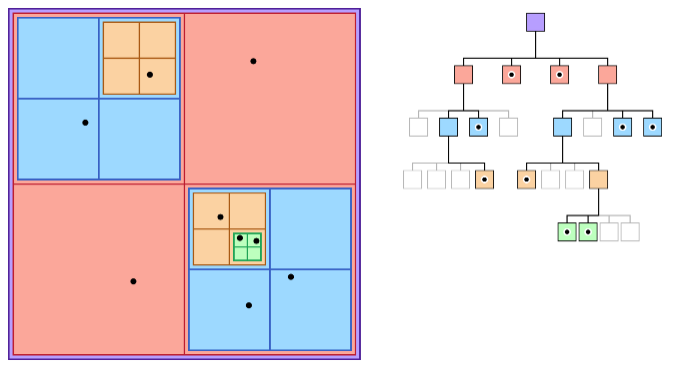

# ORB SLAM Source Code Review

## Start

Run by
```bash
rosrun ORB_SLAM2 RGBD <path_to_vocabulary> <path_to_settings>
```

### The `main()`

ORB-SLAM has config for mono, rgb-d and stereo (dual cameras).
Here only take `ORB_SLAM2::System::MONOCULAR` as an example.

First, launch ORB-SLM with the specified camera model `ORB_SLAM2::System SLAM(argv[1],argv[2],ORB_SLAM2::System::MONOCULAR,true);`.
The `ORB_SLAM2::System` launches the Local Mapping, Loop Closing and Viewer threads.

Then, construct `ImageGrabber igb(&SLAM);`.
The `ImageGrabber::GrabImage(...)` serves as the callback function for source raw camera images subscribed to the topic `"/camera/image_raw"`.

```cpp
int main(int argc, char **argv)
{
    ros::init(argc, argv, "Mono");
    ros::start();

    if(argc != 3)
    {
        cerr << endl << "Usage: rosrun ORB_SLAM2 Mono path_to_vocabulary path_to_settings" << endl;        
        ros::shutdown();
        return 1;
    }    

    // Create SLAM system. It initializes all system threads and gets ready to process frames.
    ORB_SLAM2::System SLAM(argv[1],argv[2],ORB_SLAM2::System::MONOCULAR,true);

    ImageGrabber igb(&SLAM);

    ros::NodeHandle nodeHandler;
    ros::Subscriber sub = nodeHandler.subscribe("/camera/image_raw", 1, &ImageGrabber::GrabImage,&igb);

    ros::spin();

    // Stop all threads
    SLAM.Shutdown();

    // Save camera trajectory
    SLAM.SaveKeyFrameTrajectoryTUM("KeyFrameTrajectory.txt");

    ros::shutdown();

    return 0;
}
```
where `ImageGrabber` is defined as below.

Inside `ImageGrabber::GrabImage(...)`, `mpSLAM->TrackMonocular(...)` reads the raw image data and performs feature tracking.

```cpp
class ImageGrabber
{
public:
    ImageGrabber(ORB_SLAM2::System* pSLAM):mpSLAM(pSLAM){}

    void GrabImage(const sensor_msgs::ImageConstPtr& msg);

    ORB_SLAM2::System* mpSLAM;
};

void ImageGrabber::GrabImage(const sensor_msgs::ImageConstPtr& msg)
{
    // Copy the ros image message to cv::Mat.
    cv_bridge::CvImageConstPtr cv_ptr;
    try
    {
        cv_ptr = cv_bridge::toCvShare(msg);
    }
    catch (cv_bridge::Exception& e)
    {
        ROS_ERROR("cv_bridge exception: %s", e.what());
        return;
    }

    mpSLAM->TrackMonocular(cv_ptr->image,cv_ptr->header.stamp.toSec());
}
```

### The System `ORB_SLAM2::System`

`ORB_SLAM2::System` first loads ORB database, then spawns three threads:
* `new Tracking(this, mpVocabulary, mpFrameDrawer, mpMapDrawer, mpMap, mpKeyFrameDatabase, strSettingsFile, mSensor);`
* `mpLocalMapper = new LocalMapping(mpMap, mSensor==MONOCULAR);`
* `mpLoopCloser = new LoopClosing(mpMap, mpKeyFrameDatabase, mpVocabulary, mSensor!=MONOCULAR);`

Optionally, visual output (e.g., markers) can be config.

```cpp
namespace ORB_SLAM2
{

System::System(const string &strVocFile, const string &strSettingsFile, const eSensor sensor,
               const bool bUseViewer):mSensor(sensor), mpViewer(static_cast<Viewer*>(NULL)), mbReset(false),mbActivateLocalizationMode(false),
        mbDeactivateLocalizationMode(false)
{
    ... // some welcome msg and setting config

    mpVocabulary = new ORBVocabulary();
    bool bVocLoad = mpVocabulary->loadFromTextFile(strVocFile);
    if(!bVocLoad)
    {
        cerr << "Wrong path to vocabulary. " << endl;
        cerr << "Falied to open at: " << strVocFile << endl;
        exit(-1);
    }
    cout << "Vocabulary loaded!" << endl << endl;

    //Create KeyFrame Database
    mpKeyFrameDatabase = new KeyFrameDatabase(*mpVocabulary);

    //Create the Map
    mpMap = new Map();

    //Create Drawers. These are used by the Viewer
    mpFrameDrawer = new FrameDrawer(mpMap);
    mpMapDrawer = new MapDrawer(mpMap, strSettingsFile);

    //Initialize the Tracking thread
    //(it will live in the main thread of execution, the one that called this constructor)
    mpTracker = new Tracking(this, mpVocabulary, mpFrameDrawer, mpMapDrawer,
                             mpMap, mpKeyFrameDatabase, strSettingsFile, mSensor);

    //Initialize the Local Mapping thread and launch
    mpLocalMapper = new LocalMapping(mpMap, mSensor==MONOCULAR);
    mptLocalMapping = new thread(&ORB_SLAM2::LocalMapping::Run,mpLocalMapper);

    //Initialize the Loop Closing thread and launch
    mpLoopCloser = new LoopClosing(mpMap, mpKeyFrameDatabase, mpVocabulary, mSensor!=MONOCULAR);
    mptLoopClosing = new thread(&ORB_SLAM2::LoopClosing::Run, mpLoopCloser);

    //Initialize the Viewer thread and launch
    if(bUseViewer)
    {
        mpViewer = new Viewer(this, mpFrameDrawer,mpMapDrawer,mpTracker,strSettingsFile);
        mptViewer = new thread(&Viewer::Run, mpViewer);
        mpTracker->SetViewer(mpViewer);
    }

    //Set pointers between threads
    mpTracker->SetLocalMapper(mpLocalMapper);
    mpTracker->SetLoopClosing(mpLoopCloser);

    mpLocalMapper->SetTracker(mpTracker);
    mpLocalMapper->SetLoopCloser(mpLoopCloser);

    mpLoopCloser->SetTracker(mpTracker);
    mpLoopCloser->SetLocalMapper(mpLocalMapper);
}

}
```

## ORB Extractor

Some `ORBextractor` init arguments are
* `nfeatures` number of features
* `scaleFactor` pyramid scaling factor
* `nlevel` number of pyramid level
* `iniThFAST` FAST initial threshold
* `minThFAST` FAST minimal threshold

Images are scaled by pyramid: `nlevel=8` levels and `scaleFactor=1.2` for each level increment.

The `ORBextractor` constructor inits the pyramid scaling with the above parameters.

```cpp
ORBextractor::ORBextractor(int _nfeatures, float _scaleFactor, int _nlevels,
         int _iniThFAST, int _minThFAST):
    nfeatures(_nfeatures), scaleFactor(_scaleFactor), nlevels(_nlevels),
    iniThFAST(_iniThFAST), minThFAST(_minThFAST)
{
    mvScaleFactor.resize(nlevels);
    mvLevelSigma2.resize(nlevels);
    mvScaleFactor[0]=1.0f;
    mvLevelSigma2[0]=1.0f;
    for(int i=1; i<nlevels; i++)
    {
        // 1.2 = 1 * 1.2; 1.44 = 1.2 * 1.2; 1.728 = 1.44 * 1.2 ...
        mvScaleFactor[i]=mvScaleFactor[i-1]*scaleFactor;
        // 1.44 = 1.2 * 1.2; 2.0736 = 1.44 * 1.44; 4.2998 = 2.0736 * 2.0736 ...
        mvLevelSigma2[i]=mvScaleFactor[i]*mvScaleFactor[i];
    }

    mvInvScaleFactor.resize(nlevels);
    mvInvLevelSigma2.resize(nlevels);
    for(int i=0; i<nlevels; i++)
    {
        // 1 = 1/1; 0.833 = 1/1.2; 0.694 = 1/1.44 ...
        mvInvScaleFactor[i]=1.0f/mvScaleFactor[i];
        // 0.694 = 1/1.44; 0.482 = 1/2.0736 ...
        mvInvLevelSigma2[i]=1.0f/mvLevelSigma2[i];
    }

    mvImagePyramid.resize(nlevels);

    mnFeaturesPerLevel.resize(nlevels);
    float factor = 1.0f / scaleFactor; // 0.833 = 1/1.2
    // 1000 * (1 - 0.833) / (1 - 0.833^8)
    float nDesiredFeaturesPerScale = nfeatures*(1 - factor)/(1 - (float)pow((double)factor, (double)nlevels));

    int sumFeatures = 0;
    for( int level = 0; level < nlevels-1; level++ )
    {
        mnFeaturesPerLevel[level] = cvRound(nDesiredFeaturesPerScale);
        sumFeatures += mnFeaturesPerLevel[level];
        nDesiredFeaturesPerScale *= factor;
    }
    mnFeaturesPerLevel[nlevels-1] = std::max(nfeatures - sumFeatures, 0);

    const int npoints = 512;
    const Point* pattern0 = (const Point*)bit_pattern_31_;
    std::copy(pattern0, pattern0 + npoints, std::back_inserter(pattern));

    // This is for orientation
    // pre-compute the end of a row in a circular patch
    // HALF_PATCH_SIZE = 15
    umax.resize(HALF_PATCH_SIZE + 1);

    // vmax = 11 = 15 * 0.707 + 1
    // vmin = 11 = 15 * 0.707
    int v, v0, vmax = cvFloor(HALF_PATCH_SIZE * sqrt(2.f) / 2 + 1);
    int vmin = cvCeil(HALF_PATCH_SIZE * sqrt(2.f) / 2);
    const double hp2 = HALF_PATCH_SIZE*HALF_PATCH_SIZE; // hp2 = 225 = 15 * 15
    for (v = 0; v <= vmax; ++v)
        umax[v] = cvRound(sqrt(hp2 - v * v)); // 225 - 0; 225 - 1; 225 -4; 225 - 16 ...

    // Make sure we are symmetric
    for (v = HALF_PATCH_SIZE, v0 = 0; v >= vmin; --v)
    {
        while (umax[v0] == umax[v0 + 1])
            ++v0;
        umax[v] = v0;
        ++v0;
    }
}
```

### FAST Feature Orientation

For a radius of $15$ patch, there is
$$
\begin{align*}
m_{10} &= 
\sum^{15}_{u=-15} \sum^{15}_{v=-15} u^1 v^0 i(u,v)
\\ &=
\sum^{15}_{u=-15} \sum^{15}_{v=-15} u \space i(u,v)
\end{align*}
\qquad
\begin{align*}
m_{01} &= 
\sum^{15}_{u=-15} \sum^{15}_{v=-15} u^0 v^1 i(u,v)
\\ &=
\sum^{15}_{u=-15} \sum^{15}_{v=-15} v \space i(u,v)
\end{align*}
$$

The orientation is computed as
$$
\theta = 
\arctan2(m_{01}, m_{10})
$$

Given the above FAST orientation formula, the code implementation below:
* compute within the FAST radius `HALF_PATCH_SIZE`
* Take the center FAST feature `const uchar* center = &image.at<uchar> (cvRound(pt.y), cvRound(pt.x));`
* $m_{10}$ and $m_{01}$ are computed according to the formula
* return `fastAtan2((float)m_01, (float)m_10);` ($\theta = \arctan2(m_{01}, m_{10})$)

```cpp
namespace ORB_SLAM2
{

const int PATCH_SIZE = 31;
const int HALF_PATCH_SIZE = 15;
const int EDGE_THRESHOLD = 19;


static float IC_Angle(const Mat& image, Point2f pt,  const vector<int> & u_max)
{
    int m_01 = 0, m_10 = 0;

    const uchar* center = &image.at<uchar> (cvRound(pt.y), cvRound(pt.x));

    // Treat the center line differently, v=0
    for (int u = -HALF_PATCH_SIZE; u <= HALF_PATCH_SIZE; ++u)
        m_10 += u * center[u];

    // Go line by line in the circuI853lar patch
    int step = (int)image.step1();
    for (int v = 1; v <= HALF_PATCH_SIZE; ++v)
    {
        // Proceed over the two lines
        int v_sum = 0;
        int d = u_max[v];
        for (int u = -d; u <= d; ++u)
        {
            int val_plus = center[u + v*step], val_minus = center[u - v*step];
            v_sum += (val_plus - val_minus);
            m_10 += u * (val_plus + val_minus);
        }
        m_01 += v * v_sum;
    }

    return fastAtan2((float)m_01, (float)m_10);
}
}
```

The `computeOrientation(...)` computes keypoint's angle by the `IC_Angle(...)`.
```cpp
static void computeOrientation(const Mat& image, vector<KeyPoint>& keypoints, const vector<int>& umax)
{
    for (vector<KeyPoint>::iterator keypoint = keypoints.begin(),
         keypointEnd = keypoints.end(); keypoint != keypointEnd; ++keypoint)
    {
        keypoint->angle = IC_Angle(image, keypoint->pt, umax);
    }
}
```

### ORB Feature Pair Test

A total of $256=32 \times 8$ tests are conducted as below.
Since each pair test result is of one bit (either `true`/`false`, or $1$/$0$), every time, together $8$-bit results are put into one `uchar` such as `desc[i] = (uchar)val;`.

$$
t(p,q) = 
\left\{ 
    \begin{matrix}
        1 & \quad p > q \\
        0 & \quad p \le q \\
    \end{matrix}
\right.
$$

```cpp
static void computeOrbDescriptor(const KeyPoint& kpt,
                                 const Mat& img, const Point* pattern,
                                 uchar* desc)
{
    float angle = (float)kpt.angle*factorPI;
    float a = (float)cos(angle), b = (float)sin(angle);

    const uchar* center = &img.at<uchar>(cvRound(kpt.pt.y), cvRound(kpt.pt.x));
    const int step = (int)img.step;

    #define GET_VALUE(idx) \
        center[cvRound(pattern[idx].x*b + pattern[idx].y*a)*step + \
               cvRound(pattern[idx].x*a - pattern[idx].y*b)]


    for (int i = 0; i < 32; ++i, pattern += 16)
    {
        int t0, t1, val;
        t0 = GET_VALUE(0); t1 = GET_VALUE(1);
        val = t0 < t1;
        t0 = GET_VALUE(2); t1 = GET_VALUE(3);
        val |= (t0 < t1) << 1;
        t0 = GET_VALUE(4); t1 = GET_VALUE(5);
        val |= (t0 < t1) << 2;
        t0 = GET_VALUE(6); t1 = GET_VALUE(7);
        val |= (t0 < t1) << 3;
        t0 = GET_VALUE(8); t1 = GET_VALUE(9);
        val |= (t0 < t1) << 4;
        t0 = GET_VALUE(10); t1 = GET_VALUE(11);
        val |= (t0 < t1) << 5;
        t0 = GET_VALUE(12); t1 = GET_VALUE(13);
        val |= (t0 < t1) << 6;
        t0 = GET_VALUE(14); t1 = GET_VALUE(15);
        val |= (t0 < t1) << 7;

        desc[i] = (uchar)val;
    }

    #undef GET_VALUE
}
```

### Octree For ORB Feature

`ExtractorNode` defines the octree (in 2d it is named quadtree) space for ORB feature storage.

<div style="display: flex; justify-content: center;">
      
</div>
</br>

First, define four boundary params `cv::Point2i UL, UR, BL, BR;` for Upper Left, Upper Right, Bottom Left, Bottom Right.
Then, compute the half space `halfX` and `halfY`.

Every node divide produces four subspaces `n1, n2, n3, n4`.
Keypoints are associated to the four nodes according to their coordinates on the image by `ni.vKeys.push_back(kp);`

`ExtractorNode::DivideNode(...)` is called in `ORBextractor::DistributeOctTree(...)` to perform space division.

```cpp
class ExtractorNode
{
public:
    ExtractorNode():bNoMore(false){}

    void DivideNode(ExtractorNode &n1, ExtractorNode &n2, ExtractorNode &n3, ExtractorNode &n4);

    std::vector<cv::KeyPoint> vKeys;
    cv::Point2i UL, UR, BL, BR;
    std::list<ExtractorNode>::iterator lit;
    bool bNoMore;
};

void ExtractorNode::DivideNode(ExtractorNode &n1, ExtractorNode &n2, ExtractorNode &n3, ExtractorNode &n4)
{
    const int halfX = ceil(static_cast<float>(UR.x-UL.x)/2);
    const int halfY = ceil(static_cast<float>(BR.y-UL.y)/2);

    //Define boundaries of children
    n1.UL = UL;
    n1.UR = cv::Point2i(UL.x+halfX,UL.y);
    n1.BL = cv::Point2i(UL.x,UL.y+halfY);
    n1.BR = cv::Point2i(UL.x+halfX,UL.y+halfY);
    n1.vKeys.reserve(vKeys.size());

    n2.UL = n1.UR;
    n2.UR = UR;
    n2.BL = n1.BR;
    n2.BR = cv::Point2i(UR.x,UL.y+halfY);
    n2.vKeys.reserve(vKeys.size());

    n3.UL = n1.BL;
    n3.UR = n1.BR;
    n3.BL = BL;
    n3.BR = cv::Point2i(n1.BR.x,BL.y);
    n3.vKeys.reserve(vKeys.size());

    n4.UL = n3.UR;
    n4.UR = n2.BR;
    n4.BL = n3.BR;
    n4.BR = BR;
    n4.vKeys.reserve(vKeys.size());

    //Associate points to children
    for(size_t i=0;i<vKeys.size();i++)
    {
        const cv::KeyPoint &kp = vKeys[i];
        if(kp.pt.x<n1.UR.x)
        {
            if(kp.pt.y<n1.BR.y)
                n1.vKeys.push_back(kp);
            else
                n3.vKeys.push_back(kp);
        }
        else if(kp.pt.y<n1.BR.y)
            n2.vKeys.push_back(kp);
        else
            n4.vKeys.push_back(kp);
    }

    if(n1.vKeys.size()==1)
        n1.bNoMore = true;
    if(n2.vKeys.size()==1)
        n2.bNoMore = true;
    if(n3.vKeys.size()==1)
        n3.bNoMore = true;
    if(n4.vKeys.size()==1)
        n4.bNoMore = true;
}
```

`DistributeOctTree(...)` constructs the octant/quad tree for ORB feature storage that, keep dividing space if the subspace has more than one keypoints.

For any node that has more than one keypoint `ni.vKeys.size()>1`, should push this node to the front `lNodes.push_front(ni);   `, then get this node's iterator pointing to its parent's front node `lNodes.front().lit = lNodes.begin();`.
Meanwhile, get this node stored in a vector to be divided later in the next level `vSizeAndPointerToNode.push_back(make_pair(n1.vKeys.size(),&lNodes.front()));`
At the end, start dividing the next node by `lit=lNodes.erase(lit);`.

In the next level division, do `vPrevSizeAndPointerToNode[j].second->DivideNode(n1,n2,n3,n4);`, and get the child nodes' front iterator pointing to this node, same as how this node is pointed to its parent node's.

Repeat the above process until each node only contains one keypoint, and the node should be arranged in the tree layout as below.

<div style="display: flex; justify-content: center;">
      
</div>
</br>

```cpp
vector<cv::KeyPoint> ORBextractor::DistributeOctTree(const vector<cv::KeyPoint>& vToDistributeKeys, const int &minX,
                                       const int &maxX, const int &minY, const int &maxY, const int &N, const int &level)
{
    // Compute how many initial nodes   
    const int nIni = round(static_cast<float>(maxX-minX)/(maxY-minY));

    const float hX = static_cast<float>(maxX-minX)/nIni;

    list<ExtractorNode> lNodes;

    vector<ExtractorNode*> vpIniNodes;
    vpIniNodes.resize(nIni);

    for(int i=0; i<nIni; i++)
    {
        ExtractorNode ni;
        ni.UL = cv::Point2i(hX*static_cast<float>(i),0);
        ni.UR = cv::Point2i(hX*static_cast<float>(i+1),0);
        ni.BL = cv::Point2i(ni.UL.x,maxY-minY);
        ni.BR = cv::Point2i(ni.UR.x,maxY-minY);
        ni.vKeys.reserve(vToDistributeKeys.size());

        lNodes.push_back(ni);
        vpIniNodes[i] = &lNodes.back();
    }

    //Associate points to children
    for(size_t i=0;i<vToDistributeKeys.size();i++)
    {
        const cv::KeyPoint &kp = vToDistributeKeys[i];
        vpIniNodes[kp.pt.x/hX]->vKeys.push_back(kp);
    }

    ...

    vector<pair<int,ExtractorNode*> > vSizeAndPointerToNode;
    vSizeAndPointerToNode.reserve(lNodes.size()*4);

    while(!bFinish)
    {
        iteration++;

        int prevSize = lNodes.size();

        lit = lNodes.begin();

        int nToExpand = 0;

        vSizeAndPointerToNode.clear();

        while(lit!=lNodes.end())
        {
            if(lit->bNoMore)
            {
                // If node only contains one point do not subdivide and continue
                lit++;
                continue;
            }
            else
            {
                // If more than one point, subdivide
                ExtractorNode n1,n2,n3,n4;
                lit->DivideNode(n1,n2,n3,n4);

                // Add children if they contain points
                if(n1.vKeys.size()>0)
                {
                    lNodes.push_front(n1);                    
                    if(n1.vKeys.size()>1)
                    {
                        nToExpand++;
                        vSizeAndPointerToNode.push_back(make_pair(n1.vKeys.size(),&lNodes.front()));
                        lNodes.front().lit = lNodes.begin();
                    }
                }
                ... // same as to `n1` for the other n2, n3 and n4

                // erase element by position
                // return an iterator pointing to the element that followed the last element erased by the function call.
                lit=lNodes.erase(lit);
                continue;
            }
        }     
        // Finish if there are more nodes than required features
        // or all nodes contain just one point
        if((int)lNodes.size()>=N || (int)lNodes.size()==prevSize)
        {
            bFinish = true;
        }
        else if(((int)lNodes.size()+nToExpand*3)>N)
        {
            while(!bFinish)
            {
                prevSize = lNodes.size();
                vector<pair<int,ExtractorNode*> > vPrevSizeAndPointerToNode = vSizeAndPointerToNode;
                vSizeAndPointerToNode.clear();

                sort(vPrevSizeAndPointerToNode.begin(),vPrevSizeAndPointerToNode.end());
                for(int j=vPrevSizeAndPointerToNode.size()-1;j>=0;j--)
                {
                    ExtractorNode n1,n2,n3,n4;
                    vPrevSizeAndPointerToNode[j].second->DivideNode(n1,n2,n3,n4);

                    // Add children if they contain points
                    if(n1.vKeys.size()>0)
                    {
                        lNodes.push_front(n1);
                        if(n1.vKeys.size()>1)
                        {
                            vSizeAndPointerToNode.push_back(make_pair(n1.vKeys.size(),&lNodes.front()));
                            lNodes.front().lit = lNodes.begin();
                        }
                    }
                    ... // same as to `n1` for the other n2, n3 and n4

                    lNodes.erase(vPrevSizeAndPointerToNode[j].second->lit);

                    if((int)lNodes.size()>=N)
                        break;
                }

                if((int)lNodes.size()>=N || (int)lNodes.size()==prevSize)
                    bFinish = true;

            }
        }
    }  

    // Retain the best point in each node
    vector<cv::KeyPoint> vResultKeys;
    vResultKeys.reserve(nfeatures);
    for(list<ExtractorNode>::iterator lit=lNodes.begin(); lit!=lNodes.end(); lit++)
    {
        vector<cv::KeyPoint> &vNodeKeys = lit->vKeys;
        cv::KeyPoint* pKP = &vNodeKeys[0];
        float maxResponse = pKP->response;

        for(size_t k=1;k<vNodeKeys.size();k++)
        {
            if(vNodeKeys[k].response>maxResponse)
            {
                pKP = &vNodeKeys[k];
                maxResponse = vNodeKeys[k].response;
            }
        }

        vResultKeys.push_back(*pKP);
    }

    return vResultKeys;
}
```

### ORB Feature Computation

For an input image `cv::InputArray image`, the function `ORBextractor::operator()(...)` computes for `std::vector<cv::KeyPoint>& keypoints` (initial FAST points) and `cv::OutputArray descriptors` (BRIEF-compared points).

1. `ComputePyramid(image);` scaling image
2. `ComputeKeyPointsOctTree(allKeypoints);` finds FAST features stored in `allKeypoints`
3. `GaussianBlur(workingMat, workingMat, Size(7, 7), 2, 2, BORDER_REFLECT_101);` computes Gaussian blur
4. `computeDescriptors(workingMat, keypoints, desc, pattern);` computes BRIEF features against the `pattern`.

```cpp
// Compute the ORB features and descriptors on an image.
// ORB are dispersed on the image using an octree.
// Mask is ignored in the current implementation.
void ORBextractor::operator()( cv::InputArray image, cv::InputArray mask,
  std::vector<cv::KeyPoint>& keypoints,
  cv::OutputArray descriptors) {

    if(_image.empty())
        return;

    Mat image = _image.getMat();
    assert(image.type() == CV_8UC1 );

    // Pre-compute the scale pyramid
    ComputePyramid(image);

    vector < vector<KeyPoint> > allKeypoints;
    ComputeKeyPointsOctTree(allKeypoints);
    //ComputeKeyPointsOld(allKeypoints);

    Mat descriptors;

    int nkeypoints = 0;
    for (int level = 0; level < nlevels; ++level)
        nkeypoints += (int)allKeypoints[level].size();
    if( nkeypoints == 0 )
        _descriptors.release();
    else
    {
        _descriptors.create(nkeypoints, 32, CV_8U);
        descriptors = _descriptors.getMat();
    }

    _keypoints.clear();
    _keypoints.reserve(nkeypoints);

    int offset = 0;
    for (int level = 0; level < nlevels; ++level)
    {
        vector<KeyPoint>& keypoints = allKeypoints[level];
        int nkeypointsLevel = (int)keypoints.size();

        if(nkeypointsLevel==0)
            continue;

        // preprocess the resized image
        Mat workingMat = mvImagePyramid[level].clone();
        GaussianBlur(workingMat, workingMat, Size(7, 7), 2, 2, BORDER_REFLECT_101);

        // Compute the descriptors
        Mat desc = descriptors.rowRange(offset, offset + nkeypointsLevel);
        computeDescriptors(workingMat, keypoints, desc, pattern);

        offset += nkeypointsLevel;

        // Scale keypoint coordinates
        if (level != 0)
        {
            float scale = mvScaleFactor[level]; //getScale(level, firstLevel, scaleFactor);
            for (vector<KeyPoint>::iterator keypoint = keypoints.begin(),
                 keypointEnd = keypoints.end(); keypoint != keypointEnd; ++keypoint)
                keypoint->pt *= scale;
        }
        // And add the keypoints to the output
        _keypoints.insert(_keypoints.end(), keypoints.begin(), keypoints.end());
    }
}
```

`ComputePyramid(...)` simply resizes the input image.

```cpp
void ORBextractor::ComputePyramid(cv::Mat image)
{
    for (int level = 0; level < nlevels; ++level)
    {
        float scale = mvInvScaleFactor[level];
        Size sz(cvRound((float)image.cols*scale), cvRound((float)image.rows*scale));
        Size wholeSize(sz.width + EDGE_THRESHOLD*2, sz.height + EDGE_THRESHOLD*2);
        Mat temp(wholeSize, image.type()), masktemp;
        mvImagePyramid[level] = temp(Rect(EDGE_THRESHOLD, EDGE_THRESHOLD, sz.width, sz.height));

        // Compute the resized image
        if( level != 0 )
        {
            resize(mvImagePyramid[level-1], mvImagePyramid[level], sz, 0, 0, INTER_LINEAR);

            copyMakeBorder(mvImagePyramid[level], temp, EDGE_THRESHOLD, EDGE_THRESHOLD, EDGE_THRESHOLD, EDGE_THRESHOLD,
                           BORDER_REFLECT_101+BORDER_ISOLATED);            
        }
        else
        {
            copyMakeBorder(image, temp, EDGE_THRESHOLD, EDGE_THRESHOLD, EDGE_THRESHOLD, EDGE_THRESHOLD,
                           BORDER_REFLECT_101);            
        }
    }

}
```

`ComputeKeyPointsOctTree(...)` takes each level of the previously computed pyramid, by a window size of `W = 30;`, finds the FAST features in each window.
Then, store the found FAST features into a quadtree by `DistributeOctTree(...)`.
Finally, the keypoints' orientations are computed `computeOrientation(...)`.

```cpp
void ORBextractor::ComputeKeyPointsOctTree(vector<vector<KeyPoint> >& allKeypoints)
{
    allKeypoints.resize(nlevels);

    const float W = 30;

    for (int level = 0; level < nlevels; ++level)
    {
        const int minBorderX = EDGE_THRESHOLD-3;
        const int minBorderY = minBorderX;
        const int maxBorderX = mvImagePyramid[level].cols-EDGE_THRESHOLD+3;
        const int maxBorderY = mvImagePyramid[level].rows-EDGE_THRESHOLD+3;

        vector<cv::KeyPoint> vToDistributeKeys;
        vToDistributeKeys.reserve(nfeatures*10);

        const float width = (maxBorderX-minBorderX);
        const float height = (maxBorderY-minBorderY);

        const int nCols = width/W;
        const int nRows = height/W;
        const int wCell = ceil(width/nCols);
        const int hCell = ceil(height/nRows);

        for(int i=0; i<nRows; i++)
        {
            const float iniY =minBorderY+i*hCell;
            float maxY = iniY+hCell+6;

            if(iniY>=maxBorderY-3)
                continue;
            if(maxY>maxBorderY)
                maxY = maxBorderY;

            for(int j=0; j<nCols; j++)
            {
                ... 

                vector<cv::KeyPoint> vKeysCell;
                FAST(mvImagePyramid[level].rowRange(iniY,maxY).colRange(iniX,maxX),
                     vKeysCell,iniThFAST,true);
            }
        }

        vector<KeyPoint> & keypoints = allKeypoints[level];
        keypoints.reserve(nfeatures);

        keypoints = DistributeOctTree(vToDistributeKeys, minBorderX, maxBorderX,
                                      minBorderY, maxBorderY,mnFeaturesPerLevel[level], level);

        const int scaledPatchSize = PATCH_SIZE*mvScaleFactor[level];

        // Add border to coordinates and scale information
        const int nkps = keypoints.size();
        for(int i=0; i<nkps ; i++)
        {
            keypoints[i].pt.x+=minBorderX;
            keypoints[i].pt.y+=minBorderY;
            keypoints[i].octave=level;
            keypoints[i].size = scaledPatchSize;
        }
    }

    // compute orientations
    for (int level = 0; level < nlevels; ++level)
        computeOrientation(mvImagePyramid[level], allKeypoints[level], umax);
}
```

## Local Pose Graph Optimization

### `Optimizer::PoseOptimization(Frame *pFrame)`

For `const int N = pFrame->N;` match points, build a hyper graph for optimization

There is only one vertex: `g2o::VertexSE3Expmap * vSE3 = new g2o::VertexSE3Expmap();` (represent a pose at the frame `pFrame`) that has the initial guess `pFrame->mTcw` and will be optimized constrained by the edge `g2o::EdgeSE3ProjectXYZOnlyPose* e = new g2o::EdgeSE3ProjectXYZOnlyPose();`, whose residual is the 3d-to-2d projection error.
All match points' projection errors are added as edges to the one vertex/pose.

Then perform four times optimizations.
After each optimization, outliers are excluded; this is done by `e->setLevel(1);`.
`setLevel(int)` is useful when calling `optimizer.initializeOptimization(int )`, that if set `initializeOptimization(0)`, the optimizer will include all edges up to level `0` in the optimization, and edges set to `level >=1` will not be included.

The outlier selection criterion is a test if the sample sits outside the $95/%$ (by Chi-square distribution $\mathcal{X}^2$, $5.991$ and $7.815$ represent the $95\%$ of confidence for the $2$- and $3$-dimension sample space).
In other words, the criterion removes $5\%$ most significant error samples.

```cpp
int Optimizer::PoseOptimization(Frame *pFrame)
{
    g2o::SparseOptimizer optimizer;
    g2o::BlockSolver_6_3::LinearSolverType * linearSolver;

    linearSolver = new g2o::LinearSolverDense<g2o::BlockSolver_6_3::PoseMatrixType>();

    g2o::BlockSolver_6_3 * solver_ptr = new g2o::BlockSolver_6_3(linearSolver);

    g2o::OptimizationAlgorithmLevenberg* solver = new g2o::OptimizationAlgorithmLevenberg(solver_ptr);
    optimizer.setAlgorithm(solver);

    int nInitialCorrespondences=0;

    // Set Frame vertex
    g2o::VertexSE3Expmap * vSE3 = new g2o::VertexSE3Expmap();
    vSE3->setEstimate(Converter::toSE3Quat(pFrame->mTcw));
    vSE3->setId(0);
    vSE3->setFixed(false);
    optimizer.addVertex(vSE3);

    // Set MapPoint vertices
    const int N = pFrame->N;

    vector<g2o::EdgeSE3ProjectXYZOnlyPose*> vpEdgesMono;
    vector<size_t> vnIndexEdgeMono;
    vpEdgesMono.reserve(N);
    vnIndexEdgeMono.reserve(N);

    ... // some vars for stereo

    const float deltaMono = sqrt(5.991);
    const float deltaStereo = sqrt(7.815);


    {
    unique_lock<mutex> lock(MapPoint::mGlobalMutex);
    for(int i=0; i<N; i++) {
        MapPoint* pMP = pFrame->mvpMapPoints[i];
        if(pMP) {
            // Monocular observation
            if(pFrame->mvuRight[i]<0) {
                nInitialCorrespondences++;
                pFrame->mvbOutlier[i] = false;

                Eigen::Matrix<double,2,1> obs;
                const cv::KeyPoint &kpUn = pFrame->mvKeysUn[i];
                obs << kpUn.pt.x, kpUn.pt.y;

                g2o::EdgeSE3ProjectXYZOnlyPose* e = new g2o::EdgeSE3ProjectXYZOnlyPose();

                // `dynamic_cast` is used since `g2o::VertexSE3Expmap * vSE3` inherits from `g2o::OptimizableGraph::Vertex`
                e->setVertex(0, dynamic_cast<g2o::OptimizableGraph::Vertex*>(optimizer.vertex(0)));
                e->setMeasurement(obs);
                const float invSigma2 = pFrame->mvInvLevelSigma2[kpUn.octave];
                e->setInformation(Eigen::Matrix2d::Identity()*invSigma2);

                g2o::RobustKernelHuber* rk = new g2o::RobustKernelHuber;
                e->setRobustKernel(rk);
                rk->setDelta(deltaMono);

                e->fx = pFrame->fx;
                e->fy = pFrame->fy;
                e->cx = pFrame->cx;
                e->cy = pFrame->cy;
                cv::Mat Xw = pMP->GetWorldPos();
                e->Xw[0] = Xw.at<float>(0);
                e->Xw[1] = Xw.at<float>(1);
                e->Xw[2] = Xw.at<float>(2);

                optimizer.addEdge(e);

                vpEdgesMono.push_back(e);
                vnIndexEdgeMono.push_back(i);
            }
            else  // Stereo observation
            {
                ...
            }
        }
    }
    }

    if(nInitialCorrespondences<3)
        return 0;

    // We perform 4 optimizations, after each optimization we classify observation as inlier/outlier
    // At the next optimization, outliers are not included, but at the end they can be classified as inliers again.
    const float chi2Mono[4]={5.991,5.991,5.991,5.991};
    const float chi2Stereo[4]={7.815,7.815,7.815, 7.815};
    const int its[4]={10,10,10,10};    

    int nBad=0;
    for(size_t it=0; it<4; it++) {

        vSE3->setEstimate(Converter::toSE3Quat(pFrame->mTcw));
        optimizer.initializeOptimization(0);
        optimizer.optimize(its[it]);

        nBad=0;
        // for each edge/feature projection error
        for(size_t i=0, iend=vpEdgesMono.size(); i<iend; i++) {
            g2o::EdgeSE3ProjectXYZOnlyPose* e = vpEdgesMono[i];

            const size_t idx = vnIndexEdgeMono[i];

            if(pFrame->mvbOutlier[idx]) // err will not be computed if is outlier
            {
                e->computeError();
            }

            const float chi2 = e->chi2();

            if(chi2>chi2Mono[it]) {                
                pFrame->mvbOutlier[idx]=true;
                e->setLevel(1);
                nBad++;
            }
            else {
                pFrame->mvbOutlier[idx]=false;
                e->setLevel(0);
            }

            if(it==2)
                e->setRobustKernel(0);
        }

        // for stereo
        for(size_t i=0, iend=vpEdgesStereo.size(); i<iend; i++) {
            ...
        }

        if(optimizer.edges().size()<10)
            break;
    }    

    // Recover optimized pose and return number of inliers
    g2o::VertexSE3Expmap* vSE3_recov = static_cast<g2o::VertexSE3Expmap*>(optimizer.vertex(0));
    g2o::SE3Quat SE3quat_recov = vSE3_recov->estimate();
    cv::Mat pose = Converter::toCvMat(SE3quat_recov);
    pFrame->SetPose(pose);

    return nInitialCorrespondences-nBad;
}
```
where
* `setToOriginImpl()` inits `_estimate` as the init guess
* `oplusImpl(const double* update_)` performs optimization step $\bold{x}_{t+1}=\bold{x}_t \oplus \Delta\bold{x}_t$
* `computeError()` computes the residuals stored to `_error`
* `linearizeOplus()` computes the Jacobians
```cpp
class  VertexSE3Expmap : public BaseVertex<6, SE3Quat>{
public:
  EIGEN_MAKE_ALIGNED_OPERATOR_NEW

  VertexSE3Expmap();

  bool read(std::istream& is);

  bool write(std::ostream& os) const;

  virtual void setToOriginImpl() {
    _estimate = SE3Quat();
  }

  virtual void oplusImpl(const double* update_)  {
    Eigen::Map<const Vector6d> update(update_);
    setEstimate(SE3Quat::exp(update)*estimate());
  }
};

class  EdgeSE3ProjectXYZOnlyPose: public  BaseUnaryEdge<2, Vector2d, VertexSE3Expmap>{
public:
  EIGEN_MAKE_ALIGNED_OPERATOR_NEW

  EdgeSE3ProjectXYZOnlyPose(){}

  bool read(std::istream& is);

  bool write(std::ostream& os) const;

  void computeError()  {
    const VertexSE3Expmap* v1 = static_cast<const VertexSE3Expmap*>(_vertices[0]);
    Vector2d obs(_measurement);
    _error = obs-cam_project(v1->estimate().map(Xw));
  }

  bool isDepthPositive() {
    const VertexSE3Expmap* v1 = static_cast<const VertexSE3Expmap*>(_vertices[0]);
    return (v1->estimate().map(Xw))(2)>0.0;
  }


  virtual void linearizeOplus();

  Vector2d cam_project(const Vector3d & trans_xyz) const;

  Vector3d Xw;
  double fx, fy, cx, cy;
};

Vector2d EdgeSE3ProjectXYZOnlyPose::cam_project(const Vector3d & trans_xyz) const {
  Vector2d proj = project2d(trans_xyz);
  Vector2d res;
  res[0] = proj[0]*fx + cx;
  res[1] = proj[1]*fy + cy;
  return res;
}

double BaseEdge::chi2() const {
  return _error.dot(information()*_error);
}
```

## Monocular Mapping Initialization

`MonocularInitialization()` computes the relative transform pose between two/a few frames to triangulate an initial set of map points, 
ORB-SLAM proposes to compute in parallel two geometrical models: 
* a homography assuming a planar scene 
* a fundamental matrix assuming a non-planar scene.

The model selection task is done in `mpInitializer->Initialize(...)`.
Before model selection, should first find enough features to match between the initial few frames by `matcher.SearchForInitialization(...);`.
This function is repeated called until there are enough match points between some initial keyframes.

`Initializer mpInitializer` is repeatedly `new`ed and `delete`ed if `matcher.SearchForInitialization(...);` could not find enough match points. 

```cpp
void Tracking::MonocularInitialization()
{

    if(!mpInitializer)
    {
        // Set Reference Frame
        if(mCurrentFrame.mvKeys.size()>100)
        {
            mInitialFrame = Frame(mCurrentFrame);
            mLastFrame = Frame(mCurrentFrame);
            mvbPrevMatched.resize(mCurrentFrame.mvKeysUn.size());
            for(size_t i=0; i<mCurrentFrame.mvKeysUn.size(); i++)
                mvbPrevMatched[i]=mCurrentFrame.mvKeysUn[i].pt;

            if(mpInitializer)
                delete mpInitializer;

            mpInitializer =  new Initializer(mCurrentFrame,1.0,200);

            fill(mvIniMatches.begin(),mvIniMatches.end(),-1);

            return;
        }
    }
    else
    {
        // Try to initialize
        if((int)mCurrentFrame.mvKeys.size()<=100)
        {
            delete mpInitializer;
            mpInitializer = static_cast<Initializer*>(NULL);
            fill(mvIniMatches.begin(),mvIniMatches.end(),-1);
            return;
        }

        // Find correspondences
        ORBmatcher matcher(0.9,true);
        int nmatches = matcher.SearchForInitialization(mInitialFrame,mCurrentFrame,mvbPrevMatched,mvIniMatches,100);

        // Check if there are enough correspondences
        if(nmatches<100)
        {
            delete mpInitializer;
            mpInitializer = static_cast<Initializer*>(NULL);
            return;
        }

        cv::Mat Rcw; // Current Camera Rotation
        cv::Mat tcw; // Current Camera Translation
        vector<bool> vbTriangulated; // Triangulated Correspondences (mvIniMatches)

        if(mpInitializer->Initialize(mCurrentFrame, mvIniMatches, Rcw, tcw, mvIniP3D, vbTriangulated))
        {
            for(size_t i=0, iend=mvIniMatches.size(); i<iend;i++)
            {
                if(mvIniMatches[i]>=0 && !vbTriangulated[i])
                {
                    mvIniMatches[i]=-1;
                    nmatches--;
                }
            }

            // Set Frame Poses
            mInitialFrame.SetPose(cv::Mat::eye(4,4,CV_32F));
            cv::Mat Tcw = cv::Mat::eye(4,4,CV_32F);
            Rcw.copyTo(Tcw.rowRange(0,3).colRange(0,3));
            tcw.copyTo(Tcw.rowRange(0,3).col(3));
            mCurrentFrame.SetPose(Tcw);

            CreateInitialMapMonocular();
        }
    }
}
```

`Initializer::Initialize(...)` computes in parallel threads a homography ${H}_{cr}$ and a
fundamental matrix ${F}_{cr}$:
$$
\bold{x}_c = {H}_{cr} \bold{x}_r
\quad\quad
\bold{x}_c {F}_{cr} \bold{x}_r = 0
$$
where $\bold{x}_c$ and $\bold{x}_r$ are keypoints in two keyframes. 

Both ${H}_{cr}$ and ${F}_{cr}$ are computed via RANSAC *Eight-Point Algorithm* inside `ComputeH21(...)` and `ComputeF21(...)` that use the selected best $8$ points to perform SVD to find ${H}_{cr}$ and ${F}_{cr}$ .

```cpp
void Initializer::FindHomography(vector<bool> &vbMatchesInliers, float &score, cv::Mat &H21)
{
    ... // some variable inits

    // Perform all RANSAC iterations and save the solution with highest score
    for(int it=0; it<mMaxIterations; it++)
    {
        // Select a minimum set
        for(size_t j=0; j<8; j++)
        {
            int idx = mvSets[it][j];
            vPn1i[j] = vPn1[mvMatches12[idx].first];
            vPn2i[j] = vPn2[mvMatches12[idx].second];
        }

        cv::Mat Hn = ComputeH21(vPn1i,vPn2i);
        H21i = T2inv*Hn*T1;
        H12i = H21i.inv();

        currentScore = CheckHomography(H21i, H12i, vbCurrentInliers, mSigma);
        ... // get the best score
    }
}

void Initializer::FindFundamental(vector<bool> &vbMatchesInliers, float &score, cv::Mat &F21)
{   
    ... // some variable inits
 
    // Perform all RANSAC iterations and save the solution with highest score
    for(int it=0; it<mMaxIterations; it++)
    {
        // Select a minimum set
        for(int j=0; j<8; j++)
        {
            int idx = mvSets[it][j];
            vPn1i[j] = vPn1[mvMatches12[idx].first];
            vPn2i[j] = vPn2[mvMatches12[idx].second];
        }

        cv::Mat Fn = ComputeF21(vPn1i,vPn2i);
        F21i = T2t*Fn*T1;

        currentScore = CheckFundamental(F21i, vbCurrentInliers, mSigma);
        ... // get the best score
    }
}
```

Then, `Initializer::Initialize(...)` computeS a score $S_M$ for each model $M$ (either $M=F$ for non-planar model or $M=H$ for planar model)

$$
S_M = 
\sum_i \bigg(
\rho_M \big(
    d^2_{cr}(\bold{x}_{ri}, \bold{x}_{ci}) \big) +
\rho_M \big(
    d^2_{rc}(\bold{x}_{ri}, \bold{x}_{ci}) \big)
\bigg)
$$
where 
$$
\rho_M \big( d^2 \big) =
\left\{
    \begin{matrix}
        T_H - d^2 & \text{if } d^2 < T_M \\
        0 & \text{if } d^2 \ge T_M \\
    \end{matrix}
\right.
$$
where $d^2$ is the symmetric transfer error, $T_M$ is an outlier rejector based on $\mathcal{X}^2$ test. $T_H$ is the outlier rejector for the homography (planar) model.

If the scene is planar, nearly planar or there is low
parallax, it can be explained by a homography. Otherwise, it should be anon-planar scene.

In implementation, if $\frac{S_H}{S_H+S_F}>0.45$, select homography model, otherwise, select non-planar model.

Full bundle adjustment is applied across multiple frames to further refine the initial reconstruction if `if(RH>0.40)`. 

```cpp

bool Initializer::Initialize(const Frame &CurrentFrame, const vector<int> &vMatches12, cv::Mat &R21, cv::Mat &t21,
                             vector<cv::Point3f> &vP3D, vector<bool> &vbTriangulated)
{
    ... // some preparation work
        // assign random index to mvMatches12 so that it can be referenced in RANSAC

    // Launch threads to compute in parallel a fundamental matrix and a homography
    vector<bool> vbMatchesInliersH, vbMatchesInliersF;
    float SH, SF;
    cv::Mat H, F;

    thread threadH(&Initializer::FindHomography,this,ref(vbMatchesInliersH), ref(SH), ref(H));
    thread threadF(&Initializer::FindFundamental,this,ref(vbMatchesInliersF), ref(SF), ref(F));

    // Wait until both threads have finished
    threadH.join();
    threadF.join();

    // Compute ratio of scores
    float RH = SH/(SH+SF);

    // Try to reconstruct from homography or fundamental depending on the ratio (0.40-0.45)
    if(RH>0.40)
        // We recover 8 motion hypotheses using the method of Faugeras et al.
        // Motion and structure from motion in a piecewise planar environment.
        // International Journal of Pattern Recognition and Artificial Intelligence, 1988
        return ReconstructH(vbMatchesInliersH,H,mK,R21,t21,vP3D,vbTriangulated,1.0,50);
    else //if(pF_HF>0.6)
        return ReconstructF(vbMatchesInliersF,F,mK,R21,t21,vP3D,vbTriangulated,1.0,50);

    return false;
}
```

## $Sim(3)$ Optimization

$Sim(3)$ adds scale information for monocular vision.

Define a $3$-d point $\bold{p}=[X\quad Y\quad Z]^\top$ and its transformation result $\bold{p}'$
$$
\begin{align*}
    \bold{p}' &= \begin{bmatrix}
    s\bold{R} & \bold{t} \\
    \bold{0} & 1
    \end{bmatrix}
    \bold{p}
    \\ &=
    \begin{bmatrix}
    s\bold{R} & \bold{t} \\
    \bold{0} & 1
    \end{bmatrix}
    \begin{bmatrix}
        \bold{p} \\
        \bold{0}
    \end{bmatrix}
    \\ &=
    s\bold{R}\bold{p} + \bold{t}
\end{align*}
$$

Here gives the definition to $Sim(3)$ and $sim(3)$. $\bold{\zeta}$ is a 7-dimensional
vector that has the same elements as $se(3)$ plus one scaling factor $\sigma$.
$$
\begin{align*}
Sim(3) &= \bigg\{
    \bold{S} = \begin{bmatrix}
        s\bold{R} & \bold{t} \\
        \bold{0} & 1
    \end{bmatrix}
    \in \mathbb{R}^{4 \times 4}
\bigg\}
\\
sim(3) &= \bigg\{
    \bold{\zeta} = \begin{bmatrix}
        \bold{\rho} \\
        \bold{\phi} \\
        \sigma
    \end{bmatrix}
    \in \mathbb{R}^{7}
    , \quad
    \bold{\zeta}^\wedge =
    \begin{bmatrix}
        \sigma \bold{I}+\bold{\phi}^\wedge & \bold{\rho} \\
        \bold{0} & \bold{0}
    \end{bmatrix}
    \in \mathbb{R}^{4 \times 4}
\bigg\}
\end{align*}
$$

### Solve $Sim(3)$ by Closed-form Solution of Absolute Orientation Using Unit Quaternions


```cpp
cv::Mat Sim3Solver::iterate(int nIterations, bool &bNoMore, vector<bool> &vbInliers, int &nInliers)
{
    ...
    cv::Mat P3Dc1i(3,3,CV_32F);
    cv::Mat P3Dc2i(3,3,CV_32F);

    int nCurrentIterations = 0;
    while(mnIterations<mRansacMaxIts && nCurrentIterations<nIterations)
    {
        nCurrentIterations++;
        mnIterations++;

        vAvailableIndices = mvAllIndices;

        // Get min set of points
        for(short i = 0; i < 3; ++i)
        {
            int randi = DUtils::Random::RandomInt(0, vAvailableIndices.size()-1);

            int idx = vAvailableIndices[randi];

            mvX3Dc1[idx].copyTo(P3Dc1i.col(i));
            mvX3Dc2[idx].copyTo(P3Dc2i.col(i));

            vAvailableIndices[randi] = vAvailableIndices.back();
            vAvailableIndices.pop_back();
        }

        ComputeSim3(P3Dc1i,P3Dc2i);
        ...
    }
    ...
}

void Sim3Solver::ComputeSim3(cv::Mat &P1, cv::Mat &P2)
{
    // Custom implementation of:
    // Horn 1987, Closed-form solution of absolute orientataion using unit quaternions

    // Step 1: Centroid and relative coordinates

    cv::Mat Pr1(P1.size(),P1.type()); // Relative coordinates to centroid (set 1)
    cv::Mat Pr2(P2.size(),P2.type()); // Relative coordinates to centroid (set 2)
    cv::Mat O1(3,1,Pr1.type()); // Centroid of P1
    cv::Mat O2(3,1,Pr2.type()); // Centroid of P2

    ComputeCentroid(P1,Pr1,O1);
    ComputeCentroid(P2,Pr2,O2);

    // Step 2: Compute M matrix

    cv::Mat M = Pr2*Pr1.t();

    // Step 3: Compute N matrix

    double N11, N12, N13, N14, N22, N23, N24, N33, N34, N44;

    cv::Mat N(4,4,P1.type());

    N11 = M.at<float>(0,0)+M.at<float>(1,1)+M.at<float>(2,2);
    N12 = M.at<float>(1,2)-M.at<float>(2,1);
    N13 = M.at<float>(2,0)-M.at<float>(0,2);
    N14 = M.at<float>(0,1)-M.at<float>(1,0);
    N22 = M.at<float>(0,0)-M.at<float>(1,1)-M.at<float>(2,2);
    N23 = M.at<float>(0,1)+M.at<float>(1,0);
    N24 = M.at<float>(2,0)+M.at<float>(0,2);
    N33 = -M.at<float>(0,0)+M.at<float>(1,1)-M.at<float>(2,2);
    N34 = M.at<float>(1,2)+M.at<float>(2,1);
    N44 = -M.at<float>(0,0)-M.at<float>(1,1)+M.at<float>(2,2);

    N = (cv::Mat_<float>(4,4) << N11, N12, N13, N14,
                                 N12, N22, N23, N24,
                                 N13, N23, N33, N34,
                                 N14, N24, N34, N44);


    // Step 4: Eigenvector of the highest eigenvalue

    cv::Mat eval, evec;

    cv::eigen(N,eval,evec); //evec[0] is the quaternion of the desired rotation

    cv::Mat vec(1,3,evec.type());
    (evec.row(0).colRange(1,4)).copyTo(vec); //extract imaginary part of the quaternion (sin*axis)

    // Rotation angle. sin is the norm of the imaginary part, cos is the real part
    double ang=atan2(norm(vec),evec.at<float>(0,0));

    vec = 2*ang*vec/norm(vec); //Angle-axis representation. quaternion angle is the half

    mR12i.create(3,3,P1.type());

    cv::Rodrigues(vec,mR12i); // computes the rotation matrix from angle-axis

    // Step 5: Rotate set 2

    cv::Mat P3 = mR12i*Pr2;

    // Step 6: Scale

    if(!mbFixScale)
    {
        double nom = Pr1.dot(P3);
        cv::Mat aux_P3(P3.size(),P3.type());
        aux_P3=P3;
        cv::pow(P3,2,aux_P3);
        double den = 0;

        for(int i=0; i<aux_P3.rows; i++)
        {
            for(int j=0; j<aux_P3.cols; j++)
            {
                den+=aux_P3.at<float>(i,j);
            }
        }

        ms12i = nom/den;
    }
    else
        ms12i = 1.0f;

    // Step 7: Translation

    mt12i.create(1,3,P1.type());
    mt12i = O1 - ms12i*mR12i*O2;

    // Step 8: Transformation

    // Step 8.1 T12
    mT12i = cv::Mat::eye(4,4,P1.type());

    cv::Mat sR = ms12i*mR12i;

    sR.copyTo(mT12i.rowRange(0,3).colRange(0,3));
    mt12i.copyTo(mT12i.rowRange(0,3).col(3));

    // Step 8.2 T21

    mT21i = cv::Mat::eye(4,4,P1.type());

    cv::Mat sRinv = (1.0/ms12i)*mR12i.t();

    sRinv.copyTo(mT21i.rowRange(0,3).colRange(0,3));
    cv::Mat tinv = -sRinv*mt12i;
    tinv.copyTo(mT21i.rowRange(0,3).col(3));
}
```

`Optimizer::OptimizeSim3(...)` optimizes the transform $Sim(3)$ `g2o::Sim3 &g2oS12` between two keyframes `KeyFrame *pKF1` and `KeyFrame *pKF2` given the matching point observations `vector<MapPoint *> &vpMatches1`.

G2O has builtin `g2o::VertexSim3Expmap * vSim3` that takes care of the transform $SE(3)$ plus a scaling $s$, and it is added to optimizer `optimizer.addVertex(vSim3);`.
Two corresponding map points added to vertices: `vPoint1` init estimated by `cv::Mat P3D1c = R1w*P3D1w + t1w;` and `vPoint2` init estimated by `cv::Mat P3D2c = R2w*P3D2w + t2w;`, and they are set to fixed.

There are two edges/errors `g2o::EdgeSim3ProjectXYZ` defined per two corresponding map points: the `g2oS12` with `vPoint1`, and `g2oS12` with `vPoint2`. 
Each egde residual is of `Vector2d`.

The inliner checking is done via Chi-squared test `if(e12->chi2()>th2 || e21->chi2()>th2)`, where `th2=10` as implemented in `LoopClosing::ComputeSim3()` to remove about some $0.5\%$ outlier edges (for $2$-d Chi-squared distribution $\mathcal{X}^2_{1\%}=9.21$ and $\mathcal{X}^2_{0,5\%}=10.597$).

After having removed outliers, optimization is performed again to derive $Sim(3)$ stored in `g2oS12`. 

```cpp
int Optimizer::OptimizeSim3(KeyFrame *pKF1, KeyFrame *pKF2, vector<MapPoint *> &vpMatches1, g2o::Sim3 &g2oS12, const float th2, const bool bFixScale)
{
    g2o::SparseOptimizer optimizer;
    g2o::BlockSolverX::LinearSolverType * linearSolver;

    linearSolver = new g2o::LinearSolverDense<g2o::BlockSolverX::PoseMatrixType>();

    g2o::BlockSolverX * solver_ptr = new g2o::BlockSolverX(linearSolver);

    g2o::OptimizationAlgorithmLevenberg* solver = new g2o::OptimizationAlgorithmLevenberg(solver_ptr);
    optimizer.setAlgorithm(solver);

    // Calibration
    const cv::Mat &K1 = pKF1->mK;
    const cv::Mat &K2 = pKF2->mK;

    // Camera poses
    const cv::Mat R1w = pKF1->GetRotation();
    const cv::Mat t1w = pKF1->GetTranslation();
    const cv::Mat R2w = pKF2->GetRotation();
    const cv::Mat t2w = pKF2->GetTranslation();

    // Set Sim3 vertex
    g2o::VertexSim3Expmap * vSim3 = new g2o::VertexSim3Expmap();    
    vSim3->_fix_scale=bFixScale;
    vSim3->setEstimate(g2oS12);
    vSim3->setId(0);
    vSim3->setFixed(false);
    vSim3->_principle_point1[0] = K1.at<float>(0,2);
    vSim3->_principle_point1[1] = K1.at<float>(1,2);
    vSim3->_focal_length1[0] = K1.at<float>(0,0);
    vSim3->_focal_length1[1] = K1.at<float>(1,1);
    vSim3->_principle_point2[0] = K2.at<float>(0,2);
    vSim3->_principle_point2[1] = K2.at<float>(1,2);
    vSim3->_focal_length2[0] = K2.at<float>(0,0);
    vSim3->_focal_length2[1] = K2.at<float>(1,1);
    optimizer.addVertex(vSim3);

    // Set MapPoint vertices
    const int N = vpMatches1.size();
    const vector<MapPoint*> vpMapPoints1 = pKF1->GetMapPointMatches();
    vector<g2o::EdgeSim3ProjectXYZ*> vpEdges12;
    vector<g2o::EdgeInverseSim3ProjectXYZ*> vpEdges21;
    vector<size_t> vnIndexEdge;

    vnIndexEdge.reserve(2*N);
    vpEdges12.reserve(2*N);
    vpEdges21.reserve(2*N);

    const float deltaHuber = sqrt(th2);

    int nCorrespondences = 0;

    for(int i=0; i<N; i++)
    {
        if(!vpMatches1[i])
            continue;

        MapPoint* pMP1 = vpMapPoints1[i];
        MapPoint* pMP2 = vpMatches1[i];

        const int id1 = 2*i+1;
        const int id2 = 2*(i+1);

        const int i2 = pMP2->GetIndexInKeyFrame(pKF2);

        if(pMP1 && pMP2)
        {
            if(!pMP1->isBad() && !pMP2->isBad() && i2>=0)
            {
                g2o::VertexSBAPointXYZ* vPoint1 = new g2o::VertexSBAPointXYZ();
                cv::Mat P3D1w = pMP1->GetWorldPos();
                cv::Mat P3D1c = R1w*P3D1w + t1w;
                vPoint1->setEstimate(Converter::toVector3d(P3D1c));
                vPoint1->setId(id1);
                vPoint1->setFixed(true);
                optimizer.addVertex(vPoint1);

                g2o::VertexSBAPointXYZ* vPoint2 = new g2o::VertexSBAPointXYZ();
                cv::Mat P3D2w = pMP2->GetWorldPos();
                cv::Mat P3D2c = R2w*P3D2w + t2w;
                vPoint2->setEstimate(Converter::toVector3d(P3D2c));
                vPoint2->setId(id2);
                vPoint2->setFixed(true);
                optimizer.addVertex(vPoint2);
            }
            else
                continue;
        }
        else
            continue;

        nCorrespondences++;

        // Set edge x1 = S12*X2
        Eigen::Matrix<double,2,1> obs1;
        const cv::KeyPoint &kpUn1 = pKF1->mvKeysUn[i];
        obs1 << kpUn1.pt.x, kpUn1.pt.y;

        g2o::EdgeSim3ProjectXYZ* e12 = new g2o::EdgeSim3ProjectXYZ();
        e12->setVertex(0, dynamic_cast<g2o::OptimizableGraph::Vertex*>(optimizer.vertex(id2)));
        e12->setVertex(1, dynamic_cast<g2o::OptimizableGraph::Vertex*>(optimizer.vertex(0)));
        e12->setMeasurement(obs1);
        const float &invSigmaSquare1 = pKF1->mvInvLevelSigma2[kpUn1.octave];
        e12->setInformation(Eigen::Matrix2d::Identity()*invSigmaSquare1);

        g2o::RobustKernelHuber* rk1 = new g2o::RobustKernelHuber;
        e12->setRobustKernel(rk1);
        rk1->setDelta(deltaHuber);
        optimizer.addEdge(e12);

        // Set edge x2 = S21*X1
        Eigen::Matrix<double,2,1> obs2;
        const cv::KeyPoint &kpUn2 = pKF2->mvKeysUn[i2];
        obs2 << kpUn2.pt.x, kpUn2.pt.y;

        g2o::EdgeInverseSim3ProjectXYZ* e21 = new g2o::EdgeInverseSim3ProjectXYZ();

        e21->setVertex(0, dynamic_cast<g2o::OptimizableGraph::Vertex*>(optimizer.vertex(id1)));
        e21->setVertex(1, dynamic_cast<g2o::OptimizableGraph::Vertex*>(optimizer.vertex(0)));
        e21->setMeasurement(obs2);
        float invSigmaSquare2 = pKF2->mvInvLevelSigma2[kpUn2.octave];
        e21->setInformation(Eigen::Matrix2d::Identity()*invSigmaSquare2);

        g2o::RobustKernelHuber* rk2 = new g2o::RobustKernelHuber;
        e21->setRobustKernel(rk2);
        rk2->setDelta(deltaHuber);
        optimizer.addEdge(e21);

        vpEdges12.push_back(e12);
        vpEdges21.push_back(e21);
        vnIndexEdge.push_back(i);
    }

    // Optimize!
    optimizer.initializeOptimization();
    optimizer.optimize(5);

    // Check inliers
    int nBad=0;
    for(size_t i=0; i<vpEdges12.size();i++)
    {
        g2o::EdgeSim3ProjectXYZ* e12 = vpEdges12[i];
        g2o::EdgeInverseSim3ProjectXYZ* e21 = vpEdges21[i];
        if(!e12 || !e21)
            continue;

        if(e12->chi2()>th2 || e21->chi2()>th2)
        {
            size_t idx = vnIndexEdge[i];
            vpMatches1[idx]=static_cast<MapPoint*>(NULL);
            optimizer.removeEdge(e12);
            optimizer.removeEdge(e21);
            vpEdges12[i]=static_cast<g2o::EdgeSim3ProjectXYZ*>(NULL);
            vpEdges21[i]=static_cast<g2o::EdgeInverseSim3ProjectXYZ*>(NULL);
            nBad++;
        }
    }

    int nMoreIterations;
    if(nBad>0)
        nMoreIterations=10;
    else
        nMoreIterations=5;

    if(nCorrespondences-nBad<10)
        return 0;

    // Optimize again only with inliers

    optimizer.initializeOptimization();
    optimizer.optimize(nMoreIterations);

    int nIn = 0;
    for(size_t i=0; i<vpEdges12.size();i++)
    {
        g2o::EdgeSim3ProjectXYZ* e12 = vpEdges12[i];
        g2o::EdgeInverseSim3ProjectXYZ* e21 = vpEdges21[i];
        if(!e12 || !e21)
            continue;

        if(e12->chi2()>th2 || e21->chi2()>th2)
        {
            size_t idx = vnIndexEdge[i];
            vpMatches1[idx]=static_cast<MapPoint*>(NULL);
        }
        else
            nIn++;
    }

    // Recover optimized Sim3
    g2o::VertexSim3Expmap* vSim3_recov = static_cast<g2o::VertexSim3Expmap*>(optimizer.vertex(0));
    g2oS12= vSim3_recov->estimate();

    return nIn;
}
```
where
```cpp
class EdgeSim3ProjectXYZ : public  BaseBinaryEdge<2, Vector2d,  VertexSBAPointXYZ, VertexSim3Expmap>
{
  public:
    EIGEN_MAKE_ALIGNED_OPERATOR_NEW
    EdgeSim3ProjectXYZ();
    virtual bool read(std::istream& is);
    virtual bool write(std::ostream& os) const;

    void computeError()
    {
      const VertexSim3Expmap* v1 = static_cast<const VertexSim3Expmap*>(_vertices[1]);
      const VertexSBAPointXYZ* v2 = static_cast<const VertexSBAPointXYZ*>(_vertices[0]);

      Vector2d obs(_measurement);
      _error = obs-v1->cam_map1(project(v1->estimate().map(v2->estimate())));
    }

   // virtual void linearizeOplus();

};
```

## Feature Tracking

### Constructor

The `Tracking` constructor basically does the two jobs:
* Load camera params such as intrinsics and distortion coefficients
* Build `ORBextractor`

```cpp
// use by `Tracking`
mpTracker = new Tracking(this, mpVocabulary, mpFrameDrawer, mpMapDrawer,
                             mpMap, mpKeyFrameDatabase, strSettingsFile, mSensor);

// definition
Tracking::Tracking(System *pSys, ORBVocabulary* pVoc, FrameDrawer *pFrameDrawer, MapDrawer *pMapDrawer, Map *pMap, KeyFrameDatabase* pKFDB, const string &strSettingPath, const int sensor):
    mState(NO_IMAGES_YET), mSensor(sensor), mbOnlyTracking(false), mbVO(false), mpORBVocabulary(pVoc),
    mpKeyFrameDB(pKFDB), mpInitializer(static_cast<Initializer*>(NULL)), mpSystem(pSys), mpViewer(NULL),
    mpFrameDrawer(pFrameDrawer), mpMapDrawer(pMapDrawer), mpMap(pMap), mnLastRelocFrameId(0)
{
    // ########## Load camera parameters ########## 
    // Camera.fx: 535.4
    // Camera.fy: 539.2
    // Camera.cx: 320.1
    // Camera.cy: 247.6
    // Camera.k1: 0.0
    // Camera.k2: 0.0
    // Camera.p1: 0.0
    // Camera.p2: 0.0
    cv::FileStorage fSettings(strSettingPath, cv::FileStorage::READ);
    float fx = fSettings["Camera.fx"];
    float fy = fSettings["Camera.fy"];
    float cx = fSettings["Camera.cx"];
    float cy = fSettings["Camera.cy"];

    cv::Mat K = cv::Mat::eye(3,3,CV_32F);
    K.at<float>(0,0) = fx;
    K.at<float>(1,1) = fy;
    K.at<float>(0,2) = cx;
    K.at<float>(1,2) = cy;
    K.copyTo(mK);

    cv::Mat DistCoef(4,1,CV_32F);
    DistCoef.at<float>(0) = fSettings["Camera.k1"];
    DistCoef.at<float>(1) = fSettings["Camera.k2"];
    DistCoef.at<float>(2) = fSettings["Camera.p1"];
    DistCoef.at<float>(3) = fSettings["Camera.p2"];

    ... // some other camera configs

    // ########## Load ORB parameters ########## 
    // # ORB Extractor: Number of features per image
    // ORBextractor.nFeatures: 1000
    // # ORB Extractor: Scale factor between levels in the scale pyramid 	
    // ORBextractor.scaleFactor: 1.2
    // # ORB Extractor: Number of levels in the scale pyramid	
    // ORBextractor.nLevels: 8
    // # ORB Extractor: Fast threshold
    // # Image is divided in a grid. At each cell FAST are extracted imposing a minimum response.
    // # Firstly we impose iniThFAST. If no corners are detected we impose a lower value minThFAST
    // # You can lower these values if your images have low contrast			
    // ORBextractor.iniThFAST: 20
    // ORBextractor.minThFAST: 7
    int nFeatures = fSettings["ORBextractor.nFeatures"];
    float fScaleFactor = fSettings["ORBextractor.scaleFactor"];
    int nLevels = fSettings["ORBextractor.nLevels"];
    int fIniThFAST = fSettings["ORBextractor.iniThFAST"];
    int fMinThFAST = fSettings["ORBextractor.minThFAST"];    

    mpORBextractorLeft = new ORBextractor(nFeatures,fScaleFactor,nLevels,fIniThFAST,fMinThFAST);
    if(sensor==System::MONOCULAR)
        mpIniORBextractor = new ORBextractor(2*nFeatures,fScaleFactor,nLevels,fIniThFAST,fMinThFAST);
}
```

### `System::TrackMonocular`

`System::TrackMonocular(...)` is the callback function to be invoked every time when an image arrives to the topic `nodeHandler.subscribe("/camera/image_raw", 1, &ImageGrabber::GrabImage,&igb);`.

```cpp
cv::Mat System::TrackMonocular(const cv::Mat &im, const double &timestamp)
{
    ... // some checking

    cv::Mat Tcw = mpTracker->GrabImageMonocular(im,timestamp);

    unique_lock<mutex> lock2(mMutexState);
    mTrackingState = mpTracker->mState;
    mTrackedMapPoints = mpTracker->mCurrentFrame.mvpMapPoints;
    mTrackedKeyPointsUn = mpTracker->mCurrentFrame.mvKeysUn;

    return Tcw;
}
```

`GrabImageMonocular(...)` converts an image to a gray image;
if the frame is not yet init, create a new frame `Frame`, then track the features by `Track();`.

```cpp
cv::Mat Tracking::GrabImageMonocular(const cv::Mat &im, const double &timestamp)
{
    mImGray = im;

    cvtColor(mImGray,mImGray,CV_RGB2GRAY);

    if(mState==NOT_INITIALIZED || mState==NO_IMAGES_YET)
        mCurrentFrame = Frame(mImGray,timestamp,mpIniORBextractor,mpORBVocabulary,mK,mDistCoef,mbf,mThDepth);
    else
        mCurrentFrame = Frame(mImGray,timestamp,mpORBextractorLeft,mpORBVocabulary,mK,mDistCoef,mbf,mThDepth);

    Track();

    return mCurrentFrame.mTcw.clone();
}
```

The `Frame(...)` should be self-explanatory, that it takes an input image `const cv::Mat &imGray` and the camera model `cv::Mat &K, cv::Mat &distCoef` to get the undistorted keypoints.

Finally, `AssignFeaturesToGrid();` puts the keypoints into the segmented grid `FRAME_GRID_COLS*FRAME_GRID_ROWS`.

```cpp
Frame::Frame(const cv::Mat &imGray, const double &timeStamp, ORBextractor* extractor,ORBVocabulary* voc, cv::Mat &K, cv::Mat &distCoef, const float &bf, const float &thDepth)
    :mpORBvocabulary(voc),mpORBextractorLeft(extractor),mpORBextractorRight(static_cast<ORBextractor*>(NULL)),
     mTimeStamp(timeStamp), mK(K.clone()),mDistCoef(distCoef.clone()), mbf(bf), mThDepth(thDepth)
{
    // Frame ID
    mnId=nNextId++;

    // Scale Level Info
    mnScaleLevels = mpORBextractorLeft->GetLevels();
    mfScaleFactor = mpORBextractorLeft->GetScaleFactor();
    mfLogScaleFactor = log(mfScaleFactor);
    mvScaleFactors = mpORBextractorLeft->GetScaleFactors();
    mvInvScaleFactors = mpORBextractorLeft->GetInverseScaleFactors();
    mvLevelSigma2 = mpORBextractorLeft->GetScaleSigmaSquares();
    mvInvLevelSigma2 = mpORBextractorLeft->GetInverseScaleSigmaSquares();

    // ORB extraction
    ExtractORB(0,imGray);

    N = mvKeys.size();

    if(mvKeys.empty())
        return;

    UndistortKeyPoints();

    // Set no stereo information
    mvuRight = vector<float>(N,-1);
    mvDepth = vector<float>(N,-1);

    mvpMapPoints = vector<MapPoint*>(N,static_cast<MapPoint*>(NULL));
    mvbOutlier = vector<bool>(N,false);

    // This is done only for the first Frame (or after a change in the calibration)
    if(mbInitialComputations)
    {
        ComputeImageBounds(imGray);

        mfGridElementWidthInv=static_cast<float>(FRAME_GRID_COLS)/static_cast<float>(mnMaxX-mnMinX);
        mfGridElementHeightInv=static_cast<float>(FRAME_GRID_ROWS)/static_cast<float>(mnMaxY-mnMinY);

        fx = K.at<float>(0,0);
        fy = K.at<float>(1,1);
        cx = K.at<float>(0,2);
        cy = K.at<float>(1,2);
        invfx = 1.0f/fx;
        invfy = 1.0f/fy;

        mbInitialComputations=false;
    }

    mb = mbf/fx;

    AssignFeaturesToGrid();
}

#define FRAME_GRID_ROWS 48
#define FRAME_GRID_COLS 64
void Frame::AssignFeaturesToGrid()
{
    int nReserve = 0.5f*N/(FRAME_GRID_COLS*FRAME_GRID_ROWS);
    for(unsigned int i=0; i<FRAME_GRID_COLS;i++)
        for (unsigned int j=0; j<FRAME_GRID_ROWS;j++)
            mGrid[i][j].reserve(nReserve);

    for(int i=0;i<N;i++)
    {
        const cv::KeyPoint &kp = mvKeysUn[i];

        int nGridPosX, nGridPosY;
        if(PosInGrid(kp,nGridPosX,nGridPosY))
            mGrid[nGridPosX][nGridPosY].push_back(i);
    }
}
```

### Tracking

`Tracking::Track()` manages performing different tasks given different states `mState`.

```cpp

void Tracking::Track()
{
    if(mState==NO_IMAGES_YET) {
        mState = NOT_INITIALIZED;
    }

    mLastProcessedState=mState;

    // Get Map Mutex -> Map cannot be changed
    unique_lock<mutex> lock(mpMap->mMutexMapUpdate);

    if(mState==NOT_INITIALIZED) {
        if(mSensor==System::STEREO || mSensor==System::RGBD)
            StereoInitialization();
        else
            MonocularInitialization();

        mpFrameDrawer->Update(this);

        if(mState!=OK)
            return;
    }
    else {
        // System is initialized. Track Frame.
        bool bOK;

        // Initial camera pose estimation using motion model or relocalization (if tracking is lost)
        if(!mbOnlyTracking) {
            // Local Mapping is activated. This is the normal behaviour, unless
            // you explicitly activate the "only tracking" mode.
            if(mState==OK) {
                // Local Mapping might have changed some MapPoints tracked in last frame
                CheckReplacedInLastFrame();

                if(mVelocity.empty() || mCurrentFrame.mnId<mnLastRelocFrameId+2) {
                    bOK = TrackReferenceKeyFrame();
                }
                else {
                    bOK = TrackWithMotionModel();
                    if(!bOK)
                        bOK = TrackReferenceKeyFrame();
                }
            }
            else {
                bOK = Relocalization();
            }
        }
        else {
            // Localization Mode: Local Mapping is deactivated
            if(mState==LOST) {
                bOK = Relocalization();
            }
            else {
                if(!mbVO) {
                    // In last frame we tracked enough MapPoints in the map
                    if(!mVelocity.empty()) {
                        bOK = TrackWithMotionModel();
                    }
                    else {
                        bOK = TrackReferenceKeyFrame();
                    }
                }
                else {
                    // In last frame we tracked mainly "visual odometry" points.

                    // We compute two camera poses, one from motion model and one doing relocalization.
                    // If relocalization is sucessfull we choose that solution, otherwise we retain
                    // the "visual odometry" solution.

                    bool bOKMM = false;
                    bool bOKReloc = false;
                    vector<MapPoint*> vpMPsMM;
                    vector<bool> vbOutMM;
                    cv::Mat TcwMM;
                    if(!mVelocity.empty()) {
                        bOKMM = TrackWithMotionModel();
                        vpMPsMM = mCurrentFrame.mvpMapPoints;
                        vbOutMM = mCurrentFrame.mvbOutlier;
                        TcwMM = mCurrentFrame.mTcw.clone();
                    }
                    bOKReloc = Relocalization();

                    if(bOKMM && !bOKReloc) {
                        mCurrentFrame.SetPose(TcwMM);
                        mCurrentFrame.mvpMapPoints = vpMPsMM;
                        mCurrentFrame.mvbOutlier = vbOutMM;

                        if(mbVO) {
                            for(int i =0; i<mCurrentFrame.N; i++) {
                                if(mCurrentFrame.mvpMapPoints[i] && !mCurrentFrame.mvbOutlier[i]) {
                                    mCurrentFrame.mvpMapPoints[i]->IncreaseFound();
                                }
                            }
                        }
                    }
                    else if(bOKReloc) {
                        mbVO = false;
                    }

                    bOK = bOKReloc || bOKMM;
                }
            }
        }

        mCurrentFrame.mpReferenceKF = mpReferenceKF;

        // If we have an initial estimation of the camera pose and matching. Track the local map.
        if(!mbOnlyTracking) {
            if(bOK)
                bOK = TrackLocalMap();
        }
        else {
            // mbVO true means that there are few matches to MapPoints in the map. We cannot retrieve
            // a local map and therefore we do not perform TrackLocalMap(). Once the system relocalizes
            // the camera we will use the local map again.
            if(bOK && !mbVO)
                bOK = TrackLocalMap();
        }

        if(bOK)
            mState = OK;
        else
            mState=LOST;

        // Update drawer
        mpFrameDrawer->Update(this);

        // If tracking were good, check if we insert a keyframe
        if(bOK) {
            // Update motion model
            if(!mLastFrame.mTcw.empty()) {
                cv::Mat LastTwc = cv::Mat::eye(4,4,CV_32F);
                mLastFrame.GetRotationInverse().copyTo(LastTwc.rowRange(0,3).colRange(0,3));
                mLastFrame.GetCameraCenter().copyTo(LastTwc.rowRange(0,3).col(3));
                mVelocity = mCurrentFrame.mTcw*LastTwc;
            }
            else
                mVelocity = cv::Mat();

            mpMapDrawer->SetCurrentCameraPose(mCurrentFrame.mTcw);

            // Clean VO matches
            for(int i=0; i<mCurrentFrame.N; i++) {
                MapPoint* pMP = mCurrentFrame.mvpMapPoints[i];
                if(pMP)
                    if(pMP->Observations()<1)
                    {
                        mCurrentFrame.mvbOutlier[i] = false;
                        mCurrentFrame.mvpMapPoints[i]=static_cast<MapPoint*>(NULL);
                    }
            }

            // Delete temporal MapPoints
            for(list<MapPoint*>::iterator lit = mlpTemporalPoints.begin(), lend =  mlpTemporalPoints.end(); lit!=lend; lit++) {
                MapPoint* pMP = *lit;
                delete pMP;
            }
            mlpTemporalPoints.clear();

            // Check if we need to insert a new keyframe
            if(NeedNewKeyFrame())
                CreateNewKeyFrame();

            // We allow points with high innovation (considererd outliers by the Huber Function)
            // pass to the new keyframe, so that bundle adjustment will finally decide
            // if they are outliers or not. We don't want next frame to estimate its position
            // with those points so we discard them in the frame.
            for(int i=0; i<mCurrentFrame.N;i++) {
                if(mCurrentFrame.mvpMapPoints[i] && mCurrentFrame.mvbOutlier[i])
                    mCurrentFrame.mvpMapPoints[i]=static_cast<MapPoint*>(NULL);
            }
        }

        // Reset if the camera get lost soon after initialization
        if(mState==LOST) {
            if(mpMap->KeyFramesInMap()<=5) {
                cout << "Track lost soon after initialisation, reseting..." << endl;
                mpSystem->Reset();
                return;
            }
        }

        if(!mCurrentFrame.mpReferenceKF)
            mCurrentFrame.mpReferenceKF = mpReferenceKF;

        mLastFrame = Frame(mCurrentFrame);
    }

    // Store frame pose information to retrieve the complete camera trajectory afterwards.
    if(!mCurrentFrame.mTcw.empty()) {
        cv::Mat Tcr = mCurrentFrame.mTcw*mCurrentFrame.mpReferenceKF->GetPoseInverse();
        mlRelativeFramePoses.push_back(Tcr);
        mlpReferences.push_back(mpReferenceKF);
        mlFrameTimes.push_back(mCurrentFrame.mTimeStamp);
        mlbLost.push_back(mState==LOST);
    }
    else {
        // This can happen if tracking is lost
        mlRelativeFramePoses.push_back(mlRelativeFramePoses.back());
        mlpReferences.push_back(mlpReferences.back());
        mlFrameTimes.push_back(mlFrameTimes.back());
        mlbLost.push_back(mState==LOST);
    }
}
```
where

```cpp
bool Tracking::TrackWithMotionModel()
{
    ORBmatcher matcher(0.9,true);

    // Update last frame pose according to its reference keyframe
    // Create "visual odometry" points if in Localization Mode
    UpdateLastFrame();

    mCurrentFrame.SetPose(mVelocity*mLastFrame.mTcw);

    fill(mCurrentFrame.mvpMapPoints.begin(),mCurrentFrame.mvpMapPoints.end(),static_cast<MapPoint*>(NULL));

    // Project points seen in previous frame
    int th;
    if(mSensor!=System::STEREO)
        th=15;
    else
        th=7;
    int nmatches = matcher.SearchByProjection(mCurrentFrame,mLastFrame,th,mSensor==System::MONOCULAR);

    // If few matches, uses a wider window search
    if(nmatches<20)
    {
        fill(mCurrentFrame.mvpMapPoints.begin(),mCurrentFrame.mvpMapPoints.end(),static_cast<MapPoint*>(NULL));
        nmatches = matcher.SearchByProjection(mCurrentFrame,mLastFrame,2*th,mSensor==System::MONOCULAR);
    }

    if(nmatches<20)
        return false;

    // Optimize frame pose with all matches
    Optimizer::PoseOptimization(&mCurrentFrame);

    // Discard outliers
    int nmatchesMap = 0;
    for(int i =0; i<mCurrentFrame.N; i++)
    {
        if(mCurrentFrame.mvpMapPoints[i])
        {
            if(mCurrentFrame.mvbOutlier[i])
            {
                MapPoint* pMP = mCurrentFrame.mvpMapPoints[i];

                mCurrentFrame.mvpMapPoints[i]=static_cast<MapPoint*>(NULL);
                mCurrentFrame.mvbOutlier[i]=false;
                pMP->mbTrackInView = false;
                pMP->mnLastFrameSeen = mCurrentFrame.mnId;
                nmatches--;
            }
            else if(mCurrentFrame.mvpMapPoints[i]->Observations()>0)
                nmatchesMap++;
        }
    }    

    if(mbOnlyTracking)
    {
        mbVO = nmatchesMap<10;
        return nmatches>20;
    }

    return nmatchesMap>=10;
}
```

## Bundle Adjustment

### Global Bundle Adjustment

Global bundle adjustment simply takes all keyframes and map points to perform bundle adjustment

```cpp
void Optimizer::GlobalBundleAdjustemnt(Map* pMap, int nIterations, bool* pbStopFlag, const unsigned long nLoopKF, const bool bRobust)
{
    vector<KeyFrame*> vpKFs = pMap->GetAllKeyFrames();
    vector<MapPoint*> vpMP = pMap->GetAllMapPoints();
    BundleAdjustment(vpKFs,vpMP,nIterations,pbStopFlag, nLoopKF, bRobust);
}
```

From keyframes `vpKFs` extract poses $\bold{\xi}_j$ and add them to G2O optimizer `optimizer.addVertex(vSE3);`;
from world map 3d points `vpMP` extract points $\bold{p}_i$ and add them to G2O optimizer `optimizer.addVertex(vPoint);`.
The edge/error is defined in `g2o::EdgeSE3ProjectXYZ* e` which is a binary edge linking a keyframe camera pose `vSE3->setId(pKF->mnId);` and a map point `const int id = pMP->mnId+maxKFid+1; vPoint->setId(id);`.
Only keyframes' observed map points are added (map points are extracted from `const map<KeyFrame*,size_t> observations = pMP->GetObservations();` that maps between keyframes and observed map points).

In particular, `vSE3->setFixed(pKF->mnId==0);` means the first keyframe is fixed that the pose does not get optimized.

Noted here map points are set `vPoint->setMarginalized(true);`.
In short, bundle adjustment only adjusts camera poses and the map points are computed/transformed as the result of the finished poses, hence map points are called "marginalized out".

$$
\bold{x}=\big[
    \underbrace{[\bold{R}|\bold{t}]_1, [\bold{R}|\bold{t}]_2, ..., [\bold{R}|\bold{t}]_n, }_{\text{camera transform }\bold{\xi}_{j}}
    \underbrace{\bold{p}_{1}, \bold{p}_{2}, ..., \bold{p}_{m} }_{\text{map point }\bold{p}_i}
\big]
$$

An error/edge can be defined as below, where $\bold{z}_{ij}$ is the observation (image pixel/feature point) and $\pi$ is the projection mapping that transform the world points to the corresponding camera image pixel coordinates.
$$
\bold{e}_{ij} = \bold{z}_{ij} - \pi(\bold{\xi}_j \bold{p}_i)
$$

The total error $\bold{e}$ to be minimized can be approximated by first-order derivative.
$$
\begin{align*}
\frac{1}{2} \big|\big|
    \bold{e}(\bold{x}+\Delta\bold{x})
\big|\big|^2
&\approx
\frac{1}{2} \sum^n_{i=1} \sum^m_{j=1} 
\big|\big|
    \bold{e}_{ij} + \bold{F}_{ij}\Delta\bold{\xi}_i + \bold{E}_{ij} \Delta \bold{p}_j
\big|\big|
\\ &\approx
\frac{1}{2} \big|\big|
    \bold{e} + \bold{F}\Delta\bold{x}_{\bold{\xi}} + \bold{E}\Delta\bold{x}_{\bold{p}}
\big|\big|^2
\end{align*}
$$

The Jacobian can be computed as below
$$
\begin{align*}
\bold{J}^\text{T} \bold{J} &= 
\begin{bmatrix}
    \bold{F}^\text{T} \bold{F} & \bold{F}^\text{T} \bold{E} \\
    \bold{E}^\text{T} \bold{F} & \bold{E}^\text{T} \bold{E} \\
\end{bmatrix}
\overset{\Delta}{=}
\begin{bmatrix}
    \bold{B} & \bold{E} \\
    \bold{E}^\text{T} & \bold{C}
\end{bmatrix}
\qquad \text{rewrite variable notation }\bold{E}:=\bold{F}^\text{T} \bold{E}
\\ &=
\sum^n_{i=1} \sum^m_{j=1} 
\bold{J}^\text{T}_{ij} \bold{J}_{ij}
\end{align*}
$$

By optimization, the optimal $\bold{x}^*$ can be approached by $\bold{x}^* = \bold{x}_0 + \Delta\bold{x}$, 
and $\bold{g}=[\bold{v} \quad \bold{w}]^\top$ is the noises.

The camera pose convergence step $\Delta \bold{x}_{\bold{\xi}}$ can be computed by *Schur trick*.

$$
\begin{align*}
&&
\bold{J}^\text{T} \bold{J} \bold{x} &= \bold{g}
\\ &&
\begin{bmatrix}
    \bold{B} & \bold{E} \\
    \bold{E}^\text{T} & \bold{C}
\end{bmatrix}
\begin{bmatrix}
    \Delta \bold{x}_{\bold{\xi}} \\
    \Delta \bold{x}_{\bold{p}}
\end{bmatrix}
&=
\begin{bmatrix}
    \bold{v} \\
    \bold{w}
\end{bmatrix}
\\ \Rightarrow &&
(\bold{B}-\bold{E}\bold{C}^{-1}\bold{E}^\text{T})
\Delta \bold{x}_{\bold{\xi}}
&=
\bold{v} - \bold{E}\bold{C}^{-1} \bold{w}
\end{align*}
$$

Then, the map point convergence step can be computed by
$\Delta \bold{x}_{\bold{p}}=\bold{C}^{-1}(\bold{w}-\bold{E}^\text{T} \Delta\bold{x}_{\bold{\xi}})$

It can tell that $\Delta \bold{x}_{\bold{p}}$ is a computation result out of the finished $\Delta\bold{x}_{\bold{\xi}}$.

```cpp
void Optimizer::BundleAdjustment(const vector<KeyFrame *> &vpKFs, const vector<MapPoint *> &vpMP,
                                 int nIterations, bool* pbStopFlag, const unsigned long nLoopKF, const bool bRobust)
{
    vector<bool> vbNotIncludedMP;
    vbNotIncludedMP.resize(vpMP.size());

    g2o::SparseOptimizer optimizer;
    g2o::BlockSolver_6_3::LinearSolverType * linearSolver;
    linearSolver = new g2o::LinearSolverEigen<g2o::BlockSolver_6_3::PoseMatrixType>();
    g2o::BlockSolver_6_3 * solver_ptr = new g2o::BlockSolver_6_3(linearSolver);
    g2o::OptimizationAlgorithmLevenberg* solver = new g2o::OptimizationAlgorithmLevenberg(solver_ptr);
    optimizer.setAlgorithm(solver);

    if(pbStopFlag)
        optimizer.setForceStopFlag(pbStopFlag);

    long unsigned int maxKFid = 0;

    // Set KeyFrame vertices
    for(size_t i=0; i<vpKFs.size(); i++)
    {
        KeyFrame* pKF = vpKFs[i];
        if(pKF->isBad())
            continue;
        g2o::VertexSE3Expmap * vSE3 = new g2o::VertexSE3Expmap();
        vSE3->setEstimate(Converter::toSE3Quat(pKF->GetPose()));
        vSE3->setId(pKF->mnId);
        vSE3->setFixed(pKF->mnId==0);
        optimizer.addVertex(vSE3);
        if(pKF->mnId>maxKFid)
            maxKFid=pKF->mnId;
    }

    const float thHuber2D = sqrt(5.99);
    const float thHuber3D = sqrt(7.815);

    // Set MapPoint vertices
    for(size_t i=0; i<vpMP.size(); i++)
    {
        MapPoint* pMP = vpMP[i];
        if(pMP->isBad())
            continue;
        g2o::VertexSBAPointXYZ* vPoint = new g2o::VertexSBAPointXYZ();
        vPoint->setEstimate(Converter::toVector3d(pMP->GetWorldPos()));
        const int id = pMP->mnId+maxKFid+1;
        vPoint->setId(id);
        vPoint->setMarginalized(true);
        optimizer.addVertex(vPoint);

        // Keyframes observing the point and associated index in keyframe
        const map<KeyFrame*,size_t> observations = pMP->GetObservations();

        int nEdges = 0;
        //SET EDGES
        for(map<KeyFrame*,size_t>::const_iterator mit=observations.begin(); mit!=observations.end(); mit++)
        {

            KeyFrame* pKF = mit->first;
            if(pKF->isBad() || pKF->mnId>maxKFid)
                continue;

            nEdges++;

            const cv::KeyPoint &kpUn = pKF->mvKeysUn[mit->second];

            if(pKF->mvuRight[mit->second]<0)
            {
                Eigen::Matrix<double,2,1> obs;
                obs << kpUn.pt.x, kpUn.pt.y;

                g2o::EdgeSE3ProjectXYZ* e = new g2o::EdgeSE3ProjectXYZ();

                e->setVertex(0, dynamic_cast<g2o::OptimizableGraph::Vertex*>(optimizer.vertex(id)));
                e->setVertex(1, dynamic_cast<g2o::OptimizableGraph::Vertex*>(optimizer.vertex(pKF->mnId)));
                e->setMeasurement(obs);
                const float &invSigma2 = pKF->mvInvLevelSigma2[kpUn.octave];
                e->setInformation(Eigen::Matrix2d::Identity()*invSigma2);

                if(bRobust) {
                    g2o::RobustKernelHuber* rk = new g2o::RobustKernelHuber;
                    e->setRobustKernel(rk);
                    rk->setDelta(thHuber2D);
                }

                e->fx = pKF->fx;
                e->fy = pKF->fy;
                e->cx = pKF->cx;
                e->cy = pKF->cy;

                optimizer.addEdge(e);
            }
            else
            {
                ... // mono/stereo switch
            }
        }

        if(nEdges==0) {
            optimizer.removeVertex(vPoint);
            vbNotIncludedMP[i]=true;
        }
        else {
            vbNotIncludedMP[i]=false;
        }
    }

    // Optimize!
    optimizer.initializeOptimization();
    optimizer.optimize(nIterations);

    // Recover optimized data
    //Keyframes
    for(size_t i=0; i<vpKFs.size(); i++)
    {
        KeyFrame* pKF = vpKFs[i];
        if(pKF->isBad())
            continue;
        g2o::VertexSE3Expmap* vSE3 = static_cast<g2o::VertexSE3Expmap*>(optimizer.vertex(pKF->mnId));
        g2o::SE3Quat SE3quat = vSE3->estimate();
        if(nLoopKF==0)
        {
            pKF->SetPose(Converter::toCvMat(SE3quat));
        }
        else
        {
            pKF->mTcwGBA.create(4,4,CV_32F);
            Converter::toCvMat(SE3quat).copyTo(pKF->mTcwGBA);
            pKF->mnBAGlobalForKF = nLoopKF;
        }
    }
    //Points
    for(size_t i=0; i<vpMP.size(); i++)
    {
        if(vbNotIncludedMP[i])
            continue;

        MapPoint* pMP = vpMP[i];

        if(pMP->isBad())
            continue;
        g2o::VertexSBAPointXYZ* vPoint = static_cast<g2o::VertexSBAPointXYZ*>(optimizer.vertex(pMP->mnId+maxKFid+1));

        if(nLoopKF==0)
        {
            pMP->SetWorldPos(Converter::toCvMat(vPoint->estimate()));
            pMP->UpdateNormalAndDepth();
        }
        else
        {
            pMP->mPosGBA.create(3,1,CV_32F);
            Converter::toCvMat(vPoint->estimate()).copyTo(pMP->mPosGBA);
            pMP->mnBAGlobalForKF = nLoopKF;
        }
    }

}
```
where the edge/error is defined as the projection error `_error = obs-cam_project(v1->estimate().map(v2->estimate()));` projecting the camera pose transformed 3d map point to image pixel.

As a result, the Jacobian for the PnP problem is defined as $\frac{\partial \bold{e}}{\partial \bold{p}} \frac{\partial \bold{p}}{\partial \Delta\bold{\xi}}$, where $\Delta\bold{\xi}$ is the convergence step to be optimized, while $\bold{p}$ are not optimized but recomputed every time $\Delta\bold{\xi}$ is adjusted.

Define a trivial perturbation as $\delta\bold{\xi}$, set $\bold{p}=[X \quad Y \quad Z]^\top$ as the 3d map point estimate, by the rule of left perturbation multiplication in Lie algebra (operator denoted as $\oplus$), and by the definition of chained derivative taking the limit $\underset{\Delta\bold{\xi} \rightarrow 0}{\lim}$, there is
$$
\begin{align*}
\frac{\partial \bold{e}}{\partial \Delta\bold{\xi}}
&=
\underset{\Delta\bold{\xi} \rightarrow 0}{\lim}
\frac{\bold{e}(\delta\bold{\xi} \oplus \bold{\xi})-\bold{e}(\bold{\xi})}{\Delta\bold{\xi}}
\\ &=
\frac{\partial \bold{e}}{\partial \bold{p}}
\frac{\partial \bold{p}}{\partial \Delta\bold{\xi}}
\end{align*}
$$
where
$$
\begin{align*}
\frac{\partial \bold{e}}{\partial \bold{p}}
&=
- \begin{bmatrix}
    \frac{\partial u}{\partial X} &
    \frac{\partial u}{\partial Y} &
    \frac{\partial u}{\partial Z} \\
    \frac{\partial v}{\partial X} &
    \frac{\partial v}{\partial Y} &
    \frac{\partial v}{\partial Z}
\end{bmatrix}
\\ &=
- \begin{bmatrix}
    \frac{\partial (f_x \frac{X}{Z} + c_x)}{\partial X} &
    \frac{\partial (f_x \frac{X}{Z} + c_x)}{\partial Y} &
    \frac{\partial (f_x \frac{X}{Z} + c_x)}{\partial Z} \\
    \frac{\partial (f_y \frac{Y}{Z} + c_y)}{\partial X} &
    \frac{\partial (f_y \frac{Y}{Z} + c_y)}{\partial Y} &
    \frac{\partial (f_y \frac{Y}{Z} + c_y)}{\partial Z}
\end{bmatrix}
\\ &=
- \begin{bmatrix}
    \frac{f_x}{Z} & 0 & -\frac{f_x X}{Z^2} \\
    0 & \frac{f_y}{Z} & -\frac{f_y Y}{Z^2} \\
\end{bmatrix}
\end{align*}
$$


and, this term $\frac{\partial \bold{p}}{\partial \Delta\bold{\xi}}$ is the derivative of the transformed point with respect to the Lie algebra such that
$$
\begin{align*}
\frac{\partial \bold{p}}{\partial \Delta\bold{\xi}}
&=
\frac{\partial \bold{\xi} \bold{p}}{\partial \Delta\bold{\xi}}
\\ &=
\begin{bmatrix}
    \bold{I} & -\bold{p}^{\wedge} \\ 
    \bold{0} & \bold{0}
\end{bmatrix}
\end{align*}
$$
where 
$$
\begin{align*}
\bold{p}^{\wedge}
&=
\begin{bmatrix}
    0 & Z & Y \\
    -Z & 0 & -X \\
    -Y & X & 0
\end{bmatrix}
\end{align*}
$$

Combined, and removed $\bold{0}$ from $\frac{\partial \bold{p}}{\partial \Delta\bold{\xi}}$, there is
$$
\begin{align*}
\frac{\partial \bold{e}}{\partial \Delta\bold{\xi}}
&=
\frac{\partial \bold{e}}{\partial \bold{p}}
\frac{\partial \bold{p}}{\partial \Delta\bold{\xi}}
\\ &=
- \begin{bmatrix}
    \frac{f_x}{Z} & 0 & -\frac{f_x X}{Z^2} \\
    0 & \frac{f_y}{Z} & -\frac{f_y Y}{Z^2} \\
\end{bmatrix}
\begin{bmatrix}
    1 & 0 & 0 & 0 & -Z & -Y \\
    0 & 1 & 0 & Z & 0 & X \\
    0 & 0 & 1 & Y & -X & 0
\end{bmatrix}
\\ &=
-\begin{bmatrix}
    \frac{f_x}{Z} & 0 & -\frac{f_x X}{Z^2} &
    -\frac{f_x X Y}{Z^2} & f_x + \frac{f_x X^2}{Z^2} & -\frac{f_x Y}{Z}
    \\
    0 & \frac{f_y}{Z} & -\frac{f_y Y}{Z^2} &
    -f_y - \frac{f_y Y^2}{Z^2} & \frac{f_y YX'}{Z} & \frac{f_y X}{Z}
    
\end{bmatrix}
\end{align*}
$$

```c++
class  EdgeSE3ProjectXYZ: public  BaseBinaryEdge<2, Vector2d, VertexSBAPointXYZ, VertexSE3Expmap>{
public:
  EIGEN_MAKE_ALIGNED_OPERATOR_NEW

  EdgeSE3ProjectXYZ();

  bool read(std::istream& is);

  bool write(std::ostream& os) const;

  void computeError()  {
    const VertexSE3Expmap* v1 = static_cast<const VertexSE3Expmap*>(_vertices[1]);
    const VertexSBAPointXYZ* v2 = static_cast<const VertexSBAPointXYZ*>(_vertices[0]);
    Vector2d obs(_measurement);
    _error = obs-cam_project(v1->estimate().map(v2->estimate()));
  }

  bool isDepthPositive() {
    const VertexSE3Expmap* v1 = static_cast<const VertexSE3Expmap*>(_vertices[1]);
    const VertexSBAPointXYZ* v2 = static_cast<const VertexSBAPointXYZ*>(_vertices[0]);
    return (v1->estimate().map(v2->estimate()))(2)>0.0;
  }
    

  virtual void linearizeOplus();

  Vector2d cam_project(const Vector3d & trans_xyz) const;

  double fx, fy, cx, cy;
};

void EdgeSE3ProjectXYZ::linearizeOplus() {
  VertexSE3Expmap * vj = static_cast<VertexSE3Expmap *>(_vertices[1]);
  SE3Quat T(vj->estimate());
  VertexSBAPointXYZ* vi = static_cast<VertexSBAPointXYZ*>(_vertices[0]);
  Vector3d xyz = vi->estimate();
  Vector3d xyz_trans = T.map(xyz);

  double x = xyz_trans[0];
  double y = xyz_trans[1];
  double z = xyz_trans[2];
  double z_2 = z*z;

  Matrix<double,2,3> tmp;
  tmp(0,0) = fx;
  tmp(0,1) = 0;
  tmp(0,2) = -x/z*fx;

  tmp(1,0) = 0;
  tmp(1,1) = fy;
  tmp(1,2) = -y/z*fy;

  _jacobianOplusXi =  -1./z * tmp * T.rotation().toRotationMatrix();

  _jacobianOplusXj(0,0) =  x*y/z_2 *fx;
  _jacobianOplusXj(0,1) = -(1+(x*x/z_2)) *fx;
  _jacobianOplusXj(0,2) = y/z *fx;
  _jacobianOplusXj(0,3) = -1./z *fx;
  _jacobianOplusXj(0,4) = 0;
  _jacobianOplusXj(0,5) = x/z_2 *fx;

  _jacobianOplusXj(1,0) = (1+y*y/z_2) *fy;
  _jacobianOplusXj(1,1) = -x*y/z_2 *fy;
  _jacobianOplusXj(1,2) = -x/z *fy;
  _jacobianOplusXj(1,3) = 0;
  _jacobianOplusXj(1,4) = -1./z *fy;
  _jacobianOplusXj(1,5) = y/z_2 *fy;
}
```

### Local Bundle Adjustment

Local bundle adjustment takes care of keyframe from `pKF->GetVectorCovisibleKeyFrames();`.
The rest of work is a typical bundle adjustment.

```cpp
void Optimizer::LocalBundleAdjustment(KeyFrame *pKF, bool* pbStopFlag, Map* pMap)
{
    list<KeyFrame*> lLocalKeyFrames;

    lLocalKeyFrames.push_back(pKF);
    pKF->mnBALocalForKF = pKF->mnId;

    const vector<KeyFrame*> vNeighKFs = pKF->GetVectorCovisibleKeyFrames();
    for(int i=0, iend=vNeighKFs.size(); i<iend; i++)
    {
        KeyFrame* pKFi = vNeighKFs[i];
        pKFi->mnBALocalForKF = pKF->mnId;
        if(!pKFi->isBad())
            lLocalKeyFrames.push_back(pKFi);
    }

    ... // bundle adjustment
}
```

## Essentail Graph and Covisibility

```cpp
void Optimizer::OptimizeEssentialGraph(Map* pMap, KeyFrame* pLoopKF, KeyFrame* pCurKF,
                                       const LoopClosing::KeyFrameAndPose &NonCorrectedSim3,
                                       const LoopClosing::KeyFrameAndPose &CorrectedSim3,
                                       const map<KeyFrame *, set<KeyFrame *> > &LoopConnections, const bool &bFixScale)
{
    // Setup optimizer
    g2o::SparseOptimizer optimizer;
    optimizer.setVerbose(false);
    g2o::BlockSolver_7_3::LinearSolverType * linearSolver =
           new g2o::LinearSolverEigen<g2o::BlockSolver_7_3::PoseMatrixType>();
    g2o::BlockSolver_7_3 * solver_ptr= new g2o::BlockSolver_7_3(linearSolver);
    g2o::OptimizationAlgorithmLevenberg* solver = new g2o::OptimizationAlgorithmLevenberg(solver_ptr);

    solver->setUserLambdaInit(1e-16);
    optimizer.setAlgorithm(solver);

    const vector<KeyFrame*> vpKFs = pMap->GetAllKeyFrames();
    const vector<MapPoint*> vpMPs = pMap->GetAllMapPoints();

    const unsigned int nMaxKFid = pMap->GetMaxKFid();

    vector<g2o::Sim3,Eigen::aligned_allocator<g2o::Sim3> > vScw(nMaxKFid+1);
    vector<g2o::Sim3,Eigen::aligned_allocator<g2o::Sim3> > vCorrectedSwc(nMaxKFid+1);
    vector<g2o::VertexSim3Expmap*> vpVertices(nMaxKFid+1);

    const int minFeat = 100;

    // Set KeyFrame vertices
    for(size_t i=0, iend=vpKFs.size(); i<iend;i++) {
        KeyFrame* pKF = vpKFs[i];
        if(pKF->isBad())
            continue;
        g2o::VertexSim3Expmap* VSim3 = new g2o::VertexSim3Expmap();

        const int nIDi = pKF->mnId;

        LoopClosing::KeyFrameAndPose::const_iterator it = CorrectedSim3.find(pKF);

        if(it!=CorrectedSim3.end()) {
            vScw[nIDi] = it->second;
            VSim3->setEstimate(it->second);
        }
        else {
            Eigen::Matrix<double,3,3> Rcw = Converter::toMatrix3d(pKF->GetRotation());
            Eigen::Matrix<double,3,1> tcw = Converter::toVector3d(pKF->GetTranslation());
            g2o::Sim3 Siw(Rcw,tcw,1.0);
            vScw[nIDi] = Siw;
            VSim3->setEstimate(Siw);
        }

        if(pKF==pLoopKF)
            VSim3->setFixed(true);

        VSim3->setId(nIDi);
        VSim3->setMarginalized(false);
        VSim3->_fix_scale = bFixScale;

        optimizer.addVertex(VSim3);

        vpVertices[nIDi]=VSim3;
    }


    set<pair<long unsigned int,long unsigned int> > sInsertedEdges;

    const Eigen::Matrix<double,7,7> matLambda = Eigen::Matrix<double,7,7>::Identity();

    // Set Loop edges
    for(map<KeyFrame *, set<KeyFrame *> >::const_iterator mit = LoopConnections.begin(), mend=LoopConnections.end(); mit!=mend; mit++)
    {
        KeyFrame* pKF = mit->first;
        const long unsigned int nIDi = pKF->mnId;
        const set<KeyFrame*> &spConnections = mit->second;
        const g2o::Sim3 Siw = vScw[nIDi];
        const g2o::Sim3 Swi = Siw.inverse();

        for(set<KeyFrame*>::const_iterator sit=spConnections.begin(), send=spConnections.end(); sit!=send; sit++)
        {
            const long unsigned int nIDj = (*sit)->mnId;
            if((nIDi!=pCurKF->mnId || nIDj!=pLoopKF->mnId) && pKF->GetWeight(*sit)<minFeat)
                continue;

            const g2o::Sim3 Sjw = vScw[nIDj];
            const g2o::Sim3 Sji = Sjw * Swi;

            g2o::EdgeSim3* e = new g2o::EdgeSim3();
            e->setVertex(1, dynamic_cast<g2o::OptimizableGraph::Vertex*>(optimizer.vertex(nIDj)));
            e->setVertex(0, dynamic_cast<g2o::OptimizableGraph::Vertex*>(optimizer.vertex(nIDi)));
            e->setMeasurement(Sji);

            e->information() = matLambda;

            optimizer.addEdge(e);

            sInsertedEdges.insert(make_pair(min(nIDi,nIDj),max(nIDi,nIDj)));
        }
    }

    // Set normal edges
    for(size_t i=0, iend=vpKFs.size(); i<iend; i++)
    {
        KeyFrame* pKF = vpKFs[i];

        const int nIDi = pKF->mnId;

        g2o::Sim3 Swi;

        LoopClosing::KeyFrameAndPose::const_iterator iti = NonCorrectedSim3.find(pKF);

        if(iti!=NonCorrectedSim3.end())
            Swi = (iti->second).inverse();
        else
            Swi = vScw[nIDi].inverse();

        KeyFrame* pParentKF = pKF->GetParent();

        // Spanning tree edge
        if(pParentKF)
        {
            int nIDj = pParentKF->mnId;

            g2o::Sim3 Sjw;

            LoopClosing::KeyFrameAndPose::const_iterator itj = NonCorrectedSim3.find(pParentKF);

            if(itj!=NonCorrectedSim3.end())
                Sjw = itj->second;
            else
                Sjw = vScw[nIDj];

            g2o::Sim3 Sji = Sjw * Swi;

            g2o::EdgeSim3* e = new g2o::EdgeSim3();
            e->setVertex(1, dynamic_cast<g2o::OptimizableGraph::Vertex*>(optimizer.vertex(nIDj)));
            e->setVertex(0, dynamic_cast<g2o::OptimizableGraph::Vertex*>(optimizer.vertex(nIDi)));
            e->setMeasurement(Sji);

            e->information() = matLambda;
            optimizer.addEdge(e);
        }

        // Loop edges
        const set<KeyFrame*> sLoopEdges = pKF->GetLoopEdges();
        for(set<KeyFrame*>::const_iterator sit=sLoopEdges.begin(), send=sLoopEdges.end(); sit!=send; sit++)
        {
            KeyFrame* pLKF = *sit;
            if(pLKF->mnId<pKF->mnId)
            {
                g2o::Sim3 Slw;

                LoopClosing::KeyFrameAndPose::const_iterator itl = NonCorrectedSim3.find(pLKF);

                if(itl!=NonCorrectedSim3.end())
                    Slw = itl->second;
                else
                    Slw = vScw[pLKF->mnId];

                g2o::Sim3 Sli = Slw * Swi;
                g2o::EdgeSim3* el = new g2o::EdgeSim3();
                el->setVertex(1, dynamic_cast<g2o::OptimizableGraph::Vertex*>(optimizer.vertex(pLKF->mnId)));
                el->setVertex(0, dynamic_cast<g2o::OptimizableGraph::Vertex*>(optimizer.vertex(nIDi)));
                el->setMeasurement(Sli);
                el->information() = matLambda;
                optimizer.addEdge(el);
            }
        }

        // Covisibility graph edges
        const vector<KeyFrame*> vpConnectedKFs = pKF->GetCovisiblesByWeight(minFeat);
        for(vector<KeyFrame*>::const_iterator vit=vpConnectedKFs.begin(); vit!=vpConnectedKFs.end(); vit++)
        {
            KeyFrame* pKFn = *vit;
            if(pKFn && pKFn!=pParentKF && !pKF->hasChild(pKFn) && !sLoopEdges.count(pKFn))
            {
                if(!pKFn->isBad() && pKFn->mnId<pKF->mnId)
                {
                    if(sInsertedEdges.count(make_pair(min(pKF->mnId,pKFn->mnId),max(pKF->mnId,pKFn->mnId))))
                        continue;

                    g2o::Sim3 Snw;

                    LoopClosing::KeyFrameAndPose::const_iterator itn = NonCorrectedSim3.find(pKFn);

                    if(itn!=NonCorrectedSim3.end())
                        Snw = itn->second;
                    else
                        Snw = vScw[pKFn->mnId];

                    g2o::Sim3 Sni = Snw * Swi;

                    g2o::EdgeSim3* en = new g2o::EdgeSim3();
                    en->setVertex(1, dynamic_cast<g2o::OptimizableGraph::Vertex*>(optimizer.vertex(pKFn->mnId)));
                    en->setVertex(0, dynamic_cast<g2o::OptimizableGraph::Vertex*>(optimizer.vertex(nIDi)));
                    en->setMeasurement(Sni);
                    en->information() = matLambda;
                    optimizer.addEdge(en);
                }
            }
        }
    }

    // Optimize!
    optimizer.initializeOptimization();
    optimizer.optimize(20);

    unique_lock<mutex> lock(pMap->mMutexMapUpdate);

    // SE3 Pose Recovering. Sim3:[sR t;0 1] -> SE3:[R t/s;0 1]
    for(size_t i=0;i<vpKFs.size();i++)
    {
        KeyFrame* pKFi = vpKFs[i];

        const int nIDi = pKFi->mnId;

        g2o::VertexSim3Expmap* VSim3 = static_cast<g2o::VertexSim3Expmap*>(optimizer.vertex(nIDi));
        g2o::Sim3 CorrectedSiw =  VSim3->estimate();
        vCorrectedSwc[nIDi]=CorrectedSiw.inverse();
        Eigen::Matrix3d eigR = CorrectedSiw.rotation().toRotationMatrix();
        Eigen::Vector3d eigt = CorrectedSiw.translation();
        double s = CorrectedSiw.scale();

        eigt *=(1./s); //[R t/s;0 1]

        cv::Mat Tiw = Converter::toCvSE3(eigR,eigt);

        pKFi->SetPose(Tiw);
    }

    // Correct points. Transform to "non-optimized" reference keyframe pose and transform back with optimized pose
    for(size_t i=0, iend=vpMPs.size(); i<iend; i++)
    {
        MapPoint* pMP = vpMPs[i];

        if(pMP->isBad())
            continue;

        int nIDr;
        if(pMP->mnCorrectedByKF==pCurKF->mnId)
        {
            nIDr = pMP->mnCorrectedReference;
        }
        else
        {
            KeyFrame* pRefKF = pMP->GetReferenceKeyFrame();
            nIDr = pRefKF->mnId;
        }


        g2o::Sim3 Srw = vScw[nIDr];
        g2o::Sim3 correctedSwr = vCorrectedSwc[nIDr];

        cv::Mat P3Dw = pMP->GetWorldPos();
        Eigen::Matrix<double,3,1> eigP3Dw = Converter::toVector3d(P3Dw);
        Eigen::Matrix<double,3,1> eigCorrectedP3Dw = correctedSwr.map(Srw.map(eigP3Dw));

        cv::Mat cvCorrectedP3Dw = Converter::toCvMat(eigCorrectedP3Dw);
        pMP->SetWorldPos(cvCorrectedP3Dw);

        pMP->UpdateNormalAndDepth();
    }
}
```

## Local Mapping

`LocalMapping` is a thread launched from `System::System(...)` when ORB-SLAM starts.
Thread runs `ORB_SLAM2::LocalMapping::Run();` which is a `while(true)` loop that does the below tasks.

```cpp
System::System(const string &strVocFile, const string &strSettingsFile, const eSensor sensor,
               const bool bUseViewer):mSensor(sensor), mpViewer(static_cast<Viewer*>(NULL)), mbReset(false),mbActivateLocalizationMode(false),
        mbDeactivateLocalizationMode(false)
{
    ...

    //Initialize the Local Mapping thread and launch
    mpLocalMapper = new LocalMapping(mpMap, mSensor==MONOCULAR);
    mptLocalMapping = new thread(&ORB_SLAM2::LocalMapping::Run,mpLocalMapper);

    ...
}

void LocalMapping::Run()
{

    mbFinished = false;

    while(1)
    {
        // Tracking will see that Local Mapping is busy
        SetAcceptKeyFrames(false);

        // Check if there are keyframes in the queue
        if(CheckNewKeyFrames())
        {
            // BoW conversion and insertion in Map
            ProcessNewKeyFrame();

            // Check recent MapPoints
            MapPointCulling();

            // Triangulate new MapPoints
            CreateNewMapPoints();

            if(!CheckNewKeyFrames())
            {
                // Find more matches in neighbor keyframes and fuse point duplications
                SearchInNeighbors();
            }

            mbAbortBA = false;

            if(!CheckNewKeyFrames() && !stopRequested())
            {
                // Local BA
                if(mpMap->KeyFramesInMap()>2)
                    Optimizer::LocalBundleAdjustment(mpCurrentKeyFrame,&mbAbortBA, mpMap);

                // Check redundant local Keyframes
                KeyFrameCulling();
            }

            mpLoopCloser->InsertKeyFrame(mpCurrentKeyFrame);
        }
        else if(Stop())
        {
            // Safe area to stop
            while(isStopped() && !CheckFinish())
            {
                usleep(3000);
            }
            if(CheckFinish())
                break;
        }

        ResetIfRequested();

        // Tracking will see that Local Mapping is busy
        SetAcceptKeyFrames(true);

        if(CheckFinish())
            break;

        usleep(3000);
    }

    SetFinish();
}
```

## Loop Closure

`LoopClosing` is a thread launched from `System::System(...)` when ORB-SLAM starts.
Thread runs `ORB_SLAM2::LoopClosing::Run();` which is a `while(true)` loop that does the below tasks.

```cpp
System::System(const string &strVocFile, const string &strSettingsFile, const eSensor sensor,
               const bool bUseViewer):mSensor(sensor), mpViewer(static_cast<Viewer*>(NULL)), mbReset(false),mbActivateLocalizationMode(false),
        mbDeactivateLocalizationMode(false)
{
    ...

    //Initialize the Loop Closing thread and launch
    mpLoopCloser = new LoopClosing(mpMap, mpKeyFrameDatabase, mpVocabulary, mSensor!=MONOCULAR);
    mptLoopClosing = new thread(&ORB_SLAM2::LoopClosing::Run, mpLoopCloser);

    ...
}

void LoopClosing::Run()
{
    mbFinished =false;

    while(1)
    {
        // Check if there are keyframes in the queue
        if(CheckNewKeyFrames())
        {
            // Detect loop candidates and check covisibility consistency
            if(DetectLoop())
            {
               // Compute similarity transformation [sR|t]
               // In the stereo/RGBD case s=1
               if(ComputeSim3())
               {
                   // Perform loop fusion and pose graph optimization
                   CorrectLoop();
               }
            }
        }       

        ResetIfRequested();

        if(CheckFinish())
            break;

        usleep(5000);
    }

    SetFinish();
}
```