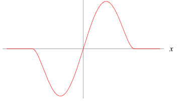

# Parallel Tracking and Mapping (PTAM)

### Camera pose and projection

The $j$-th point in the map can be defined as
$$
\bold{p}_{\mathcal{W}j} = 
\begin{bmatrix}
    x_{\mathcal{W}j}  \\
    y_{\mathcal{W}j}  \\
    z_{\mathcal{W}j}  \\
    1
\end{bmatrix}
$$
where $\mathcal{W}$ means in "world frame". 

The point in a camera-centred coordinate (denoted as $\mathcal{C}$) frame can be defined by
$$
\bold{p}_{\mathcal{C}j} = 
T_{\mathcal{CW}} \bold{p}_{\mathcal{W}j} 
$$
where $T_{\mathcal{CW}}$ is the transform from $\mathcal{W}$ to $\mathcal{C}$. Also, $T_{\mathcal{CW}}$ is the a camera pose in $\mathcal{W}$.

Define a camera projection function $CamProj$ that takes 3D points in a camera frame $\bold{p}_{\mathcal{C}j}$ map to image pixels $[u_j, v_j]$. The camera parameters for focal length $(f_u , f_v)$, principal point $(u_0 , v_0)$ and
distortion $\omega$ are assumed to be known.
$$
CamProj(\bold{p}_{\mathcal{C}j})
=
\begin{bmatrix}
    u_j \\
    v_j
\end{bmatrix}
=
\begin{bmatrix}
    u_0 \\
    v_0
\end{bmatrix}
+
\frac{r'}{r}
\begin{bmatrix}
    f_u & 0 \\
    0 & f_v \\
\end{bmatrix}
\begin{bmatrix}
    {x_{\mathcal{C}j}}/{z_{\mathcal{C}j}} \\
    {y_{\mathcal{C}j}}/{z_{\mathcal{C}j}} \\
\end{bmatrix}
$$
where $r \rightarrow r'$ is radial distortion correction
$$
\begin{align*}
    r &= \sqrt{\frac{x_{\mathcal{C}j}^2+y_{\mathcal{C}j}^2}{z_{\mathcal{C}j}^2}}
    \\
    r' &= \frac{1}{\omega} \arctan(2r \tan \frac{\omega}{2}) 
\end{align*}
$$

### Patch Search

*Patch search* is used to find correspondence features between two images.
Define two images' pixel displacement $(u_s, v_s)$, and define a warping matrix $A$
$$
A = 
\begin{bmatrix}
    \frac{\partial u_c}{\partial u_s} &
    \frac{\partial u_c}{\partial v_s} \\
    \frac{\partial v_c}{\partial u_s} &
    \frac{\partial v_c}{\partial v_s} 
\end{bmatrix}
$$

The determinant of matrix $A$ can be used to decide at which pyramid level of the current frame the patch should be searched (larger the $det(A)$, greater the pixel displacement).

*Sum of Squared Differences* (SSD) is used as the objective function to be minimized for all pixels in a search window $(x,y)\in\bold{W}_{m \times n}$ centered around a candidate feature point $(u_c, v_c)$.
$$
E_{ssd}(u_c,v_c)=\sum_{(x,y)\in\bold{W}_{m \times n}} 
\big[
    I(x+u_c, y+v_c)-I(x,y)    
\big]^2
$$

### M-estimator

M-estimators are a generalization of maximum likelihood estimators (MLEs) to maximize $\prod^n_{i=1} f(x_i)$, or equivalently, minimize $\sum^n_{i=1}- \log f(x_i)$ .
This can be generalized to minimize $\sum^n_{i=1} \rho(x_i)$, where $\rho$ is some function.

The optimization problem $\min_{\bold{x}} \sum^n_{i=1} \rho(x_i)$ can often be done by differentiating $\rho$ such that $\sum_{i=1}^n \frac{d \rho(x_i)}{d x_i} = 0$. 

Common $\rho$ are squared error $\mathcal{L}_2$, Huber loss $\mathcal{L}_{1.5}$ and absolute error $\mathcal{L}_1$.

PTAM uses Tukey's Biweight as the loss function for reprojection error.
$$
\rho(x) = 
\left\{
    \begin{matrix}
        x(1-\frac{x^2}{c^2})^2 &
        |x| < c \\
        0 &
        |x| \ge c \\
    \end{matrix}
\right.
$$
where it has a minimum at $x=-\frac{c}{\sqrt{5}}$ and a maximum at $x=\frac{c}{\sqrt{5}}$. In other words, $c$ is used to horizontally scale the Tukey's biweight loss function.

      

 

### Tukey's Range Test

Set $\mu_A$ and $\mu_B$ to the means of two populations $A$ and $B$. $|\sigma|$ is the standard error of the sum of the means.

$$
q_s = \frac{\mu_A-\mu_B}{|\sigma|}
$$

If the $q_s$ value is larger than a critical value $q_\alpha$ obtained from the distribution, 
the two means are said to be significantly different at level: $\alpha: 0 \le \alpha \le 1$. 

## Mapping

Each point has a unit patch normal $\bold{n}_j$ and a reference to the patch source pixels.

The map also contains $N$ keyframes. Each keyframe has an associated camera-centred coordinate frame, denoted $K_i$ for the $i$-th keyframe.

The transform between this keyframe coordinate and the world is $T_{K_{i}\mathcal{W}}$; 
the transform between two chronologically related keyframes is denoted as $T_{K_{i,i+1}\mathcal{W}}$

Each keyframe also stores a four-
level pyramid of greyscale $8$bpp images; level zero stores the full $640 \times 480$ pixel camera snapshot.

## Tracking

### Process Overview

1. By a motion model (such as IMU), update a prior camera pose (for the first time a camera pose is proposed).

2. Map points are projected according to the prior camera pose.

3. A small number ($50$) of the  coarsest-scale features are searched for in the image.

4. The camera pose is updated from these coarse matches (for the second time this camera pose is updated).

5. A larger number ($1000$) of points are re-projected and searched for in the image.

6. A final pose estimate for the frame is computed from all the matches found (for the third time this camera pose is updated).

### Pose Update

Given a set $S$ of successful patch observations, a camera pose update can be computed.
Each observation yields a found patch position $(\hat{u}, \hat{v})^\top$ and is assumed to have measurement noise of $\sigma^2$.

The optimal pose $\bold{\xi}^*$ can be computed by
$$
\bold{\xi}^* =
\argmin_{\bold{\xi} \in se(3)}
\sum_{j \in S} \rho \bigg(
   \frac{|\bold{e}_j|}{\sigma_j}, \bold{\sigma}_T
\bigg) 
$$
where $\bold{e}_j$ is the reprojection error vector:
$$
\bold{e}_j = 
\begin{bmatrix}
    \hat{u}_j \\
    \hat{v}_j \\
\end{bmatrix}
- 
CamProj(\bold{p}_{\mathcal{C}j})
$$
and $\rho(\space.\space,\bold{\sigma}_T)$ is the Tukey biweight objective function, 
inside which $\bold{\sigma}_T$ is a robust (median-based) estimate of the distribution’s standard deviation derived from all the residuals.

This Tukey biweight objective function amplifies errors in this interval $(-\frac{\bold{\sigma}_T}{\sqrt{5}}, \frac{\bold{\sigma}_T}{\sqrt{5}})$, and down-weight errors if they are outside this interval. For $|\bold{e}_j| \ge \bold{\sigma}_T$, the errors are set to zeros.