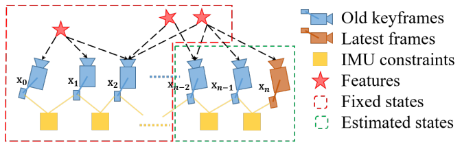

# VINS-Mono: A Robust and Versatile Monocular Visual-Inertial State Estimator

### Preliminaries and Notations

Notations: subscript $\tiny{W}$ means being in a world frame; subscript $\tiny{B}$ means being in a rigid body frame, also defined the same as IMU's; $\tiny{C}$ means being in a camera frame.

Subscript $\tiny{K}$ means keyframe index, while lower case $\tiny{k}$ means ordinary updating index, such as a shot by a camera $k_c$ or one IMU reading $k_i$.

The transform between IMU frame $\tiny{B}$ and camera frame $\tiny{C}$ is $[\mathbf{\phi}\_{\tiny{BC}}|\mathbf{p}\_{\tiny{BC}}]$:
$$
\begin{align*}
    \mathbf{\phi}\_{\tiny{CBk_c}} &= 
    \mathbf{\phi}\_{\tiny{Ck_c}} \otimes \mathbf{\phi}\_{\tiny{BC}}^{-1} \\\\
    s\mathbf{p}\_{\tiny{CBk_c}} &=
    s \mathbf{p}\_{\tiny{Ck_c}} - \mathbf{R}\_{\tiny{Ck_c}} \mathbf{p}\_{\tiny{BC}}
\end{align*}
$$

This pair $[s\mathbf{p}\_{\tiny{CBk_c}} | \mathbf{\phi}\_{\tiny{CBk_c}}]$ describes the IMU pose in the camera frame; $s$ is a scale factor.

## Measurement Preprocessing

### Vision Processing Front-end

* Visual Feature Point Process

For each new image, existing features are tracked by the KLT sparse optical flow algorithm.

Meanwhile, new corner features are detected to maintain a minimum number ($100$-$300$) of features in each image.

Outlier rejection is performed using RANSAC with fundamental matrix model.

* Keyframe Selection

Parallax tracked feature points different from the last keyframe: if the number greater than a threshold, launch a new keyframe.

If the new keyframe has too few feature points, discard it.

Use IMU to assist triangulation (rotation only mono vision cannot triangulate new feature points) when camera is rotating.

### IMU Pre-integration

For IMU haves much higher update frequencies than keyframe updates', should pre-integrate IMU readings and align the integrated results to corresponding keyframes.

IMU noises are assumed Gaussian and approximated by linear increments.

Between two neighbor keyframes $K_K$ and ${K+1}$, the pre-integrated IMU reading defines position difference estimate $\Delta\hat{\mathbf{p}}\_{\tiny{{K+1}}}$, velocity difference estimate $\Delta\hat{\mathbf{v}}\_{{K+1}}$ and orientation difference estimate $\Delta\hat{\mathbf{\phi}}\_{{K+1}}$.

$$
\begin{align*}
    \Delta\hat{\mathbf{p}}\_{\tiny{{K+1}}} &=
\mathbf{R}\_{\tiny{BK+1}}
\big(\mathbf{p}\_{\tiny{WK+1}}-\mathbf{p}\_{\tiny{WK}}+\frac{1}{2}\mathbf{g}\_{earth}\Delta t^2
-\mathbf{v}\_{\tiny{WK}}\Delta t \big)+\mathbf{n}\_{\tiny{Bp}} \\\\
    \Delta\hat{\mathbf{v}}\_{\tiny{{K+1}}} &=
\mathbf{R}\_{\tiny{W{K+1}}}
\big(\mathbf{v}\_{\tiny{W{K+1}}}-\mathbf{v}\_{\tiny{WK}}+\mathbf{g}\_{earth}\Delta t \big)+\mathbf{n}\_{\tiny{Bv}} \\\\
    \Delta\hat{\mathbf{\phi}}\_{\tiny{{K+1}}} &=
\mathbf{\phi}\_{\tiny{WK}}^{-1} \otimes
\mathbf{\phi}\_{\tiny{W{K+1}}}+\mathbf{n}\_{\tiny{B\phi}} \\\\
    \mathbf{b}\_{\tiny{ak_i}}-\mathbf{b}\_{\tiny{ak_i+1}} &=
\mathbf{0} + \mathbf{n}\_{\tiny{Bb_a}} \\\\
    \mathbf{b}\_{\tiny{\omega k_i}}-\mathbf{b}\_{\tiny{\omega k_i+1}} &=
\mathbf{0} + \mathbf{n}\_{\tiny{Bb_\omega}}
\end{align*}
$$

where $\otimes$ represents the multiplication operation between two quaternions; $\mathbf{g}\_{earth}$ is a constant vector for earth's gravity.

$\mathbf{n}\_{\tiny{Bp}}$, $\mathbf{n}\_{\tiny{Bv}}$ and $\mathbf{n}\_{\tiny{B\phi}}$ are Gaussian noises (measurement errors) 
such that $\mathbf{n}\_{\tiny{Bp}}\sim N(\mathbf{0}, \mathbf{\Sigma}\_{\tiny{Bp}})$, $\mathbf{n}\_{\tiny{Bv}}\sim N(\mathbf{0}, \mathbf{\Sigma}\_{\tiny{Bv}})$ and $\mathbf{n}\_{\tiny{B\phi}}\sim N(\mathbf{0}, \mathbf{\Sigma}\_{\tiny{B\phi}})$.

$\mathbf{n}\_{\tiny{Bb_a}} \sim N(\mathbf{0}, \mathbf{\Sigma}\_{\tiny{Bb_a}})$ 
and $\mathbf{n}\_{\tiny{Bb_\omega}} \sim N(\mathbf{0}, \mathbf{\Sigma}\_{\tiny{Bb_\omega}})$ are the acceleration and rotation zero offset difference prone to drifting noises.

The difference vectors $\Delta\hat{\mathbf{p}}\_{\tiny{{K+1}}}, \Delta\hat{\mathbf{v}}\_{\tiny{{K+1}}}, \Delta\hat{\mathbf{\phi}}\_{\tiny{{K+1}}}$ has no subscript $\tiny{W}$, since they only describe two keyframes' transform differences.

The estimates are inclusive of gyroscope bias $\mathbf{b}\_\omega$ and acceleration bias $\mathbf{b}_a$.

## Estimator Preprocessing

With obtained pre-integrated IMU readings and some initial keyframes plus visual feature points from measurement preprocessing, 
estimator initialization fuses such data to align IMU readings to keyframe poses.

### Vision-Only Sliding Window for Structure from Motion (SfM)

Maintain a sliding window of frames: 
within this windows, check if there are adequate corresponding matched features; then triangulate the feature points.

Based on these triangulated features, a perspective-n-point (PnP) method is performed to estimate poses of all other frames in the window.

Finally,
a global full bundle adjustment is applied to minimize the total reprojection error of all feature observations.

### Visual-Inertial Alignment

* Gyroscope Bias Calibration

For frames in a sliding window containing some camera frames $k_c \in \mathcal{B}$, attempt to update gyroscope bias $\mathbf{b}\_\omega$, 
so that IMU orientation reading difference $\Delta\hat{\mathbf{\phi}}\_{\tiny{K}}$ can align to camera estimated orientation transform $\mathbf{\phi}^{-1}\_{\tiny{C{K+1}}} \otimes \mathbf{\phi}\_{\tiny{CK}}$.

$$
\argmin_{\delta \mathbf{b}\_\omega}
\sum_{k_c \in \mathcal{B}}
\Big|\Big|
\big( \mathbf{\phi}^{-1}\_{\tiny{C{k+1}}} \otimes
\mathbf{\phi}\_{\tiny{Ck}} \big) \otimes
\Delta\hat{\mathbf{\phi}}\_{\tiny{k}}
\Big|\Big|^2
$$

where subscript $\tiny{C}$ indicates being in a camera frame.

* Velocity, Gravity Vector and Metric Scale Initialization

For $n$ initial IMU readings $k_i \in \mathbf{\mathcal{B}}$, define velocity states accordingly. The subscript $\tiny{B}$ represent a body rigid transform, typically aligned to the same orientation as IMU device.

$$
\mathbf{\mathcal{X}_V} = 
[\mathbf{v}\_{\tiny{Bk_{1}}},\quad
\mathbf{v}\_{\tiny{Bk_{2}}},\quad
\dots,\quad
\mathbf{v}\_{\tiny{Bk_{n}}},\quad]
\in \mathbb{R}^{3 \times n}
$$

Set $\Delta\hat{\mathbf{z}}\_{\tiny{BK}}$ to represent the difference estimate for position and velocity change, 
that can be said a sum of true observations $\mathbf{H}\_{\tiny{BK}} \mathbf{\mathcal{X}_V}$ and noises $\delta\mathbf{n}\_{\tiny{BK}}$.

This term $\mathbf{R}\_{\tiny{BC}}\mathbf{R}\_{\tiny{BCK}} \mathbf{p}\_{\tiny{CK}}$ describes alignment of camera position to the rigid body frame $\tiny{B}$.

$$
\begin{align*}
\Delta\hat{\mathbf{z}}\_{\tiny{BK}}&=
\begin{bmatrix}
    \Delta \mathbf{p}\_{\tiny{BK}}
    + \mathbf{R}\_{\tiny{BC}}\mathbf{R}\_{\tiny{CK}} \mathbf{p}\_{\tiny{BCK}}
    - \mathbf{p}\_{\tiny{BCK}} \\\\
    \Delta \mathbf{v}\_{\tiny{BK}}
\end{bmatrix}
\\\\ &=
\mathbf{H}\_{\tiny{BK}} \mathbf{\mathcal{X}_V}+ \delta\mathbf{n}\_{\tiny{BK}}
\end{align*}
$$

The optimization attempts to reduce the noise by updating $\mathbf{\mathcal{X}_V}$
$$
\min_{\mathbf{\mathcal{X}_V}}
\sum_{k_i \in \mathbf{\mathcal{B}}}
\Big|\Big|
\Delta\hat{\mathbf{z}}\_{\tiny{BK}} - 
\mathbf{H}\_{\tiny{BK}} \mathbf{\mathcal{X}_V}
\Big|\Big|^2
$$

## Tightly-Coupled Monocular VIO

Proceed with a sliding window-based tightly-coupled monocular VIO for high-accuracy and robust state estimation.

The full state vector in the sliding window having $n$  is defined as:
$$
\begin{align*}
    \mathbf{\mathcal{X}} &= [
\mathbf{x}_0, \quad \mathbf{x}_1, \quad, ... , \quad \mathbf{x}_n, \quad
\lambda_0, \quad \lambda_1, \quad, ... , \quad \lambda_m] \\\\
\mathbf{x}\_{\tiny{k}} &= [
\mathbf{p}\_{\tiny{WBk}}, \quad \mathbf{v}\_{\tiny{WBk}}, \quad \mathbf{\phi}\_{\tiny{WBk}}, \quad \mathbf{b}\_{{\omega}}, \quad \mathbf{p}\_{{a}}] \\\\
\mathbf{x}\_{\tiny{BC}} &= [\mathbf{\phi}\_{\tiny{BC}}|\mathbf{p}\_{\tiny{BC}}]
\end{align*}
$$

where $\mathbf{x}_k, k\in[0,n]$ is the IMU state at the time that the $k$-th image is captured. It contains position, velocity, and orientation of the IMU in the world frame, and acceleration bias $\mathbf{b}\_{{a}}$ and gyroscope bias $\mathbf{b}\_{{\omega}}$ in the IMU body frame.

$n$ is the total number of keyframes, and $m$ is the total number of features in the sliding window. 
$\lambda_l$ is the inverse depth of the $l$-th feature from its first observation.

$$
\min_{\mathbf{\mathcal{X}}}
\underbrace{\big|\big|
    \mathbf{r}_p - H_p \mathbf{\mathcal{X}}
\big|\big|^2}\_{
\text{Marginalization residuals}}+
\underbrace{\sum_{k_i \in \mathcal{B}} 
\Big|\Big|
    \mathbf{r}\_\mathcal{B} ( \hat{\mathbf{z}}\_{\tiny{BK}} ,\mathbf{\mathcal{X}} )
\Big|\Big|^2}\_{
\text{IMU measurement residuals}}+  
\underbrace{\sum_{(j,l) \in \mathcal{C}} 
\rho\Big( \big|\big|
    \mathbf{r}\_\mathcal{C} ( \hat{\mathbf{z}}\_{\tiny{C_jl}},\mathbf{\mathcal{X}} )
\big|\big|^2 \Big)}\_{
\text{Visual measurement residuals}}
$$

where $\rho(e)$ is a Huber norm. 
$$
\rho(e) = \left\{
    \begin{align*}
        & 1 && e \ge 1 \\\\
        & 2\sqrt{s}-1 && e < 1
    \end{align*}
\right.
$$

$\hat{\mathbf{z}}\_{\tiny{BK}}$ describes the estimate of $K$-th keyframe's IMU pre-integrated state; 
$\hat{\mathbf{z}}\_{\tiny{C_jl}}$ describes in the $j$-th camera frame the estimate of the $l$-th visual feature.

### IMU Measurement Residual

Consider the IMU measurements within two consecutive
frames $k_i$ and $k_{i+1}$

$$
\mathbf{r}\_\mathcal{B} ( \hat{\mathbf{z}}\_{\tiny{Bk_i+1}} ,\mathbf{\mathcal{X}} )=
\begin{bmatrix}
    \delta \Delta \mathbf{p}\_{\tiny{Bk_i+1}} \\\\
    \delta \Delta \mathbf{v}\_{\tiny{Bk_i+1}} \\\\
    \delta \Delta \mathbf{\phi}\_{\tiny{Bk_i+1}} \\\\
    \delta \Delta \mathbf{b}\_{\mathbf{a}} \\\\
    \delta \Delta \mathbf{b}\_{\mathbf{\omega}} \\\\
\end{bmatrix}=
\begin{bmatrix}
\begin{align*}
&
    \Delta\hat{\mathbf{p}}\_{\tiny{{K+1}}} -
\mathbf{R}\_{\tiny{BK+1}}
\big(\mathbf{p}\_{\tiny{WK+1}}-\mathbf{p}\_{\tiny{WK}}+\frac{1}{2}\mathbf{g}\_{earth}\Delta t^2
-\mathbf{v}\_{\tiny{WK}}\Delta t \big)
\\\\ &
    \Delta\hat{\mathbf{v}}\_{\tiny{{K+1}}} -
\mathbf{R}\_{\tiny{W{K+1}}}
\big(\mathbf{v}\_{\tiny{W{K+1}}}-\mathbf{v}\_{\tiny{WK}}+\mathbf{g}\_{earth}\Delta t \big)
\\\\ &
    \Delta\hat{\mathbf{\phi}}\_{\tiny{{K+1}}} 
\mathbf{\phi}\_{\tiny{WK}}^{-1} \otimes
\mathbf{\phi}\_{\tiny{W{K+1}}}
\\\\ &
    \mathbf{b}\_{\tiny{ak_i}}-\mathbf{b}\_{\tiny{ak_i+1}} 
\\\\ &
    \mathbf{b}\_{\tiny{\omega k_i}}-\mathbf{b}\_{\tiny{\omega k_i+1}} 
    
\end{align*}
\end{bmatrix}
$$

### Visual Measurement Residual

Consider the $l$-th feature $(\frac{1}{\lambda_l}u_{\tiny{Cil}},\frac{1}{\lambda_l}v_{\tiny{Cil}})$ that is observed in the $i$-th image, 
the perfect reprojection of this the feature observation in the $j$-th image can be computed by

$$
\begin{bmatrix}
    x_{\tiny{Cjl}} \\\\
    y_{\tiny{Cjl}} \\\\
    z_{\tiny{Cjl}} \\\\
    1 \\\\
\end{bmatrix}=
\mathbf{T}\_{\tiny{BC}}^{-1}
\mathbf{T}\_{\tiny{WBj}}^{-1}
\mathbf{T}\_{\tiny{WBi}}
\mathbf{T}\_{\tiny{BC}}
\begin{bmatrix}
    \frac{1}{\lambda_l}u_{\tiny{Cil}} \\\\
    \frac{1}{\lambda_l}v_{\tiny{Cil}} \\\\
    \frac{1}{\lambda_l} \\\\
    1 \\\\
\end{bmatrix}
$$

where $\mathbf{T}\_{\tiny{BC}}\mathbf{T}\_{\tiny{WBi}}$ describes the transform first from camera frame to body frame, then from body frame to world frame.

For non-perfect reprojection, the residual of one shared-observed feature can be defined as
$$
\mathbf{r}\_{\mathcal{C}\tiny{ijl}} = 
\begin{bmatrix}
    \frac{x_{\tiny{Cjl}}}{z_{\tiny{Cjl}}}
    - \frac{1}{\lambda_l}u_{\tiny{Cil}} \\\\
    - \frac{y_{\tiny{Cjl}}}{z_{\tiny{Cjl}}}
    - \frac{1}{\lambda_l}v_{\tiny{Cil}}
\end{bmatrix}
$$

### Marginalization 

The proposed sliding window method is a compromise between :
* applying full bundle adjustment on all camera poses and feature points, but would be time-consuming
* just use two neighbor keyframes' computed triangulation, but results would be coarse

The sliding window needs to continuously add new keyframes and feature points, as well as removing old ones.
This process is coined *Marginalization*

       

 

Recall Schur trick that
attempts to remove $\Delta \mathbf{x}\_{\mathbf{\xi}'}$ (old $\mathbf{x}_k$) and retain $\Delta \mathbf{x}\_{\mathbf{\xi}}$ (existing $\mathbf{x}_k$),
and takes into consideration the Gaussian noises $\mathbf{g}=[\mathbf{v} \quad \mathbf{w}]^\text{T}$, there is

$$
\begin{bmatrix}
    \mathbf{B} & \mathbf{E} \\\\
    \mathbf{E}^\text{T} & \mathbf{C}
\end{bmatrix}
\begin{bmatrix}
    \Delta \mathbf{x}\_{\mathbf{\xi}} \\\\
    \Delta \mathbf{x}\_{\mathbf{\xi}'}
\end{bmatrix}=
\begin{bmatrix}
    \mathbf{v} \\\\
    \mathbf{w}
\end{bmatrix}
$$

that has a result
$$
\underbrace{(\mathbf{B}-\mathbf{E}\mathbf{C}^{-1}\mathbf{E}^\text{T})}\_{
H_{\tiny{p}}}
\underbrace{\Delta \mathbf{x}\_{\mathbf{\xi}}}\_{
\mathbf{\mathcal{X}}}=
\underbrace{
\mathbf{v} - \mathbf{E}\mathbf{C}^{-1} \mathbf{w}}\_{
\mathbf{r}\_{\tiny{p}}}
$$

Back to VINS that marginalizes out old IMU states $\mathbf{x}_k$ and features $\lambda_l$ from the sliding window. The subscript $\tiny{p}$ means prior.

For pose optimization such as 
$\min_{\mathbf{\mathcal{X}}} \sum_{\mathbf{x}_k \in \mathbf{\mathcal{X}}} ||(\mathbf{x}\_{ki}^{-1}\mathbf{x}\_{kj}) \Delta\hat{\mathbf{x}}\_{kij}||^2$ 
where $\Delta\hat{\mathbf{x}}\_{kij}$ describes the transform between two frames $\mathbf{x}\_{kj}$ and $\mathbf{x}\_{ki}$.
Hessian is defined $H_{\tiny{p}}=J \Sigma^{-1} J^\top$ for the least squares problem.

## Global Pose Graph Optimization

### Relocalization

The relocalization process effectively aligns the current sliding window maintained by the monocular VIO to the graph of past poses.

IMU introduces accumulated drifts to the system.
To counter this issue, define another error term that accounts for loop closure frames ${o}$:
$$
\sum_{l,o \in \mathcal{L}} \rho \big(
|| \mathbf{r}\_{\mathbf{\mathcal{C}}}(
\hat{\mathbf{z}}\_{\tiny{{o}l}},
\mathbf{\mathcal{X}},
\hat{\mathbf{\phi}}\_{\tiny{W{o}}},
\hat{\mathbf{p}}\_{\tiny{W{o}}},
) ||\big)
$$

where $\mathcal{L}$ is the set of the observation of retrieved features in
the loop closure frames. $(l, o)$ means $l$-th feature observed in the loop closure frame $o$.

### Pose Optimization

VINS measures four degrees-of-freedom (x, y, z and yaw angle).

In graph optimization, there are two edges:

1) *Sequential Edge*: 
A keyframe will establish several sequential edges to its previous keyframes.

2) *Loop Closure Edge*: 
If the newly marginalized keyframe has a loop connection, it will be connected with the loop closure frame by a loop closure edge in the pose graph.