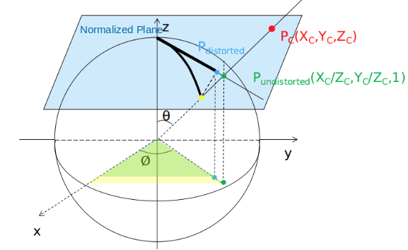

# VINS SLAM Source Code Review

## Compile and Launch

### Error `[pose_graph-4] process has died` and `[feature_tracker-2] process has died`

Error `[pose_graph-4] process has died` and `[feature_tracker-2] process has died` may occur after running `roslaunch vins_estimator euroc.launch`.
The root cause is `cv_bridge` having a wrong version.

`cv_bridge` is used to convert between ros images and OpenCV images.

First, prepare `OpenCV 3.4` by `git checkout 3.4`, and compile the 3.4 version OpenCV.

In Ubuntu20.04, go to `/opt/ros/noetic/share/cv_bridge/cmake/` and edit the config `sudo gedit cv_bridgeConfig.cmake`, changing the relevant OpenCV uses to using 3.4 version.
In detail, there are

```bash
# if(NOT "include;/usr/include/opencv4 " STREQUAL " ")
if(NOT "include;/home/yuqi/code/code/opencv/include/opencv" STREQUAL " ")
...

#  set(_include_dirs "include;/usr/include/opencv4")
   set(_include_dirs "include;/home/yuqi/code/code/opencv/include/opencv")
...

# set(libraries "cv_bridge;/usr/lib/x86_64-linux-gnu/libopencv_calib3d.so.4.2.0;/usr/lib/x86_64-linux-gnu/libopencv_dnn.so.4.2.0;/usr/lib/x86_64-linux-gnu/libopencv_features2d.so.4.2.0;/usr/lib/x86_64-linux-gnu/libopencv_flann.so.4.2.0;/usr/lib/x86_64-linux-gnu/libopencv_highgui.so.4.2.0;/usr/lib/x86_64-linux-gnu/libopencv_ml.so.4.2.0;/usr/lib/x86_64-linux-gnu/libopencv_objdetect.so.4.2.0;/usr/lib/x86_64-linux-gnu/libopencv_photo.so.4.2.0;/usr/lib/x86_64-linux-gnu/libopencv_stitching.so.4.2.0;/usr/lib/x86_64-linux-gnu/libopencv_video.so.4.2.0;/usr/lib/x86_64-linux-gnu/libopencv_videoio.so.4.2.0;/usr/lib/x86_64-linux-gnu/libopencv_aruco.so.4.2.0;/usr/lib/x86_64-linux-gnu/libopencv_bgsegm.so.4.2.0;/usr/lib/x86_64-linux-gnu/libopencv_bioinspired.so.4.2.0;/usr/lib/x86_64-linux-gnu/libopencv_ccalib.so.4.2.0;/usr/lib/x86_64-linux-gnu/libopencv_datasets.so.4.2.0;/usr/lib/x86_64-linux-gnu/libopencv_dnn_objdetect.so.4.2.0;/usr/lib/x86_64-linux-gnu/libopencv_dnn_superres.so.4.2.0;/usr/lib/x86_64-linux-gnu/libopencv_dpm.so.4.2.0;/usr/lib/x86_64-linux-gnu/libopencv_face.so.4.2.0;/usr/lib/x86_64-linux-gnu/libopencv_freetype.so.4.2.0;/usr/lib/x86_64-linux-gnu/libopencv_fuzzy.so.4.2.0;/usr/lib/x86_64-linux-gnu/libopencv_hdf.so.4.2.0;/usr/lib/x86_64-linux-gnu/libopencv_hfs.so.4.2.0;/usr/lib/x86_64-linux-gnu/libopencv_img_hash.so.4.2.0;/usr/lib/x86_64-linux-gnu/libopencv_line_descriptor.so.4.2.0;/usr/lib/x86_64-linux-gnu/libopencv_optflow.so.4.2.0;/usr/lib/x86_64-linux-gnu/libopencv_phase_unwrapping.so.4.2.0;/usr/lib/x86_64-linux-gnu/libopencv_plot.so.4.2.0;/usr/lib/x86_64-linux-gnu/libopencv_quality.so.4.2.0;/usr/lib/x86_64-linux-gnu/libopencv_reg.so.4.2.0;/usr/lib/x86_64-linux-gnu/libopencv_rgbd.so.4.2.0;/usr/lib/x86_64-linux-gnu/libopencv_saliency.so.4.2.0;/usr/lib/x86_64-linux-gnu/libopencv_shape.so.4.2.0;/usr/lib/x86_64-linux-gnu/libopencv_stereo.so.4.2.0;/usr/lib/x86_64-linux-gnu/libopencv_structured_light.so.4.2.0;/usr/lib/x86_64-linux-gnu/libopencv_superres.so.4.2.0;/usr/lib/x86_64-linux-gnu/libopencv_surface_matching.so.4.2.0;/usr/lib/x86_64-linux-gnu/libopencv_text.so.4.2.0;/usr/lib/x86_64-linux-gnu/libopencv_tracking.so.4.2.0;/usr/lib/x86_64-linux-gnu/libopencv_videostab.so.4.2.0;/usr/lib/x86_64-linux-gnu/libopencv_viz.so.4.2.0;/usr/lib/x86_64-linux-gnu/libopencv_ximgproc.so.4.2.0;/usr/lib/x86_64-linux-gnu/libopencv_xobjdetect.so.4.2.0;/usr/lib/x86_64-linux-gnu/libopencv_xphoto.so.4.2.0;/usr/lib/x86_64-linux-gnu/libopencv_core.so.4.2.0;/usr/lib/x86_64-linux-gnu/libopencv_imgproc.so.4.2.0;/usr/lib/x86_64-linux-gnu/libopencv_imgcodecs.so.4.2.0")
set(libraries "cv_bridge;/home/yuqi/code/code/opencv/build/lib/libopencv_calib3d.so.3.4;/home/yuqi/code/code/opencv/build/lib/libopencv_imgproc.so.3.4;/home/yuqi/code/code/opencv/build/lib/libopencv_core.so.3.4;/home/yuqi/code/code/opencv/build/lib/libopencv_highgui.so.3.4;")
```

## Overall Structure

Start from `estimator_node`, VINS first registers publishing/listening messages, then processes IMU and image data in a loop.


```cpp
int main(int argc, char **argv)
{
    ros::init(argc, argv, "vins_estimator");
    ros::NodeHandle n("~");

    registerPub(n);

    ros::Subscriber sub_imu = n.subscribe(IMU_TOPIC, 2000, imu_callback, ros::TransportHints().tcpNoDelay());
    ros::Subscriber sub_image = n.subscribe("/feature_tracker/feature", 2000, feature_callback);
    ros::Subscriber sub_restart = n.subscribe("/feature_tracker/restart", 2000, restart_callback);
    ros::Subscriber sub_relo_points = n.subscribe("/pose_graph/match_points", 2000, relocalization_callback);

    std::thread measurement_process{process};
    // ros::spin() will not return until the node has been shutdown, either through a call to ros::shutdown() or a Ctrl-C.
    ros::spin();
}


void registerPub(ros::NodeHandle &n)
{
    pub_latest_odometry = n.advertise<nav_msgs::Odometry>("imu_propagate", 1000);
    pub_path = n.advertise<nav_msgs::Path>("path", 1000);
    pub_relo_path = n.advertise<nav_msgs::Path>("relocalization_path", 1000);
    pub_odometry = n.advertise<nav_msgs::Odometry>("odometry", 1000);
    pub_point_cloud = n.advertise<sensor_msgs::PointCloud>("point_cloud", 1000);
    pub_margin_cloud = n.advertise<sensor_msgs::PointCloud>("history_cloud", 1000);
    pub_key_poses = n.advertise<visualization_msgs::Marker>("key_poses", 1000);
    pub_camera_pose = n.advertise<nav_msgs::Odometry>("camera_pose", 1000);
    pub_camera_pose_visual = n.advertise<visualization_msgs::MarkerArray>("camera_pose_visual", 1000);
    pub_keyframe_pose = n.advertise<nav_msgs::Odometry>("keyframe_pose", 1000);
    pub_keyframe_point = n.advertise<sensor_msgs::PointCloud>("keyframe_point", 1000);
    pub_extrinsic = n.advertise<nav_msgs::Odometry>("extrinsic", 1000);
    pub_relo_relative_pose=  n.advertise<nav_msgs::Odometry>("relo_relative_pose", 1000);

    cameraposevisual.setScale(1);
    cameraposevisual.setLineWidth(0.05);
    keyframebasevisual.setScale(0.1);
    keyframebasevisual.setLineWidth(0.01);
}


// thread: visual-inertial odometry
void process()
{
    while (true)
    {
        std::vector<std::pair<std::vector<sensor_msgs::ImuConstPtr>, sensor_msgs::PointCloudConstPtr>> measurements;
        for (auto &measurement : measurements)
        {    
            // measurement.first is the IMU data
            for (auto &imu_msg : measurement.first)
            {
                dx = imu_msg->linear_acceleration.x;
                dy = imu_msg->linear_acceleration.y;
                dz = imu_msg->linear_acceleration.z;
                rx = imu_msg->angular_velocity.x;
                ry = imu_msg->angular_velocity.y;
                rz = imu_msg->angular_velocity.z;
                estimator.processIMU(dt, Vector3d(dx, dy, dz), Vector3d(rx, ry, rz));
            }

            // measurement.second is the Image feature point data
            auto img_msg = measurement.second;
            map<int, vector<pair<int, Eigen::Matrix<double, 7, 1>>>> image;
            for (unsigned int i = 0; i < img_msg->points.size(); i++)
            {
                int v = img_msg->channels[0].values[i] + 0.5;
                int feature_id = v / NUM_OF_CAM;
                int camera_id = v % NUM_OF_CAM;
                double x = img_msg->points[i].x;
                double y = img_msg->points[i].y;
                double z = img_msg->points[i].z;
                double p_u = img_msg->channels[1].values[i];
                double p_v = img_msg->channels[2].values[i];
                double velocity_x = img_msg->channels[3].values[i];
                double velocity_y = img_msg->channels[4].values[i];
                ROS_ASSERT(z == 1);
                Eigen::Matrix<double, 7, 1> xyz_uv_velocity;
                xyz_uv_velocity << x, y, z, p_u, p_v, velocity_x, velocity_y;
                image[feature_id].emplace_back(camera_id,  xyz_uv_velocity);
            }
            estimator.processImage(image, img_msg->header);

            // after loading and processing data, publish them
            std_msgs::Header header = img_msg->header;
            header.frame_id = "world";
            pubOdometry(estimator, header);
            pubKeyPoses(estimator, header);
            pubCameraPose(estimator, header);
            pubPointCloud(estimator, header);
            pubTF(estimator, header);
            pubKeyframe(estimator);
        }
    }
}
```


### The main work in `processIMU` 

`processIMU` describes how pre-integration takes into account of IMU data to a corresponding frame.

`Bas` $\bold{b}_a$ and `Bgs` $\bold{b}_g$ are pre-computed biases from IMU pre-integration.
They are used as assumed noises to be subtracted from the computed rotation/orientation `Rs[j]` $\bold{R}_j$, position `Ps[j]` $\bold{p}_j$ and velocity `Vs[j]` $\bold{v}_j$

From each IMU reading obatin linear acceleration `linear_acceleration` $\hat{\bold{a}}_{t}$ and angular acceleration `angular_velocity` $\hat{\bold{\omega}}_{t}$, then compute `Rs[j]` $\bold{R}_j$, `Ps[j]` $\bold{p}_j$ and `Vs[j]` $\bold{v}_j$.

$\bold{a}_{t} = \frac{1}{2} (\hat{\bold{a}}_{t,t-1} + \hat{\bold{a}}_{t,t})$ assumes linear interpolation, 
that acceleration is transformed/rotated linearly between $\bold{R}_{j, t-1}$ and $\bold{R}_{j, t}$.

$$
\begin{align*}
\hat{\bold{a}}_{t, t-1} &= \bold{R}_{j, t-1} (\bold{a}_{t-1} - \bold{b}_a) - \bold{g}_{earth}
\\
{\bold{\omega}}_{t} &= \frac{1}{2} (\bold{\omega}_{t-1} + \hat{\bold{\omega}}_{t}) - \bold{b}_\omega
\\
{\bold{R}}_{j, t} &= \bold{R}_{j, t-1} \cdot ({\bold{\omega}}_{t} \cdot \delta t)^\wedge
\\
\hat{\bold{a}}_{t,t} &= {\bold{R}}_{j, t} (\hat{\bold{a}}_{t} - \bold{b}_a) - \bold{g}_{earth}
\\
\bold{a}_{t} &= \frac{1}{2} (\hat{\bold{a}}_{t,t-1} + \hat{\bold{a}}_{t,t})
\\
\bold{p}_{j, t} &= \bold{p}_{j, t-1} + \bold{v}_{j, t-1} \cdot \delta t + \frac{1}{2} \bold{a}_{t} (\delta t)^2
\\
\bold{v}_{j, t} &= \bold{v}_{j, t-1} + \bold{a}_{j, t} \cdot \delta t 
\end{align*}
$$

```cpp
namespace Estimator {
    Vector3d Ps[(WINDOW_SIZE + 1)]; // position
    Vector3d Vs[(WINDOW_SIZE + 1)]; // velocity
    Matrix3d Rs[(WINDOW_SIZE + 1)]; // angle/orientation
    Vector3d Bas[(WINDOW_SIZE + 1)]; // acceleration bias
    Vector3d Bgs[(WINDOW_SIZE + 1)]; // gyro/rotation bias

    IntegrationBase *pre_integrations[(WINDOW_SIZE + 1)];

    Vector3d acc_0, gyr_0;

    vector<double> dt_buf[(WINDOW_SIZE + 1)];
    vector<Vector3d> linear_acceleration_buf[(WINDOW_SIZE + 1)];
    vector<Vector3d> angular_velocity_buf[(WINDOW_SIZE + 1)];
}

void Estimator::processIMU(double dt, const Vector3d &linear_acceleration, const Vector3d &angular_velocity)
{
    // push_back to store imu readings
    pre_integrations[frame_count]->push_back(dt, linear_acceleration, angular_velocity);
    tmp_pre_integration->push_back(dt, linear_acceleration, angular_velocity);

    dt_buf[frame_count].push_back(dt);
    linear_acceleration_buf[frame_count].push_back(linear_acceleration);
    angular_velocity_buf[frame_count].push_back(angular_velocity);

    // use the obtained imu linear acc and angular acc to compute `Rs`, `Ps` and `Vs`
    // update `acc_0` and `gyr_0` to using the crrent time imu reading
    int j = frame_count;         
    Vector3d un_acc_0 = Rs[j] * (acc_0 - Bas[j]) - g;
    Vector3d un_gyr = 0.5 * (gyr_0 + angular_velocity) - Bgs[j];
    Rs[j] *= Utility::deltaQ(un_gyr * dt).toRotationMatrix();
    Vector3d un_acc_1 = Rs[j] * (linear_acceleration - Bas[j]) - g;
    Vector3d un_acc = 0.5 * (un_acc_0 + un_acc_1);
    Ps[j] += dt * Vs[j] + 0.5 * dt * dt * un_acc;
    Vs[j] += dt * un_acc;

    acc_0 = linear_acceleration;
    gyr_0 = angular_velocity;
}
```

### The main work in `processImage`

In previous `process`, each image feature id is defined with 3d position `xyz`, image pixel location `uv` and its `velocity`.
```cpp
auto img_msg = measurement.second;
for (auto& point : img_msg) {
    ...
    xyz_uv_velocity << x, y, z, p_u, p_v, velocity_x, velocity_y;
    image[feature_id].emplace_back(camera_id,  xyz_uv_velocity);
}
estimator.processImage(image, img_msg->header);
```

Inside `processImage`, first decide which frame to remove in marginalization to maintain the sliding window size: the oldest frame or the previous frame just before the current input image frame by `addFeatureCheckParallax`, and the criteria is the degree of mean parallax:
* large parallax indicates significant camera movement, the recent image frames should be kept, and the old frame should be marginalized out
* small parallax indicates insignificant camera movement, the recent image frames are similar to each other, and the recent second image frame should be marginalized out

`initialStructure` computes the transform between each camera frame and globally the position of 3d feature points

`solveOdometry` triangulates image pixels to estimate the depth of the 3d features.
Then, run optimization for the below variables and perform marginalization to remove camera frames
* IMU poses and speeds in a sliding window
* Camera poses
* Time offset between IMU and camera reading time

`slideWindow` moves the sliding window forward one frame, with action inclduing updating pointers and disassociate 3d features.

```cpp
void Estimator::processImage(const map<int, vector<pair<int, Eigen::Matrix<double, 7, 1>>>> &image, const std_msgs::Header &header)
{
    // parallax checking returns true when
    // frame_count < 2: sliding window has no or just one frame
    // last_track_num < 20: too few feature points shared between this input image and those recorded in this window, 
    //     indicating this image has rich new features (possibly entered into a new scene)
    // parallax_num == 0: no shared feature points between this input image and last two frames
    // parallax_sum / parallax_num >= MIN_PARALLAX: through `parallax_sum += compensatedParallax2(it_per_id, frame_count);`,
    //     compute mean parallax; `compensatedParallax2` takes feature points from the second last image and the third last 
    //     image, and compute the parallax difference;
    //     large `parallax_sum` means the second last image and the third last image have somewahr big translation/rotation in between
    if (f_manager.addFeatureCheckParallax(frame_count, image, td))
        marginalization_flag = MARGIN_OLD; // remove the oldest frame in marginalization
    else
        marginalization_flag = MARGIN_SECOND_NEW; // remove the second new frame in marginalization

    // 1. from image frames take each frame associated pre-integration's acceleration, 
    //    and compute the acceleration variation, 
    //    if too small, IMU sees little movements
    // 2. for every feature, associate it in all image frames, 
    //    where this feature is located in the image pixel (u,v)
    //    in other words, track this feature how it moves across consecutive images having observed this feature
    // 3. `relativePose(relative_R, relative_T, l)` finds the transform between the image frames within a sliding window
    //    then compute the mean parallax for each of the transforms (parallax is just the norm of the diff between two corresponding points),
    //    until found two frames with parallax large enough (camera has moved a great distance) for SFM
    // 4. `sfm.construct(...)` takes the above estimated `relative_R, relative_T` as the initial guesses and solve PnP 
    //    for the 3d representations of 2d points for all image frames in the sliding window.
    //    Combined, the 3d features are stored in `sfm_tracked_points`
    // 5. With the obatined 3d features, again perform PnP for all 3d features `sfm_tracked_points` against their 2d image pixels, and found rotation and translation of all frames in the sliding window
    // 6. Finally, `visualInitialAlign()` is performed to adjust IMU pre-integration result to be aligned in time with the computed 3d features
    bool result = initialStructure();

    if(result) {
        solver_flag = NON_LINEAR;

        // 1. `f_manager.triangulate(Ps, tic, ric)` finds the depth of a 3d feature 
        //    by `it_per_id->estimated_depth = svd_V[2] / svd_V[3]`
        // 2. `optimization()` optimizes
        //    * IMU poses and speeds in a sliding window
        //    * Camera poses
        //    * Time offset between IMU and camera reading time
        //    after having finished optimization, compute marginalization
        solveOdometry();

        // depending on the flag `marginalization_flag`,
        // remove the oldest frame or the most recent second frame, content including some pointer moving/updating and disassociate features from the to-be-removed frame
        slideWindow();
        f_manager.removeFailures();
        ROS_INFO("Initialization finish!");
        last_R = Rs[WINDOW_SIZE];
        last_P = Ps[WINDOW_SIZE];
        last_R0 = Rs[0];
        last_P0 = Ps[0];
    }
    else {
        slideWindow();
    }
}
```

## Optimization

Recall in VINS that the objective constains three items:
$$
\min_{\bold{\mathcal{X}}}
\underbrace{\big|\big|
    \bold{r}_p - H_p \bold{\mathcal{X}}
\big|\big|^2}_{
\text{Marginalization residuals}}
+
\underbrace{\sum_{k_i \in \mathcal{B}} 
\Big|\Big|
    \bold{r}_\mathcal{B} ( \hat{\bold{z}}_{\tiny{BK}} ,\bold{\mathcal{X}} )
\Big|\Big|^2}_{
\text{IMU measurement residuals}}
+  
\underbrace{\sum_{(j,l) \in \mathcal{C}} 
\rho\Big( \big|\big|
    \bold{r}_\mathcal{C} ( \hat{\bold{z}}_{\tiny{C_jl}},\bold{\mathcal{X}} )
\big|\big|^2 \Big)}_{
\text{Visual measurement residuals}}
$$
where $\rho(e)$ is a Huber norm. 

Variables $\mathcal{X}$ to be optimized (`problem.AddParameterBlock`):
* IMU poses `para_Pose` and speeds `para_SpeedBias` in a sliding window
* Camera poses `para_Ex_Pose`
* Time offset between IMU and camera reading time `para_Td` (optional)

Residuals to be reduced (`AddResidualBlock`):
* Marginalization error (`MarginalizationFactor`)
* IMU (`IMUFactor`)
* Visual feature reprojection error (`ProjectionFactor`)

The above three residual factors are actual ceres' `class CostFunction` where `Evaluate(...)` must be defined to compute residuals and Jacobians.

With the above defined residuals, the optimization problem can solved by `ceres::Solve(options, &problem, &summary);`.

Depending on marganizalition flag: either remove the oldest frame or the second last frame, add and remove different items to/from the sliding window.
* To remove the oldest frame: this means the camera has moved a significant amount of distance, so that need to add new IMU and projection residuals as well as marginalization
* To remove the second last frame: this means the camera does not move a lot, just need to do with marginalization residuals


```cpp
void Estimator::optimization()
{
    ceres::Problem problem;
    ceres::LossFunction *loss_function = new ceres::CauchyLoss(1.0);

    // void Problem::AddParameterBlock(double *values, int size, LocalParameterization *local_parameterization)

    for (int i = 0; i < WINDOW_SIZE + 1; i++)
    {
        ceres::LocalParameterization *local_parameterization = new PoseLocalParameterization();
        problem.AddParameterBlock(para_Pose[i], SIZE_POSE, local_parameterization);
        problem.AddParameterBlock(para_SpeedBias[i], SIZE_SPEEDBIAS);
    }
    for (int i = 0; i < NUM_OF_CAM; i++)
    {
        ceres::LocalParameterization *local_parameterization = new PoseLocalParameterization();
        problem.AddParameterBlock(para_Ex_Pose[i], SIZE_POSE, local_parameterization);
    }
    if (ESTIMATE_TD) // time offset between IMU and camera
    {
        problem.AddParameterBlock(para_Td[0], 1);
    }

    // ResidualBlockId Problem::AddResidualBlock(CostFunction *cost_function, LossFunction *loss_function, const vector<double*> parameter_blocks)

    if (last_marginalization_info)
    {
        // construct new marginlization_factor
        MarginalizationFactor *marginalization_factor = new MarginalizationFactor(last_marginalization_info);
        problem.AddResidualBlock(marginalization_factor, NULL,
                                 last_marginalization_parameter_blocks);
    }

    for (int i = 0; i < WINDOW_SIZE; i++)
    {
        int j = i + 1;
        if (pre_integrations[j]->sum_dt > 10.0)
            continue;
        IMUFactor* imu_factor = new IMUFactor(pre_integrations[j]);
        problem.AddResidualBlock(imu_factor, NULL, para_Pose[i], para_SpeedBias[i], para_Pose[j], para_SpeedBias[j]);
    }

    for (auto &it_per_id : f_manager.feature)
    {
        for (auto &it_per_frame : it_per_id.feature_per_frame)
        {
            ProjectionFactor *f = new ProjectionFactor(pts_i, pts_j);
            problem.AddResidualBlock(f, loss_function, para_Pose[imu_i], para_Pose[imu_j], para_Ex_Pose[0], para_Feature[feature_index]);
 
        }
    }

    if(relocalization_info)
    {
        ceres::LocalParameterization *local_parameterization = new PoseLocalParameterization();
        problem.AddParameterBlock(relo_Pose, SIZE_POSE, local_parameterization);
        for (auto &it_per_id : f_manager.feature)
        {
            if((int)match_points[retrive_feature_index].z() == it_per_id.feature_id)
            {
                Vector3d pts_j = Vector3d(match_points[retrive_feature_index].x(), match_points[retrive_feature_index].y(), 1.0);
                Vector3d pts_i = it_per_id.feature_per_frame[0].point;
                
                ProjectionFactor *f = new ProjectionFactor(pts_i, pts_j);
                problem.AddResidualBlock(f, loss_function, para_Pose[start], relo_Pose, para_Ex_Pose[0], para_Feature[feature_index]);
                retrive_feature_index++;
            }     
        }
    }

    ceres::Solver::Options options;
    options.linear_solver_type = ceres::DENSE_SCHUR;
    options.trust_region_strategy_type = ceres::DOGLEG;
    options.max_num_iterations = NUM_ITERATIONS;
    ceres::Solver::Summary summary;
    ceres::Solve(options, &problem, &summary);

    // To marginalize out the oldest frame from the sliding window
    if (marginalization_flag == MARGIN_OLD) {

        MarginalizationInfo *marginalization_info = new MarginalizationInfo();

        // `drop_set` push_back the frame with pose at the start of the sliding window
        vector<int> drop_set;
        for (int i = 0; i < static_cast<int>(last_marginalization_parameter_blocks.size()); i++)
        {
            if (last_marginalization_parameter_blocks[i] == para_Pose[0] ||
                last_marginalization_parameter_blocks[i] == para_SpeedBias[0])
                drop_set.push_back(i);
        }
        // construct new marginlization_factor
        MarginalizationFactor *marginalization_factor = new MarginalizationFactor(last_marginalization_info);
        ResidualBlockInfo *residual_block_info = new ResidualBlockInfo(marginalization_factor, NULL,
                                                                       last_marginalization_parameter_blocks,
                                                                       drop_set);

        marginalization_info->addResidualBlockInfo(residual_block_info);

        // `sum_dt` is the accumulated dt from imu reading, should not be too big, otherwise pre-integration might have a bad approximation
        if (pre_integrations[1]->sum_dt < 10.0)
        {
            IMUFactor* imu_factor = new IMUFactor(pre_integrations[1]);
            ResidualBlockInfo *residual_block_info = new ResidualBlockInfo(imu_factor, NULL,
                                                                       vector<double *>{para_Pose[0], para_SpeedBias[0], para_Pose[1], para_SpeedBias[1]},
                                                                       vector<int>{0, 1});
            marginalization_info->addResidualBlockInfo(residual_block_info);
        }

        // add visual/projection error
        for (auto &it_per_id : f_manager.feature) {
            int imu_i = it_per_id.start_frame, imu_j = imu_i - 1;
            for (auto &it_per_frame : it_per_id.feature_per_frame) {
                imu_j++;
                ProjectionFactor *f = new ProjectionFactor(pts_i, pts_j);
                ResidualBlockInfo *residual_block_info = new ResidualBlockInfo(f, loss_function,
                                                                               vector<double *>{para_Pose[imu_i], para_Pose[imu_j], para_Ex_Pose[0], para_Feature[feature_index]},
                                                                               vector<int>{0, 3});
                marginalization_info->addResidualBlockInfo(residual_block_info);
            }
        }

        marginalization_info->preMarginalize();
        marginalization_info->marginalize();

        std::unordered_map<long, double *> addr_shift;
        for (int i = 1; i <= WINDOW_SIZE; i++)
        {
            addr_shift[reinterpret_cast<long>(para_Pose[i])] = para_Pose[i - 1];
            addr_shift[reinterpret_cast<long>(para_SpeedBias[i])] = para_SpeedBias[i - 1];
        }
    }
    // To marginalize out the second last frame from the sliding window
    else {
        MarginalizationInfo *marginalization_info = new MarginalizationInfo();
        vector<int> drop_set;

        // `drop_set` push_back the second last frame from the sliding window
        for (int i = 0; i < static_cast<int>(last_marginalization_parameter_blocks.size()); i++)
        {
            ROS_ASSERT(last_marginalization_parameter_blocks[i] != para_SpeedBias[WINDOW_SIZE - 1]);
            if (last_marginalization_parameter_blocks[i] == para_Pose[WINDOW_SIZE - 1])
                drop_set.push_back(i);
        }
        // construct new marginlization_factor
        MarginalizationFactor *marginalization_factor = new MarginalizationFactor(last_marginalization_info);
        ResidualBlockInfo *residual_block_info = new ResidualBlockInfo(marginalization_factor, NULL,
                                                                       last_marginalization_parameter_blocks,
                                                                       drop_set);

        marginalization_info->addResidualBlockInfo(residual_block_info);

        marginalization_info->preMarginalize();
        marginalization_info->marginalize();

        std::unordered_map<long, double *> addr_shift;
        for (int i = 1; i <= WINDOW_SIZE; i++)
        {
            addr_shift[reinterpret_cast<long>(para_Pose[i])] = para_Pose[i - 1];
            addr_shift[reinterpret_cast<long>(para_SpeedBias[i])] = para_SpeedBias[i - 1];
        }
    }

}
```

`addResidualBlockInfo` pushes back `ResidualBlockInfo *residual_block_info` to `factors`.
The parameters to be added to marginalization matrix are set in `_parameter_blocks`, while those to be removed are set in `_drop_set`.

`MarginalizationInfo` itself is the class that manages adding/removing frames' associated data into/from the sliding window.

The add/remove action is done through mapping, that every parameter `double *addr = parameter_blocks[i]` is managed by a pointer, translated to an addr by `reinterpret_cast<long>(addr)` to a `long`.
This saves the effort to permutate matrix since data blocks are retrived through mapping.

Both `parameter_block_size` and `parameter_block_idx` are `std::unordered_map<long, int>`, in which `long` as the key is used to represent a pointer addr, and `int` as the value is the size of a parameter block.
Later in the marginalization process, they will be used to determine which parameter blocks are to kept and which are to be removed.

```cpp
struct ResidualBlockInfo
{
    ResidualBlockInfo(ceres::CostFunction *_cost_function, ceres::LossFunction *_loss_function, std::vector<double *> _parameter_blocks, std::vector<int> _drop_set)
        : cost_function(_cost_function), loss_function(_loss_function), parameter_blocks(_parameter_blocks), drop_set(_drop_set) {}

    void Evaluate();

    ceres::CostFunction *cost_function;
    ceres::LossFunction *loss_function;
    std::vector<double *> parameter_blocks;
    std::vector<int> drop_set;

    double **raw_jacobians;
    std::vector<Eigen::Matrix<double, Eigen::Dynamic, Eigen::Dynamic, Eigen::RowMajor>> jacobians;
    Eigen::VectorXd residuals;

    int localSize(int size) {
        return size == 7 ? 6 : size;
    }
};

void MarginalizationInfo::addResidualBlockInfo(ResidualBlockInfo *residual_block_info)
{
    factors.emplace_back(residual_block_info);

    std::vector<double *> &parameter_blocks = residual_block_info->parameter_blocks;
    std::vector<int> parameter_block_sizes = residual_block_info->cost_function->parameter_block_sizes();

    // add new parameter_blocks
    // set new parameter pointed `parameter_block_size` to the size of one parameter
    for (int i = 0; i < static_cast<int>(residual_block_info->parameter_blocks.size()); i++)
    {
        double *addr = parameter_blocks[i];
        int size = parameter_block_sizes[i];
        parameter_block_size[reinterpret_cast<long>(addr)] = size;
    }

    // remove parameter_blocks
    // set the to be dropped set corresponding `parameter_block_idx` to zero
    for (int i = 0; i < static_cast<int>(residual_block_info->drop_set.size()); i++)
    {
        double *addr = parameter_blocks[residual_block_info->drop_set[i]];
        parameter_block_idx[reinterpret_cast<long>(addr)] = 0;
    }
}
```

The residuals are of the type `ResidualBlockInfo`, where `cost_function->Evaluate(parameter_blocks.data(), residuals.data(), raw_jacobians);` is defined to compute the residual vector and the Jacobian matrices (known Jacobians can help ceres converge).
If `loss_function` is defined, residuals are scaled by the loss function.

```cpp
void ResidualBlockInfo::Evaluate()
{
    for (int i = 0; i < static_cast<int>(block_sizes.size()); i++)
    {
        jacobians[i].resize(cost_function->num_residuals(), block_sizes[i]);
        raw_jacobians[i] = jacobians[i].data();
    }

    // bool CostFunction::Evaluate(double const *const *parameters, double *residuals, double **jacobians) const
    cost_function->Evaluate(parameter_blocks.data(), residuals.data(), raw_jacobians);

    if (loss_function) {
        sq_norm = residuals.squaredNorm();
        loss_function->Evaluate(sq_norm, rho);

        ...

        for (int i = 0; i < static_cast<int>(parameter_blocks.size()); i++) {
            jacobians[i] = sqrt_rho1_ * (jacobians[i] - alpha_sq_norm_ * residuals * (residuals.transpose() * jacobians[i]));
        }
        residuals *= residual_scaling_;
    }
}
```

### Optimized Parameter Mapping

`para_Pose` and `para_SpeedBias` are the two parameter blocks for ceres that have the below mapping relationship to `Rs[j]` $\bold{R}_j$, `Ps[j]` $\bold{p}_j$ and `Vs[j]` $\bold{v}_j$ `Bas` $\bold{b}_a$ and `Bgs` $\bold{b}_g$.

```cpp
Rs[i] = rot_diff * Quaterniond(para_Pose[i][6], para_Pose[i][3], para_Pose[i][4], para_Pose[i][5]).normalized().toRotationMatrix();
        
Ps[i] = rot_diff * Vector3d(para_Pose[i][0] - para_Pose[0][0],
                        para_Pose[i][1] - para_Pose[0][1],
                        para_Pose[i][2] - para_Pose[0][2]) + origin_P0;

Vs[i] = rot_diff * Vector3d(para_SpeedBias[i][0],
                            para_SpeedBias[i][1],
                            para_SpeedBias[i][2]);

Bas[i] = Vector3d(para_SpeedBias[i][3],
                  para_SpeedBias[i][4],
                  para_SpeedBias[i][5]);

Bgs[i] = Vector3d(para_SpeedBias[i][6],
                  para_SpeedBias[i][7],
                  para_SpeedBias[i][8]);
```

## Visual Initial Alignment

`visualInitialAlign()` prepares some initial guesses for `para_Pose` and `para_SpeedBias` to be optimized.

```cpp
bool Estimator::visualInitialAlign()
{
    TicToc t_g;
    VectorXd x;
    bool result = VisualIMUAlignment(all_image_frame, Bgs, g, x);

    // change state
    for (int i = 0; i <= frame_count; i++)
    {
        Matrix3d Ri = all_image_frame[Headers[i].stamp.toSec()].R;
        Vector3d Pi = all_image_frame[Headers[i].stamp.toSec()].T;
        Ps[i] = Pi;
        Rs[i] = Ri;
        all_image_frame[Headers[i].stamp.toSec()].is_key_frame = true;
    }

    VectorXd dep = f_manager.getDepthVector();
    f_manager.triangulate(Ps, &(TIC_TMP[0]), &(RIC[0]));

    double s = (x.tail<1>())(0);
    for (int i = 0; i <= WINDOW_SIZE; i++)
    {
        pre_integrations[i]->repropagate(Vector3d::Zero(), Bgs[i]);
    }
    for (int i = frame_count; i >= 0; i--)
        Ps[i] = s * Ps[i] - Rs[i] * TIC[0] - (s * Ps[0] - Rs[0] * TIC[0]);

    int kv = -1;
    map<double, ImageFrame>::iterator frame_i;
    for (frame_i = all_image_frame.begin(); frame_i != all_image_frame.end(); frame_i++)
    {
        if(frame_i->second.is_key_frame)
        {
            kv++;
            Vs[kv] = frame_i->second.R * x.segment<3>(kv * 3);
        }
    }

    for (auto &it_per_id : f_manager.feature)
    {
        it_per_id.used_num = it_per_id.feature_per_frame.size();
        if (!(it_per_id.used_num >= 2 && it_per_id.start_frame < WINDOW_SIZE - 2))
            continue;
        it_per_id.estimated_depth *= s;
    }

    Matrix3d R0 = Utility::g2R(g);
    double yaw = Utility::R2ypr(R0 * Rs[0]).x();
    R0 = Utility::ypr2R(Eigen::Vector3d{-yaw, 0, 0}) * R0;
    g = R0 * g;
    //Matrix3d rot_diff = R0 * Rs[0].transpose();
    Matrix3d rot_diff = R0;
    for (int i = 0; i <= frame_count; i++)
    {
        Ps[i] = rot_diff * Ps[i];
        Rs[i] = rot_diff * Rs[i];
        Vs[i] = rot_diff * Vs[i];
    }
}
```

`VisualIMUAlignment()` consists of two steps `solveGyroscopeBias(...)` that computes an initial guess of `delta_bg` $\bold{b}_{\omega}$, and `LinearAlignment(...)`

* `solveGyroscopeBias(...)`

Define the $i$-th and $j$-th frame rotation difference (the $j$-th frame is the next frame to the $i$-th's: $j=i+1$): `q_ij` by $R_{ij}=R_{i}^\top R_{j}$.

Then define $A\bold{x}=\bold{b}$ such that
$$
\begin{align*}
A_{3 \times 3} &= \sum_{i} \Big(\frac{\partial R_j}{\partial \bold{b}_{\omega}}\Big)^\top \frac{\partial R_j}{\partial \bold{b}_{\omega}}
\\
\bold{b}_{3 \times 1} &= \sum_{i} \Big(\frac{\partial R_j}{\partial \bold{b}_{\omega}}\Big)^\top \big( 2 \Delta R_j R_{ij} \big)
\end{align*}
$$

LDLT solves $A\bold{x}=\bold{b}$, where $\bold{x}$ refers to $\Delta \bold{b}_{\omega}$

* `LinearAlignment(...)`

Define $A_{\text{tmp, i}} \in \mathbb{R}^{6 \times 10}$ as the Jacobian partial on position and velocity, and $\bold{b}_{\text{tmp, i}} \in \mathbb{R}^{6}$ as the residuals of position and velocity, where $i$ denotes the $i$-th frame.

$$
\begin{align*}
A_{\text{tmp, i}} &= 
\begin{bmatrix}
    \frac{\partial \bold{p}}{\partial \bold{p}}
    & \frac{\partial \bold{p}}{\partial \bold{v}}
    & \frac{\partial \bold{p}}{\partial \bold{a}}
    & \frac{\partial \bold{p}}{\partial s}
\\
    \frac{\partial \bold{v}}{\partial \bold{p}}
    & \frac{\partial \bold{v}}{\partial \bold{v}}
    & \frac{\partial \bold{v}}{\partial \bold{a}}
    & \frac{\partial \bold{v}}{\partial s}
\end{bmatrix}
\\ &=
\begin{bmatrix}
    -\bold{I}_{3 \times 3} \cdot (\delta t)
    & \bold{0}_{3 \times 3}
    & \frac{1}{2} R_i^\top \cdot (\delta t)^2
    & \frac{1}{100} R_i^\top (\bold{t}_j - \bold{t}_i)
\\
    -\bold{I}_{3 \times 3}
    & R_i^\top R_j
    & R_i^\top \cdot (\delta t)
    & \bold{0}_{3 \times 3}
\end{bmatrix}
\\
\space
\\
\bold{b}_{\text{tmp, i}} &= 
\begin{bmatrix}
    \Delta \bold{p}_j + R_i^\top R_j \bold{t}_{ce} - \bold{t}_{ce}
\\
    \Delta \bold{v}_j
\end{bmatrix}
\end{align*}
$$
where $\bold{t}_{ce}$ is camera extrinsics.

Then define $A\bold{x}=\bold{b}$, where $A \in \mathbb{R}^{\big((n \times 3) + 3 + 1\big) \times \big((n \times 3) + 3 + 1\big)}$ and $\bold{b} \in \mathbb{R}^{(n \times 3) + 3 + 1}$ $n$ is the total number of frames.

$$
\begin{align*}
A &= 
\begin{bmatrix}
    \Big( A_{\text{tmp, 1}}^\top A_{\text{tmp, 1}} \Big)_{1:3, 1:3} 
    & \Big( A_{\text{tmp, 1}}^\top A_{\text{tmp, 1}} \Big)_{1:3, 4:6} 
    & \bold{0}_{3 \times 3} & & & & \Big( A_{\text{tmp, 1}}^\top A_{\text{tmp, 1}} \Big)_{1:3, 7:10} 
\\
    \Big( A_{\text{tmp, 1}}^\top A_{\text{tmp, 1}} \Big)_{4:6, 1:3} 
    & \Big( A_{\text{tmp, 1}}^\top A_{\text{tmp, 1}} \Big)_{4:6, 4:6} + \Big( A_{\text{tmp, 2}}^\top A_{\text{tmp, 2}} \Big)_{1:3, 1:3} 
    & \Big( A_{\text{tmp, 2}}^\top A_{\text{tmp, 2}} \Big)_{1:3, 4:6} 
    & & & 
    & \Big( A_{\text{tmp, 1}}^\top A_{\text{tmp, 1}} \Big)_{4:6, 7:10} +  \Big( A_{\text{tmp, 2}}^\top A_{\text{tmp, 2}} \Big)_{1:3, 7:10} 
\\
    \bold{0}_{3 \times 3} & \Big( A_{\text{tmp, 2}}^\top A_{\text{tmp, 2}} \Big)_{4:6, 1:3} 
    & \Big( A_{\text{tmp, 2}}^\top A_{\text{tmp, 2}} \Big)_{4:6, 4:6} + \Big( A_{\text{tmp, 3}}^\top A_{\text{tmp, 3}} \Big)_{1:3, 1:3} 
    & & & 
    & \Big( A_{\text{tmp, 2}}^\top A_{\text{tmp, 2}} \Big)_{4:6, 7:10} +  \Big( A_{\text{tmp, 3}}^\top A_{\text{tmp, 3}} \Big)_{1:3, 7:10} 
\\
\space
\\
    & & & & \ddots & & & 
\\ 
\space
\\
    \Big( A_{\text{tmp, 1}}^\top A_{\text{tmp, 1}} \Big)_{7:10, 1:3} 
    & \Big( A_{\text{tmp, 1}}^\top A_{\text{tmp, 1}} \Big)_{7:10, 4:6} +  \Big( A_{\text{tmp, 2}}^\top A_{\text{tmp, 2}} \Big)_{7:10, 1:3}
    & \Big( A_{\text{tmp, 2}}^\top A_{\text{tmp, 2}} \Big)_{7:10, 4:6} +  \Big( A_{\text{tmp, 3}}^\top A_{\text{tmp, 3}} \Big)_{7:10, 1:3}
    & & & 
    & \sum_i \Big( A_{\text{tmp, i}}^\top A_{\text{tmp, i}} \Big)_{7:10, 7:10} 
\end{bmatrix}
\\
\bold{b} &= 
\begin{bmatrix}
    \bold{b}_{\text{tmp, 1}, 1:3} \\
    \bold{b}_{\text{tmp, 1}, 4:6} + \bold{b}_{\text{tmp, 2}, 1:3} \\
    \bold{b}_{\text{tmp, 2}, 4:6} + \bold{b}_{\text{tmp, 3}, 1:3} \\
    \vdots \\
    \sum_i \bold{b}_{\text{tmp, i}, 7:10}
\end{bmatrix}
\end{align*}
$$

LDLT solves $A\bold{x}=\bold{b}$, where $\bold{x}$ refers to $[\bold{p}_1, \bold{p}_2, ..., \bold{p}_n, \bold{a}, s]$

```cpp
bool VisualIMUAlignment(map<double, ImageFrame> &all_image_frame, Vector3d* Bgs, Vector3d &g, VectorXd &x)
{
    solveGyroscopeBias(all_image_frame, Bgs);
    LinearAlignment(all_image_frame, g, x);
}

void solveGyroscopeBias(map<double, ImageFrame> &all_image_frame, Vector3d* Bgs)
{
    for (frame_i = all_image_frame.begin(); next(frame_i) != all_image_frame.end(); frame_i++) {
        frame_j = next(frame_i);
        ...
        Eigen::Quaterniond q_ij(frame_i->second.R.transpose() * frame_j->second.R);
        tmp_A = frame_j->second.pre_integration->jacobian.template block<3, 3>(O_R, O_BG);
        tmp_b = 2 * (frame_j->second.pre_integration->delta_q.inverse() * q_ij).vec();
        A += tmp_A.transpose() * tmp_A;
        b += tmp_A.transpose() * tmp_b;
    }
    delta_bg = A.ldlt().solve(b);

    for (int i = 0; i <= WINDOW_SIZE; i++)
        Bgs[i] += delta_bg;
}

// camera extrinsic rotation
std::vector<Eigen::Matrix3d> RIC;
// camera extrinsic translation
std::vector<Eigen::Vector3d> TIC;

bool LinearAlignment(map<double, ImageFrame> &all_image_frame, Vector3d &g, VectorXd &x)
{
  int all_frame_count = all_image_frame.size();
    int n_state = all_frame_count * 3 + 3 + 1;

    MatrixXd A{n_state, n_state};
    A.setZero();
    VectorXd b{n_state};
    b.setZero();

    map<double, ImageFrame>::iterator frame_i;
    map<double, ImageFrame>::iterator frame_j;
    int i = 0;
    for (frame_i = all_image_frame.begin(); next(frame_i) != all_image_frame.end(); frame_i++, i++)
    {
        frame_j = next(frame_i);

        MatrixXd tmp_A(6, 10);
        tmp_A.setZero();
        VectorXd tmp_b(6);
        tmp_b.setZero();

        double dt = frame_j->second.pre_integration->sum_dt;

        tmp_A.block<3, 3>(0, 0) = -dt * Matrix3d::Identity();
        tmp_A.block<3, 3>(0, 6) = frame_i->second.R.transpose() * dt * dt / 2 * Matrix3d::Identity();
        tmp_A.block<3, 1>(0, 9) = frame_i->second.R.transpose() * (frame_j->second.T - frame_i->second.T) / 100.0;     
        tmp_b.block<3, 1>(0, 0) = frame_j->second.pre_integration->delta_p + frame_i->second.R.transpose() * frame_j->second.R * TIC[0] - TIC[0];
        //cout << "delta_p   " << frame_j->second.pre_integration->delta_p.transpose() << endl;
        tmp_A.block<3, 3>(3, 0) = -Matrix3d::Identity();
        tmp_A.block<3, 3>(3, 3) = frame_i->second.R.transpose() * frame_j->second.R;
        tmp_A.block<3, 3>(3, 6) = frame_i->second.R.transpose() * dt * Matrix3d::Identity();
        tmp_b.block<3, 1>(3, 0) = frame_j->second.pre_integration->delta_v;
        //cout << "delta_v   " << frame_j->second.pre_integration->delta_v.transpose() << endl;

        Matrix<double, 6, 6> cov_inv = Matrix<double, 6, 6>::Zero();
        //cov.block<6, 6>(0, 0) = IMU_cov[i + 1];
        //MatrixXd cov_inv = cov.inverse();
        cov_inv.setIdentity();

        MatrixXd r_A = tmp_A.transpose() * cov_inv * tmp_A;
        VectorXd r_b = tmp_A.transpose() * cov_inv * tmp_b;

        A.block<6, 6>(i * 3, i * 3) += r_A.topLeftCorner<6, 6>();
        b.segment<6>(i * 3) += r_b.head<6>();

        A.bottomRightCorner<4, 4>() += r_A.bottomRightCorner<4, 4>();
        b.tail<4>() += r_b.tail<4>();

        A.block<6, 4>(i * 3, n_state - 4) += r_A.topRightCorner<6, 4>();
        A.block<4, 6>(n_state - 4, i * 3) += r_A.bottomLeftCorner<4, 6>();
    }
    A = A * 1000.0;
    b = b * 1000.0;
    x = A.ldlt().solve(b);

    g = x.segment<3>(n_state - 4);
    RefineGravity(all_image_frame, g, x);
    s = (x.tail<1>())(0) / 100.0;
}

```

`triangulate(...)` estimates depth of a 3d world point by two corresponding two points from two chronologically sequential frames.
The result is removed of scale `it_per_id.estimated_depth = svd_V[2] / svd_V[3];`.
In the later part of `visualInitialAlign()`, the scale is multiplied back `it_per_id.estimated_depth *= s;`, where the scale `s` is the result from `LinearAlignment(...)`.

```cpp
void FeatureManager::triangulate(Vector3d Ps[], Vector3d tic[], Matrix3d ric[])
{
    for (auto &it_per_id : feature)
    {
        int imu_i = it_per_id.start_frame;
        int imu_j = imu_i - 1;
        Eigen::MatrixXd svd_A(2 * it_per_id.feature_per_frame.size(), 4);

        for (auto &it_per_frame : it_per_id.feature_per_frame)
        {
            imu_j++;

            Eigen::Vector3d t1 = Ps[imu_j] + Rs[imu_j] * tic[0];
            Eigen::Matrix3d R1 = Rs[imu_j] * ric[0];
            Eigen::Vector3d t = R0.transpose() * (t1 - t0);
            Eigen::Matrix3d R = R0.transpose() * R1;
            Eigen::Matrix<double, 3, 4> P;
            P.leftCols<3>() = R.transpose();
            P.rightCols<1>() = -R.transpose() * t;
            Eigen::Vector3d f = it_per_frame.point.normalized();
            svd_A.row(svd_idx++) = f[0] * P.row(2) - f[2] * P.row(0);
            svd_A.row(svd_idx++) = f[1] * P.row(2) - f[2] * P.row(1);

            if (imu_i == imu_j)
                continue;
        }

        Eigen::Vector4d svd_V = Eigen::JacobiSVD<Eigen::MatrixXd>(svd_A, Eigen::ComputeThinV).matrixV().rightCols<1>();
        it_per_id.estimated_depth = svd_V[2] / svd_V[3];
    }
}
```

## Marginalization

Marginalization runs in `Estimator::optimization()`.

First run `preMarginalize()`, then run `marginalize()`.

```cpp
TicToc t_pre_margin;
ROS_DEBUG("begin marginalization");
marginalization_info->preMarginalize();
ROS_DEBUG("end pre marginalization, %f ms", t_pre_margin.toc());

TicToc t_margin;
ROS_DEBUG("begin marginalization");
marginalization_info->marginalize();
ROS_DEBUG("end marginalization, %f ms", t_margin.toc());
```


### Marginalization Residuals and Jacobians

$$
\min_{\bold{\mathcal{X}}}
\underbrace{\big|\big|
    \bold{r}_p - H_p \bold{\mathcal{X}}
\big|\big|^2}_{
\text{Marginalization residuals}}
$$

The Jacobians and residuals of marginalization are first used in `MarginalizationFactor *marginalization_factor = new MarginalizationFactor(last_marginalization_info);` in `optimization()` then added to ceres optimization `problem.AddResidualBlock(marginalization_factor, NULL, last_marginalization_parameter_blocks);`

`MarginalizationFactor::Evaluate(...)` computes `linearized_residuals` that is assigned to `jacobian`, and `residuals` that linearly grows by adding `linearized_jacobians * dx`, where 
`dx` is the delta between this step `x` and the previous step `x0`; `dx.segment<3>(idx + 0)` talks about translation and `dx.segment<3>(idx + 3)` talks about rotation.
In detail, `x0 = MarginalizationInfo::keep_block_data` stores to-be-kept data blocks in the Marginalization matrix. 
So that `x - x0` computes the differences of the to-be-kept data blocks between now and the previous marginalization.

The two const pointer `const *const *parameters` refers to the 2d parameter block should be const during the execution, and the changeable parameters are `x` and `x0` having the same values as `parameters`.

```cpp
std::vector<double *> MarginalizationInfo::getParameterBlocks(std::unordered_map<long, double *> &addr_shift){
    for (const auto &it : parameter_block_idx) {
        // `idx >= m` means the data blocks are to be kept  
        if (it.second >= m) {
            keep_block_data.push_back(parameter_block_data[it.first]);
        }
    }
    ...
}

bool MarginalizationFactor::Evaluate(double const *const *parameters, double *residuals, double **jacobians) const
{
    Eigen::VectorXd dx(marginalization_info->n);

    for (int i = 0; i < static_cast<int>(marginalization_info->keep_block_size.size()); i++) {
        Eigen::VectorXd x = Eigen::Map<const Eigen::VectorXd>(parameters[i], size);
        Eigen::VectorXd x0 = Eigen::Map<const Eigen::VectorXd>(marginalization_info->keep_block_data[i], size);

        dx.segment<3>(idx + 0) = x.head<3>() - x0.head<3>();
        // `vec()` returns a vector expression of the imaginary part (x,y,z) 
        dx.segment<3>(idx + 3) = 2.0 * Utility::positify(Eigen::Quaterniond(x0(6), x0(3), x0(4), x0(5)).inverse() * Eigen::Quaterniond(x(6), x(3), x(4), x(5))).vec();
    }

    Eigen::Map<Eigen::VectorXd>(residuals, n) = marginalization_info->linearized_residuals + marginalization_info->linearized_jacobians * dx;

    for (int i = 0; i < static_cast<int>(marginalization_info->keep_block_size.size()); i++) {
        Eigen::Map<Eigen::Matrix<double, Eigen::Dynamic, Eigen::Dynamic, Eigen::RowMajor>> jacobian(jacobians[i], n, size);
        jacobian.setZero();
        jacobian.leftCols(local_size) = marginalization_info->linearized_jacobians.middleCols(idx, local_size);
    }

}
```


### Pre-Marginalization

Marginalization first starts with `preMarginalize()`, that first does `ResidualBlockInfo::Evaluate()`, that computes a vector of residuals and Jacobian matrices, and scaled by loss function if defined.
In detail, they are computed in `preMarginalize(){  it->Evaluate(); ... }`, where `ResidualBlockInfo::Evaluate(){  ...  cost_function->Evaluate(...); ... }`, that calls `MarginalizationFactor::Evaluate(...)`.

Then, it allocates memory to `MarginalizationInfo::parameter_block_data`, which is a `std::unordered_map<long, double *>` whose key is a pointer pointed to a block memory of `double` type.  

```cpp
void MarginalizationInfo::preMarginalize()
{
    for (auto it : factors)
    {
        // computes a vector of residuals and Jacobian matrices, and scaled by a loss function
        it->Evaluate();

        // prepare data memory allocation
        std::vector<int> block_sizes = it->cost_function->parameter_block_sizes();
        for (int i = 0; i < static_cast<int>(block_sizes.size()); i++)
        {
            long addr = reinterpret_cast<long>(it->parameter_blocks[i]);
            int size = block_sizes[i];
            if (parameter_block_data.find(addr) == parameter_block_data.end())
            {
                double *data = new double[size];
                memcpy(data, it->parameter_blocks[i], sizeof(double) * size);
                parameter_block_data[addr] = data;
            }
        }
    }
}
```

### Compute Marginalization

First, set matrix size `Eigen::MatrixXd A(pos, pos);` $A \in \mathbb{R}^{(m+n)\times(m+n)}$ and `Eigen::VectorXd b(pos);` $\bold{b} \in \mathbb{R}^{m+n}$ where `pos = m + n`;
`m` refers to the parameter block size to be marginalized out, and `n` refers to the parameter block size to be kept).

Take Jacobians $\bold{J}$ and residuals $\bold{r}$ from `ResidualBlockInfo`, and compute for $A_t=A_{t-1}+\bold{J}^\top \bold{J}$, and $\bold{b}_t = \bold{b}_{t-1} + \bold{J}^\top\bold{r}$, where the subscripts $\space_{t}$ and $\space_{t-1}$ refer to timestamps before and after updating.

To facilitate computation, $A_t=A_{t-1}+\bold{J}^\top \bold{J}$, and $\bold{b}_t = \bold{b}_{t-1} + \bold{J}^\top\bold{r}$ are computed in parallel by multi-threading where data is partitioned in `ThreadsStruct* p`.
The computed results are summed to `A` and `b`.

Then, `Amm` is $A_{mm}=\frac{1}{2} A_{mm} + A_{mm}^\top$, and is self-adjoint.

The inverse of $A_{mm}$ (denoted in code as `Amm_inv` $A_{mm}^{-1}$) can be computed by, 
first take eigen-decomposition of $A_{mm}$ such that $A_{mm}=V_{mm} \Sigma_{mm} V_{mm}^{\top}$, where $\Sigma_{mm}=\text{diag}(\sigma_1, \sigma_2, ..., \sigma_m)$ is the diagonal matrix comprised of eigenvalues; 
then take element-wise inverse operation on $\Sigma_{mm}$ such that $\Sigma^{-1}_{mm}=\text{diag}(\sigma_1^{-1}, \sigma_2^{-1}, ..., \sigma_m^{-1})$;
finally, there is $A_{mm}^{-1}=V_{mm} \Sigma^{-1}_{mm} V_{mm}^{\top}$

The marginalization aims to compute $\Delta \bold{x}_{{\bold{x}_m } \notin \bold{x}}$.
$$
\begin{bmatrix}
    A_{mm} & A_{mr} \\
    A_{rm} & A_{rr}
\end{bmatrix}
\begin{bmatrix}
    \Delta \bold{x}_{{\bold{x}_m }} \\
    \Delta \bold{x}_{{\bold{x}_m } \notin \bold{x}}
\end{bmatrix}=
\begin{bmatrix}
    \bold{b}_{mm} \\
    \bold{b}_{rr}
\end{bmatrix}
$$

The expression (by Schur trick) for $\Delta \bold{x}_{{\bold{x}_1 } \notin \bold{x}}$ should be as below, rewrite the coefficients to $A$ and bias to $\bold{b}$
$$
\underbrace{(A_{rr}- A_{rm}A_{mm}^{-1}A_{mr})}_{A}
\Delta \bold{x}_{{\bold{x}_m } \notin \bold{x}}=
\underbrace{\bold{b}_{rr} - A_{rm}A_{mm}^{-1} \bold{b}_{mm}
}_{\bold{b}}
$$

Take eigen-decomposition of $A=V_A \Sigma_A V_A^{\top}$. 
Define $\bold{s}=[\sigma_1, \sigma_2, ..., \sigma_r]$, 
where $\sigma_i \in \Sigma_A$ is the non-zero eigenvalues of $A$, similarly, 
define element-wise inverse $\bold{s}^{-1}=[\sigma_1^{-1}, \sigma_2^{-1}, ..., \sigma_r^{-1}]$ (denoted as `S` and `S_inv` in code).

Take the element-wise square root of $\bold{s}$ and $\bold{s}^{-1}$ (denoted as $|\bold{s}|$ and $|\bold{s}^{-1}|$), and the linearized Jacobians $\bold{J}$ and residuals $\bold{r}$ are
$$
\begin{align*}
\bold{J} &= \text{diag}(|\bold{s}|) \cdot V_A^\top
\\
\bold{r} &=
\underbrace{\text{diag}(|\bold{s}^{-1}|) \cdot V_A^\top}_{\bold{J}^{-1}}
 \cdot \bold{b}
\end{align*}
$$

The Jacobian and residual explained: consider a general least squares problem $\min \frac{1}{2} \bold{r}^\top(\bold{x}) \bold{r}(\bold{x})$, and let $\bold{J}$ be the Jacobian of $\bold{r}(\bold{x})$, and the Hessian be $\bold{J}^\top \bold{J}$.
By Gauss-Newton method (ignored higher order terms greater than Hessian), the optimal $\bold{x}^*=\bold{x}_0+\Delta\bold{x}$ can be found by successive iteration: 

$$
\begin{align*}
&&
\bold{x}_{k+1} &= \bold{x}_k - (\bold{J}^\top \bold{J})^{-1} \bold{J}^\top \bold{r}(\bold{x})
\\ \Rightarrow &&
\bold{J}^\top \bold{J}(\bold{x}_{k+1} - \bold{x}_k) &=  -\bold{J}^\top \bold{r}(\bold{x})
\\ \Rightarrow &&
\underbrace{\bold{J}^\top \bold{J}}_{A} 
\Delta \bold{x}_k &=  
\underbrace{-\bold{J}^\top \bold{r}(\bold{x})}_{\bold{r}}
\end{align*}
$$
where $\bold{r}(\bold{x}) := \bold{b}$ is defined interchangeably as in the code's notation.

```cpp
struct ThreadsStruct
{
    std::vector<ResidualBlockInfo *> sub_factors;
    Eigen::MatrixXd A;
    Eigen::VectorXd b;
    std::unordered_map<long, int> parameter_block_size; //global size
    std::unordered_map<long, int> parameter_block_idx; //local size
};

// Compute for 
// A = jacobian_i.transpose() * jacobian_j 
// b = jacobian_i.transpose() * it->residuals
void* ThreadsConstructA(void* threadsstruct)
{
    ThreadsStruct* p = ((ThreadsStruct*)threadsstruct);
    for (auto it : p->sub_factors)
    {
        for (int i = 0; i < static_cast<int>(it->parameter_blocks.size()); i++)
        {
            int idx_i = p->parameter_block_idx[reinterpret_cast<long>(it->parameter_blocks[i])];
            int size_i = p->parameter_block_size[reinterpret_cast<long>(it->parameter_blocks[i])];
            if (size_i == 7)
                size_i = 6;
            Eigen::MatrixXd jacobian_i = it->jacobians[i].leftCols(size_i);
            for (int j = i; j < static_cast<int>(it->parameter_blocks.size()); j++)
            {
                int idx_j = p->parameter_block_idx[reinterpret_cast<long>(it->parameter_blocks[j])];
                int size_j = p->parameter_block_size[reinterpret_cast<long>(it->parameter_blocks[j])];
                if (size_j == 7)
                    size_j = 6;
                Eigen::MatrixXd jacobian_j = it->jacobians[j].leftCols(size_j);
                if (i == j)
                    p->A.block(idx_i, idx_j, size_i, size_j) += jacobian_i.transpose() * jacobian_j;
                else
                {
                    p->A.block(idx_i, idx_j, size_i, size_j) += jacobian_i.transpose() * jacobian_j;
                    p->A.block(idx_j, idx_i, size_j, size_i) = p->A.block(idx_i, idx_j, size_i, size_j).transpose();
                }
            }
            p->b.segment(idx_i, size_i) += jacobian_i.transpose() * it->residuals;
        }
    }
    return threadsstruct;
}

void MarginalizationInfo::marginalize()
{
    // `m = pos;` is the total size of existing parameter block
    int pos = 0;
    for (auto &it : parameter_block_idx)
    {
        it.second = pos;
        pos += localSize(parameter_block_size[it.first]);
    }
    m = pos;

    // `n = pos - m;` is the new parameter block excluded existing parameters that `n` increases
    // when the block idx is not found`parameter_block_idx.find(it.first) == parameter_block_idx.end()`
    for (const auto &it : parameter_block_size)
    {
        if (parameter_block_idx.find(it.first) == parameter_block_idx.end())
        {
            parameter_block_idx[it.first] = pos;
            pos += localSize(it.second);
        }
    }
    n = pos - m;

    // pos is the total size before marginalization
    Eigen::MatrixXd A(pos, pos);
    Eigen::VectorXd b(pos);
    A.setZero();
    b.setZero();

    // assign data blocks to threads
    TicToc t_thread_summing;
    pthread_t tids[NUM_THREADS];
    ThreadsStruct threadsstruct[NUM_THREADS];
    int i = 0;
    for (auto it : factors)
    {
        threadsstruct[i].sub_factors.push_back(it);
        i++;
        i = i % NUM_THREADS;
    }

    // run threads to compute 
    // A = jacobian_i.transpose() * jacobian_j 
    // b = jacobian_i.transpose() * it->residuals
    for (int i = 0; i < NUM_THREADS; i++)
    {
        TicToc zero_matrix;
        threadsstruct[i].A = Eigen::MatrixXd::Zero(pos,pos);
        threadsstruct[i].b = Eigen::VectorXd::Zero(pos);
        threadsstruct[i].parameter_block_size = parameter_block_size;
        threadsstruct[i].parameter_block_idx = parameter_block_idx;
        int ret = pthread_create( &tids[i], NULL, ThreadsConstructA ,(void*)&(threadsstruct[i]));
        if (ret != 0)
        {
            ROS_WARN("pthread_create error");
            ROS_BREAK();
        }
    }

    // join threads, and sums A and b
    for( int i = NUM_THREADS - 1; i >= 0; i--)  
    {
        pthread_join( tids[i], NULL ); 
        A += threadsstruct[i].A;
        b += threadsstruct[i].b;
    }

    Eigen::MatrixXd Amm = 0.5 * (A.block(0, 0, m, m) + A.block(0, 0, m, m).transpose());
    Eigen::SelfAdjointEigenSolver<Eigen::MatrixXd> saes(Amm);
    // `array() > eps` means selecting non-zero elements
    // `array()` is the element-wise operation in Eigen
    Eigen::MatrixXd Amm_inv = 
      saes.eigenvectors() 
      * Eigen::VectorXd((saes.eigenvalues().array() > eps).select(saes.eigenvalues().array().inverse(), 0)).asDiagonal() 
      * saes.eigenvectors().transpose();

    // Marginalization by Schur trick
    Eigen::VectorXd bmm = b.segment(0, m);
    Eigen::MatrixXd Amr = A.block(0, m, m, n);
    Eigen::MatrixXd Arm = A.block(m, 0, n, m);
    Eigen::MatrixXd Arr = A.block(m, m, n, n);
    Eigen::VectorXd brr = b.segment(m, n);
    A = Arr - Arm * Amm_inv * Amr;
    b = brr - Arm * Amm_inv * bmm;

    // (saes2.eigenvalues().array() > eps).select(saes2.eigenvalues().array(), 0) is a ternary operation, same as `> eps ? eigenvalues : 0`
    Eigen::SelfAdjointEigenSolver<Eigen::MatrixXd> saes2(A);
    Eigen::VectorXd S = Eigen::VectorXd((saes2.eigenvalues().array() > eps).select(saes2.eigenvalues().array(), 0));
    Eigen::VectorXd S_inv = Eigen::VectorXd((saes2.eigenvalues().array() > eps).select(saes2.eigenvalues().array().inverse(), 0));

    Eigen::VectorXd S_sqrt = S.cwiseSqrt();
    Eigen::VectorXd S_inv_sqrt = S_inv.cwiseSqrt();

    // compute Jacobians and residuals
    linearized_jacobians = S_sqrt.asDiagonal() * saes2.eigenvectors().transpose();
    linearized_residuals = S_inv_sqrt.asDiagonal() * saes2.eigenvectors().transpose() * b;
}
```

## IMU

The IMU component is comprised of a `pre_integration` that stores accumulated imu readings and compute preintegration, and an `Evaluate(...)` that computes residuals and Jacobians.

```cpp
class IMUFactor : public ceres::SizedCostFunction<15, 7, 9, 7, 9> {
public:
    IMUFactor() = delete;
    IMUFactor(IntegrationBase* _pre_integration):pre_integration(_pre_integration) {};

    virtual bool Evaluate(double const *const *parameters, double *residuals, double **jacobians) const { ... };

    IntegrationBase* pre_integration;
}
```

In `estimator`, `IntegrationBase` is stored in a list where each integration term takes the current IMU reading `acc_0, gyr_0`
```cpp
    pre_integrations[WINDOW_SIZE] = new IntegrationBase{acc_0, gyr_0, Bas[WINDOW_SIZE], Bgs[WINDOW_SIZE]};
```

### IMU Noise and Covariance Propogation

IMU noises $\bold{N}_{18 \times 18}$ are simulated as below

$$
\bold{N}_{ma} = \begin{bmatrix}
    n_{ma} & 0 & 0 \\
    0 &  n_{ma} & 0 \\
    0 & 0 & n_{ma} \\
\end{bmatrix}
, \qquad
\bold{N}_{m\omega} = \begin{bmatrix}
    n_{m\omega} & 0 & 0 \\
    0 &  n_{m\omega} & 0 \\
    0 & 0 & n_{m\omega} \\
\end{bmatrix}
\\
\space
\\
\bold{N}_{ba} = \begin{bmatrix}
    n_{ba} & 0 & 0 \\
    0 &  n_{ba} & 0 \\
    0 & 0 & n_{ba} \\
\end{bmatrix}
, \qquad
\bold{N}_{b\omega} = \begin{bmatrix}
    n_{b\omega} & 0 & 0 \\
    0 &  n_{b\omega} & 0 \\
    0 & 0 & n_{b\omega} \\
\end{bmatrix}
$$

```cpp
// acc_n: 0.08          # accelerometer measurement noise standard deviation. #0.2   0.04
// gyr_n: 0.004         # gyroscope measurement noise standard deviation.     #0.05  0.004
// acc_w: 0.00004         # accelerometer bias random work noise standard deviation.  #0.02
// gyr_w: 2.0e-6       # gyroscope bias random work noise standard deviation.     #4.0e-5

noise = Eigen::Matrix<double, 18, 18>::Zero();
noise.block<3, 3>(0, 0) =  (ACC_N * ACC_N) * Eigen::Matrix3d::Identity();
noise.block<3, 3>(3, 3) =  (GYR_N * GYR_N) * Eigen::Matrix3d::Identity();
noise.block<3, 3>(6, 6) =  (ACC_N * ACC_N) * Eigen::Matrix3d::Identity();
noise.block<3, 3>(9, 9) =  (GYR_N * GYR_N) * Eigen::Matrix3d::Identity();
noise.block<3, 3>(12, 12) =  (ACC_W * ACC_W) * Eigen::Matrix3d::Identity();
noise.block<3, 3>(15, 15) =  (GYR_W * GYR_W) * Eigen::Matrix3d::Identity();
```

IMU readings get processed in `processIMU(...)` and `slideWindow()` where IMU readings are `push_back`ed to preintegration.
One IMU reading is comprised of `linear_acceleration` and `angular_velocity` as well as the elapsed time `dt` to next IMU reading.

`push_back`/`propagate` takes this time IMU reading `_acc_1` $\hat{\bold{a}}_{t}$ and `_gyr_1` $\hat{\bold{\omega}}_{t}$ and the previous time reading (after preintegration correction) `acc_0` ${\bold{a}}_{t-1}$ and `gyr_0` ${\bold{\omega}}_{t}$ to compute the differences between this and the previous: `result_delta_p, result_delta_q, result_delta_v, result_linearized_ba, result_linearized_bg` for $\Delta \bold{p}, \Delta \bold{\theta}, \Delta \bold{v}, \Delta \bold{b}_a, \Delta \bold{b}_\omega$, representing changes of position, orientation, velocity, linear acceleration bias and angular/gyro velocity bias.

```cpp
void Estimator::processIMU(double dt, const Vector3d &linear_acceleration, const Vector3d &angular_velocity)
{
    ...
    pre_integrations[frame_count]->push_back(dt, linear_acceleration, angular_velocity);
    tmp_pre_integration->push_back(dt, linear_acceleration, angular_velocity);
    ...
}

void Estimator::slideWindow()
{
    ...
    pre_integrations[frame_count - 1]->push_back(tmp_dt, tmp_linear_acceleration, tmp_angular_velocity);
    ...
}

void IntegrationBase::push_back(double dt, const Eigen::Vector3d &acc, const Eigen::Vector3d &gyr)
{
    dt_buf.push_back(dt);
    acc_buf.push_back(acc);
    gyr_buf.push_back(gyr);
    propagate(dt, acc, gyr);
}

void IntegrationBase::propagate(double _dt, const Eigen::Vector3d &_acc_1, const Eigen::Vector3d &_gyr_1)
{
    ...
    midPointIntegration(_dt, acc_0, gyr_0, _acc_1, _gyr_1, delta_p, delta_q, delta_v,
                            linearized_ba, linearized_bg,
                            result_delta_p, result_delta_q, result_delta_v,
                            result_linearized_ba, result_linearized_bg, 1);    

    delta_p = result_delta_p;
    delta_q = result_delta_q;
    delta_v = result_delta_v;
    linearized_ba = result_linearized_ba;
    linearized_bg = result_linearized_bg;
    delta_q.normalize();
    sum_dt += _dt;
    acc_0 = _acc_1;
    gyr_0 = _gyr_1;  
}
```
where `midPointIntegration(...)` computes $\Delta \bold{p}, \Delta \bold{\theta}, \Delta \bold{v}, \Delta \bold{b}_a, \Delta \bold{b}_\omega$ and the Jacobian $\bold{J}$ as well as covariance.


$$
\begin{align*}
    \hat{\bold{a}}_{t, t-1} &= (\Delta \bold{\omega}_{t-1})_\mathbf{Q} (\bold{a}_{t-1} - \bold{b}_{a})
    \qquad&& (.)_\mathbf{Q} \text{ denotes quaternion rotating a vector}
\\
    \bold{\omega}_t &= \frac{1}{2} (\bold{\omega}_{t-1} + \hat{\bold{\omega}}_{t}) - \bold{b}_{\omega}
\\
    \Delta \bold{\theta}_{t} &= \Delta \bold{\theta}_{t-1} \otimes \begin{bmatrix}
        1 \\
        \frac{1}{2} \bold{\omega}_t \cdot \delta t
    \end{bmatrix} 
    \qquad&& \otimes \text{ denotes quaternion multiplication}
    \\ & && \frac{1}{2} \bold{\omega}_t \cdot \delta t \text{ is right perturbation}
\\
    \hat{\bold{a}}_{t,t} &= (\Delta \bold{\theta}_{t})_{\mathbf{Q}} (\hat{\bold{a}}_{t} - \bold{b}_a)
\\
    \bold{a}_{t} &= \frac{1}{2} (\hat{\bold{a}}_{t,t} + \hat{\bold{a}}_{t, t-1})
\\
    \Delta\bold{p}_{j, t} &= \Delta \bold{p}_{j, t-1} + \Delta \bold{v}_{j, t-1} \cdot \delta t + \frac{1}{2} \bold{a}_{t} (\delta t)^2
\\
    \Delta \bold{v}_{j, t} &= \Delta \bold{v}_{j, t-1} + \bold{a}_{j, t} \cdot \delta t 
\end{align*}
$$

Rewrite some vectors to matrix representations
$$
\begin{align*}
R_{\omega} &= \begin{bmatrix}
    0 & -{\omega}_z & {\omega}_y \\
    {\omega}_z & 0 & -{\omega}_x \\
    -{\omega}_y & {\omega}_x & 0 \\
\end{bmatrix}
,\qquad
R_{a,t-1} = \begin{bmatrix}
    0 & -{a}_{t-1,z} & {a}_{t-1,y} \\
    {a}_{t-1,z} & 0 & -{a}_{t-1,x} \\
    -{a}_{t-1,y} & {a}_{t-1,x} & 0 \\
\end{bmatrix}
,\qquad
R_{a,t} = \begin{bmatrix}
    0 & -{a}_{t,z} & {a}_{t,y} \\
    {a}_{t,z} & 0 & -{a}_{t,x} \\
    -{a}_{t,y} & {a}_{t,x} & 0 \\
\end{bmatrix}
\\
\space\\
R_{\Delta \theta} :&= \text{Quaternion }\Delta \theta \rightarrow \text{RotationMatrix } R_{\Delta \theta} 
\end{align*}
$$

The Jacobian $\bold{J}$ is updated such as $\bold{J}_{t}=\bold{F}\bold{J}_{t-1}= \big(\bold{I}+\hat{\bold{J}}_t \cdot(\delta t) \big)\bold{J}_{t-1}$,
where $\hat{\bold{J}}$ is the Jacobian, and $\delta t$ is the time interval between two IMU readings.

$$
\hat{\bold{J}} = \begin{bmatrix}
    \frac{\partial \Delta\bold{p}}{\partial \Delta\bold{p}} 
    & \frac{\partial \Delta\bold{p}}{\partial \Delta\bold{\theta}} 
    & \frac{\partial \Delta\bold{p}}{\partial \Delta\bold{v}} 
    & \frac{\partial \Delta\bold{p}}{\partial \bold{b}_a} 
    & \frac{\partial \Delta\bold{p}}{\partial \bold{b}_\omega} 
\\
    \frac{\partial \Delta\bold{\theta}}{\partial \Delta\bold{p}} 
    & \frac{\partial \Delta\bold{\theta}}{\partial \Delta\bold{\theta}} 
    & \frac{\partial \Delta\bold{\theta}}{\partial \Delta\bold{v}} 
    & \frac{\partial \Delta\bold{\theta}}{\partial \bold{b}_a} 
    & \frac{\partial \Delta\bold{\theta}}{\partial \bold{b}_\omega} 
\\
    \frac{\partial \Delta\bold{v}}{\partial \Delta\bold{p}} 
    & \frac{\partial \Delta\bold{v}}{\partial \Delta\bold{\theta}} 
    & \frac{\partial \Delta\bold{v}}{\partial \Delta\bold{v}} 
    & \frac{\partial \Delta\bold{v}}{\partial \bold{b}_a} 
    & \frac{\partial \Delta\bold{v}}{\partial \bold{b}_\omega} 
\\
    \frac{\partial \bold{b}_a}{\partial \Delta\bold{p}} 
    & \frac{\partial \bold{b}_a}{\partial \Delta\bold{\theta}} 
    & \frac{\partial \bold{b}_a}{\partial \Delta\bold{v}} 
    & \frac{\partial \bold{b}_a}{\partial \bold{b}_a} 
    & \frac{\partial \bold{b}_a}{\partial \bold{b}_\omega} 
\\
    \frac{\partial \bold{b}_{\omega}}{\partial \Delta\bold{p}} 
    & \frac{\partial \bold{b}_{\omega}}{\partial \Delta\bold{\theta}} 
    & \frac{\partial \bold{b}_{\omega}}{\partial \Delta\bold{v}} 
    & \frac{\partial \bold{b}_{\omega}}{\partial \bold{b}_a} 
    & \frac{\partial \bold{b}_{\omega}}{\partial \bold{b}_\omega} 
\end{bmatrix}
$$

Accordingly, $\bold{F}$ can be computed as below
$$
\bold{F}_{15 \times 15} = \begin{bmatrix}
    \bold{I}_{3 \times 3} 
    & -\frac{1}{4} \Big( R_{\Delta \theta, t-1} R_{a,t-1} +  R_{\Delta \theta, t} R_{a,t} \big(\bold{I}_{3 \times 3} - R_{\omega}\cdot (\delta t) \big) \Big) \cdot (\delta t)^2 
    & \bold{I}_{3 \times 3} \cdot (\delta t)
    & -\frac{1}{4} (R_{\Delta \theta, t-1} + R_{\Delta \theta,t} ) \cdot (\delta t)^2 
    & -\frac{1}{4} R_{\Delta \theta, t} R_{a,t} \cdot (\delta t)^2 \cdot (-\delta t)
\\
    \bold{0}_{3 \times 3}
    & \bold{I}_{3 \times 3} - R_{\omega}\cdot (\delta t)
    & \bold{0}_{3 \times 3}
    & \bold{0}_{3 \times 3}
    & - \bold{I}_{3 \times 3} \cdot (\delta t)
\\
    \bold{0}_{3 \times 3}
    & -\frac{1}{2} \Big(R_{\Delta \theta, t-1} R_{a,t-1} + R_{\Delta \theta, t} R_{a,t} \big(\bold{I}_{3 \times 3} - R_{\omega}\cdot (\delta t) \big) \Big) \cdot (\delta t)
    & \bold{I}_{3 \times 3} 
    & -\frac{1}{2} (R_{\Delta \theta, t-1} + R_{\Delta \theta,t} ) \cdot (\delta t)
    & -\frac{1}{2} R_{\Delta \theta, t} R_{a,t} \cdot (\delta t) \cdot (-\delta t)
\\
    \bold{0}_{3 \times 3}
    & \bold{0}_{3 \times 3}
    & \bold{0}_{3 \times 3}
    & \bold{I}_{3 \times 3}
    & \bold{0}_{3 \times 3}
\\
    \bold{0}_{3 \times 3}
    & \bold{0}_{3 \times 3}
    & \bold{0}_{3 \times 3}
    & \bold{0}_{3 \times 3}
    & \bold{I}_{3 \times 3}
\end{bmatrix}
$$

VINS uses the below list of linear approximations to integrate noises over the time $\tau \in \delta t$ between two IMU readings.

* Acceleration measurement noise approximation for position change over the time $\tau \in \delta t$ (denoted in the first-row first-col position of $\bold{V}$ in below) is done by integrating the previous rotation change: $\big( \frac{1}{4} R_{\Delta \theta, t-1} \cdot (\delta t)^2 \big) \bold{N}_{ma}   = \int \int_{\tau \in \delta t} \big( R_{\Delta \theta, t-1}\bold{N}_{ma} \big) d\tau^2$
* Rotation measurement noise approximation for position change over the time $\tau \in \delta t$ (denoted in the first-row second-col position of $\bold{V}$ in below) is done by integrating the previous halfway rotation change multiplying the current acceleration: $\big( \frac{1}{4} R_{\Delta \theta, t} \cdot (\delta t)^2 \big) \bold{N}_{m\omega} = \int \int_{\tau \in \delta t} \big(-R_{\Delta \theta, t} R_{a,t} \cdot \frac{1}{2}\delta t \bold{N}_{m\omega} \big) d\tau^2$
* ... (the same rules go with other noise terms)
* Acceleration bias noise approximation for acceleration bias itself over the time $\tau \in \delta t$ is simply the linear increment $\big( \bold{I}_{3 \times 3} \cdot (\delta t) \big) \bold{N}_{ba} = \int_{\tau \in \delta t} \bold{N}_{ba} d\tau$
* Similarly for rotation bias noise approximation, there is $\big( \bold{I}_{3 \times 3} \cdot (\delta t) \big) \bold{N}_{b\omega} = \int_{\tau \in \delta t} \bold{N}_{b\omega} d\tau$

Take away the noise terms $\bold{N}$, the noise approximation matrix $\bold{V}$ can be expressed as below.

$$
\bold{V}_{15 \times 18} = \begin{bmatrix}
    \frac{1}{4} R_{\Delta \theta, t-1} \cdot (\delta t)^2 
    & -\frac{1}{4} R_{\Delta \theta, t} R_{a,t} \cdot (\delta t)^2 \cdot \frac{1}{2}\delta t
    & \frac{1}{4} R_{\Delta \theta, t} \cdot (\delta t)^2
    & -\frac{1}{4} R_{\Delta \theta, t} R_{a,t} \cdot (\delta t)^2 \cdot \frac{1}{2}\delta t
    & \bold{0}_{3 \times 3}
    & \bold{0}_{3 \times 3}
\\
    \bold{0}_{3 \times 3}
    & \frac{1}{2} \bold{I}_{3 \times 3} \cdot (\delta t)
    & \bold{0}_{3 \times 3}
    & \frac{1}{2} \bold{I}_{3 \times 3} \cdot (\delta t)
    & \bold{0}_{3 \times 3}
    & \bold{0}_{3 \times 3}
\\
    \frac{1}{2}R_{\Delta \theta, t-1} \cdot (\delta t)
    & -\frac{1}{2} R_{\Delta \theta, t} R_{a,t} \cdot (\delta t) \cdot \frac{1}{2}\delta t
    & \frac{1}{2} R_{\Delta \theta, t} \cdot (\delta t)
    & -\frac{1}{2} R_{\Delta \theta, t} R_{a,t} \cdot (\delta t) \cdot \frac{1}{2}\delta t
    & \bold{0}_{3 \times 3}
    & \bold{0}_{3 \times 3}
\\
    \bold{0}_{3 \times 3}
    & \bold{0}_{3 \times 3}
    & \bold{0}_{3 \times 3}
    & \bold{0}_{3 \times 3}
    & \bold{I}_{3 \times 3} \cdot (\delta t)
    & \bold{0}_{3 \times 3}
\\
    \bold{0}_{3 \times 3}
    & \bold{0}_{3 \times 3}
    & \bold{0}_{3 \times 3}
    & \bold{0}_{3 \times 3}
    & \bold{0}_{3 \times 3}
    & \bold{I}_{3 \times 3} \cdot (\delta t)
\end{bmatrix}
$$

Covariance update is (when started, the covariance is set to zero to begin with $\bold{\Sigma}_0=\bold{0}$)
$$
\bold{\Sigma}_t = 
\bold{F} \bold{\Sigma}_{t-1} \bold{F}^\top
+ 
\bold{V} \bold{N} \bold{V}^{\top}
$$

```cpp
void IntegrationBase::midPointIntegration(double _dt, 
                        const Eigen::Vector3d &_acc_0, const Eigen::Vector3d &_gyr_0,
                        const Eigen::Vector3d &_acc_1, const Eigen::Vector3d &_gyr_1,
                        const Eigen::Vector3d &delta_p, const Eigen::Quaterniond &delta_q, const Eigen::Vector3d &delta_v,
                        const Eigen::Vector3d &linearized_ba, const Eigen::Vector3d &linearized_bg,
                        Eigen::Vector3d &result_delta_p, Eigen::Quaterniond &result_delta_q, Eigen::Vector3d &result_delta_v,
                        Eigen::Vector3d &result_linearized_ba, Eigen::Vector3d &result_linearized_bg, bool update_jacobian)
{
    Vector3d un_acc_0 = delta_q * (_acc_0 - linearized_ba);
    Vector3d un_gyr = 0.5 * (_gyr_0 + _gyr_1) - linearized_bg;
    result_delta_q = delta_q * Quaterniond(1, un_gyr(0) * _dt / 2, un_gyr(1) * _dt / 2, un_gyr(2) * _dt / 2);
    Vector3d un_acc_1 = result_delta_q * (_acc_1 - linearized_ba);
    Vector3d un_acc = 0.5 * (un_acc_0 + un_acc_1);
    result_delta_p = delta_p + delta_v * _dt + 0.5 * un_acc * _dt * _dt;
    result_delta_v = delta_v + un_acc * _dt;
    result_linearized_ba = linearized_ba;
    result_linearized_bg = linearized_bg;         

    if(update_jacobian)
    {
        Vector3d w_x = 0.5 * (_gyr_0 + _gyr_1) - linearized_bg;
        Vector3d a_0_x = _acc_0 - linearized_ba;
        Vector3d a_1_x = _acc_1 - linearized_ba;
        Matrix3d R_w_x, R_a_0_x, R_a_1_x;

        R_w_x<<0, -w_x(2), w_x(1),
            w_x(2), 0, -w_x(0),
            -w_x(1), w_x(0), 0;
        R_a_0_x<<0, -a_0_x(2), a_0_x(1),
            a_0_x(2), 0, -a_0_x(0),
            -a_0_x(1), a_0_x(0), 0;
        R_a_1_x<<0, -a_1_x(2), a_1_x(1),
            a_1_x(2), 0, -a_1_x(0),
            -a_1_x(1), a_1_x(0), 0;

        MatrixXd F = MatrixXd::Zero(15, 15);
        F.block<3, 3>(0, 0) = Matrix3d::Identity();
        F.block<3, 3>(0, 3) = -0.25 * delta_q.toRotationMatrix() * R_a_0_x * _dt * _dt + 
                              -0.25 * result_delta_q.toRotationMatrix() * R_a_1_x * (Matrix3d::Identity() - R_w_x * _dt) * _dt * _dt;
        F.block<3, 3>(0, 6) = MatrixXd::Identity(3,3) * _dt;
        F.block<3, 3>(0, 9) = -0.25 * (delta_q.toRotationMatrix() + result_delta_q.toRotationMatrix()) * _dt * _dt;
        F.block<3, 3>(0, 12) = -0.25 * result_delta_q.toRotationMatrix() * R_a_1_x * _dt * _dt * -_dt;
        F.block<3, 3>(3, 3) = Matrix3d::Identity() - R_w_x * _dt;
        F.block<3, 3>(3, 12) = -1.0 * MatrixXd::Identity(3,3) * _dt;
        F.block<3, 3>(6, 3) = -0.5 * delta_q.toRotationMatrix() * R_a_0_x * _dt + 
                              -0.5 * result_delta_q.toRotationMatrix() * R_a_1_x * (Matrix3d::Identity() - R_w_x * _dt) * _dt;
        F.block<3, 3>(6, 6) = Matrix3d::Identity();
        F.block<3, 3>(6, 9) = -0.5 * (delta_q.toRotationMatrix() + result_delta_q.toRotationMatrix()) * _dt;
        F.block<3, 3>(6, 12) = -0.5 * result_delta_q.toRotationMatrix() * R_a_1_x * _dt * -_dt;
        F.block<3, 3>(9, 9) = Matrix3d::Identity();
        F.block<3, 3>(12, 12) = Matrix3d::Identity();

        MatrixXd V = MatrixXd::Zero(15,18);
        V.block<3, 3>(0, 0) =  0.25 * delta_q.toRotationMatrix() * _dt * _dt;
        V.block<3, 3>(0, 3) =  0.25 * -result_delta_q.toRotationMatrix() * R_a_1_x  * _dt * _dt * 0.5 * _dt;
        V.block<3, 3>(0, 6) =  0.25 * result_delta_q.toRotationMatrix() * _dt * _dt;
        V.block<3, 3>(0, 9) =  V.block<3, 3>(0, 3);
        V.block<3, 3>(3, 3) =  0.5 * MatrixXd::Identity(3,3) * _dt;
        V.block<3, 3>(3, 9) =  0.5 * MatrixXd::Identity(3,3) * _dt;
        V.block<3, 3>(6, 0) =  0.5 * delta_q.toRotationMatrix() * _dt;
        V.block<3, 3>(6, 3) =  0.5 * -result_delta_q.toRotationMatrix() * R_a_1_x  * _dt * 0.5 * _dt;
        V.block<3, 3>(6, 6) =  0.5 * result_delta_q.toRotationMatrix() * _dt;
        V.block<3, 3>(6, 9) =  V.block<3, 3>(6, 3);
        V.block<3, 3>(9, 12) = MatrixXd::Identity(3,3) * _dt;
        V.block<3, 3>(12, 15) = MatrixXd::Identity(3,3) * _dt;

        jacobian = F * jacobian;
        covariance = F * covariance * F.transpose() + V * noise * V.transpose();
    }

}
```

### IMU Residuals and Jacobians

$$
\min_{\mathcal{X}}
\underbrace{\sum_{k_i \in \mathcal{B}} 
\Big|\Big|
    \bold{r}_\mathcal{B} ( \hat{\bold{z}}_{\tiny{BK}} ,\bold{\mathcal{X}} )
\Big|\Big|^2}_{
\text{IMU measurement residuals}}
$$

The residual `Eigen::Matrix<double, 15, 1> residuals;` $\bold{r} \in \mathbb{R}^{15}$ is defined as the differences between two preintegrated IMU results from two frames: the $i$-th and the $j$-th frame.
The parameters to be optimized:
$$
\bold{p}_i \in \mathbb{R}^3, \qquad
\bold{\theta}_i \in \mathbb{R}^4, \qquad
\bold{v}_i \in \mathbb{R}^3, \qquad
\bold{b}_{a,i} \in \mathbb{R}^3, \qquad
\bold{b}_{\omega,i} \in \mathbb{R}^3
\\
\bold{p}_j \in \mathbb{R}^3, \qquad
\bold{\theta}_j \in \mathbb{R}^4, \qquad
\bold{v}_j \in \mathbb{R}^3, \qquad
\bold{b}_{a,j} \in \mathbb{R}^3, \qquad
\bold{b}_{\omega,j} \in \mathbb{R}^3
$$

From `jacobian` get
$$
    \frac{\partial \bold{p}}{\partial \bold{b}_a} = \bold{J}_{1:3, 10:12}
, \qquad
    \frac{\partial \bold{p}}{\partial \bold{b}_\omega} = \bold{J}_{1:3, 13:15}
, \qquad
    \frac{\partial \bold{\theta}}{\partial \bold{b}_\omega} = \bold{J}_{4:6, 13:15}
, \qquad
    \frac{\partial \bold{v}}{\partial \bold{b}_a} = \bold{J}_{7:9, 10:12}
, \qquad
    \frac{\partial \bold{v}}{\partial \bold{b}_\omega} = \bold{J}_{7:9, 13:15}
, \qquad
    \Delta\bold{b}_a = 
, \qquad
    \Delta\bold{b}_\omega = 
$$

Compute the corrected $\Delta\bold{\theta}, \Delta\bold{v}, \Delta\bold{p}$ considered linearized acceleration and gyro biases.
$$
\Delta\bold{\theta} = \Delta\hat{\bold{\theta}} \frac{\partial \bold{\theta}}{\partial \bold{b}_\omega} \Delta\bold{b}_\omega
,\qquad
\Delta\bold{v} = \Delta\hat{\bold{v}} + \frac{\partial \bold{v}}{\partial \bold{b}_a} \Delta\bold{b}_a + \frac{\partial \bold{v}}{\partial \bold{b}_\omega} \Delta\bold{b}_\omega
, \qquad
\Delta\bold{p} = \Delta\hat{\bold{p}} + \frac{\partial \bold{p}}{\partial \bold{b}_a} \Delta\bold{b}_a + \frac{\partial \bold{p}}{\partial \bold{b}_\omega} \Delta\bold{b}_\omega
$$

The residual

$$
\begin{align*}
\bold{r}_{1:3} &= 
(\bold{\theta}_{i}^{-1} )_{\mathbf{Q}} \big(
    \frac{1}{2} \bold{g}_{earth} (\delta t)^2 + \bold{p}_j - \bold{p}_i - \bold{v}_i \cdot (\delta t)
\big)
&& (.)_{\mathbf{Q}} \text{ means quaternion operation}
\\
\bold{r}_{4:6} &= 
\Big((\Delta\bold{\theta})_\mathbf{Q} (\bold{\theta}_{i}^{-1} )_{\mathbf{Q}} (\bold{\theta}_{j} )_{\mathbf{Q}}\Big)_{\mathbf{E}}
&& \text{ Quaternion } (.)_{\mathbf{Q}}  \text{ to Euler } (.)_{\mathbf{E}}: \quad \mathbb{R}^4 \rightarrow \mathbb{R}^3
\\
\bold{r}_{7:9} &= 
(\bold{\theta}_{i}^{-1} )_{\mathbf{Q}} \big(
    \bold{g}_{earth} (\delta t) + \bold{v}_j - \bold{v}_i - \Delta\bold{v}
\big)
\\
\bold{r}_{10:12} &= \bold{b}_{a,j} - \bold{b}_{a,i}
\\
\bold{r}_{13:15} &= \bold{b}_{\omega,j} - \bold{b}_{\omega,i}
\end{align*}
$$

For the $i$-th frame
$$
\frac{\partial \bold{r}}{\partial (\bold{p}_i, \bold{\theta}_i)} = \begin{bmatrix}
    \frac{\partial \bold{p}_i}{\partial \bold{p}_i}
    & \frac{\partial \bold{p}_i}{\partial \bold{\theta}_i}
    & \bold{0}_{1 \times 3}
\\
    \bold{0}_{3 \times 3}
    & \frac{\partial \bold{\theta}_i}{\partial \bold{\theta}_i}
    & \bold{0}_{1 \times 3}
\\ 
    \bold{0}_{3 \times 3}
    & \frac{\partial \bold{v}_i}{\partial \bold{\theta}_i}
    & \bold{0}_{1 \times 3}
\\ 
    \bold{0}_{6 \times 3}
    & \bold{0}_{6 \times 3}
    & \bold{0}_{1 \times 3}
\end{bmatrix}
$$

```cpp
enum StateOrder
{
    O_P = 0,
    O_R = 3,
    O_V = 6,
    O_BA = 9,
    O_BG = 12
};


class IMUFactor : public ceres::SizedCostFunction<15, 7, 9, 7, 9> {
    virtual bool Evaluate(double const *const *parameters, double *residuals, double **jacobians) const {

        // take IMU data
        Eigen::Vector3d Pi(parameters[0][0], parameters[0][1], parameters[0][2]);
        Eigen::Quaterniond Qi(parameters[0][6], parameters[0][3], parameters[0][4], parameters[0][5]);

        Eigen::Vector3d Vi(parameters[1][0], parameters[1][1], parameters[1][2]);
        Eigen::Vector3d Bai(parameters[1][3], parameters[1][4], parameters[1][5]);
        Eigen::Vector3d Bgi(parameters[1][6], parameters[1][7], parameters[1][8]);

        Eigen::Vector3d Pj(parameters[2][0], parameters[2][1], parameters[2][2]);
        Eigen::Quaterniond Qj(parameters[2][6], parameters[2][3], parameters[2][4], parameters[2][5]);

        Eigen::Vector3d Vj(parameters[3][0], parameters[3][1], parameters[3][2]);
        Eigen::Vector3d Baj(parameters[3][3], parameters[3][4], parameters[3][5]);
        Eigen::Vector3d Bgj(parameters[3][6], parameters[3][7], parameters[3][8]);

        Eigen::Map<Eigen::Matrix<double, 15, 1>> residual(residuals);
        // IntegrationBase::evaluate(...)
        residual = pre_integration->evaluate(Pi, Qi, Vi, Bai, Bgi,
                                            Pj, Qj, Vj, Baj, Bgj);

        // Standard Cholesky decomposition (LL^T) of a matrix and associated features.
        Eigen::Matrix<double, 15, 15> sqrt_info = Eigen::LLT<Eigen::Matrix<double, 15, 15>>(pre_integration->covariance.inverse()).matrixL().transpose();
        residual = sqrt_info * residual;

        double sum_dt = pre_integration->sum_dt;
        Eigen::Matrix3d dp_dba = pre_integration->jacobian.template block<3, 3>(O_P, O_BA);
        Eigen::Matrix3d dp_dbg = pre_integration->jacobian.template block<3, 3>(O_P, O_BG);

        Eigen::Matrix3d dq_dbg = pre_integration->jacobian.template block<3, 3>(O_R, O_BG);

        Eigen::Matrix3d dv_dba = pre_integration->jacobian.template block<3, 3>(O_V, O_BA);
        Eigen::Matrix3d dv_dbg = pre_integration->jacobian.template block<3, 3>(O_V, O_BG);

        if (jacobians[0])
        {
            Eigen::Map<Eigen::Matrix<double, 15, 7, Eigen::RowMajor>> jacobian_pose_i(jacobians[0]);
            jacobian_pose_i.setZero();
 
            jacobian_pose_i.block<3, 3>(O_P, O_P) = -Qi.inverse().toRotationMatrix();
            jacobian_pose_i.block<3, 3>(O_P, O_R) = Utility::skewSymmetric(Qi.inverse() * (0.5 * G * sum_dt * sum_dt + Pj - Pi - Vi * sum_dt));

            Eigen::Quaterniond corrected_delta_q = pre_integration->delta_q * Utility::deltaQ(dq_dbg * (Bgi - pre_integration->linearized_bg));
            jacobian_pose_i.block<3, 3>(O_R, O_R) = -(Utility::Qleft(Qj.inverse() * Qi) * Utility::Qright(corrected_delta_q)).bottomRightCorner<3, 3>();

            jacobian_pose_i.block<3, 3>(O_V, O_R) = Utility::skewSymmetric(Qi.inverse() * (G * sum_dt + Vj - Vi));

            jacobian_pose_i = sqrt_info * jacobian_pose_i;

            if (jacobian_pose_i.maxCoeff() > 1e8 || jacobian_pose_i.minCoeff() < -1e8)
            {
                ROS_WARN("numerical unstable in preintegration");
                //std::cout << sqrt_info << std::endl;
                //ROS_BREAK();
            }
        }
        if (jacobians[1])
        {
            Eigen::Map<Eigen::Matrix<double, 15, 9, Eigen::RowMajor>> jacobian_speedbias_i(jacobians[1]);
            jacobian_speedbias_i.setZero();
            jacobian_speedbias_i.block<3, 3>(O_P, O_V - O_V) = -Qi.inverse().toRotationMatrix() * sum_dt;
            jacobian_speedbias_i.block<3, 3>(O_P, O_BA - O_V) = -dp_dba;
            jacobian_speedbias_i.block<3, 3>(O_P, O_BG - O_V) = -dp_dbg;

            jacobian_speedbias_i.block<3, 3>(O_R, O_BG - O_V) = -Utility::Qleft(Qj.inverse() * Qi * pre_integration->delta_q).bottomRightCorner<3, 3>() * dq_dbg;

            jacobian_speedbias_i.block<3, 3>(O_V, O_V - O_V) = -Qi.inverse().toRotationMatrix();
            jacobian_speedbias_i.block<3, 3>(O_V, O_BA - O_V) = -dv_dba;
            jacobian_speedbias_i.block<3, 3>(O_V, O_BG - O_V) = -dv_dbg;

            jacobian_speedbias_i.block<3, 3>(O_BA, O_BA - O_V) = -Eigen::Matrix3d::Identity();

            jacobian_speedbias_i.block<3, 3>(O_BG, O_BG - O_V) = -Eigen::Matrix3d::Identity();

            jacobian_speedbias_i = sqrt_info * jacobian_speedbias_i;
        }
        if (jacobians[2])
        {
            Eigen::Map<Eigen::Matrix<double, 15, 7, Eigen::RowMajor>> jacobian_pose_j(jacobians[2]);
            jacobian_pose_j.setZero();

            jacobian_pose_j.block<3, 3>(O_P, O_P) = Qi.inverse().toRotationMatrix();

            Eigen::Quaterniond corrected_delta_q = pre_integration->delta_q * Utility::deltaQ(dq_dbg * (Bgi - pre_integration->linearized_bg));
            jacobian_pose_j.block<3, 3>(O_R, O_R) = Utility::Qleft(corrected_delta_q.inverse() * Qi.inverse() * Qj).bottomRightCorner<3, 3>();

            jacobian_pose_j = sqrt_info * jacobian_pose_j;
        }
        if (jacobians[3])
        {
            Eigen::Map<Eigen::Matrix<double, 15, 9, Eigen::RowMajor>> jacobian_speedbias_j(jacobians[3]);
            jacobian_speedbias_j.setZero();

            jacobian_speedbias_j.block<3, 3>(O_V, O_V - O_V) = Qi.inverse().toRotationMatrix();

            jacobian_speedbias_j.block<3, 3>(O_BA, O_BA - O_V) = Eigen::Matrix3d::Identity();

            jacobian_speedbias_j.block<3, 3>(O_BG, O_BG - O_V) = Eigen::Matrix3d::Identity();

            jacobian_speedbias_j = sqrt_info * jacobian_speedbias_j;
        }
    }
}

Eigen::Matrix<double, 15, 1> IntegrationBase::evaluate(const Eigen::Vector3d &Pi, const Eigen::Quaterniond &Qi, 
                                      const Eigen::Vector3d &Vi, const Eigen::Vector3d &Bai, const Eigen::Vector3d &Bgi,
                                      const Eigen::Vector3d &Pj, const Eigen::Quaterniond &Qj, const Eigen::Vector3d &Vj, const Eigen::Vector3d &Baj, const Eigen::Vector3d &Bgj)
{
    Eigen::Matrix<double, 15, 1> residuals;

    Eigen::Matrix3d dp_dba = jacobian.block<3, 3>(O_P, O_BA);
    Eigen::Matrix3d dp_dbg = jacobian.block<3, 3>(O_P, O_BG);

    Eigen::Matrix3d dq_dbg = jacobian.block<3, 3>(O_R, O_BG);

    Eigen::Matrix3d dv_dba = jacobian.block<3, 3>(O_V, O_BA);
    Eigen::Matrix3d dv_dbg = jacobian.block<3, 3>(O_V, O_BG);

    Eigen::Vector3d dba = Bai - linearized_ba;
    Eigen::Vector3d dbg = Bgi - linearized_bg;

    Eigen::Quaterniond corrected_delta_q = delta_q * Utility::deltaQ(dq_dbg * dbg);
    Eigen::Vector3d corrected_delta_v = delta_v + dv_dba * dba + dv_dbg * dbg;
    Eigen::Vector3d corrected_delta_p = delta_p + dp_dba * dba + dp_dbg * dbg;

    residuals.block<3, 1>(O_P, 0) = Qi.inverse() * (0.5 * G * sum_dt * sum_dt + Pj - Pi - Vi * sum_dt) - corrected_delta_p;
    residuals.block<3, 1>(O_R, 0) = 2 * (corrected_delta_q.inverse() * (Qi.inverse() * Qj)).vec();
    residuals.block<3, 1>(O_V, 0) = Qi.inverse() * (G * sum_dt + Vj - Vi) - corrected_delta_v;
    residuals.block<3, 1>(O_BA, 0) = Baj - Bai;
    residuals.block<3, 1>(O_BG, 0) = Bgj - Bgi;
    return residuals;
}
```

## Reprojection Error

Reprojection cost function takes two frames' estimated 3d world points `pts_i` and `pts_j`, transformed by camera extrinsics and relative transform betweeb the $i$-th and $j$-th poses, should see the two points `pts_i` and `pts_j` have the same pixel location $(u, v)$.
The difference is the residual, to be reduced by adjusting IMU poses.

```cpp
ProjectionFactor::ProjectionFactor(const Eigen::Vector3d &_pts_i, const Eigen::Vector3d &_pts_j) : 
    pts_i(_pts_i), pts_j(_pts_j) {};

void Estimator::optimization()
{
    ...
    for (auto &it_per_id : f_manager.feature) {
        int imu_i = it_per_id.start_frame;
        int imu_j = imu_i - 1;
        Vector3d pts_i = it_per_id.feature_per_frame[0].point;
        for (auto &it_per_frame : it_per_id.feature_per_frame) {
            ...
            Vector3d pts_j = it_per_frame.point;
            ProjectionFactor *f = new ProjectionFactor(pts_i, pts_j);   
            problem.AddResidualBlock(f, loss_function, para_Pose[imu_i], para_Pose[imu_j], para_Ex_Pose[0], para_Feature[feature_index]);
            ... 
        }
    }
    ...
}
```

Optionally, VINS provides `ProjectionTdFactor(...)` that takes into account camera extrinsics besides adjusting for IMU poses.
```cpp
ProjectionTdFactor(const Eigen::Vector3d &_pts_i, const Eigen::Vector3d &_pts_j,
    				   const Eigen::Vector2d &_velocity_i, const Eigen::Vector2d &_velocity_j,
    				   const double _td_i, const double _td_j, const double _row_i, const double _row_j);
```

$$
\begin{align*}
\bold{x}_{imu,i} &= (\bold{\theta}_{ce})_{\mathbf{Q}} (\bold{x}_{cam,i} / d_i) + \bold{t}_{ce}
\\    
\bold{X}_{world} &= (\bold{\theta}_i)_{\mathbf{Q}} \bold{x}_{imu,i} + \bold{p}_i
\\
\bold{x}_{imu,j} &= (\bold{\theta}_j^{-1})_{\mathbf{Q}} (\bold{X}_{world} - \bold{p}_j)
\\
\hat{\bold{x}}_{cam,j} &= (\bold{\theta}_{ce}^{-1})_{\mathbf{Q}} (\bold{x}_{imu,j} - \bold{t}_{ce})
\end{align*}
$$

The residual is defined as $\bold{r}_{proj,cam,j} = \big(d_j\hat{\bold{x}}_{cam,j} - \bold{x}_{cam,j} \big)_{1:2}$, where $\space_{1:2}$ represents taking the first two elements $(u, v)$. 

$$
R_r = \begin{bmatrix}
    1/d_j & 0 & \hat{\bold{x}}_{cam,j}.x / (d_j^2) \\
    0 & 1/d_j & \hat{\bold{x}}_{cam,j}.y / (d_j^2)
\end{bmatrix}
\in \mathbb{R}^{2 \times 3}
$$

$$
\frac{\partial \bold{r}_{proj,cam,j} }{\partial (\bold{p}_j, \bold{\theta}_j)} \in \mathbb{R}^{2 \times 7} = 
R_r 
\begin{bmatrix}
    R_{ec}^{\top} R_j^{\top} 
    & R_{ec}^{\top} R_j^{\top} R_i  \bold{x}_{imu,i}^{\wedge}
    & \bold{0}_{2 \times 1}
\end{bmatrix}
$$
where $(\bold{p}_j, \bold{\theta}_j) \in \mathbb{R}^{7}$ consists of 3d translation elements and 4d quaternion for rotation.
The 4d rotation representation by quaternion is here replaced with rotation matrix that gives a 3d vector, hence the last col is $\bold{0}_{2 \times 1}$.

```cpp
// tic, ric, sqrt_info, td are defined as static/global variables
for (int i = 0; i < NUM_OF_CAM; i++)
{
    tic[i] = TIC[i];
    ric[i] = RIC[i];
}
f_manager.setRic(ric);
ProjectionFactor::sqrt_info = FOCAL_LENGTH / 1.5 * Matrix2d::Identity();
ProjectionTdFactor::sqrt_info = FOCAL_LENGTH / 1.5 * Matrix2d::Identity();
td = TD;

bool ProjectionFactor::Evaluate(double const *const *parameters, double *residuals, double **jacobians) const
{
    TicToc tic_toc;
    Eigen::Vector3d Pi(parameters[0][0], parameters[0][1], parameters[0][2]);
    Eigen::Quaterniond Qi(parameters[0][6], parameters[0][3], parameters[0][4], parameters[0][5]);

    Eigen::Vector3d Pj(parameters[1][0], parameters[1][1], parameters[1][2]);
    Eigen::Quaterniond Qj(parameters[1][6], parameters[1][3], parameters[1][4], parameters[1][5]);

    Eigen::Vector3d tic(parameters[2][0], parameters[2][1], parameters[2][2]);
    Eigen::Quaterniond qic(parameters[2][6], parameters[2][3], parameters[2][4], parameters[2][5]);

    double inv_dep_i = parameters[3][0];

    Eigen::Vector3d pts_camera_i = pts_i / inv_dep_i;
    Eigen::Vector3d pts_imu_i = qic * pts_camera_i + tic;
    Eigen::Vector3d pts_w = Qi * pts_imu_i + Pi;
    Eigen::Vector3d pts_imu_j = Qj.inverse() * (pts_w - Pj);
    Eigen::Vector3d pts_camera_j = qic.inverse() * (pts_imu_j - tic);
    Eigen::Map<Eigen::Vector2d> residual(residuals);


    double dep_j = pts_camera_j.z();
    residual = (pts_camera_j / dep_j).head<2>() - pts_j.head<2>();

    residual = sqrt_info * residual;

    if (jacobians)
    {
        Eigen::Matrix3d Ri = Qi.toRotationMatrix();
        Eigen::Matrix3d Rj = Qj.toRotationMatrix();
        Eigen::Matrix3d ric = qic.toRotationMatrix();
        Eigen::Matrix<double, 2, 3> reduce(2, 3);

        reduce << 1. / dep_j, 0, -pts_camera_j(0) / (dep_j * dep_j),
            0, 1. / dep_j, -pts_camera_j(1) / (dep_j * dep_j);
        reduce = sqrt_info * reduce;

        if (jacobians[0])
        {
            Eigen::Map<Eigen::Matrix<double, 2, 7, Eigen::RowMajor>> jacobian_pose_i(jacobians[0]);

            Eigen::Matrix<double, 3, 6> jaco_i;
            jaco_i.leftCols<3>() = ric.transpose() * Rj.transpose();
            jaco_i.rightCols<3>() = ric.transpose() * Rj.transpose() * Ri * -Utility::skewSymmetric(pts_imu_i);

            jacobian_pose_i.leftCols<6>() = reduce * jaco_i;
            jacobian_pose_i.rightCols<1>().setZero();
        }

        if (jacobians[1])
        {
            Eigen::Map<Eigen::Matrix<double, 2, 7, Eigen::RowMajor>> jacobian_pose_j(jacobians[1]);

            Eigen::Matrix<double, 3, 6> jaco_j;
            jaco_j.leftCols<3>() = ric.transpose() * -Rj.transpose();
            jaco_j.rightCols<3>() = ric.transpose() * Utility::skewSymmetric(pts_imu_j);

            jacobian_pose_j.leftCols<6>() = reduce * jaco_j;
            jacobian_pose_j.rightCols<1>().setZero();
        }
        if (jacobians[2])
        {
            Eigen::Map<Eigen::Matrix<double, 2, 7, Eigen::RowMajor>> jacobian_ex_pose(jacobians[2]);
            Eigen::Matrix<double, 3, 6> jaco_ex;
            jaco_ex.leftCols<3>() = ric.transpose() * (Rj.transpose() * Ri - Eigen::Matrix3d::Identity());
            Eigen::Matrix3d tmp_r = ric.transpose() * Rj.transpose() * Ri * ric;
            jaco_ex.rightCols<3>() = -tmp_r * Utility::skewSymmetric(pts_camera_i) + Utility::skewSymmetric(tmp_r * pts_camera_i) +
                                     Utility::skewSymmetric(ric.transpose() * (Rj.transpose() * (Ri * tic + Pi - Pj) - tic));
            jacobian_ex_pose.leftCols<6>() = reduce * jaco_ex;
            jacobian_ex_pose.rightCols<1>().setZero();
        }
        if (jacobians[3])
        {
            Eigen::Map<Eigen::Vector2d> jacobian_feature(jacobians[3]);
            jacobian_feature = reduce * ric.transpose() * Rj.transpose() * Ri * ric * pts_i * -1.0 / (inv_dep_i * inv_dep_i);

        }
    }
    sum_t += tic_toc.toc();

    return true;
}
```

## Feature Tracking

Recall that VINS subsribes the below two topics:
```cpp
ros::Subscriber sub_image = n.subscribe("/feature_tracker/feature", 2000, feature_callback);
ros::Subscriber sub_restart = n.subscribe("/feature_tracker/restart", 2000, restart_callback);
```

Feature tracking is done in `feature_tracker` node
```cpp
int main(int argc, char **argv)
{
    ros::init(argc, argv, "feature_tracker");
    ros::NodeHandle n("~");

    ...

    ros::Subscriber sub_img = n.subscribe(IMAGE_TOPIC, 100, img_callback);

    pub_img = n.advertise<sensor_msgs::PointCloud>("feature", 1000);
    pub_match = n.advertise<sensor_msgs::Image>("feature_img",1000);
    pub_restart = n.advertise<std_msgs::Bool>("restart",1000);

    ros::spin();
    return 0;
}
```

The `void img_callback(const sensor_msgs::ImageConstPtr &img_msg)` handles the image streaming data, having done some checking then finds feature points and publishes them.

Checking includes 
* camera streaming frames should come in order
* only process a certain number of camera frames per second, and discard the redundant
* encode the camera frames in opencv `uchar` encoding

`readImage(...)` is the core function that analyzes/reads feature points from a camera frame and track them.

Finally, the discovered feature points are published.

```cpp
void img_callback(const sensor_msgs::ImageConstPtr &img_msg)
{
    // detect unstable camera stream
    if (img_msg->header.stamp.toSec() - last_image_time > 1.0 || img_msg->header.stamp.toSec() < last_image_time) {    
        ...
    }
    // frequency control
    if (round(1.0 * pub_count / (img_msg->header.stamp.toSec() - first_image_time)) <= FREQ) {
        ...
    }
    // encoding
    if (img_msg->encoding == "8UC1") {
        ...
    }

    for (int i = 0; i < NUM_OF_CAM; i++) {
        ...
        trackerData[i].readImage(ptr->image.rowRange(ROW * i, ROW * (i + 1)), img_msg->header.stamp.toSec());
        ...
    }

    if (PUB_THIS_FRAME) {
        for (int i = 0; i < NUM_OF_CAM; i++) {
            auto &ids = trackerData[i].ids;
            for (unsigned int j = 0; j < ids.size(); j++) {
                ...
                geometry_msgs::Point32 p;
                p.x = un_pts[j].x;
                p.y = un_pts[j].y;
                p.z = 1;

                feature_points->points.push_back(p);
            }
        }
        pub_img.publish(feature_points);
    }
}
```

`FeatureTracker::readImage(...)` is used to find feature points.

* `cv::createCLAHE(...);` is used to perform *histogram equalization* that enhances image quality by improving contrast.

```cpp
Ptr<CLAHE> cv::createCLAHE	( double clipLimit = 40.0, Size 	tileGridSize = Size(8, 8) )		
```

* `cv::calcOpticalFlowPyrLK(...)` tracks the feature points by calculating an optical flow for a sparse feature set using the iterative Lucas-Kanade method with pyramids.

```cpp
void cv::calcOpticalFlowPyrLK (	InputArray 	prevImg, InputArray nextImg, InputArray prevPts, InputOutputArray nextPts,
                                OutputArray status, OutputArray err, Size 	winSize = Size(21, 21), int maxLevel = 3,
                                TermCriteria criteria = TermCriteria(TermCriteria::COUNT+TermCriteria::EPS, 30, 0.01), int flags = 0, double minEigThreshold = 1e-4 )	
```

* `cv::goodFeaturesToTrack(...)` finds good features to track by 
  * performs corner quality measure at every source image pixel by *Harris operator*
  * performs a non-maximum suppression (the local maximums in $3 \times 3$ neighborhood are retained)
  * performs sorting on the features, and discard low-quality features

```cpp
void cv::goodFeaturesToTrack ( InputArray image, OutputArray corners, int maxCorners, double qualityLevel,
                                double 	minDistance, InputArray mask = noArray(), int blockSize = 3, bool useHarrisDetector = false,
                                double 	k = 0.04 )	
```

* `FeatureTracker::rejectWithF()` (that calls `cv::findFundamentalMat(...)`) finds the fundamental matrix from feature points from two images `InputArray points1, InputArray points2`, then discards those feature points fail the fundamental matrix.
VINS uses RANSAC to find the fundamental matrix (the number of feature points should be greater/equal than/to $8$ for the most of time).
    * `FM_7POINT` for a 7-point algorithm. $N=7$
    * `FM_8POINT` for an 8-point algorithm. $N \ge 8$
    * `FM_RANSAC` for the RANSAC algorithm. $N \ge 8$

```cpp
Mat cv::findFundamentalMat ( InputArray points1, InputArray points2, int method, double ransacReprojThreshold,
                            double confidence, int maxIters, OutputArray mask = noArray() )	
```

The `FeatureTracker::readImage(...)` goes as such below

```cpp
void FeatureTracker::readImage(const cv::Mat &_img, double _cur_time)
{
    cv::Mat img;
    TicToc t_r;
    cur_time = _cur_time;

    if (EQUALIZE)
    {
        cv::Ptr<cv::CLAHE> clahe = cv::createCLAHE(3.0, cv::Size(8, 8));
        TicToc t_c;
        clahe->apply(_img, img);
        ROS_DEBUG("CLAHE costs: %fms", t_c.toc());
    }
    else
        img = _img;

    ...

    if (cur_pts.size() > 0)
    {
        TicToc t_o;
        vector<uchar> status;
        vector<float> err;
        cv::calcOpticalFlowPyrLK(cur_img, forw_img, cur_pts, forw_pts, status, err, cv::Size(21, 21), 3);

        for (int i = 0; i < int(forw_pts.size()); i++)
            if (status[i] && !inBorder(forw_pts[i]))
                status[i] = 0;
        reduceVector(prev_pts, status);
        reduceVector(cur_pts, status);
        reduceVector(forw_pts, status);
        reduceVector(ids, status);
        reduceVector(cur_un_pts, status);
        reduceVector(track_cnt, status);
        ROS_DEBUG("temporal optical flow costs: %fms", t_o.toc());
    }

    for (auto &n : track_cnt)
        n++;

    if (PUB_THIS_FRAME)
    {
        rejectWithF();

        TicToc t_m;
        setMask();

        TicToc t_t;    
        int n_max_cnt = MAX_CNT - static_cast<int>(forw_pts.size());
        if (n_max_cnt > 0)
        {
            if(mask.empty())
                cout << "mask is empty " << endl;
            if (mask.type() != CV_8UC1)
                cout << "mask type wrong " << endl;
            if (mask.size() != forw_img.size())
                cout << "wrong size " << endl;
            cv::goodFeaturesToTrack(forw_img, n_pts, MAX_CNT - forw_pts.size(), 0.01, MIN_DIST, mask);
        }
        else
            n_pts.clear();

        TicToc t_a;
        addPoints();
    }

    ...
    undistortedPoints();
}
```

### BRIEF Features

VINS uses BRIEF Features.
In `pose_graph_node`, BRIEF vacabularies are loaded into `BriefDatabase db;`.

`DBoW2`

```cpp
/// BRIEF Vocabulary
typedef DBoW2::TemplatedVocabulary<DBoW2::FBrief::TDescriptor, DBoW2::FBrief> 
  BriefVocabulary;

/// BRIEF Database
typedef DBoW2::TemplatedDatabase<DBoW2::FBrief::TDescriptor, DBoW2::FBrief> 
  BriefDatabase;

// The BRIEF Vocabulary and Database are defined in `PoseGraph`
class PoseGraph {
public:
    void loadVocabulary(std::string voc_path)
    {
        voc = new BriefVocabulary(voc_path);
        db.setVocabulary(*voc, false, 0);
    }
    ...
private:
	BriefDatabase db;
	BriefVocabulary* voc;
    ...
}

// At the beginning of pose_graph node running, the BRIEF vocabulary db is loaded
int main(int argc, char **argv)
{
    ros::init(argc, argv, "pose_graph");
    ros::NodeHandle n("~");
    posegraph.registerPub(n);

    ...

    string vocabulary_file = pkg_path + "/../support_files/brief_k10L6.bin";
    posegraph.loadVocabulary(vocabulary_file);

    ...
}
```

`computeBRIEFPoint()` first finds some good features to track (if none then initiate some by FAST).
`extractor` is used to extract features by BRIEF patterns, and stores the extracted results in `keypoints`.

The `BRIEF::compute(...);` is a DBoW2 provided API to perform binary test with results stored in `descriptors`.

```cpp
void BriefExtractor::operator() (const cv::Mat &im, vector<cv::KeyPoint> &keys, vector<BRIEF::bitset> &descriptors) const {
  m_brief.compute(im, keys, descriptors);
}
```

`liftProjective(...)` "lift"s image pixel `const Eigen::Vector2d& p` to a normalized 3d world coordinate `Eigen::Vector3d& P`, by first normalizing the 2d point then compute $\theta$ and $\phi$ as to find out the 3d world coordinate ($P_{\text{distorted}} \rightarrow P(X_c, Y_c, Z_c)$).
This process is same as fisheye undistortion work.

Finally, normalize the keypoints such that $(\frac{X_c}{Z_c}, \frac{Y_c}{Z_c}, 1)$

<div style="display: flex; justify-content: center;">
      
</div>
</br>

```cpp
void
EquidistantCamera::liftProjective(const Eigen::Vector2d& p, Eigen::Vector3d& P) const
{
    // Lift points to normalised plane
    Eigen::Vector2d p_u;
    p_u << m_inv_K11 * p(0) + m_inv_K13,
           m_inv_K22 * p(1) + m_inv_K23;

    // Obtain a projective ray
    double theta, phi;
    backprojectSymmetric(p_u, theta, phi);

    P(0) = sin(theta) * cos(phi);
    P(1) = sin(theta) * sin(phi);
    P(2) = cos(theta);
}

void KeyFrame::computeBRIEFPoint()
{
	BriefExtractor extractor(BRIEF_PATTERN_FILE.c_str());
	const int fast_th = 20; // corner detector response threshold
	if(1)
		cv::FAST(image, keypoints, fast_th, true);
	else
	{
		vector<cv::Point2f> tmp_pts;
		cv::goodFeaturesToTrack(image, tmp_pts, 500, 0.01, 10);
		for(int i = 0; i < (int)tmp_pts.size(); i++)
		{
		    cv::KeyPoint key;
		    key.pt = tmp_pts[i];
		    keypoints.push_back(key);
		}
	}
	extractor(image, keypoints, brief_descriptors);
	for (int i = 0; i < (int)keypoints.size(); i++)
	{
		Eigen::Vector3d tmp_p;
		m_camera->liftProjective(Eigen::Vector2d(keypoints[i].pt.x, keypoints[i].pt.y), tmp_p);
		cv::KeyPoint tmp_norm;
		tmp_norm.pt = cv::Point2f(tmp_p.x()/tmp_p.z(), tmp_p.y()/tmp_p.z());
		keypoints_norm.push_back(tmp_norm);
	}
}

void KeyFrame::computeWindowBRIEFPoint()
{
	BriefExtractor extractor(BRIEF_PATTERN_FILE.c_str());
	for(int i = 0; i < (int)point_2d_uv.size(); i++)
	{
	    cv::KeyPoint key;
	    key.pt = point_2d_uv[i];
	    window_keypoints.push_back(key);
	}
	extractor(image, window_keypoints, window_brief_descriptors);
}
```

In `pose_graph` node launched `measurement_process = std::thread(process);`, there is `new KeyFrame(...);`, and
`computeBRIEFPoint()` is computed when creating a new keyframe.

`computeWindowBRIEFPoint()` simply computes BRIEF pattern matching against the keyframe's `point_2d_uv`/`window_keypoints`.

```cpp
class KeyFrame
{
public:
    ...
    vector<cv::Point3f> point_3d; 
	vector<cv::Point2f> point_2d_uv;
	vector<cv::Point2f> point_2d_norm;
	vector<double> point_id;
	vector<cv::KeyPoint> keypoints;
	vector<cv::KeyPoint> keypoints_norm;
	vector<cv::KeyPoint> window_keypoints;
	vector<BRIEF::bitset> brief_descriptors;
	vector<BRIEF::bitset> window_brief_descriptors;

    // create keyframe online
    KeyFrame::KeyFrame(double _time_stamp, int _index, Vector3d &_vio_T_w_i, Matrix3d &_vio_R_w_i, cv::Mat &_image,
		           vector<cv::Point3f> &_point_3d, vector<cv::Point2f> &_point_2d_uv, vector<cv::Point2f> &_point_2d_norm,
		           vector<double> &_point_id, int _sequence)
    {
        ...
        point_3d = _point_3d;
    	point_2d_uv = _point_2d_uv;
    	point_2d_norm = _point_2d_norm;
    	point_id = _point_id;

        computeWindowBRIEFPoint();
    	computeBRIEFPoint();
    }
}

void process()
{
    ...
    KeyFrame* keyframe = new KeyFrame(pose_msg->header.stamp.toSec(), frame_index, T, R, image,
                                   point_3d, point_2d_uv, point_2d_normal, point_id, sequence);  
    m_process.lock();
    posegraph.addKeyFrame(keyframe, 1);
    m_process.unlock(); 
}
```

### Feature Publish

In `pose_graph` node launched `measurement_process = std::thread(process);` calling `PoseGraph::addKeyFrame(...)`, there is `cur_kf->findConnection(old_kf)` that finds matching BRIEF features, as well as publishing these features.

The published data is of `sensor_msgs::PointCloud`.
```cpp
pub_match_points = n.advertise<sensor_msgs::PointCloud>("match_points", 100);
```

The keypoints are stored in `matched_2d_old_norm` computed from `searchByBRIEFDes(...)`.

```cpp
bool KeyFrame::findConnection(KeyFrame* old_kf)
{
    ...
  	searchByBRIEFDes(matched_2d_old, matched_2d_old_norm, status, 
                    old_kf->brief_descriptors, old_kf->keypoints, old_kf->keypoints_norm);

    if ((int)matched_2d_cur.size() > MIN_LOOP_NUM)
	{
        ...
        sensor_msgs::PointCloud msg_match_points;
        msg_match_points.header.stamp = ros::Time(time_stamp);
        for (int i = 0; i < (int)matched_2d_old_norm.size(); i++)
        {
              geometry_msgs::Point32 p;
              p.x = matched_2d_old_norm[i].x;
              p.y = matched_2d_old_norm[i].y;
              p.z = matched_id[i];
              msg_match_points.points.push_back(p);
        }
        Eigen::Vector3d T = old_kf->T_w_i; 
        Eigen::Matrix3d R = old_kf->R_w_i;
        Quaterniond Q(R);
        sensor_msgs::ChannelFloat32 t_q_index;
        t_q_index.values.push_back(T.x());
        t_q_index.values.push_back(T.y());
        t_q_index.values.push_back(T.z());
        t_q_index.values.push_back(Q.w());
        t_q_index.values.push_back(Q.x());
        t_q_index.values.push_back(Q.y());
        t_q_index.values.push_back(Q.z());
        t_q_index.values.push_back(index);
        msg_match_points.channels.push_back(t_q_index);
        pub_match_points.publish(msg_match_points);
    }
}
```

`window_brief_descriptors` is the current frame's BRIEF features that are iterated through and comparedd against the old BRIEF features by Hamming distance `int dis = HammingDis(window_descriptor, descriptors_old[i]);`.
The most similar (having the shortest Hamming distance) feature's index is recorded.

The best match as well as its normalizaed value is stored in `pt` and `pt_norm`, then `push_back`ed to `matched_2d_old` and `matched_2d_old_norm`.

```cpp
void KeyFrame::searchByBRIEFDes(std::vector<cv::Point2f> &matched_2d_old,
								std::vector<cv::Point2f> &matched_2d_old_norm,
                                std::vector<uchar> &status,
                                const std::vector<BRIEF::bitset> &descriptors_old,
                                const std::vector<cv::KeyPoint> &keypoints_old,
                                const std::vector<cv::KeyPoint> &keypoints_old_norm)
{
    for(int i = 0; i < (int)window_brief_descriptors.size(); i++)
    {
        cv::Point2f pt(0.f, 0.f);
        cv::Point2f pt_norm(0.f, 0.f);
        if (searchInAera(window_brief_descriptors[i], descriptors_old, keypoints_old, keypoints_old_norm, pt, pt_norm))
          status.push_back(1);
        else
          status.push_back(0);
        matched_2d_old.push_back(pt);
        matched_2d_old_norm.push_back(pt_norm);
    }

}


bool KeyFrame::searchInAera(const BRIEF::bitset window_descriptor,
                            const std::vector<BRIEF::bitset> &descriptors_old,
                            const std::vector<cv::KeyPoint> &keypoints_old,
                            const std::vector<cv::KeyPoint> &keypoints_old_norm,
                            cv::Point2f &best_match,
                            cv::Point2f &best_match_norm)
{
    cv::Point2f best_pt;
    int bestDist = 128;
    int bestIndex = -1;
    for(int i = 0; i < (int)descriptors_old.size(); i++)
    {

        int dis = HammingDis(window_descriptor, descriptors_old[i]);
        if(dis < bestDist)
        {
            bestDist = dis;
            bestIndex = i;
        }
    }
    if (bestIndex != -1 && bestDist < 80)
    {
      best_match = keypoints_old[bestIndex].pt;
      best_match_norm = keypoints_old_norm[bestIndex].pt;
      return true;
    }
    else
      return false;
}
```

## Pose Graph and Loop Closure

The start of `pose_graph` node is shown as below, where two threads are spwaned: `keyboard_command_process` receives commands from keyboard: keyboard button `s` means saving, and `n` starts a new pose gragh task,
while `measurement_process` does the below:
* Pop out msgs: `pose_msg`, `image_msg`, `point_msg` from buffers
* Building a keyframe:
  * from `pose_msg` compute `Vector3d T` and `Matrix3d R`
  * publish `point_msg` 
  * Take `Vector3d T` and `Matrix3d R`, and `image_msg`, `point_msg` to build a new keyframe

```cpp
// declared as a global var
PoseGraph posegraph;

int main(int argc, char **argv)
{
    ros::init(argc, argv, "pose_graph");
    ros::NodeHandle n("~");
    posegraph.registerPub(n);

    ... // some config params reading

    // read BRIEF features
    string vocabulary_file = pkg_path + "/../support_files/brief_k10L6.bin";
    posegraph.loadVocabulary(vocabulary_file);
    
    ros::Subscriber sub_i1mu_forward = n.subscribe("/vins_estimator/imu_propagate", 2000, imu_forward_callback);
    ros::Subscriber sub_vio = n.subscribe("/vins_estimator/odometry", 2000, vio_callback);
    ros::Subscriber sub_image = n.subscribe(IMAGE_TOPIC, 2000, image_callback);
    ros::Subscriber sub_pose = n.subscribe("/vins_estimator/keyframe_pose", 2000, pose_callback);
    ros::Subscriber sub_extrinsic = n.subscribe("/vins_estimator/extrinsic", 2000, extrinsic_callback);
    ros::Subscriber sub_point = n.subscribe("/vins_estimator/keyframe_point", 2000, point_callback);
    ros::Subscriber sub_relo_relative_pose = n.subscribe("/vins_estimator/relo_relative_pose", 2000, relo_relative_pose_callback);

    pub_match_img = n.advertise<sensor_msgs::Image>("match_image", 1000);
    pub_camera_pose_visual = n.advertise<visualization_msgs::MarkerArray>("camera_pose_visual", 1000);
    pub_key_odometrys = n.advertise<visualization_msgs::Marker>("key_odometrys", 1000);
    pub_vio_path = n.advertise<nav_msgs::Path>("no_loop_path", 1000);
    pub_match_points = n.advertise<sensor_msgs::PointCloud>("match_points", 100);

    std::thread measurement_process;
    std::thread keyboard_command_process;

    measurement_process = std::thread(process);
    keyboard_command_process = std::thread(command);

    ros::spin();

    return 0;
}
```

The `process()` goes as below.

```cpp
void process()
{
    if (!LOOP_CLOSURE)
        return;
    while (true)
    {
        sensor_msgs::ImageConstPtr image_msg = NULL;
        sensor_msgs::PointCloudConstPtr point_msg = NULL;
        nav_msgs::Odometry::ConstPtr pose_msg = NULL;

        ... // align timestamps before pop out msg
        m_buf.lock();
        pose_msg = pose_buf.front();
        pose_buf.pop();
        image_msg = image_buf.front();
        image_buf.pop();
        point_msg = point_buf.front();
        point_buf.pop();
        m_buf.unlock();

        if (pose_msg != NULL)
        {
            cv_bridge::CvImageConstPtr ptr = cv_bridge::toCvCopy(image_msg, sensor_msgs::image_encodings::MONO8);
            cv::Mat image = ptr->image;

            // build keyframe
            Vector3d T = Vector3d(pose_msg->pose.pose.position.x,
                                  pose_msg->pose.pose.position.y,
                                  pose_msg->pose.pose.position.z);
            Matrix3d R = Quaterniond(pose_msg->pose.pose.orientation.w,
                                     pose_msg->pose.pose.orientation.x,
                                     pose_msg->pose.pose.orientation.y,
                                     pose_msg->pose.pose.orientation.z).toRotationMatrix();
            if((T - last_t).norm() > SKIP_DIS)
            {
                vector<cv::Point3f> point_3d; 
                vector<cv::Point2f> point_2d_uv; 
                vector<cv::Point2f> point_2d_normal;
                vector<double> point_id;

                for (unsigned int i = 0; i < point_msg->points.size(); i++)
                {
                    cv::Point3f p_3d;
                    p_3d.x = point_msg->points[i].x;
                    p_3d.y = point_msg->points[i].y;
                    p_3d.z = point_msg->points[i].z;
                    point_3d.push_back(p_3d);

                    cv::Point2f p_2d_uv, p_2d_normal;
                    double p_id;
                    p_2d_normal.x = point_msg->channels[i].values[0];
                    p_2d_normal.y = point_msg->channels[i].values[1];
                    p_2d_uv.x = point_msg->channels[i].values[2];
                    p_2d_uv.y = point_msg->channels[i].values[3];
                    p_id = point_msg->channels[i].values[4];
                    point_2d_normal.push_back(p_2d_normal);
                    point_2d_uv.push_back(p_2d_uv);
                    point_id.push_back(p_id);

                    //printf("u %f, v %f \n", p_2d_uv.x, p_2d_uv.y);
                }

                KeyFrame* keyframe = new KeyFrame(pose_msg->header.stamp.toSec(), frame_index, T, R, image,
                                   point_3d, point_2d_uv, point_2d_normal, point_id, sequence);   
                m_process.lock();
                start_flag = 1;
                posegraph.addKeyFrame(keyframe, 1);
                m_process.unlock();
                frame_index++;
                last_t = T;
            }
        }
        std::chrono::milliseconds dura(5);
        std::this_thread::sleep_for(dura);
    }
}
```

### Data Visulization and Buffer Storage Callbacks

* `void imu_forward_callback(const nav_msgs::Odometry::ConstPtr &forward_msg)`

Visualize IMU readings, that `imu_forward_callback` receives IMU from the topic `"/vins_estimator/imu_propagate"` then adds the IMU data to `CameraPoseVisualization cameraposevisual` which publishes the data.

```cpp
void CameraPoseVisualization::publish_by( ros::Publisher &pub, const std_msgs::Header &header ) {

	visualization_msgs::MarkerArray markerArray_msg;

	for(auto& marker : m_markers) {
		marker.header = header;
		markerArray_msg.markers.push_back(marker);
	}
  
	pub.publish(markerArray_msg);
}

void imu_forward_callback(const nav_msgs::Odometry::ConstPtr &forward_msg)
{
    if (VISUALIZE_IMU_FORWARD)
    {
        Vector3d vio_t(forward_msg->pose.pose.position.x, forward_msg->pose.pose.position.y, forward_msg->pose.pose.position.z);
        Quaterniond vio_q;
        vio_q.w() = forward_msg->pose.pose.orientation.w;
        vio_q.x() = forward_msg->pose.pose.orientation.x;
        vio_q.y() = forward_msg->pose.pose.orientation.y;
        vio_q.z() = forward_msg->pose.pose.orientation.z;

        vio_t = posegraph.w_r_vio * vio_t + posegraph.w_t_vio;
        vio_q = posegraph.w_r_vio *  vio_q;

        vio_t = posegraph.r_drift * vio_t + posegraph.t_drift;
        vio_q = posegraph.r_drift * vio_q;

        Vector3d vio_t_cam;
        Quaterniond vio_q_cam;
        vio_t_cam = vio_t + vio_q * tic;
        vio_q_cam = vio_q * qic;        

        cameraposevisual.reset();
        cameraposevisual.add_pose(vio_t_cam, vio_q_cam);
        cameraposevisual.publish_by(pub_camera_pose_visual, forward_msg->header);
    }
}
```

* `void vio_callback(const nav_msgs::Odometry::ConstPtr &pose_msg)`

Visualize VIO pose results, that `vio_callback` takes `pose_msg` to `key_odometrys.points.push_back(pose_marker);` and publishes it.

```cpp
void vio_callback(const nav_msgs::Odometry::ConstPtr &pose_msg)
{
    //ROS_INFO("vio_callback!");
    Vector3d vio_t(pose_msg->pose.pose.position.x, pose_msg->pose.pose.position.y, pose_msg->pose.pose.position.z);
    Quaterniond vio_q;
    vio_q.w() = pose_msg->pose.pose.orientation.w;
    vio_q.x() = pose_msg->pose.pose.orientation.x;
    vio_q.y() = pose_msg->pose.pose.orientation.y;
    vio_q.z() = pose_msg->pose.pose.orientation.z;

    vio_t = posegraph.w_r_vio * vio_t + posegraph.w_t_vio;
    vio_q = posegraph.w_r_vio *  vio_q;

    vio_t = posegraph.r_drift * vio_t + posegraph.t_drift;
    vio_q = posegraph.r_drift * vio_q;

    Vector3d vio_t_cam;
    Quaterniond vio_q_cam;
    vio_t_cam = vio_t + vio_q * tic;
    vio_q_cam = vio_q * qic;        
    
    odometry_buf.push(vio_t_cam);

    visualization_msgs::Marker key_odometrys;
    ... // define `key_odometrys`

    for (unsigned int i = 0; i < odometry_buf.size(); i++)
    {
        geometry_msgs::Point pose_marker;
        Vector3d vio_t;
        vio_t = odometry_buf.front();
        odometry_buf.pop();
        pose_marker.x = vio_t.x();
        pose_marker.y = vio_t.y();
        pose_marker.z = vio_t.z();
        key_odometrys.points.push_back(pose_marker);
        odometry_buf.push(vio_t);
    }
    pub_key_odometrys.publish(key_odometrys);

    ...
}
```

* `void pose_callback(const nav_msgs::Odometry::ConstPtr &pose_msg)`

Just store poses to buffer.

```cpp
void pose_callback(const nav_msgs::Odometry::ConstPtr &pose_msg)
{
    if(!LOOP_CLOSURE)
        return;
    m_buf.lock();
    pose_buf.push(pose_msg);
    m_buf.unlock();
}
```

* `void point_callback(const sensor_msgs::PointCloudConstPtr &point_msg)`

Just store points to buffer.

```cpp
void point_callback(const sensor_msgs::PointCloudConstPtr &point_msg)
{
    if(!LOOP_CLOSURE)
        return;
    m_buf.lock();
    point_buf.push(point_msg);
    m_buf.unlock();
}
```

### Relocalization

Topic `"/vins_estimator/relo_relative_pose"` sends relocation pose msg to the `pose_graph` node that if the relative transform is small (judged by `if (abs(_loop_info(7)) < 30.0 && Vector3d(_loop_info(0), _loop_info(1), _loop_info(2)).norm() < 20.0)`).
The correction is passed to `yaw_drift`, `r_drift` and `t_drift`, that are computed in `PoseGraph::addKeyFrame(...)` to set the pose in a keyframe.

```cpp
void relo_relative_pose_callback(const nav_msgs::Odometry::ConstPtr &pose_msg)
{
    Vector3d relative_t = Vector3d(pose_msg->pose.pose.position.x,
                                   pose_msg->pose.pose.position.y,
                                   pose_msg->pose.pose.position.z);
    Quaterniond relative_q;
    relative_q.w() = pose_msg->pose.pose.orientation.w;
    relative_q.x() = pose_msg->pose.pose.orientation.x;
    relative_q.y() = pose_msg->pose.pose.orientation.y;
    relative_q.z() = pose_msg->pose.pose.orientation.z;
    double relative_yaw = pose_msg->twist.twist.linear.x;
    int index = pose_msg->twist.twist.linear.y;
    //printf("receive index %d \n", index );
    Eigen::Matrix<double, 8, 1 > loop_info;
    loop_info << relative_t.x(), relative_t.y(), relative_t.z(),
                 relative_q.w(), relative_q.x(), relative_q.y(), relative_q.z(),
                 relative_yaw;
    posegraph.updateKeyFrameLoop(index, loop_info);
}


void PoseGraph::updateKeyFrameLoop(int index, Eigen::Matrix<double, 8, 1 > &_loop_info)
{
    KeyFrame* kf = getKeyFrame(index);
    kf->updateLoop(_loop_info);
    if (abs(_loop_info(7)) < 30.0 && Vector3d(_loop_info(0), _loop_info(1), _loop_info(2)).norm() < 20.0)
    {
        if (FAST_RELOCALIZATION)
        {
            KeyFrame* old_kf = getKeyFrame(kf->loop_index);
            Vector3d w_P_old, w_P_cur, vio_P_cur;
            Matrix3d w_R_old, w_R_cur, vio_R_cur;
            old_kf->getPose(w_P_old, w_R_old);
            kf->getVioPose(vio_P_cur, vio_R_cur);

            Vector3d relative_t;
            Quaterniond relative_q;
            relative_t = kf->getLoopRelativeT();
            relative_q = (kf->getLoopRelativeQ()).toRotationMatrix();
            w_P_cur = w_R_old * relative_t + w_P_old;
            w_R_cur = w_R_old * relative_q;
            double shift_yaw;
            Matrix3d shift_r;
            Vector3d shift_t; 
            shift_yaw = Utility::R2ypr(w_R_cur).x() - Utility::R2ypr(vio_R_cur).x();
            shift_r = Utility::ypr2R(Vector3d(shift_yaw, 0, 0));
            shift_t = w_P_cur - w_R_cur * vio_R_cur.transpose() * vio_P_cur; 

            m_drift.lock();
            yaw_drift = shift_yaw;
            r_drift = shift_r;
            t_drift = shift_t;
            m_drift.unlock();
        }
    }
}
```

### Loop Closure Detection

Generally speaking, loop closure is done by checking in BRIEF database if the recent frames have seen similar features in some old frames.

`db.query(keyframe->brief_descriptors, ret, 4, frame_index - 50);` does the checking: whether there is any old frame `frame_index - 50` (50 frames earlier) that have similar BRIEF features of the current keyframe `keyframe->brief_descriptors`.
If yes, then find the top `4` best matching images/frames stored in `ret`.

`db.add(keyframe->brief_descriptors);` adds this keyframe's features to the BRIEF database.

`if (ret.size() >= 1 && ret[0].Score > 0.05) {...}` says that if there exist at least one similar frame and the best matching frame's score is greater than `0.05` (recall that in DBoW2, `ret` is sorted by score, so that `ret[0]` maps to the top matching frame/image), it can be said `find_loop = true;`, and returns `min_index = ret[i].Id;`

The `min_index` will be used in `addKeyFrame(...)` to locate the previous matching keyframe/image by keyframe id.

```cpp
class PoseGraph
{
    ... 
private:
	BriefDatabase db;
	BriefVocabulary* voc;
}

int PoseGraph::detectLoop(KeyFrame* keyframe, int frame_index)
{
    // put image into image_pool; for visualization
    cv::Mat compressed_image;
    if (DEBUG_IMAGE)
    {
        int feature_num = keyframe->keypoints.size();
        cv::resize(keyframe->image, compressed_image, cv::Size(376, 240));
        putText(compressed_image, "feature_num:" + to_string(feature_num), cv::Point2f(10, 10), CV_FONT_HERSHEY_SIMPLEX, 0.4, cv::Scalar(255));
        image_pool[frame_index] = compressed_image;
    }

    TicToc tmp_t;
    //first query; then add this frame into database!
    QueryResults ret;
    TicToc t_query;
    db.query(keyframe->brief_descriptors, ret, 4, frame_index - 50);

    TicToc t_add;
    db.add(keyframe->brief_descriptors);
    bool find_loop = false;
    cv::Mat loop_result;
    if (DEBUG_IMAGE)
    {
        loop_result = compressed_image.clone();
        if (ret.size() > 0)
            putText(loop_result, "neighbour score:" + to_string(ret[0].Score), cv::Point2f(10, 50), CV_FONT_HERSHEY_SIMPLEX, 0.5, cv::Scalar(255));
    }
    // visual loop result 
    if (DEBUG_IMAGE)
    {
        for (unsigned int i = 0; i < ret.size(); i++)
        {
            int tmp_index = ret[i].Id;
            auto it = image_pool.find(tmp_index);
            cv::Mat tmp_image = (it->second).clone();
            putText(tmp_image, "index:  " + to_string(tmp_index) + "loop score:" + to_string(ret[i].Score), cv::Point2f(10, 50), CV_FONT_HERSHEY_SIMPLEX, 0.5, cv::Scalar(255));
            cv::hconcat(loop_result, tmp_image, loop_result);
        }
    }
    // a good match with its nerghbour
    if (ret.size() >= 1 &&ret[0].Score > 0.05)
        for (unsigned int i = 1; i < ret.size(); i++)
        {
            if (ret[i].Score > 0.015)
            {          
                find_loop = true;
                int tmp_index = ret[i].Id;
                if (DEBUG_IMAGE && 0)
                {
                    auto it = image_pool.find(tmp_index);
                    cv::Mat tmp_image = (it->second).clone();
                    putText(tmp_image, "loop score:" + to_string(ret[i].Score), cv::Point2f(10, 50), CV_FONT_HERSHEY_SIMPLEX, 0.4, cv::Scalar(255));
                    cv::hconcat(loop_result, tmp_image, loop_result);
                }
            }

        }

    if (find_loop && frame_index > 50)
    {
        int min_index = -1;
        for (unsigned int i = 0; i < ret.size(); i++)
        {
            if (min_index == -1 || (ret[i].Id < min_index && ret[i].Score > 0.015))
                min_index = ret[i].Id;
        }
        return min_index;
    }
    else
        return -1;

}
```

### Loop Closure Correction

In `process()`, a new `KeyFrame` is added to `posegraph` if there is a gap `(T - last_t).norm() > SKIP_DIS` between this pose and the last pose.

```cpp
void process() 
{
    ...
    if((T - last_t).norm() > SKIP_DIS)
    {
        ...
        KeyFrame* keyframe = new KeyFrame(pose_msg->header.stamp.toSec(), frame_index, T, R, image,
                                       point_3d, point_2d_uv, point_2d_normal, point_id, sequence);   
        m_process.lock();
        start_flag = 1;
        posegraph.addKeyFrame(keyframe, 1);
        m_process.unlock();
        frame_index++;
    }
}
```

During `addKeyFrame(...)`, by loop closure detection `loop_index = detectLoop(cur_kf, cur_kf->index);`, an old keyframe that co-observes some similar features is located `KeyFrame* old_kf = getKeyFrame(loop_index);`.

`cur_kf->findConnection(old_kf)` computes the relative transform from the `old_kf` and `cur_kf`, then `relative_t = cur_kf->getLoopRelativeT();` and `relative_q = (cur_kf->getLoopRelativeQ()).toRotationMatrix();` get the transform, that are applied correction on the old frame pose `w_P_cur = w_R_old * relative_t + w_P_old;` and `w_R_cur = w_R_old * relative_q;`.

The corrected current pose is saved to path `path[sequence_cnt].poses.push_back(pose_stamped);`.

`keyframelist.push_back(cur_kf);` saves the current keyframe.

```cpp
void PoseGraph::addKeyFrame(KeyFrame* cur_kf, bool flag_detect_loop)
{
    //shift to base frame
    Vector3d vio_P_cur;
    Matrix3d vio_R_cur;
    if (sequence_cnt != cur_kf->sequence)
    {
        sequence_cnt++;
        sequence_loop.push_back(0);
        w_t_vio = Eigen::Vector3d(0, 0, 0);
        w_r_vio = Eigen::Matrix3d::Identity();
        m_drift.lock();
        t_drift = Eigen::Vector3d(0, 0, 0);
        r_drift = Eigen::Matrix3d::Identity();
        m_drift.unlock();
    }
    
    cur_kf->getVioPose(vio_P_cur, vio_R_cur);
    vio_P_cur = w_r_vio * vio_P_cur + w_t_vio;
    vio_R_cur = w_r_vio *  vio_R_cur;
    cur_kf->updateVioPose(vio_P_cur, vio_R_cur);
    cur_kf->index = global_index;
    global_index++;
	int loop_index = -1;
    if (flag_detect_loop)
    {
        TicToc tmp_t;
        loop_index = detectLoop(cur_kf, cur_kf->index);
    }
    else
    {
        addKeyFrameIntoVoc(cur_kf);
    }
	if (loop_index != -1)
	{
        //printf(" %d detect loop with %d \n", cur_kf->index, loop_index);
        KeyFrame* old_kf = getKeyFrame(loop_index);

        if (cur_kf->findConnection(old_kf))
        {
            if (earliest_loop_index > loop_index || earliest_loop_index == -1)
                earliest_loop_index = loop_index;

            Vector3d w_P_old, w_P_cur, vio_P_cur;
            Matrix3d w_R_old, w_R_cur, vio_R_cur;
            old_kf->getVioPose(w_P_old, w_R_old);
            cur_kf->getVioPose(vio_P_cur, vio_R_cur);

            Vector3d relative_t;
            Quaterniond relative_q;
            relative_t = cur_kf->getLoopRelativeT();
            relative_q = (cur_kf->getLoopRelativeQ()).toRotationMatrix();
            w_P_cur = w_R_old * relative_t + w_P_old;
            w_R_cur = w_R_old * relative_q;
            double shift_yaw;
            Matrix3d shift_r;
            Vector3d shift_t; 
            shift_yaw = Utility::R2ypr(w_R_cur).x() - Utility::R2ypr(vio_R_cur).x();
            shift_r = Utility::ypr2R(Vector3d(shift_yaw, 0, 0));
            shift_t = w_P_cur - w_R_cur * vio_R_cur.transpose() * vio_P_cur; 
            // shift vio pose of whole sequence to the world frame
            if (old_kf->sequence != cur_kf->sequence && sequence_loop[cur_kf->sequence] == 0)
            {  
                w_r_vio = shift_r;
                w_t_vio = shift_t;
                vio_P_cur = w_r_vio * vio_P_cur + w_t_vio;
                vio_R_cur = w_r_vio *  vio_R_cur;
                cur_kf->updateVioPose(vio_P_cur, vio_R_cur);
                list<KeyFrame*>::iterator it = keyframelist.begin();
                for (; it != keyframelist.end(); it++)   
                {
                    if((*it)->sequence == cur_kf->sequence)
                    {
                        Vector3d vio_P_cur;
                        Matrix3d vio_R_cur;
                        (*it)->getVioPose(vio_P_cur, vio_R_cur);
                        vio_P_cur = w_r_vio * vio_P_cur + w_t_vio;
                        vio_R_cur = w_r_vio *  vio_R_cur;
                        (*it)->updateVioPose(vio_P_cur, vio_R_cur);
                    }
                }
                sequence_loop[cur_kf->sequence] = 1;
            }
            m_optimize_buf.lock();
            optimize_buf.push(cur_kf->index);
            m_optimize_buf.unlock();
        }
	}
	m_keyframelist.lock();
    Vector3d P;
    Matrix3d R;
    cur_kf->getVioPose(P, R);
    P = r_drift * P + t_drift;
    R = r_drift * R;
    cur_kf->updatePose(P, R);
    Quaterniond Q{R};
    geometry_msgs::PoseStamped pose_stamped;
    pose_stamped.header.stamp = ros::Time(cur_kf->time_stamp);
    pose_stamped.header.frame_id = "world";
    pose_stamped.pose.position.x = P.x() + VISUALIZATION_SHIFT_X;
    pose_stamped.pose.position.y = P.y() + VISUALIZATION_SHIFT_Y;
    pose_stamped.pose.position.z = P.z();
    pose_stamped.pose.orientation.x = Q.x();
    pose_stamped.pose.orientation.y = Q.y();
    pose_stamped.pose.orientation.z = Q.z();
    pose_stamped.pose.orientation.w = Q.w();
    path[sequence_cnt].poses.push_back(pose_stamped);
    path[sequence_cnt].header = pose_stamped.header;

    if (SAVE_LOOP_PATH)
    {
        ofstream loop_path_file(VINS_RESULT_PATH, ios::app);
        loop_path_file.setf(ios::fixed, ios::floatfield);
        loop_path_file.precision(0);
        loop_path_file << cur_kf->time_stamp * 1e9 << ",";
        loop_path_file.precision(5);
        loop_path_file  << P.x() << ","
              << P.y() << ","
              << P.z() << ","
              << Q.w() << ","
              << Q.x() << ","
              << Q.y() << ","
              << Q.z() << ","
              << endl;
        loop_path_file.close();
    }
    //draw local connection
    if (SHOW_S_EDGE)
    {
        list<KeyFrame*>::reverse_iterator rit = keyframelist.rbegin();
        for (int i = 0; i < 4; i++)
        {
            if (rit == keyframelist.rend())
                break;
            Vector3d conncected_P;
            Matrix3d connected_R;
            if((*rit)->sequence == cur_kf->sequence)
            {
                (*rit)->getPose(conncected_P, connected_R);
                posegraph_visualization->add_edge(P, conncected_P);
            }
            rit++;
        }
    }
    if (SHOW_L_EDGE)
    {
        if (cur_kf->has_loop)
        {
            //printf("has loop \n");
            KeyFrame* connected_KF = getKeyFrame(cur_kf->loop_index);
            Vector3d connected_P,P0;
            Matrix3d connected_R,R0;
            connected_KF->getPose(connected_P, connected_R);
            //cur_kf->getVioPose(P0, R0);
            cur_kf->getPose(P0, R0);
            if(cur_kf->sequence > 0)
            {
                //printf("add loop into visual \n");
                posegraph_visualization->add_loopedge(P0, connected_P + Vector3d(VISUALIZATION_SHIFT_X, VISUALIZATION_SHIFT_Y, 0));
            }
            
        }
    }
    //posegraph_visualization->add_pose(P + Vector3d(VISUALIZATION_SHIFT_X, VISUALIZATION_SHIFT_Y, 0), Q);

	keyframelist.push_back(cur_kf);
    publish();
	m_keyframelist.unlock();
}
```

### Global Pose Graph Optimization 

In `PoseGraph::PoseGraph()` constructor, there is `t_optimization = std::thread(&PoseGraph::optimize4DoF, this);` that launches a thread dedicated to perform global pose graph optimization.

Generally speaking, the global pose optimization adds all poses from `keyframelist` by `problem.AddParameterBlock(euler_array[i], 1, angle_local_parameterization);` and `problem.AddParameterBlock(t_array[i], 3);` to ceres problem, 
whose residuals are `FourDOFError` and `FourDOFWeightError`, for local and loop closure pose optimization, respectively.

For `FourDOFError` for local pose optimization, for each keyframe `i`, get the recent 4 frames `for (int j = 1; j < 5; j++) {...}` and compute the transforms between these four poses.
They should be as tightly linked to each other as possible in chronological order, hence the residual is defined as the gap between the chronologically linked poses to be as small as possible.

For `FourDOFWeightError` for loop closure, for a pose that sees loop closure `if((*it)->has_loop)`, it performs optimization on the loop closure correction transform with `relative_t = (*it)->getLoopRelativeT();` and `double relative_yaw = (*it)->getLoopRelativeYaw();`
If two poses see some similar features/scenes, they should be close to each other.
As a result, the gap between the two loop closure poses should be small.

```cpp
void PoseGraph::optimize4DoF()
{
    ... // some safe check such as pose buffer should not be empty

    while(true)
    {
        TicToc tmp_t;
        m_keyframelist.lock();
        KeyFrame* cur_kf = getKeyFrame(cur_index);

        int max_length = cur_index + 1;

        // w^t_i   w^q_i
        double t_array[max_length][3];
        Quaterniond q_array[max_length];
        double euler_array[max_length][3];
        double sequence_array[max_length];    

        ceres::Problem problem;
        ceres::Solver::Options options;
        options.linear_solver_type = ceres::SPARSE_NORMAL_CHOLESKY;
        options.max_num_iterations = 5;
        ceres::Solver::Summary summary;
        ceres::LossFunction *loss_function;
        loss_function = new ceres::HuberLoss(0.1);
        ceres::LocalParameterization* angle_local_parameterization =
            AngleLocalParameterization::Create();

        list<KeyFrame*>::iterator it;

        int i = 0;
        for (it = keyframelist.begin(); it != keyframelist.end(); it++)
        {
            (*it)->local_index = i;
            Quaterniond tmp_q;
            Matrix3d tmp_r;
            Vector3d tmp_t;
            (*it)->getVioPose(tmp_t, tmp_r);
            tmp_q = tmp_r;
            t_array[i][0] = tmp_t(0);
            t_array[i][1] = tmp_t(1);
            t_array[i][2] = tmp_t(2);
            q_array[i] = tmp_q;

            Vector3d euler_angle = Utility::R2ypr(tmp_q.toRotationMatrix());
            euler_array[i][0] = euler_angle.x();
            euler_array[i][1] = euler_angle.y();
            euler_array[i][2] = euler_angle.z();

            sequence_array[i] = (*it)->sequence;

            problem.AddParameterBlock(euler_array[i], 1, angle_local_parameterization);
            problem.AddParameterBlock(t_array[i], 3);

            // if being the first keyframe
            if ((*it)->index == first_looped_index || (*it)->sequence == 0)
            {   
                problem.SetParameterBlockConstant(euler_array[i]);
                problem.SetParameterBlockConstant(t_array[i]);
            }

            //add edge
            for (int j = 1; j < 5; j++)
            {
              if (i - j >= 0 && sequence_array[i] == sequence_array[i-j])
              {
                Vector3d euler_conncected = Utility::R2ypr(q_array[i-j].toRotationMatrix());
                Vector3d relative_t(t_array[i][0] - t_array[i-j][0], t_array[i][1] - t_array[i-j][1], t_array[i][2] - t_array[i-j][2]);
                relative_t = q_array[i-j].inverse() * relative_t;
                double relative_yaw = euler_array[i][0] - euler_array[i-j][0];
                ceres::CostFunction* cost_function = FourDOFError::Create( relative_t.x(), relative_t.y(), relative_t.z(),
                                               relative_yaw, euler_conncected.y(), euler_conncected.z());
                problem.AddResidualBlock(cost_function, NULL, euler_array[i-j], 
                                        t_array[i-j], 
                                        euler_array[i], 
                                        t_array[i]);
              }
            }


            //add loop edge
            if((*it)->has_loop)
            {
                assert((*it)->loop_index >= first_looped_index);
                int connected_index = getKeyFrame((*it)->loop_index)->local_index;
                Vector3d euler_conncected = Utility::R2ypr(q_array[connected_index].toRotationMatrix());
                Vector3d relative_t;
                relative_t = (*it)->getLoopRelativeT();
                double relative_yaw = (*it)->getLoopRelativeYaw();
                ceres::CostFunction* cost_function = FourDOFWeightError::Create( relative_t.x(), relative_t.y(), relative_t.z(),
                                                                           relative_yaw, euler_conncected.y(), euler_conncected.z());
                problem.AddResidualBlock(cost_function, loss_function, euler_array[connected_index], 
                                                              t_array[connected_index], 
                                                              euler_array[i], 
                                                              t_array[i]);
            }
            
            if ((*it)->index == cur_index)
                break;
            i++;
        }
        m_keyframelist.unlock();

        ceres::Solve(options, &problem, &summary);

        m_keyframelist.lock();
        i = 0;
        for (it = keyframelist.begin(); it != keyframelist.end(); it++)
        {
            if ((*it)->index < first_looped_index)
                continue;
            Quaterniond tmp_q;
            tmp_q = Utility::ypr2R(Vector3d(euler_array[i][0], euler_array[i][1], euler_array[i][2]));
            Vector3d tmp_t = Vector3d(t_array[i][0], t_array[i][1], t_array[i][2]);
            Matrix3d tmp_r = tmp_q.toRotationMatrix();
            (*it)-> updatePose(tmp_t, tmp_r);

            if ((*it)->index == cur_index)
                break;
            i++;
        }

        Vector3d cur_t, vio_t;
        Matrix3d cur_r, vio_r;
        cur_kf->getPose(cur_t, cur_r);
        cur_kf->getVioPose(vio_t, vio_r);
        m_drift.lock();
        yaw_drift = Utility::R2ypr(cur_r).x() - Utility::R2ypr(vio_r).x();
        r_drift = Utility::ypr2R(Vector3d(yaw_drift, 0, 0));
        t_drift = cur_t - r_drift * vio_t;
        m_drift.unlock();

        it++;
        for (; it != keyframelist.end(); it++)
        {
            Vector3d P;
            Matrix3d R;
            (*it)->getVioPose(P, R);
            P = r_drift * P + t_drift;
            R = r_drift * R;
            (*it)->updatePose(P, R);
        }
        m_keyframelist.unlock();
        updatePath();

        std::chrono::milliseconds dura(2000);
        std::this_thread::sleep_for(dura);
    }
}
```

`FourDOFError` and `FourDOFWeightError` are identical that both are defined the cost as the gap between two poses, except that `FourDOFWeightError` adds a weight (init at `weight = 1`) to linearly amplify the residuals.

```cpp
struct FourDOFError
{
	FourDOFError(double t_x, double t_y, double t_z, double relative_yaw, double pitch_i, double roll_i)
				  :t_x(t_x), t_y(t_y), t_z(t_z), relative_yaw(relative_yaw), pitch_i(pitch_i), roll_i(roll_i){}

	template <typename T>
	bool operator()(const T* const yaw_i, const T* ti, const T* yaw_j, const T* tj, T* residuals) const
	{
		T t_w_ij[3];
		t_w_ij[0] = tj[0] - ti[0];
		t_w_ij[1] = tj[1] - ti[1];
		t_w_ij[2] = tj[2] - ti[2];

		// euler to rotation
		T w_R_i[9];
		YawPitchRollToRotationMatrix(yaw_i[0], T(pitch_i), T(roll_i), w_R_i);
		// rotation transpose
		T i_R_w[9];
		RotationMatrixTranspose(w_R_i, i_R_w);
		// rotation matrix rotate point
		T t_i_ij[3];
		RotationMatrixRotatePoint(i_R_w, t_w_ij, t_i_ij);

		residuals[0] = (t_i_ij[0] - T(t_x));
		residuals[1] = (t_i_ij[1] - T(t_y));
		residuals[2] = (t_i_ij[2] - T(t_z));
		residuals[3] = NormalizeAngle(yaw_j[0] - yaw_i[0] - T(relative_yaw));

		return true;
	}

	static ceres::CostFunction* Create(const double t_x, const double t_y, const double t_z,
									   const double relative_yaw, const double pitch_i, const double roll_i) 
	{
	  return (new ceres::AutoDiffCostFunction<
	          FourDOFError, 4, 1, 3, 1, 3>(
	          	new FourDOFError(t_x, t_y, t_z, relative_yaw, pitch_i, roll_i)));
	}

	double t_x, t_y, t_z;
	double relative_yaw, pitch_i, roll_i;

};


struct FourDOFWeightError
{
	FourDOFWeightError(double t_x, double t_y, double t_z, double relative_yaw, double pitch_i, double roll_i)
				  :t_x(t_x), t_y(t_y), t_z(t_z), relative_yaw(relative_yaw), pitch_i(pitch_i), roll_i(roll_i){
				  	weight = 1;
				  }

	template <typename T>
	bool operator()(const T* const yaw_i, const T* ti, const T* yaw_j, const T* tj, T* residuals) const
	{
		T t_w_ij[3];
		t_w_ij[0] = tj[0] - ti[0];
		t_w_ij[1] = tj[1] - ti[1];
		t_w_ij[2] = tj[2] - ti[2];

		// euler to rotation
		T w_R_i[9];
		YawPitchRollToRotationMatrix(yaw_i[0], T(pitch_i), T(roll_i), w_R_i);
		// rotation transpose
		T i_R_w[9];
		RotationMatrixTranspose(w_R_i, i_R_w);
		// rotation matrix rotate point
		T t_i_ij[3];
		RotationMatrixRotatePoint(i_R_w, t_w_ij, t_i_ij);

		residuals[0] = (t_i_ij[0] - T(t_x)) * T(weight);
		residuals[1] = (t_i_ij[1] - T(t_y)) * T(weight);
		residuals[2] = (t_i_ij[2] - T(t_z)) * T(weight);
		residuals[3] = NormalizeAngle((yaw_j[0] - yaw_i[0] - T(relative_yaw))) * T(weight) / T(10.0);

		return true;
	}

	static ceres::CostFunction* Create(const double t_x, const double t_y, const double t_z,
									   const double relative_yaw, const double pitch_i, const double roll_i) 
	{
	  return (new ceres::AutoDiffCostFunction<
	          FourDOFWeightError, 4, 1, 3, 1, 3>(
	          	new FourDOFWeightError(t_x, t_y, t_z, relative_yaw, pitch_i, roll_i)));
	}

	double t_x, t_y, t_z;
	double relative_yaw, pitch_i, roll_i;
	double weight;

};
```