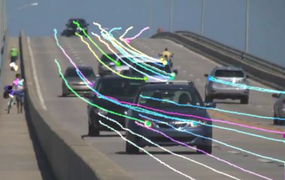
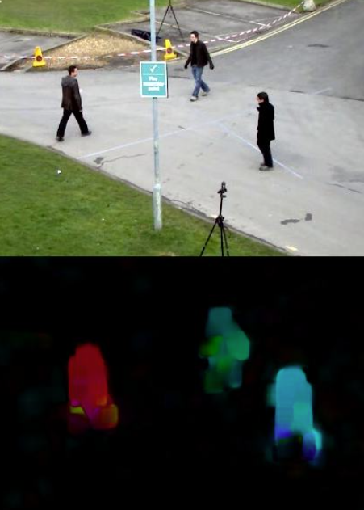
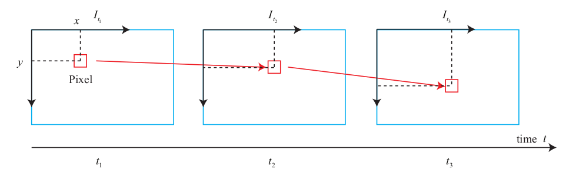
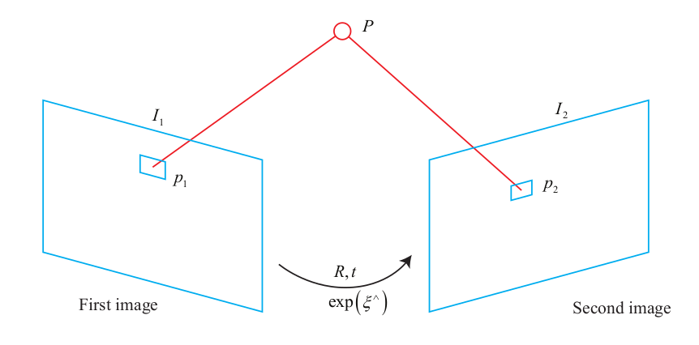

# Optical Flow

* Motivation

Image keypoint localization and descriptor calculation are time-consuming.

By using optical flow to track the motion of the key points, computation on descriptor can be avoided.
The time spent on calculating optical flow itself is less than the descriptor calculation and matching.

Once optical flow successfully tracks a keypoint, there is no more computation on the feature descriptor.

* Definition

Optical flow describes the motion of pixels in the images at different timestamp. 

Given a moving camera, the image coordinates in reference to the object changes accordingly.

The calculation of a part of the pixel’s motion is called *sparse optical flow*, 
and the calculation of all pixels in an image is called *dense optical flow*.

### Sparse vs Dense Optical Flow

* A well-known sparse optical flow method is called *Lucas-Kanade* optical flow

Implementation of sparse optical flow includes finding keypoints of the previous image and linking them to moving curves.

* *Gunnar Farneback's algorithm* is an often used dense optical flow

## Lucas-Kanade Optical Flow

Define images at consecutive timestamps as $\bold{I}(t)$. For a pixel at $(x,y)$, its gray-scale representation is $\bold{I}(x,y,t)$.

* Constant gray scale assumption: 
The pixel’s gray scale is constant in each image.
$$
\bold{I}(x+ dx, y+ dy, t+ dt)
=
\bold{I}(x,y,t)
$$

In a real world scenario, this constant gray scale assumption is false since ambient light has significant impacts on the brightness of an object, even casting a shadow over the object resulting in sharp reduction of pixel value. 

However, in most cases, ambient light environment changes slowly, and approximation can be made by first-order Taylor expansion, such as
$$
\bold{I}(x+ dx, y+ dy, t+ dt)
\approx
\bold{I}(x,y,t)
+\frac{\partial \bold{I}}{\partial x} dx
+\frac{\partial \bold{I}}{\partial y} dy
+\frac{\partial \bold{I}}{\partial t} dt
$$

Consider the constant gray scale condition, here derive
$$
\begin{align*}
&
\frac{\partial \bold{I}}{\partial x} dx
+\frac{\partial \bold{I}}{\partial y} dy
+\frac{\partial \bold{I}}{\partial t} dt
=0
\\ \text{divide by } dt
\Rightarrow \quad &
\frac{\partial \bold{I}}{\partial x} 
\frac{dx}{dt}
+
\frac{\partial \bold{I}}{\partial y} 
\frac{dy}{dt}
=
-\frac{\partial \bold{I}}{\partial t}
\end{align*}
$$
where $\frac{dx}{dt}, \frac{dy}{dt}$ (denoted as $(u,v)$) refer to the speed of the pixel $(x,y)$ motion, 
and $\frac{\partial \bold{I}}{\partial x} , \frac{\partial \bold{I}}{\partial y}$ refer to the gradient of the image with respect to the $x$- and $y$- axis, denoted as $\bold{I}_x, \bold{I}_y$, respectively.
Denote the change rate of image brightness as $\frac{\partial \bold{I}}{\partial t}=\bold{I}_t$.

By the above denotations, the equation can be written in the matrix form
$$
\begin{bmatrix}
    \bold{I}_x &  \bold{I}_y
\end{bmatrix}
\begin{bmatrix}
    u \\
    v
\end{bmatrix}
=
-\bold{I}_t
$$

### Optimal $(u,v)$ Derivation via Least Square Optimization

Consider a window of size $w \times w$ that totally covers $w^2$ pixels. $(u,v)^*$ can be computed via least square optimization over a large window of pixels.

For $k=1,2,...,w^2$, stack each pixel's optical flow, there is
$$
\bold{A} = 
\begin{bmatrix}
    \begin{bmatrix}
        \bold{I}_x &  \bold{I}_y
    \end{bmatrix}_1 \\
    \begin{bmatrix}
        \bold{I}_x &  \bold{I}_y
    \end{bmatrix}_2 \\
    \vdots \\
    \begin{bmatrix}
        \bold{I}_x &  \bold{I}_y
    \end{bmatrix}_{w^2}
\end{bmatrix}
, \quad
\bold{b} = 
\begin{bmatrix}
    \bold{I}_{t_1} \\
    \bold{I}_{t_2} \\
    \vdots \\
    \bold{I}_{t_{w^2}} 
\end{bmatrix}
$$

The whole equation is
$$
\bold{A} \begin{bmatrix}
    u \\
    v
\end{bmatrix}
=
\bold{b}
$$
whose result is
$$
\begin{bmatrix}
    u \\
    v
\end{bmatrix}^*
=
-(\bold{A}^\text{T}\bold{A})^{-1} \bold{A}^\text{T} \bold{b}
$$

The optimal $(u,v)^*$ representing image frame changing speed. Extract the $dt$, then $(\Delta x, \Delta y)^*$ can be computed.

$$
arg \space \underset{\Delta x, \Delta y}{min} \space
\big|\big|
    \bold{I}_k(x,y) - \bold{I}_{k+1} (x+\Delta x, y+\Delta y)
\big|\big|^2
$$

### Multi-Layer Optical Flow

If a camera moves faster and the difference between the two images is obvious, the single-layer image optical flow method can be easily stuck at a local minimum.

## Direct Method for Optical Flow

Lucas-Kanade Optical Flow assumes a static camera monitoring the scene (the transformation between two image frame is $[\bold{R}|\bold{t}]=\bold{0}$). Direct method resolves the issue finding the optimal $[\bold{R}|\bold{t}]^*$.

Consider a spatial point $P$ and camera at two timestamps. 
The world coordinates of $P$ are $[X, Y, Z]$, and the pixel coordinates of its imaging on two cameras are $\bold{p}_1, \bold{p}_2$.

Define $\bold{K}$ as the camera intrinsics and $Z_1, Z_2$ as the depth of the two camera frames to the world point $\bold{P}$. $\bold{p}_1=(x_1,y_1)$ and $\bold{p}_2=(x_2,y_2)$ can be computed as below.

$$
\begin{align*}
\bold{p}_1 &=
\begin{bmatrix}
    x \\
    y \\
    1
\end{bmatrix}_1
=
\frac{1}{Z_1} \bold{K} \bold{P}
\\
\bold{p}_2 &=
\begin{bmatrix}
    x \\
    y \\
    1
\end{bmatrix}_2
=
\frac{1}{Z_2} \bold{K} (\bold{R}\bold{P}+\bold{t})
\end{align*}
$$

The pixel brightness error can be defined as the differences between two image pixels' projection representation of the same world point $\bold{P}$.
$$
e = \bold{I}_1(\bold{p}_1) - \bold{I}_2(\bold{p}_2)
$$

The $\mathcal{L}_2$-norm error to be minimized can be defined as below $\forall e_i = \bold{I}_1(\bold{p}_{1,i}) - \bold{I}_2(\bold{p}_{2,i})$
$$
\begin{align*}
arg \space \underset{[\bold{R}|\bold{t}]}{min} \space
\bold{J}([\bold{R}|\bold{t}]) 
&= 
||\bold{e}||^2
\\ & =
\sum^n_{i=1} e_i^\text{T} e_i
\end{align*}
$$

Denote a pixel $\bold{u}=(x,y)$ on the second camera frame, there is
$$
\bold{u} = 
\frac{1}{Z_2} \bold{K} [\bold{R}|\bold{t}]
$$

Since $\bold{e}$ is a function of the camera frame transformation such as $\bold{e}([\bold{R}|\bold{t}])$, the derivative expression by the perturbation ($\Delta \bold{\xi}$ is a trivial perturbation to $[\bold{R}|\bold{t}]$) is
$$
\frac{\partial\space \bold{e}}{\partial\space [\bold{R}|\bold{t}]}
\approx
-\frac{\partial \bold{I}_2}{\partial \bold{u}}
\frac{\partial \bold{u}}{\partial [\bold{R}|\bold{t}]}
\frac{\partial [\bold{R}|\bold{t}]}{\partial \Delta \bold{\xi}}
$$

The three terms can be computed separately:
* $\frac{\partial \bold{I}_2}{\partial \bold{u}}$: the gray scale gradient at pixel $\bold{u}$
* $\frac{\partial \bold{u}}{\partial [\bold{R}|\bold{t}]}$: the derivative of the projection equation with respect to the three-dimensional point in the camera frame. Set $\frac{\partial \bold{u}}{\partial [\bold{R}|\bold{t}]} = [X,Y,Z]^\text{T}$
$$
\begin{align*}
\frac{\partial \bold{u}}{\partial [\bold{R}|\bold{t}]} &=
\begin{bmatrix}
    \frac{\partial x}{\partial X} &
    \frac{\partial x}{\partial Y} &
    \frac{\partial x}{\partial Z} \\
    \frac{\partial y}{\partial X} &
    \frac{\partial y}{\partial Y} &
    \frac{\partial y}{\partial Z} \\
\end{bmatrix}
\\ &=
\begin{bmatrix}
    \frac{f_x}{Z} & 0 & -\frac{f_x Z}{Z^2} \\
    0 & \frac{f_y}{Z} & -\frac{f_y Y}{Z^2}
\end{bmatrix}
\end{align*}
$$

* $\frac{\partial [\bold{R}|\bold{t}]}{\partial \Delta \bold{\xi}}$ : partial transformation derivative on perturbation

$$
\begin{align*}
\frac{\partial [\bold{R}|\bold{t}]}{\partial \Delta \bold{\xi}} &= 
\begin{bmatrix}
    \bold{I} & [\bold{R}|\bold{t}]^\wedge
\end{bmatrix}
\\ &=
\begin{bmatrix}
    1 & 0 & 0 & 0 & Z & Y \\
    0 & 1 & 0 & -Z & 0 & X \\
    0 & 0 & 1 & -Y & -X & 0
\end{bmatrix}
\end{align*}
$$

For the problem of $n$ points, the Jacobian can be computed given the expression $\frac{\partial\space \bold{e}}{\partial\space [\bold{R}|\bold{t}]}$.
The optimization problem can then employ the Gauss-Newton method or Levenberg-Marquardt method to calculate the increments, until converge to optimum.

### Derivative $\frac{\partial\space \bold{e}}{\partial\space [\bold{R}|\bold{t}]}$ Convergence Discussion 

Image pixel gradient $\frac{\partial \bold{I}_2}{\partial \bold{u}}$ is highly non-convex and is prone to falling down into local minimum, since images often have color changes drastically. 
Scenic views such as trees, roads, rocks, buildings, etc, have distinct color contrasts to each other, so that gradient $\frac{\partial \bold{I}_2}{\partial \bold{u}}=0$ happens many times at different pixel coordinates. 

Keypoint selection $\bold{u}$ can impact the performance a lot.

Constant brightness is a strong assumption. The same keypoints under different ambient light environments have different pixel values.