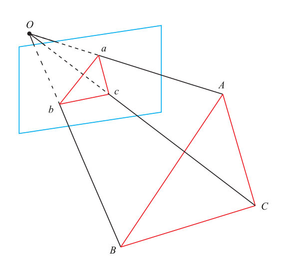
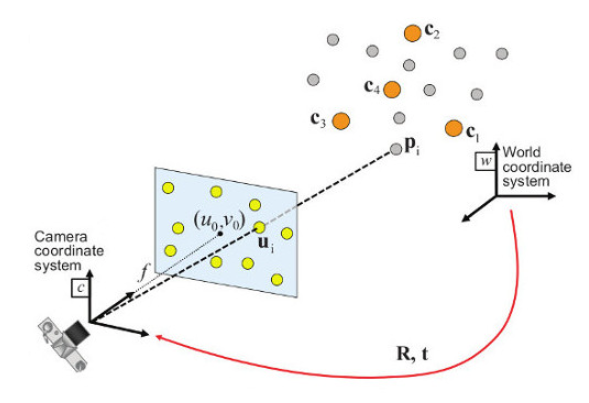

# PnP (Perspective-n-Point) 

PnP (Perspective-n-Point) describes how to estimate the camera’s pose when the a number of 3D space points and their projection positions (image pixels) are known.

The 3D position of the feature point can be determined
by triangulation or the depth map of an RGB-D camera. Therefore, in binocular
or RGB-D visual odometry, PnP can be directly implemented to estimate camera motion.

## Direct Linear Transformation

Consider a 3D spatial point $\bold{p}$ , its homogeneous coordinates are $\bold{P} = (X, Y, Z, 1)^\text{T}$ . In image $I_1$ , it is projected to the feature point $\bold{x}_1=(u_1,v_1,1)^\text{T}$. Define a rotation plus translation matrix $[\bold{R}|\bold{t}]$. Given a scaling factor $s$ and camera intrinsic matrix $\bold{K}$ considered focal length $(f_x, f_y)$ and optical center $(c_x, c_y)$, there is
$$
s \begin{bmatrix}
    u_1 \\
    v_1 \\
    1
\end{bmatrix}
=
\begin{bmatrix}
    f_x & 0 & c_x \\
    0 & f_y & c_y \\
    0 & 0 & 1
\end{bmatrix}
\underbrace{
    \begin{bmatrix}
        t_1 & t_2 & t_3 & t_4 \\
        t_5 & t_6 & t_7 & t_8 \\
        t_9 & t_{10} & t_{11} & t_{12} \\
    \end{bmatrix}
}_{[\bold{R}|\bold{t}]}
\begin{bmatrix}
    X \\
    Y \\
    Z \\
    1
\end{bmatrix}
$$

Set the optical center at the origin $(0,0)$ and focal point to $(1,1)$, such as
$$
\bold{K} = 
\begin{bmatrix}
    f_x & 0 & c_x \\
    0 & f_y & c_y \\
    0 & 0 & 1
\end{bmatrix}
=
\begin{bmatrix}
    1 & 0 & 0 \\
    0 & 1 & 0 \\
    0 & 0 & 1
\end{bmatrix}
=\bold{I}
$$

So that,
$$
\begin{align*}
s u_1 &= 
t_1 X + t_2 Y + t_3 Z + t_4
\\
s v_1 &= 
t_5 X + t_6 Y + t_7 Z + t_8
\\
s &= 
t_9 X + t_{10} Y + t_{11} Z + t_{12}
\end{align*}
$$

By eliminating $s$, there are
$$
\begin{align*}
u_1 &= 
\frac{t_1 X + t_2 Y + t_3 Z + t_4}
{t_9 X + t_{10} Y + t_{11} Z + t_{12}}
\\
v_1 &= 
\frac{t_5 X + t_6 Y + t_7 Z + t_8}
{t_9 X + t_{10} Y + t_{11} Z + t_{12}}
\end{align*}
$$

The above equations can be solved by an overdetermined set of spatial points $\bold{P}$ with SVD to find the least-square solution of $u_1$ and  $v_1$.

## P3P

P3P is another way to solve PnP, requires establishing geometric relationships of the given 3 points. 
Its input data is 3 pairs of 3D-2D matching points.

Define 3D points as $A=(X_A, Y_A, Z_A)$, $B=(X_B, Y_B, Z_B)$, $C=(X_C, Y_C, Z_C)$, 2D points as $a$, $b$, $c$, 
where the point represented by the lowercase letter is the projection of the point on the camera image plane represented by the corresponding uppercase letter.

* Known condition 1: length of $\overrightarrow{AB}, \overrightarrow{AC}, \overrightarrow{BC}$ given by
$$
\begin{align*}
\overrightarrow{AB} &= 
\sqrt{(X_A-X_B)^2+(Y_A-Y_B)^2+(Z_A-Z_B)^2}
\\
\overrightarrow{AC} &= 
\sqrt{(X_A-X_C)^2+(Y_A-Y_C)^2+(Z_A-Z_C)^2}
\\
\overrightarrow{BC} &= 
\sqrt{(X_B-X_C)^2+(Y_B-Y_C)^2+(Z_B-Z_C)^2}
\end{align*}
$$

* Known condition 2: $\angle aOb, \angle aOc, \angle bOc$

Given the projection in homography, a pixel $(u,v)$ on an image can be normalized as $(\frac{X}{Z},\frac{Y}{Z},1)$. Consider an optical center $(c_x, c_y)$ and focal length $(f_x, f_y)$ there are
$$
\begin{align*}
    u &= f_x \frac{X}{Z} + c_x
    \\
    v &= f_y \frac{Y}{Z} + c_y
\end{align*}
$$

Denote three pixels on the image $a=(u_a, v_a, 1), b=(u_b, v_b, 1), c=(u_c, v_c, 1)$, and the vectors $\overrightarrow{OA}, \overrightarrow{OB}, \overrightarrow{OC}$ are the positions of $a, b, c$.

$$
\begin{align*}
cos\angle aOb = \frac{\overrightarrow{Oa} \cdot \overrightarrow{Ob}}{\big|\overrightarrow{Oa} \cdot \overrightarrow{Ob}\big|}
\\
cos\angle aOc = \frac{\overrightarrow{Oa} \cdot \overrightarrow{Oc}}{\big|\overrightarrow{Oa} \cdot \overrightarrow{Oc}\big|}
\\
cos\angle cOb = \frac{\overrightarrow{Oc} \cdot \overrightarrow{Ob}}{\big|\overrightarrow{Oc} \cdot \overrightarrow{Ob}\big|}
\end{align*}
$$

* Known condition 3: geometrical relationship; by the law of cosines, there are
$$
\begin{align*}
    \overrightarrow{OA}^2 + \overrightarrow{OB}^2
    - 2 \space \overrightarrow{OA} \cdot \overrightarrow{OB} \cdot cos\angle aOb
    &= \overrightarrow{AB}^2
    \\
    \overrightarrow{OA}^2 + \overrightarrow{OC}^2
    - 2 \space \overrightarrow{OA} \cdot \overrightarrow{OC} \cdot cos\angle aOc
    &= \overrightarrow{AC}^2
    \\
    \overrightarrow{OB}^2 + \overrightarrow{OC}^2
    - 2 \space \overrightarrow{OB} \cdot \overrightarrow{OC} \cdot cos\angle bOc
    &= \overrightarrow{BC}^2
\end{align*}
$$

* Find $x=\frac{\overrightarrow{OA}}{\overrightarrow{OC}},  y=\frac{\overrightarrow{OB}}{\overrightarrow{OC}}$

To format the above equations and solve for $A,B,C$, perform substitution to remove $\overrightarrow{OC}$.
$$
x=\frac{\overrightarrow{OA}}{\overrightarrow{OC}}, \quad
y=\frac{\overrightarrow{OB}}{\overrightarrow{OC}}
\\
p = \frac{\overrightarrow{AB}^2}{\overrightarrow{OC}^2}=\frac{\overrightarrow{ab}^2}{\overrightarrow{Oc}^2}, \quad
q = \frac{\overrightarrow{BC}^2}{\overrightarrow{AB}^2}=\frac{\overrightarrow{bc}^2}{\overrightarrow{ab}^2}, \quad
g = \frac{\overrightarrow{AC}^2}{\overrightarrow{AB}^2}=\frac{\overrightarrow{ac}^2}{\overrightarrow{ab}^2}, \quad
\\
q \cdot p = \frac{\overrightarrow{BC}^2}{\overrightarrow{OC}^2}=\frac{\overrightarrow{bc}^2}{\overrightarrow{Oc}^2}, \quad
g \cdot p = \frac{\overrightarrow{AC}^2}{\overrightarrow{OC}^2}=\frac{\overrightarrow{ac}^2}{\overrightarrow{Oc}^2}, \quad

$$
where $x$ and $y$ are unknowns but $p,q, g$ are known since they are on the same projection lines.

The result of the substitution is
$$
\begin{align*}
x^2+y^2-2 x y \space cos \angle aOb - p &= 0
\\
y^2+1^2-2 y \space cos \angle bOc -  q \cdot p &= 0
\\
x^2+1^2-2 x \space cos \angle aOc -  g \cdot p &= 0
\end{align*}
$$

Take another substitution work removing $p$, there is
$$
\begin{align*}
(1-q)y^2 - qx^2 - 2 y \space cos\angle bOc + 2 q x y \space cos\angle aOb + 1 = 0
\\
(1-g)x^2 - gy^2 - 2 x \space cos\angle aOc + 2 g x y \space cos\angle aOb + 1 = 0
\end{align*}
$$

The two quadratic equations above can be solved via Wu's method for $x$ and $y$, that describe the ratio 

### Constraint: $O, A, B, C$ should NOT be on the same plane

If $O, A, B, C$ are the same plane, the determinant should be zero.
$$
\begin{array}{|cccc|}
    X_A & Y_A & Z_A & 1 \\
    X_B & Y_B & Z_B & 1 \\
    X_C & Y_C & Z_C & 1 \\
    0 & 0 & 0 & 1 \\
\end{array}
=
0
$$

### Practices

In SLAM, the usual approach is to first estimate the camera pose using P3P/EPnP and then construct a least-squares optimization problem to adjust the estimated values (bundle adjustment).

## Solve PnP by Minimizing the Reprojection Error (a.k.a Bundle Adjustment)

Suppose there are $n$ known 3D space points $\bold{P}$ (denote the element as $\bold{P}_i=(X_i, Y_i, Z_i)^\text{T}$) on the world frame, 
and their projection (projected pixel coordinates denoted as $\bold{x}_i=[u_i, v_i]^\text{T}$) on an image, we want to calculate the transform from the world coordinates to camera coordinates $\bold{P}'=\big[\bold{R}|\bold{t} \big]\bold{P}$.
$$
s_i \begin{bmatrix}
    u_i \\
    v_i \\
    1
\end{bmatrix}
=
\bold{K} \big[\bold{R}|\bold{t} \big]
\begin{bmatrix}
    X_i \\
    Y_i \\
    Z_i \\
    1
\end{bmatrix}
$$

### Reprojection Error

Here defines a least-squared optimization problem, where $\bold{e}_i=\bold{x}_i - \frac{1}{s_i} \bold{K} \big[\bold{R}|\bold{t} \big] \bold{P}_i$ refers to the discrepancy between the observed pixel location and the projected object point on the camera image via the transformation $\frac{1}{s_i} \bold{K} \big[\bold{R}|\bold{t} \big]$.

$$
\big[\bold{R}|\bold{t} \big]^* = 
arg \space \underset{\big[\bold{R}|\bold{t} \big]}{min}
\frac{1}{2} \sum^n_{i=1}
\bigg|\bigg|
  \bold{x}_i - \frac{1}{s_i} \bold{K} \big[\bold{R}|\bold{t} \big] \bold{P}_i
\bigg|\bigg|^2_2
$$

The optimization error $\bold{e}$ to an optimal $\big[\bold{R}|\bold{t} \big]^*$ can be approximated by the Jacobian shown as below, where $\Delta \big[\bold{R}|\bold{t} \big]$ is the increment to $\big[\bold{R}|\bold{t} \big]$ until converged to the global minimum of the above quadratic function. $\bold{J}$ is the step of the increment at each iteration. 

$$
\bold{e}(\big[\bold{R}|\bold{t} \big]+\Delta \big[\bold{R}|\bold{t} \big]) \approx
\bold{e}(\big[\bold{R}|\bold{t} \big])+\bold{J}^{\text{T}} \Delta \big[\bold{R}|\bold{t} \big]
$$
where $\bold{e}$ can be the pixel coordinate error ($2$-d) and $\bold{x}$ is the camera pose ($6$-d), $\bold{J}^{\text{T}}$ is of a matrix size $2 \times 6$. 

### Perturbation Model and $\bold{J}^{\text{T}}$ Derivation

Define the coordinates of the space point in the camera
frame as $\bold{P}'$ transformed by $\big[\bold{R}|\bold{t} \big]$ from a world frame point $\bold{P}$, and take out the first 3 dimensions:
$$
\bold{P}' = \big(\big[\bold{R}|\bold{t} \big] \bold{P} \big)_{1:3}
=
[X', Y', Z']^\text{T}
$$

For $\bold{x}=[u, v, 1]^\text{T}$, there is the mapping from the camera frame point to the pixel position, such as
$$
\begin{align*}
s\bold{x} &= \bold{K} \bold{P}'
\\    
s \begin{bmatrix}
    u \\
    v \\
    1
\end{bmatrix}
&=
\begin{bmatrix}
    f_x & 0 & c_x \\
    0 & f_y & c_y \\
    0 & 0 & 1
\end{bmatrix}
\begin{bmatrix}
    X' \\
    Y' \\
    Z'
\end{bmatrix}
\end{align*}
$$

Eliminating $s$ gives the exact result of a pixel representation on an image.
$$
\begin{align*}
    u &= f_x \frac{X'}{Z'} + c_x
    \\
    v &= f_y \frac{Y'}{Z'} + c_y
\end{align*}
$$

When the error is found, then to compare the $u$, $v$ here with the measured value to find the difference.

Define the perturbation as $\Delta\bold{\xi}$, by the rule of left perturbation multiplication in Lie algebra, there is
$$
\begin{align*}
\frac{\partial \bold{e}}{\partial \Delta\bold{\xi}}
&=
\underset{\Delta\bold{\xi} \rightarrow 0}{lim}
\frac{\bold{e}(\Delta\bold{\xi} \oplus \bold{\xi})-\bold{e}(\bold{\xi})}{\Delta\bold{\xi}}
\\ &=
\frac{\partial \bold{e}}{\partial \bold{P}'}
\frac{\partial \bold{P}'}{\partial \Delta\bold{\xi}}
\end{align*}
$$
where
$$
\begin{align*}
\frac{\partial \bold{e}}{\partial \bold{P}'}
&=
- \begin{bmatrix}
    \frac{\partial u}{\partial X'} &
    \frac{\partial u}{\partial Y'} &
    \frac{\partial u}{\partial Z'} \\
    \frac{\partial v}{\partial X'} &
    \frac{\partial v}{\partial Y'} &
    \frac{\partial v}{\partial Z'}
\end{bmatrix}
\\ &=
- \begin{bmatrix}
    \frac{\partial (f_x \frac{X'}{Z'} + c_x)}{\partial X'} &
    \frac{\partial (f_x \frac{X'}{Z'} + c_x)}{\partial Y'} &
    \frac{\partial (f_x \frac{X'}{Z'} + c_x)}{\partial Z'} \\
    \frac{\partial (f_y \frac{Y'}{Z'} + c_y)}{\partial X'} &
    \frac{\partial (f_y \frac{Y'}{Z'} + c_y)}{\partial Y'} &
    \frac{\partial (f_y \frac{Y'}{Z'} + c_y)}{\partial Z'}
\end{bmatrix}
\\ &=
- \begin{bmatrix}
    \frac{f_x}{Z'} & 0 & -\frac{f_x X'}{Z'^2} \\
    0 & \frac{f_y}{Z'} & -\frac{f_y Y'}{Z'^2} \\
\end{bmatrix}
\end{align*}
$$

and, this term $\frac{\partial \bold{P}'}{\partial \Delta\bold{\xi}}$ is the derivative of the transformed point with respect to the Lie algebra such that
$$
\begin{align*}
\frac{\partial \bold{P}'}{\partial \Delta\bold{\xi}}
&=
\frac{\partial \big[\bold{R}|\bold{t}\big] \bold{P}}{\partial \Delta\bold{\xi}}
\\ &=
\begin{bmatrix}
    \bold{I} & -\bold{P}'^{\wedge} \\ 
    \bold{0} & \bold{0}
\end{bmatrix}
\end{align*}
$$
where 
$$
\begin{align*}
\bold{P}'^{\wedge}
&=
\begin{bmatrix}
    0 & Z' & Y' \\
    -Z' & 0 & -X' \\
    -Y' & X' & 0
\end{bmatrix}
\end{align*}
$$

Combined, and removed $\bold{0}$ from $\frac{\partial \bold{P}'}{\partial \Delta\bold{\xi}}$, there is
$$
\begin{align*}
\frac{\partial \bold{e}}{\partial \Delta\bold{\xi}}
&=
\frac{\partial \bold{e}}{\partial \bold{P}'}
\frac{\partial \bold{P}'}{\partial \Delta\bold{\xi}}
\\ &=
- \begin{bmatrix}
    \frac{f_x}{Z'} & 0 & -\frac{f_x X'}{Z'^2} \\
    0 & \frac{f_y}{Z'} & -\frac{f_y Y'}{Z'^2} \\
\end{bmatrix}
\begin{bmatrix}
    1 & 0 & 0 & 0 & -Z' & -Y' \\
    0 & 1 & 0 & Z' & 0 & X' \\
    0 & 0 & 1 & Y' & -X' & 0
\end{bmatrix}
\\ &=
-\begin{bmatrix}
    \frac{f_x}{Z'} & 0 & -\frac{f_x X'}{Z'^2} &
    -\frac{f_x X' Y'}{Z'^2} & f_x + \frac{f_x X'^2}{Z'^2} & -\frac{f_x Y'}{Z'}
    \\
    0 & \frac{f_y}{Z'} & -\frac{f_y Y'}{Z'^2} &
    -f_y - \frac{f_y Y'^2}{Z'^2} & \frac{f_y Y'X'}{Z'} & \frac{f_y X'}{Z'}
    
\end{bmatrix}
\end{align*}
$$

This Jacobian matrix $\bold{J}=\frac{\partial \bold{e}}{\partial \Delta\bold{\xi}}$ describes the first-order derivative of the reprojection error
with respect to the left perturbation model.

The negative sign in the front is kept
because the error is defined by the observed value minus the predicted value.

### Spatial Point Optimization

The derivative of error $\bold{e}$ with respect to a spatial point $\bold{P}$ can be computed by introducing the image projection $\bold{P}'$.

$$
\frac{\partial \bold{e}}{\partial \bold{P}}
=
\frac{\partial \bold{e}}{\partial \bold{P}'}
\frac{\partial \bold{P}'}{\partial \bold{P}}
$$
where
$$
\bold{P}'=\big(\big[\bold{R}|\bold{t}\big] \bold{P}\big)_{1:3}
= \bold{R}\bold{P}+\bold{t}
$$

So that
$$
\begin{align*}
\frac{\partial \bold{e}}{\partial \bold{P}}
&=
- \begin{bmatrix}
    \frac{f_x}{Z'} & 0 & -\frac{f_x X'}{Z'^2} \\
    0 & \frac{f_y}{Z'} & -\frac{f_y Y'}{Z'^2} \\
\end{bmatrix}
\frac{\partial \big(\bold{R} \bold{P} + \bold{t}\big)}{\partial \bold{P}}
\\ &=
- \begin{bmatrix}
    \frac{f_x}{Z'} & 0 & -\frac{f_x X'}{Z'^2} \\
    0 & \frac{f_y}{Z'} & -\frac{f_y Y'}{Z'^2} \\
\end{bmatrix}
\bold{R}
\end{align*}
$$