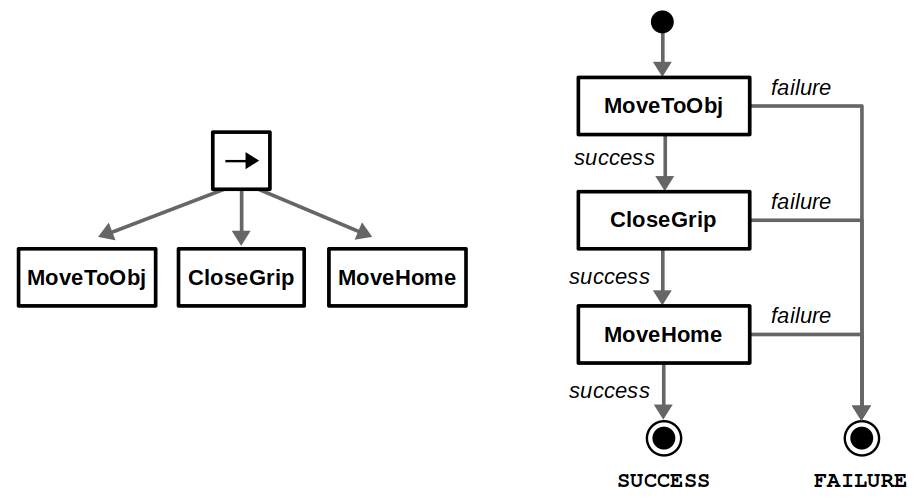

# Behavior Tree (BT) and Hierarchical Finite State Machine (HFSM) 

## State Machine

A state machine describes the relationship/edge/trigger conditions between different nodes/events/states.

## Behavior Tree

A behavior tree is a tree structure defining state transition.

### Advantages over state machine

* Stream-lined logic

The logic is easy to maintain and is reader-friendly

* Reusability and inheritance

Parent nodes can share data among its children, hence promote reusability and resource-friendliness