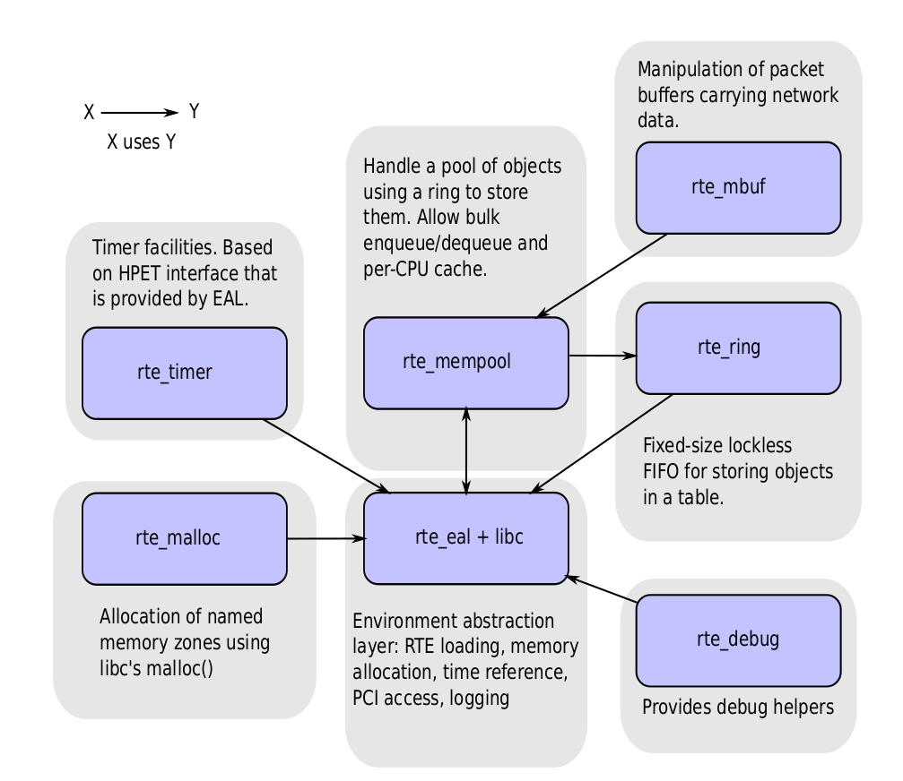
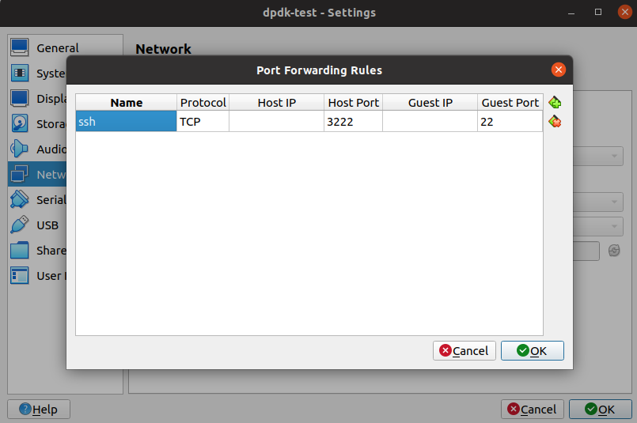
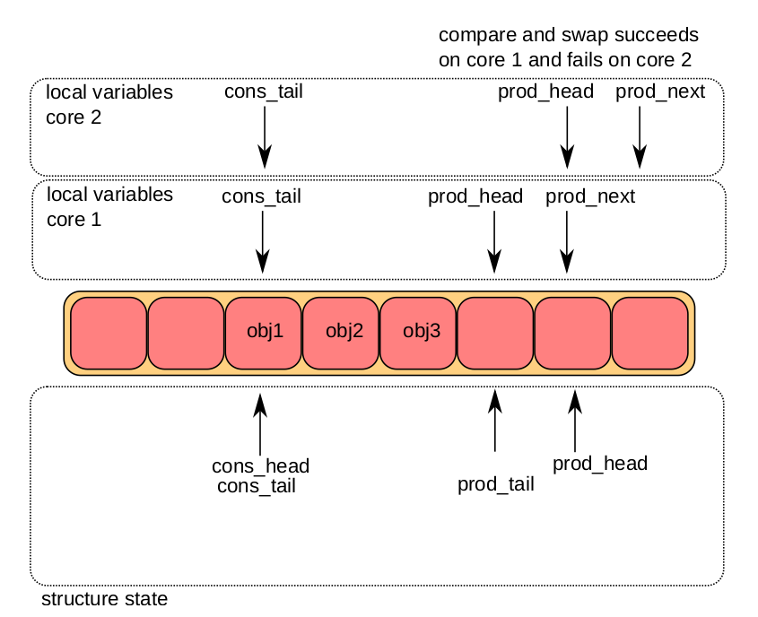
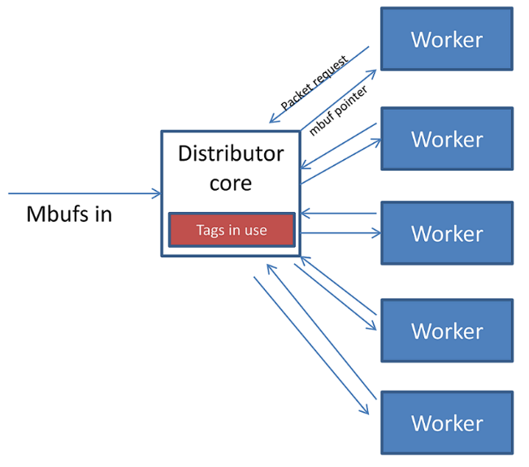
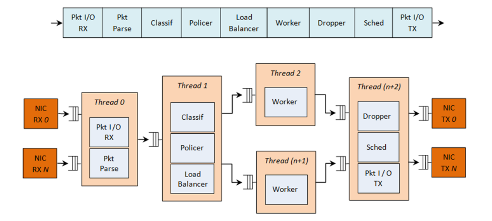

# Data Plane Development Kit (DPDK)

The Data Plane Development Kit (DPDK) is an open source software project managed by the Linux Foundation (initially launched in 2010 by Intel). 
It is basically an enhancement patch of many Linux modules for low latency packet processing, such as kernel bypass for fast network packet processing (supported User-Space I/O (UIO)), CPU core affinity, TSC for timing, etc.

DPDK is built on Environment Abstraction Layer (EAL) that takes into consideration hardware architectures such as x86, that are collectively abstracted as unified APIs for use.


<div style="display: flex; justify-content: center;">
      
</div>
</br>

Typical performance issues of Linux handling network packets (Issues about I/O high-throughput)

* Interrupt including hardware and software: disturbing how OS arranges 
* Kernel/user space memory copy: data through hardware NIC to DMA to kernel allocated buffer, then copied to user space, which is expensive, estimated consumed more than $50\%$ of the packet process time
* Context Switch
* Cache miss: Linux implements $1024$-entry $4$ KB pages that cover $4$ MB of virtual memory ($4$ bytes per one pointer/entry); page size can be increased to larger size covering more virtual memory.
* CPU locality: CPU1 may be working for user space; CPU2 may be working for kernel space, cross-CPU communication can be costly (addressable by CPU affinity)

DPDK has the below advantages:

* UIO (User-space IO) TCP/UDP Process

Linux has two separate spaces: user space and kernel space. For example, in Linux socket, tcp packets received from NIC first arrives at kernel space then copied to user space. 
Kernel bypass means no engagement of kernel operations but directly retrieving data from NIC to user space. 

Linux: NIC hardware interrupt -> DMA copying hardware TCP/UPD data to kernel space for kernel thread handling -> software interrupt -> kernel space process by TCP/UDP standard -> notify user to get the data -> copy to user space (retrievable by `recv`)

DPDK: NIC hardware interrupt -> user space through UIO mapping directly accessing the hardware TCP/UPD data -> user space process by TCP/UDP standard -> user can now use the TCP/UDP data

* Memory Pool

Implemented non-memory-copy between user space vs kernel space, that only ownership is transferred to user from kernel, not  full data copy.

* Big Page

Application can use DPDK APIs to allocate large memory from one page.

* Lockfree Ring Buffer

* Poll-mode NIC rather than traditional hardware interrupt

* CPU Affinity and Multi-core resource scheduling

Master core handles initialization work; worker cores handle business logic

## Quick Start

Set up virtual machine as a host for test (reference: https://www.youtube.com/watch?v=0yDdMWQPCOI):

* Install a virtual machine (e.g., Oracle Virtual Machine)
* Install a Linux server to the virtual machine (e.g., ubuntu 20.04 server)

For Virtualbox, Config `Network`->`Adapter`->`Advanced`->`Port Forwarding`

<div style="display: flex; justify-content: center;">
      
</div>
</br>

From host machine, now can login into the virtual machine.
```bash
ssh -p 3222 yuqi@127.0.0.1
```

* (optional) set up ssh for convenient login

By `ssh-keygen -t ed25519` on the virtual machine, should see private key `id_ed25519`  and public key `id_ed25519.pub`.
```bash
yuqi@yuqidpdk:~/.ssh$ ls
authorized_keys  id_ed25519  id_ed25519.pub
```

Copy the content of the public key to `authorized_keys` such that `cat id_ed25519.pub >> authorized_keys`
From now on, `ssh` needs no password to login into the virtual machine.

* Install build tools on virtual machine host

```bash
sudo apt install net-tools build-essential
sudo apt-get install ninja-build meson python3-pyelftools python-pyelftools libnuma-dev pkgconf
```

* Download DPDK on virtual machine host

```bash
wget https://fast.dpdk.org/rel/dpdk-22.11.2.tar.xz
tar xf dpdk-22.11.2.tar.xz
cd dpdk-22.11.2.tar.xz
```

* Install DPDK

```bash
meson -Dexamples=all build
ninja -C build 
sudo ninja install
```

* Config DPDK

Config device bindings:
```bash
sudo ldconfig
sudo dpdk-devbind.py -s | grep uio_pci_generic # checking device binding, must have one uio available
```

Config huge page:
```bash
sudo -s
mkdir -p /dev/hugepages
mountpoint -q /dev/hugepages || mount -t hugetlbfs nodev /dev/hugepages
echo 64 > /sys/devices/system/node/node0/hugepages/hugepages-2048kB/nr_hugepages
exit
```

* Testing

```bash
cd ~/dpdk-stable-22.11.2/build/examples
sudo ./dpdk-helloworld
```

## Major Components

### Malloc

Two processes of malloc:

* `struct malloc_heap` - used to track free space on a per-socket basis such as applying lock on mem block

* `struct malloc_elem` - the basic element of allocation and free-space tracking inside the library, used as a generic header structure for various blocks of memory in a memzone linked in a list data structure, where 
  * `heap` - this pointer is a reference back to the heap structure from which this block was allocated.
  * `prev` points to the header element/block in the memzone immediately behind the current one,
  * `next_free` is used to chain the free-list `free_list` of unallocated memory blocks together.

When an application makes a call to a malloc-like function, the malloc function will
1. index the `lcore_config` structure for the calling thread
2. determine the NUMA node idea of that thread
3. if memzone not init, init it
4. scan the free-list for the heap
5. find a suitable size of a free element
6. calculating and inserting header splitting the mem element

To free an area of memory
1. the pointer to the start of the data area is passed to the free function
2. perform size computation on to be freed memory block
3. merge adjacent memory blocks

### Lockfree Ring Buffer

The ring structure is composed of two head and tail couples; 
one is used by producers and one is used by the consumers.

There can be multiple producers/consumers.

The ring can have a high water mark (threshold). 
Once an enqueue operation reaches the high water mark, the producer is notified, if the water mark is configured.

The figure below illustrates how pointers are moved to add/remove objects to/off the ring buffer.
If there are multiple producers/consumers, CAS operation is taken to ensure atomicity.

<div style="display: flex; justify-content: center;">
      
</div>
</br>

### MemPool

A memory pool is an allocator of a fixed-sized object. 
In the DPDK, it is identified by name and uses a ring to store free objects. 
It provides some other optional services such as a per-core object cache and an alignment helper to ensure that objects are padded to spread them equally on all DRAM or DDR3 channels.

It has the below additional implementations
* Padding for memory alignment
* local cache that when having received many access requests, temporarily hold them in cache, then perform bulk updates on ring buffer. Otherwise, for each one request locking one ring buffer element, it would be time-consuming

### Poll Mode Driver (PMD)

A Poll Mode Driver (PMD) consists of APIs, provided through the BSD driver running in user space, to configure the devices and their respective queues. 
In addition, a PMD accesses the RX and TX descriptors directly without any interrupts (with the exception of Link Status Change interrupts) to quickly receive, process and deliver packets in the user’s application.

* *run-to-completion* model: polling on a specific port’s RX descriptor ring, same core processes the data as well as writing to TX descriptor ring
* *pipe-line* model: one core polls one or more port’s RX descriptor ring; packets are received and passed to another core via a ring.

Depending on driver capabilities advertised by `rte_eth_dev_info_get()`, the PMD may support hardware offloading feature like checksumming, TCP segmentation or VLAN insertion.

A packet is represented by an `rte_mbuf` structure, which is a generic metadata structure containing all necessary housekeeping information. 
This includes fields and status bits corresponding to offload hardware features, such as checksum computation of IP headers or VLAN tags.

### Hash

DPDK has its own hash implementation.

To speed up the search logic within the bucket, each hash entry stores the 4-byte key signature together with the full key for each hash entry (large key matching is time-consuming).
THe short 4-byte key is searched first.

### Longest Prefix Match (LPM)

Longest Prefix Match (LPM) can be dedicated for 32-bit keys that is typically used to find the best route match in IP forwarding applications.

The main data structure is built using the following elements 
(for packet forwarding, for broadcast there is no need of keeping too granular detail of IP, only $24$ bits are enough to maintain the lookup table in CPU's cache):
* A table with $2^{24}$ entries.
* A number of tables (RTE_LPM_TBL8_NUM_GROUPS) with $2^8$ entries.

The LPM algorithm is used to implement Classless Inter-Domain Routing (CIDR) strategy used by routers implementing IPv4 forwarding.

### Packet Load Balancer/Distributor

The logical cores in use are to be considered in two roles: 
* firstly a distributor lcore, which is responsible for load balancing or distributing packets
* a set of worker lcores which are responsible for receiving the packets from the distributor and operating on them.

<div style="display: flex; justify-content: center;">
      
</div>
</br>

1. Packets are passed to the distributor component by having the distributor lcore thread call the `rte_distributor_process()` API
2. The worker lcores all share a single cache line with the distributor core in order to pass messages and packets to and from the worker.
3. Distributor examines the “tag” – stored in the RSS hash field in the `mbuf` – for each packet and records what tags are being processed by each worker.

### Thread safety issues:
* safe if each thread performs I/O on a different NIC queue
* not safe if multiple threads are to use the same hardware queue on the same NIC port, locking is required
* It is recommended that DPDK libraries are initialized in the main thread at application startup rather than subsequently in the forwarding threads.

### Quality of Service (QoS)

In a complex scenario where threads are only used to dedicate handling one task, the pipeline design can be shown as below.

<div style="display: flex; justify-content: center;">
      
</div>
</br>

* Policer: packet metering
* Droppper: congestion management when congestion is experienced, lower priority packets are dropped first.
* Sched: packet sending scheduling such as by Round Robin

## Practices

For specific functions that are called often, it is also a good idea to provide a self-made optimized function, which should be declared as static inline.

It is better to use a memory pool of fixed-size objects.
The `rte_malloc()` function provides several services that increase performance, such as memory alignment of objects, lockless access to objects, NUMA awareness, bulk get/put and per-lcore cache.


## ANS (Accelerated Network Stack)