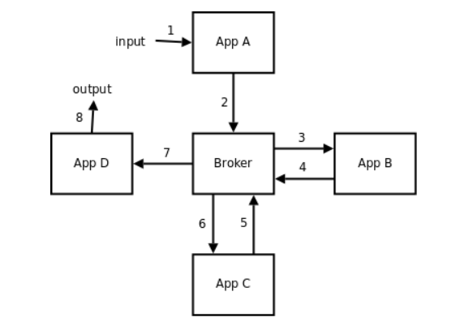
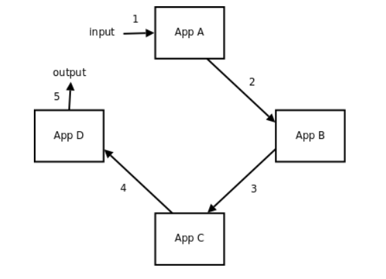
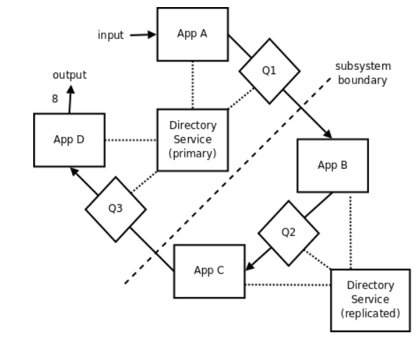

# Message Queue

Message queuing allows applications to communicate by sending messages to each other. 
Message queue provides temporary message storage when the destination program is busy or not connected.

### Broker vs No Broker

* Broker

Architecture of most messaging systems is distinctive by the messaging server ("broker") acted as a central message delivery hub (such as ROS' master node).

Publishers and listeners do not know the addresses of each other, only deliver messages to the hub.

Drawback is that, hub can be a single point failure, and messages routing to hub then to listeners incurs excessive network burden.

      

 

* No Broker

Each app only knows limited number of addresses of other apps.
Without a prior known route table, it needs to traverse various apps to find the address of its message's destination address.

      

 

Distributed Directory Service (DDS) is the solution where directory service maintains route tables.
The directory service servers can copy from each other.
There should be more than one directory service servers to avoid single point failure.

In the example below, `Qi` is the message queue channel.
Directory service tells `App A` how to reach `App D` (assumed no direct message queue channel established in between).

      

 

### Formatting and Serialization (`printf` vs `std::cout`)

Serialization is a method converting objects into binary format.

`std::cout` is an object of class `ostream` that represents the standard output stream oriented to narrow characters (of type char). 
It corresponds to the C stream stdout.
It needs overloading `operator <<` abuse of `iostream`, this adds complexity but provides good extensibility.

`printf` is fast (fewer lines of compiled assembly code) and portable friendly.

## Message Queue and Multi-Threading

### From Linux TCP to Socket

Once a TCP packet finishes processing by Linux, it would be stored in one of the queue below
1. packets in flight
2. backlog
3. prequeue
4. receive_queue

Then, when `recv(int sockfd, void *buf, size_t len, int flags);` gets called, 
TCP packet's data is copied from kernel TCP queues' buffer to the user defined buffer `buf` by user specified number  of bytes `len`.

### Lock-Free Message Queue (Array)

## Protobuf

Protocol Buffers serialize structured data so it can be efficiently stored or shared over a network. 

### Quick Start

### Protobuf Version Compatibility
