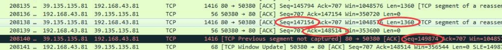
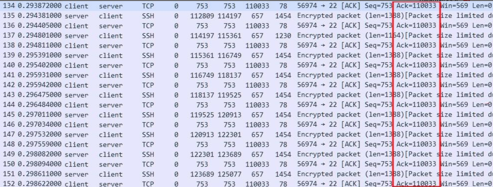
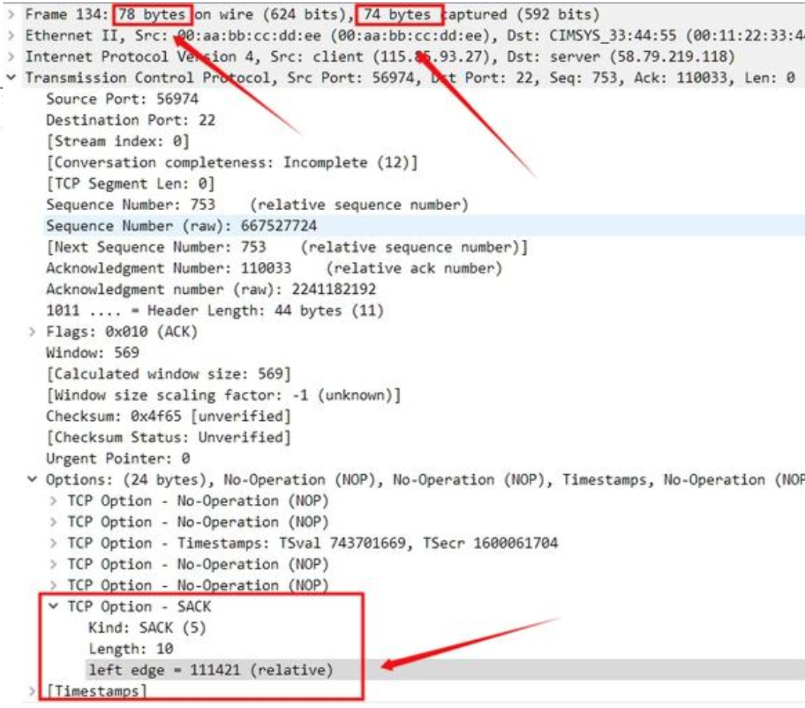
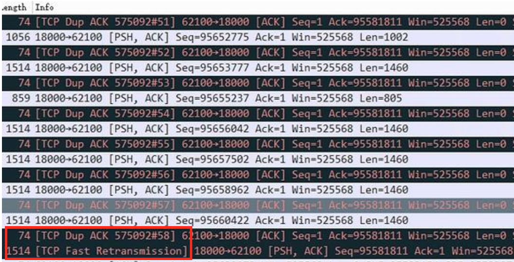

# TCP/UDP Packet Treansmission Analysis

TCP given its sequence num, if packet transmission loss happens, it can be detected.

### `tcpdump` for Data Capture

Capture all data arrived at network card `eth0` and write to `result.cap` file.
```bash
tcpdump -i eth0 -w result.cap
```

Capture all data arrived at ip `192.168.1.100` and write to `result.cap` file.
```bash
tcpdump host "192.168.1.100" -w result.cap
```

tcpdump file can be used by WireShark for network packet analysis.

### Round-trip time (RTT)

*Round-trip time (RTT)* is the amount of time it takes for a signal to be sent plus the amount of time it takes for acknowledgement of that signal having been received.

In TCP, it means how long it takes to receive an ACK to data/REQ that was sent.

## TCP Packet Out-Of-Order Arrival

There are a server `39.135.135.81:80` (public interface, likely nginx, etc.) and a internal server `192.168.43.81:50380`.

For a TCP packet of a seq num `Seq=147154` and length `Len=1360`.
The next expected seq should be `Seq=147154+1360=148514`.
This is confirmed by the next ACK `Ack=148514` sent from server.

However, the next actual received TCP packet is of `Seq=149874`.
There are TCP packets lost in transmission.

<div style="display: flex; justify-content: center;">
      
</div>
</br>

In WireShark, the above screenshot may flag `[TCP Out-Of-Order]` or `[TCP Previous segment not captured]` warnings.

## TCP Duplicate ACKs

Below is a screenshot of WireShark found duplicate ACKs, where there are multiple ACKs acknowledging one sequence num.

<div style="display: flex; justify-content: center;">
      
</div>
</br>

* Problem One: No TCP option SACK hence no duplicate ACK display.

WireShark displays `DUP ACK` when there are multiple ACKs acknowledging one TCP packet sequence num.
However, the above screenshot has no such info.

WireShark of diff versions has diff strategies displaying ACKs.
The latest version checks SACKs.

A correct size of an SACK should have 78 bytes rather than 74 bytes.
This causes WireShark failed to parse SACKs.

<div style="display: flex; justify-content: center;">
      
</div>
</br>

* Problem Two: Check if receiver has capacity to consume data

A receiver usually has a msg parser that extracts data from buffer and there should be relavant logs pertaining to data extraction process.

If receiver does not have adequate capacity to process msg,

-> see if log stuck at one particular msg process (this msg is wrong, triggered expensive exception handling)

-> should observe high CPU usage (or not if there is waiting logic in code such as waiting for DB write/read result confirmation before next packet extraction)

-> and in log see partial packet loss and buffer is almost full (detected in logic such as `if (buffer.getLength() > bufferThreshold) { ... }`).

-> might in a few mili-seconds later bulk process many packets (there have been many packets received from sender accumulated in buffer not yet processed)

If internet traffic is bad

-> should see many duplicate ACKs from receiver (indicating receiver has received many out of order TCP packets, but only acknowledging the previous TCP packets), but no fast retransmission happens (indicating sender not received ACKs).

* Problem Three: There should be fast re-transmission

Retransmission sends data by ACK/SACK $\text{next_tcp_seq_no} = \text{this_ack_no} + \text{next_tcp_length}$ that indicate possible packet loss.

A normal retransmission happens after timeout not receiving expected ACK in time.

When the sender receives 3rd duplicate ACKs, fast retransmission assumes that the packet is lost and retransmits that packet without waiting for a retransmission timer to expire.

Recall that ACK only acknowledges previous TCP packets, repeated same ACK indicates that $\text{next_tcp_seq_no} = \text{this_ack_no} + \text{next_tcp_length}$ is lost.

Linux by default triggers fast retransmission after three duplicate ACKs.
However, there is no fast retransmission triggered as observed in the above screenshot.

Having seen many same ACKs from receiver but no fast retransmission, likely, the sender does not receive the ACKs hence not triggered fast retransmission.
The traffic is bad.

Usually under this condition, after a while, some mili-seconds later, should see WireShark labelled *fast retransmission*.
<div style="display: flex; justify-content: center;">
      
</div>
</br>

## UDP

UDP does not have ACKs acknowledging if packets are received by the counterparty.
Users should implement checking mechanism by themselves.

* Heartbeat

In UDP transmission there is a heartbeat mechanism (TCP) to check is the counterparty's server is functioning.

* Host Reachability

To use UDP, should first run a series of checks to see if host is reachable.

`ping 119.x.x.90` can send ICMP packets to check if host is reachable.

Check `<host>+<port>` 

## TCP/UDP and Maximum Transmission Unit (MTU)

TCP/UDP needs disaeembling/reassembling in DataLink layer.
A DataLink layer frame has a payload size of 1500 bytes.

If TCP/UDP's payload is larger than 1500 bytes, there is a risk of data loss in the DataLink layer transmission.

### UDP DataLink Layer Data Loss

From the receiver side, if UDP sees diff sizes before and after reassembling in Datalink layer, the receiver does NOT receive any data from the whole UDP packet.

In other words, if a UDP packet is made up of many DataLink layer frames, even just one frame is lost, the whole UDP is lost in the receiver's UDP buffer.