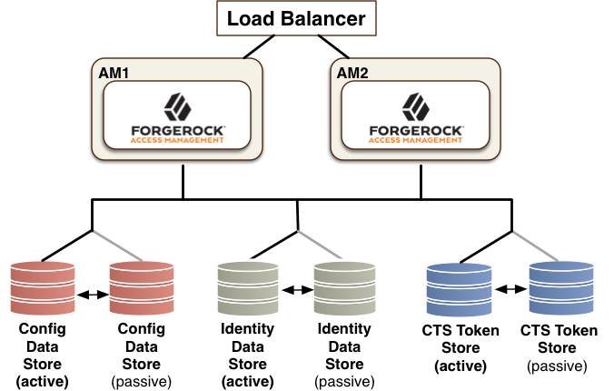

# ForgeRock

## OpenAM and OpenDJ Arch

Best architecture practice:


### ssoadm

ssoadm is admin console tool for various configuration.

```bash
./ssoadm update-agent -e [realmname] -b [agentname] -u [adminID] -f [passwordfile] -a com.sun.identity.agents.config.agent.protocol=[protocol]
```
