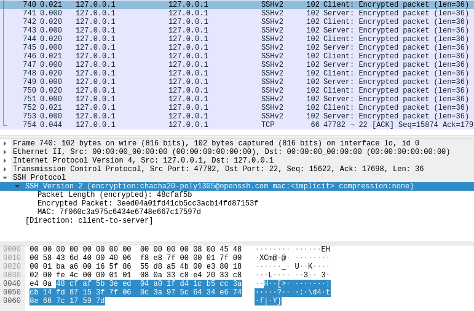

# SSH (Secure Shell)

SSH provides secure communication between computers.

SSH usually runs over TCP.

It sought to address the security lapses of Telnet, a protocol that allows one computer to log into another on the same open network.

## Quick Setup

1. Generate key pair by ssh (choose no passphrase) on local computer.

```bash
ssh-keygen -t rsa
```

The above cmd should produce two files.

```bash
# on local computer
$HOME/.ssh/id_rsa # Your private RSA key
$HOME/.ssh/id_rsa.pub # Your public RSA key
```

2. Share the `id_rsa.pub` to the remote server.

The remote server should have `ssh` already installed.
Usually, it is copied to the below file.

```bash
# on remote server
$HOME/.ssh/authorized_keys
```

Use the same `id_rsa`/`id_rsa.pub` pair for multiple remote servers.
This means sharing the same `id_rsa.pub` to multiple servers rather than repeatedly generating key pairs by `ssh-keygen`.

3. Find if the remote server host has already existed in local computer.
If so, delete it.

```bash
# on local computer
cat /Users/$HOME/.ssh/known_hosts | grep '<remote_host>'
```

4. The remote server should have its `id_rsa.pub` copied to local computer to `authorized_keys`.

```bash
# on local computer
$HOME/.ssh/authorized_keys
```

This step might be auto completed for some open-to-public servers such as `github.com`.

Now, ssh should work as per above setup.

## The Underlying Mechanism

SSH protocol starts building from *transport layer*, typically over TCP.
The SSH protocol is composed of the below three protocols over TCP.

* The Secure Shell (SSH) Transport Layer Protocol (rfc4253)

This protocol runs over TCP, and it can be used as a basis for a number of secure network services.
It provides strong encryption, server authentication, and integrity protection.

Key exchange method, public key algorithm, symmetric encryption algorithm, message authentication algorithm, and hash algorithm are all negotiated.

* The Secure Shell (SSH) Authentication Protocol (rfc4252)

This protocol runs over rfc4253, and it provides a single authenticated tunnel for the SSH connection protocol.
The authentication methods include public key, password, etc.

* The Secure Shell (SSH) Connection Protocol (rfc4254)

This protocol runs over rfc4253 and rfc4252, and it provides interactive login sessions, remote execution of commands, forwarded TCP/IP connections, and forwarded X11 connections, that are multiplexed into one tunnel.

### SSH Packet

One SSH packet is shown as below: length + payload (up to 32,768 bytes each) + MAC addr

<div style="display: flex; justify-content: center;">
      
</div>
</br>