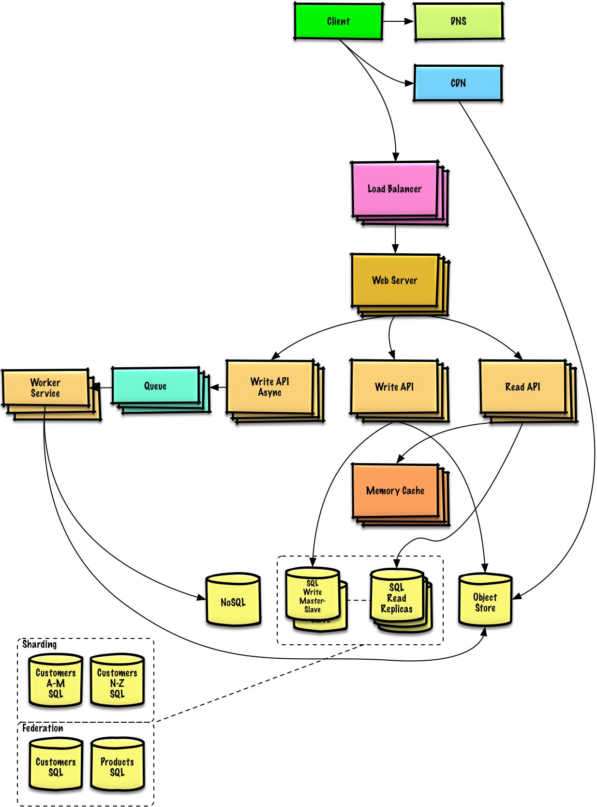

# System Design: High-Performance Web Server System

      

 

## Some Principles

## Routing

### Domain Name System (DNS)

### Content Delivery Network (CDN)

## Load Balancer and Proxy

### SSL Decryption

### Proxy

## MQ as Middleware Caching Data

## DB

### DB Redundancy Backup

### DB Clustering/Sharding

Master (write) - Worker (read) Model:

### Time-Series DB

### Bulk Insert (Against One Row Inserts that Consume Too Much DB Connection Resources)