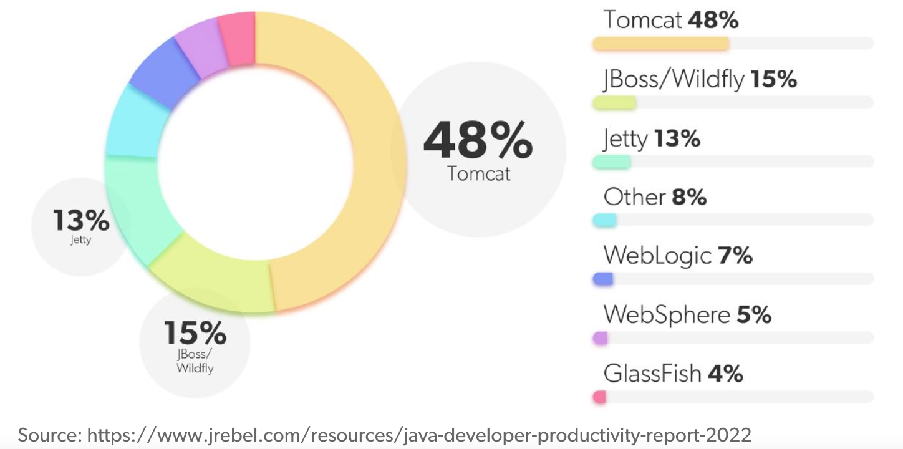

# Servlet

## Intro

A servlet is a Java technology-based Web component (java class), managed by a container (aka servlet engine, e.g., tomcat), that generates dynamic content, implementing `javax.servlet.Servlet` interface.

For detailed servlet specification, please refer to Oracle Java website.

### Web Container

A *web container* is responsible for managing the lifecycle of servlets, mapping a URL to a particular servlet and ensuring that the URL requester has the correct access-rights.

Apache Tomcat (formerly Jakarta Tomcat) is a popular open source web container.

<div style="display: flex; justify-content: center;">
      
</div>
</br>


## Life Cycle

1. Loading and Instantiation

Loading : Loads the Servlet class.

Instantiation : Creates an instance of the Servlet. 

Example: `systemctl restart tomcat` that loads and instantiates web apps.

2. Initialization

The container initializes the Servlet object by invoking the Servlet.init(ServletConfig) method which accepts ServletConfig object reference as parameter.

Example: reading many tomcat's xml files to config the servlet container.

3. Request Handling

It creates the `ServletRequest` and `ServletResponse` objects. If the request is an HTTP, it creates `HttpServletRequest` and `HttpServletResponse` objects, which are subset of `ServletRequest` and `ServletResponse`.

4. Destroying a Servlet

It allows all the threads currently running in the service method of the Servlet instance to complete their jobs and get released.

After the destroy() method is executed, the Servlet container releases all the references of this Servlet instance so that it becomes eligible for garbage collection.


## Example:

A servlet container (e.g., tomcat) receives an https request. It processes tls and builds a connection, as well as services including bandwidth throttling, MIME data decoding, etc., then determines which servlet to invoke.

The invoked servlet loads the request and looks into what method, parameters and data the request contains. After processing logic provided the request, the servlet sends a response.

Finally, the servelet container makes sure the response is flushed and close the connection.

### Code example

Tomcat binds a particular request to an url to a Java Spring function.

In java spring
```java
@WebServlet("/view_book")
public class ViewBookServlet extends HttpServlet {
    ...
}
```

In Tomcat config
```xml
<servlet-mapping>
    <servlet-name>ViewBookServlet</servlet-name>
    <url-pattern>/view_book</url-pattern>
</servlet-mapping>
```

## Some specifications

This specification document states the java method name that handles requests such as `doGet` for processing GET request, `doPost` for processing GET request.

Every servlet is a thread.

reference:
https://download.oracle.com/otn-pub/jcp/servlet-2.4-fr-spec-oth-JSpec/servlet-2_4-fr-spec.pdf?AuthParam=1659722181_7ae40afa61c65c1aa2f1448c000e4623

`WEB-INF` folder's files are used by servlet java code but not visible to public.

## HTTP and HTTPS in Servlet

### HTTP Forward vs Redirect

In code, they have the same delivery results, but in business, they serve diff logics.
```java
request.getRequestDispatcher("new.jsp").forward(request, response);// by forward
response.sendRedirect("new.jsp"); // by redirect 
```

* 