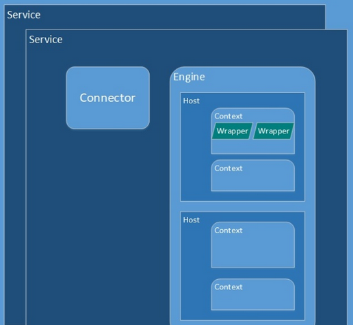
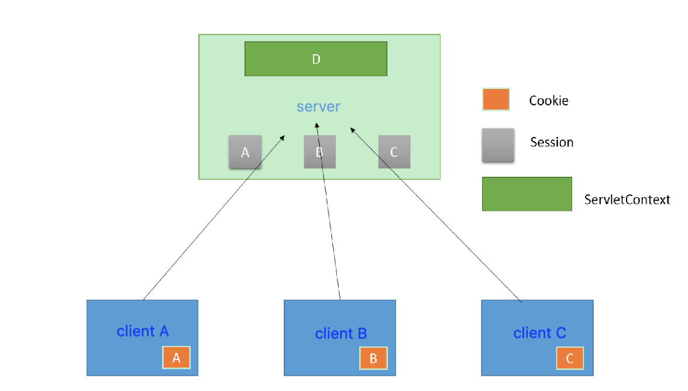
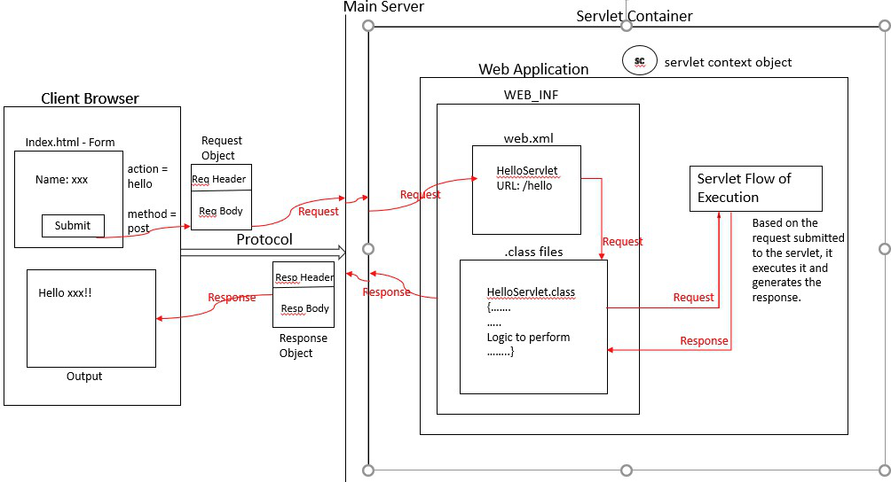

# Tomcat and Servlet

Services in tomcat by servlets are shown below.

<div style="display: flex; justify-content: center;">
      
</div>
</br>

`Service` is the outer layer interface receiving requests, such as opening a socket listening a port

`Host`, such as `example.com`, represents a site; each host can have multiple `Context` contained/referenced in `WEB-INF/Web.xml`

`Context` is an app represented in `webapps`, configured by `conf/web.xml` under the `webapps` directory

`Connector` is used to process data from port.

`Executor` is used to maintain servlet threads.

`Engine` is used to config hosts (domain names)

Each `Wrapper` corresponds to one servlet.

### Tomcat Start

When Tomcat starts, it analyzes `web.xml`, retrieve the definitions for servlet, filter, listener, etc.

Having found `ServletContextListener` from `listener`, it initializes the servlet context via `contextInitialize`; when the servlet context dies, it calls `contextDestroyed`.

## Servlet Context

`ServletContext` is responsible for servlet lifecycle management.

On every HTTP request, ServletContext retrieves one thread from a thread pool. After the service finished, it returns to the thread pool.

As illustrated below, when a webcontainer starts, there is one `ServletContext` launched to manage all servlets.

In other words, `ServletContext` provides resources/memory sharing across servlets.

<div style="display: flex; justify-content: center;">
      
</div>
</br>

A good use case of the shared resource management is website access count, 
that in the code below, when a user visits `http://<host:port>/Login`, there is a `nums++;`.

Remember for shared `HttpServlet`'s context, the `nums` is shareable.
From another page `http://<host:port>/Counter/Manager`, the `nums` can be read.

```java
package yuqiexamples;

import java.io.IOException;
import java.io.PrintWriter;
import javax.servlet.ServletException;
import javax.servlet.annotation.WebServlet;
import javax.servlet.http.HttpServlet;
import javax.servlet.http.HttpServletRequest;
import javax.servlet.http.HttpServletResponse;

@WebServlet(name = "AccessCountWriteServlet", urlPatterns = {"/Login"})
public class AccessCountWriteServlet extends HttpServlet {

    @Override
    protected void doGet(HttpServletRequest request, HttpServletResponse response)
        throws ServletException, IOException {
        response.setContentType("text/html;charset=utf-8");
        ServletContext servletContext = this.getServletContext();
        int nums = 0;
        try {
            nums = Integer.parseInt((String) servletContext.getAttribute("nums"));
        } catch (Exception e) {
            nums = 0;
        }
        nums += 1;
        servletContext.setAttribute("nums", String.valueOf(nums));
        response.sendRedirect("/Counter/Manager");
    }
}

@WebServlet(name = "AccessCountReadServlet", urlPatterns = {"/Counter/Manager"})
public class AccessCountReadServlet extends HttpServlet {

    @Override
    protected void doGet(HttpServletRequest request, HttpServletResponse response)
        throws ServletException, IOException {
    response.setContentType("text/html;charset=utf-8");
    PrintWriter out = response.getWriter();
    out.println("<h1>Management Portal</h1>");       
    ServletContext servletContext = this.getServletContext();
    String nums = (String) servletContext.getAttribute("nums");
    out.println("This page was visited " + nums + "times");
    }
}
```

### `ServletContextListener`

`ServletContextListener` is used to listen events when a servlet context is created/destroyed.

Below code wants `SimpleTimerTask` be scheduled to run every 5 secs.
The scheduler is created in `contextInitialized(...)`, terminated in `contextDestroyed(...)`.

```java
package yuqiexamples;

import java.util.Date;
import java.util.Timer;
import java.util.TimerTask;
import javax.servlet.ServletContextEvent;
import javax.servlet.ServletContextListener;

public class StartCycleRunTask implements ServletContextListener ...{
    private Timer timer;
    // `contextDestroyed` runs when webcontainer stops
    public void contextDestroyed(ServletContextEvent arg0) ...{
        System.out.println("`contextDestroyed` runs when webcontainer stops ...");
    }
    // `contextInitialized` run when webcontainer starts
    public void contextInitialized(ServletContextEvent arg0) ...{
        System.out.println("`contextInitialized` runs when webcontainer starts ...");
        timer = new Timer(); // Timer is a daemon thread that will die once servlet is shutdown
        TimerTask task = new SimpleTimerTask();
        timer.schedule(task, 1000L, 5000L); // register a task
    }
}
class SimpleTimerTask extends TimerTask ...{
    private int count;
    public void run() ...{
        System.out.println((++count)+"execute task..."+(new Date()));
    }
}
```

## Servlet Definition

```java
public interface Servlet {

 public void init(ServletConfig config) throws ServletException;

 public ServletConfig getServletConfig();
 // handle user's request
 public void service(ServletRequest req, ServletResponse res)
    throws ServletException, IOException;
 // return such as code owner and copyright
 public String getServletInfo();

 public void destroy();
}
```
where
```java
public interface ServletConfig {

 // find servlets from web.xml
 public String getServletName();
 
 // ServletContext is global, against others being local to a particular servlet
 public ServletContext getServletContext();
 
 // get init-param from web.xml
 public String getInitParameter(String name);
 
 public Enumeration getInitParameterNames();
}
```

`HttpServlet` defines HTTP methods.
```java
public abstract class HttpServlet extends GenericServlet implements java.io.Serializable {
	private static final String METHOD_DELETE = "DELETE";
	private static final String METHOD_HEAD = "HEAD";
	private static final String METHOD_GET = "GET";
	private static final String METHOD_OPTIONS = "OPTIONS";
	private static final String METHOD_POST = "POST";
	private static final String METHOD_PUT = "PUT";
	private static final String METHOD_TRACE = "TRACE";

	private static final String HEADER_IFMODSINCE = "If-Modified-Since";
	private static final String HEADER_LASTMOD = "Last-Modified";

	private static final String LSTRING_FILE = "javax.servlet.http.LocalStrings";
	private static ResourceBundle lStrings = ResourceBundle.getBundle(LSTRING_FILE);

	/**
	 * Does nothing, because this is an abstract class. 抽象类 HttpServlet
	 */
	public HttpServlet() {
	}

    // Many method implementations

    protected void doGet(HttpServletRequest req, HttpServletResponse resp) throws ServletException, IOException {
        String protocol = req.getProtocol();
        String msg = lStrings.getString("http.method_get_not_supported");
        if (protocol.endsWith("1.1")) {
            resp.sendError(HttpServletResponse.SC_METHOD_NOT_ALLOWED, msg);
        } else {
            resp.sendError(HttpServletResponse.SC_BAD_REQUEST, msg);
        }
    }

    protected long getLastModified(HttpServletRequest req) {
        return -1;
    }

    protected void doHead(HttpServletRequest req, HttpServletResponse resp) throws ServletException, IOException {
        NoBodyResponse response = new NoBodyResponse(resp);

        doGet(req, response);
        response.setContentLength();
    }

    protected void doPost(HttpServletRequest req, HttpServletResponse resp) throws ServletException, IOException {
        String protocol = req.getProtocol();
        String msg = lStrings.getString("http.method_post_not_supported");
        if (protocol.endsWith("1.1")) {
            resp.sendError(HttpServletResponse.SC_METHOD_NOT_ALLOWED, msg);
        } else {
            resp.sendError(HttpServletResponse.SC_BAD_REQUEST, msg);
        }
    }

    protected void doPut(HttpServletRequest req, HttpServletResponse resp) throws ServletException, IOException {
        String protocol = req.getProtocol();
        String msg = lStrings.getString("http.method_put_not_supported");
        if (protocol.endsWith("1.1")) {
            resp.sendError(HttpServletResponse.SC_METHOD_NOT_ALLOWED, msg);
        } else {
            resp.sendError(HttpServletResponse.SC_BAD_REQUEST, msg);
        }
    }

    protected void doDelete(HttpServletRequest req, HttpServletResponse resp) throws ServletException, IOException {
        String protocol = req.getProtocol();
        String msg = lStrings.getString("http.method_delete_not_supported");
        if (protocol.endsWith("1.1")) {
            resp.sendError(HttpServletResponse.SC_METHOD_NOT_ALLOWED, msg);
        } else {
            resp.sendError(HttpServletResponse.SC_BAD_REQUEST, msg);
        }
    }

    ...
}
```

<div style="display: flex; justify-content: center;">
      
</div>
</br>