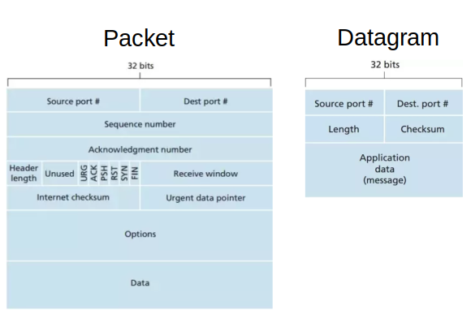

# Data Communication

The IOS Data Communication Mode

      

 

* Frame: datalink layer
* Cell: datalink layer
* Packet: network layer
* Datagram: network layer
* Segment: transport layer
* Message: usually referred to in application layer

Packet vs Datagram 

One is typically used for TCP containing sequence number and ack;
another one is often used for UDP concerning only about delivery.

      

 

## Internet Protocol (IP)

* Network address translation (NAT)

*Network address translation* (NAT) is used to map IPs from one network to another network by modifying IP header info (recall that an IP header contains source and destination IP addrs, and NAT replaces the IPs with its proposed globally unique ones when forwarding TCP/IP packet to the internet).
NAT device maintains a lookup table to store the translation mappings.

The most popular use case is translating private IPs from a local network (e.g., wifi) to globally unique IPs on the internet

* IP Classes

IPs are identified with classes A, B, C, D (multi-cast) and E (reserved).

* Classless Inter-Domain Routing (CIDR)

CIDR is a method for allocating IP addresses for IP routing.

* Broadcast/Network Address

Broadcast/network addresses refer to using all-ones subnet IP to represent this subnet network.

For example, 

|Name|Bit Form|Decimal Form|
|-|-|-|
|A network IP addr|10101100.00010000.00000000.00000000|172.16.0.0|
|The broadcast addr for the network|10101100.00011111.11111111.11111111|172.31.255.255|

* Private IPs

|IPs|CIDR|Description|
|-|-|-|
|10.0.0.0 - 10.255.255.255|10.0.0.0/8|one class A network|
|172.16.0.0 - 172.31.255.255|172.16.0.0/12|16 contiguous class B networks|
|192.168.0.0 - 192.168.255.255|192.168.0.0/16|256 contiguous class C networks|

## Address Resolution Protocol (ARP) vs Internet Control Message Protocol (ICMP) 

## TCP vs UDP

* TCP/IP needs ack for each sent packet, while UDP is not

* TCP/IP is by design a stream-oriented protocol, while UDP is a packet-oriented protocol. 

The "stream-based" indicates that, individual TCP packets on the recipient side should be coalesced/merged forming a message, different from UDP that one UDP packet itself is a message.

## MAC vs IP 

MAC stands for Media Access Control (Layer 2 Data Link). A MAC address is a unique 12-digit hexadecimal identifier given to a network interface controller (NIC).

An Internet Protocol (IP) (Layer 3/4) address is a unique identifier given to a device connected to a local network or the internet.

MAC address is supposedly unique to each network interface card while an IP address is usually replaced.

### MAC and ARP

Address Resolution Protocol (ARP) is a procedure for mapping a dynamic IP address to a permanent physical machine address in a local area network (LAN). The physical machine address is also known as a media access control (MAC) address.

When a new computer joins a LAN, it is assigned a unique IP address to use for identification and communication. When an incoming packet destined for a host machine on a particular LAN arrives at a gateway, the gateway asks the ARP program to find a MAC address that matches the IP address. A table called the ARP cache maintains a record of each IP address and its corresponding MAC address.

## IPC socket

A Unix domain socket or IPC socket (inter-process communication socket) is a data communications endpoint for exchanging data between processes executing on the same host operating system. All communication occurs entirely within the operating system kernel, rather than via network protocol.

Usually, there are two types:

* `SOCK_STREAM` (compare to TCP) – for a stream-oriented socket
* `SOCK_DGRAM` (compare to UDP) – for a datagram-oriented socket that preserves message boundaries (as on most UNIX implementations, UNIX domain datagram sockets are always reliable and don't reorder datagrams)

### An Architectural Overview of TCP Unix Socket

network interface (NIC) receives TCP datagrams/packets and transmits the data through Linux kernel (kernel is waken up by interupt or polling NIC services). A typical packet contains about 1000 - 1500 bytes of data, including header.

When kernel gets ONE packet from the NIC it decodes the packet and finds the associated memory and copies the packet to the socket associated buffer. User can run `ssize_t read(int fd, void *buf, size_t count);` to get the payload (or other system calls of same purposes). If user not yet calls `read` while new packets keep coming in, the new packets' payloads appends to the socket's buffer. Once user calls `read`, new packets' payloads reside from the start of buffer memory (however, the socket buffer is not `memset(buf, 0, sizeof(buf))` but overwritten).

### Flow Control

Flow control is the process of managing the rate of data transmission between two nodes to prevent a fast sender from overwhelming a slow receiver. 

* For UDP socket, the server side will just start dropping packets after the receive buffer is filled.

* For TCP, server's socket decreases kernel window size when receiving data exceeds server processing capacity, and rejects incoming TCP Datagrams when window size is zero.

## QUIC

QUIC (Quick UDP Internet Connections) is tailored to facilitate http communication with a number of improvements based on http characteristics.

### TCP disadvantages and QUIC's remediations

Some major comparisons are listed below

TCP: 
1. breaks up the data into small network packets
2. uses checksum to detect corrupt packets
3. sends automatic repeat request (ARQ) for corrupt packets, until proven validity
4. communicates in a sequential/sync manner

QUIC:
1. prepares key exchange for TLS during initial handshake, hence reducing connection overhead
2. uses multiplexing UDP communication so that different protocols can continue receiving data despite some of data streams might be broken (paralellism).
3. includes connection identifier that reduces re-connection time when an end user changes local network (such as jump between different wifi hotspots)

## URI vs URL

|URL (Uniform Resource Locator)|URI (Uniform Resource Identifier)|
|-|-|
|URL links a web page/component|URI is used to distinguish one resource |
|URL is a subset of URI|URI is the superset of URL $\text{URL} \in \text{URI}$.|
|Example: https://www.geeksforgeeks.org/ (this is just a server addr, not indicative of any resource, can only said to be a URL)|Example: https://media.geeksforgeeks.org/wp-content/uploads/20200205203241/gfg30.jpg (this can be said URL as well as URI for it contains the addr of an actual resource: a `.jpg` image)|

      

 

URN (Uniform Resource Name).
