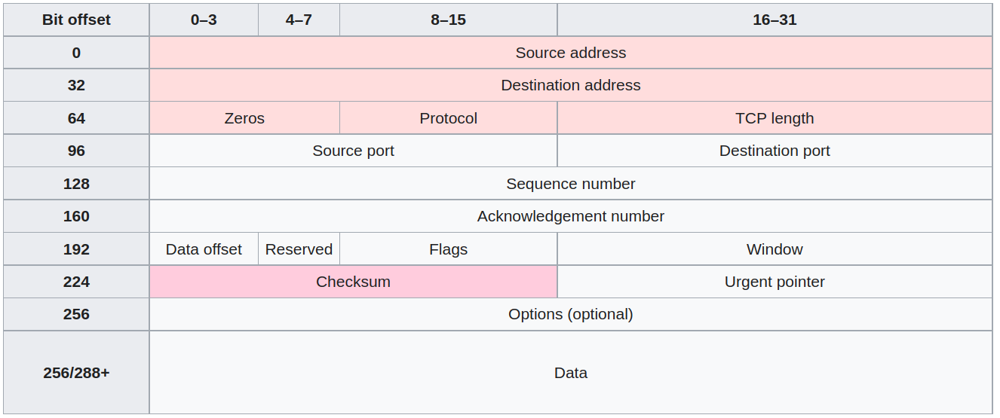
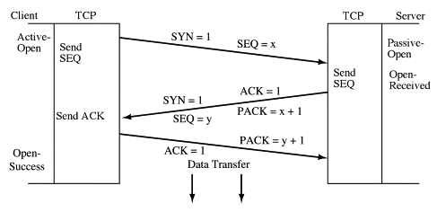
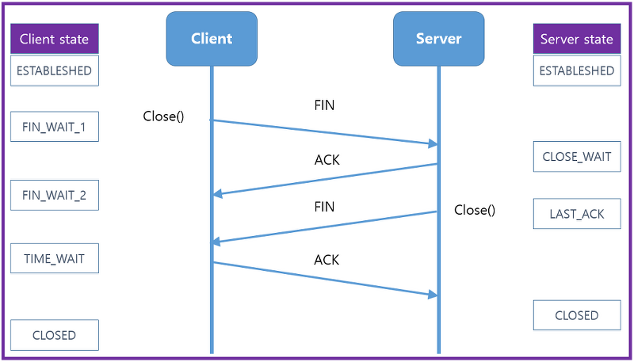

# TCP/IP

A tcp packet for IPv4 is shown as below.



## Three Way Handshake

1. The first host (Alice) sends the second host (Bob) a "synchronize" (SYN) message with its own sequence number $x$

2. Bob replies with a synchronize-acknowledgment (SYN-ACK) message with its own sequence number $y$ and acknowledgement number $x+1$

3. Alice replies with an acknowledgment (ACK) message with acknowledgement number $y+1$

4. Data transmission starts



### 4-Way TCP Goodbye Handshake

`close` is invoked in both server and client who send `FIN` and expect receiving `ACK`




## TCP windows

The throughput of a TCP communication is limited by two windows: the *congestion window* and the *receive window*. 

The congestion window tries not to exceed the capacity of the network (congestion control); the receive window tries not to exceed the capacity of the receiver to process data (flow control). 

### Tcp data transmission (after handshake)

|Sender||Receiver|Comments|
|-|-|-|-|
|TCP 1| $\rightarrow$ ||A sender sends a tcp packet of a sequence no.1 to a receiver|
||$\leftarrow$|ACK 2|The receiver acknowledges the TCP 1 by replying an ACK asking for next tcp packet of a sequence no.2|
|TCP 2| $\rightarrow$ |||
|TCP 3| $\rightarrow$ ||A tcp sliding window is dynamic, growing by a power of $2$, so that this time the sender sends 2 packets|
||$\leftarrow$|ACK 4||
|TCP 4| $\rightarrow$ |||
|TCP 5| $\rightarrow$ |$\times$ (packet lost, not received) |Probably there was traffic congestion that this packet was lost, and the receiver did not receive this tcp of a sequence no.5 |
|TCP 6| $\rightarrow$ |||
|TCP 7| $\rightarrow$ |||
||$\leftarrow$|ACK 5|The receiver replies to the sender, it is asking for the tcp packet of a sequence no.5|
|TCP 5| $\rightarrow$ ||The sender might see there is possible traffic congestion, only sends one tcp packet on demand|
||$\leftarrow$|ACK 8|Since there was only the no.5 tcp packet lost, others were received (the max sequence no is $7$), the receiver is now asking for the 8-th tcp packet|
|TCP 8| $\rightarrow$ |||
|TCP 9| $\rightarrow$ |||
||...|||

### Specifications

In rfc7323 - TCP Extensions for High Performance, TCP header uses a 16-bit field to report the receive window
size to the sender.  Therefore, the largest window that can be
used is $2^{16} = 64 \text{kb}$.

## Recovery

TCP may experience poor performance when multiple packets are lost from one window of data. With the limited information available from cumulative acknowledgments, a TCP sender can only learn about a single lost packet per round trip time. 

* Normal recovery

Just send `ACK` for the missing tcp packets.

* Selective Acknowledgments (SACK)

SACK is an optional/extension field in TCP header that holds information about "gaps" between received tcp packet sequence numbers.

Other enhancements to SACK 
1. Forward Acknowledgment (FACK)
2. Duplicate Selective Acknowledgment (DSACK)
3. Recent Acknowledgment (RACK)


## TCP Packet Coalescing Loss (粘包)

TCP is a stream-based protocol.
It does not preserve boundaries with respect to send/recv calls, hence custom delimiter is required.

TCP hides underlying protocols extracting packets' payload so that all payloads are placed in user's buffer in a sequencial order, appeared as a "stream".

For example, when buffer is full, there is partial data loss, that the recieved payloads appeared to be adhering something gibberish.

### Example

In the scenario of high throughput, often do not directly use HTTPS, but wrap TCP in a custom protocol, such as reading binary stream and dissecting by dilimiter.

For example, there is a custom function `decode(data, length);` that decodes a TCP payload, inside which there are a number of custom segments. 
The custom binary packets can be separated by delimiters.

A easy psyudo code implementation is shown as below.

```cpp
std::vector<T> decode(char* data, int length, char delimiter)
{
    std::vector<T> decodedData;
    if (!checkDataValid(data, length)) {
        storeDataInSessionCache(data, length); // segments are stored in cache that will be coalesced with next TCP payload
    }
    else {
        while (isRemainingData(data, length)) {
            decodedData.push_back(extractOnePacket(data, length, delimiter));
        }
        clearBuffer(data);
    }
    return decodedData;
}
```

Since there is no knowledge that packets in `data` are all valid, there should be a check. 
If check is good, segments are extracted one by one in `extractOnePacket(...)`.
If failed, there might be parially ended segments whose remaining parts are in next TCP payload, hence should cache the this TCP packet.

One issue in this implementation is that, as in `storeDataInSessionCache` there might be accumulating TCP payloads that lead to buffer overflow if there is one payload has a faulted segment, and this segment will never pass `checkDataValid(...)`.

### Nagle's Algorithm

Angle's algorithm dissects a TCP message into small size segments.
By 16-bit length as defined in TCP header, a TCP message should have a max of 65535 bytes.

However, in practice, it should not be greater than MSS (Max Segment Size) = MTU (1500 bytes, Message Transmit Unit) - 20 bytes (IP head) - 20 bytes (TCP head).
If a message is larger than 1500 bytes, segmentation happens.

This is for Ethernet frame having roughly 1500 bytes (1500 bytes = 1518 bytes - 6 bytes (destination MAC addr) - 6 bytes (source MAC addr) - 2 bytes (protocol index code)), 
and one TCP packet should conform this specification (as what Nagle's algorithm does) to reach optimal transmission speed over the internet.

Nagle's algorithm has the below properties:
* If packet length  > MSS, send the packet
* If all small packets < MSS have received ACK, send new packets
* If packet has `FIN`, send the packet
* If timeout (> 200 ms), send the packet

### TCP Packet Coalescing Loss Reason

Since TCP packets should be coalesced/merged, there exists a possible problem where during coalescing, there are packets (partially) lost, or supposed independent messages merged into one semantically wrong message in business logic. 

Coalescing loss happens when
* recipient buffer is small resulted in partial loss
* multi threading/async accessing the same buffer (I/O Multiplexing)

Packet Coalescing issues can be addressed by adding custom delimiter.