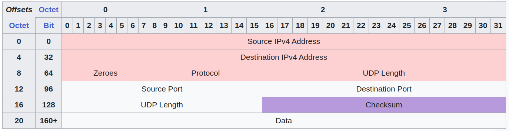

# User Datagram Protocol (UDP) 

The actual limit for the data length, which is imposed by the underlying IPv4 protocol, is 65,507 bytes (65,535 bytes − 8-byte UDP header − 20-byte IP header).

      

 
