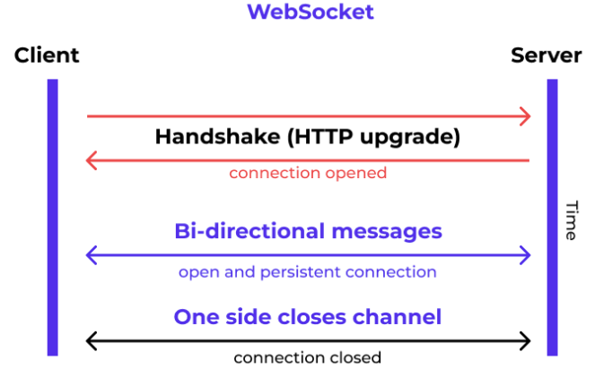

# Websocket

**WebSocket** is a computer communications protocol, providing full-duplex communication channels over a single TCP connection, facilitating real-time data transfer from and to the server.

Below is an example request and response to confirm the availability of using websocket.
```yaml
GET /chat HTTP/1.1
Host: server.example.com
Upgrade: websocket
Connection: Upgrade
Sec-WebSocket-Key: x3JJHMbDL1EzLkh9GBhXDw==
Sec-WebSocket-Protocol: chat, superchat
Sec-WebSocket-Version: 13
Origin: http://example.com
```

The server's response is 
```yaml
HTTP/1.1 101 Switching Protocols
Upgrade: websocket
Connection: Upgrade
Sec-WebSocket-Accept: HSmrc0sMlYUkAGmm5OPpG2HaGWk=
Sec-WebSocket-Protocol: chat
```

After the initial request/response, a secure websocket tunnel is built.
Data can be put in typical TCP packets for transmission.


<div style="display: flex; justify-content: center;">
      
</div>
</br>

The advantage of websocket is that it maintains a long term connection for data transmission,
in contrast to a typical HTTPS request/response where such as that every message contained in a `POST` needs performing TCP handshake/goodbye, which is time-consuming.

## Use Cases

In web browser frontend, 
```javascript
// Create WebSocket connection.
const socket = new WebSocket("ws://localhost:8080");

// Connection opened
socket.addEventListener("open", (event) => {
  socket.send("Hello Server!");
});

// Listen for messages
socket.addEventListener("message", (event) => {
  console.log("Message from server ", event.data);
});
```

In WeChat plugin frontend,
```javascript
App({
  onLaunch: async function () {
    wx.cloud.init({
      traceUser: true
    })
    const { socketTask } =  await wx.cloud.connectContainer({
      config: {
        env: 'wxrun-demo',  // wechat cloud id (if backend is deployed on wechat cloud)
      },
      service: 'ws',        // service name
      path: '/'             
    })
    socketTask.onMessage(function (res) {
      console.log(' [WEBSOCKET]', res.data)
    })
    socketTask.onOpen(function (res) {
      console.log(' [WEBSOCKET] ', 'Connected')
      socketTask.send({
        data: 'Hello world'
      })
    })
    socketTask.onClose(function (res) {
      console.log(' [websocket] closed')
    })
  }
})
```

By Java SpringBoot backend,

Maven dependency by `spring-boot-starter-websocket`
```xml
<dependency>  
    <groupId>org.springframework.boot</groupId>  
    <artifactId>spring-boot-starter-websocket</artifactId>  
</dependency> 
```

Enable and load websocket configs

```java
import org.springframework.context.annotation.Bean;
import org.springframework.context.annotation.Configuration;
import org.springframework.web.socket.server.standard.ServerEndpointExporter;

@Configuration
public class WebSocketConfig {
    @Bean
    public ServerEndpointExporter serverEndpointExporter() {
        return new ServerEndpointExporter();
    }
}
```

`webSocketSet` is a global variable that manages websocket sessions where each one is specified by `WebSocketServer`, which is a servlet that takes `@ServerEndpoint("/api/websocket/{sid}")` as one session/websocket connection from frontend.

```java
package com.helloworld.example.websocket;

import com.baomidou.mybatisplus.core.conditions.query.QueryWrapper;
import com.baomidou.mybatisplus.core.conditions.update.UpdateWrapper;
import lombok.extern.slf4j.Slf4j;
import org.springframework.stereotype.Component;
import org.springframework.stereotype.Service;

import javax.websocket.*;
import javax.websocket.server.PathParam;
import javax.websocket.server.ServerEndpoint;
import java.io.IOException;
import java.time.LocalDateTime;
import java.util.List;
import java.util.concurrent.CopyOnWriteArraySet;


@Component
@Slf4j
@Service
@ServerEndpoint("/api/websocket/{sid}")
public class WebSocketServer {
    private static int onlineCount = 0;
    private static CopyOnWriteArraySet<WebSocketServer> webSocketSet = new CopyOnWriteArraySet<WebSocketServer>();

    private Session session;

    private String sid = "";

    @OnOpen
    public void onOpen(Session session, @PathParam("sid") String sid) {
        this.session = session;
        webSocketSet.add(this);     // add session to the webSocketSet
        this.sid = sid;
        addOnlineCount();           // session count + 1
        try {
            sendMessage("conn_success");
            log.info("new listening line:" + sid + ", currently there are :" + getOnlineCount() + "subscriptions");
        } catch (IOException e) {
            log.error("websocket IO Exception");
        }
    }

    @OnClose
    public void onClose() {
        webSocketSet.remove(this);  
        subOnlineCount();           // online subscription - 1
        // release the sid
        log.info("Sid released: "+sid);
        log.info("Someone exited: now there are " + getOnlineCount() + "subscriptions");

    }

    /**
     * when user frontend sends a message to server
     */
    @OnMessage
    public void onMessage(String message, Session session) {
        log.info("Received from frontend sid " + sid + " message: " + message);
        // group/bulk message sending
        for (WebSocketServer item : webSocketSet) {
            try {
                item.sendMessage(message);
            } catch (IOException e) {
                e.printStackTrace();
            }
        }
    }

    ... // many more websocket methods

    public static synchronized int getOnlineCount() {
        return onlineCount;
    }

    public static synchronized void addOnlineCount() {
        WebSocketServer.onlineCount++;
    }

    public static synchronized void subOnlineCount() {
        WebSocketServer.onlineCount--;
    }

    public static CopyOnWriteArraySet<WebSocketServer> getWebSocketSet() {
        return webSocketSet;
    }
}
```