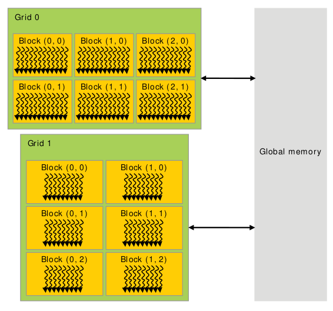
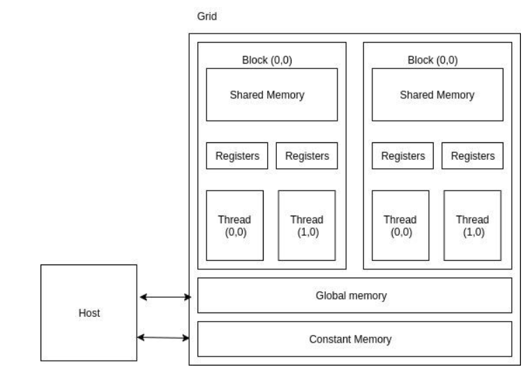
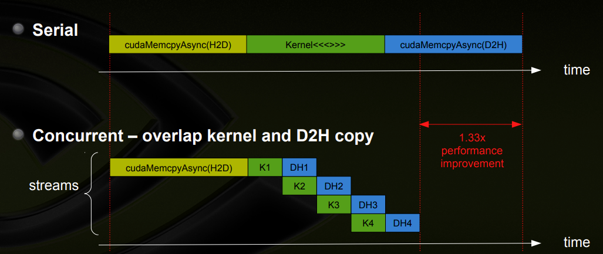
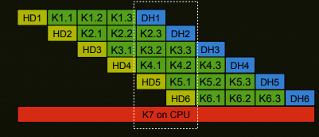

# CUDA

CUDA (or Compute Unified Device Architecture) is a parallel computing platform and application programming interface (API) that allows software to use certain types of graphics processing units (GPUs) for general purpose processing.

.png "CUDA_processing_flow_(En)")

### Driver and cuda version

* Nvidia driver includes driver kernel module and user libraries.

NVIDIA's System Management Interface (`nvidia-smi`) is part of nvidia driver (run `nvidia-smi` to check driver version).

`nvidia-driver-xxx-server` is a subset of `nvidia-driver-xxx`. `nvidia-driver-xxx` has additional vendor support such as 
```bash
linux-modules-nvidia-xxx-aws  
linux-modules-nvidia-xxx-azure  
linux-modules-nvidia-xxx-gcp  
linux-modules-nvidia-xxx-oem-20.04  
linux-modules-nvidia-xxx-oracle  
```

* Cuda toolkit is an SDK contains compiler, api, libs, docs, etc...

Cuda installs `nvcc`, which reveals cuda version by `nvcc --version`.

For example, driver version 515 corresponds to cuda version 11.7

#### Debug

This list shows cuda hardware and driver specifications: https://docs.nvidia.com/cuda/cuda-toolkit-release-notes/index.html

`nvidia-smi` might throw error 
```bash
Failed to initialize NVML: Driver/library version mismatch
```

`dpkg -l | grep nvidia` looks at nvidia-utils-xxx package version

`cat /proc/driver/nvidia/version` looks at the version of Kernel Module

`sudo dpkg --purge remove '^nvidia-.*'` removes all nvidia driver packages, and run `sudo apt-get install nvidia-utils-xxx`


## Memory hierarchy

Each grid has $n \times m$ number of thread blocks; each thread blocks has some threads.

Each thread block has shared memory visible to all threads of the block and with the same lifetime as the block. All threads have access to the same global memory.

* each thread has its local memory
* each thread block has shared memory across all threads in this block
* all threads has shared global memory


<div style="display: flex; justify-content: center;">
      
</div>
</br>

* The global memory is a high-latency memory that every thread can access it.

* The constant memory can be written into and read by the host. 
It is used for storing data that will not change over the course of kernel execution. 
Usually of size 64 KB storing in cache for thread, hence access time is fast.
It is declared in `__constant__`.

* Registers and shared-memory are on-chip memories, allows fast read/write.

* Each block has its own shared-memory; threads within the same block can access the same shared memory.

<div style="display: flex; justify-content: center;">
      
</div>
</br>

### Cuda memory copy process

If the memory is not pinned (i.e. not page-locked), data is first copied to a page-locked "staging" buffer and then copied to GPU through DMA (Direct Memory Access). 

By using the pinned memory you save the time to copy from pageable host memory to page-locked host memory.

Use `cudaMallocHost` to make data's memory persistent on host device, rather than `malloc` or `new` operation. For memory discharge, use `cudaFreeHost`.

## Concurrency and Warp

Warps are the hardware-level concurrency processing units, in contrast to common thread blocks that only guarantee "logic"-level concurrency where threads might be reordered in what time in hardware they are actually executed.
Typically, each warp has 32 threads.

This means within the same warp, if some threads finish faster than some others, the early finished threads have to wait for the remaining threads to finish.

For example, there are some `if`/`else` conditions in kernel code, one branch is significantly more computation-intense than another (assumed no constant value optimization).
In this scenario, some threads finish faster than others, but have to wait.
```cpp
__global__ void mathKernel1(float *c) {
    int tid = blockIdx.x * blockDim.x + threadIdx.x;
    float a, b;
    a = 123.0;
    b = 456.0;
    if (tid % 2 == 0) {
        c[tid] = (a*a + b*b) / (a+b); // time-consuming
    } else {
        c[tid] = a + b; // easy to compute
    }
    
}
```

Branching can be done with `warpSize`, so that all threads within the same warp can finish simultaneously by going into the same `if`/`else` branch.
```cpp
__global__ void mathKernel2(void) {
    int tid = blockIdx.x * blockDim.x + threadIdx.x;
    float a, b;
    a = 123.0;
    b = 456.0;
    if ((tid / warpSize) % 2 == 0) {
        c[tid] = (a*a + b*b) / (a+b); // time-consuming
    } else {
        c[tid] = a + b; // easy to compute
    }
}
```

### Warp vs Stream Processor

Each CUDA core is also known as a Streaming Processor or shader unit sigh.

From a hardware perspective, hardware groups threads that execute the same instruction in to warps. Several warps constitute a thread block. 
Several thread blocks are assigned to a Streaming Multiprocessor (SM). Several SM constitute the whole GPU unit (which executes the whole Kernel Grid).

## CUDA C++ extensions and code

`__global__ void func<<<numBlocks, threadsPerBlock>>>` is the CUDA device kernel function c++ extension syntax that runs on CUDA for parallel computation.

CUDA C++ provides keywords that let kernels get the indices of the running threads. Specifically, for one-dimensional block, `threadIdx.x` contains the index of the current thread within its block, and `blockDim.x` contains the number of threads in the block, referenced by `blockIdx.x`. 

Currently, CUDA supports 3-dimensional block concept: for a thread, the flattening mapping can be defined as $(x,y,z)=x+yD_x+zD_xD_y$, where $D_x$ and $D_y$ are `blockDim.x` and `blockDim.y`, respectively. 

```cpp
// Kernel definition
__global__ void MatAdd(float A[N][N][N], float B[N][N][N],
float C[N][N][N])
{
    int idx = blockIdx.x * blockDim.x + threadIdx.x;
    int idy = blockIdx.x * blockDim.y + threadIdx.y;
    int idz = blockIdx.x * blockDim.z + threadIdx.z;
    if (idx < N && idy < N && idz < N)
        C[idx][idy][idz] = A[idx][idy][idz] + B[idx][idy][idz];
}
```

Given a 3d grid with 3d blocks residing inside, the mapping relationship to 1d is (gridDim is not provided by cuda)
```cpp
dim3 grid( GridDim, GridDim, GridDim );
dim3 block( BlockDim, BlockDim, BlockDim );
int gridDim = GridDim;
int idx = 
        gridDim*gridDim*blockDim.z*blockDim.y*blockDim.x*blockIdx.z + 
        gridDim*blockDim.z*blockDim.y*blockDim.x*blockIdx.y + 
        blockDim.z*blockDim.y*blockDim.x*blockIdx.x +
        threadIdx.x*blockDim.z*blockDim.y +
        threadIdx.y*blockDim.z +
        threadIdx.z;
```

### Kernel syntax

Given a `kernel<<<Dg,Db,Ns,S>>>(args**)`, there is
* `Dg` (`dim3`) specifies the dimension and size of the grid.
* `Db` (`dim3`) specifies the dimension and size of each block
* `Ns` (`size_t`) specifies the number of bytes in shared memory that is dynamically allocated per block for this call in addition to the statically allocated memory, default is 0.
* `S` (`cudaStream_t`) specifies the associated stream, is an optional parameter which defaults to 0.

### Common extension usage

* `__global__` vs `__device__`

`__global__` is called from host/CPU but executed in GPU;
`__device__` is called and executed in GPU

For example, to compute amplitude and phase of some arrays of data (real and imaginary parts), 
`__global__` is mainly focused on arranging data access (load and store), while `__device__` handles actual computations.
```cpp
__device__ float calculateAmplitude(float re1, float im1, float re2,float im2)
{
    re1 = re1*re1+ im1*im1;
	return sqrtf(re1);
}

__device__ float calculatePhase(float re1, float im1, float re2,float im2)
{
	register float x,y;
	y = im1*re2 - re1*im2;
	x = re1*re2 + im1*im2;
	return atan2f(y,x);
}

__global__ void calculateAmpPhase(...)
{
    int idx = blockIdx.x * blockDim.x + threadIdx.x;

    float re1 = relArr1[idx];
    float re2 = relArr2[idx];
    float im1 = imArr1[idx];
    float im2 = imArr2[idx];

    float amp = calculateAmplitude(re1, im1, re2,im2) ;
    ampArr[idx] = amp;

    float phase = calculatePhase(re1, im1, re2, im2) ;
    phaseArr[idx] = phase;
}
```

* `__shared__`

Shared memory is shared by all threads in a thread block. 

For shared memory to be useful, should know whether kernel functions would access the same block of memory multiple times.
The reason of this requirement is that reading it into shared memory first would require 1 global memory read and 1 shared memory read, which takes longer, only shared data is read multiple times can it be cost-efficient.

For example, assumed block dimension `(1024, 1, 1)` and grid dimension `(1, 1, 1)`, 
the requirement is to compute array element neighbors' mean value: `(arr[i-1]+arr[i+1])/2.0`.

This requires repeated accesses to local data, and `__shared__` can help.
Remember to add `__syncthreads();` to wait to load data.
```cpp
__global__ void compute_it(float *data)
{
   int tid = threadIdx.x;
   __shared__ float myblock[1024];
   float tmp;

   // load the thread's data element into shared memory
   myblock[tid] = data[tid];

   // ensure that all threads have loaded their values into
   // shared memory; otherwise, one thread might be computing
   // on uninitialized data.
   __syncthreads();

   // compute the average of this thread's left and right neighbors
   tmp = (myblock[tid > 0 ? tid - 1 : 1023] + myblock[tid < 1023 ? tid + 1 : 0]) * 0.5f;
   // square the previousr result and add my value, squared
   tmp = tmp*tmp + myblock[tid] * myblock[tid];

   // write the result back to global memory
   data[tid] = tmp;
}
```

* `__constant__`

Constant sets data to read-only.

To use it, set variable to constant then copy to gpu by `cudaMemcpyToSymbol`.
`__constant__` declared variables must be **in a global scope in the host code**, cannot be referenced from host function.
```cpp
__constant__ Sphere s[NumSpheres];

cudaMemcpyToSymbol(s, src_s, sizeof(Sphere)*NumSpheres);
```

CUDA constant improves performance by conducting read operation "broadcasting" to threads in the same warp.
When CUDA reads data from constant memory, it sends data to half warp containing 16 threads, and the constant data is kept in shared cache within a thread block.
As a result, there is no repeated request to global data block but retrieving data from local cache.
Read-only access facilitates parallelism.

## Async

### Streams

Cuda uses *streams* to manage GPU concurrency, mainly for memCpy and kernel.

A stream is a sequence of operations executed in issue-order on GPU, that cuda operations in diff streams may run concurrently.

All cuda operations are by default sync, using stream $0$, unless stream index and async flag is specified.

### Use of `event` and `stream`

Illustrated in the figure below, cudaMemCpy from host to device is sync, the kernel run and cudaMemCpy from device to host can be run in parallel.



Depending on GPU hardware, there can be multiple kernel runs.



Cuda uses *event* to include stream to perform "wait" to sync operation in the main thread, by `cudaEventCreate(&event);` and `cudaStreamCreate(&stream);`, `cudaEventRecord(event1, stream1);` then `cudaStreamWaitEvent(stream1, event2);`. It uses two events to control one stream (notice here that `event1` and `event2` are used to listen to `stream1`).


### Example code

```cpp
cudaStream_t stream1, stream2, stream3, stream4 ;
cudaStreamCreate ( &stream1) ;
cudaStreamCreate ( &stream2) ;
cudaStreamCreate ( &stream3) ;
cudaStreamCreate ( &stream4) ;
cudaEvent_t event1;
cudaEventCreate(&event1);

cudaMalloc ( &dev1, size ) ;
cudaMallocHost ( &host1, size ) ; // pinned memory required on host
cudaMalloc ( &dev2, size ) ;
cudaMallocHost ( &host2, size ) ; // pinned memory required on host

cudaEventRecord(event1, stream1); // record event1
cudaMemcpyAsync ( dev1, host1, size, H2D, stream1 ) ;
cudaStreamWaitEvent(stream2, event1);    // wait for event in stream1 
kernel2 <<< grid, block, 0, stream2 >>> ( …, dev2, … ) ; 
kernel3 <<< grid, block, 0, stream3 >>> ( …, dev3, … ) ;
some_CPU_method();  // cpu work can be run in parallel
cudaMemcpyAsync ( host4, dev4, size, D2H, stream4 ) ;
```

## CUDA Texture

CUDA texture is in **global** memory that are accessed through a dedicated read-only cache, 
and that the cache includes hardware filtering which can perform linear floating point interpolation as part of the read process. 

In other words, `texture`-compiled data is physically close in hardware, and is set to read-only, hence it is fast in access.
Besides, there are builtin floating point operations that can facilitate texture data computation along side with data retrieval.

In practice, `texture` acts like a wrapper to normal cuda allocated memory data by binding `dev_inSrc` $\leftrightarrow$ `devTex_inSrc` through the function `cudaBindTexture2D`.

Access to matrix cell can be directly by `tex2D(devTex_inSrc, x, y)`, where `(x,y)` is the coordinate of a cell in the matrix.
```cpp
texture<float, 2> devTex_inSrc;

cudaMalloc((void**)&dev_inSrc, ImageWidth*ImageHeight*sizeof(float));

cudaBindTexture2D(NULL, devTex_inSrc, dev_inSrc, descFloat, ImageWidth, ImageHeight, ImageWidth*sizeof(float) );

// cuda kernel code
int x = threadIdx.x + blockIdx.x * blockDim.x;
int y = threadIdx.y + blockIdx.y * blockDim.y;
self = tex2D(devTex_inSrc, x, y);
```

## CUDA Atomicity