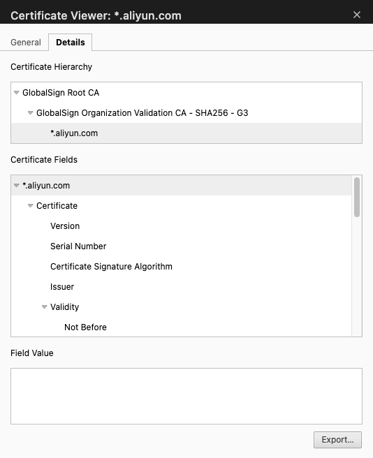
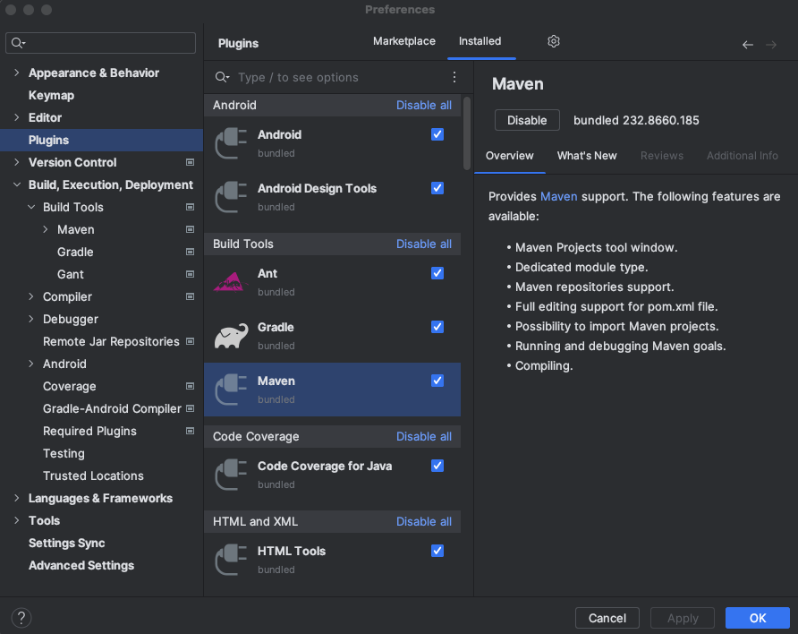
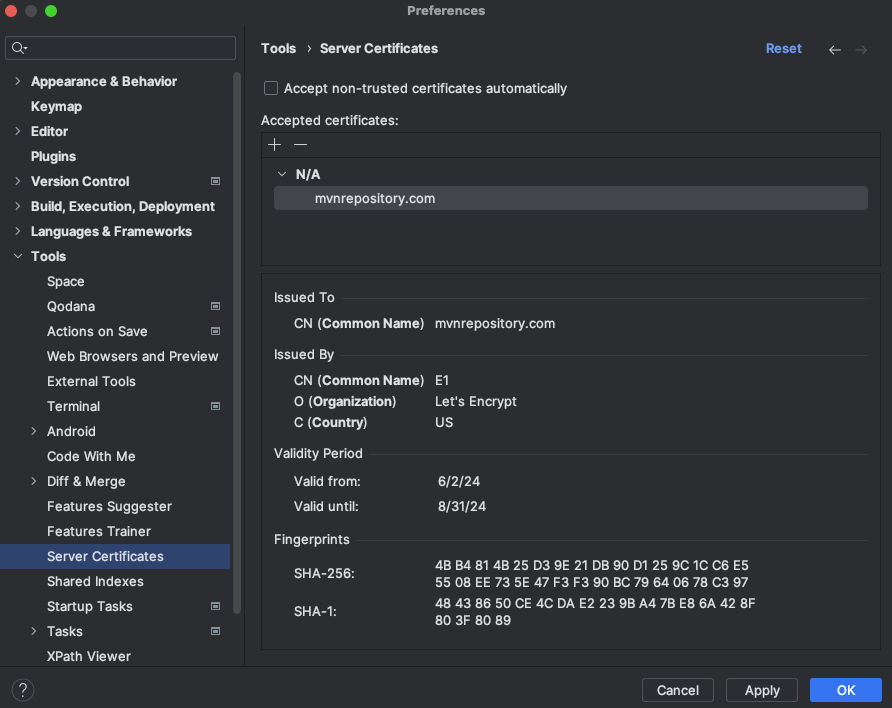
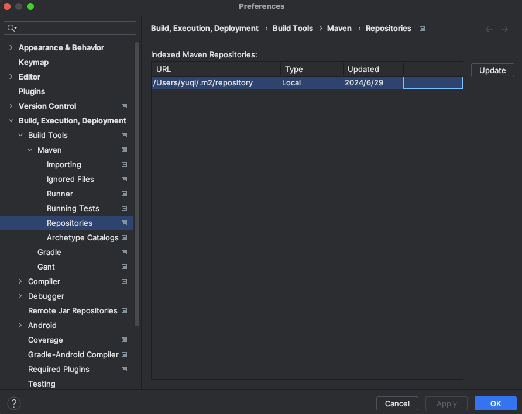
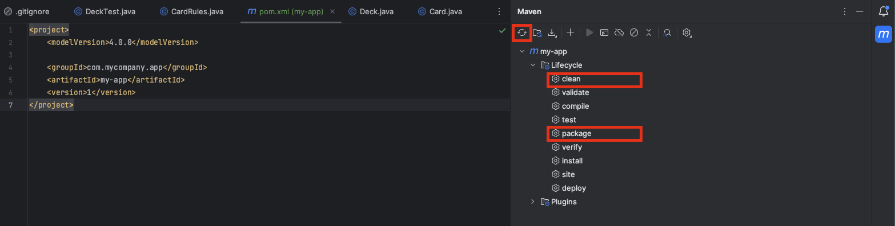

# Maven

## Maven Settings `~/.m2/setting.xml`

By default, maven settings are placed in `~/.m2/setting.xml`.

### Inside `settings.xml`

* `<mirror/>`

`<mirror/>` is used to speed up downloading.
When there is a maven jar to download, maven will first download from mirror.

-> The `<mirrorOf>` specifies what maven repo to download dependencies, e.g., `<mirrorOf>central</mirrorOf>` indicates only `central` repos is allowed; `<mirrorOf>*</mirrorOf>` indicates all repos are allowed

* `<server/>`

`<server/>` is used to provide authentication, e.g., username and password.

P.S., `<id/>` must be the **same** across `<server/>`, `<repository/>`, `<pluginRepository/>` for maven to know by what credential for repository authentication.

* `<repository/>`

`<repository/>` is used to store the actual `.jar` and `.pom`.

Inside this xml tag, `<updatePolicy/>` specifies when maven checks new dependency update, e.g., `daily` means daily check; `always` means check on every build

-> `<releases/>` it means this package has done full test and stable, good for production; and usually have a big version number, e.g., `1.0.0`

-> `<snapshots/>` it means this package is still in dev; likely got a version number such as `1.0.0-SNAPSHOT`

* `<pluginRepository/>`

Similar to `<repository/>`, but `<pluginRepository/>` is used to store maven plugin.

For example, `maven-javadoc-plugin` has a goal javadoc:javadoc that generates Javadoc documentation.

* `<profile/>`

`<profile/>` allows user to define a control group.

`<activeProfile/>` must be set to activate a profile control group.

```xml
<settings xmlns="http://maven.apache.org/SETTINGS/1.0.0"
          xmlns:xsi="http://www.w3.org/2001/XMLSchema-instance"
          xsi:schemaLocation="http://maven.apache.org/SETTINGS/1.0.0 http://maven.apache.org/xsd/settings-1.0.0.xsd">

  <mirrors>
    <mirror>
      <id>central-mirror</id>
      <name>Central Mirror</name>
      <url>http://my.internal.repo/maven2</url>
      <mirrorOf>central</mirrorOf>
    </mirror>
  </mirrors>

  <servers>
    <server>
      <id>my-private-repo</id>
      <username>myUsername</username>
      <password>myPassword</password>
    </server>
    <server>
      <id>my-plugin-repo</id>
      <username>myUsername</username>
      <password>myPassword</password>
    </server>
  </servers>

  <profiles>
    <profile>
      <id>custom-repos</id>
      <repositories>
        <repository>
          <id>my-private-repo</id>
          <name>My Private Repository</name>
          <url>http://my.private.repo/maven2</url>
          <releases>
            <enabled>true</enabled>
            <updatePolicy>always</updatePolicy>
          </releases>
          <snapshots>
            <enabled>false</enabled>
          </snapshots>
        </repository>
      </repositories>
      <pluginRepositories>
        <pluginRepository>
          <id>my-plugin-repo</id>
          <name>My Plugin Repository</name>
          <url>http://my.plugin.repo/maven2</url>
          <releases>
            <enabled>true</enabled>
          </releases>
          <snapshots>
            <enabled>false</enabled>
          </snapshots>
        </pluginRepository>
      </pluginRepositories>
    </profile>
  </profiles>

  <activeProfiles>
    <activeProfile>custom-repos</activeProfile>
  </activeProfiles>

</settings>
```

### Setting Security

#### Security Password

First, run `mvn --encrypt-master-password <user-password>` that outputs `{encrypted_master_password}`.
In `${USER_HOME}/.m2/settings-security.xml`, copy `{encrypted_master_password}` into the below.

```xml
<settingsSecurity>
    <master>{encrypted_master_password}</master>
</settingsSecurity>
```

Run `mvn --encrypt-password <user-password>` that outputs `{encrypted_password_password}`.
In `${USER_HOME}/.m2/settings.xml`, copy `{encrypted_password_password}` into the below.

`example-mirror-id` `<id/>` should match between `<mirror/>` and `<server/>`

```xml
<settings>
    <mirrors>
        <mirror>
            <id>example-mirror-id</id>
            <mirrorOf>central</mirrorOf>
            <url>https://your-mirror-repository-url</url>
        </mirror>
    </mirrors>
    <servers>
        <server>
            <id>example-mirror-id</id>
            <username>your-username</username>
            <password>{encrypted_password_password}</password>
        </server>
    </servers>
</settings>
```

#### Certificate

Reference:

https://stackoverflow.com/questions/21076179/pkix-path-building-failed-and-unable-to-find-valid-certification-path-to-requ

https://www.cnblogs.com/wpbxin/p/11746229.html

Check from browser that the repo is permitted to access.

If permitted, from browser export the cert as `example-mirror-id.cer`.

<div style="display: flex; justify-content: center;">
    
</div>
</br>

Add `example-mirror-id.cer` to JRE security.

Failed to complete this step might raise "PKIX path building failed: sun.security.provider.certpath.SunCertPathBuilde" error.

```sh
keytool -import -alias example-mirror -keystore  "/path/to/<jre-version>/lib/security/cacerts" -file example-mirror-id.cer
```

The default password is `changeit`.

Check what JDK/JRE version is used and make sure it matches `/path/to/<jre-version>/lib/security/cacerts`.

<div style="display: flex; justify-content: center;">
    
</div>
</br>

### Common Maven Repo Names

||Maven Central|Maven Public|
|-|-|-|
|Description|The default, official repository with strict publishing standards. Its URL is `https://repo.maven.apache.org/maven2`.|Often an aggregated endpoint in a repository manager (or simply a repository labeled "public") that can include Maven Central among others.|
|Maintainer|Sonatype|N/A|

#### Maven Repo Groups

`maven-public` is typically a group repository (a virtual repository aggregating multiple repositories, like `maven-central`, `maven-tools`, and others).
This holds true unless repo server (e.g., Nexus) has otherwise config.

For example, Maven redirects all repository requests to the mirror URL (`maven-public` in this case),
despite having set up `<url>host:port/repository/maven-tools</url>` for `maven-tools`.

```xml
<mirror>
  <id>corp-mirror</id>
  <url>host:port/repository/maven-public</url>
  <mirrorOf>*</mirror> <!-- or specific repositories -->
</mirror>
...
<repository>
    <id>maven-tools</id>
    <url>host:port/repository/maven-tools</url>
</repository>
```

### Mirror Config in China

Make sure `M2_HOME` (for maven repository) set properly for Maven

For a Maven to use CN Mainland mirrors, add the following in Maven root dir `~/.m2/settings.xml`

```xml
<mirror>
   <id>alimaven</id>
   <name>aliyun maven</name>
　　<url>http://maven.aliyun.com/nexus/content/groups/public/</url>
   <mirrorOf>central</mirrorOf>
</mirror>
```


## Maven Goals

A goal in Maven represents a specific task that contributes to the building and managing of a project.

For example,

* Goal: `clean`/`mvn clean`

This command cleans the maven project by deleting the `target/` directory.

* Goal: `compile`/`mvn compile`

This command compiles the java source classes of the maven project into the `target/classes` directory.

* Goal: `package`/`mvn package`

This command builds the maven project and packages them into a JAR, WAR, etc.

* Goal: `install`/`mvn install`

Installs the package into the local repository, for use as a dependency in other projects locally.

Below config can specify where the local repo is to install/store.

```xml
<settings>
    <!-- Local Repository Location -->
    <localRepository>/path/to/your/local/repo</localRepository>
</settings>
```

## Maven Setup in IntelliJ IDEA

1. Make sure Maven plugin is installed.

<div style="display: flex; justify-content: center;">
    
</div>
</br>

2. Add cert so that IDEA can trust a maven repository host to download dependencies.

<div style="display: flex; justify-content: center;">
    
</div>
</br>

If to use private maven repository, e.g., enterprise nexus, remember to import the private maven repository cert to `"/path/to/<jre-version>/lib/security/cacerts"` as well.
The java home directory might be admin-protected, e.g., `C:\Program Data\java\`, copy to user home directory and import the cert.

3. Add custom Maven settings, where `Override` should be ticked to force using custom settings.

<div style="display: flex; justify-content: center;">
    
</div>
</br>

4. Index/sync between remote repo vs local env by `Update`, otherwise maven may see errors about many dependencies not found, though repos are present in maven repo host.

<div style="display: flex; justify-content: center;">
    
</div>
</br>

When new artifacts are added to the repository, the index must be regenerated or incrementally updated to reflect changes. Without this, tools might not recognize new artifacts.

5. If Maven UI tab is not seen from the IDEA, make sure there is a `pom.xml` file present in the project, then add the project as a maven project.

<div style="display: flex; justify-content: center;">
    
</div>
</br>

6. Having all set up, trigger Maven for downloading dependencies by `refresh`, then select `maven clean` to remove cached builds, and `maven package` to compile the project.

<div style="display: flex; justify-content: center;">
    
</div>
</br>

IDEA uses `*.lastUpdated` file to record history failure dependency download, and forbids next download when `*.lastUpdated` has too many history failure records.
One can use this to clean up/remove `*.lastUpdated` to trigger IDEA re-download.

```sh
cd ~/.m2 # or your custom maven repo folder
find . -name '*.lastUpdated' | xargs rm -rf
```

If one wishes to manually install a downloaded jar, e.g., proprietary oracle jdbc not on open source maven repo, run

```sh
mvn install:install-file -Dfile=ojdbc10.19.3.jar -DgroupId=com.oracle.database.jdbc -DartifactId=ojdbc10 -Dversion=10.19.3 -Dpackaging=jar
```

To trigger re-downloading dependencies, try `mvn dependency:resolve` that ensures that all the dependencies listed in `pom.xml` are downloaded into local repository (usually located at `~/.m2/repository`).

1. For large project, one might want to disable/enable unit test

<div style="display: flex; justify-content: center;">
    
</div>
</br>

`mvn clean package -DskipTests` can skip unit test.

8. Having done build, use Maven to run the java program.

To run java program with maven, in `pom.xml` add this plugin.

```xml
<build>
    <plugins>
        <plugin>
            <groupId>org.codehaus.mojo</groupId>
            <artifactId>exec-maven-plugin</artifactId>
            <version>3.1.0</version> <!-- Use the latest version -->
        </plugin>
    </plugins>
</build>
```

Then, on terminal run this (need to define the main class name).

```sh
mvn exec:java -Dexec.mainClass="com.example.Main" -Dexec.args="arg1 arg2 arg3"
```

The additional runtime parameters are defined in IDEA (if `VM Options` not shown, click `Modify Options` to enable it):

<div style="display: flex; justify-content: center;">
    
</div>
</br>

|Feature|Environment Variables|VM Options|Program Arguments|
|-|-|-|-|
|Purpose|Set system-wide configurations. Often used for sensitive data.|Configure JVM settings or global system properties.|Provide runtime parameters specific to the application logic.|
|Access in Java|`System.getenv("VAR_NAME")`|`System.getProperty("property_name")`|args array in the main method: `public static void main(String[] args)`|
|Scope|Available to the whole system or user session.|Available to the JVM during the application's lifecycle.|Available only within the running instance of the application.|
|Examples|`DATABASE_URL=jdbc://localhost`, `-Denv=production`|`-Xmx1024m` (Maximum Heap Size), `-Xms512m` (Initial Heap Size)|`-Dserver.port=8080`, `--inputDir=/data/input`|

9. For any future change/debug, one can just recompile

<div style="display: flex; justify-content: center;">
    
</div>
</br>

## `pom.xml`

`pom.xml` is used to define a maven project what dependencies to use and how to build.

A minimalist example:

```xml
<project xmlns="http://maven.apache.org/POM/4.0.0"
         xmlns:xsi="http://www.w3.org/2001/XMLSchema-instance"
         xsi:schemaLocation="http://maven.apache.org/POM/4.0.0 http://maven.apache.org/xsd/maven-4.0.0.xsd">
    <modelVersion>4.0.0</modelVersion>

    <groupId>com.example</groupId>
    <artifactId>example-project</artifactId>
    <version>1.0-SNAPSHOT</version>

    <name>Example Project</name>
    <description>A simple Maven project example.</description>

    <properties>
        <maven.compiler.source>17</maven.compiler.source>
        <maven.compiler.target>17</maven.compiler.target>
    </properties>

    <dependencies>
        <dependency>
            <groupId>org.apache.maven</groupId>
            <artifactId>maven-model</artifactId>
            <version>3.8.6</version>
        </dependency>
    </dependencies>

    <build>
        <plugins>
            <plugin>
                <groupId>org.apache.maven.plugins</groupId>
                <artifactId>maven-compiler-plugin</artifactId>
                <version>3.8.1</version>
                <configuration>
                    <source>${maven.compiler.source}</source>
                    <target>${maven.compiler.target}</target>
                </configuration>
            </plugin>
            <plugin>
                <groupId>org.apache.maven.plugins</groupId>
                <artifactId>maven-surefire-plugin</artifactId>
                <version>2.22.2</version>
            </plugin>
        </plugins>
    </build>
</project>
```

### Maven Dependency Management by Transitive Dependency

A *transitive dependency* is a dependency of your dependency.
Maven auto downloads transitive dependencies when a parent dependency is declared in user project `pom.xml`.

By `mvn dependency:tree -Dverbose` the dependencies are all revealed.

#### The Role of the `pom.xml` and `META-INF` of A Dependency

When the author of a library builds and packages it into a JAR file, Maven places a copy of that library's `pom.xml` file inside the final JAR.

The `META-INF` directory is a special folder inside a JAR file that holds metadata about the archive.
This is where Maven stores the copy of the `pom.xml`.

#### Dependency Conflict

A dependency conflict arises when project (or, more commonly, the dependencies of your dependencies) requires different versions of the same library. Maven attempts to resolve these conflicts automatically, but the resolution might not always lead to the desired outcome.

* Order of Declaration (First-Declared Wins):
If two dependencies are on the same level of the dependency tree (same distance from your project) and of equal distance, the one **listed first** in `pom.xml` will be used.

#### The `<scope>provided</scope>`

When a dependency is declared `provided`, this dependency will not be included in the final built jar/war, but loaded in runtime env.

For example, if a web server is already using tomcat, there is no need to bundle servlet jars into user application jar.

```xml
<dependency>
    <groupId>jakarta.servlet</groupId>
    <artifactId>jakarta.servlet-api</artifactId>
    <version>6.0.0</version>
    <scope>provided</scope> <!-- Don't package this into my .war file; Tomcat will provide it. -->
</dependency>
```

### Popular Maven Plugins

#### Maven Model (`maven-model`)

* Purpose: This dependency provides access to the Maven Project Object Model (POM) classes. These classes are used internally by Maven but can also be used by applications that need to read or manipulate POM files.
* Use Case: If you're building a tool or an application that needs to interact with Maven projects by reading or writing POM files, this dependency would be necessary.

#### Maven Compiler Plugin (`maven-compiler-plugin`)

* Purpose: The compiler plugin is used to compile the sources of your project.
* Use Case: Configure this plugin to specify which version of Java you are targeting. It compiles all `.java` source files into `.class` files that can be executed by the Java Virtual Machine (JVM).

#### Maven Surefire Plugin (`maven-surefire-plugin`)

* Purpose: This plugin is responsible for running your project's unit tests and generating reports.
* Use Case: During the build process, it executes the tests written using frameworks like JUnit. It ensures that your code meets quality standards before packaging and deployment.

One can add `<testFailureIgnore>true</testFailureIgnore>` such as below to skip failed unit test that blocks maven package.

```xml
<plugin>
    <groupId>org.apache.maven.plugins</groupId>
    <artifactId>maven-surefire-plugin</artifactId>
    <version>2.22.2</version>
    <configuration>
        <testFailureIgnore>true</testFailureIgnore>
    </configuration>
</plugin>
```

#### Code Coverage by `jacoco`

`jacoco-maven-plugin` is used for code coverage analysis in Maven projects.
It integrates JaCoCo (Java Code Coverage) into Maven build.

For example, it can be used with `maven-surefire-plugin` to check how much code is covered in unit test, and finally produce a code coverage report.

```xml
<plugins>
<plugin>
    <groupId>org.apache.maven.plugins</groupId>
    <artifactId>maven-surefire-plugin</artifactId>
    <configuration>
        <forkCount>1</forkCount>
        <reuseForks>true</reuseForks>
        <systemPropertyVariables>
            <jacoco-agent.destfile>target/jacoco.exec<jacoco-agent.destfile>
        </systemPropertyVariables>
    </configuration>
</plugin>
<plugin>
    <groupId>org.jacoco</groupId>
    <artifactId>jacoco-maven-plugin</artifactId>
    <executions>
        <execution>
            <id>default-instrument</id>
            <goals>
                <goal>instrument</goal>
            </goals>
        </execution>
        <execution>
            <id>default-restore-instrumented-classes</id>
            <goals>
                <goal>restore-instrumented-classes</goal>
            </goals>
        </execution>
        <execution>
            <id>default-report</id>
            <goals>
                <goal>restore-report</goal>
            </goals>
        </execution>
    </executions>
</plugin>
</plugins>
```

where for surefire

* `forkCount`: `1` - This specifies how many JVMs should be forked when running the tests. A value of `1` means that a single JVM will be used to run the tests.
* `jacoco-agent.destfile`: `target/jacoco.exec`: This is the file where the JaCoCo coverage data will be stored. It's placed in the target directory.

For jacoco execution goals:

* `instrument` - This goal instruments the classes (adds code coverage tracking) before running tests.
* `restore-instrumented-classes` - After tests are completed, this goal restores the classes back to their original state.
* `restore-report` - This goal generates the code coverage report after tests are run and the classes have been restored.

#### Java Doc Auto Generation by `javadoc`

The `maven-javadoc-plugin` is a Maven plugin that generates Javadoc documentation for your Java project. It can be run as part of the build process to automatically create HTML documentation for all public and protected classes, methods, and fields in your project.

#### Maven Assembly Plugin `maven-assembly-plugin`

`maven-assembly-plugin` allows for highly custom java class packaging.

For example, to package all compiled code into a large `.jar` with all dependencies included, one can use `mvn assembly:single`.

||`mvn package`|`mvn assembly:single`|
|-|-|-|
|Lifecycle Phase|Part of the Maven build lifecycle (default phase)|Part of the Maven Assembly Plugin|
|Primary Output|Typically a `.jar`, `.war`, `.ear`, etc.|A custom archive (e.g., fat JAR, ZIP, or TAR)|
|Dependencies|Does not include dependencies by default|Includes dependencies (if configured in the assembly)|
