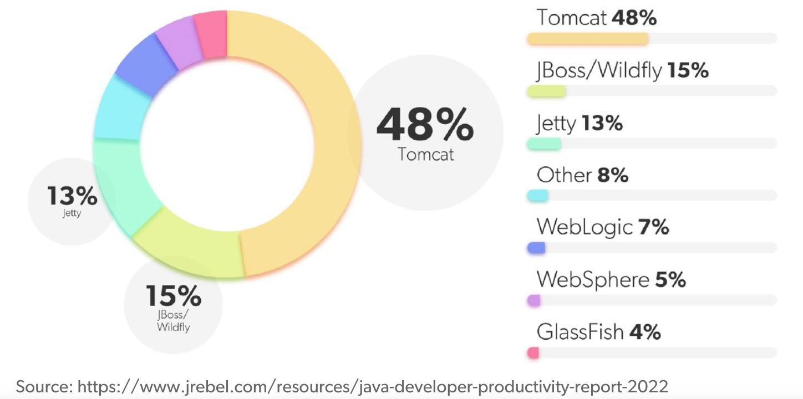

# Servlet

## Intro

A servlet is a Java technology-based Web component (java class), managed by a container (aka servlet engine, e.g., tomcat), that generates dynamic content, implementing `javax.servlet.Servlet` interface.

For detailed servlet specification, please refer to Oracle Java website.

### Web Container

A *web container* is responsible for managing the lifecycle of servlets, mapping a URL to a particular servlet and ensuring that the URL requester has the correct access-rights.

Apache Tomcat (formerly Jakarta Tomcat) is a popular open source web container.

      

 

## Life Cycle

1. Loading and Instantiation

Loading : Loads the Servlet class.

Instantiation : Creates an instance of the Servlet. 

Example: `systemctl restart tomcat` that loads and instantiates web apps.

2. Initialization

The container initializes the Servlet object by invoking the Servlet.init(ServletConfig) method which accepts ServletConfig object reference as parameter.

Example: reading many tomcat's xml files to config the servlet container.

3. Request Handling

It creates the `ServletRequest` and `ServletResponse` objects. If the request is an HTTP, it creates `HttpServletRequest` and `HttpServletResponse` objects, which are subset of `ServletRequest` and `ServletResponse`.

4. Destroying a Servlet

It allows all the threads currently running in the service method of the Servlet instance to complete their jobs and get released.

After the destroy() method is executed, the Servlet container releases all the references of this Servlet instance so that it becomes eligible for garbage collection.

## JAX-RS Client API and Servlet

The JAX-RS (Java API for RESTful Web Services) Client API is a part of the JAX-RS specification (introduced in Java EE 7) that provides a set of APIs for building HTTP-based client applications. 