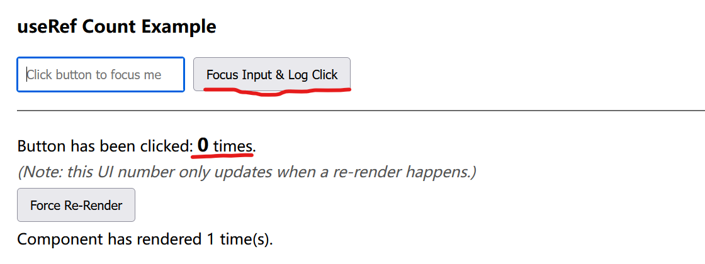
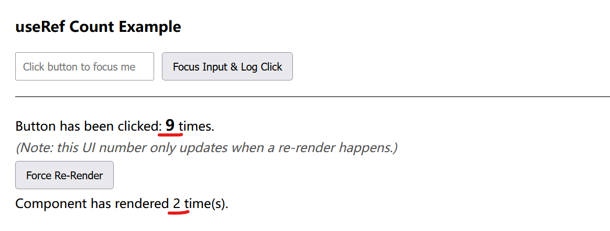

# React Practices

## React Quick Start

### Optional: for China user

Choose one of the below as mirror (for npm)

* `npm config set registry https://registry.npm.taobao.org`
* `npm install -g cnpm --registry=https://registry.npm.taobao.org`

where if by `cnpm`, all next `npm` be replaced with `cnpm`.
For example, instead by `npm init react-app my-app`, go with `cnpm init react-app my-app`.

### Create a new React app

Run one of the below to launch a new react app (remember to replace `npm` with `cnpm` if in China).

* `npx create-react-app my-app`
* `npm init react-app my-app`

### React @17 vs @18 Version

* React 17 example:

```js
import React from "react";
import { render } from "react-dom";
import "./index.css";
import App from "./App";

const root = document.getElementById("root");
render(<App />, root);
```

* React 18 example:

```js
import React from 'react';
import ReactDOM from 'react-dom/client';
import './index.css';
import App from './App';

const root = ReactDOM.createRoot(document.getElementById('root'));
root.render(
  <React.StrictMode>
    <App />
  </React.StrictMode>
);
```

Reference:
https://stackoverflow.com/questions/71913692/module-not-found-error-cant-resolve-react-dom-client

## React Beginner Cautions

### Regular JS Variable vs Hook

Do NOT use hooks, e.g., `useState` as an intermediary shared data between functions, but only pass variable.

For example, despite having `setA('a');`,  the print `console.log(a);` still gives empty string `''`.
This is for state updates are **asynchronous** and batched for performance.

```ts
import React, { useState } from 'react';

const [a, setA] = useState('');
setA('a');
console.log(a); // this outputs empty string ''
```

The print `console.log(a);` runs immediately after the state update `setA('a');` thereafter not yet updated.

Instead of immediately updating the state `a`, the `setA('a');`

1. tells React to schedule an update to that state.
2. To prevent numerous and potentially unnecessary re-renders, React groups multiple state updates into a single re-render.
3. After calling `setA('a')`, the JavaScript engine doesn't pause and wait for React to re-render the component, but just run the next `console.log(a);`.

### Reference vs Copy

In React,

* Deep copy: `const xCopyArr = [...xArr];`
* By reference: `const yArr = xArr;`


## React and Bootstrap

Reference:
https://react-bootstrap.netlify.app/docs/getting-started/introduction

*Bootstrap* is one of the most popular frontend layout packages.

`react-bootstrap` might not always be sync with `react`, so that using lower `react` version is advised.
By 08 Aug 2024, the latest `react` is `@18`, but `react-bootstrap@2.10.4` is compatible with `react@17.0.2`.

### Quick Start

Run `npm install react-bootstrap bootstrap`.

Add `import 'bootstrap/dist/css/bootstrap.min.css';` in `src/index.js` or `App.js` file.

## General React Rendering Rules

### Parent Component Changer Cascading Effect on Child Components

### Deep vs. Shallow Comparison

Re-render decision often boils down to comparing the component's previous props and state with the new ones. The two primary methods for this comparison are "shallow comparison" and "deep comparison."

Different hook methods implement different comparison algos.

#### Shallow Comparison

* For primitive types (like numbers, strings, booleans): A shallow comparison checks if the **values** are identical. For example, 5 is equal to 5, and 'hello' is equal to 'hello'.
* For complex types (like objects and arrays): A shallow comparison checks if the **references** (the location in memory) are the same. It does not check the individual elements or properties within the object or array.

#### Deep Comparison

* It traverses the entire structure of an object or array and compares the values of each nested property or element, based on which comparison is performed.

## Hook

Hooks in react are "state" management, that upon state change, react re-renders the change accordingly.
React only re-renders the state-related components.

### `useState`: only in function-scope

In this example, the component `<p>Count: {count}</p>` changes on UI whenever user presses a button `onClick={() => setCount(count + 1)}`.

```js
import React, { useState } from 'react';

function Counter() {
  const [count, setCount] = useState(0);

  return (
    <div>
      <p>Count: {count}</p>
      <button onClick={() => setCount(count + 1)}>Increment</button>
    </div>
  );
}
```

### `useEffect`: for side effects

It can be said it got triggered on another state change.

For example, when a user presses a button `onClick={() => setCount(count + 1)}`, the state of `count` changes; then, `useEffect` got triggered for it takes `[count]` as the dependent variable: `useEffect(() => {...}, [count])`.

```js
import React, { useState, useEffect } from 'react';

function ButtonPressLogger() {
  const [count, setCount] = useState(0);

  // useEffect to run a side effect whenever 'count' changes (when button is pressed)
  useEffect(() => {
    console.log(`Button pressed ${count} times`);

    // Optionally, you can add cleanup logic here
    return () => {
      console.log(`Cleanup on count ${count}`);
    };
  }, [count]); // This effect depends on the 'count', runs when 'count' changes

  return (
    <div>
      <p>Button has been pressed {count} times</p>
      <button onClick={() => setCount(count + 1)}>Press me</button>
    </div>
  );
}

export default ButtonPressLogger;
```

P.S., if there is no dependent variable such that `useEffect(() => {...}, [])`, the empty array means this will run only on component mount/unmount.

### `useContext`

`useContext` allows access values from a context in React.
`context` means a larger state scope than `useState`'s function state.
It can be used as global states or any custom cross-function scope.

To use it,

1. by `createContext` create a context, inside which some states are defined.
2. define `<*.Provider>` scope in a parent component where the context will be applied, that only in this parent component scope the context states are used.
3. from a child function/component set up `useContext` that loads the state.
  
```js
import React, { createContext, useContext } from 'react';

const ThemeContext = createContext('light');

function DisplayTheme() {
  const theme = useContext(ThemeContext);
  return <p>Current theme: {theme}</p>;
}

function App() {
  return (
    <ThemeContext.Provider value="dark">
      <DisplayTheme />
    </ThemeContext.Provider>
  );
}
```

### `useMemo`

The `useMemo` hook in React is used to optimize application performance by caching the result of a calculation between re-renders. This process, known as memoization.

`useMemo` caches the returned result and directly returns the cached result on invocation unless dependency changes.

This is particularly useful in computation-intense task.
For example, a user may perform various aggregation action (action registered in `someOtherProp`) on a sales data table `salesData`.
Every action will triggers recomputation which is unnecessary and expensive.

```tsx
function SalesReport({ salesData, someOtherProp }) {
  // This calculation runs on every single render
  const aggregatedData = aggregateSalesByCategory(salesData);

  // ... rest of the component to display the table
}
```

The smart solution should be `useMemo`

```tsx
import React, { useMemo } from 'react';

function SalesReport({ salesData, someOtherProp }) {
  const aggregatedData = useMemo(() => {
    console.log("Performing expensive aggregation...");
    // This is a placeholder for your actual aggregation logic
    const aggregation = {};
    salesData.forEach(sale => {
      if (!aggregation[sale.category]) {
        aggregation[sale.category] = 0;
      }
      aggregation[sale.category] += sale.amount;
    });
    return aggregation;
  }, [salesData]); // The dependency array

  // ... rest of the component to display the table
}
```

where

* When `salesData` changes: The aggregation function will run again to compute the new totals.

### `useRef`

`useRef` gives a stable reference to a value that persists for the entire lifetime of component.

For example, in `const myRef = useRef(initialValue);`, this `myRef` object has one property: `.current` that "points" to the value.

It is diff from `useState` regarding: changing `myRef.current` does **not** cause your component to **re-render**.

For example, in the code below `clickCountRef.current` is incremented each time when button is clicked (handled by `handleButtonClick`),

```tsx
function CountExample() {

      const inputRef = useRef(null);
      const clickCountRef = useRef(0);

      const [renderCount, setRenderCount] = useState(0);

      const handleButtonClick = () => {
        if (inputRef.current) {
          inputRef.current.focus();
        }

        // We directly mutate the .current property. This does NOT trigger a re-render.
        clickCountRef.current = clickCountRef.current + 1;
      };

      const forceRender = () => {
        // This button's only job is to prove that our clickCountRef persists across renders.
        setRenderCount(prevCount => prevCount + 1);
      };
      
      return (
        <div>
          <h3>useRef Count Example</h3>
          <input ref={inputRef} type="text" placeholder="Click button to focus me" />
          <button onClick={handleButtonClick}>Focus Input & Log Click</button>
          <hr />
          
          <p>
            Button has been clicked: <strong>{clickCountRef.current}</strong> times.
            <br />
            <em>(Note: this UI number only updates when a re-render happens.)</em>
          </p>

          <button onClick={forceRender}>Force Re-Render</button>
          <p>Component has rendered {renderCount + 1} time(s).</p>
        </div>
      );
    }
```

In `<strong>{clickCountRef.current}</strong>` it is not rendered/shown on UI.
The `clickCountRef.current` has stored the count already but just no re-rendering is triggered.

<div style="display: flex; justify-content: center;">
      
</div>

When user clicked `forceRender` button that hooks by `useState`, the UI page is finally rendered.

<div style="display: flex; justify-content: center;">
      
</div>

### `useCallback`

Consider a parent component that has a counter and a child component that displays a button to increment the counter.

```js
import React, { useState, useCallback } from 'react';

const ChildComponent = React.memo(({ onIncrement }) => {
  console.log('ChildComponent re-rendered');
  return <button onClick={onIncrement}>Increment</button>;
});

const ParentComponent = () => {
  const [count, setCount] = useState(0);
  const [otherState, setOtherState] = useState(false);

  const handleIncrement = useCallback(() => {
    setCount(prevCount => prevCount + 1);
  }, []); // Empty dependency array means the function is created only once

  return (
    <div>
      <p>Count: {count}</p>
      <button onClick={() => setOtherState(!otherState)}>Toggle Other State</button>
      <ChildComponent onIncrement={handleIncrement} />
    </div>
  );
};
```

In this example, without `useCallback`, every time the "Toggle Other State" button is clicked, `ParentComponent` re-renders, and a new `handleIncrement` function is created.
This new function instance would cause `ChildComponent` to re-render, even though the increment logic hasn't changed.

With the implemented `useCallback`, the same function instance is passed to ChildComponent on every render, preventing the unnecessary re-render.

The benefit is that

* When passed a function as a prop to a child component that is wrapped in `React.memo`, `useCallback` is essential. `React.memo` performs a shallow comparison of props to determine if the component should re-render. Without `useCallback`, the function prop would be a new instance on every render, causing the child to re-render unnecessarily.

#### `useCallback` vs `useMemo`

* Use `useCallback` when need to pass a stable function reference to a component.
* Use `useMemo` when  need to memoize the result of an expensive calculation.

## Object, Function and Class

|Function|Object|Class|
|-|-|-|
|`function name() { ... }` or `const fn = () => {}`|`{ key: value, ... }`|`class Counter extends React.Component {...}`|

### Functional vs Class Component

* Class Component

It must include a `render()` method that returns JSX.

```js
class MyComponent extends React.Component {
  render() {
    return <h1>Hello, {this.props.name}!</h1>;
  }
}
```

* Functional Component

No `render()` method.

Lightweight and more concise compared to class components.

```js
function MyComponent(props) {
  return <h1>Hello, {props.name}!</h1>;
}
```

|Function Component|Class Component|
|-|-|-|
|State Mgt|Uses hooks like `useState`|Uses `this.state` and `this.setState()`|
|Lifecycle Methods|Uses hooks like `useEffect` for side effects.|Uses lifecycle methods like `componentDidMount`.|
|Syntax|Simple and Concise|Requires `constructor`, `this`, and `render()`.|
|Performance|Slightly more performant as they avoid class instantiation overhead.|Heavier runtime due to class instantiation.|

## React Router

React provides two router component types:

|`<Route>`|`<Link>`|
|:---|:---|
|Declares which **component to render** for a specific URL path.|	Creates a **clickable element** (an `<a>` tag) that allows users to navigate to a different URL path.|

In the below example, define `<Home />` and `<About />` to render matched against what routing path.

```js
import React from 'react';
import { Routes, Route } from 'react-router-dom'; // Import Routes and Route
import Navbar from './components/Navbar';
import Home from './components/Home';
import About from './components/About';

function App() {
  return (
    <div>
      <Navbar />

      <main>
        <Routes>
          <Route path="/" element={<Home />} />
          <Route path="/about" element={<About />} />
        </Routes>
      </main>
    </div>
  );
}

export default App;
```

`<Link />` is used in navigation bar served as an `<a>` to click.

```js
import React from 'react';
import { Link } from 'react-router-dom'; // Import Link

function Navbar() {
  return (
    <nav style={{ marginBottom: '20px', borderBottom: '1px solid #ccc', paddingBottom: '10px' }}>
      <Link to="/" style={{ marginRight: '15px' }}>Home</Link>
      <Link to="/about">About</Link>
    </nav>
  );
}

export default Navbar;
```

## Common ESLint Warnings and Best Coding Practices

### Using Template Literals

Prefer template literals over string concatenation.

Bad example:

```js
badStr = var1 + " " + var2;
```

Good example:

```js
goodStr = `${var1} ${var2}`;
```
