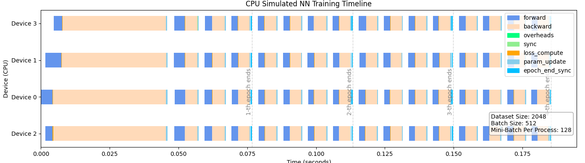
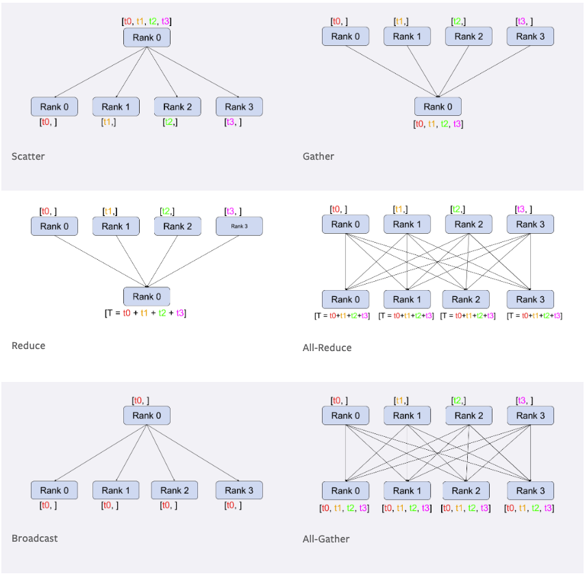

# Pytorch (Distributed) Data Parallel (DDP)

For large models that could not fit in one GPU, needs multiple GPUs to coordinate to compute forward and back propagation.

In DistributedDataParallel, (DDP) training, each process/worker owns a replica of the model and processes a batch of data, finally it uses all-reduce to sum up gradients over different workers.
In DDP the model weights and optimizer states are replicated across all workers.

## Bubble

If a GPU waits for other GPUs to finish computation to sync data, the time slot for this idled GPU is called "bubble".

Typical coordination syncs are

* Batch normalization: the normalization term needs the sum of all batch data, if batch data is split into multiple GPUs, need to sync
* Loss computation: a model loss (assumed one loss per batch) needs all batch data to have done forward computation
* Parameter Updates: need to wait all layers all parameters had done gradient descent
* Some activation functions, e.g., softmax, needs a normalization term which is the sum of all results
* In MoEs structure, need to wait all GPUs having done computation of experts, only from which the TopK can get selected

### Bubbles in DDP for Small Models

Small models are those with parameter sizes small enough that each process can replicate the whole model to its memory.
This simplifies distributed model training that mini-batch whole-flow (forward+backward) computation is independent, and only parameter update needs to be sync at each time a batch is done training.

Bubbles in this context are *gradient sync* that processes need to wait for all processes done whole-flow (forward+backward) computation.

The **gradient sync** is by **averaging** the gradients from all processes

$$
\Delta W = \eta\frac{1}{N}\sum^N_{i=1} \nabla f_i
$$

where

* $f_i$ is the neural network copied to the $i$-th process
* $N$ is the number of processes (world size).
* $\eta$ is learning rate
* $\Delta W$ is the network parameter update amount

The averaging gradient approach prevents divergence in training in which if a mini batch's gradient does not agree with other mini batches', this mini batch trained network may see opposite parameter update direction compared to others, leading to training instability.

In below example regardless of how fast forward, loss and backward computation are done, by the end of backward propagation, the parameter update action is all sync across multi processes.

      

 

## Collective Communication

Common collective communications:

      

 

### Ring-Allreduce

Ring-Allreduce is an efficient, bandwidth-optimized algorithm used for collective communication to sum gradients across multiple GPUs.

1. Chunking:

Each GPU splits its gradients into $N$ chunks.

2. Initial Send/Receive:

$\text{GPU}\_i$ sends its chunk to $\text{GPU}\_{i+1} \mod N$

$\text{GPU}\_i$ receives a chunk from $\text{GPU}\_{i-1} \mod N$

The received chunk is added to the GPU's existing gradient chunk.

3. Rotation:

This send/receive and add process continues for $N-1$ steps.

After each step, the chunks are rotated in the ring.

4. Final Scatter:

Each GPU has the sum of all gradients.

The sum is evenly distributed across GPUs.

## Auto Gradient and Hook

Hooks let user inspect, modify, or log gradients during the backward pass.

After the backward pass, gradients from all processes are automatically synchronized (usually averaged) to ensure consistent updates.

Under the hood, DDP leverages the autograd system by attaching gradient hooks that perform all-reduce operations on the computed gradients.
This happens as part of the backward pass, ensuring that each process contributes to a consistent gradient update.
